# 系统信息面板

<cite>
**本文档引用的文件**
- [SystemInfoPanel.jsx](file://src/components/panels/SystemInfoPanel.jsx)
- [HardwareAbstractionLayer.cs](file://server/hal/HardwareAbstractionLayer.cs)
- [Program.cs](file://server/api/Program.cs)
- [DriverBridge.cs](file://server/hal/DriverBridge.cs)
- [WmiInterface.cs](file://server/api/WmiInterface.cs)
- [TelemetryBackgroundService.cs](file://server/api/TelemetryBackgroundService.cs)
- [GpuController.cs](file://server/hal/GpuController.cs)
- [CpuAffinityManager.cs](file://server/hal/CpuAffinityManager.cs)
- [Card.jsx](file://src/components/ui/Card.jsx)
- [dashboard-default.json](file://server/config/dashboard-default.json)
- [ui-state.json](file://server/api/config/ui-state.json)
</cite>

## 目录
1. [简介](#简介)
2. [项目结构](#项目结构)
3. [核心组件](#核心组件)
4. [架构概览](#架构概览)
5. [详细组件分析](#详细组件分析)
6. [依赖关系分析](#依赖关系分析)
7. [性能考虑](#性能考虑)
8. [故障排查指南](#故障排查指南)
9. [结论](#结论)

## 简介

系统信息面板是 Douzhanzhe Control 系统中的核心组件之一，负责收集和展示计算机硬件配置信息。该组件实现了完整的硬件信息采集、处理和展示功能，包括CPU型号、GPU信息、内存规格和存储设备详情等系统硬件信息。

系统信息面板采用前后端分离架构，前端使用React构建用户界面，后端基于.NET 8.0提供RESTful API服务。通过硬件抽象层(HAL)实现跨平台硬件访问，支持多种硬件厂商和型号的兼容性检测。

## 项目结构

系统信息面板位于前端React应用的组件目录中，采用模块化设计：

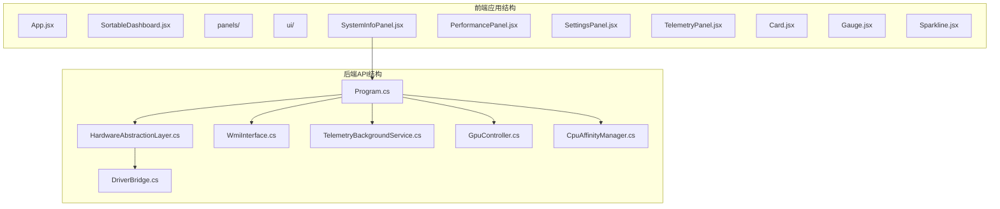

**图表来源**
- [SystemInfoPanel.jsx:1-59](file://src/components/panels/SystemInfoPanel.jsx#L1-L59)
- [Program.cs:1-783](file://server/api/Program.cs#L1-L783)

**章节来源**
- [SystemInfoPanel.jsx:1-59](file://src/components/panels/SystemInfoPanel.jsx#L1-L59)
- [Program.cs:10-14](file://server/api/Program.cs#L10-L14)

## 核心组件

系统信息面板由多个核心组件协同工作，实现完整的硬件信息收集和展示功能：

### 前端组件架构

前端系统信息面板采用函数式组件设计，使用React Hooks管理状态和生命周期：

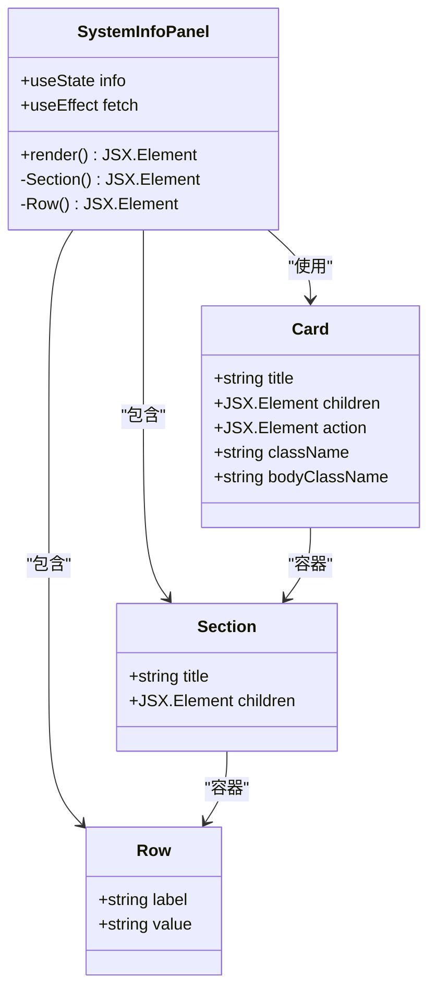

**图表来源**
- [SystemInfoPanel.jsx:4-59](file://src/components/panels/SystemInfoPanel.jsx#L4-L59)
- [Card.jsx:1-18](file://src/components/ui/Card.jsx#L1-L18)

### 后端API架构

后端提供RESTful API服务，通过硬件抽象层访问底层硬件信息：

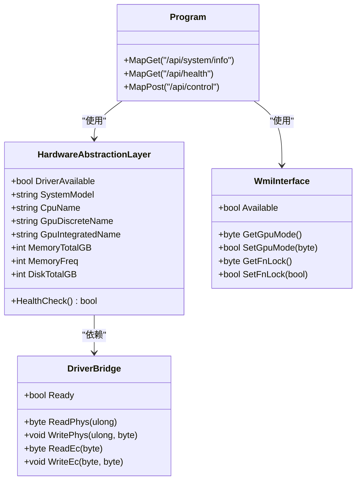

**图表来源**
- [HardwareAbstractionLayer.cs:19-772](file://server/hal/HardwareAbstractionLayer.cs#L19-L772)
- [DriverBridge.cs:9-150](file://server/hal/DriverBridge.cs#L9-L150)
- [WmiInterface.cs:18-210](file://server/api/WmiInterface.cs#L18-L210)
- [Program.cs:121-143](file://server/api/Program.cs#L121-L143)

**章节来源**
- [SystemInfoPanel.jsx:1-59](file://src/components/panels/SystemInfoPanel.jsx#L1-L59)
- [HardwareAbstractionLayer.cs:19-772](file://server/hal/HardwareAbstractionLayer.cs#L19-L772)

## 架构概览

系统信息面板采用分层架构设计，确保系统的可维护性和扩展性：

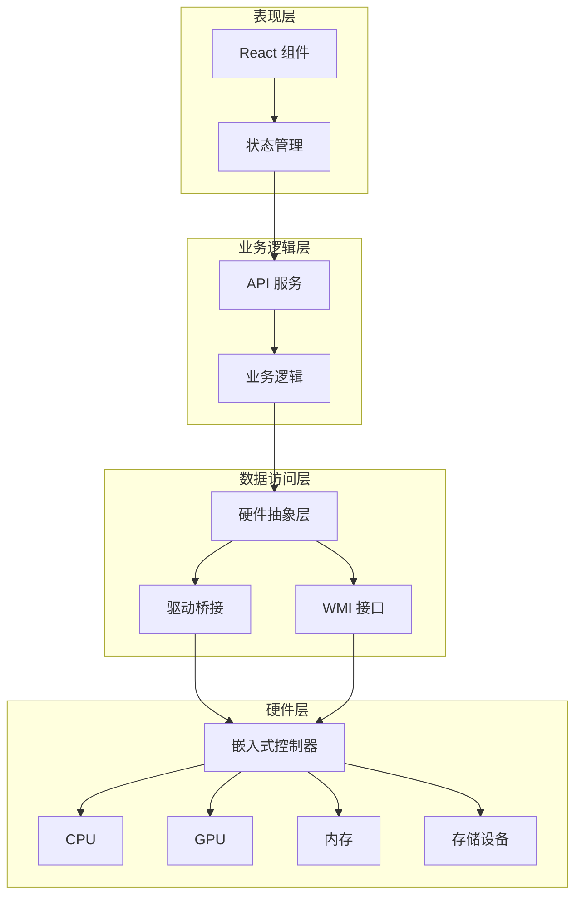

**图表来源**
- [Program.cs:1-783](file://server/api/Program.cs#L1-L783)
- [HardwareAbstractionLayer.cs:1-772](file://server/hal/HardwareAbstractionLayer.cs#L1-L772)
- [DriverBridge.cs:1-150](file://server/hal/DriverBridge.cs#L1-L150)

系统信息面板的完整数据流如下：

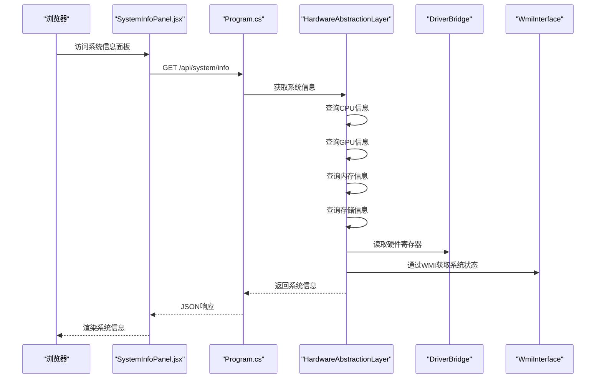

**图表来源**
- [SystemInfoPanel.jsx:7-12](file://src/components/panels/SystemInfoPanel.jsx#L7-L12)
- [Program.cs:121-135](file://server/api/Program.cs#L121-L135)
- [HardwareAbstractionLayer.cs:456-574](file://server/hal/HardwareAbstractionLayer.cs#L456-L574)

**章节来源**
- [Program.cs:121-135](file://server/api/Program.cs#L121-L135)
- [SystemInfoPanel.jsx:7-12](file://src/components/panels/SystemInfoPanel.jsx#L7-L12)

## 详细组件分析

### 系统信息面板组件

系统信息面板是前端的核心组件，负责展示计算机硬件配置信息：

#### 数据结构设计

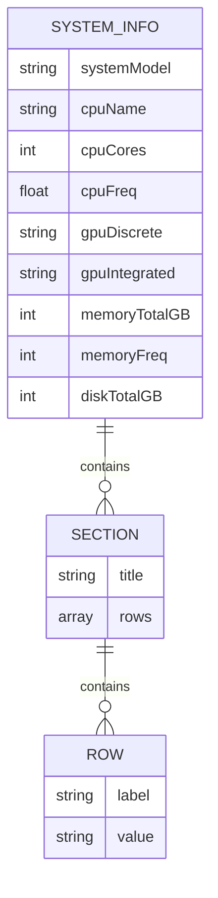

**图表来源**
- [Program.cs:123-134](file://server/api/Program.cs#L123-L134)

#### 组件渲染流程

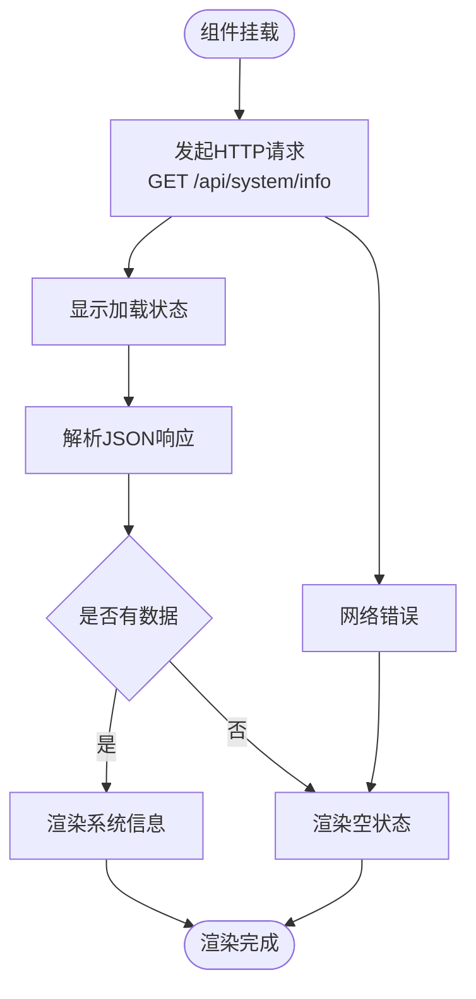

**图表来源**
- [SystemInfoPanel.jsx:7-12](file://src/components/panels/SystemInfoPanel.jsx#L7-L12)

#### 硬件信息采集机制

后端硬件抽象层提供了完整的硬件信息采集能力：

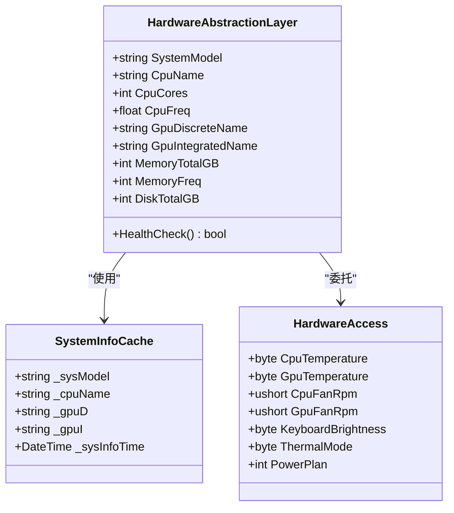

**图表来源**
- [HardwareAbstractionLayer.cs:38-772](file://server/hal/HardwareAbstractionLayer.cs#L38-L772)

**章节来源**
- [SystemInfoPanel.jsx:16-39](file://src/components/panels/SystemInfoPanel.jsx#L16-L39)
- [HardwareAbstractionLayer.cs:456-574](file://server/hal/HardwareAbstractionLayer.cs#L456-L574)

### 硬件抽象层实现

硬件抽象层是系统的核心组件，提供了统一的硬件访问接口：

#### 硬件驱动管理

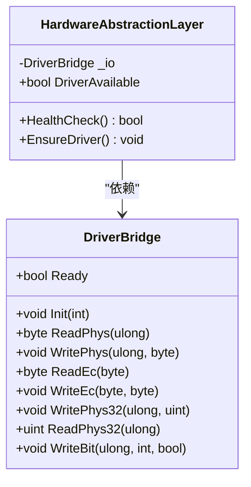

**图表来源**
- [DriverBridge.cs:9-150](file://server/hal/DriverBridge.cs#L9-L150)
- [HardwareAbstractionLayer.cs:48-57](file://server/hal/HardwareAbstractionLayer.cs#L48-L57)

#### 系统信息查询

硬件抽象层提供了多种系统信息查询方法：

| 查询类型 | 方法名 | 数据源 | 缓存策略 |
|---------|--------|--------|----------|
| 系统型号 | SystemModel | PowerShell WMI | 10秒缓存 |
| CPU名称 | CpuName | PowerShell WMI | 10秒缓存 |
| GPU名称 | GpuDiscreteName/GpuIntegratedName | PowerShell WMI | 10秒缓存 |
| 内存信息 | MemoryTotalGB/MemoryFreq | PowerShell WMI | 2秒缓存 |
| 存储信息 | DiskTotalGB/DiskFreeGB | DriveInfo | 5秒缓存 |

**章节来源**
- [HardwareAbstractionLayer.cs:456-747](file://server/hal/HardwareAbstractionLayer.cs#L456-L747)

### GPU控制器组件

GPU控制器专门处理NVIDIA GPU相关的操作：

#### GPU频率控制

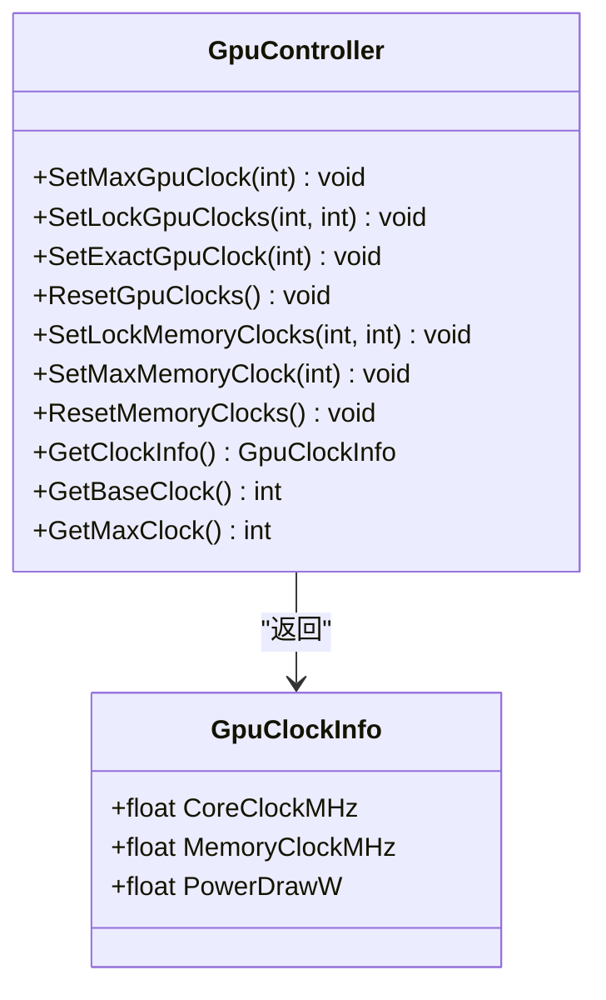

**图表来源**
- [GpuController.cs:10-116](file://server/hal/GpuController.cs#L10-L116)

**章节来源**
- [GpuController.cs:42-107](file://server/hal/GpuController.cs#L42-L107)

### CPU亲和性管理器

CPU亲和性管理器用于控制进程的CPU核心使用：

#### 核心限制机制

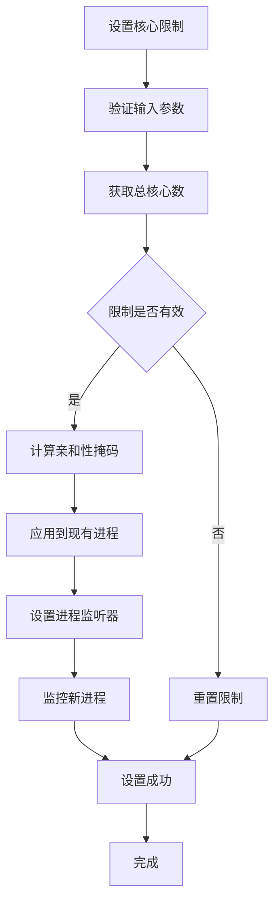

**图表来源**
- [CpuAffinityManager.cs:25-53](file://server/hal/CpuAffinityManager.cs#L25-L53)

**章节来源**
- [CpuAffinityManager.cs:15-101](file://server/hal/CpuAffinityManager.cs#L15-L101)

## 依赖关系分析

系统信息面板的依赖关系复杂且层次清晰：

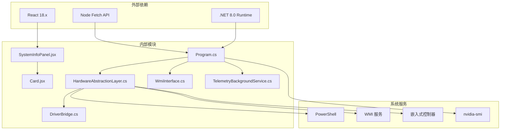

**图表来源**
- [SystemInfoPanel.jsx:1](file://src/components/panels/SystemInfoPanel.jsx#L1)
- [Program.cs:1-783](file://server/api/Program.cs#L1-L783)

### 组件耦合度分析

系统信息面板采用了松耦合的设计原则：

| 组件 | 耦合类型 | 说明 | 影响程度 |
|------|----------|------|----------|
| SystemInfoPanel | 低耦合 | 仅依赖API接口 | 无 |
| HardwareAbstractionLayer | 中等耦合 | 依赖DriverBridge和WMI | 高 |
| DriverBridge | 高耦合 | 依赖底层驱动 | 高 |
| WmiInterface | 中等耦合 | 依赖WMI服务 | 中 |
| Program | 低耦合 | 仅作为API入口 | 无 |

**章节来源**
- [Program.cs:10-14](file://server/api/Program.cs#L10-L14)
- [HardwareAbstractionLayer.cs:48-57](file://server/hal/HardwareAbstractionLayer.cs#L48-L57)

## 性能考虑

系统信息面板在设计时充分考虑了性能优化：

### 缓存策略

硬件抽象层实现了多级缓存机制：

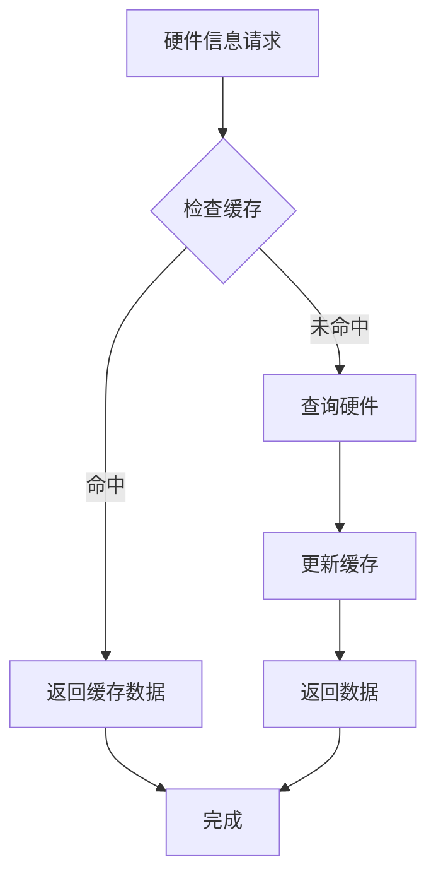

**图表来源**
- [HardwareAbstractionLayer.cs:460-482](file://server/hal/HardwareAbstractionLayer.cs#L460-L482)

### 更新频率控制

不同硬件信息具有不同的更新频率：

| 硬件类型 | 缓存间隔 | 更新原因 | 性能影响 |
|----------|----------|----------|----------|
| CPU温度 | 2秒 | 实时监控 | 高 |
| GPU温度 | 2秒 | 实时监控 | 高 |
| CPU使用率 | 2秒 | 实时监控 | 高 |
| 内存使用率 | 2秒 | 实时监控 | 高 |
| 磁盘使用率 | 5秒 | 稳定变化 | 中 |
| 系统信息 | 10秒 | 静态信息 | 低 |

**章节来源**
- [HardwareAbstractionLayer.cs:584-653](file://server/hal/HardwareAbstractionLayer.cs#L584-L653)
- [TelemetryBackgroundService.cs:62-62](file://server/api/TelemetryBackgroundService.cs#L62-L62)

## 故障排查指南

### 常见问题及解决方案

#### 硬件驱动问题

**问题症状**：系统信息显示为默认值或部分字段为空

**诊断步骤**：
1. 检查DriverBridge初始化状态
2. 验证inpoutx64驱动是否加载
3. 确认EC寄存器访问权限

**解决方案**：
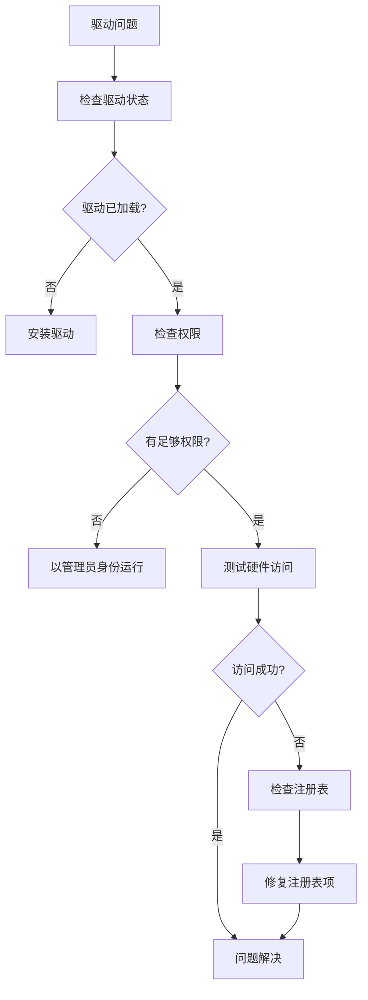

**图表来源**
- [DriverBridge.cs:39-62](file://server/hal/DriverBridge.cs#L39-L62)

#### WMI接口问题

**问题症状**：系统开关状态无法获取或设置

**诊断步骤**：
1. 检查WMI服务状态
2. 验证MICommonInterface可用性
3. 确认权限设置

**解决方案**：
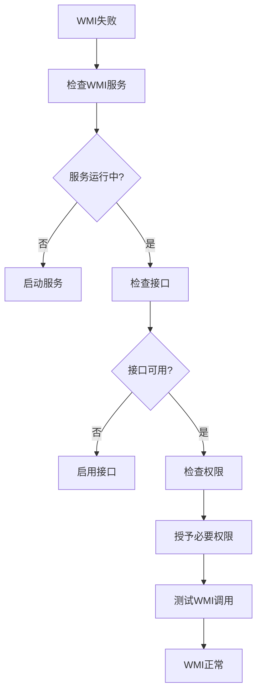

**图表来源**
- [WmiInterface.cs:24-48](file://server/api/WmiInterface.cs#L24-L48)

#### 网络通信问题

**问题症状**：系统信息面板无法加载数据

**诊断步骤**：
1. 检查API服务器状态
2. 验证CORS配置
3. 确认防火墙设置

**解决方案**：
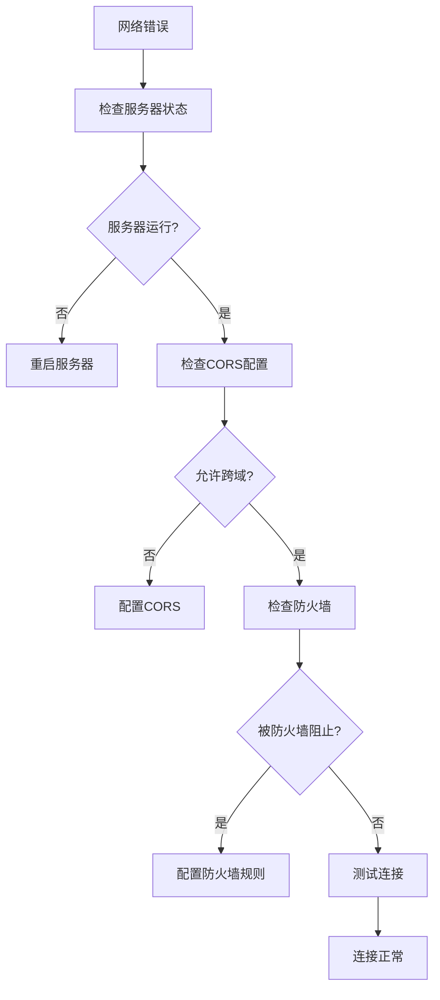

**图表来源**
- [Program.cs:15-18](file://server/api/Program.cs#L15-L18)

**章节来源**
- [HardwareAbstractionLayer.cs:754-765](file://server/hal/HardwareAbstractionLayer.cs#L754-L765)
- [WmiInterface.cs:18-48](file://server/api/WmiInterface.cs#L18-L48)

## 结论

系统信息面板组件展现了优秀的软件工程实践，通过以下关键特性实现了高质量的系统硬件信息展示：

### 技术优势

1. **模块化设计**：采用分层架构，各组件职责明确，便于维护和扩展
2. **硬件抽象**：通过硬件抽象层实现跨平台兼容性
3. **性能优化**：多级缓存机制确保系统响应速度
4. **错误处理**：完善的异常处理和降级策略
5. **安全性**：合理的权限管理和安全访问控制

### 架构特点

- **前后端分离**：前端专注于用户体验，后端专注数据处理
- **异步处理**：充分利用Promise和async/await提升性能
- **状态管理**：合理使用React Hooks管理组件状态
- **API设计**：RESTful API设计符合现代Web标准

### 改进建议

1. **增加数据验证**：在前端和后端都增加数据验证机制
2. **增强日志记录**：添加更详细的日志记录以便故障排查
3. **单元测试**：为关键组件添加单元测试覆盖率
4. **监控告警**：集成系统监控和告警机制

系统信息面板组件为整个Douzhanzhe Control系统提供了坚实的基础，其设计原则和实现方式可以作为类似系统开发的参考模板。