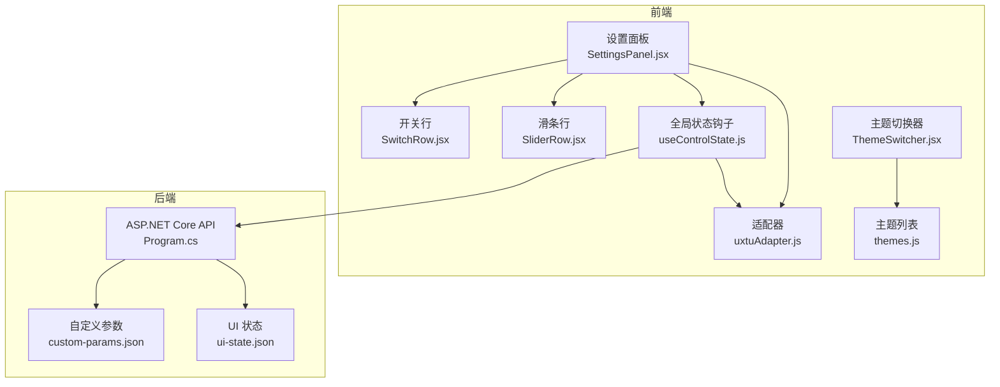
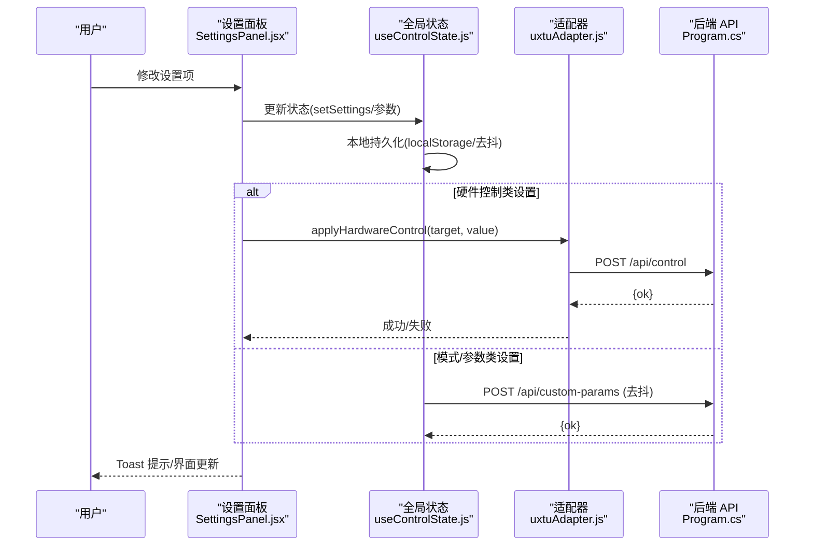
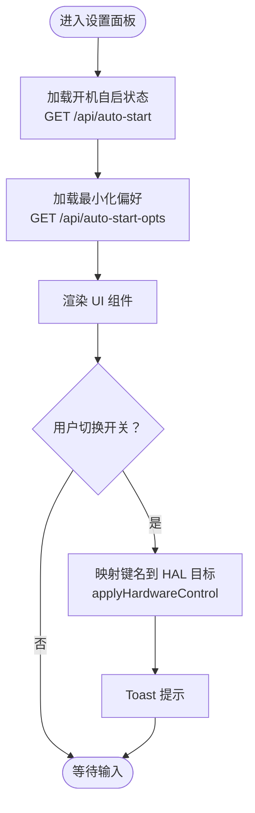
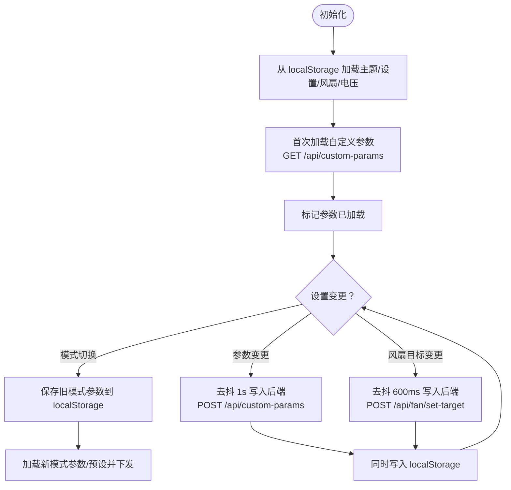
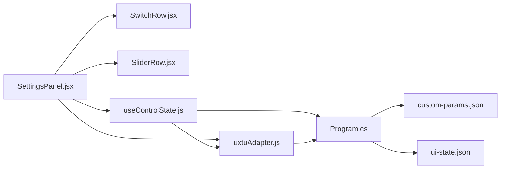

# 设置面板

<cite>
**本文引用的文件**
- [SettingsPanel.jsx](file://src/components/panels/SettingsPanel.jsx)
- [useControlState.js](file://src/hooks/useControlState.js)
- [uxtuAdapter.js](file://src/services/uxtuAdapter.js)
- [SwitchRow.jsx](file://src/components/ui/SwitchRow.jsx)
- [SliderRow.jsx](file://src/components/ui/SliderRow.jsx)
- [themes.js](file://src/data/themes.js)
- [ThemeSwitcher.jsx](file://src/components/ThemeSwitcher.jsx)
- [Program.cs](file://server/api/Program.cs)
- [custom-params.json](file://server/api/config/custom-params.json)
- [ui-state.json](file://server/api/config/ui-state.json)
</cite>

## 目录
1. [简介](#简介)
2. [项目结构](#项目结构)
3. [核心组件](#核心组件)
4. [架构总览](#架构总览)
5. [详细组件分析](#详细组件分析)
6. [依赖关系分析](#依赖关系分析)
7. [性能考量](#性能考量)
8. [故障排查指南](#故障排查指南)
9. [结论](#结论)
10. [附录](#附录)

## 简介
本文件聚焦“设置面板”组件，系统性阐述以下内容：
- 系统配置选项的实现：开机自启动、界面主题、通知设置等
- 设置项的数据持久化机制：本地存储、配置文件管理与同步策略
- 表单验证与错误处理：输入校验、默认值处理、恢复机制
- 设置变更的实时生效与重启需求管理
- 新设置项的添加流程与配置项分类管理
- 用户偏好存储与多用户环境支持方案

## 项目结构
设置面板位于前端 React 组件层，配合全局状态钩子与后端 API 实现完整的配置闭环。核心文件分布如下：
- 前端设置面板与表单组件：SettingsPanel.jsx、SwitchRow.jsx、SliderRow.jsx
- 全局状态与持久化：useControlState.js
- 适配器与后端交互：uxtuAdapter.js
- 主题与主题切换：themes.js、ThemeSwitcher.jsx
- 后端 API 与配置文件：Program.cs、custom-params.json、ui-state.json

图表来源
- [SettingsPanel.jsx:1-124](file://src/components/panels/SettingsPanel.jsx#L1-L124)
- [SwitchRow.jsx:1-21](file://src/components/ui/SwitchRow.jsx#L1-L21)
- [SliderRow.jsx:1-23](file://src/components/ui/SliderRow.jsx#L1-L23)
- [useControlState.js:1-355](file://src/hooks/useControlState.js#L1-L355)
- [uxtuAdapter.js:1-130](file://src/services/uxtuAdapter.js#L1-L130)
- [themes.js:1-34](file://src/data/themes.js#L1-L34)
- [ThemeSwitcher.jsx:1-23](file://src/components/ThemeSwitcher.jsx#L1-L23)
- [Program.cs:1-783](file://server/api/Program.cs#L1-L783)
- [custom-params.json:1-22](file://server/api/config/custom-params.json#L1-L22)
- [ui-state.json:1-17](file://server/api/config/ui-state.json#L1-L17)

章节来源
- [SettingsPanel.jsx:1-124](file://src/components/panels/SettingsPanel.jsx#L1-L124)
- [useControlState.js:1-355](file://src/hooks/useControlState.js#L1-L355)
- [uxtuAdapter.js:1-130](file://src/services/uxtuAdapter.js#L1-L130)
- [Program.cs:1-783](file://server/api/Program.cs#L1-L783)

## 核心组件
- 设置面板组件：负责渲染系统开关、开机自启、键盘灯亮度、当前策略摘要与关于信息，并通过适配器下发硬件控制指令。
- 全局状态钩子：统一管理主题、设置、参数、历史遥测与持久化策略，提供去抖与跨模式参数记忆。
- 适配器：封装后端 API 调用，包括硬件控制、SMU 参数下发、遥测获取与 WebSocket 连接。
- UI 表单组件：开关与滑条，提供基础交互与样式。
- 主题系统：主题枚举与切换器，支持用户选择不同视觉风格。

章节来源
- [SettingsPanel.jsx:1-124](file://src/components/panels/SettingsPanel.jsx#L1-L124)
- [useControlState.js:1-355](file://src/hooks/useControlState.js#L1-L355)
- [uxtuAdapter.js:1-130](file://src/services/uxtuAdapter.js#L1-L130)
- [SwitchRow.jsx:1-21](file://src/components/ui/SwitchRow.jsx#L1-L21)
- [SliderRow.jsx:1-23](file://src/components/ui/SliderRow.jsx#L1-L23)
- [themes.js:1-34](file://src/data/themes.js#L1-L34)
- [ThemeSwitcher.jsx:1-23](file://src/components/ThemeSwitcher.jsx#L1-L23)

## 架构总览
设置面板的前后端交互遵循“前端变更 → 本地持久化/去抖 → 后端下发”的闭环：
- 前端变更：用户在设置面板修改开关或滑条值
- 本地持久化：立即写入 localStorage 或延迟写入后端 JSON 文件
- 后端下发：通过 /api/control、/api/uxtu/apply 等端点下发至 HAL/SMU/GPU/WMI
- 实时反馈：Toast 提示与 UI 状态更新

图表来源
- [SettingsPanel.jsx:1-124](file://src/components/panels/SettingsPanel.jsx#L1-L124)
- [useControlState.js:144-169](file://src/hooks/useControlState.js#L144-L169)
- [uxtuAdapter.js:36-44](file://src/services/uxtuAdapter.js#L36-L44)
- [Program.cs:144-202](file://server/api/Program.cs#L144-L202)
- [Program.cs:542-552](file://server/api/Program.cs#L542-L552)

## 详细组件分析

### 设置面板组件（SettingsPanel）
职责与行为
- 渲染系统开关（数字键锁定、大写锁定、触摸板锁定、Fn 锁定）
- 渲染开机自启动与最小化偏好开关，并通过 /api/auto-start 与 /api/auto-start-opts 管理
- 渲染键盘灯亮度滑条（0-3），并映射为硬件控制
- 展示当前策略摘要（来自 uxtuPayload）
- 对 OSD 关闭提示“暂不支持”，并记录警告

关键交互
- 切换开关时调用 toggleSetting，更新本地状态并根据键名映射到 HAL 控制
- 硬件控制映射表：fnLock→fn_lock、numLock→num_lock、capsLock→caps_lock、kbBrightnessLevel→kb_light、gpuOnly→igpu_only、touchpadLock→touchpad_lock、dGpuDirect→gpu_mode（布尔映射为 0/1，其中 dGpuDirect 特殊映射为 0/2）

图表来源
- [SettingsPanel.jsx:8-48](file://src/components/panels/SettingsPanel.jsx#L8-L48)
- [SettingsPanel.jsx:49-73](file://src/components/panels/SettingsPanel.jsx#L49-L73)
- [uxtuAdapter.js:36-44](file://src/services/uxtuAdapter.js#L36-L44)

章节来源
- [SettingsPanel.jsx:1-124](file://src/components/panels/SettingsPanel.jsx#L1-L124)
- [uxtuAdapter.js:1-130](file://src/services/uxtuAdapter.js#L1-L130)

### 全局状态与持久化（useControlState）
职责与行为
- 主题与设置项的本地持久化：localStorage 键值如 douzhanzhe_theme、douzhanzhe_settings
- 自定义参数持久化：仅在“自定义”模式下，通过去抖 1s 写入后端 custom-params.json
- 模式切换：保存当前模式参数到 localStorage，加载新模式记忆或预设，并自动下发到 SMU
- 风扇目标转速：去抖 600ms 写入后端 /api/fan/set-target
- 电压偏移：无论模式如何均持久化到 localStorage
- 历史遥测：维护最近 60 条数据，用于曲线展示

持久化策略
- localStorage：主题、设置、风扇目标、电压偏移、各模式独立参数记忆
- 后端 JSON：自定义参数（custom-params.json）、UI 状态（ui-state.json）

图表来源
- [useControlState.js:26-169](file://src/hooks/useControlState.js#L26-L169)
- [Program.cs:538-552](file://server/api/Program.cs#L538-L552)
- [Program.cs:345-367](file://server/api/Program.cs#L345-L367)

章节来源
- [useControlState.js:1-355](file://src/hooks/useControlState.js#L1-L355)
- [Program.cs:1-783](file://server/api/Program.cs#L1-L783)

### 适配器与后端交互（uxtuAdapter）
职责与行为
- applyHardwareControl：将前端设置映射为 HAL 控制请求（/api/control）
- applyUxtuLimits：将参数下发到 SMU（/api/uxtu/apply）
- createTelemetrySocket：建立 WebSocket 连接以接收实时遥测
- MODE_PRESETS：提供各模式的默认参数集合

章节来源
- [uxtuAdapter.js:1-130](file://src/services/uxtuAdapter.js#L1-L130)
- [Program.cs:463-494](file://server/api/Program.cs#L463-L494)

### UI 表单组件（SwitchRow、SliderRow）
职责与行为
- SwitchRow：渲染开关行，支持点击切换并回调 onChange
- SliderRow：渲染滑条，支持最小值、最大值、步进与单位显示

章节来源
- [SwitchRow.jsx:1-21](file://src/components/ui/SwitchRow.jsx#L1-L21)
- [SliderRow.jsx:1-23](file://src/components/ui/SliderRow.jsx#L1-L23)

### 主题系统（themes、ThemeSwitcher）
职责与行为
- themes：提供主题枚举列表
- ThemeSwitcher：基于枚举生成下拉框，触发 onThemeChange 回调
- useControlState：默认主题为“机甲紫黑”，持久化到 localStorage

章节来源
- [themes.js:1-34](file://src/data/themes.js#L1-L34)
- [ThemeSwitcher.jsx:1-23](file://src/components/ThemeSwitcher.jsx#L1-L23)
- [useControlState.js:29](file://src/hooks/useControlState.js#L29)

## 依赖关系分析
设置面板与全局状态、适配器、后端 API 的依赖关系如下：

图表来源
- [SettingsPanel.jsx:1-124](file://src/components/panels/SettingsPanel.jsx#L1-L124)
- [useControlState.js:1-355](file://src/hooks/useControlState.js#L1-L355)
- [uxtuAdapter.js:1-130](file://src/services/uxtuAdapter.js#L1-L130)
- [Program.cs:1-783](file://server/api/Program.cs#L1-L783)
- [custom-params.json:1-22](file://server/api/config/custom-params.json#L1-L22)
- [ui-state.json:1-17](file://server/api/config/ui-state.json#L1-L17)

章节来源
- [SettingsPanel.jsx:1-124](file://src/components/panels/SettingsPanel.jsx#L1-L124)
- [useControlState.js:1-355](file://src/hooks/useControlState.js#L1-L355)
- [uxtuAdapter.js:1-130](file://src/services/uxtuAdapter.js#L1-L130)
- [Program.cs:1-783](file://server/api/Program.cs#L1-L783)

## 性能考量
- 去抖优化：风扇目标与自定义参数写入分别采用 600ms 与 1s 去抖，减少频繁网络请求与硬件写入
- 历史数据截断：历史遥测最多保留 60 条，避免内存膨胀
- WebSocket 实时遥测：后端每 250ms 推送全量遥测，前端合并增量更新，降低计算负担
- 模式切换：仅在非“自定义”模式下记忆参数，避免冗余持久化

## 故障排查指南
常见问题与定位建议
- 开机自启动失败
  - 检查 /api/auto-start 与 /api/auto-start-opts 是否返回成功
  - 确认 Windows 任务计划程序中是否存在“DouzhanzheControl”任务
  - 查看 Program.cs 中 TaskScheduler 使用与 Shell 可执行文件路径解析逻辑
- 硬件控制无效
  - 确认 /api/control 返回 {ok:true}
  - 检查 HAL 与 WMI 接口可用性，必要时启用调试页面
- 自定义参数未生效
  - 确认当前模式为“自定义”
  - 检查 /api/custom-params 是否正确写入 custom-params.json
- SMU 参数下发失败
  - 检查 WinRing0 驱动是否加载成功
  - 使用 /api/smu/probe 与 /api/smu/status 验证 SMU 可用性
- UI 状态不同步
  - 检查 /api/ui-state 的读写是否正常
  - 确认前端 useControlState 中 UI 状态加载逻辑

章节来源
- [Program.cs:621-686](file://server/api/Program.cs#L621-L686)
- [Program.cs:586-618](file://server/api/Program.cs#L586-L618)
- [Program.cs:538-552](file://server/api/Program.cs#L538-L552)
- [Program.cs:287-298](file://server/api/Program.cs#L287-L298)
- [Program.cs:692-723](file://server/api/Program.cs#L692-L723)

## 结论
设置面板通过“前端状态 + 本地持久化 + 后端下发”的设计，实现了高可用、低耦合的配置管理闭环。其去抖策略与模式记忆机制有效平衡了用户体验与系统稳定性。后续扩展可通过统一的映射表与去抖策略快速集成新设置项。

## 附录

### 设置项数据持久化机制
- 本地存储（localStorage）
  - 主题：douzhanzhe_theme
  - 设置：douzhanzhe_settings
  - 风扇目标：douzhanzhe_fan_large、douzhanzhe_fan_small
  - 电压偏移：douzhanzhe_voltage_offset
  - 各模式独立参数：douzhanzhe_params_{mode}
- 后端配置文件
  - 自定义参数：server/api/config/custom-params.json
  - UI 状态：server/api/config/ui-state.json

章节来源
- [useControlState.js:5-22](file://src/hooks/useControlState.js#L5-L22)
- [useControlState.js:128-138](file://src/hooks/useControlState.js#L128-L138)
- [useControlState.js:109-110](file://src/hooks/useControlState.js#L109-L110)
- [useControlState.js:148](file://src/hooks/useControlState.js#L148)
- [useControlState.js:181-189](file://src/hooks/useControlState.js#L181-L189)
- [Program.cs:29-55](file://server/api/Program.cs#L29-L55)
- [custom-params.json:1-22](file://server/api/config/custom-params.json#L1-L22)
- [ui-state.json:1-17](file://server/api/config/ui-state.json#L1-L17)

### 设置变更的实时生效与重启需求管理
- 实时生效
  - 硬件控制：/api/control 直接下发，立即生效
  - SMU 参数：/api/uxtu/apply 下发，立即生效
  - 风扇目标：/api/fan/set-target 下发，立即生效
- 重启需求
  - 开机自启动：通过 Windows 任务计划程序管理，需管理员权限
  - 主题与 UI 状态：纯前端配置，无需重启
  - 自定义参数：写入后端 JSON，重启后仍可加载

章节来源
- [SettingsPanel.jsx:23-48](file://src/components/panels/SettingsPanel.jsx#L23-L48)
- [Program.cs:144-202](file://server/api/Program.cs#L144-L202)
- [Program.cs:463-494](file://server/api/Program.cs#L463-L494)
- [Program.cs:345-367](file://server/api/Program.cs#L345-L367)
- [Program.cs:621-686](file://server/api/Program.cs#L621-L686)

### 新设置项的添加流程与配置项分类管理
- 添加步骤
  - 在 SettingsPanel 中新增 UI 行组件（开关/滑条）
  - 在 toggleSetting 中增加键名映射或新增分支
  - 若为硬件控制，确认 HAL 目标与值映射
  - 若为参数类设置，决定是否加入去抖与后端持久化
- 分类管理
  - 硬件控制类：/api/control（如 kb_light、fn_lock、num_lock、caps_lock、igpu_only、touchpad_lock、gpu_mode）
  - 参数类：/api/custom-params（自定义模式下持久化）
  - UI 类：/api/ui-state（卡片顺序与隐藏）
  - 系统类：/api/auto-start、/api/auto-start-opts（开机自启动与最小化偏好）

章节来源
- [SettingsPanel.jsx:49-73](file://src/components/panels/SettingsPanel.jsx#L49-L73)
- [Program.cs:144-202](file://server/api/Program.cs#L144-L202)
- [Program.cs:538-552](file://server/api/Program.cs#L538-L552)
- [Program.cs:553-568](file://server/api/Program.cs#L553-L568)
- [Program.cs:586-618](file://server/api/Program.cs#L586-L618)

### 用户偏好存储与多用户环境支持
- 用户偏好存储
  - localStorage：主题、设置、风扇目标、电压偏移、各模式参数记忆
  - 后端 JSON：自定义参数、UI 状态
- 多用户支持
  - 当前实现基于单用户 localStorage 与共享配置目录
  - 建议：为每个用户隔离配置目录（例如按用户 SID 或用户名命名），并在 Program.cs 中动态定位配置路径，避免冲突

章节来源
- [useControlState.js:5-22](file://src/hooks/useControlState.js#L5-L22)
- [Program.cs:24-27](file://server/api/Program.cs#L24-L27)