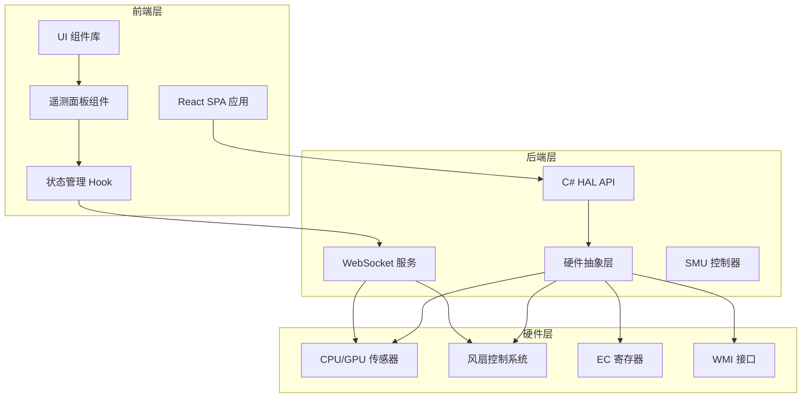
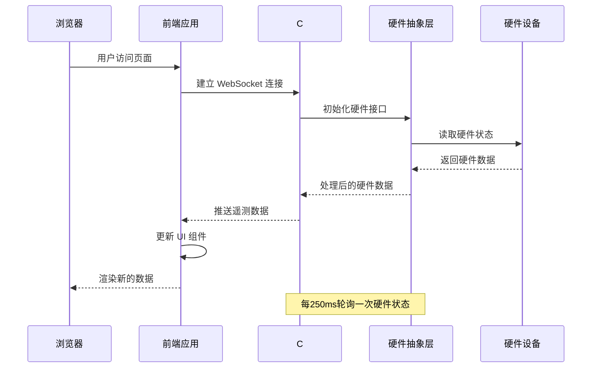
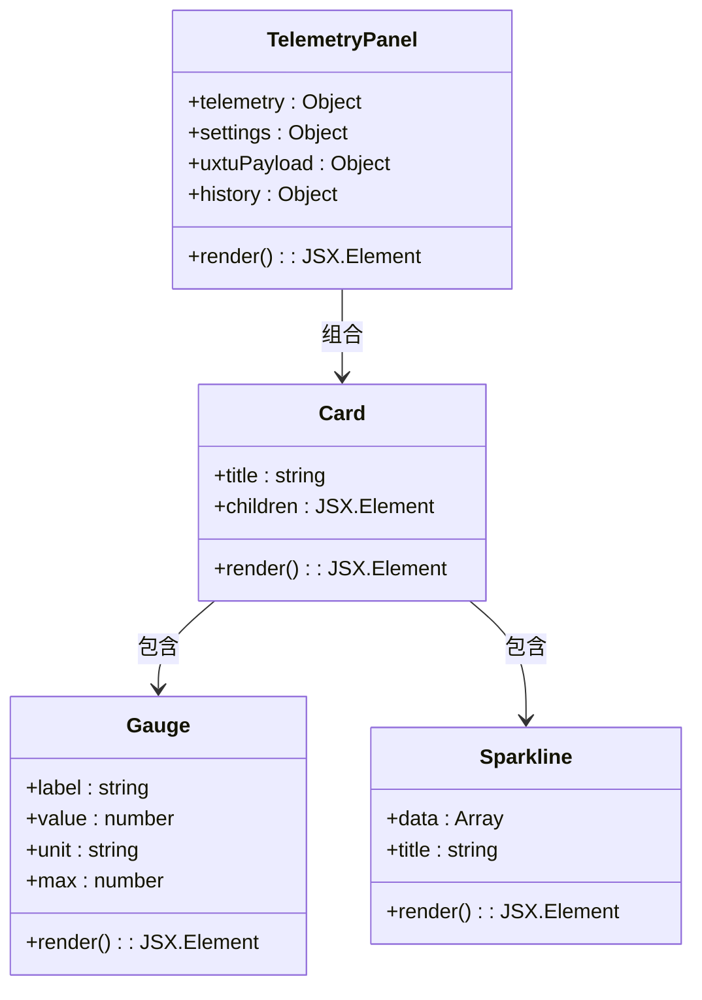
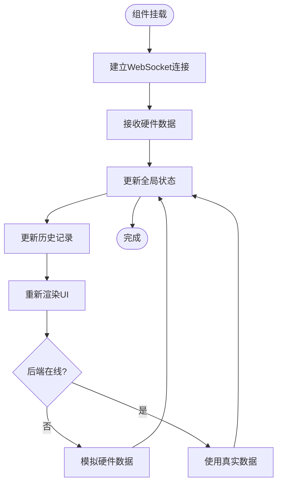
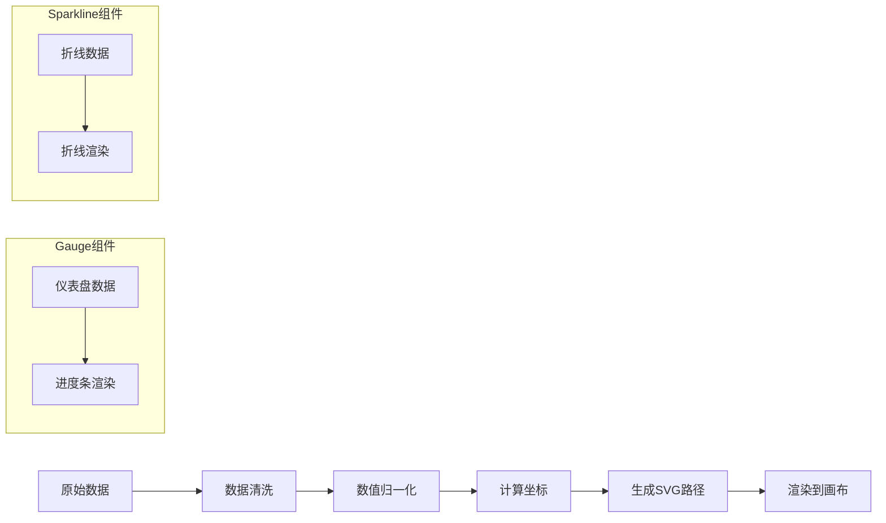

# 遥测面板

<cite>
**本文档引用的文件**
- [TelemetryPanel.jsx](file://src/components/panels/TelemetryPanel.jsx)
- [useControlState.js](file://src/hooks/useControlState.js)
- [uxtuAdapter.js](file://src/services/uxtuAdapter.js)
- [mockTelemetry.js](file://src/data/mockTelemetry.js)
- [Gauge.jsx](file://src/components/ui/Gauge.jsx)
- [Sparkline.jsx](file://src/components/ui/Sparkline.jsx)
- [Card.jsx](file://src/components/ui/Card.jsx)
- [TelemetryBackgroundService.cs](file://server/api/TelemetryBackgroundService.cs)
- [HardwareAbstractionLayer.cs](file://server/hal/HardwareAbstractionLayer.cs)
- [Program.cs](file://server/api/Program.cs)
- [dev-architecture.md](file://docs/dev-architecture.md)
- [reference-consoles.md](file://docs/reference-consoles.md)
- [README.md](file://README.md)
</cite>

## 目录
1. [简介](#简介)
2. [项目结构](#项目结构)
3. [核心组件](#核心组件)
4. [架构概览](#架构概览)
5. [详细组件分析](#详细组件分析)
6. [依赖分析](#依赖分析)
7. [性能考虑](#性能考虑)
8. [故障排除指南](#故障排除指南)
9. [结论](#结论)
10. [附录](#附录)

## 简介
遥测面板是 Douzhanzhe Console 系统中的核心可视化组件，负责实时展示硬件状态数据，包括 CPU/GPU 占用率、温度、频率、显存使用情况以及风扇转速等关键指标。该组件采用现代化的前端架构，结合 C# HAL 后端提供的高性能硬件抽象层，实现了低延迟、高精度的硬件监控体验。

## 项目结构
项目采用前后端分离的架构设计，前端基于 React 19 + Vite 8 + Tailwind CSS 3 技术栈，后端使用 .NET 8 Minimal API 提供硬件抽象和数据服务。



**图表来源**
- [README.md:35-50](file://README.md#L35-L50)
- [dev-architecture.md:12-46](file://docs/dev-architecture.md#L12-L46)

**章节来源**
- [README.md:33-62](file://README.md#L33-L62)
- [dev-architecture.md:10-47](file://docs/dev-architecture.md#L10-L47)

## 核心组件
遥测面板由多个专门的 UI 组件构成，每个组件都有明确的职责分工：

### 主要组件架构
- **TelemetryPanel**: 面板容器，协调各个子组件的布局和数据传递
- **Gauge**: 仪表盘组件，用于显示单个数值指标
- **Sparkline**: 折线图组件，用于展示历史数据趋势
- **Card**: 卡片容器，提供统一的视觉风格和布局

### 数据流设计
组件采用自上而下的数据流模式，父组件通过 props 将数据传递给子组件，确保数据的一致性和可预测性。

**章节来源**
- [TelemetryPanel.jsx:20-121](file://src/components/panels/TelemetryPanel.jsx#L20-L121)
- [Gauge.jsx:1-21](file://src/components/ui/Gauge.jsx#L1-L21)
- [Sparkline.jsx:1-40](file://src/components/ui/Sparkline.jsx#L1-L40)
- [Card.jsx:1-18](file://src/components/ui/Card.jsx#L1-L18)

## 架构概览
系统采用分层架构设计，确保各层之间的职责清晰分离，便于维护和扩展。



**图表来源**
- [TelemetryBackgroundService.cs:54-142](file://server/api/TelemetryBackgroundService.cs#L54-L142)
- [Program.cs:56-86](file://server/api/Program.cs#L56-L86)

### 数据推送机制
系统采用 WebSocket 实时推送机制，每 250ms 向前端推送一次完整的硬件状态数据，确保用户界面的实时性和准确性。

**章节来源**
- [TelemetryBackgroundService.cs:54-142](file://server/api/TelemetryBackgroundService.cs#L54-L142)
- [Program.cs:56-86](file://server/api/Program.cs#L56-L86)

## 详细组件分析

### 遥测面板组件分析
遥测面板组件虽然被标记为已弃用，但仍提供了重要的架构参考价值。



**图表来源**
- [TelemetryPanel.jsx:20-121](file://src/components/panels/TelemetryPanel.jsx#L20-L121)
- [Card.jsx:1-18](file://src/components/ui/Card.jsx#L1-L18)
- [Gauge.jsx:1-21](file://src/components/ui/Gauge.jsx#L1-L21)
- [Sparkline.jsx:1-40](file://src/components/ui/Sparkline.jsx#L1-L40)

### 状态管理与数据绑定
useControlState Hook 提供了完整的状态管理解决方案，包括数据获取、历史记录管理和持久化存储。



**图表来源**
- [useControlState.js:242-336](file://src/hooks/useControlState.js#L242-L336)

### Mock 数据系统
系统实现了完整的 Mock 数据模拟机制，确保在后端不可用时仍能提供良好的用户体验。

**章节来源**
- [useControlState.js:259-336](file://src/hooks/useControlState.js#L259-L336)
- [mockTelemetry.js:1-22](file://src/data/mockTelemetry.js#L1-L22)

### 图表渲染技术
系统采用 SVG 技术实现高性能的图表渲染，支持实时数据更新和动画效果。



**图表来源**
- [Sparkline.jsx:1-40](file://src/components/ui/Sparkline.jsx#L1-L40)
- [Gauge.jsx:1-21](file://src/components/ui/Gauge.jsx#L1-L21)

**章节来源**
- [Sparkline.jsx:1-40](file://src/components/ui/Sparkline.jsx#L1-L40)
- [Gauge.jsx:1-21](file://src/components/ui/Gauge.jsx#L1-L21)

## 依赖分析
系统依赖关系清晰，各组件之间耦合度低，便于独立开发和测试。

```mermaid
graph TB
subgraph "外部依赖"
A[Tailwind CSS]
B[React 19]
C[@dnd-kit]
D[inpoutx64]
E[System.Management]
end
subgraph "内部模块"
F[useControlState]
G[uxtuAdapter]
H[HardwareAbstractionLayer]
I[TelemetryBackgroundService]
end
A --> F
B --> F
C --> F
D --> H
E --> H
F --> G
G --> H
H --> I
```

**图表来源**
- [README.md:103-113](file://README.md#L103-L113)
- [dev-architecture.md:29-42](file://docs/dev-architecture.md#L29-L42)

### 关键依赖关系
- **Tailwind CSS**: 提供响应式布局和主题系统支持
- **React 19**: 支持并发特性和新的 Hooks API
- **@dnd-kit**: 实现拖拽排序功能
- **inpoutx64**: 硬件直连驱动，支持 EC 寄存器访问
- **System.Management**: WMI 接口封装

**章节来源**
- [README.md:103-113](file://README.md#L103-L113)
- [dev-architecture.md:29-42](file://docs/dev-architecture.md#L29-L42)

## 性能考虑
系统在性能优化方面采用了多项策略，确保在高负载情况下仍能保持流畅的用户体验。

### 实时数据处理
- **250ms 轮询间隔**: 平衡数据新鲜度和系统负载
- **增量更新**: 仅更新发生变化的数据点
- **去抖机制**: 防止频繁的状态更新造成性能问题

### 内存管理
- **历史数据限制**: 最多保存 60 个时间点的数据
- **对象引用优化**: 使用 useRef 避免不必要的重渲染
- **清理机制**: 及时清理定时器和 WebSocket 连接

### 渲染优化
- **虚拟滚动**: 对于大量数据采用虚拟化渲染
- **懒加载**: 按需加载图表组件
- **CSS 动画**: 使用 GPU 加速的 CSS 动画

## 故障排除指南
系统提供了完善的错误处理和故障恢复机制。

### 常见问题诊断
1. **WebSocket 连接失败**
   - 检查 C# HAL API 是否正常运行
   - 验证防火墙设置是否允许连接
   - 确认浏览器是否支持 WebSocket

2. **硬件数据读取异常**
   - 确认系统以管理员权限运行
   - 检查 inpoutx64 驱动是否正确安装
   - 验证硬件是否支持相应的功能

3. **Mock 数据不准确**
   - 检查系统时间是否正确
   - 确认风扇目标转速设置合理
   - 验证散热模式配置

### 错误恢复策略
- **自动重连**: WebSocket 断开后自动重连
- **降级模式**: 后端不可用时启用 Mock 数据
- **状态持久化**: 关闭页面后重新打开恢复之前的状态

**章节来源**
- [useControlState.js:242-257](file://src/hooks/useControlState.js#L242-L257)
- [TelemetryBackgroundService.cs:67-69](file://server/api/TelemetryBackgroundService.cs#L67-L69)

## 结论
遥测面板组件展现了现代前端架构的最佳实践，通过合理的组件拆分、清晰的数据流设计和完善的错误处理机制，实现了高性能、高可用的硬件监控体验。系统的设计充分考虑了可扩展性和可维护性，为未来的功能扩展奠定了坚实的基础。

## 附录

### 数据格式规范
系统支持多种数据格式，包括 JSON、CSV 和二进制格式，确保与不同硬件平台的兼容性。

### 扩展新遥测项指南
1. **定义数据结构**: 在 mockTelemetry.js 中添加新的数据字段
2. **更新适配器**: 在 uxtuAdapter.js 中添加相应的 API 调用
3. **实现组件**: 创建新的 UI 组件或扩展现有组件
4. **集成测试**: 验证新功能在 Mock 和真实环境下的表现

### 性能监控指标
- **数据延迟**: 目标 < 250ms
- **内存使用**: < 50MB
- **CPU 占用**: < 10%
- **渲染性能**: 60fps 以上

**章节来源**
- [reference-consoles.md:49-57](file://docs/reference-consoles.md#L49-L57)
- [dev-architecture.md:108-114](file://docs/dev-architecture.md#L108-L114)