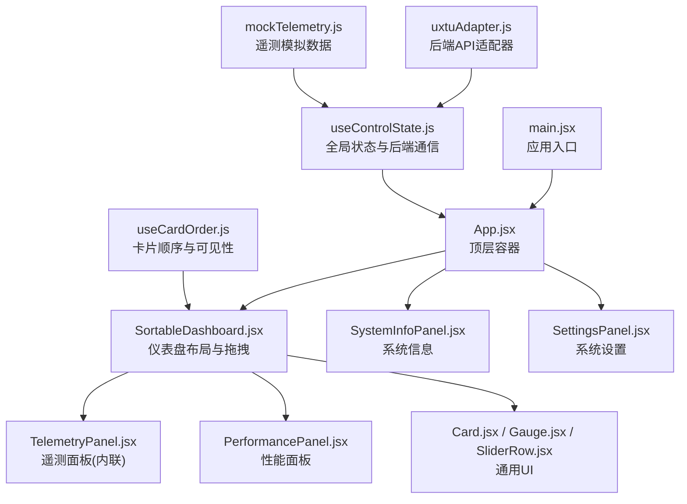
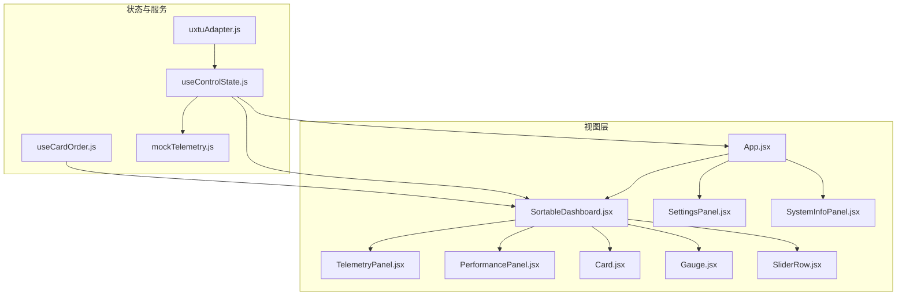
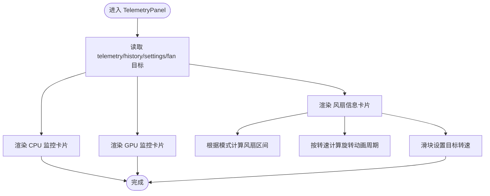
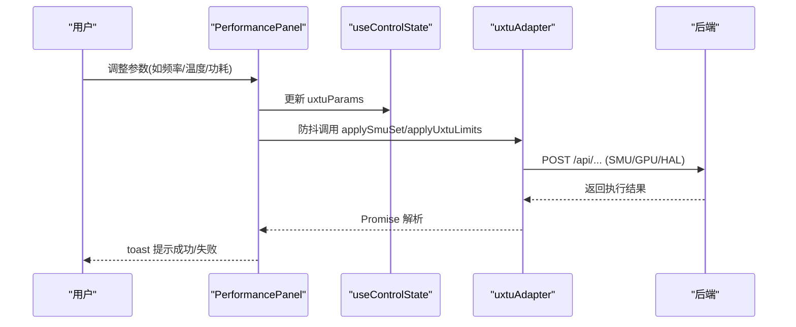
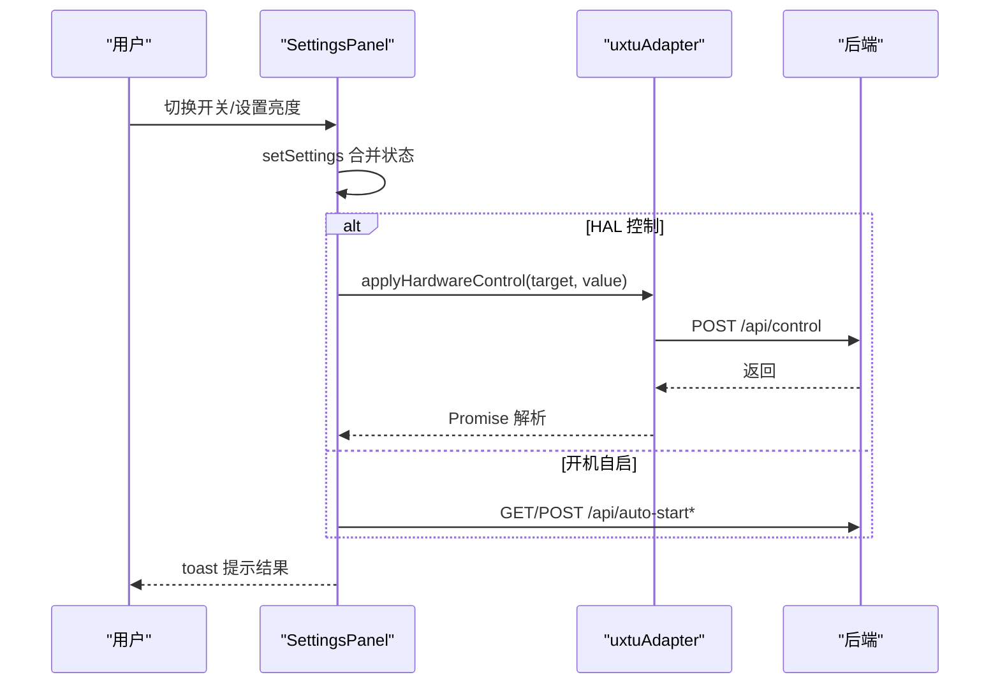
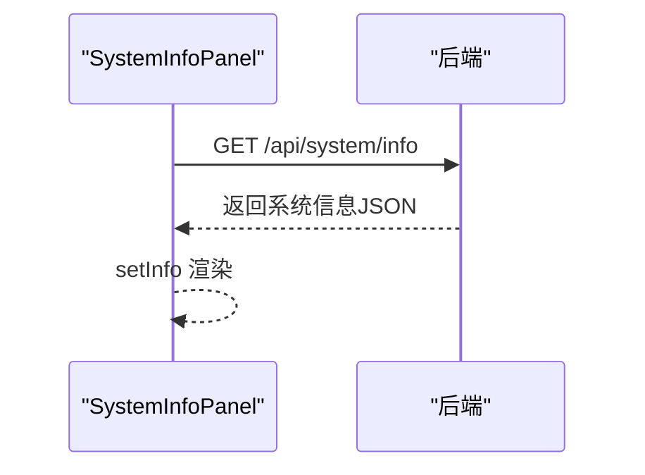
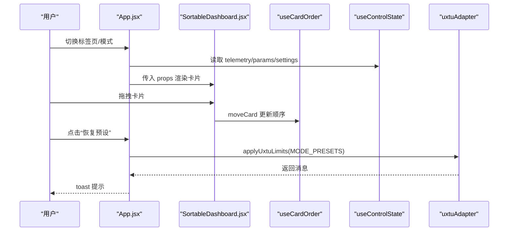
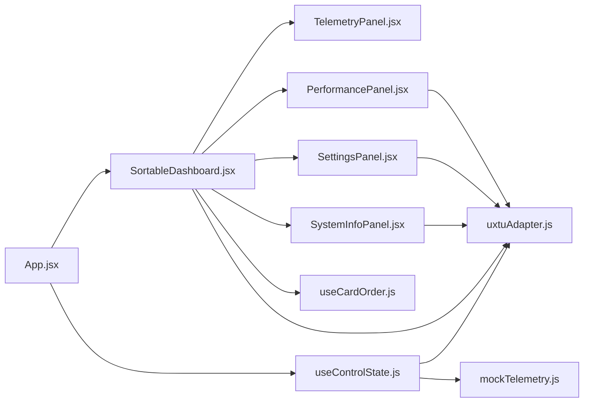

# 面板组件

<cite>
**本文引用的文件**
- [src/App.jsx](file://src/App.jsx)
- [src/components/SortableDashboard.jsx](file://src/components/SortableDashboard.jsx)
- [src/components/panels/TelemetryPanel.jsx](file://src/components/panels/TelemetryPanel.jsx)
- [src/components/panels/PerformancePanel.jsx](file://src/components/panels/PerformancePanel.jsx)
- [src/components/panels/SettingsPanel.jsx](file://src/components/panels/SettingsPanel.jsx)
- [src/components/panels/SystemInfoPanel.jsx](file://src/components/panels/SystemInfoPanel.jsx)
- [src/hooks/useControlState.js](file://src/hooks/useControlState.js)
- [src/hooks/useCardOrder.js](file://src/hooks/useCardOrder.js)
- [src/services/uxtuAdapter.js](file://src/services/uxtuAdapter.js)
- [src/data/mockTelemetry.js](file://src/data/mockTelemetry.js)
- [src/components/ui/Card.jsx](file://src/components/ui/Card.jsx)
- [src/components/ui/Gauge.jsx](file://src/components/ui/Gauge.jsx)
- [src/components/ui/SliderRow.jsx](file://src/components/ui/SliderRow.jsx)
- [src/main.jsx](file://src/main.jsx)
- [package.json](file://package.json)
</cite>

## 目录
1. [简介](#简介)
2. [项目结构](#项目结构)
3. [核心组件](#核心组件)
4. [架构总览](#架构总览)
5. [详细组件分析](#详细组件分析)
6. [依赖关系分析](#依赖关系分析)
7. [性能与响应式设计](#性能与响应式设计)
8. [故障排查指南](#故障排查指南)
9. [结论](#结论)
10. [附录：新面板开发指南与最佳实践](#附录新面板开发指南与最佳实践)

## 简介
本文件面向 DOUZHANZHE-Control 的“面板组件”体系，系统梳理四个专用面板的设计理念与实现方式：遥测面板（Telemetry）、性能面板（Performance）、设置面板（Settings）、系统信息面板（SystemInfo）。文档重点阐述以下方面：
- 面板的数据流与状态管理：如何通过全局状态钩子与服务层进行数据获取、下发与持久化。
- 面板间通信机制：数据传递、状态同步与事件处理的实现路径。
- 响应式设计：在不同屏幕尺寸下的布局适配与交互优化策略。
- 可复用性设计：组件封装、属性配置与扩展接口，便于新增面板。
- 开发指南：如何基于现有架构快速开发新的面板组件。

## 项目结构
前端采用 React + Vite 架构，核心入口为 main.jsx，顶层容器 App.jsx 负责导航、主题与全局状态注入；面板组件位于 src/components/panels 下，通用 UI 组件位于 src/components/ui，状态与业务逻辑通过 hooks 与 services 抽离。

图表来源
- [src/main.jsx:1-14](file://src/main.jsx#L1-L14)
- [src/App.jsx:1-134](file://src/App.jsx#L1-L134)
- [src/components/SortableDashboard.jsx:1-247](file://src/components/SortableDashboard.jsx#L1-L247)
- [src/components/panels/TelemetryPanel.jsx:1-121](file://src/components/panels/TelemetryPanel.jsx#L1-L121)
- [src/components/panels/PerformancePanel.jsx:1-213](file://src/components/panels/PerformancePanel.jsx#L1-L213)
- [src/components/panels/SettingsPanel.jsx:1-124](file://src/components/panels/SettingsPanel.jsx#L1-L124)
- [src/components/panels/SystemInfoPanel.jsx:1-59](file://src/components/panels/SystemInfoPanel.jsx#L1-L59)
- [src/hooks/useControlState.js:1-355](file://src/hooks/useControlState.js#L1-L355)
- [src/hooks/useCardOrder.js:1-128](file://src/hooks/useCardOrder.js#L1-L128)
- [src/services/uxtuAdapter.js:1-130](file://src/services/uxtuAdapter.js#L1-L130)
- [src/data/mockTelemetry.js:1-22](file://src/data/mockTelemetry.js#L1-L22)

章节来源
- [src/main.jsx:1-14](file://src/main.jsx#L1-L14)
- [src/App.jsx:1-134](file://src/App.jsx#L1-L134)

## 核心组件
- 全局状态与后端通信：useControlState 提供主题、遥测、参数、风扇目标转速、历史曲线、模式记忆与持久化、WebSocket 遥测接入、以及模式切换时的参数下发。
- 卡片排序与可见性：useCardOrder 负责卡片顺序、隐藏列表、本地持久化与服务端同步。
- 业务适配器：uxtuAdapter 封装后端 API（SMU、HAL、GPU、WMI、遥测 WebSocket），统一错误处理与返回格式。
- 通用 UI：Card、Gauge、SliderRow 等基础组件，保证各面板一致的视觉与交互体验。

章节来源
- [src/hooks/useControlState.js:1-355](file://src/hooks/useControlState.js#L1-L355)
- [src/hooks/useCardOrder.js:1-128](file://src/hooks/useCardOrder.js#L1-L128)
- [src/services/uxtuAdapter.js:1-130](file://src/services/uxtuAdapter.js#L1-L130)
- [src/components/ui/Card.jsx:1-18](file://src/components/ui/Card.jsx#L1-L18)
- [src/components/ui/Gauge.jsx:1-21](file://src/components/ui/Gauge.jsx#L1-L21)
- [src/components/ui/SliderRow.jsx:1-23](file://src/components/ui/SliderRow.jsx#L1-L23)

## 架构总览
整体采用“容器组件 + 业务面板 + 通用UI + 状态与服务”的分层设计。App.jsx 作为顶层容器，负责导航、主题与全局状态注入；SortableDashboard 负责卡片布局、拖拽排序与内联渲染各面板；各面板通过 props 与全局状态交互；服务层通过 uxtuAdapter 统一调用后端接口。

图表来源
- [src/App.jsx:1-134](file://src/App.jsx#L1-L134)
- [src/components/SortableDashboard.jsx:1-247](file://src/components/SortableDashboard.jsx#L1-L247)
- [src/components/panels/TelemetryPanel.jsx:1-121](file://src/components/panels/TelemetryPanel.jsx#L1-L121)
- [src/components/panels/PerformancePanel.jsx:1-213](file://src/components/panels/PerformancePanel.jsx#L1-L213)
- [src/components/panels/SettingsPanel.jsx:1-124](file://src/components/panels/SettingsPanel.jsx#L1-L124)
- [src/components/panels/SystemInfoPanel.jsx:1-59](file://src/components/panels/SystemInfoPanel.jsx#L1-L59)
- [src/hooks/useControlState.js:1-355](file://src/hooks/useControlState.js#L1-L355)
- [src/hooks/useCardOrder.js:1-128](file://src/hooks/useCardOrder.js#L1-L128)
- [src/services/uxtuAdapter.js:1-130](file://src/services/uxtuAdapter.js#L1-L130)
- [src/data/mockTelemetry.js:1-22](file://src/data/mockTelemetry.js#L1-L22)

## 详细组件分析

### 遥测面板（TelemetryPanel）
设计理念
- 以“监控 + 调参”双通道呈现：左侧展示 CPU/GPU 即时指标与负载曲线，右侧展示风扇目标与当前转速、动画旋转反馈。
- 通过内联方式在 SortableDashboard 中渲染，避免额外 props 传递，提升复用性与一致性。

实现要点
- 数据来源：telemetry、history、settings、fan 目标转速。
- 可视化组件：Gauge、Sparkline、SliderRow。
- 风扇动画：根据当前转速与最大转速计算动画周期，直观反映风扇工作状态。
- 风扇区间：依据当前模式动态计算允许范围，防止越界。

图表来源
- [src/components/panels/TelemetryPanel.jsx:20-121](file://src/components/panels/TelemetryPanel.jsx#L20-L121)
- [src/services/uxtuAdapter.js:117-130](file://src/services/uxtuAdapter.js#L117-L130)

章节来源
- [src/components/panels/TelemetryPanel.jsx:1-121](file://src/components/panels/TelemetryPanel.jsx#L1-L121)
- [src/services/uxtuAdapter.js:117-130](file://src/services/uxtuAdapter.js#L117-L130)

### 性能面板（PerformancePanel）
设计理念
- 面向“CPU/GPU 参数调节”的集中式面板，提供频率限制、温度墙、核心数限制、电源计划、电压与功耗等精细控制。
- 通过防抖与队列机制减少频繁下发，提升稳定性与用户体验。

实现要点
- 参数更新：通过回调函数更新 uxtuParams，并在 600ms 防抖后调用 applySmuSet 或 applyUxtuLimits。
- GPU 控制：根据锁频/限频/重置等状态组合，动态调用 applyGpuControl。
- 电源计划：映射到 HAL 层 power_plan 并即时下发。
- 应用按钮：统一调用 applyUxtuLimits 并通过 toast 反馈结果。

图表来源
- [src/components/panels/PerformancePanel.jsx:13-213](file://src/components/panels/PerformancePanel.jsx#L13-L213)
- [src/hooks/useControlState.js:144-169](file://src/hooks/useControlState.js#L144-L169)
- [src/services/uxtuAdapter.js:19-88](file://src/services/uxtuAdapter.js#L19-L88)

章节来源
- [src/components/panels/PerformancePanel.jsx:1-213](file://src/components/panels/PerformancePanel.jsx#L1-L213)
- [src/hooks/useControlState.js:144-169](file://src/hooks/useControlState.js#L144-L169)
- [src/services/uxtuAdapter.js:19-88](file://src/services/uxtuAdapter.js#L19-L88)

### 设置面板（SettingsPanel）
设计理念
- 集中管理“系统开关、开机自启、键盘灯亮度、当前策略摘要、关于信息”等配置项。
- 对 HAL 设备控制进行统一映射与错误兜底，确保操作安全与反馈及时。

实现要点
- HAL 映射：将 UI 开关映射为 HAL target（如 fn_lock、kb_light、gpu_mode 等）并下发。
- 开机自启：通过 /api/auto-start 与 /api/auto-start-opts 接口进行查询与设置。
- 策略摘要：展示当前 GPU PPT 与温度墙等关键参数。
- 关于信息：版本、设备、开发者与开源协议信息。

图表来源
- [src/components/panels/SettingsPanel.jsx:8-124](file://src/components/panels/SettingsPanel.jsx#L8-L124)
- [src/services/uxtuAdapter.js:35-44](file://src/services/uxtuAdapter.js#L35-L44)

章节来源
- [src/components/panels/SettingsPanel.jsx:1-124](file://src/components/panels/SettingsPanel.jsx#L1-L124)
- [src/services/uxtuAdapter.js:35-44](file://src/services/uxtuAdapter.js#L35-L44)

### 系统信息面板（SystemInfoPanel）
设计理念
- 以只读信息展示为主，通过分段与行结构清晰呈现机型、CPU/GPU、内存、存储等静态配置。
- 首屏异步拉取 /api/system/info，失败时回退空对象占位，保证健壮性。

实现要点
- 分段组件：Section 与 Row 组合，统一样式与间距。
- 异步加载：首次挂载时发起请求，成功后渲染，失败则显示占位符。

图表来源
- [src/components/panels/SystemInfoPanel.jsx:4-59](file://src/components/panels/SystemInfoPanel.jsx#L4-L59)

章节来源
- [src/components/panels/SystemInfoPanel.jsx:1-59](file://src/components/panels/SystemInfoPanel.jsx#L1-L59)

### 顶层容器与仪表盘（App + SortableDashboard）
设计理念
- App.jsx 负责主题、导航、标签页与模式选择区；SortableDashboard 负责卡片布局、拖拽排序与内联渲染。
- 通过 useControlState 注入全局状态，通过 useCardOrder 管理卡片顺序与隐藏。

实现要点
- 模式选择：根据 settings.mode 读取 MODE_PRESETS，合并当前参数并下发 applyUxtuLimits。
- 编辑模式：拖拽排序完成后同步至服务端，保存卡片顺序与隐藏状态。
- 遥测曲线：history 作为全局状态的一部分，被各监控卡片复用。

图表来源
- [src/App.jsx:23-134](file://src/App.jsx#L23-L134)
- [src/components/SortableDashboard.jsx:38-247](file://src/components/SortableDashboard.jsx#L38-L247)
- [src/hooks/useCardOrder.js:46-128](file://src/hooks/useCardOrder.js#L46-L128)
- [src/hooks/useControlState.js:26-355](file://src/hooks/useControlState.js#L26-L355)
- [src/services/uxtuAdapter.js:109-129](file://src/services/uxtuAdapter.js#L109-L129)

章节来源
- [src/App.jsx:1-134](file://src/App.jsx#L1-L134)
- [src/components/SortableDashboard.jsx:1-247](file://src/components/SortableDashboard.jsx#L1-L247)
- [src/hooks/useCardOrder.js:1-128](file://src/hooks/useCardOrder.js#L1-L128)
- [src/hooks/useControlState.js:1-355](file://src/hooks/useControlState.js#L1-L355)
- [src/services/uxtuAdapter.js:109-129](file://src/services/uxtuAdapter.js#L109-L129)

## 依赖关系分析
- 组件耦合
  - App.jsx 与 SortableDashboard 高度耦合：前者负责导航与模式下发，后者负责布局与内联渲染。
  - 各面板与 useControlState 强依赖：参数、遥测、历史曲线、风扇目标均来自该钩子。
  - SortableDashboard 与 useCardOrder：卡片顺序与隐藏状态双向绑定。
- 外部依赖
  - uxtuAdapter：统一后端 API，屏蔽 HAL、SMU、GPU、WMI、遥测等差异。
  - mockTelemetry：在后端不可用时提供退化数据，保障开发与演示体验。
  - 第三方库：@dnd-kit 实现拖拽，React 生态组件库。

图表来源
- [src/App.jsx:1-134](file://src/App.jsx#L1-L134)
- [src/components/SortableDashboard.jsx:1-247](file://src/components/SortableDashboard.jsx#L1-L247)
- [src/components/panels/TelemetryPanel.jsx:1-121](file://src/components/panels/TelemetryPanel.jsx#L1-L121)
- [src/components/panels/PerformancePanel.jsx:1-213](file://src/components/panels/PerformancePanel.jsx#L1-L213)
- [src/components/panels/SettingsPanel.jsx:1-124](file://src/components/panels/SettingsPanel.jsx#L1-L124)
- [src/components/panels/SystemInfoPanel.jsx:1-59](file://src/components/panels/SystemInfoPanel.jsx#L1-L59)
- [src/hooks/useControlState.js:1-355](file://src/hooks/useControlState.js#L1-L355)
- [src/hooks/useCardOrder.js:1-128](file://src/hooks/useCardOrder.js#L1-L128)
- [src/services/uxtuAdapter.js:1-130](file://src/services/uxtuAdapter.js#L1-L130)
- [src/data/mockTelemetry.js:1-22](file://src/data/mockTelemetry.js#L1-L22)

章节来源
- [src/App.jsx:1-134](file://src/App.jsx#L1-L134)
- [src/components/SortableDashboard.jsx:1-247](file://src/components/SortableDashboard.jsx#L1-L247)
- [src/services/uxtuAdapter.js:1-130](file://src/services/uxtuAdapter.js#L1-L130)
- [src/data/mockTelemetry.js:1-22](file://src/data/mockTelemetry.js#L1-L22)
- [package.json:11-31](file://package.json#L11-L31)

## 性能与响应式设计
- 响应式布局
  - 使用 TailwindCSS 断点：移动端单列、平板双列、桌面三列，卡片内部网格在小屏下自动调整。
  - 侧边栏使用固定定位与最大高度，配合滚动与粘性布局，保证在不同窗口高度下的可用性。
- 性能优化
  - 遥测数据：通过 WebSocket 实时推送，后端不可用时退化为 mock 数据，保持流畅体验。
  - 防抖与节流：风扇目标转速与 SMU 参数下发均采用 600ms~1s 防抖，降低后端压力与抖动。
  - 计算复用：useMemo 生成 uxtuPayload，避免不必要的重渲染。
- 交互优化
  - 拖拽激活阈值与触摸延迟配置，提升移动端拖拽体验。
  - toast 提示与按钮禁用状态，避免误操作与无效请求。

章节来源
- [src/components/SortableDashboard.jsx:194-246](file://src/components/SortableDashboard.jsx#L194-L246)
- [src/App.jsx:42-133](file://src/App.jsx#L42-L133)
- [src/hooks/useControlState.js:112-126](file://src/hooks/useControlState.js#L112-L126)
- [src/hooks/useControlState.js:144-169](file://src/hooks/useControlState.js#L144-L169)
- [src/hooks/useControlState.js:171-178](file://src/hooks/useControlState.js#L171-L178)

## 故障排查指南
- 遥测无数据
  - 检查后端 WebSocket 是否在线，若断开将退化为 mock 数据。
  - 查看网络面板与后端日志，确认 ws://127.0.0.1:3100/ws 是否可达。
- 参数下发失败
  - 检查 applyUxtuLimits/applySmuSet/applyGpuControl 返回状态码与错误信息。
  - 确认当前模式是否为 custom，非 custom 模式不会保存到服务端。
- 拖拽排序未生效
  - 确认退出编辑模式后是否触发了 syncToServer。
  - 检查 /api/ui-state 的 POST 是否成功。
- HAL 控制无效
  - 检查 target 映射是否正确，确认 /api/control 返回值。
  - 部分设置需重启生效（如 GPU 模式）。

章节来源
- [src/hooks/useControlState.js:242-257](file://src/hooks/useControlState.js#L242-L257)
- [src/services/uxtuAdapter.js:58-71](file://src/services/uxtuAdapter.js#L58-L71)
- [src/hooks/useCardOrder.js:78-91](file://src/hooks/useCardOrder.js#L78-L91)
- [src/components/SortableDashboard.jsx:161-188](file://src/components/SortableDashboard.jsx#L161-L188)

## 结论
本面板组件体系以“全局状态 + 业务面板 + 通用UI + 服务适配器”为核心，实现了数据可视化、参数调节、功能配置与系统信息展示的解耦与复用。通过防抖、Mock 退化、响应式布局与拖拽排序，兼顾了性能与交互体验。建议后续在保持现有架构稳定的基础上，进一步完善错误边界与可观测性，增强新面板的快速集成能力。

## 附录：新面板开发指南与最佳实践
- 组件封装
  - 优先复用 Card、Gauge、SliderRow 等通用 UI 组件，保持风格一致。
  - 将复杂交互拆分为多个小组件，遵循单一职责原则。
- 属性配置
  - 明确 props 输入（如 settings、uxtuParams、telemetry、history）与输出（如 onApplied、onChange）。
  - 对可选区域提供 showXxx 开关，便于在仪表盘中灵活组合。
- 状态同步
  - 通过 useControlState 的 setXxx 回调更新全局状态，必要时结合本地存储与服务端同步。
  - 对高频变更（如风扇目标、SMU 参数）使用防抖，避免过度请求。
- 事件处理
  - 对后端请求统一使用 try/catch 并通过 toast 反馈结果。
  - 对需要重启生效的设置，明确提示用户。
- 响应式与可访问性
  - 使用 Tailwind 断点与网格布局，确保多端一致体验。
  - 为交互元素提供语义化标签与键盘可访问性。
- 集成到仪表盘
  - 在 SortableDashboard 的 CARD_MAP 与 renderCard 中注册新卡片 ID 与渲染逻辑。
  - 如需独立页面，可在 App.jsx 的导航与路由中添加对应 tab。

章节来源
- [src/components/SortableDashboard.jsx:25-36](file://src/components/SortableDashboard.jsx#L25-L36)
- [src/components/SortableDashboard.jsx:73-192](file://src/components/SortableDashboard.jsx#L73-L192)
- [src/App.jsx:14-21](file://src/App.jsx#L14-L21)
- [src/components/ui/Card.jsx:1-18](file://src/components/ui/Card.jsx#L1-L18)
- [src/components/ui/Gauge.jsx:1-21](file://src/components/ui/Gauge.jsx#L1-L21)
- [src/components/ui/SliderRow.jsx:1-23](file://src/components/ui/SliderRow.jsx#L1-L23)
- [src/hooks/useControlState.js:144-169](file://src/hooks/useControlState.js#L144-L169)