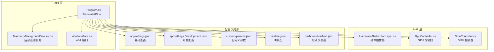
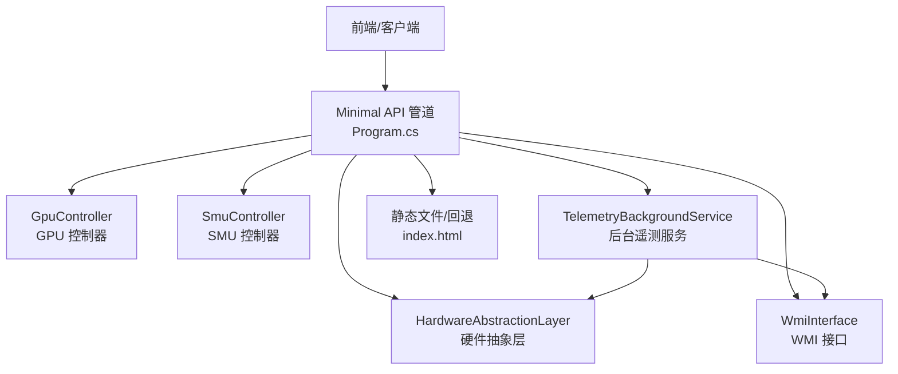
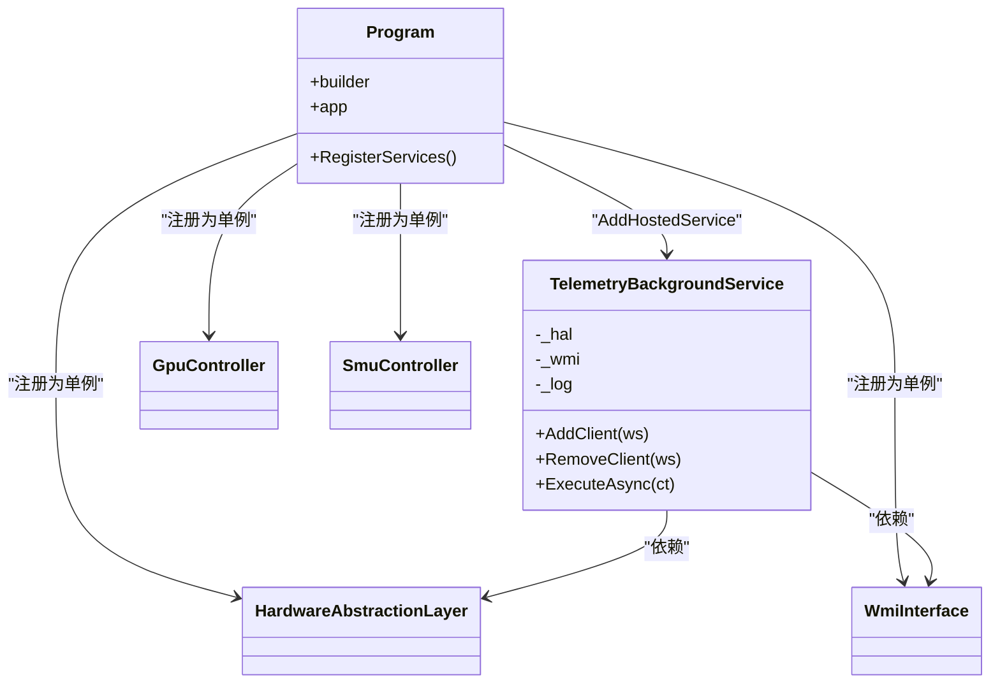
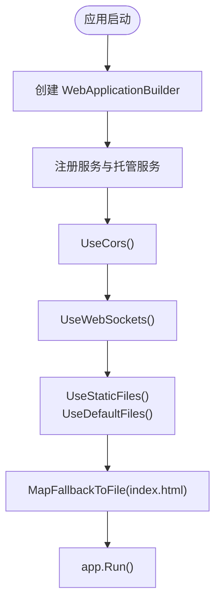
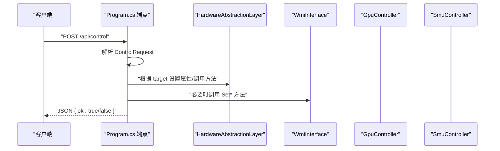
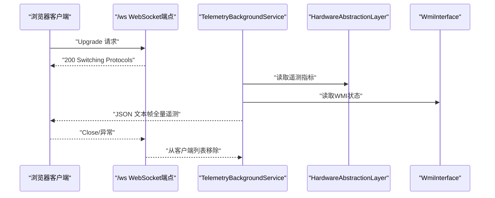
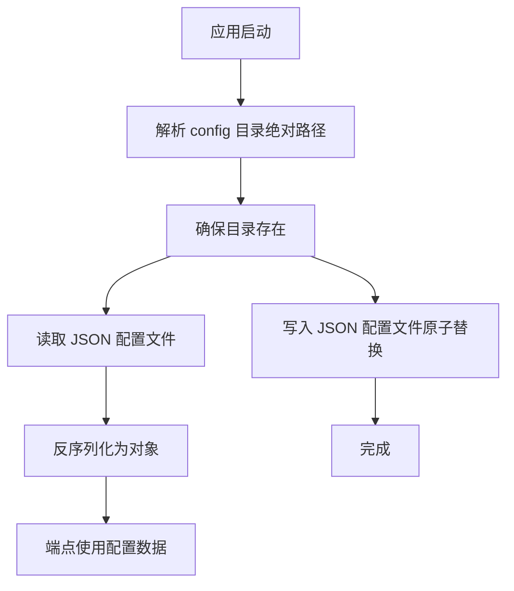
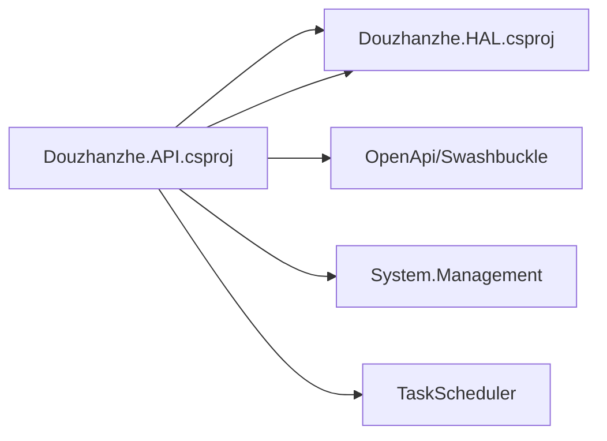

# API服务设计

<cite>
**本文档引用的文件**
- [Douzhanzhe.API.csproj](file://server/api/Douzhanzhe.API.csproj)
- [Program.cs](file://server/api/Program.cs)
- [appsettings.json](file://server/api/appsettings.json)
- [appsettings.Development.json](file://server/api/appsettings.Development.json)
- [Douzhanzhe.API.http](file://server/api/Douzhanzhe.API.http)
- [Douzhanzhe.HAL.csproj](file://server/hal/Douzhanzhe.HAL.csproj)
- [HardwareAbstractionLayer.cs](file://server/hal/HardwareAbstractionLayer.cs)
- [GpuController.cs](file://server/hal/GpuController.cs)
- [SmuController.cs](file://server/hal/SmuController.cs)
- [WmiInterface.cs](file://server/api/WmiInterface.cs)
- [TelemetryBackgroundService.cs](file://server/api/TelemetryBackgroundService.cs)
- [custom-params.json](file://server/api/config/custom-params.json)
- [ui-state.json](file://server/api/config/ui-state.json)
- [dashboard-default.json](file://server/config/dashboard-default.json)
</cite>

## 目录
1. [简介](#简介)
2. [项目结构](#项目结构)
3. [核心组件](#核心组件)
4. [架构总览](#架构总览)
5. [详细组件分析](#详细组件分析)
6. [依赖关系分析](#依赖关系分析)
7. [性能考虑](#性能考虑)
8. [故障排除指南](#故障排除指南)
9. [结论](#结论)
10. [附录](#附录)

## 简介
本文件面向DOUZHANZHE-Control的API服务设计，围绕ASP.NET Core Minimal API进行系统性梳理，重点覆盖以下方面：
- 服务注册机制与依赖注入容器使用
- 中间件配置与管道控制流
- RESTful端点设计原则与响应格式标准化
- CORS、静态文件服务与路由配置
- 配置文件管理（appsettings.json、环境变量）
- API版本控制策略、错误处理与性能优化建议

该API服务以Minimal API为核心，结合HAL层对底层硬件进行抽象与控制，提供遥测采集、系统开关、风扇控制、GPU与SMU参数调节等能力，并通过WebSocket向前端推送实时数据。

## 项目结构
项目采用分层架构：
- server/api：Minimal API应用入口与端点定义
- server/hal：硬件抽象层（HAL）与控制器（GPU、SMU、WMI）
- server/config：默认仪表盘配置
- server/api/config：运行期持久化配置（UI状态、自定义参数）

**图表来源**
- [Program.cs:1-783](file://server/api/Program.cs#L1-L783)
- [HardwareAbstractionLayer.cs:1-767](file://server/hal/HardwareAbstractionLayer.cs#L1-L767)
- [GpuController.cs:1-116](file://server/hal/GpuController.cs#L1-L116)
- [SmuController.cs:1-142](file://server/hal/SmuController.cs#L1-L142)
- [WmiInterface.cs:1-210](file://server/api/WmiInterface.cs#L1-L210)
- [TelemetryBackgroundService.cs:1-143](file://server/api/TelemetryBackgroundService.cs#L1-L143)
- [appsettings.json:1-10](file://server/api/appsettings.json#L1-L10)
- [appsettings.Development.json:1-9](file://server/api/appsettings.Development.json#L1-L9)
- [custom-params.json:1-22](file://server/api/config/custom-params.json#L1-L22)
- [ui-state.json:1-17](file://server/api/config/ui-state.json#L1-L17)
- [dashboard-default.json:1-7](file://server/config/dashboard-default.json#L1-L7)

**章节来源**
- [Douzhanzhe.API.csproj:1-40](file://server/api/Douzhanzhe.API.csproj#L1-L40)
- [Program.cs:1-783](file://server/api/Program.cs#L1-L783)

## 核心组件
- 依赖注入与服务注册
  - 通过服务构建器注册HAL、SMU、GPU、WMI、后台遥测服务等，生命周期为单例或托管服务。
- 中间件管道
  - 启用CORS、WebSocket、静态文件与默认文件服务，支持SPA回退至index.html。
- 端点映射
  - 使用Minimal API的Map方法定义REST端点，涵盖遥测、系统信息、健康检查、控制、SMU、GPU、WMI、配置持久化等。
- 配置管理
  - appsettings.json与环境特定配置；运行期配置通过JSON文件在共享目录持久化。
- 遥测推送
  - 后台服务定时采集遥测并通过WebSocket广播给所有连接的客户端。

**章节来源**
- [Program.cs:9-22](file://server/api/Program.cs#L9-L22)
- [Program.cs:15-22](file://server/api/Program.cs#L15-L22)
- [Program.cs:56-86](file://server/api/Program.cs#L56-L86)
- [Program.cs:87-143](file://server/api/Program.cs#L87-L143)
- [Program.cs:520-533](file://server/api/Program.cs#L520-L533)
- [TelemetryBackgroundService.cs:17-40](file://server/api/TelemetryBackgroundService.cs#L17-L40)

## 架构总览
API服务采用“Minimal API + HAL”的轻量架构，Minimal API负责HTTP/WebSocket协议接入与端点编排，HAL负责硬件抽象与系统调用，控制器封装外部工具（如nvidia-smi、ryzenadj）。

**图表来源**
- [Program.cs:1-783](file://server/api/Program.cs#L1-L783)
- [HardwareAbstractionLayer.cs:1-767](file://server/hal/HardwareAbstractionLayer.cs#L1-L767)
- [WmiInterface.cs:1-210](file://server/api/WmiInterface.cs#L1-L210)
- [GpuController.cs:1-116](file://server/hal/GpuController.cs#L1-L116)
- [SmuController.cs:1-142](file://server/hal/SmuController.cs#L1-L142)
- [TelemetryBackgroundService.cs:1-143](file://server/api/TelemetryBackgroundService.cs#L1-L143)

## 详细组件分析

### 服务注册与依赖注入
- 注册项
  - HAL、SMU、GPU、WMI均为单例服务
  - 托管后台服务：遥测服务
- 注入方式
  - 端点函数直接以参数形式接收所需服务实例
- 生命周期
  - 单例：HAL、SMU、GPU、WMI
  - 托管：TelemetryBackgroundService

**图表来源**
- [Program.cs:9-14](file://server/api/Program.cs#L9-L14)
- [TelemetryBackgroundService.cs:17-40](file://server/api/TelemetryBackgroundService.cs#L17-L40)

**章节来源**
- [Program.cs:9-14](file://server/api/Program.cs#L9-L14)
- [TelemetryBackgroundService.cs:17-40](file://server/api/TelemetryBackgroundService.cs#L17-L40)

### 中间件与路由配置
- CORS
  - 默认策略允许任意来源、方法与头部
- WebSocket
  - 启用WebSocket支持，端点/ws用于建立连接
- 静态文件与回退
  - 启用静态文件与默认文件服务，回退至index.html，适配SPA
- 路由
  - 采用Minimal API的Map方法声明路由，无传统控制器类

**图表来源**
- [Program.cs:15-22](file://server/api/Program.cs#L15-L22)
- [Program.cs:56-22](file://server/api/Program.cs#L56-L22)

**章节来源**
- [Program.cs:15-22](file://server/api/Program.cs#L15-L22)

### RESTful端点设计
- 设计原则
  - 使用HTTP方法映射语义化动作（GET/POST）
  - URL采用名词复数与层级表达资源关系
  - 统一响应格式为JSON；错误通过ProblemDetails或自定义对象返回
- 关键端点
  - 遥测与系统信息：/api/telemetry、/api/system/info、/api/health
  - 控制类：/api/control、/api/discover、/api/ec-scan
  - SMU：/api/smu/set、/api/smu/raw、/api/smu/probe、/api/smu/status、/api/smu/read-reg
  - GPU：/api/gpu/set、/api/gpu/status
  - WMI：/api/wmi/cmd
  - 配置持久化：/api/custom-params、/api/ui-state、/api/default-config
  - 自动启动：/api/auto-start、/api/auto-start-opts
  - 调试页面：/debug
- 参数与查询
  - 控制端点以JSON请求体传递参数
  - 扫描端点以查询参数传递偏移与数量

**图表来源**
- [Program.cs:144-202](file://server/api/Program.cs#L144-L202)
- [HardwareAbstractionLayer.cs:1-767](file://server/hal/HardwareAbstractionLayer.cs#L1-L767)
- [WmiInterface.cs:1-210](file://server/api/WmiInterface.cs#L1-L210)

**章节来源**
- [Program.cs:87-143](file://server/api/Program.cs#L87-L143)
- [Program.cs:144-202](file://server/api/Program.cs#L144-L202)
- [Program.cs:203-237](file://server/api/Program.cs#L203-L237)
- [Program.cs:238-298](file://server/api/Program.cs#L238-L298)
- [Program.cs:299-344](file://server/api/Program.cs#L299-L344)
- [Program.cs:345-394](file://server/api/Program.cs#L345-L394)
- [Program.cs:395-461](file://server/api/Program.cs#L395-L461)
- [Program.cs:462-537](file://server/api/Program.cs#L462-L537)
- [Program.cs:538-584](file://server/api/Program.cs#L538-L584)
- [Program.cs:585-618](file://server/api/Program.cs#L585-L618)
- [Program.cs:619-686](file://server/api/Program.cs#L619-L686)

### WebSocket遥测推送
- 连接建立
  - /ws端点仅接受WebSocket请求，成功后加入推送队列
- 数据采集
  - 后台服务每250ms轮询HAL与WMI，组装全量遥测对象
- 广播
  - 对所有在线客户端异步发送UTF-8文本帧
- 断线清理
  - 异常或关闭状态的客户端会被移除

**图表来源**
- [Program.cs:56-86](file://server/api/Program.cs#L56-L86)
- [TelemetryBackgroundService.cs:54-141](file://server/api/TelemetryBackgroundService.cs#L54-L141)

**章节来源**
- [Program.cs:56-86](file://server/api/Program.cs#L56-L86)
- [TelemetryBackgroundService.cs:54-141](file://server/api/TelemetryBackgroundService.cs#L54-L141)

### 配置文件管理
- appsettings.json
  - 基础日志级别与主机白名单
  - 开发环境配置覆盖
- 运行期配置
  - 自定义参数：custom-params.json
  - UI状态：ui-state.json
  - 默认仪表盘：dashboard-default.json
- 文件位置
  - 位于共享config目录，程序启动时解析绝对路径并确保存在

**图表来源**
- [Program.cs:23-55](file://server/api/Program.cs#L23-L55)
- [Program.cs:538-584](file://server/api/Program.cs#L538-L584)
- [custom-params.json:1-22](file://server/api/config/custom-params.json#L1-L22)
- [ui-state.json:1-17](file://server/api/config/ui-state.json#L1-L17)
- [dashboard-default.json:1-7](file://server/config/dashboard-default.json#L1-L7)

**章节来源**
- [appsettings.json:1-10](file://server/api/appsettings.json#L1-L10)
- [appsettings.Development.json:1-9](file://server/api/appsettings.Development.json#L1-L9)
- [Program.cs:23-55](file://server/api/Program.cs#L23-L55)
- [Program.cs:538-584](file://server/api/Program.cs#L538-L584)

### 错误处理与响应格式
- 统一响应
  - 成功：JSON对象包含ok字段
  - 失败：返回ProblemDetails或包含error字段的对象
- 端点级异常捕获
  - 控制端点与SMU/GPU/WMI等外部调用均包含try/catch
- 健康检查
  - /api/health返回可用性与时间戳

**章节来源**
- [Program.cs:146-201](file://server/api/Program.cs#L146-L201)
- [Program.cs:238-298](file://server/api/Program.cs#L238-L298)
- [Program.cs:395-461](file://server/api/Program.cs#L395-L461)
- [Program.cs:136-143](file://server/api/Program.cs#L136-L143)

## 依赖关系分析
- 项目引用
  - API项目引用HAL项目
- 外部包
  - OpenAPI/Swashbuckle用于文档生成
  - System.Management用于WMI访问
  - TaskScheduler用于Windows任务计划
- 运行时依赖
  - ryzenadj.exe用于SMU控制
  - nvidia-smi用于GPU状态读取
  - WinRing0内核驱动用于SMU底层IO

**图表来源**
- [Douzhanzhe.API.csproj:12-33](file://server/api/Douzhanzhe.API.csproj#L12-L33)
- [Douzhanzhe.HAL.csproj:1-18](file://server/hal/Douzhanzhe.HAL.csproj#L1-L18)

**章节来源**
- [Douzhanzhe.API.csproj:12-33](file://server/api/Douzhanzhe.API.csproj#L12-L33)
- [Douzhanzhe.HAL.csproj:1-18](file://server/hal/Douzhanzhe.HAL.csproj#L1-L18)

## 性能考虑
- 遥测轮询
  - 后台服务250ms一次，避免过于频繁导致CPU占用
- 缓存策略
  - HAL对部分遥测指标设置短期缓存，减少重复系统调用
- 外部工具超时
  - nvidia-smi与ryzenadj设置合理超时，失败时快速返回
- JSON序列化
  - 统一命名策略与缩进配置，兼顾可读性与传输效率
- 静态资源
  - 启用静态文件服务，减少不必要的后端处理

**章节来源**
- [TelemetryBackgroundService.cs:54-141](file://server/api/TelemetryBackgroundService.cs#L54-L141)
- [HardwareAbstractionLayer.cs:575-648](file://server/hal/HardwareAbstractionLayer.cs#L575-L648)
- [GpuController.cs:12-40](file://server/hal/GpuController.cs#L12-L40)
- [SmuController.cs:13-57](file://server/hal/SmuController.cs#L13-L57)

## 故障排除指南
- WebSocket无法连接
  - 检查是否为WebSocket请求；确认端点/ws可达
- 遥测不更新
  - 确认后台服务已启动；检查HAL健康检查与WMI可用性
- SMU控制失败
  - 确认ryzenadj.exe存在且可执行；检查WinRing0驱动加载状态
- GPU控制失败
  - 确认nvidia-smi可用；检查显卡驱动与权限
- CORS问题
  - 当前策略允许任意来源/方法/头，若出现跨域问题需调整策略
- 配置文件读写失败
  - 检查config目录权限与磁盘空间；确认文件名与路径正确

**章节来源**
- [Program.cs:56-86](file://server/api/Program.cs#L56-L86)
- [TelemetryBackgroundService.cs:54-141](file://server/api/TelemetryBackgroundService.cs#L54-L141)
- [SmuController.cs:17-41](file://server/hal/SmuController.cs#L17-L41)
- [Program.cs:692-723](file://server/api/Program.cs#L692-L723)
- [Program.cs:15-16](file://server/api/Program.cs#L15-L16)
- [Program.cs:23-55](file://server/api/Program.cs#L23-L55)

## 结论
本API服务以Minimal API为核心，结合HAL层实现对硬件的统一抽象与控制，具备良好的模块化与可维护性。通过后台遥测服务与WebSocket推送，实现了前端的实时监控体验。配置文件持久化与CORS、静态文件、回退路由等中间件配置完善了服务的可用性与易用性。建议后续引入API版本控制策略与更细粒度的错误分类，以进一步提升生产环境的稳定性与可观测性。

## 附录
- 端点清单与用途概览
  - /api/telemetry：获取全量遥测
  - /api/system/info：系统硬件信息
  - /api/health：健康检查
  - /api/control：系统开关与键盘背光控制
  - /api/discover：设备发现
  - /api/ec-scan：EC寄存器扫描
  - /api/smu/*：SMU参数设置与探测
  - /api/gpu/*：GPU频率与显存频率控制
  - /api/wmi/cmd：WMI通用命令
  - /api/custom-params、/api/ui-state、/api/default-config：配置持久化
  - /api/auto-start、/api/auto-start-opts：开机自启管理
  - /ws：WebSocket遥测推送
  - /debug：调试页面

**章节来源**
- [Program.cs:87-686](file://server/api/Program.cs#L87-L686)