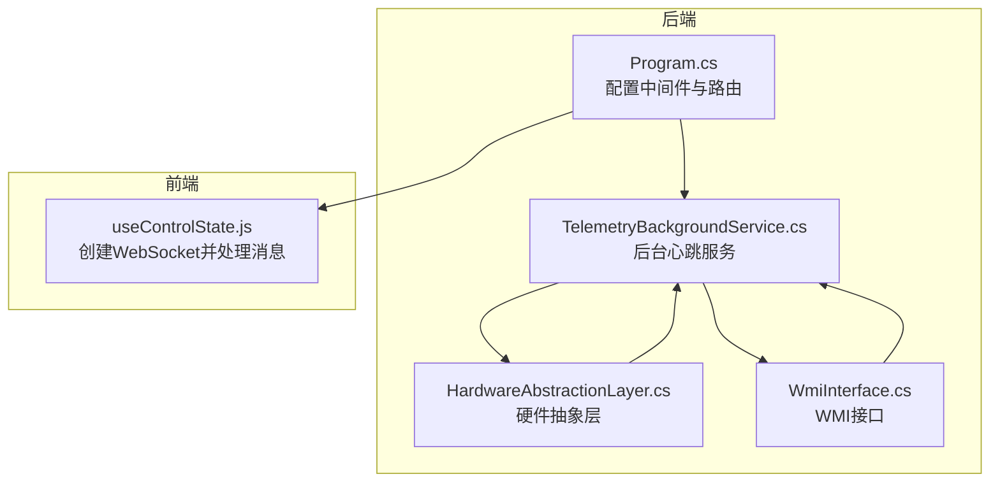
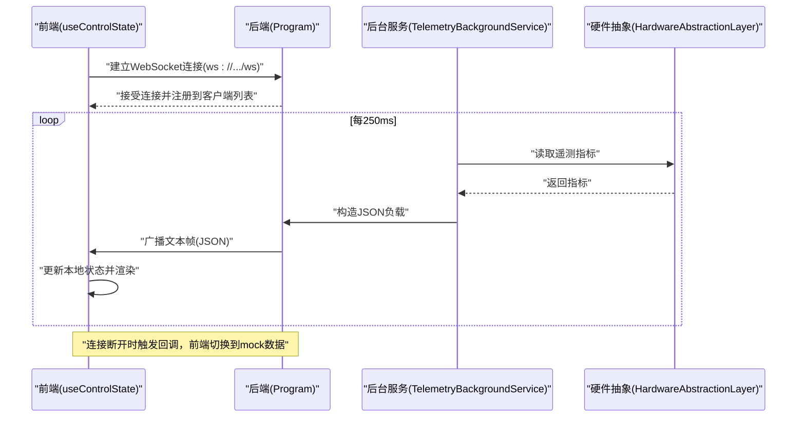
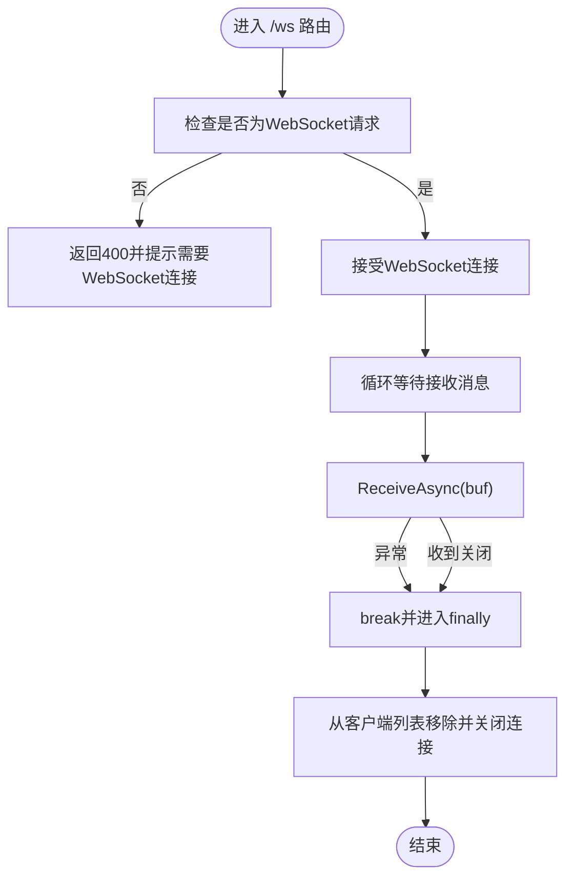
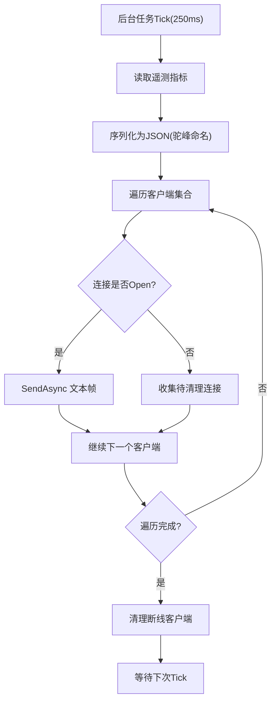
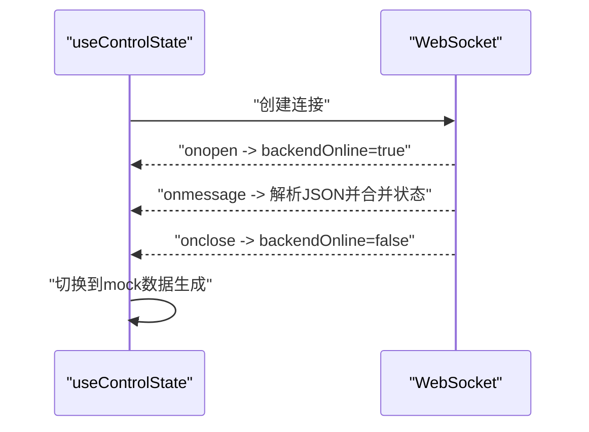
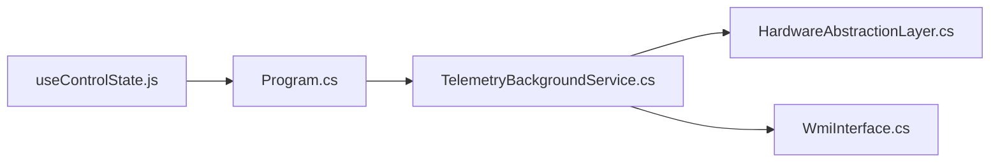

# WebSocket通信

<cite>
**本文引用的文件**
- [Program.cs](file://server/api/Program.cs)
- [TelemetryBackgroundService.cs](file://server/api/TelemetryBackgroundService.cs)
- [useControlState.js](file://src/hooks/useControlState.js)
- [WmiInterface.cs](file://server/api/WmiInterface.cs)
- [HardwareAbstractionLayer.cs](file://server/hal/HardwareAbstractionLayer.cs)
</cite>

## 目录
1. [简介](#简介)
2. [项目结构](#项目结构)
3. [核心组件](#核心组件)
4. [架构总览](#架构总览)
5. [详细组件分析](#详细组件分析)
6. [依赖关系分析](#依赖关系分析)
7. [性能考量](#性能考量)
8. [故障排查指南](#故障排查指南)
9. [结论](#结论)
10. [附录](#附录)

## 简介
本文件围绕项目中的WebSocket通信机制进行系统性技术说明，涵盖连接建立（握手、升级）、消息路由与分发、实时数据传输（心跳、保活、异常恢复）、消息格式与序列化、以及调试与监控方法。重点基于后端C#实现与前端React Hook的协作，解释全量遥测数据的推送流程与前端接收处理。

## 项目结构
- 后端采用ASP.NET Core，提供WebSocket端点与REST API，并通过后台服务周期性采集硬件遥测并通过WebSocket广播给所有连接的客户端。
- 前端使用React Hook建立WebSocket连接，接收后端推送的JSON遥测数据，同时在后端不可用时回退到本地模拟数据。

图示来源
- [Program.cs:1-120](file://server/api/Program.cs#L1-L120)
- [TelemetryBackgroundService.cs:1-143](file://server/api/TelemetryBackgroundService.cs#L1-L143)
- [HardwareAbstractionLayer.cs:1-772](file://server/hal/HardwareAbstractionLayer.cs#L1-L772)
- [WmiInterface.cs:1-210](file://server/api/WmiInterface.cs#L1-L210)
- [useControlState.js:242-257](file://src/hooks/useControlState.js#L242-L257)

章节来源
- [Program.cs:1-120](file://server/api/Program.cs#L1-L120)
- [TelemetryBackgroundService.cs:1-143](file://server/api/TelemetryBackgroundService.cs#L1-L143)
- [useControlState.js:242-257](file://src/hooks/useControlState.js#L242-L257)

## 核心组件
- WebSocket端点与握手
  - 后端在路由“/ws”上启用WebSocket支持，校验请求是否为WebSocket请求，若是则接受并建立连接，将连接加入全局客户端集合，循环等待接收消息（当前实现为空闲等待，不做业务处理），并在连接关闭或异常时清理。
- 后台遥测服务
  - 后台服务每250ms轮询HAL读取CPU/GPU温度、风扇转速、内存/磁盘使用等指标，构建JSON负载，遍历客户端集合进行广播；对异常或非Open状态的连接进行清理。
- 前端WebSocket客户端
  - React Hook在挂载时创建WebSocket连接，收到消息后合并到本地状态；断开时回调通知，前端可据此切换到mock数据。

章节来源
- [Program.cs:56-86](file://server/api/Program.cs#L56-L86)
- [TelemetryBackgroundService.cs:42-141](file://server/api/TelemetryBackgroundService.cs#L42-L141)
- [useControlState.js:242-257](file://src/hooks/useControlState.js#L242-L257)

## 架构总览
后端负责硬件遥测采集与WebSocket广播，前端负责连接维护与UI渲染。整体采用“后台服务定时推送 + 前端订阅”的模式，无显式的订阅/路由逻辑，属于广播式推送。

图示来源
- [Program.cs:56-86](file://server/api/Program.cs#L56-L86)
- [TelemetryBackgroundService.cs:54-141](file://server/api/TelemetryBackgroundService.cs#L54-L141)
- [useControlState.js:242-257](file://src/hooks/useControlState.js#L242-L257)

## 详细组件分析

### 后端WebSocket端点与握手
- 中间件与路由
  - 使用UseWebSockets启用WebSocket，随后在“/ws”路由上处理请求。
- 握手与升级
  - 校验IsWebSocketRequest，接受连接AcceptWebSocketAsync，进入循环等待接收消息。
- 连接生命周期
  - 循环内捕获WebSocketException即视为异常断开；收到关闭消息时退出循环；finally中从客户端集合移除并尝试正常关闭。

图示来源
- [Program.cs:56-86](file://server/api/Program.cs#L56-L86)

章节来源
- [Program.cs:56-86](file://server/api/Program.cs#L56-L86)

### 后台遥测服务（广播与心跳）
- 数据采集
  - 每250ms读取CPU/GPU温度、风扇转速、内存/磁盘使用、键盘背光、锁键状态、散热模式、电源计划、独显模式等。
- 消息格式与序列化
  - 使用System.Text.Json进行驼峰命名序列化，生成JSON字符串。
- 广播与异常处理
  - 遍历客户端集合，对Open状态的连接异步发送文本帧；对非Open或异常的连接收集并清理。
- 日志与稳定性
  - 对推送异常记录警告日志，避免影响主循环。

图示来源
- [TelemetryBackgroundService.cs:54-141](file://server/api/TelemetryBackgroundService.cs#L54-L141)

章节来源
- [TelemetryBackgroundService.cs:54-141](file://server/api/TelemetryBackgroundService.cs#L54-L141)

### 前端WebSocket客户端与消息处理
- 连接建立
  - 在组件挂载时调用createTelemetrySocket创建WebSocket，连接成功回调设置backendOnline为true。
- 消息处理
  - onmessage回调解析JSON，与现有本地状态进行浅合并，确保温度/风扇等实时字段被新数据覆盖。
- 异常与回退
  - onclose回调将backendOnline置为false，前端进入mock数据生成逻辑，维持界面可用性。

图示来源
- [useControlState.js:242-257](file://src/hooks/useControlState.js#L242-L257)

章节来源
- [useControlState.js:242-257](file://src/hooks/useControlState.js#L242-L257)

### 硬件抽象与数据源
- 硬件抽象层提供遥测指标读取，包括温度、风扇转速、CPU/GPU使用率、内存/磁盘使用等；部分指标通过子进程调用nvidia-smi或PowerShell获取。
- WMI接口提供系统级控制与查询能力（如Fn锁、触摸板锁、风扇控制、GPU模式等），作为遥测服务的一部分参与状态读取。

章节来源
- [HardwareAbstractionLayer.cs:147-747](file://server/hal/HardwareAbstractionLayer.cs#L147-L747)
- [WmiInterface.cs:62-198](file://server/api/WmiInterface.cs#L62-L198)

## 依赖关系分析
- 组件耦合
  - Program.cs依赖TelemetryBackgroundService进行广播；TelemetryBackgroundService依赖HardwareAbstractionLayer与WmiInterface读取数据。
  - 前端useControlState依赖后端WebSocket端点，形成单向数据流。
- 并发与同步
  - 后台服务使用静态列表存储客户端，通过锁保护集合操作；发送采用异步SendAsync，避免阻塞。
- 外部依赖
  - nvidia-smi与PowerShell用于部分遥测指标读取；WMI用于系统级控制与状态查询。

图示来源
- [Program.cs:1-120](file://server/api/Program.cs#L1-L120)
- [TelemetryBackgroundService.cs:1-143](file://server/api/TelemetryBackgroundService.cs#L1-L143)
- [HardwareAbstractionLayer.cs:1-772](file://server/hal/HardwareAbstractionLayer.cs#L1-L772)
- [WmiInterface.cs:1-210](file://server/api/WmiInterface.cs#L1-L210)
- [useControlState.js:242-257](file://src/hooks/useControlState.js#L242-L257)

章节来源
- [Program.cs:1-120](file://server/api/Program.cs#L1-L120)
- [TelemetryBackgroundService.cs:1-143](file://server/api/TelemetryBackgroundService.cs#L1-L143)
- [useControlState.js:242-257](file://src/hooks/useControlState.js#L242-L257)

## 性能考量
- 推送频率与负载
  - 后台服务250ms一次，每次序列化全量遥测并广播给所有客户端，适合轻量指标与中等并发连接数场景。
- 发送与清理
  - 异步发送避免阻塞；对非Open连接及时清理，降低无效发送成本。
- 前端渲染
  - 前端按需更新状态，避免频繁重渲染；在后端不可用时使用本地模拟，保证交互连续性。

## 故障排查指南
- 连接无法建立
  - 检查后端是否正确启用UseWebSockets与Map“/ws”路由；确认浏览器端URL与端口一致。
- 连接立即断开
  - 查看后端日志中WebSocketException相关异常；确认前端onerror/onclose回调是否触发。
- 无数据更新
  - 检查后台服务日志中“推送异常”警告；确认HAL健康检查与外部依赖（如nvidia-smi）是否可用。
- 前端状态未刷新
  - 确认onmessage解析JSON是否成功；检查本地状态合并逻辑是否覆盖了温度/风扇等字段。

章节来源
- [Program.cs:56-86](file://server/api/Program.cs#L56-L86)
- [TelemetryBackgroundService.cs:136-139](file://server/api/TelemetryBackgroundService.cs#L136-L139)
- [useControlState.js:242-257](file://src/hooks/useControlState.js#L242-L257)

## 结论
该项目的WebSocket通信以“后台服务定时推送 + 前端订阅”为核心，实现了稳定的硬件遥测广播。后端通过250ms心跳周期与异步广播保障实时性，前端在后端不可用时提供本地mock回退，确保用户体验连续性。当前实现未包含显式订阅/路由机制，属于广播式推送，适合中小规模实时监控场景。

## 附录
- WebSocket端点
  - 路由：/ws
  - 方法：GET（升级为WebSocket）
  - 协议：文本帧（JSON）
- 消息格式
  - 字段：包含CPU/GPU使用率、温度、频率、风扇转速、内存/磁盘使用、键盘背光、锁键状态、散热模式、电源计划、独显模式等。
  - 编码：UTF-8
  - 序列化：System.Text.Json（驼峰命名）
- 调试与监控
  - 后端日志：关注“[Telemetry] 推送异常”等警告。
  - 前端调试：页面内置WebSocket调试面板，显示连接状态与实时字段网格。
  - 健康检查：/api/health返回后端健康状态与时间戳。

章节来源
- [Program.cs:87-120](file://server/api/Program.cs#L87-L120)
- [TelemetryBackgroundService.cs:70-102](file://server/api/TelemetryBackgroundService.cs#L70-L102)
- [Program.cs:687-691](file://server/api/Program.cs#L687-L691)