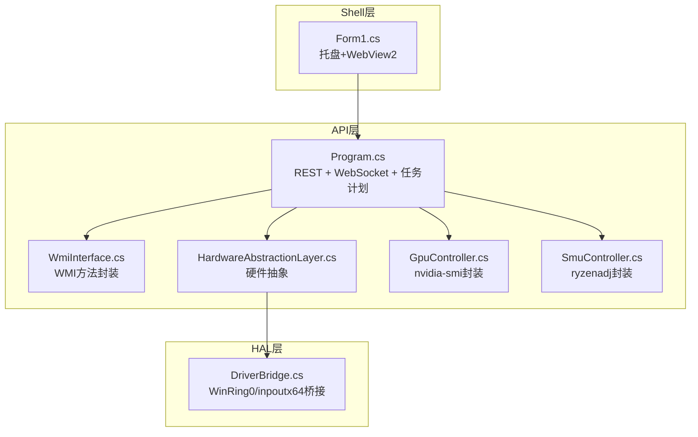
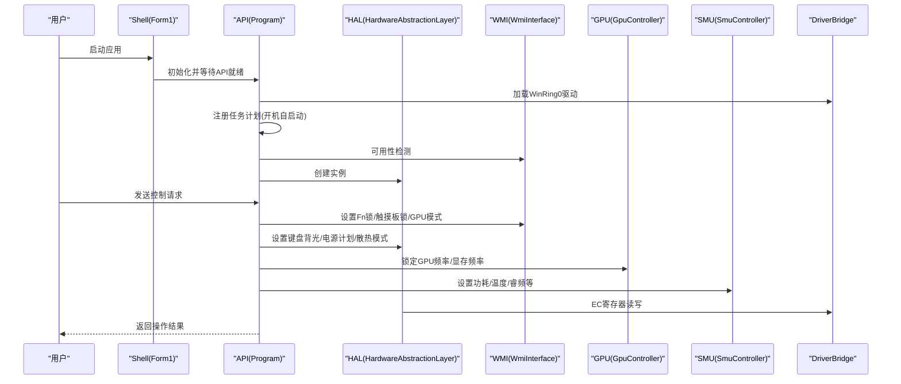
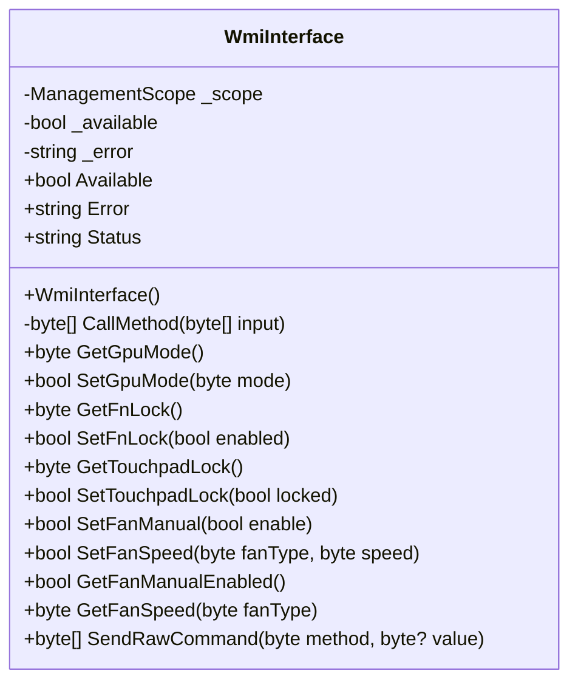
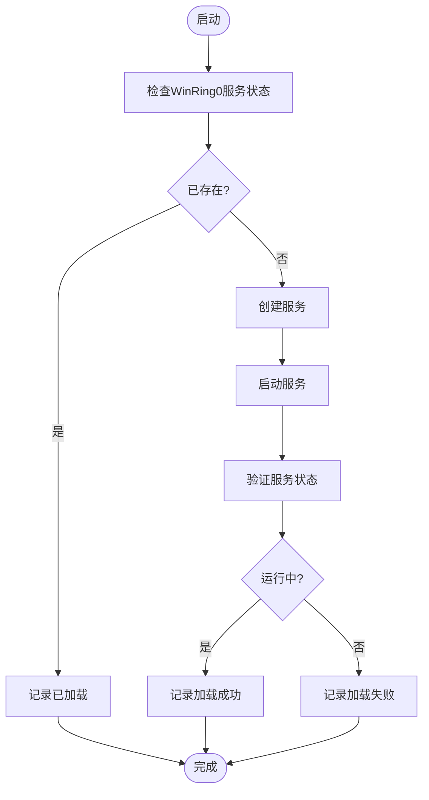
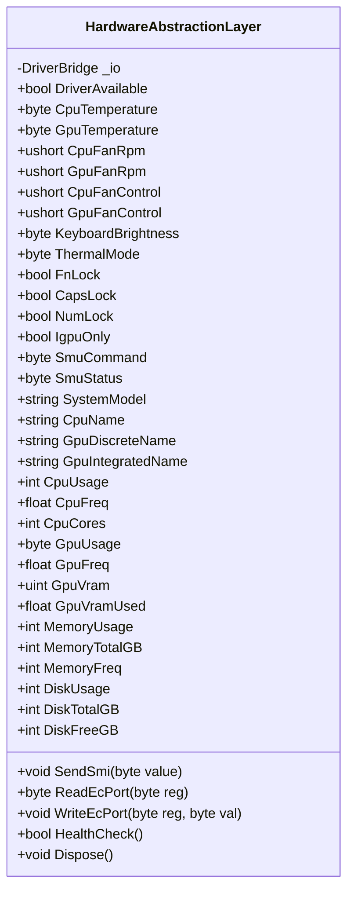
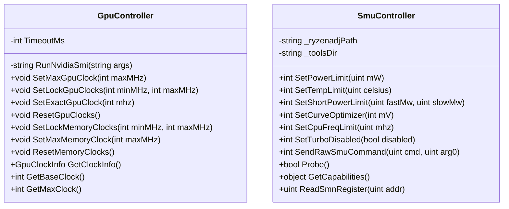
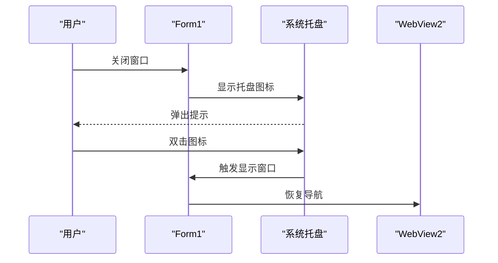
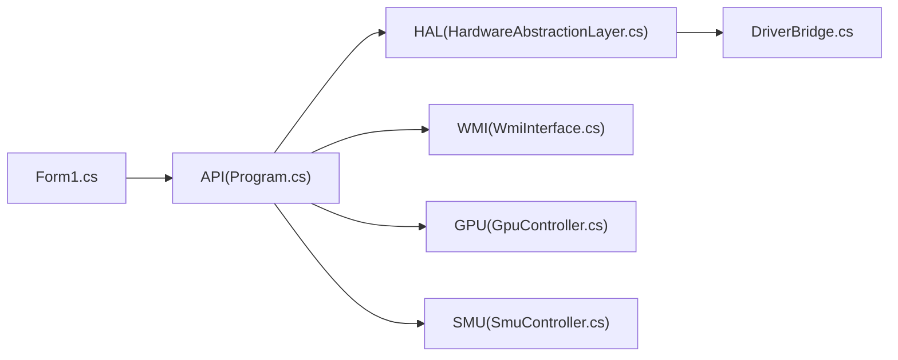

# Windows系统集成

<cite>
**本文档引用的文件**
- [WmiInterface.cs](file://server/api/WmiInterface.cs)
- [DriverBridge.cs](file://server/hal/DriverBridge.cs)
- [HardwareAbstractionLayer.cs](file://server/hal/HardwareAbstractionLayer.cs)
- [Program.cs](file://server/api/Program.cs)
- [Form1.cs](file://server/shell/Douzhanzhe.Shell/Form1.cs)
- [Douzhanzhe.API.csproj](file://server/api/Douzhanzhe.API.csproj)
- [Douzhanzhe.HAL.csproj](file://server/hal/Douzhanzhe.HAL.csproj)
- [Douzhanzhe.Shell.csproj](file://server/shell/Douzhanzhe.Shell/Douzhanzhe.Shell.csproj)
- [GpuController.cs](file://server/hal/GpuController.cs)
- [SmuController.cs](file://server/hal/SmuController.cs)
</cite>

## 目录
1. [简介](#简介)
2. [项目结构](#项目结构)
3. [核心组件](#核心组件)
4. [架构总览](#架构总览)
5. [详细组件分析](#详细组件分析)
6. [依赖关系分析](#依赖关系分析)
7. [性能考量](#性能考量)
8. [故障排除指南](#故障排除指南)
9. [结论](#结论)
10. [附录](#附录)

## 简介
本文件面向Windows系统的深度集成能力，围绕以下主题展开：
- WMI接口实现机制：WMI查询、方法调用与事件监听
- Windows任务计划程序集成：开机自启动配置、任务创建与状态管理
- WinRing0内核驱动加载与管理：驱动安装、服务控制与权限验证
- 系统托盘集成、通知管理与快捷键处理机制
- Windows兼容性测试、权限提升与安全考虑

该系统通过C#后端提供REST API与WebSocket遥测，前端以WebView2承载，配合Windows原生能力实现对硬件与系统的精细控制。

## 项目结构
项目采用分层架构：
- API层：提供REST接口与WebSocket服务，负责业务编排与外部交互
- HAL层：硬件抽象层，封装底层硬件访问（WMI、EC、SMU、PCI等）
- Shell层：Windows Forms应用，承载WebView2界面，实现托盘与最小化行为
- 工具与依赖：包含第三方库（System.Management、TaskScheduler）、驱动DLL与工具程序

**图表来源**
- [Program.cs:1-783](file://server/api/Program.cs#L1-L783)
- [WmiInterface.cs:1-210](file://server/api/WmiInterface.cs#L1-L210)
- [HardwareAbstractionLayer.cs:1-772](file://server/hal/HardwareAbstractionLayer.cs#L1-L772)
- [DriverBridge.cs:1-150](file://server/hal/DriverBridge.cs#L1-L150)
- [GpuController.cs:1-116](file://server/hal/GpuController.cs#L1-L116)
- [SmuController.cs:1-142](file://server/hal/SmuController.cs#L1-L142)
- [Form1.cs:1-140](file://server/shell/Douzhanzhe.Shell/Form1.cs#L1-L140)

**章节来源**
- [Program.cs:1-783](file://server/api/Program.cs#L1-L783)
- [Douzhanzhe.API.csproj:1-40](file://server/api/Douzhanzhe.API.csproj#L1-L40)
- [Douzhanzhe.HAL.csproj:1-18](file://server/hal/Douzhanzhe.HAL.csproj#L1-L18)
- [Douzhanzhe.Shell.csproj:1-16](file://server/shell/Douzhanzhe.Shell/Douzhanzhe.Shell.csproj#L1-L16)

## 核心组件
- WmiInterface：封装WMI MICommonInterface方法调用，支持GPU模式、Fn锁、触摸板锁、风扇控制等
- HardwareAbstractionLayer：在DriverBridge之上提供语义化硬件访问，包括电源计划、键盘背光、散热模式、风扇目标控制等
- DriverBridge：通过inpoutx64.dll与WinRing0内核驱动交互，提供EC寄存器读写、物理内存映射、I/O端口访问
- GpuController：封装nvidia-smi子进程，实现GPU频率锁定与查询
- SmuController：封装ryzenadj.exe子进程，实现AMD SMU参数设置与探测
- Program：ASP.NET Core应用，提供REST API、WebSocket、任务计划与WinRing0驱动自动加载
- Form1：Windows Forms外壳，承载WebView2，实现托盘、最小化与通知

**章节来源**
- [WmiInterface.cs:1-210](file://server/api/WmiInterface.cs#L1-L210)
- [HardwareAbstractionLayer.cs:1-772](file://server/hal/HardwareAbstractionLayer.cs#L1-L772)
- [DriverBridge.cs:1-150](file://server/hal/DriverBridge.cs#L1-L150)
- [GpuController.cs:1-116](file://server/hal/GpuController.cs#L1-L116)
- [SmuController.cs:1-142](file://server/hal/SmuController.cs#L1-L142)
- [Program.cs:1-783](file://server/api/Program.cs#L1-L783)
- [Form1.cs:1-140](file://server/shell/Douzhanzhe.Shell/Form1.cs#L1-L140)

## 架构总览
系统通过API层统一对外提供接口，HAL层抽象硬件差异，Shell层提供用户界面与托盘交互。关键流程包括：
- 启动时自动检测并加载WinRing0内核驱动
- 通过任务计划程序实现开机自启动
- 使用WMI与EC寄存器实现硬件控制
- 通过nvidia-smi与ryzenadj实现GPU/SMU控制
- 通过WebSocket推送遥测数据

**图表来源**
- [Program.cs:692-724](file://server/api/Program.cs#L692-L724)
- [Program.cs:620-686](file://server/api/Program.cs#L620-L686)
- [WmiInterface.cs:24-44](file://server/api/WmiInterface.cs#L24-L44)
- [HardwareAbstractionLayer.cs:48-54](file://server/hal/HardwareAbstractionLayer.cs#L48-L54)
- [GpuController.cs:14-40](file://server/hal/GpuController.cs#L14-L40)
- [SmuController.cs:43-57](file://server/hal/SmuController.cs#L43-L57)
- [DriverBridge.cs:39-62](file://server/hal/DriverBridge.cs#L39-L62)

## 详细组件分析

### WMI接口实现机制
WmiInterface通过System.Management访问root\WMI命名空间中的MICommonInterface实例，执行MiInterface方法进行硬件控制。其核心特性：
- 方法调用：构造InData数组，调用MiInterface方法，解析OutData
- 功能覆盖：GPU模式、Fn锁、触摸板锁、风扇手动模式与转速设置
- 错误处理：捕获异常并记录错误信息，提供可用性状态

**图表来源**
- [WmiInterface.cs:18-210](file://server/api/WmiInterface.cs#L18-L210)

**章节来源**
- [WmiInterface.cs:24-44](file://server/api/WmiInterface.cs#L24-L44)
- [WmiInterface.cs:50-60](file://server/api/WmiInterface.cs#L50-L60)
- [WmiInterface.cs:62-87](file://server/api/WmiInterface.cs#L62-L87)
- [WmiInterface.cs:89-111](file://server/api/WmiInterface.cs#L89-L111)
- [WmiInterface.cs:113-135](file://server/api/WmiInterface.cs#L113-L135)
- [WmiInterface.cs:137-198](file://server/api/WmiInterface.cs#L137-L198)
- [WmiInterface.cs:200-208](file://server/api/WmiInterface.cs#L200-L208)

### Windows任务计划程序集成
Program通过TaskScheduler库实现开机自启动：
- 读取/写入auto-start-opts.json以支持最小化偏好
- 创建任务定义，设置登录触发器与最高权限
- 自动定位Shell可执行文件（含开发环境回退路径）

```mermaid
sequenceDiagram
participant API as "API(Program)"
participant TS as "TaskService"
participant FS as "文件系统"
API->>FS : 读取auto-start-opts.json
API->>TS : 创建任务定义(登录触发器, 最高权限)
API->>TS : 注册任务"DouzhanzheControl"
API->>TS : 查询任务是否存在
TS-->>API : 返回启用状态
```

**图表来源**
- [Program.cs:586-618](file://server/api/Program.cs#L586-L618)
- [Program.cs:620-686](file://server/api/Program.cs#L620-L686)

**章节来源**
- [Program.cs:586-618](file://server/api/Program.cs#L586-L618)
- [Program.cs:620-686](file://server/api/Program.cs#L620-L686)

### WinRing0内核驱动加载与管理
系统在启动时尝试自动加载WinRing0内核驱动：
- 检查服务状态，不存在则创建并启动
- 验证服务状态，输出日志
- 通过DriverBridge提供EC寄存器与物理内存访问

**图表来源**
- [Program.cs:692-724](file://server/api/Program.cs#L692-L724)
- [DriverBridge.cs:39-62](file://server/hal/DriverBridge.cs#L39-L62)

**章节来源**
- [Program.cs:692-724](file://server/api/Program.cs#L692-L724)
- [DriverBridge.cs:39-62](file://server/hal/DriverBridge.cs#L39-L62)

### 硬件抽象层与EC交互
HardwareAbstractionLayer在DriverBridge之上提供高层硬件接口：
- 电源计划切换：通过PowerSetActiveScheme
- 键盘背光：EC寄存器写入
- 散热模式：EC寄存器写入
- 风扇目标控制：EC寄存器写入
- 系统信息：通过PowerShell查询
- 遥测采集：CPU/GPU/内存/磁盘等

**图表来源**
- [HardwareAbstractionLayer.cs:19-772](file://server/hal/HardwareAbstractionLayer.cs#L19-L772)

**章节来源**
- [HardwareAbstractionLayer.cs:113-136](file://server/hal/HardwareAbstractionLayer.cs#L113-L136)
- [HardwareAbstractionLayer.cs:319-329](file://server/hal/HardwareAbstractionLayer.cs#L319-L329)
- [HardwareAbstractionLayer.cs:335-340](file://server/hal/HardwareAbstractionLayer.cs#L335-L340)
- [HardwareAbstractionLayer.cs:237-265](file://server/hal/HardwareAbstractionLayer.cs#L237-L265)
- [HardwareAbstractionLayer.cs:456-574](file://server/hal/HardwareAbstractionLayer.cs#L456-L574)
- [HardwareAbstractionLayer.cs:580-747](file://server/hal/HardwareAbstractionLayer.cs#L580-L747)
- [HardwareAbstractionLayer.cs:753-765](file://server/hal/HardwareAbstractionLayer.cs#L753-L765)

### GPU控制器与SMU控制器
- GpuController：封装nvidia-smi子进程，支持锁定/重置GPU与显存频率，查询当前频率与功耗
- SmuController：封装ryzenadj.exe子进程，支持功耗、温度、曲线优化、频率限制与睿频开关等

**图表来源**
- [GpuController.cs:10-116](file://server/hal/GpuController.cs#L10-L116)
- [SmuController.cs:12-142](file://server/hal/SmuController.cs#L12-L142)

**章节来源**
- [GpuController.cs:14-86](file://server/hal/GpuController.cs#L14-L86)
- [SmuController.cs:43-121](file://server/hal/SmuController.cs#L43-L121)

### 系统托盘集成、通知管理与快捷键处理
Form1实现托盘与通知：
- 托盘菜单：显示主窗口、退出
- 最小化行为：最小化到托盘，支持双击恢复
- 通知：最小化提示、关闭提示
- 快捷键：通过命令行参数支持最小化启动

**图表来源**
- [Form1.cs:31-56](file://server/shell/Douzhanzhe.Shell/Form1.cs#L31-L56)
- [Form1.cs:61-92](file://server/shell/Douzhanzhe.Shell/Form1.cs#L61-L92)
- [Form1.cs:94-111](file://server/shell/Douzhanzhe.Shell/Form1.cs#L94-L111)

**章节来源**
- [Form1.cs:31-56](file://server/shell/Douzhanzhe.Shell/Form1.cs#L31-L56)
- [Form1.cs:61-92](file://server/shell/Douzhanzhe.Shell/Form1.cs#L61-L92)
- [Form1.cs:94-111](file://server/shell/Douzhanzhe.Shell/Form1.cs#L94-L111)

## 依赖关系分析
- API层依赖HAL层与第三方库（System.Management、TaskScheduler）
- HAL层依赖DriverBridge与WinRing0/inpoutx64驱动
- Shell层依赖Microsoft.Web.WebView2与Windows Forms
- API层通过WMI与EC寄存器实现硬件控制，通过子进程调用nvidia-smi与ryzenadj

**图表来源**
- [Program.cs:1-17](file://server/api/Program.cs#L1-L17)
- [Douzhanzhe.API.csproj:12-33](file://server/api/Douzhanzhe.API.csproj#L12-L33)
- [Douzhanzhe.HAL.csproj:13-15](file://server/hal/Douzhanzhe.HAL.csproj#L13-L15)
- [Douzhanzhe.Shell.csproj:12-14](file://server/shell/Douzhanzhe.Shell/Douzhanzhe.Shell.csproj#L12-L14)

**章节来源**
- [Douzhanzhe.API.csproj:12-33](file://server/api/Douzhanzhe.API.csproj#L12-L33)
- [Douzhanzhe.HAL.csproj:13-15](file://server/hal/Douzhanzhe.HAL.csproj#L13-L15)
- [Douzhanzhe.Shell.csproj:12-14](file://server/shell/Douzhanzhe.Shell/Douzhanzhe.Shell.csproj#L12-L14)

## 性能考量
- 遥测缓存：HAL对CPU/GPU/内存/磁盘等遥测进行短期缓存，减少频繁查询
- EC寄存器仲裁：风扇转速读取采用多次仲裁策略，避免竞态
- 子进程超时：nvidia-smi与ryzenadj设置超时，防止阻塞
- WebSocket：长连接推送遥测，降低轮询开销

**章节来源**
- [HardwareAbstractionLayer.cs:580-747](file://server/hal/HardwareAbstractionLayer.cs#L580-L747)
- [HardwareAbstractionLayer.cs:197-229](file://server/hal/HardwareAbstractionLayer.cs#L197-L229)
- [GpuController.cs:12-40](file://server/hal/GpuController.cs#L12-L40)
- [SmuController.cs:13-57](file://server/hal/SmuController.cs#L13-L57)

## 故障排除指南
- WMI不可用：检查root\WMI命名空间与MICommonInterface实例可用性，查看错误信息
- 驱动加载失败：确认WinRing0.sys存在且sc.exe可创建/启动服务，查看日志输出
- 任务计划失败：确认TaskService可用、Shell路径正确、最小化偏好文件存在
- 权限不足：确保以管理员身份运行，任务计划设置为最高权限
- nvidia-smi/ryzenadj不可用：确认工具存在于预期路径，检查工作目录与权限

**章节来源**
- [WmiInterface.cs:39-44](file://server/api/WmiInterface.cs#L39-L44)
- [Program.cs:692-724](file://server/api/Program.cs#L692-L724)
- [Program.cs:620-686](file://server/api/Program.cs#L620-L686)
- [GpuController.cs:14-40](file://server/hal/GpuController.cs#L14-L40)
- [SmuController.cs:43-57](file://server/hal/SmuController.cs#L43-L57)

## 结论
该系统通过多层抽象与Windows原生能力实现了对硬件与系统的深度集成，涵盖WMI控制、EC寄存器访问、GPU/SMU参数调节、任务计划与托盘交互。建议在生产环境中加强权限校验与错误恢复，并持续优化遥测与控制的实时性与稳定性。

## 附录
- 项目构建与输出路径：API与HAL均配置了统一的输出路径，便于打包部署
- 依赖包：System.Management、TaskScheduler、Microsoft.Web.WebView2等
- 工具链：inpoutx64.dll、WinRing0.sys、nvidia-smi、ryzenadj.exe

**章节来源**
- [Douzhanzhe.API.csproj:7-9](file://server/api/Douzhanzhe.API.csproj#L7-L9)
- [Douzhanzhe.HAL.csproj:7-11](file://server/hal/Douzhanzhe.HAL.csproj#L7-L11)
- [Douzhanzhe.Shell.csproj:7-9](file://server/shell/Douzhanzhe.Shell/Douzhanzhe.Shell.csproj#L7-L9)