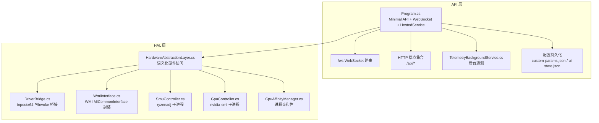
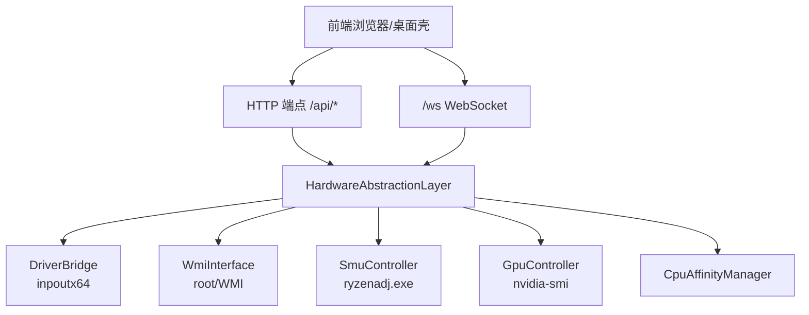
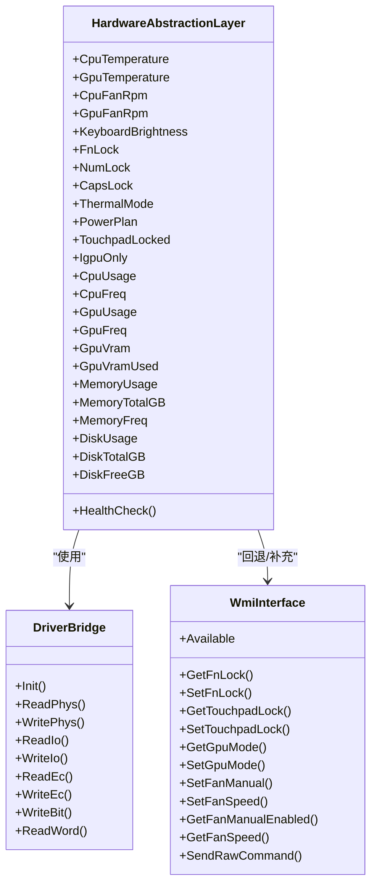
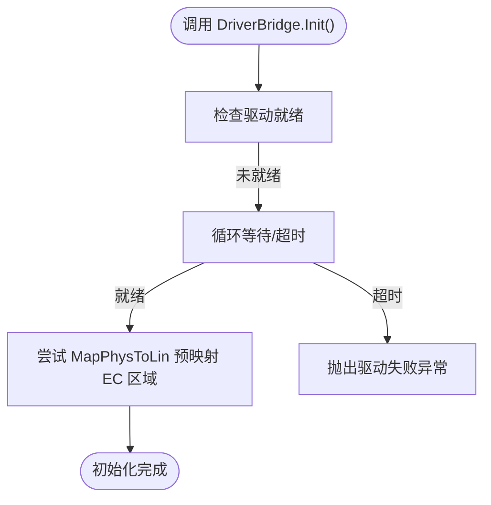
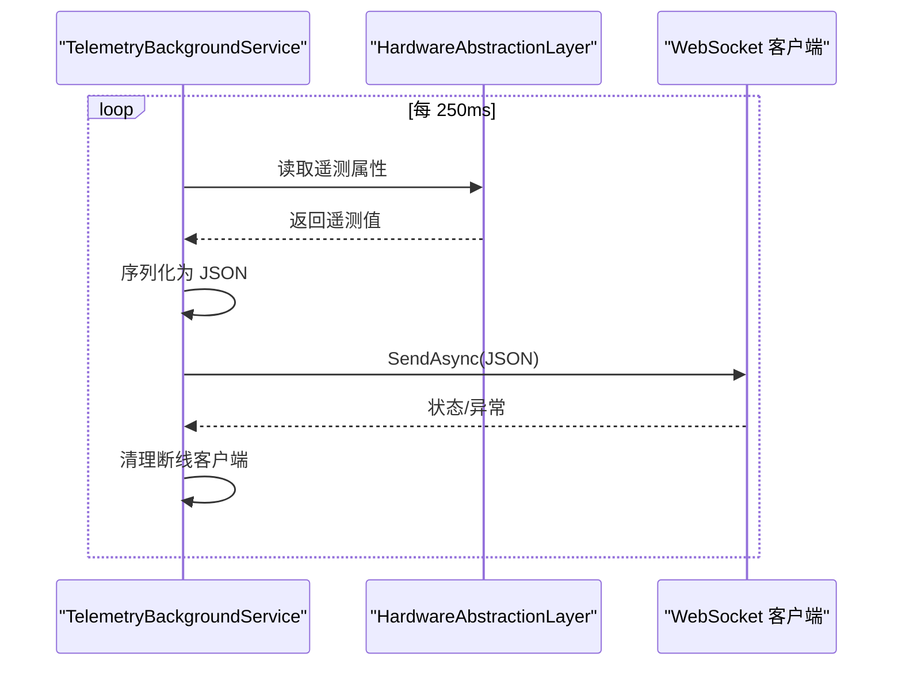
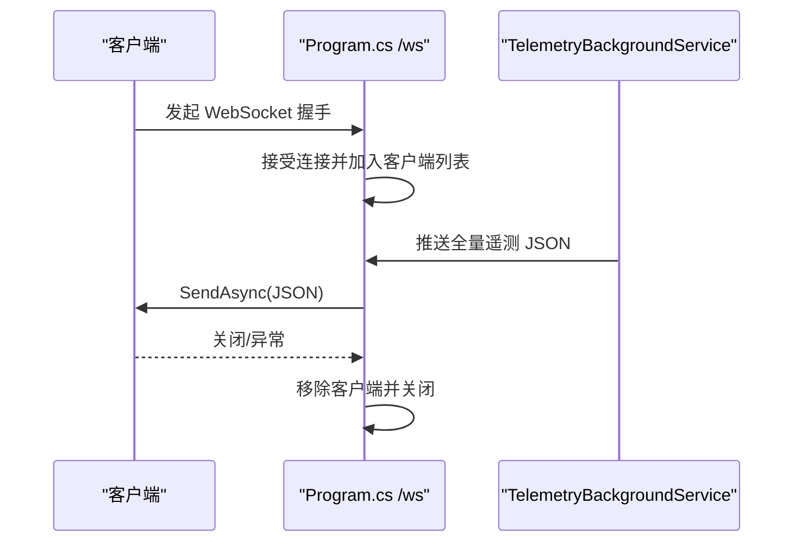
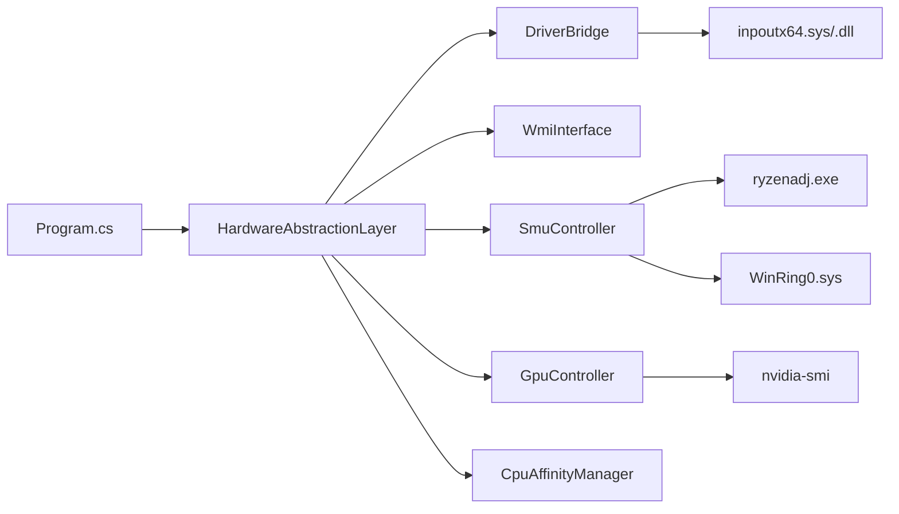

# 后端服务

<cite>
**本文引用的文件**
- [Program.cs](file://server/api/Program.cs)
- [TelemetryBackgroundService.cs](file://server/api/TelemetryBackgroundService.cs)
- [WmiInterface.cs](file://server/api/WmiInterface.cs)
- [HardwareAbstractionLayer.cs](file://server/hal/HardwareAbstractionLayer.cs)
- [DriverBridge.cs](file://server/hal/DriverBridge.cs)
- [SmuController.cs](file://server/hal/SmuController.cs)
- [GpuController.cs](file://server/hal/GpuController.cs)
- [CpuAffinityManager.cs](file://server/hal/CpuAffinityManager.cs)
- [appsettings.json](file://server/api/appsettings.json)
- [custom-params.json](file://server/api/config/custom-params.json)
- [dashboard-default.json](file://server/config/dashboard-default.json)
- [dev-backend.md](file://docs/dev-backend.md)
- [dev-architecture.md](file://docs/dev-architecture.md)
</cite>

## 目录
1. [简介](#简介)
2. [项目结构](#项目结构)
3. [核心组件](#核心组件)
4. [架构总览](#架构总览)
5. [详细组件分析](#详细组件分析)
6. [依赖关系分析](#依赖关系分析)
7. [性能考量](#性能考量)
8. [故障排除指南](#故障排除指南)
9. [结论](#结论)
10. [附录](#附录)

## 简介
本文件面向 DOUZHANZHE-Control 后端服务（C# ASP.NET Core API），系统性梳理其服务注册、中间件配置、依赖注入容器使用、硬件抽象层（HAL）架构、驱动桥接层与 inpoutx64 的交互、后台遥测服务的实现机制、WebSocket 实时通信、服务配置与性能调优、以及故障排除要点。文档同时给出可视化图示，帮助读者快速把握系统全貌与关键流程。

## 项目结构
后端采用“API 层 + HAL 层”的分层设计：
- API 层（server/api）：.NET 8 Minimal API，提供 HTTP 端点、WebSocket、后台服务、配置持久化与开机自启管理。
- HAL 层（server/hal）：硬件抽象与控制，包含 DriverBridge 驱动桥接层、HardwareAbstractionLayer 语义化硬件访问、SmuController（ryzenadj 子进程）、GpuController（nvidia-smi 子进程）、CpuAffinityManager（进程亲和性）等。

图表来源
- [Program.cs:1-783](file://server/api/Program.cs#L1-L783)
- [HardwareAbstractionLayer.cs:1-767](file://server/hal/HardwareAbstractionLayer.cs#L1-L767)
- [DriverBridge.cs:1-133](file://server/hal/DriverBridge.cs#L1-L133)
- [WmiInterface.cs:1-210](file://server/api/WmiInterface.cs#L1-L210)
- [SmuController.cs:1-142](file://server/hal/SmuController.cs#L1-L142)
- [GpuController.cs:1-116](file://server/hal/GpuController.cs#L1-L116)
- [CpuAffinityManager.cs:1-101](file://server/hal/CpuAffinityManager.cs#L1-L101)

章节来源
- [dev-architecture.md:1-120](file://docs/dev-architecture.md#L1-L120)
- [Program.cs:1-783](file://server/api/Program.cs#L1-L783)

## 核心组件
- 服务注册与中间件
  - 依赖注入容器注册：HAL、SMU、GPU、WMI、后台遥测服务、跨域策略。
  - 中间件：CORS、WebSocket、静态文件与 SPA 回退。
- 硬件抽象层（HAL）
  - 将 EC 寄存器与物理内存映射为语义化属性，统一温度、风扇、键盘背光、散热模式、电源计划、触摸板锁等访问。
- 驱动桥接层（DriverBridge）
  - 封装 inpoutx64 的 P/Invoke，提供物理内存读写、IO 端口读写、EC 协议读写、SMU 物理地址访问等能力。
- 后台遥测服务（TelemetryBackgroundService）
  - 每 250ms 轮询 HAL，构建全量遥测 JSON，推送给所有 WebSocket 客户端。
- WMI 接口（WmiInterface）
  - 封装 root/WMI MICommonInterface 的 MiInterface 方法，提供 FnLock、触摸板锁、GPU 模式、风扇控制等。
- SMU 控制（SmuController）
  - 通过子进程调用 ryzenadj.exe 下发 AMD SMU 参数，配合 WinRing0 驱动。
- GPU 控制（GpuController）
  - 通过子进程调用 nvidia-smi，实现锁频、上限限制、重置等。
- CPU 核心限制（CpuAffinityManager）
  - 通过进程亲和性限制可用核心数，结合 WMI 监听新进程自动应用。

章节来源
- [Program.cs:10-14](file://server/api/Program.cs#L10-L14)
- [Program.cs:15-22](file://server/api/Program.cs#L15-L22)
- [HardwareAbstractionLayer.cs:19-52](file://server/hal/HardwareAbstractionLayer.cs#L19-L52)
- [DriverBridge.cs:9-54](file://server/hal/DriverBridge.cs#L9-L54)
- [TelemetryBackgroundService.cs:17-40](file://server/api/TelemetryBackgroundService.cs#L17-L40)
- [WmiInterface.cs:18-48](file://server/api/WmiInterface.cs#L18-L48)
- [SmuController.cs:12-41](file://server/hal/SmuController.cs#L12-L41)
- [GpuController.cs:10-40](file://server/hal/GpuController.cs#L10-L40)
- [CpuAffinityManager.cs:15-53](file://server/hal/CpuAffinityManager.cs#L15-L53)

## 架构总览
系统采用“单一进程 + Minimal API + 后台服务 + WebSocket”的轻量架构，API 层负责对外暴露 HTTP/WebSocket，HAL 层负责硬件抽象与控制，底层通过 inpoutx64 与 WMI/子进程协同完成硬件访问。

图表来源
- [Program.cs:56-86](file://server/api/Program.cs#L56-L86)
- [Program.cs:87-143](file://server/api/Program.cs#L87-L143)
- [HardwareAbstractionLayer.cs:19-52](file://server/hal/HardwareAbstractionLayer.cs#L19-L52)
- [WmiInterface.cs:18-48](file://server/api/WmiInterface.cs#L18-L48)
- [SmuController.cs:12-41](file://server/hal/SmuController.cs#L12-L41)
- [GpuController.cs:10-40](file://server/hal/GpuController.cs#L10-L40)
- [CpuAffinityManager.cs:15-53](file://server/hal/CpuAffinityManager.cs#L15-L53)

章节来源
- [dev-architecture.md:10-46](file://docs/dev-architecture.md#L10-L46)

## 详细组件分析

### 服务注册与中间件配置
- 依赖注入
  - 注册 HAL、SMU、GPU、WMI、后台遥测服务为单例，确保多处使用共享同一实例。
- CORS
  - 默认策略允许任意来源/方法/头，便于前端开发调试。
- 中间件
  - UseWebSockets：启用 WebSocket 支持。
  - UseStaticFiles + MapFallbackToFile：静态资源托管与 SPA 回退。
- 配置目录
  - 自动定位 config 目录（与 Node.js 共享），提供 JSON 持久化辅助函数。

章节来源
- [Program.cs:10-14](file://server/api/Program.cs#L10-L14)
- [Program.cs:15-22](file://server/api/Program.cs#L15-L22)
- [Program.cs:23-55](file://server/api/Program.cs#L23-L55)

### 硬件抽象层（HAL）
- 设计目标
  - 在 DriverBridge 之上提供语义化硬件访问接口，屏蔽底层 EC 寄存器与物理内存细节。
- 关键能力
  - 遥测缓存与降采样：CPU/GPU/内存/磁盘等遥测带时间戳缓存，避免频繁系统调用。
  - EC 寄存器映射：温度、风扇转速、键盘背光、Fn 锁、散热模式等。
  - WMI 回退：当 HAL 无法获取时，优先使用 WMI（如 FnLock、触摸板锁、GPU 模式）。
  - 子进程回退：GPU 温度、风扇转速等通过 nvidia-smi 获取。
- 健康检查
  - 通过读取 CPU 温度进行健康检查，阈值范围用于判断驱动与 EC 通信状态。

图表来源
- [HardwareAbstractionLayer.cs:19-767](file://server/hal/HardwareAbstractionLayer.cs#L19-L767)
- [DriverBridge.cs:9-133](file://server/hal/DriverBridge.cs#L9-L133)
- [WmiInterface.cs:18-210](file://server/api/WmiInterface.cs#L18-L210)

章节来源
- [HardwareAbstractionLayer.cs:19-767](file://server/hal/HardwareAbstractionLayer.cs#L19-L767)

### 驱动桥接层（DriverBridge）与 inpoutx64 交互
- 职责
  - 封装 inpoutx64 的 P/Invoke，提供物理内存读写、IO 端口读写、EC 协议读写、SMU 物理地址访问。
- 初始化与就绪
  - Init() 等待驱动就绪，尝试预映射 EC 区域（0xFE800400, 0xFF）。
- 写入策略
  - 优先使用 SetPhysLong（32 位地址），对部分地址无效时回退 MapPhysToLin 动态映射。
- EC 协议
  - 严格遵循 IBF 等待与时序，保证 EC 读写稳定性。
- SMU 访问
  - 通过物理地址直写（SetPhysLong/GetPhysLong）与 WinRing0 驱动协作。

图表来源
- [DriverBridge.cs:39-54](file://server/hal/DriverBridge.cs#L39-L54)

章节来源
- [DriverBridge.cs:9-133](file://server/hal/DriverBridge.cs#L9-L133)

### 后台遥测服务（TelemetryBackgroundService）
- 职责
  - 每 250ms 轮询 HAL，构建全量遥测 JSON，推送给所有已连接的 WebSocket 客户端。
- 客户端管理
  - 线程安全的客户端列表，连接关闭或异常时清理断线客户端。
- 日志与容错
  - 捕获异常并记录警告日志，不影响服务持续运行。

图表来源
- [TelemetryBackgroundService.cs:54-141](file://server/api/TelemetryBackgroundService.cs#L54-L141)

章节来源
- [TelemetryBackgroundService.cs:17-143](file://server/api/TelemetryBackgroundService.cs#L17-L143)

### WebSocket 实时通信
- 建立与维护
  - /ws 路由仅接受 WebSocket 请求，接受后加入客户端列表；收到关闭消息或异常时移除并关闭连接。
- 消息路由
  - 由后台遥测服务统一推送全量遥测；前端负责渲染与展示。
- 连接池管理
  - 线程安全的静态列表 + 锁，避免并发修改问题。

图表来源
- [Program.cs:56-86](file://server/api/Program.cs#L56-L86)
- [TelemetryBackgroundService.cs:42-52](file://server/api/TelemetryBackgroundService.cs#L42-L52)

章节来源
- [Program.cs:56-86](file://server/api/Program.cs#L56-L86)
- [TelemetryBackgroundService.cs:23-52](file://server/api/TelemetryBackgroundService.cs#L23-L52)

### WMI 接口（WmiInterface）
- 能力
  - 提供 FnLock、触摸板锁、GPU 模式、风扇控制（Bellator 协议）、通用 Raw 命令等。
- 调用方式
  - 通过 root/WMI MICommonInterface 的 MiInterface 方法，构造 InData/OutData。
- 回退策略
  - 当 HAL 无法获取时，优先使用 WMI（如 FnLock、触摸板锁、GPU 模式）。

章节来源
- [WmiInterface.cs:18-210](file://server/api/WmiInterface.cs#L18-L210)

### SMU 控制（SmuController）
- 调用链
  - 通过子进程调用 ryzenadj.exe，配合 WinRing0 驱动完成 SMU 参数写入。
- 支持参数
  - 功率墙（长时/短时）、温度墙、曲线优化、CPU 频率限制、睿频禁用等。
- 能力探测
  - Probe() 返回 SMU 连通性状态，GetCapabilities() 返回支持能力清单。

章节来源
- [SmuController.cs:12-142](file://server/hal/SmuController.cs#L12-L142)

### GPU 控制（GpuController）
- 调用链
  - 通过子进程调用 nvidia-smi，实现锁频、上限限制、重置等。
- 能力
  - 读取当前核心/显存频率、功耗、基准/最大频率等。

章节来源
- [GpuController.cs:10-116](file://server/hal/GpuController.cs#L10-L116)

### CPU 核心限制（CpuAffinityManager）
- 能力
  - 设置全局核心限制，结合 WMI 监听新进程自动应用亲和性掩码。
- 适用场景
  - 与 /api/uxtu/apply 的 cpuCoreLimit 字段集成，限制 CPU 核心数。

章节来源
- [CpuAffinityManager.cs:15-101](file://server/hal/CpuAffinityManager.cs#L15-L101)

## 依赖关系分析
- 组件耦合
  - API 层依赖 HAL 层；HAL 层依赖 DriverBridge 与 WMI；SMU/GPU 控制依赖外部子进程。
- 外部依赖
  - inpoutx64（MIT）：内核驱动与用户态 DLL。
  - WinRing0.sys：SMU 物理地址访问。
  - ryzenadj.exe：AMD SMU 参数下发。
  - nvidia-smi：NVIDIA GPU 频率与状态查询。
- 潜在风险
  - 驱动加载失败、WMI 不可用、子进程超时或失败等，HAL/WMI 提供回退策略。

图表来源
- [Program.cs:1-783](file://server/api/Program.cs#L1-L783)
- [HardwareAbstractionLayer.cs:19-767](file://server/hal/HardwareAbstractionLayer.cs#L19-L767)
- [DriverBridge.cs:9-133](file://server/hal/DriverBridge.cs#L9-L133)
- [WmiInterface.cs:18-210](file://server/api/WmiInterface.cs#L18-L210)
- [SmuController.cs:12-41](file://server/hal/SmuController.cs#L12-L41)
- [GpuController.cs:10-40](file://server/hal/GpuController.cs#L10-L40)

章节来源
- [dev-architecture.md:99-114](file://docs/dev-architecture.md#L99-L114)

## 性能考量
- 遥测轮询频率
  - 后台服务每 250ms 轮询一次，全量推送；前端侧建议使用去抖与增量更新减少渲染压力。
- 遥测缓存
  - HAL 对 CPU/GPU/内存/磁盘等遥测设置时间戳缓存，降低系统调用频率。
- I/O 与 EC 协议
  - DriverBridge 对 EC 协议严格等待与仲裁，避免竞态；对部分地址使用 SetPhysLong 动态映射，兼顾兼容性。
- 子进程调用
  - SMU/GPU 控制通过子进程执行，注意超时与错误处理，避免阻塞 API。
- 驱动加载
  - WinRing0 驱动自动加载与检测，确保 SMU 可用；失败时记录日志并提示。

章节来源
- [TelemetryBackgroundService.cs:54-141](file://server/api/TelemetryBackgroundService.cs#L54-L141)
- [HardwareAbstractionLayer.cs:575-742](file://server/hal/HardwareAbstractionLayer.cs#L575-L742)
- [DriverBridge.cs:97-131](file://server/hal/DriverBridge.cs#L97-L131)
- [SmuController.cs:43-57](file://server/hal/SmuController.cs#L43-L57)
- [GpuController.cs:14-40](file://server/hal/GpuController.cs#L14-L40)

## 故障排除指南
- 驱动与权限
  - 必须以管理员权限运行，确保 inpoutx64 驱动可用；若驱动未加载，Program.cs 会尝试 sc.exe 创建与启动 WinRing0。
- WMI 不可用
  - 若 WMI MICommonInterface 不可用，HAL 会回退到 DriverBridge 物理内存直写或子进程方式。
- 子进程失败
  - SMU/GPU 控制调用失败时，检查 ryzenadj/nvidia-smi 是否存在、路径是否正确、权限是否足够。
- WebSocket 连接
  - 若连接断开，检查后台服务日志与客户端异常；确认 /ws 路由与 UseWebSockets 配置。
- 配置持久化
  - custom-params.json 与 ui-state.json 位于 config 目录；确认写入权限与路径解析。

章节来源
- [Program.cs:692-723](file://server/api/Program.cs#L692-L723)
- [WmiInterface.cs:24-48](file://server/api/WmiInterface.cs#L24-L48)
- [SmuController.cs:17-41](file://server/hal/SmuController.cs#L17-L41)
- [GpuController.cs:14-40](file://server/hal/GpuController.cs#L14-L40)
- [Program.cs:56-86](file://server/api/Program.cs#L56-L86)

## 结论
该后端服务以 Minimal API 为核心，结合 HAL 层与驱动桥接层，实现了对硬件的统一抽象与控制；通过后台遥测服务与 WebSocket 实现实时数据推送；通过 WMI 与子进程提供回退与扩展能力。整体架构清晰、模块职责明确，具备良好的可维护性与扩展性。

## 附录

### 服务配置选项
- 日志级别
  - 默认日志级别与 ASP.NET Core 警告级别可在 appsettings.json 中调整。
- 配置持久化
  - custom-params.json：自定义参数（如 CPU/GPU 限制、风扇目标等）。
  - ui-state.json：UI 卡片顺序与隐藏状态。
  - dashboard-default.json：默认仪表盘布局。

章节来源
- [appsettings.json:1-10](file://server/api/appsettings.json#L1-L10)
- [custom-params.json:1-22](file://server/api/config/custom-params.json#L1-L22)
- [dashboard-default.json:1-7](file://server/config/dashboard-default.json#L1-L7)

### API 端点概览（节选）
- 遥测与系统信息
  - GET /api/telemetry：全量遥测。
  - GET /api/system/info：系统信息。
  - GET /api/health：健康检查。
- 硬件控制
  - POST /api/control：键盘背光、Fn 锁、Num/Caps Lock、触摸板锁、电源计划、散热模式、集显模式、EC 写入等。
  - POST /api/fan/set-target：设置风扇目标转速。
  - POST /api/fan/restore：恢复固件控制。
  - GET /api/fan/status：风扇状态。
  - POST /api/gpu/set：GPU 频率/显存控制。
  - GET /api/gpu/status：GPU 状态。
  - POST /api/smu/set：SMU 参数下发。
  - GET /api/smu/status：SMU 能力与状态。
  - GET /api/smu/probe：SMU 探测。
  - GET /api/pci/probe：PCI 探针。
  - GET /api/ec-scan：EC 寄存器扫描。
  - GET /api/discover：硬件探测。
  - POST /api/wmi/cmd：WMI 原始命令。
  - GET /api/custom-params、POST /api/custom-params：自定义参数持久化。
  - GET /api/ui-state、POST /api/ui-state：UI 状态持久化。
  - GET /api/default-config、POST /api/default-config：默认配置持久化。
  - GET /api/auto-start、POST /api/auto-start：开机自启管理。
  - GET /api/auto-start-opts、POST /api/auto-start-opts：最小化偏好。

章节来源
- [Program.cs:87-584](file://server/api/Program.cs#L87-L584)