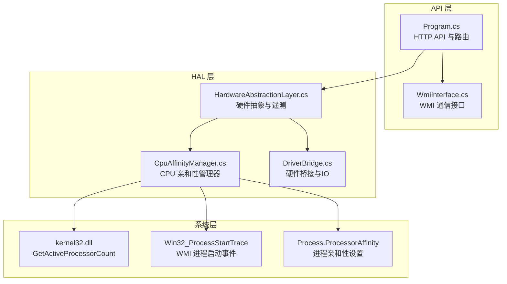
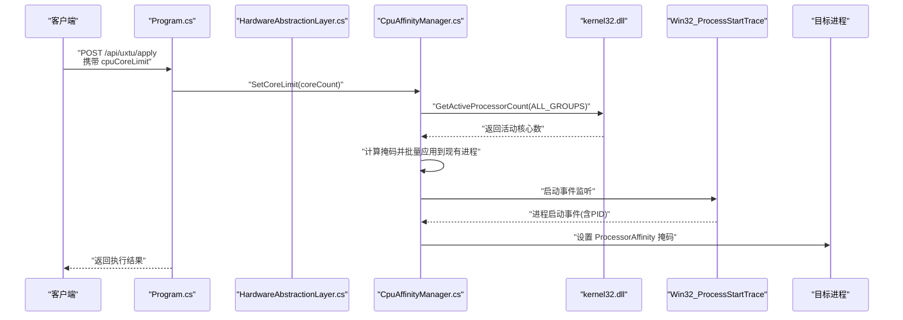
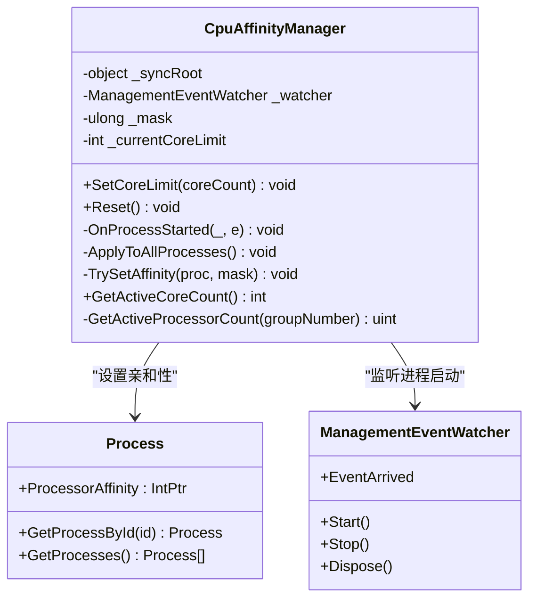
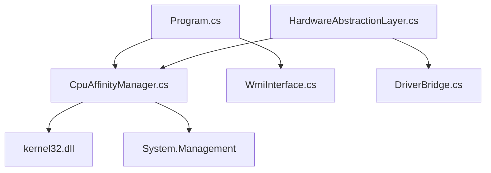

# CPU亲和性管理器

<cite>
**本文档引用的文件**
- [CpuAffinityManager.cs](file://server/hal/CpuAffinityManager.cs)
- [HardwareAbstractionLayer.cs](file://server/hal/HardwareAbstractionLayer.cs)
- [DriverBridge.cs](file://server/hal/DriverBridge.cs)
- [Program.cs](file://server/api/Program.cs)
- [WmiInterface.cs](file://server/api/WmiInterface.cs)
</cite>

## 目录
1. [简介](#简介)
2. [项目结构](#项目结构)
3. [核心组件](#核心组件)
4. [架构概览](#架构概览)
5. [详细组件分析](#详细组件分析)
6. [依赖关系分析](#依赖关系分析)
7. [性能考量](#性能考量)
8. [故障排除指南](#故障排除指南)
9. [结论](#结论)
10. [附录](#附录)

## 简介
本文件面向CPU亲和性管理器（CpuAffinityManager）的技术文档，系统阐述多核CPU性能调优的实现机制，包括核心选择算法、负载均衡策略与性能监控；深入解析亲和性设置的底层实现原理（Windows API调用与线程调度控制）；并提供不同应用场景下的最优亲和性配置建议、性能测试方法、故障排除指南与最佳实践。

## 项目结构
该模块位于服务器侧硬件抽象层（HAL）中，通过系统级API对进程的CPU亲和性进行统一管理，并与WMI事件监听配合，确保新进程启动时自动应用亲和性限制。整体采用分层设计：上层通过HTTP API暴露控制接口，HAL层封装系统调用与硬件桥接，底层依赖Windows内核API与WMI事件。

**图表来源**
- [Program.cs:1-783](file://server/api/Program.cs#L1-L783)
- [HardwareAbstractionLayer.cs:1-772](file://server/hal/HardwareAbstractionLayer.cs#L1-L772)
- [CpuAffinityManager.cs:1-101](file://server/hal/CpuAffinityManager.cs#L1-L101)
- [DriverBridge.cs:1-150](file://server/hal/DriverBridge.cs#L1-L150)
- [WmiInterface.cs:1-51](file://server/api/WmiInterface.cs#L1-L51)

**章节来源**
- [Program.cs:1-783](file://server/api/Program.cs#L1-L783)
- [HardwareAbstractionLayer.cs:1-772](file://server/hal/HardwareAbstractionLayer.cs#L1-L772)
- [CpuAffinityManager.cs:1-101](file://server/hal/CpuAffinityManager.cs#L1-L101)
- [DriverBridge.cs:1-150](file://server/hal/DriverBridge.cs#L1-L150)
- [WmiInterface.cs:1-51](file://server/api/WmiInterface.cs#L1-L51)

## 核心组件
- CPU亲和性管理器（CpuAffinityManager）
  - 提供全局核心数量限制设置与重置能力
  - 通过WMI事件监听新进程启动，自动应用亲和性掩码
  - 使用Windows内核API查询活动核心数，并以位掩码形式限制进程可调度核心
- 硬件抽象层（HardwareAbstractionLayer）
  - 提供系统遥测与硬件控制接口，包含电源计划、风扇控制、EC寄存器访问等
  - 与DriverBridge协作完成物理内存映射与EC协议读写
- 硬件桥接（DriverBridge）
  - 封装inpoutx64驱动的IO与物理内存映射操作
  - 提供EC协议读写、IO端口读写、物理地址读写等底层能力
- WMI接口（WmiInterface）
  - 通过System.Management访问WMI命名空间，实现系统功能控制
  - 用于电源计划、风扇模式、GPU模式等系统级功能的读写

**章节来源**
- [CpuAffinityManager.cs:15-101](file://server/hal/CpuAffinityManager.cs#L15-L101)
- [HardwareAbstractionLayer.cs:19-772](file://server/hal/HardwareAbstractionLayer.cs#L19-L772)
- [DriverBridge.cs:9-150](file://server/hal/DriverBridge.cs#L9-L150)
- [WmiInterface.cs:18-51](file://server/api/WmiInterface.cs#L18-L51)

## 架构概览
CPU亲和性管理器通过以下流程实现全局核心限制：
- 设置核心限制：计算掩码、更新内部状态、对现有进程批量应用亲和性
- 启动WMI事件监听：捕获进程启动事件，对新进程即时应用亲和性
- 获取活动核心数：调用Windows API获取当前系统活动核心总数
- 应用亲和性：通过Process.ProcessorAffinity设置位掩码，限制进程可调度核心集合

**图表来源**
- [Program.cs:463-494](file://server/api/Program.cs#L463-L494)
- [CpuAffinityManager.cs:25-95](file://server/hal/CpuAffinityManager.cs#L25-L95)
- [CpuAffinityManager.cs:67-78](file://server/hal/CpuAffinityManager.cs#L67-L78)

**章节来源**
- [Program.cs:463-494](file://server/api/Program.cs#L463-L494)
- [CpuAffinityManager.cs:25-95](file://server/hal/CpuAffinityManager.cs#L25-L95)

## 详细组件分析

### CPU亲和性管理器（CpuAffinityManager）
- 设计要点
  - 使用位掩码表示可用核心集合，前N位为1，其余为0
  - 通过WMI事件监听Win32_ProcessStartTrace，捕获新进程PID并应用亲和性
  - 对现有进程进行批量应用，确保全局一致性
  - 提供重置功能，停止WMI监听并清除状态
- 关键方法
  - SetCoreLimit：设置全局核心限制，计算掩码并应用
  - Reset：停止监听并重置状态
  - OnProcessStarted：处理进程启动事件，对新进程设置亲和性
  - ApplyToAllProcesses：遍历现有进程并设置亲和性
  - TrySetAffinity：尝试设置单个进程的亲和性掩码
  - GetActiveCoreCount：查询系统活动核心数
- 底层实现
  - 通过DllImport调用kernel32.dll的GetActiveProcessorCount函数
  - 使用Process.ProcessorAffinity设置位掩码，限制进程可调度核心
  - 使用ManagementEventWatcher订阅WMI进程启动事件

**图表来源**
- [CpuAffinityManager.cs:15-101](file://server/hal/CpuAffinityManager.cs#L15-L101)

**章节来源**
- [CpuAffinityManager.cs:15-101](file://server/hal/CpuAffinityManager.cs#L15-L101)

### 硬件抽象层（HardwareAbstractionLayer）
- 职责
  - 提供系统遥测（CPU/GPU温度、使用率、频率、内存与磁盘信息）
  - 系统控制（电源计划、散热模式、键盘背光、触摸板锁定等）
  - 硬件桥接（EC寄存器读写、物理内存映射、IO端口读写）
- 与亲和性管理的关系
  - 作为API层与底层系统调用之间的桥梁，间接支持亲和性策略的执行环境
  - 提供系统健康检查与遥测，辅助评估亲和性调整对系统的影响

**章节来源**
- [HardwareAbstractionLayer.cs:19-772](file://server/hal/HardwareAbstractionLayer.cs#L19-L772)

### 硬件桥接（DriverBridge）
- 职责
  - 封装inpoutx64驱动的IO与物理内存映射操作
  - 提供EC协议读写、IO端口读写、物理地址读写等底层能力
- 与亲和性管理的关系
  - 为硬件抽象层提供底层IO能力，间接支撑系统级控制与监控

**章节来源**
- [DriverBridge.cs:9-150](file://server/hal/DriverBridge.cs#L9-L150)

### WMI接口（WmiInterface）
- 职责
  - 通过System.Management访问WMI命名空间，实现系统功能控制
  - 提供电源计划、风扇模式、GPU模式等系统级功能的读写
- 与亲和性管理的关系
  - 与API层协作，通过HTTP端点对外提供系统控制能力，与亲和性策略共同构成系统性能调优方案

**章节来源**
- [WmiInterface.cs:18-51](file://server/api/WmiInterface.cs#L18-L51)

## 依赖关系分析
- 组件耦合
  - CpuAffinityManager依赖Windows内核API与WMI事件，实现全局核心限制
  - API层通过HTTP端点调用CpuAffinityManager，形成控制闭环
  - HAL层提供系统遥测与硬件控制能力，为亲和性策略提供环境感知
- 外部依赖
  - kernel32.dll：GetActiveProcessorCount
  - System.Management：WMI事件监听
  - System.Diagnostics：进程枚举与遥测采集

**图表来源**
- [Program.cs:1-783](file://server/api/Program.cs#L1-L783)
- [CpuAffinityManager.cs:1-101](file://server/hal/CpuAffinityManager.cs#L1-L101)
- [HardwareAbstractionLayer.cs:1-772](file://server/hal/HardwareAbstractionLayer.cs#L1-L772)
- [DriverBridge.cs:1-150](file://server/hal/DriverBridge.cs#L1-L150)
- [WmiInterface.cs:1-51](file://server/api/WmiInterface.cs#L1-L51)

**章节来源**
- [Program.cs:1-783](file://server/api/Program.cs#L1-L783)
- [CpuAffinityManager.cs:1-101](file://server/hal/CpuAffinityManager.cs#L1-L101)
- [HardwareAbstractionLayer.cs:1-772](file://server/hal/HardwareAbstractionLayer.cs#L1-L772)
- [DriverBridge.cs:1-150](file://server/hal/DriverBridge.cs#L1-L150)
- [WmiInterface.cs:1-51](file://server/api/WmiInterface.cs#L1-L51)

## 性能考量
- 核心选择算法
  - 采用前N位为1的位掩码，确保连续核心分配，降低跨NUMA节点的内存访问开销
  - 当coreCount为0或大于等于总核心数时，视为不限制，重置亲和性
- 负载均衡策略
  - 通过限制可用核心集合，避免部分核心过载，提升系统整体稳定性
  - 结合系统遥测（CPU/GPU温度、使用率）动态调整核心数量
- 性能监控
  - 通过HAL层的遥测接口获取CPU/GPU温度、频率与使用率，评估亲和性调整效果
  - 使用WMI与外部工具（如nvidia-smi）补充GPU遥测
- 线程调度控制
  - 亲和性设置直接影响Windows调度器的可调度核心集合，减少上下文切换与缓存抖动
  - 新进程启动时即时应用亲和性，避免启动阶段的调度不确定性

**章节来源**
- [CpuAffinityManager.cs:25-95](file://server/hal/CpuAffinityManager.cs#L25-L95)
- [HardwareAbstractionLayer.cs:580-747](file://server/hal/HardwareAbstractionLayer.cs#L580-L747)

## 故障排除指南
- 亲和性设置失败
  - 检查进程权限：需要管理员权限才能修改其他进程的亲和性
  - 捕获异常：TrySetAffinity方法内部已进行异常捕获，若失败请检查目标进程状态
- WMI事件监听异常
  - 确认WMI服务可用且命名空间root/WMI可访问
  - 检查事件查询语法与权限，必要时重启WMI服务
- 核心数量查询异常
  - 确认kernel32.dll加载成功，GetActiveProcessorCount调用返回有效值
  - 检查系统是否启用多NUMA组，ALL_GROUPS参数是否正确
- 遥测数据异常
  - HAL层对nvidia-smi等外部工具存在超时与回退逻辑，若失败请检查工具可用性与输出格式

**章节来源**
- [CpuAffinityManager.cs:67-90](file://server/hal/CpuAffinityManager.cs#L67-L90)
- [HardwareAbstractionLayer.cs:172-194](file://server/hal/HardwareAbstractionLayer.cs#L172-L194)
- [HardwareAbstractionLayer.cs:662-693](file://server/hal/HardwareAbstractionLayer.cs#L662-L693)

## 结论
CPU亲和性管理器通过位掩码与WMI事件监听实现了对系统全局核心数量的动态限制，结合硬件抽象层的遥测能力，为多核CPU性能调优提供了可靠的基础。其设计兼顾了易用性与系统稳定性，适用于游戏优化、视频编码与系统稳定性等多种场景。建议在实际部署中结合具体工作负载与硬件特性，制定合理的亲和性配置策略，并持续监控系统遥测数据以评估效果。

## 附录
- 应用场景与配置建议
  - 游戏优化：限制核心数量为物理核心数的一半或更少，避免超线程带来的调度开销；结合高刷新率显示器与稳定的帧时间
  - 视频编码：根据编码器的多线程能力选择合适的核心数量，避免过度并发导致的缓存争用；保留1-2个核心给系统与UI
  - 系统稳定性：在高负载场景下适当降低核心数量，配合散热模式与风扇控制，维持温度与功耗在安全范围内
- 性能测试方法
  - 使用系统自带性能监视器或第三方工具（如PerfView、Windows Performance Recorder）记录CPU使用率、温度与频率变化
  - 对比不同核心数量下的吞吐量与延迟指标，确定最优配置
- 最佳实践
  - 优先使用连续核心，减少跨NUMA访问
  - 在变更核心数量前后对比系统遥测数据，确保无异常波动
  - 保持WMI与硬件驱动的可用性，确保事件监听与硬件控制正常工作