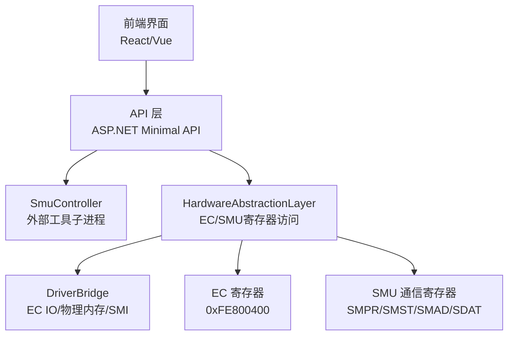
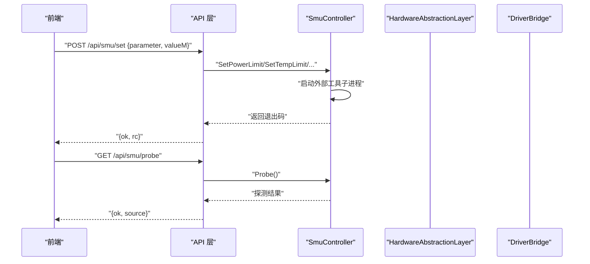
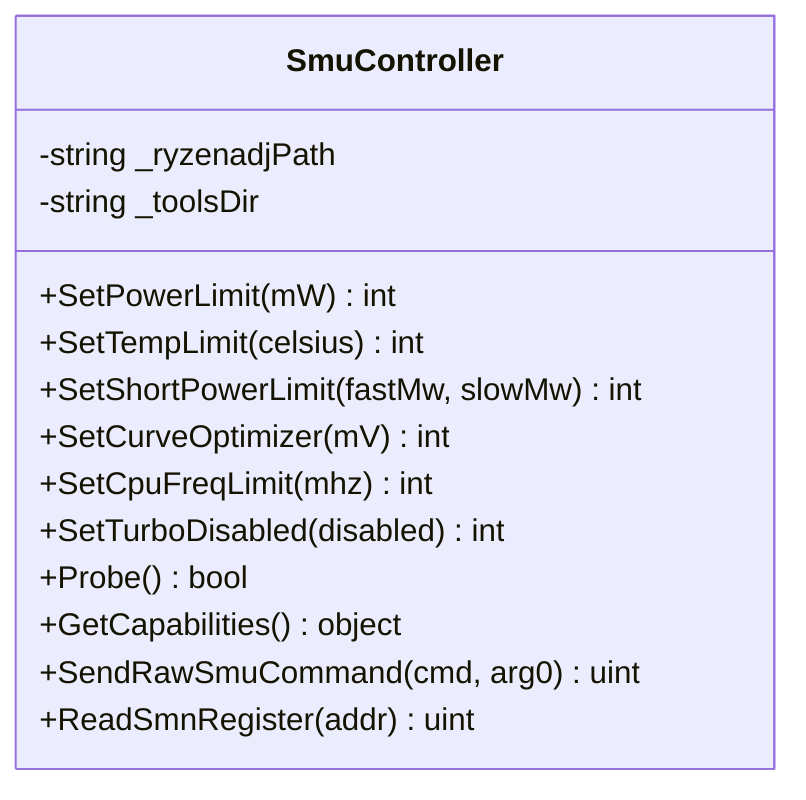
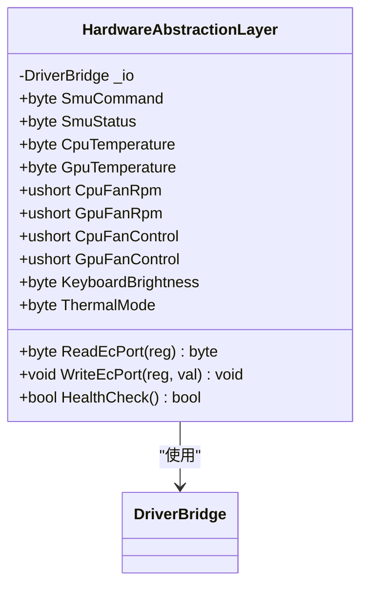
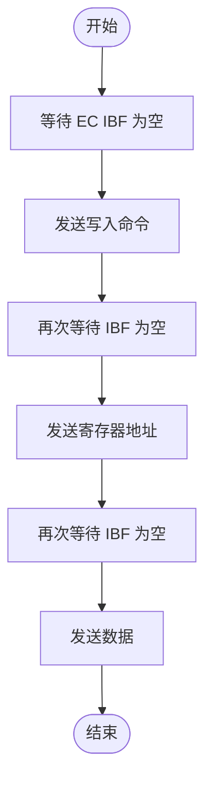
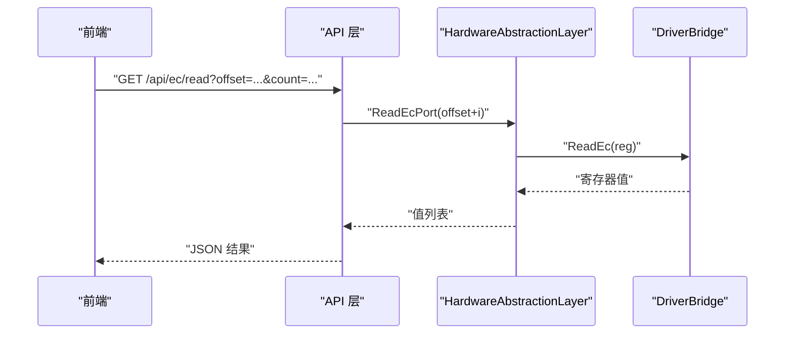
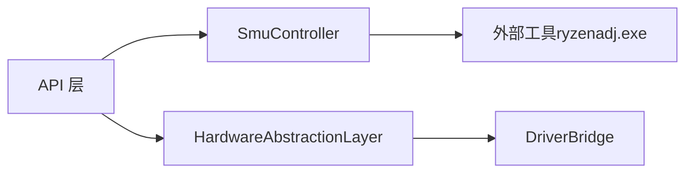
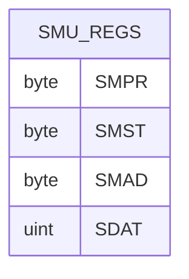

# SMU控制器

<cite>
**本文引用的文件**
- [SmuController.cs](file://server/hal/SmuController.cs)
- [HardwareAbstractionLayer.cs](file://server/hal/HardwareAbstractionLayer.cs)
- [DriverBridge.cs](file://server/hal/DriverBridge.cs)
- [Program.cs](file://server/api/Program.cs)
- [uxtuAdapter.js](file://src/services/uxtuAdapter.js)
- [dev-ec-map.md](file://docs/dev-ec-map.md)
</cite>

## 目录
1. [简介](#简介)
2. [项目结构](#项目结构)
3. [核心组件](#核心组件)
4. [架构总览](#架构总览)
5. [详细组件分析](#详细组件分析)
6. [依赖关系分析](#依赖关系分析)
7. [性能考虑](#性能考虑)
8. [故障排查指南](#故障排查指南)
9. [结论](#结论)
10. [附录](#附录)

## 简介
本文件面向SMU（系统管理单元）控制器的技术文档，聚焦于AMD平台的SMU通信与控制。在该代码库中，SMU控制通过子进程调用外部工具实现，同时保留了底层EC（嵌入式控制器）寄存器访问能力，用于与SMU通信协议协同工作。本文将系统阐述：
- SMU在AMD GPU架构中的角色与重要性
- SMU通信协议的实现机制（命令寄存器、状态寄存器、数据交换流程）
- GPU性能调优的底层控制原理（频率调节、功耗管理、温度控制）
- SMU与EC寄存器的协作关系及更精细的硬件控制路径
- SMU通信的调试方法、错误处理策略与安全注意事项
- 具体的SMU命令示例与性能调优案例

## 项目结构
本项目的SMU相关逻辑主要分布在以下模块：
- HAL层：SmuController负责调用外部工具进行SMU参数设置；HardwareAbstractionLayer提供EC寄存器访问与SMU通信寄存器的读写；DriverBridge封装底层硬件访问（EC IO、物理内存映射、SMI等）。
- API层：提供REST接口，将前端请求转发至SmuController或HAL层，并返回结果。
- 前端适配：通过JavaScript服务适配器调用后端API。

**图表来源**
- [Program.cs:238-274](file://server/api/Program.cs#L238-L274)
- [SmuController.cs:12-141](file://server/hal/SmuController.cs#L12-L141)
- [HardwareAbstractionLayer.cs:383-391](file://server/hal/HardwareAbstractionLayer.cs#L383-L391)
- [DriverBridge.cs:28-99](file://server/hal/DriverBridge.cs#L28-L99)

**章节来源**
- [Program.cs:238-274](file://server/api/Program.cs#L238-L274)
- [SmuController.cs:12-141](file://server/hal/SmuController.cs#L12-L141)
- [HardwareAbstractionLayer.cs:383-391](file://server/hal/HardwareAbstractionLayer.cs#L383-L391)
- [DriverBridge.cs:28-99](file://server/hal/DriverBridge.cs#L28-L99)

## 核心组件
- SmuController：封装对外部工具的调用，提供功耗限制、温度限制、短时功耗限制、曲线优化、CPU频率限制、禁用睿频等能力；具备探测能力与能力查询接口。
- HardwareAbstractionLayer：在DriverBridge之上提供语义化硬件访问，包含SMU通信寄存器的读写属性（SMPR/SMST），并提供EC寄存器访问、风扇控制、键盘背光、散热模式等。
- DriverBridge：封装底层硬件访问，支持EC IO端口（0x62/0x66）、物理内存读写、SMI触发等。
- API层：提供HTTP接口，接收前端请求并调用SmuController或HAL层，返回JSON响应。
- 前端适配：通过JavaScript服务适配器调用后端API，实现参数设置与状态查询。

**章节来源**
- [SmuController.cs:12-141](file://server/hal/SmuController.cs#L12-L141)
- [HardwareAbstractionLayer.cs:383-391](file://server/hal/HardwareAbstractionLayer.cs#L383-L391)
- [DriverBridge.cs:28-99](file://server/hal/DriverBridge.cs#L28-L99)
- [Program.cs:238-274](file://server/api/Program.cs#L238-L274)
- [uxtuAdapter.js:121-129](file://src/services/uxtuAdapter.js#L121-L129)

## 架构总览
SMU控制采用“API层 -> HAL层/SmuController -> 外部工具/EC寄存器”的分层设计。API层负责请求解析与响应格式化；HAL层提供EC寄存器与SMU通信寄存器的访问；SmuController通过子进程调用外部工具实现参数下发；DriverBridge提供底层硬件访问能力。

**图表来源**
- [Program.cs:238-274](file://server/api/Program.cs#L238-L274)
- [Program.cs:495-503](file://server/api/Program.cs#L495-L503)
- [SmuController.cs:43-57](file://server/hal/SmuController.cs#L43-L57)
- [SmuController.cs:103-121](file://server/hal/SmuController.cs#L103-L121)

## 详细组件分析

### SMU控制器（SmuController）
- 外部工具集成：通过子进程方式调用外部工具执行SMU参数设置，避免直接内核级访问。
- 参数设置接口：
  - 功率限制：瞬态、短时、慢速功率限制统一设置
  - 温度限制：CPU/系统温度上限
  - 曲线优化：电流曲线优化参数
  - CPU频率限制：最大CPU频率限制
  - 睿频禁用：启用/禁用睿频
- 探测与能力：
  - 探测接口用于验证外部工具可用性
  - 能力查询接口返回当前支持的功能集合

**图表来源**
- [SmuController.cs:12-141](file://server/hal/SmuController.cs#L12-L141)

**章节来源**
- [SmuController.cs:43-95](file://server/hal/SmuController.cs#L43-L95)
- [SmuController.cs:103-141](file://server/hal/SmuController.cs#L103-L141)

### 硬件抽象层（HardwareAbstractionLayer）
- SMU通信寄存器：
  - SMPR（命令寄存器）
  - SMST（状态寄存器）
  - SMAD（地址寄存器）
  - SDAT（数据寄存器）
- EC寄存器访问：通过DriverBridge提供的EC IO端口（0x62/0x66）与物理内存映射访问EC区域（0xFE800400），实现风扇目标转速、键盘背光、散热模式等控制。
- 其他功能：电源计划切换、遥测采集、健康检查等。

**图表来源**
- [HardwareAbstractionLayer.cs:383-391](file://server/hal/HardwareAbstractionLayer.cs#L383-L391)
- [DriverBridge.cs:111-137](file://server/hal/DriverBridge.cs#L111-L137)

**章节来源**
- [HardwareAbstractionLayer.cs:60-81](file://server/hal/HardwareAbstractionLayer.cs#L60-L81)
- [HardwareAbstractionLayer.cs:383-391](file://server/hal/HardwareAbstractionLayer.cs#L383-L391)
- [DriverBridge.cs:111-137](file://server/hal/DriverBridge.cs#L111-L137)

### 底层硬件桥接（DriverBridge）
- EC IO协议：实现标准EC写入协议（等待IBF空闲、发送命令、寄存器地址与数据），并提供读写EC寄存器的方法。
- 物理内存访问：支持大地址与小地址的读写，必要时进行动态映射。
- SMI触发：通过APMD/APMC端口触发SMI，配合GSMI共享内存进行通信。

**图表来源**
- [DriverBridge.cs:139-147](file://server/hal/DriverBridge.cs#L139-L147)

**章节来源**
- [DriverBridge.cs:28-99](file://server/hal/DriverBridge.cs#L28-L99)
- [DriverBridge.cs:139-147](file://server/hal/DriverBridge.cs#L139-L147)

### API层（REST接口）
- /api/smu/set：根据参数名选择对应设置函数（功率限制、温度限制、曲线优化、CPU频率限制、禁用睿频），返回成功与否与退出码。
- /api/smu/probe：探测外部工具可用性。
- /api/smu/raw：预留原始SMU命令接口（当前不支持）。
- /api/ec/read：读取EC寄存器范围内的值，便于调试与验证。

**图表来源**
- [Program.cs:214-237](file://server/api/Program.cs#L214-L237)
- [HardwareAbstractionLayer.cs:445-449](file://server/hal/HardwareAbstractionLayer.cs#L445-L449)
- [DriverBridge.cs:111-120](file://server/hal/DriverBridge.cs#L111-L120)

**章节来源**
- [Program.cs:214-237](file://server/api/Program.cs#L214-L237)
- [Program.cs:238-274](file://server/api/Program.cs#L238-L274)
- [Program.cs:495-503](file://server/api/Program.cs#L495-L503)

### 前端适配（JavaScript）
- 通过fetch调用后端API，提交SMU参数设置请求，并处理响应。
- 适用于仪表板面板与用户交互场景。

**章节来源**
- [uxtuAdapter.js:121-129](file://src/services/uxtuAdapter.js#L121-L129)

## 依赖关系分析
- 组件耦合：
  - API层依赖SmuController与HAL层
  - HAL层依赖DriverBridge
  - SmuController依赖外部工具（ryzenadj.exe）
- 外部依赖：
  - 外部工具：用于下发SMU参数
  - 系统驱动：EC IO与物理内存访问依赖底层驱动
- 潜在循环依赖：无直接循环，分层清晰

**图表来源**
- [Program.cs:238-274](file://server/api/Program.cs#L238-L274)
- [SmuController.cs:12-141](file://server/hal/SmuController.cs#L12-L141)
- [HardwareAbstractionLayer.cs:19-54](file://server/hal/HardwareAbstractionLayer.cs#L19-L54)
- [DriverBridge.cs:9-36](file://server/hal/DriverBridge.cs#L9-L36)

**章节来源**
- [Program.cs:238-274](file://server/api/Program.cs#L238-L274)
- [SmuController.cs:12-141](file://server/hal/SmuController.cs#L12-L141)
- [HardwareAbstractionLayer.cs:19-54](file://server/hal/HardwareAbstractionLayer.cs#L19-L54)
- [DriverBridge.cs:9-36](file://server/hal/DriverBridge.cs#L9-L36)

## 性能考虑
- 外部工具调用开销：每次参数设置都会启动子进程，建议批量设置或合并参数以减少调用次数。
- EC IO协议延迟：EC写入需等待IBF空闲，频繁写入可能影响系统响应，建议合理节流与批处理。
- 遥测与缓存：HAL层对部分遥测进行了缓存与降采样，降低频繁查询带来的系统负担。
- 风扇控制：目标转速写入后需等待EC生效，建议设置合理的期望值与观察周期。

[本节为通用指导，无需具体文件分析]

## 故障排查指南
- 外部工具不可用：
  - 使用探测接口确认工具可用性
  - 检查工具路径与工作目录
  - 关注特定退出码（如特定崩溃码）并记录日志
- EC IO通信异常：
  - 检查驱动状态与初始化标志
  - 使用EC寄存器读取接口验证通信链路
  - 注意IBF等待超时与重试策略
- 参数设置无效：
  - 确认参数范围与单位（如毫瓦、毫伏）
  - 检查硬件支持能力（通过能力查询接口）
  - 观察返回的退出码并结合日志定位问题
- 安全注意事项：
  - 仅在受信任环境运行外部工具
  - 避免过高的功率或温度限制导致硬件损坏
  - 对高频次写入进行限流，防止EC或SMU过载

**章节来源**
- [Program.cs:495-503](file://server/api/Program.cs#L495-L503)
- [SmuController.cs:103-121](file://server/hal/SmuController.cs#L103-L121)
- [DriverBridge.cs:39-61](file://server/hal/DriverBridge.cs#L39-L61)
- [DriverBridge.cs:139-147](file://server/hal/DriverBridge.cs#L139-L147)

## 结论
本项目通过API层、HAL层与SmuController的分层设计，实现了对AMD平台SMU的可控化管理。尽管当前SMU原始命令接口未开放，但通过外部工具与EC寄存器协同，仍可完成功耗、温度与频率等关键参数的调节。建议在生产环境中加强参数校验、错误处理与安全防护，并结合遥测数据持续优化调优策略。

[本节为总结性内容，无需具体文件分析]

## 附录

### SMU通信协议与寄存器
- SMU命令寄存器（SMPR）：用于写入SMU命令
- SMU状态寄存器（SMST）：用于读取SMU状态
- SMU地址寄存器（SMAD）：用于指定SMU内部地址
- SMU数据寄存器（SDAT）：用于读写SMU数据

**图表来源**
- [HardwareAbstractionLayer.cs:77-80](file://server/hal/HardwareAbstractionLayer.cs#L77-L80)

**章节来源**
- [HardwareAbstractionLayer.cs:77-80](file://server/hal/HardwareAbstractionLayer.cs#L77-L80)
- [HardwareAbstractionLayer.cs:383-391](file://server/hal/HardwareAbstractionLayer.cs#L383-L391)

### SMU命令示例与调优案例
- 功率限制：将瞬态、短时、慢速功率限制统一设置为同一数值，确保系统在不同工况下的稳定性
- 温度限制：设置CPU/系统温度上限，避免过热保护触发
- 曲线优化：调整电流曲线优化参数，提升高负载下的稳定性
- CPU频率限制：限制最大CPU频率，平衡性能与功耗
- 禁用睿频：在需要稳定帧时间的场景下禁用睿频

**章节来源**
- [Program.cs:238-274](file://server/api/Program.cs#L238-L274)
- [SmuController.cs:61-95](file://server/hal/SmuController.cs#L61-L95)

### EC寄存器与SMU协作
- EC区域（0xFE800400）包含SMU通信寄存器与系统控制寄存器
- 通过EC IO协议与物理内存访问实现SMU命令下发与状态读取
- 文档提供了EC寄存器区域与DSAD方法的解析，有助于理解dGPU电源控制与SMI通信

**章节来源**
- [dev-ec-map.md:121-157](file://docs/dev-ec-map.md#L121-L157)
- [HardwareAbstractionLayer.cs:60-81](file://server/hal/HardwareAbstractionLayer.cs#L60-L81)
- [DriverBridge.cs:28-29](file://server/hal/DriverBridge.cs#L28-L29)