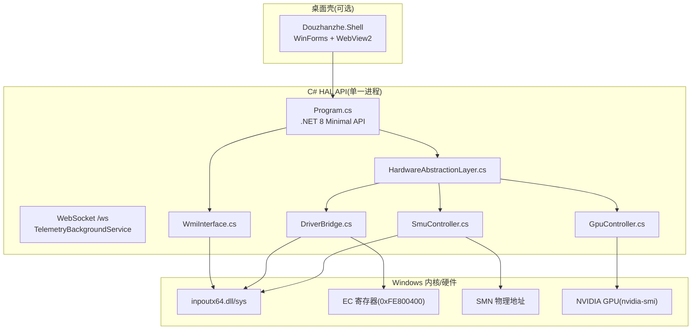
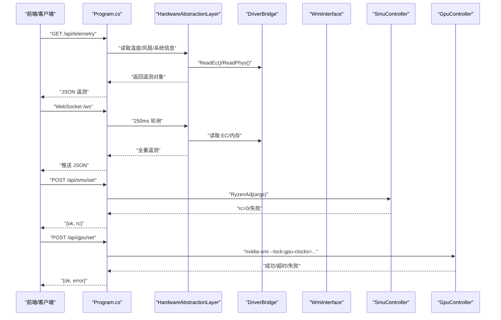
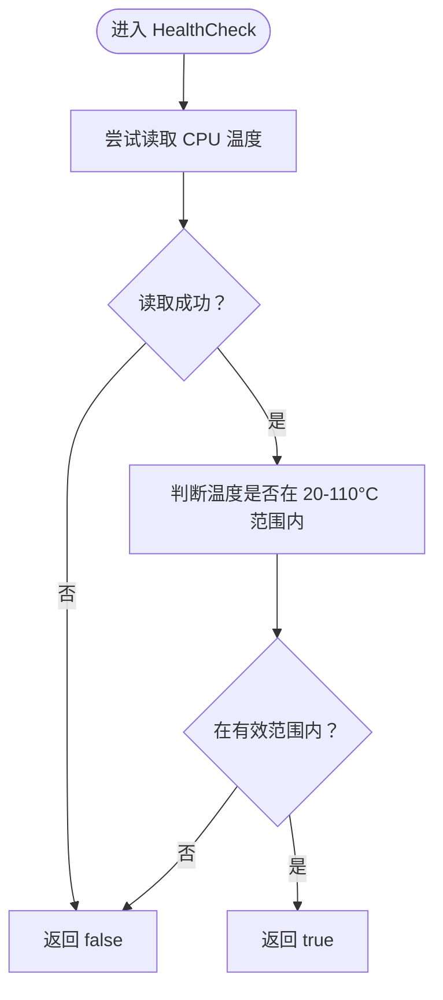
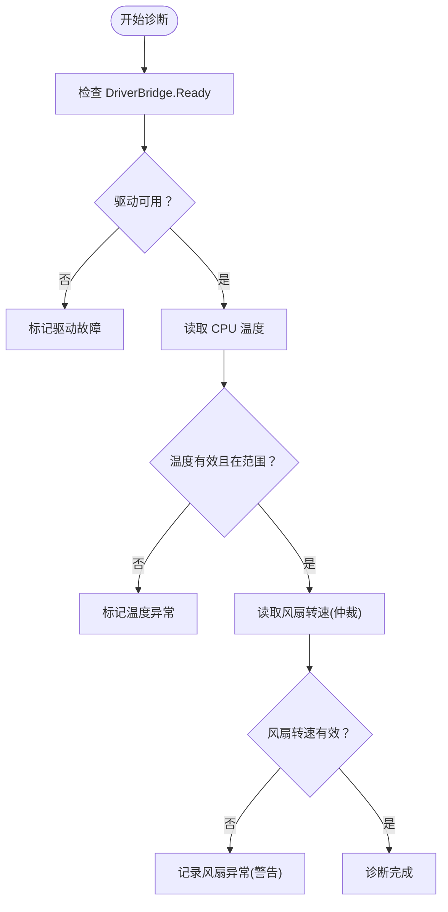
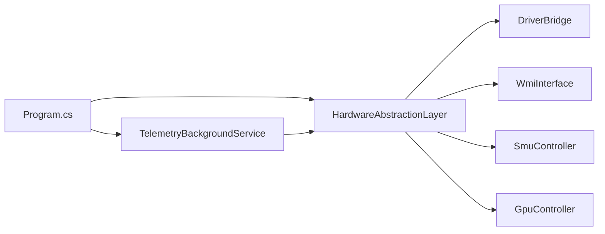

# 硬件健康检查

<cite>
**本文引用的文件**
- [HardwareAbstractionLayer.cs](file://server/hal/HardwareAbstractionLayer.cs)
- [DriverBridge.cs](file://server/hal/DriverBridge.cs)
- [WmiInterface.cs](file://server/api/WmiInterface.cs)
- [TelemetryBackgroundService.cs](file://server/api/TelemetryBackgroundService.cs)
- [Program.cs](file://server/api/Program.cs)
- [dev-backend.md](file://docs/dev-backend.md)
- [dev-architecture.md](file://docs/dev-architecture.md)
- [GpuController.cs](file://server/hal/GpuController.cs)
- [SmuController.cs](file://server/hal/SmuController.cs)
</cite>

## 目录
1. [引言](#引言)
2. [项目结构](#项目结构)
3. [核心组件](#核心组件)
4. [架构总览](#架构总览)
5. [详细组件分析](#详细组件分析)
6. [依赖关系分析](#依赖关系分析)
7. [性能考量](#性能考量)
8. [故障排查指南](#故障排查指南)
9. [结论](#结论)
10. [附录](#附录)

## 引言
本文件面向硬件健康检查系统的技术文档，聚焦于硬件健康检查的重要性与实现策略，深入解析 HealthCheck() 方法的检测逻辑（EC 通信验证、温度范围检查与系统响应测试），阐述自动化故障诊断流程（超时处理、重试机制与错误分类），明确各硬件组件的健康指标定义（风扇转速异常、温度过高、电源问题），并提供预防措施、维护建议与应急处理方案。同时给出健康检查日志分析与故障排除步骤，帮助开发者与运维人员快速定位与解决问题。

## 项目结构
系统采用分层架构，后端以 C# HAL API 为核心，通过 DriverBridge 与底层硬件交互，结合 WMI ACPI 接口与子进程封装完成 SMU/GPU 控制，并通过 WebSocket 实时推送遥测数据。前端基于静态资源自托管，通过 /ws 获取实时遥测。

图表来源
- [dev-architecture.md: 10-46:10-46](file://docs/dev-architecture.md#L10-L46)
- [Program.cs: 87-107:87-107](file://server/api/Program.cs#L87-L107)
- [TelemetryBackgroundService.cs: 17-40:17-40](file://server/api/TelemetryBackgroundService.cs#L17-L40)

章节来源
- [dev-architecture.md: 10-46:10-46](file://docs/dev-architecture.md#L10-L46)
- [dev-backend.md: 27-38:27-38](file://docs/dev-backend.md#L27-L38)

## 核心组件
- 硬件抽象层 HAL：提供语义化硬件访问接口，封装 EC 寄存器读写、温度/风扇读取、SMU/GPU 控制等。
- 驱动桥接 DriverBridge：封装 inpoutx64 P/Invoke，提供 EC IO 协议、物理内存读写、IO 端口读写。
- WMI ACPI 接口 WmiInterface：封装 ROOT/WMI MICommonInterface.MiInterface，用于系统开关与风扇控制。
- 遥测后台服务 TelemetryBackgroundService：每 250ms 轮询 HAL 并通过 WebSocket 推送全量遥测。
- SMU/GPU 控制器：通过子进程调用 ryzenadj.exe 与 nvidia-smi 完成参数下发与查询。

章节来源
- [HardwareAbstractionLayer.cs: 19-54:19-54](file://server/hal/HardwareAbstractionLayer.cs#L19-L54)
- [DriverBridge.cs: 9-64:9-64](file://server/hal/DriverBridge.cs#L9-L64)
- [WmiInterface.cs: 18-48:18-48](file://server/api/WmiInterface.cs#L18-L48)
- [TelemetryBackgroundService.cs: 17-40:17-40](file://server/api/TelemetryBackgroundService.cs#L17-L40)
- [SmuController.cs: 12-41:12-41](file://server/hal/SmuController.cs#L12-L41)
- [GpuController.cs: 10-40:10-40](file://server/hal/GpuController.cs#L10-L40)

## 架构总览
系统通过 HAL 统一抽象硬件访问，DriverBridge 提供底层 IO/内存直写能力，WMI 提供 ACPI 方法调用，SMU/GPU 控制器通过子进程完成参数下发。遥测服务周期性读取并推送全量遥测，前端通过 /ws 实时展示温度、风扇、系统状态等。

图表来源
- [Program.cs: 87-107:87-107](file://server/api/Program.cs#L87-L107)
- [TelemetryBackgroundService.cs: 54-82:54-82](file://server/api/TelemetryBackgroundService.cs#L54-L82)
- [SmuController.cs: 43-44:43-44](file://server/hal/SmuController.cs#L43-L44)
- [GpuController.cs: 14-40:14-40](file://server/hal/GpuController.cs#L14-L40)

## 详细组件分析

### HealthCheck() 方法检测逻辑
HealthCheck() 作为硬件健康检查的核心入口，其检测逻辑围绕“驱动与 EC 通信可用性”展开，具体流程如下：

图表来源
- [HardwareAbstractionLayer.cs: 753-765:753-765](file://server/hal/HardwareAbstractionLayer.cs#L753-L765)

实现要点
- 通过 HAL 的 CpuTemperature 属性读取 EC IO 端口 0x1C 的温度值。
- 若读取异常（如驱动未就绪、EC 协议失败），捕获异常并返回 false。
- 仅以温度范围作为健康判定依据，避免过度复杂化初始健康检查。

章节来源
- [HardwareAbstractionLayer.cs: 753-765:753-765](file://server/hal/HardwareAbstractionLayer.cs#L753-L765)
- [dev-backend.md: 66-84:66-84](file://docs/dev-backend.md#L66-L84)

### EC 通信验证与温度范围检查
- EC 通信验证：通过 DriverBridge.ReadEc() 与 HAL.CpuTemperature 的调用链验证 EC IO 协议是否可用。
- 温度范围检查：以 20-110°C 作为合理工作温度区间，超出该范围视为异常。
- 系统响应测试：HealthCheck() 本身即为一次“系统响应测试”，若能返回温度值并满足范围，则表明硬件与驱动处于可用状态。

章节来源
- [DriverBridge.cs: 111-120:111-120](file://server/hal/DriverBridge.cs#L111-L120)
- [HardwareAbstractionLayer.cs: 147-148:147-148](file://server/hal/HardwareAbstractionLayer.cs#L147-L148)

### 硬件故障诊断自动化流程
- 超时处理：nvidia-smi 子进程设置超时阈值，超时则抛出 TimeoutException 并中断后续流程。
- 重试机制：HAL 的风扇读取采用“双读仲裁”策略（最多 3 次，取首个非零值），降低 EC 16 位竞态影响。
- 错误分类：
  - 驱动不可用：DriverBridge.Init() 失败或 Ready=false。
  - EC 协议异常：ReadEc()/WriteEc() 抛出异常。
  - GPU 温度回退：物理内存读取为 0 时回退 nvidia-smi，失败则返回 0。
  - WMI 方法失败：WmiInterface 调用 MiInterface 失败返回 false/0。

图表来源
- [DriverBridge.cs: 39-64:39-64](file://server/hal/DriverBridge.cs#L39-L64)
- [HardwareAbstractionLayer.cs: 197-229:197-229](file://server/hal/HardwareAbstractionLayer.cs#L197-L229)
- [GpuController.cs: 12-40:12-40](file://server/hal/GpuController.cs#L12-L40)

章节来源
- [GpuController.cs: 12-40:12-40](file://server/hal/GpuController.cs#L12-L40)
- [HardwareAbstractionLayer.cs: 197-229:197-229](file://server/hal/HardwareAbstractionLayer.cs#L197-L229)

### 硬件组件健康指标定义
- CPU 温度：通过 EC IO 0x1C 读取，健康阈值通常为 20-110°C。
- GPU 温度：优先从物理内存 0xFE8004E0 读取，失败则回退 nvidia-smi；健康阈值与 CPU 类似。
- CPU 风扇转速：EC IO 0x9D/0x9E 双字节读取，采用仲裁策略；健康阈值为非零且在合理 RPM 范围内。
- GPU 风扇转速：EC IO 0x96/0x97 双字节读取，仲裁策略同上。
- 键盘背光/散热模式/Fn 锁：通过物理内存与 EC 寄存器读写，健康状态以读写成功为准。

章节来源
- [HardwareAbstractionLayer.cs: 63-71:63-71](file://server/hal/HardwareAbstractionLayer.cs#L63-L71)
- [HardwareAbstractionLayer.cs: 147-195:147-195](file://server/hal/HardwareAbstractionLayer.cs#L147-L195)
- [dev-backend.md: 66-84:66-84](file://docs/dev-backend.md#L66-L84)

### SMU 与 GPU 控制在健康检查中的作用
- SMU 控制：通过子进程调用 ryzenadj.exe 完成功率墙、温度限制等参数下发，健康检查阶段可执行 Probe() 验证连通性。
- GPU 控制：通过 nvidia-smi 子进程进行时钟锁定等操作，超时或失败将被诊断为 GPU 子系统异常。

章节来源
- [SmuController.cs: 43-44:43-44](file://server/hal/SmuController.cs#L43-L44)
- [GpuController.cs: 12-40:12-40](file://server/hal/GpuController.cs#L12-L40)

## 依赖关系分析
- HAL 依赖 DriverBridge 提供 EC/内存/IO 访问能力。
- WMI ACPI 方法通过 System.Management 访问 ROOT/WMI MICommonInterface。
- SMU/GPU 控制依赖外部子进程（ryzenadj.exe/nvidia-smi）与相应驱动。
- 遥测服务依赖 HAL 定期读取并推送全量遥测。

图表来源
- [dev-backend.md: 27-38:27-38](file://docs/dev-backend.md#L27-L38)
- [TelemetryBackgroundService.cs: 17-40:17-40](file://server/api/TelemetryBackgroundService.cs#L17-L40)

章节来源
- [dev-backend.md: 27-38:27-38](file://docs/dev-backend.md#L27-L38)
- [dev-architecture.md: 10-46:10-46](file://docs/dev-architecture.md#L10-L46)

## 性能考量
- 遥测轮询频率：TelemetryBackgroundService 以 250ms 轮询 HAL，推送全量遥测，兼顾实时性与系统开销。
- EC 读写延迟：DriverBridge 的 EC 协议包含短暂休眠，避免 IBF 竞态；风扇仲裁最多 3 次读取，降低偶发错误概率。
- 子进程超时：nvidia-smi 与 ryzenadj 均设置超时，防止阻塞健康检查流程。

章节来源
- [TelemetryBackgroundService.cs: 54-82:54-82](file://server/api/TelemetryBackgroundService.cs#L54-L82)
- [DriverBridge.cs: 111-147:111-147](file://server/hal/DriverBridge.cs#L111-L147)
- [GpuController.cs: 12-40:12-40](file://server/hal/GpuController.cs#L12-L40)

## 故障排查指南
- 驱动不可用
  - 现象：HealthCheck() 返回 false 或温度读取异常。
  - 排查：确认以管理员权限运行，检查 inpoutx64 驱动是否加载；查看 DriverBridge.Init() 输出。
  - 处理：重新以管理员权限启动服务，确保驱动可用。
  
  章节来源
  - [DriverBridge.cs: 39-64:39-64](file://server/hal/DriverBridge.cs#L39-L64)

- EC 通信异常
  - 现象：ReadEc()/WriteEc() 抛出异常或返回 0。
  - 排查：检查 EC 协议时序与 IBF 状态；确认硬件地址映射正确。
  - 处理：重试读取或回退到安全默认值，必要时更换硬件或固件。

  章节来源
  - [DriverBridge.cs: 111-147:111-147](file://server/hal/DriverBridge.cs#L111-L147)

- GPU 温度回退失败
  - 现象：物理内存读取为 0，nvidia-smi 超时或失败。
  - 排查：确认 nvidia-smi 是否可用、权限是否足够；检查 GPU 驱动状态。
  - 处理：安装/更新 NVIDIA 驱动，确保 nvidia-smi 可执行；必要时禁用回退逻辑以暴露真实错误。

  章节来源
  - [HardwareAbstractionLayer.cs: 150-195:150-195](file://server/hal/HardwareAbstractionLayer.cs#L150-L195)
  - [GpuController.cs: 12-40:12-40](file://server/hal/GpuController.cs#L12-L40)

- 风扇转速异常
  - 现象：风扇转速为 0 或波动异常。
  - 排查：启用仲裁读取，检查 EC 寄存器 0x9D/0x9E、0x96/0x97；确认散热模式与目标转速设置。
  - 处理：重置风扇控制寄存器或切换到手动模式，清理风扇积尘。

  章节来源
  - [HardwareAbstractionLayer.cs: 197-229:197-229](file://server/hal/HardwareAbstractionLayer.cs#L197-L229)

- WMI 方法失败
  - 现象：SetGpuMode()/SetFanSpeed() 返回 false。
  - 排查：确认 ROOT/WMI MICommonInterface 可用；检查方法编号与参数。
  - 处理：改用 HAL 的 EC 物理内存直写替代，或修复 WMI 环境。

  章节来源
  - [WmiInterface.cs: 50-209:50-209](file://server/api/WmiInterface.cs#L50-L209)

- SMU 参数下发失败
  - 现象：/api/smu/set 返回失败。
  - 排查：确认 ryzenadj.exe 可用、WinRing0 驱动已安装；检查 Dragon Range 硬件限制。
  - 处理：重新安装 WinRing0，使用更简化的参数下发，必要时降级到其他控制方式。

  章节来源
  - [SmuController.cs: 12-41:12-41](file://server/hal/SmuController.cs#L12-L41)

## 结论
本健康检查系统以 HealthCheck() 为核心，结合 EC 通信验证、温度范围检查与系统响应测试，形成一套轻量而有效的硬件健康评估机制。通过 DriverBridge 的底层直写能力、WMI ACPI 方法与子进程封装，系统实现了对温度、风扇、电源等关键指标的统一监控与控制。建议在生产环境中配合遥测服务持续观察，针对驱动、EC、GPU、SMU 等关键环节建立分级告警与自动恢复策略，确保系统长期稳定运行。

## 附录
- 健康检查日志分析
  - 驱动初始化日志：关注 DriverBridge.Init() 输出，确认驱动可用与 EC 映射成功。
  - EC 读写日志：记录 ReadEc()/WriteEc() 成功/失败次数，定位协议异常。
  - GPU 温度回退日志：记录 nvidia-smi 超时/失败原因，辅助判断 GPU 驱动状态。
  - 遥测日志：观察 TelemetryBackgroundService 的推送频率与数据完整性，及时发现异常波动。

- 预防措施与维护建议
  - 定期清理风扇与散热器，避免灰尘堆积导致温度升高。
  - 保持 NVIDIA 与 AMD 驱动版本最新，确保 nvidia-smi 与 SMU 接口稳定。
  - 在高负载场景下启用合理的散热模式与风扇目标转速，避免长时间接近上限。
  - 定期执行 HealthCheck() 与 SMU Probe()，及早发现潜在硬件问题。

- 应急处理方案
  - 驱动异常：立即以管理员权限重启服务，检查 inpoutx64 驱动状态。
  - EC 协议异常：临时关闭相关功能，切换到 WMI 或 EC 物理内存直写替代路径。
  - GPU 子系统异常：禁用 nvidia-smi 回退路径，改用系统自带工具或降低负载。
  - SMU 参数下发失败：回退到保守参数，避免进一步恶化热节流或不稳定。