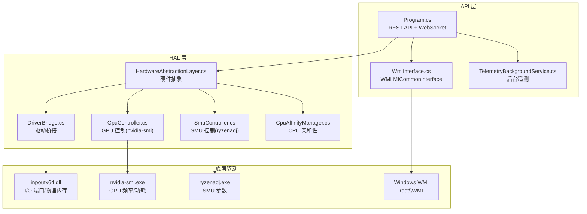
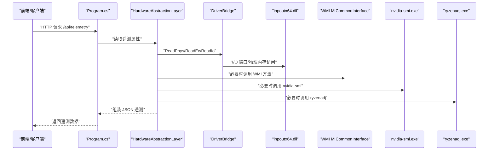
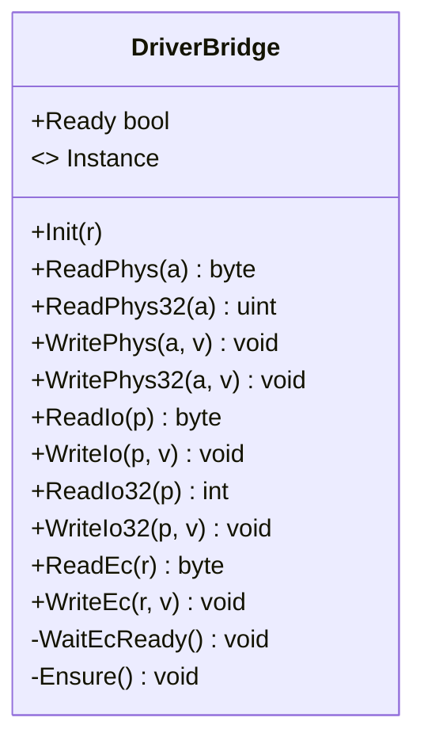
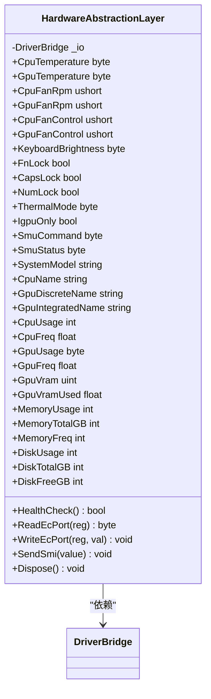
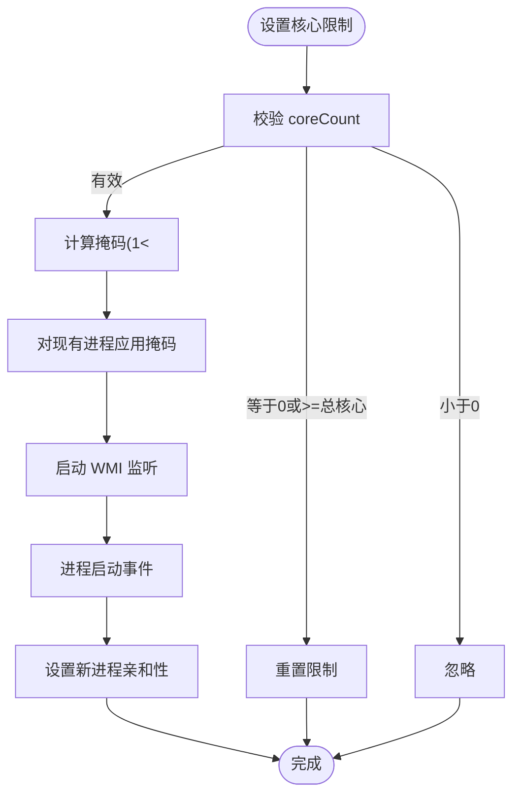
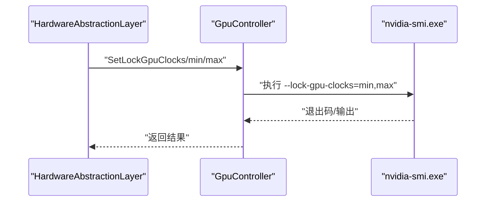
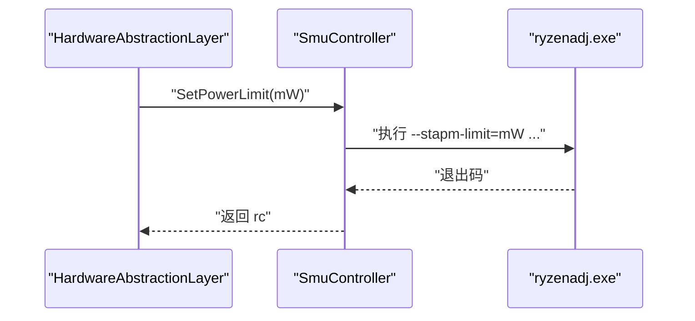
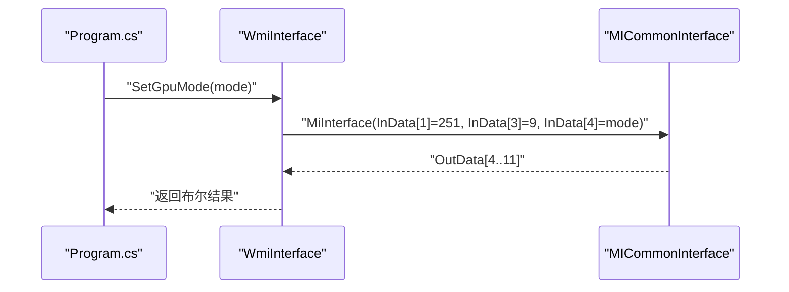
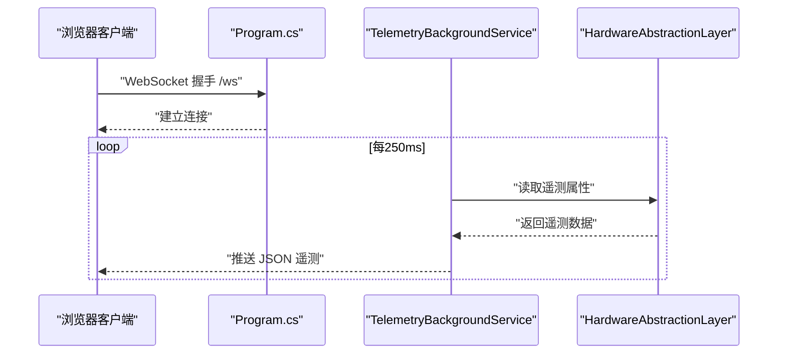
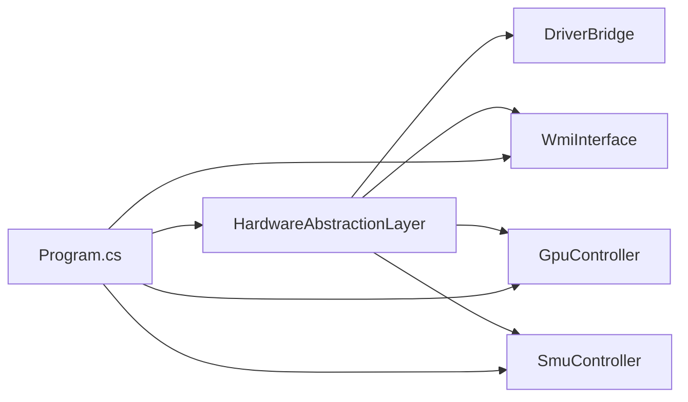

# 硬件抽象层

<cite>
**本文档引用的文件**
- [HardwareAbstractionLayer.cs](file://server/hal/HardwareAbstractionLayer.cs)
- [DriverBridge.cs](file://server/hal/DriverBridge.cs)
- [CpuAffinityManager.cs](file://server/hal/CpuAffinityManager.cs)
- [GpuController.cs](file://server/hal/GpuController.cs)
- [SmuController.cs](file://server/hal/SmuController.cs)
- [Douzhanzhe.HAL.csproj](file://server/hal/Douzhanzhe.HAL.csproj)
- [Program.cs](file://server/api/Program.cs)
- [WmiInterface.cs](file://server/api/WmiInterface.cs)
- [TelemetryBackgroundService.cs](file://server/api/TelemetryBackgroundService.cs)
- [dev-backend.md](file://docs/dev-backend.md)
- [dev-ec-map.md](file://docs/dev-ec-map.md)
</cite>

## 目录
1. [简介](#简介)
2. [项目结构](#项目结构)
3. [核心组件](#核心组件)
4. [架构总览](#架构总览)
5. [详细组件分析](#详细组件分析)
6. [依赖关系分析](#依赖关系分析)
7. [性能考虑](#性能考虑)
8. [故障排查指南](#故障排查指南)
9. [结论](#结论)
10. [附录](#附录)

## 简介
本文件面向硬件抽象层（HAL）的技术文档，系统性阐述以下内容：
- 统一硬件接口设计与平台无关性实现
- DriverBridge 驱动桥接层与 inpoutx64 硬件驱动交互机制（I/O 端口访问、EC 寄存器读写、硬件状态查询）
- CPU 亲和性管理器的多核性能调优与核心限制功能
- 硬件健康检查、异常处理与错误恢复策略
- 硬件兼容性测试方法与调试技巧

## 项目结构
HAL 位于 server/hal 目录，包含以下关键模块：
- DriverBridge：底层驱动桥接，封装 inpoutx64 的 I/O 端口、物理内存映射与 EC 协议访问
- HardwareAbstractionLayer：上层硬件抽象，提供语义化属性与方法，屏蔽底层差异
- CpuAffinityManager：CPU 核心限制与进程亲和性管理
- GpuController：基于 nvidia-smi 的 GPU 频率与功耗控制
- SmuController：基于 ryzenadj 的 AMD SMU 参数调节
- API 层 Program.cs：REST API 与 WebSocket 遥测服务
- WmiInterface.cs：WMI MICommonInterface 接口封装，用于替代部分 EC 控制
- TelemetryBackgroundService.cs：后台遥测采集与推送

**图表来源**
- [Program.cs:1-120](file://server/api/Program.cs#L1-L120)
- [HardwareAbstractionLayer.cs:1-120](file://server/hal/HardwareAbstractionLayer.cs#L1-L120)
- [DriverBridge.cs:1-80](file://server/hal/DriverBridge.cs#L1-L80)
- [WmiInterface.cs:1-60](file://server/api/WmiInterface.cs#L1-L60)
- [GpuController.cs:1-40](file://server/hal/GpuController.cs#L1-L40)
- [SmuController.cs:1-40](file://server/hal/SmuController.cs#L1-L40)

**章节来源**
- [Program.cs:1-120](file://server/api/Program.cs#L1-L120)
- [Douzhanzhe.HAL.csproj:1-18](file://server/hal/Douzhanzhe.HAL.csproj#L1-L18)

## 核心组件
- DriverBridge：负责与 inpoutx64 驱动交互，提供 I/O 端口读写、物理内存映射读写、EC 协议读写等能力，并内置初始化与降级逻辑
- HardwareAbstractionLayer：在 DriverBridge 基础上提供语义化硬件接口，如温度、风扇转速、键盘背光、散热模式、Fn 锁等
- CpuAffinityManager：通过 WMI 监听进程启动事件，动态设置进程 CPU 亲和性掩码，实现核心数量限制
- GpuController：封装 nvidia-smi 子进程调用，支持锁定/限制 GPU 核心与显存频率、读取实时状态
- SmuController：封装 ryzenadj 子进程调用，支持功耗墙、温度墙、曲线优化、CPU 频率限制、睿频开关等
- WmiInterface：封装 WMI MICommonInterface 方法，提供 GPU 模式、Fn 锁、触摸板锁、风扇控制等替代方案
- TelemetryBackgroundService：周期性采集遥测并通过 WebSocket 推送

**章节来源**
- [DriverBridge.cs:1-150](file://server/hal/DriverBridge.cs#L1-L150)
- [HardwareAbstractionLayer.cs:1-120](file://server/hal/HardwareAbstractionLayer.cs#L1-L120)
- [CpuAffinityManager.cs:1-101](file://server/hal/CpuAffinityManager.cs#L1-L101)
- [GpuController.cs:1-116](file://server/hal/GpuController.cs#L1-L116)
- [SmuController.cs:1-142](file://server/hal/SmuController.cs#L1-L142)
- [WmiInterface.cs:1-96](file://server/api/WmiInterface.cs#L1-L96)
- [TelemetryBackgroundService.cs:43-120](file://server/api/TelemetryBackgroundService.cs#L43-L120)

## 架构总览
HAL 采用“上层抽象 + 下层桥接”的分层设计：
- 上层（API 层）：REST API 与 WebSocket 提供统一入口
- 中层（HAL 层）：HardwareAbstractionLayer 提供语义化硬件接口
- 下层（桥接层）：DriverBridge 封装底层硬件访问
- 外部集成：WMI、nvidia-smi、ryzenadj、inpoutx64

**图表来源**
- [Program.cs:87-143](file://server/api/Program.cs#L87-L143)
- [HardwareAbstractionLayer.cs:140-195](file://server/hal/HardwareAbstractionLayer.cs#L140-L195)
- [DriverBridge.cs:66-148](file://server/hal/DriverBridge.cs#L66-L148)
- [WmiInterface.cs:50-96](file://server/api/WmiInterface.cs#L50-L96)
- [GpuController.cs:14-40](file://server/hal/GpuController.cs#L14-L40)
- [SmuController.cs:43-57](file://server/hal/SmuController.cs#L43-L57)

## 详细组件分析

### DriverBridge 驱动桥接层
DriverBridge 是 HAL 的底层硬件访问适配器，职责包括：
- 初始化 inpoutx64 驱动，检测可用性并建立 EC 物理映射
- 提供 I/O 端口读写（8/32 位）、物理内存读写（含预映射与动态映射）、EC 协议读写
- 提供 EC 写入协议的就绪等待（IBF 轮询），确保时序正确
- 降级策略：当驱动不可用时返回安全默认值，避免崩溃

**图表来源**
- [DriverBridge.cs:9-149](file://server/hal/DriverBridge.cs#L9-L149)

**章节来源**
- [DriverBridge.cs:1-150](file://server/hal/DriverBridge.cs#L1-L150)

### HardwareAbstractionLayer 硬件抽象层
HAL 在 DriverBridge 之上提供语义化硬件接口，主要能力：
- 温度与风扇：CPU/GPU 温度、CPU/GPU 风扇转速、风扇目标转速控制（带仲裁与范围限制）
- 系统开关：Fn 锁、CapsLock/NumLock、键盘背光、散热模式、IGPU Only
- EC 协议：通过 ReadEcPort/WriteEcPort 访问 EC 寄存器
- 系统信息：系统型号、CPU/GPU 名称、内存/磁盘信息
- 遥测缓存：对频繁查询的指标进行本地缓存，降低子进程与驱动调用频率
- 健康检查：通过读取 CPU 温度进行驱动与 EC 通信有效性验证

**图表来源**
- [HardwareAbstractionLayer.cs:19-772](file://server/hal/HardwareAbstractionLayer.cs#L19-L772)

**章节来源**
- [HardwareAbstractionLayer.cs:1-772](file://server/hal/HardwareAbstractionLayer.cs#L1-L772)
- [dev-ec-map.md:20-93](file://docs/dev-ec-map.md#L20-L93)

### CPU 亲和性管理器
CpuAffinityManager 通过 WMI 监听进程启动事件，动态设置进程 CPU 亲和性掩码，实现核心数量限制：
- SetCoreLimit：设置全局核心限制（0 表示不限制）
- Reset：停止监听并清除限制
- OnProcessStarted：新进程启动时应用限制
- ApplyToAllProcesses：对现有进程批量应用限制
- GetActiveCoreCount：查询系统活动核心数

**图表来源**
- [CpuAffinityManager.cs:15-101](file://server/hal/CpuAffinityManager.cs#L15-L101)

**章节来源**
- [CpuAffinityManager.cs:1-101](file://server/hal/CpuAffinityManager.cs#L1-L101)

### GPU 控制器（nvidia-smi）
GpuController 封装 nvidia-smi 子进程，提供以下功能：
- 锁定/限制 GPU 核心频率与显存频率
- 重置频率锁定
- 读取实时核心/显存频率与功耗
- 获取基准频率与硬件最大频率

**图表来源**
- [GpuController.cs:14-86](file://server/hal/GpuController.cs#L14-L86)

**章节来源**
- [GpuController.cs:1-116](file://server/hal/GpuController.cs#L1-L116)

### SMU 控制器（ryzenadj）
SmuController 封装 ryzenadj 子进程，提供以下功能：
- 设置长时/短时功耗墙、温度墙
- 曲线优化（CO）与 CPU 频率限制
- 睿频开关
- 能力探测与路径定位

**图表来源**
- [SmuController.cs:43-95](file://server/hal/SmuController.cs#L43-L95)

**章节来源**
- [SmuController.cs:1-142](file://server/hal/SmuController.cs#L1-L142)

### WMI 接口（MICommonInterface）
WmiInterface 封装 root\WMI 的 MICommonInterface 方法，提供：
- GPU 模式读写（GPUMode）
- Fn 锁、触摸板锁读写
- 风扇控制（读取/设置目标转速）
- CPU 温度读取等

**图表来源**
- [WmiInterface.cs:50-87](file://server/api/WmiInterface.cs#L50-L87)

**章节来源**
- [WmiInterface.cs:1-96](file://server/api/WmiInterface.cs#L1-L96)

### 遥测与 WebSocket
Program.cs 提供 /ws WebSocket 端点，TelemetryBackgroundService 周期性采集遥测并通过 WebSocket 推送。

**图表来源**
- [Program.cs:56-86](file://server/api/Program.cs#L56-L86)
- [TelemetryBackgroundService.cs:54-120](file://server/api/TelemetryBackgroundService.cs#L54-L120)

**章节来源**
- [Program.cs:56-86](file://server/api/Program.cs#L56-L86)
- [TelemetryBackgroundService.cs:43-120](file://server/api/TelemetryBackgroundService.cs#L43-L120)

## 依赖关系分析
- HAL 对 DriverBridge 的强依赖，DriverBridge 依赖 inpoutx64
- HAL 对 WMI 的可选依赖，用于替代部分 EC 控制
- HAL 对 nvidia-smi 的可选依赖，用于 GPU 遥测与控制
- HAL 对 ryzenadj 的可选依赖，用于 SMU 参数调节
- API 层对 HAL、WMI、GPU、SMU 的组合使用

**图表来源**
- [Program.cs:1-15](file://server/api/Program.cs#L1-L15)
- [HardwareAbstractionLayer.cs:1-60](file://server/hal/HardwareAbstractionLayer.cs#L1-L60)

**章节来源**
- [Program.cs:1-15](file://server/api/Program.cs#L1-L15)
- [Douzhanzhe.HAL.csproj:13-15](file://server/hal/Douzhanzhe.HAL.csproj#L13-L15)

## 性能考虑
- 遥测缓存：HAL 对温度、风扇、GPU 遥测、内存/磁盘等指标进行短期缓存，减少频繁调用驱动与子进程
- EC 仲裁：风扇读取采用多次读取取非零值的仲裁策略，降低 16 位竞态带来的抖动
- I/O 与物理内存访问：DriverBridge 优先使用预映射与 SetPhysLong，避免无效写入
- WMI 与子进程：仅在必要时调用，避免阻塞主线程
- WebSocket：后台服务按固定间隔推送，避免高频刷新造成压力

[本节为通用性能建议，无需特定文件引用]

## 故障排查指南
- 驱动不可用：DriverBridge 初始化失败时会记录日志并降级为安全默认值，检查 inpoutx64 是否加载成功
- EC 协议超时：WriteEc 时 IBF 轮询超时，检查硬件状态与端口时序
- nvidia-smi 失败：检查 nvidia-smi 是否可用、权限是否足够、GPU 驱动是否正常
- ryzenadj 异常：检查 ryzenadj.exe 路径与权限，注意部分退出码为预期行为
- WMI 失败：确认 root\WMI 可用、MICommonInterface 对象存在且具备相应方法
- 健康检查：HealthCheck 通过读取 CPU 温度判断驱动与 EC 通信是否正常

**章节来源**
- [DriverBridge.cs:39-64](file://server/hal/DriverBridge.cs#L39-L64)
- [HardwareAbstractionLayer.cs:753-765](file://server/hal/HardwareAbstractionLayer.cs#L753-L765)
- [GpuController.cs:14-40](file://server/hal/GpuController.cs#L14-L40)
- [SmuController.cs:43-57](file://server/hal/SmuController.cs#L43-L57)
- [WmiInterface.cs:24-44](file://server/api/WmiInterface.cs#L24-L44)

## 结论
HAL 通过 DriverBridge 将底层硬件访问抽象为统一接口，结合 WMI、nvidia-smi、ryzenadj 等外部工具，实现了跨平台、跨厂商的硬件控制与监控能力。其设计强调：
- 平台无关性：通过语义化属性屏蔽底层差异
- 可靠性：完善的降级与健康检查机制
- 可扩展性：模块化设计便于新增硬件与控制项
- 可维护性：清晰的分层与职责划分

[本节为总结性内容，无需特定文件引用]

## 附录

### 硬件兼容性测试方法
- 驱动测试：检查 DriverBridge.Ready 与 /api/discover
- EC 扫描：使用 /api/ec-scan 对指定偏移范围读取
- 遥测验证：对比 /api/telemetry 与 /ws 实时数据
- 控制验证：对 Fn 锁、键盘背光、散热模式等进行往返测试
- WMI 验证：使用 /api/wmi/cmd 测试 MICommonInterface 方法
- GPU 控制：通过 /api/gpu/set 与 /api/gpu/status 验证频率锁定与状态读取
- SMU 控制：通过 /api/smu/set 与 /api/smu/status 验证参数调节

**章节来源**
- [Program.cs:203-237](file://server/api/Program.cs#L203-L237)
- [Program.cs:504-518](file://server/api/Program.cs#L504-L518)
- [Program.cs:396-461](file://server/api/Program.cs#L396-L461)
- [Program.cs:238-298](file://server/api/Program.cs#L238-L298)

### 调试技巧
- 使用 /debug 页面进行交互式调试与快速验证
- 查看控制台日志中的初始化与异常信息
- 分步验证：先验证 DriverBridge，再验证 HAL，最后验证 API
- 使用 /api/health 与 /api/discover 快速判断整体健康状况
- 对于 nvidia-smi/ryzenadj，检查进程退出码与标准输出/错误输出

**章节来源**
- [Program.cs:687-691](file://server/api/Program.cs#L687-L691)
- [HardwareAbstractionLayer.cs:753-765](file://server/hal/HardwareAbstractionLayer.cs#L753-L765)
- [DriverBridge.cs:39-64](file://server/hal/DriverBridge.cs#L39-L64)