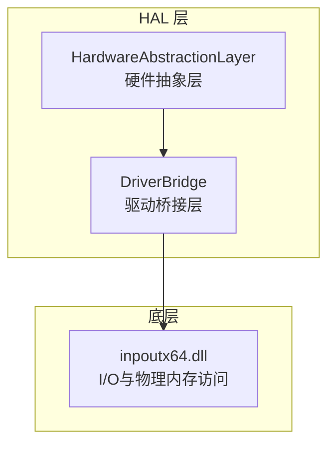
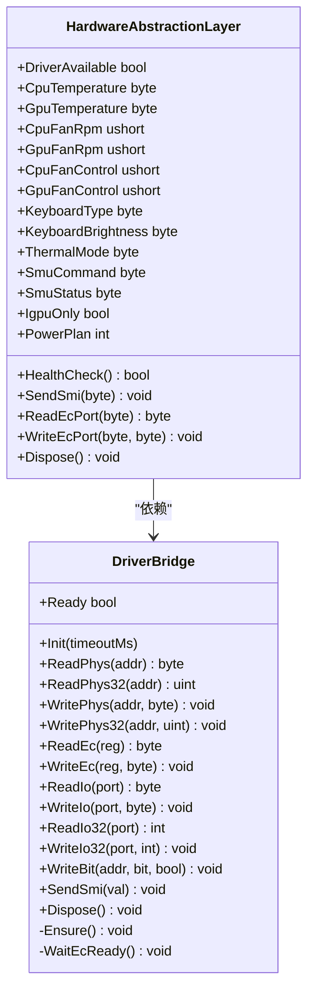
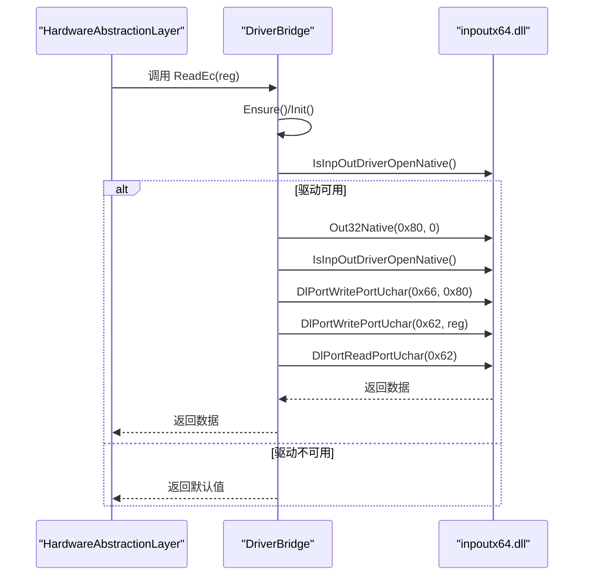
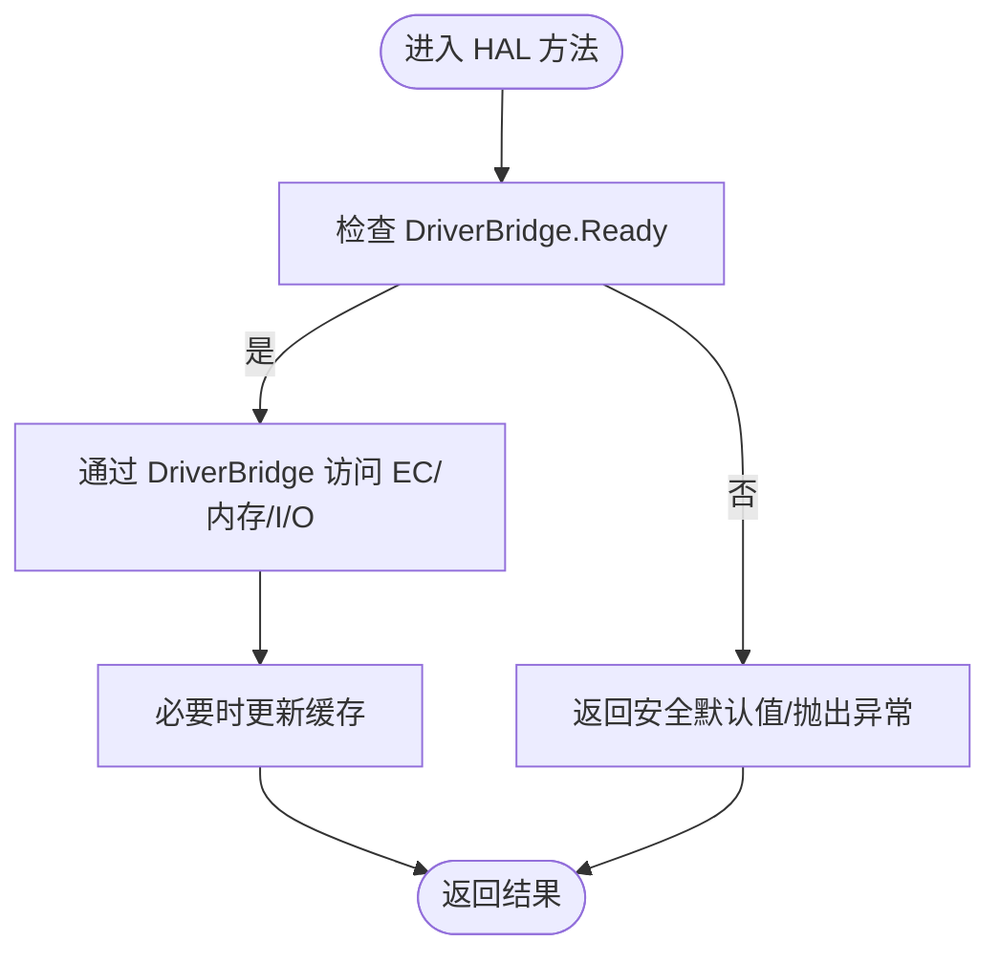
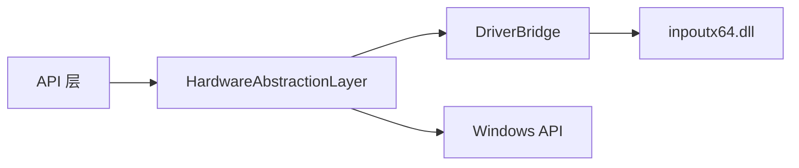

# 驱动桥接层

<cite>
**本文引用的文件**
- [DriverBridge.cs](file://server/hal/DriverBridge.cs)
- [HardwareAbstractionLayer.cs](file://server/hal/HardwareAbstractionLayer.cs)
- [Program.cs](file://server/api/Program.cs)
- [ec_reader.cs](file://server/_bak/tools/ec_reader.cs)
- [_test_ec/Program.cs](file://_test_ec/Program.cs)
- [dev-ec-map.md](file://docs/dev-ec-map.md)
- [dev-architecture.md](file://docs/dev-architecture.md)
</cite>

## 目录
1. [简介](#简介)
2. [项目结构](#项目结构)
3. [核心组件](#核心组件)
4. [架构总览](#架构总览)
5. [详细组件分析](#详细组件分析)
6. [依赖关系分析](#依赖关系分析)
7. [性能考虑](#性能考虑)
8. [故障排查指南](#故障排查指南)
9. [结论](#结论)
10. [附录](#附录)

## 简介
本文件系统化梳理驱动桥接层（DriverBridge）的设计与实现，重点覆盖以下方面：
- 作为硬件访问中间层的整体职责与边界
- I/O 端口直接访问、物理内存映射与 EC 寄存器通信机制
- inpoutx64 驱动的初始化流程、DLL 导入与函数调用封装
- 硬件寄存器读写实现细节：ReadPhys、WritePhys、ReadEc、WriteEc 等
- SMI 中断触发、位操作与电源管理能力
- 驱动兼容性检查、错误处理与性能优化策略
- 硬件地址映射示例与调试技巧

## 项目结构
DriverBridge 位于 HAL 层，向上为硬件抽象层（HAL）提供统一的底层硬件访问接口；向下通过 P/Invoke 调用 inpoutx64.dll 提供 I/O 端口与物理内存访问能力。

图表来源
- [DriverBridge.cs:1-150](file://server/hal/DriverBridge.cs#L1-L150)
- [HardwareAbstractionLayer.cs:19-772](file://server/hal/HardwareAbstractionLayer.cs#L19-L772)

章节来源
- [DriverBridge.cs:1-150](file://server/hal/DriverBridge.cs#L1-L150)
- [HardwareAbstractionLayer.cs:19-772](file://server/hal/HardwareAbstractionLayer.cs#L19-L772)

## 核心组件
- 驱动桥接层（DriverBridge）
  - 通过 P/Invoke 封装 inpoutx64.dll 的 I/O 端口与物理内存访问 API
  - 提供 EC 寄存器读写、SMI 触发、位操作等能力
  - 支持延迟初始化与线程安全
- 硬件抽象层（HAL）
  - 基于 DriverBridge 提供面向业务的硬件访问语义
  - 定义 EC 寄存器偏移常量与电源计划、风扇控制、键盘背光等功能

章节来源
- [DriverBridge.cs:9-150](file://server/hal/DriverBridge.cs#L9-L150)
- [HardwareAbstractionLayer.cs:19-772](file://server/hal/HardwareAbstractionLayer.cs#L19-L772)

## 架构总览
DriverBridge 以单例模式提供全局访问入口，内部维护驱动可用性状态与 EC 映射缓存。HAL 在构造时依赖 DriverBridge 实例进行初始化，并在运行期通过 HAL 的高层 API 使用底层能力。

图表来源
- [DriverBridge.cs:9-150](file://server/hal/DriverBridge.cs#L9-L150)
- [HardwareAbstractionLayer.cs:19-772](file://server/hal/HardwareAbstractionLayer.cs#L19-L772)

## 详细组件分析

### DriverBridge：驱动桥接层
- 初始化与生命周期
  - 采用延迟初始化与双重检查锁，避免重复初始化
  - 通过 Out32(0x80, 0) 触发驱动准备，随后轮询 IsInpOutDriverOpenNative() 直到超时或可用
  - 成功后尝试将 EC 基址范围映射到用户空间，提升后续 EC 访问性能
  - 提供 Ready 状态与 Dispose 清理
- I/O 端口访问
  - ReadIo/WriteIo：按字节访问端口（如 EC 数据/命令端口）
  - ReadIo32/WriteIo32：按 32 位访问端口（如通用 I/O 端口）
- 物理内存访问
  - ReadPhys/WritePhys：支持 EC 区域的快速映射读写与大地址的动态映射
  - ReadPhys32/WritePhys32：按 32 位读写，优先使用 Get/SetPhysLong
- EC 寄存器通信
  - ReadEc/WriteEc：基于 EC IO 协议（端口 0x62/0x66），写入前等待 IBF 空闲
  - WaitEcReady：轮询状态端口，确保 EC 输入缓冲可用
- 位操作与 SMI
  - WriteBit：对指定地址的某一位进行置位/清零
  - SendSmi：通过 APM 端口（APMD/APMC）触发 SMI
- 线程安全与错误处理
  - 关键路径加锁（如 EC 读写与初始化）
  - 异常捕获与降级：驱动不可用时返回安全默认值，避免崩溃

图表来源
- [DriverBridge.cs:111-137](file://server/hal/DriverBridge.cs#L111-L137)
- [DriverBridge.cs:139-147](file://server/hal/DriverBridge.cs#L139-L147)

章节来源
- [DriverBridge.cs:39-64](file://server/hal/DriverBridge.cs#L39-L64)
- [DriverBridge.cs:66-109](file://server/hal/DriverBridge.cs#L66-L109)
- [DriverBridge.cs:111-147](file://server/hal/DriverBridge.cs#L111-L147)

### HAL：硬件抽象层
- 驱动可用性检测
  - 构造时调用 DriverBridge.Init 并记录 Ready 状态，用于后续功能降级
- EC 寄存器语义化访问
  - 温度、风扇转速、键盘类型、键盘背光、散热模式等
  - 通过偏移常量与基址组合访问 EC 区域
- 电源计划控制
  - 通过 Windows 功率管理 API 获取/设置电源计划（平衡/高性能/节能）
- 其他硬件控制
  - 触控板禁用/启用、SMU 命令寄存器读写、dGPU 模式切换（DSAD 方法）
- SMI 与 EC 端口访问
  - 提供 SendSmi 与 ReadEcPort/WriteEcPort 的便捷接口

图表来源
- [HardwareAbstractionLayer.cs:48-54](file://server/hal/HardwareAbstractionLayer.cs#L48-L54)
- [HardwareAbstractionLayer.cs:147-195](file://server/hal/HardwareAbstractionLayer.cs#L147-L195)

章节来源
- [HardwareAbstractionLayer.cs:48-54](file://server/hal/HardwareAbstractionLayer.cs#L48-L54)
- [HardwareAbstractionLayer.cs:62-85](file://server/hal/HardwareAbstractionLayer.cs#L62-L85)
- [HardwareAbstractionLayer.cs:147-195](file://server/hal/HardwareAbstractionLayer.cs#L147-L195)
- [HardwareAbstractionLayer.cs:237-265](file://server/hal/HardwareAbstractionLayer.cs#L237-L265)
- [HardwareAbstractionLayer.cs:335-340](file://server/hal/HardwareAbstractionLayer.cs#L335-L340)
- [HardwareAbstractionLayer.cs:428-439](file://server/hal/HardwareAbstractionLayer.cs#L428-L439)

## 依赖关系分析
- 外部依赖
  - inpoutx64.dll：提供 I/O 端口与物理内存访问 API
  - Windows API：电源计划、Win32 键盘事件、WMI 查询等
- 内部依赖
  - HAL 依赖 DriverBridge 提供的底层能力
  - API 层通过 HAL 使用 DriverBridge 的能力

图表来源
- [Program.cs:302](file://server/api/Program.cs#L302)
- [HardwareAbstractionLayer.cs:98-107](file://server/hal/HardwareAbstractionLayer.cs#L98-L107)
- [DriverBridge.cs:11-26](file://server/hal/DriverBridge.cs#L11-L26)

章节来源
- [Program.cs:302](file://server/api/Program.cs#L302)
- [HardwareAbstractionLayer.cs:98-107](file://server/hal/HardwareAbstractionLayer.cs#L98-L107)
- [DriverBridge.cs:11-26](file://server/hal/DriverBridge.cs#L11-L26)

## 性能考虑
- EC 访问优化
  - 初始化阶段对 EC 基址范围进行一次性映射，后续访问优先使用映射指针，减少动态映射开销
- 读写仲裁
  - 风扇转速读取采用双字节仲裁与多次重试，降低 EC 16 位竞态导致的 0 值概率
- 缓存与降级
  - GPU 温度在物理内存不可用时回退 nvidia-smi，并限制查询频率，避免频繁外部进程调用
- 线程安全
  - EC 读写与初始化路径加锁，避免并发冲突
- I/O 端口访问
  - 对 EC 写入前执行 IBF 等待，保证协议正确性，避免忙等导致的 CPU 占用

章节来源
- [DriverBridge.cs:54](file://server/hal/DriverBridge.cs#L54)
- [HardwareAbstractionLayer.cs:203-211](file://server/hal/HardwareAbstractionLayer.cs#L203-L211)
- [HardwareAbstractionLayer.cs:168-171](file://server/hal/HardwareAbstractionLayer.cs#L168-L171)

## 故障排查指南
- 驱动不可用
  - 现象：ReadEc/ReadPhys 返回默认值或抛出异常
  - 排查：确认 inpoutx64 驱动已安装并加载；检查初始化日志输出；验证 Out32(0x80, 0) 是否成功
- EC 通信失败
  - 现象：WriteEc 后读取不到最新值
  - 排查：确认 WaitEcReady 是否被阻塞；检查端口 0x66 的 IBF 状态；适当增加延时
- 物理内存访问异常
  - 现象：ReadPhys/WritePhys 抛出“读失败/写失败”
  - 排查：确认地址范围与权限；对于大地址使用动态映射；优先使用 Get/SetPhysLong
- SMI 触发无效
  - 现象：SendSmi 未产生预期行为
  - 排查：确认 APM 端口参数与固件支持；检查调用顺序与延时
- 电源计划切换失败
  - 现象：PowerSetActiveScheme 返回非 0
  - 排查：确认 GUID 正确；以管理员权限运行；检查系统策略限制

章节来源
- [DriverBridge.cs:49-52](file://server/hal/DriverBridge.cs#L49-L52)
- [DriverBridge.cs:139-147](file://server/hal/DriverBridge.cs#L139-L147)
- [HardwareAbstractionLayer.cs:114-136](file://server/hal/HardwareAbstractionLayer.cs#L114-L136)

## 结论
DriverBridge 以轻量、稳定的 P/Invoke 封装，为上层 HAL 提供了统一且高效的硬件访问能力。通过 EC 映射缓存、读写仲裁与降级策略，系统在不同硬件环境下具备良好的兼容性与鲁棒性。建议在生产环境中持续监控驱动可用性与 EC 通信状态，结合日志与健康检查接口进行运维保障。

## 附录

### 硬件地址映射与寄存器示例
- EC 基址与大小
  - 基址：0xFE800400
  - 大小：0xFF 字节
- 常用偏移（示例）
  - CPU 温度：0xE1
  - GPU 温度：0xE0
  - CPU 风扇转速高字节：0x9B；低字节：0x9C
  - GPU 风扇转速高字节：0x96；低字节：0x97
  - 键盘背光等级：0x9A
  - 散热模式：0xE4
  - Fn 锁状态：0x25（bit3）
  - CapsLock/NumLock 状态：0x25（bit1/bit2）
  - 键盘类型：0x99
  - SMU 命令/状态/地址/数据：0x28~0x2C
- dGPU 控制（DSAD）
  - 地址：0xFED81E40 + (功能码 << 1)
  - ADPD 控制位：bit3

章节来源
- [DriverBridge.cs:28-29](file://server/hal/DriverBridge.cs#L28-L29)
- [HardwareAbstractionLayer.cs:63-85](file://server/hal/HardwareAbstractionLayer.cs#L63-L85)
- [HardwareAbstractionLayer.cs:401](file://server/hal/HardwareAbstractionLayer.cs#L401-L426)
- [dev-ec-map.md](file://docs/dev-ec-map.md)

### EC 通信与测试参考
- EC 读写流程与历史实现可参考：
  - [ec_reader.cs](file://server/_bak/tools/ec_reader.cs)
  - [_test_ec/Program.cs](file://_test_ec/Program.cs)
- API 层对 EC 端口的使用示例：
  - [Program.cs](file://server/api/Program.cs#L188)
  - [Program.cs](file://server/api/Program.cs#L207)
  - [Program.cs](file://server/api/Program.cs#L227)

章节来源
- [ec_reader.cs](file://server/_bak/tools/ec_reader.cs)
- [_test_ec/Program.cs](file://_test_ec/Program.cs)
- [Program.cs:188](file://server/api/Program.cs#L188)
- [Program.cs:207](file://server/api/Program.cs#L207)
- [Program.cs:227](file://server/api/Program.cs#L227)

### 架构背景与设计原则
- HAL 设计原则与 DSDT/SSDT 反编译依据：
  - [dev-architecture.md](file://docs/dev-architecture.md)

章节来源
- [dev-architecture.md](file://docs/dev-architecture.md)