# 遥测后台服务

<cite>
**本文档引用的文件**
- [TelemetryBackgroundService.cs](file://server/api/TelemetryBackgroundService.cs)
- [WmiInterface.cs](file://server/api/WmiInterface.cs)
- [Program.cs](file://server/api/Program.cs)
- [HardwareAbstractionLayer.cs](file://server/hal/HardwareAbstractionLayer.cs)
- [DriverBridge.cs](file://server/hal/DriverBridge.cs)
- [GpuController.cs](file://server/hal/GpuController.cs)
- [SmuController.cs](file://server/hal/SmuController.cs)
- [Douzhanzhe.API.csproj](file://server/api/Douzhanzhe.API.csproj)
- [Douzhanzhe.HAL.csproj](file://server/hal/Douzhanzhe.HAL.csproj)
- [appsettings.json](file://server/api/appsettings.json)
- [dashboard-default.json](file://server/config/dashboard-default.json)
</cite>

## 目录
1. [简介](#简介)
2. [项目结构](#项目结构)
3. [核心组件](#核心组件)
4. [架构概览](#架构概览)
5. [详细组件分析](#详细组件分析)
6. [依赖关系分析](#依赖关系分析)
7. [性能考虑](#性能考虑)
8. [故障排除指南](#故障排除指南)
9. [结论](#结论)

## 简介

这是一个基于 .NET 8 的遥测后台服务，专门为高性能笔记本电脑提供实时硬件监控和控制系统。该服务实现了完整的硬件抽象层，支持温度、风扇、GPU、内存、磁盘等多维度遥测数据采集，并通过 WebSocket 实时推送给前端界面。

该系统采用后台服务模式，每250毫秒进行一次硬件轮询，通过 WMI 和 EC 接口与硬件交互，实现了从底层硬件到用户界面的完整数据链路。

## 项目结构

项目采用分层架构设计，主要分为以下层次：

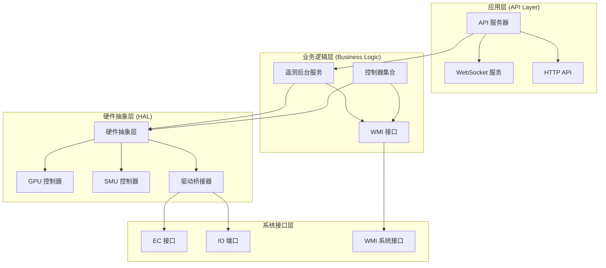

**图表来源**
- [Program.cs:1-783](file://server/api/Program.cs#L1-L783)
- [TelemetryBackgroundService.cs:1-143](file://server/api/TelemetryBackgroundService.cs#L1-L143)
- [HardwareAbstractionLayer.cs:1-772](file://server/hal/HardwareAbstractionLayer.cs#L1-L772)

**章节来源**
- [Program.cs:1-783](file://server/api/Program.cs#L1-L783)
- [Douzhanzhe.API.csproj:1-40](file://server/api/Douzhanzhe.API.csproj#L1-L40)
- [Douzhanzhe.HAL.csproj:1-18](file://server/hal/Douzhanzhe.HAL.csproj#L1-L18)

## 核心组件

### 遥测后台服务 (TelemetryBackgroundService)

这是系统的核心组件，继承自 `BackgroundService`，负责：
- 每250毫秒轮询硬件状态
- 通过 WebSocket 推送实时数据
- 管理客户端连接池
- 实现"界面随动"功能

### 硬件抽象层 (HardwareAbstractionLayer)

提供统一的硬件访问接口，包含：
- 温度、风扇、GPU、内存、磁盘等遥测数据
- 系统开关控制（散热模式、电源计划等）
- 键盘背光和锁状态控制
- SMU 通信和 dGPU 控制

### WMI 接口 (WmiInterface)

封装 Windows Management Instrumentation 接口：
- 支持 GPU 模式切换
- Fn 锁和触摸板锁控制
- 风扇手动控制
- 通用 WMI 命令执行

**章节来源**
- [TelemetryBackgroundService.cs:17-143](file://server/api/TelemetryBackgroundService.cs#L17-L143)
- [HardwareAbstractionLayer.cs:19-772](file://server/hal/HardwareAbstractionLayer.cs#L19-L772)
- [WmiInterface.cs:18-210](file://server/api/WmiInterface.cs#L18-L210)

## 架构概览

系统采用事件驱动的后台服务模式，结合 WebSocket 实时推送：

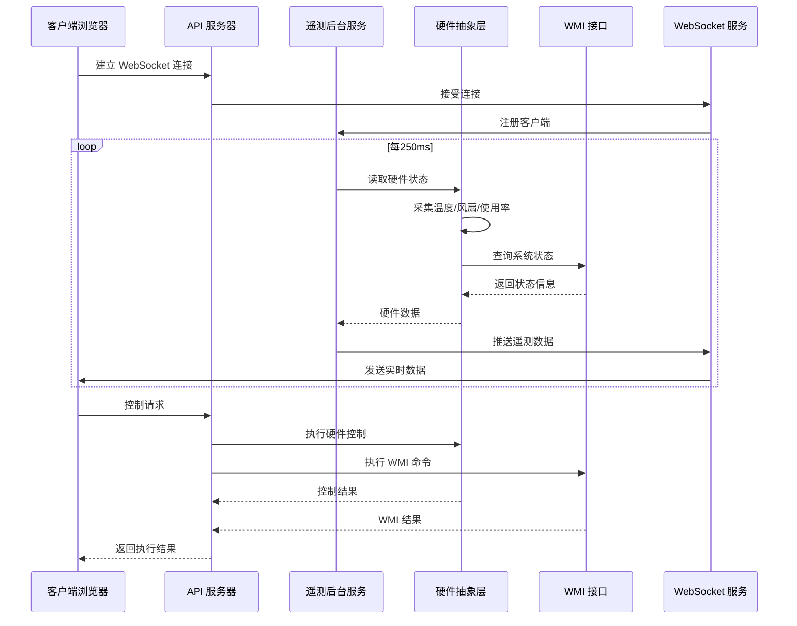

**图表来源**
- [TelemetryBackgroundService.cs:54-141](file://server/api/TelemetryBackgroundService.cs#L54-L141)
- [Program.cs:56-86](file://server/api/Program.cs#L56-L86)
- [HardwareAbstractionLayer.cs:580-747](file://server/hal/HardwareAbstractionLayer.cs#L580-L747)

## 详细组件分析

### 遥测后台服务实现

#### 生命周期管理

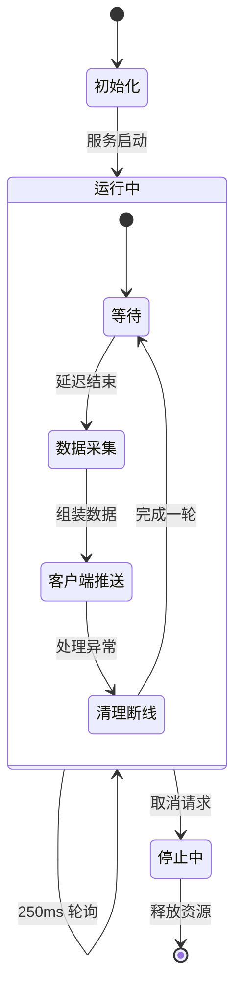

**图表来源**
- [TelemetryBackgroundService.cs:54-141](file://server/api/TelemetryBackgroundService.cs#L54-L141)

#### 数据采集流程

服务每250毫秒执行一次完整的数据采集：
1. **硬件状态读取**：CPU/GPU 温度、风扇转速、使用率
2. **系统状态查询**：电源计划、散热模式、键盘状态
3. **WMI 状态同步**：Fn 锁、触摸板锁、GPU 模式
4. **数据序列化**：JSON 格式化输出
5. **实时推送**：WebSocket 广播给所有客户端

#### WebSocket 连接池管理

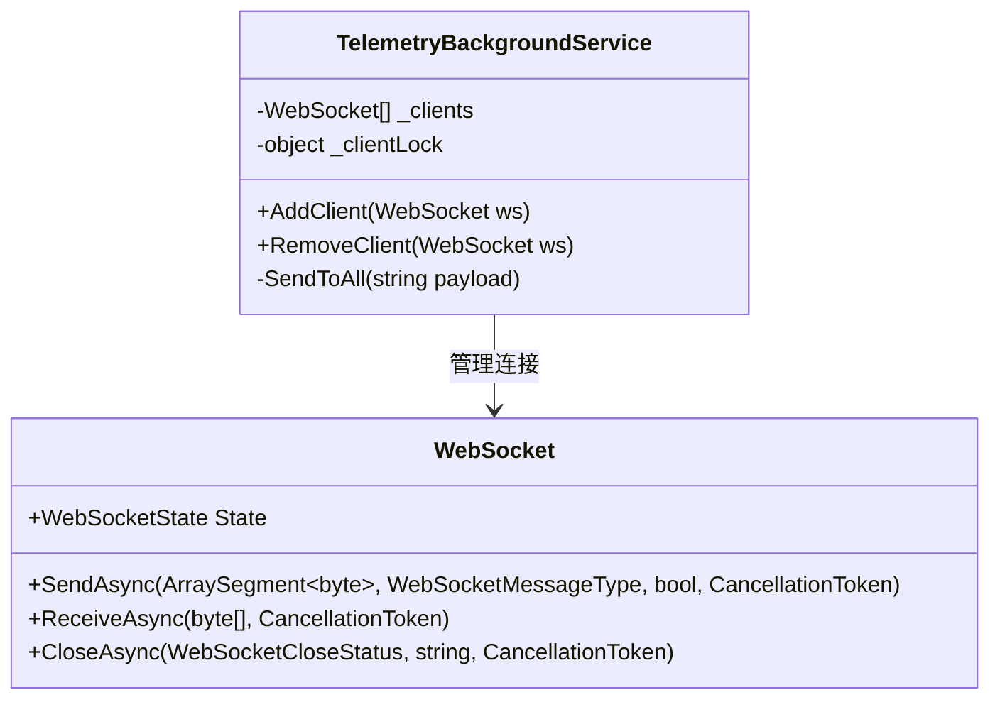

**图表来源**
- [TelemetryBackgroundService.cs:23-52](file://server/api/TelemetryBackgroundService.cs#L23-L52)

#### 内存管理策略

服务采用以下内存管理策略：
- **静态客户端列表**：避免频繁分配
- **缓冲区复用**：重用字节数组进行网络传输
- **异步操作**：非阻塞的 WebSocket 通信
- **异常隔离**：单个客户端异常不影响整体服务

**章节来源**
- [TelemetryBackgroundService.cs:17-143](file://server/api/TelemetryBackgroundService.cs#L17-L143)

### 硬件抽象层设计

#### 硬件访问模式

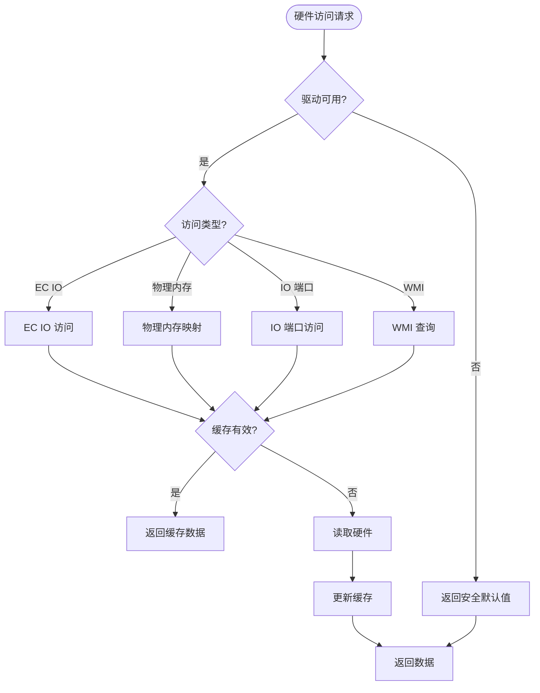

**图表来源**
- [HardwareAbstractionLayer.cs:56-772](file://server/hal/HardwareAbstractionLayer.cs#L56-L772)

#### 缓存策略

硬件抽象层实现了多层次缓存机制：

| 缓存类型 | 缓存间隔 | 缓存字段 | 用途 |
|---------|---------|---------|------|
| CPU 使用率缓存 | 2秒 | CpuUsage, CpuFreq | 高频读取数据 |
| GPU 状态缓存 | 2秒 | GpuUsage, GpuFreq, GpuVram | GPU 性能监控 |
| 内存状态缓存 | 2秒 | MemoryUsage, MemoryTotal, MemoryFreq | 系统内存监控 |
| 磁盘状态缓存 | 5秒 | DiskUsage, DiskTotal, DiskFree | 磁盘空间监控 |
| 系统信息缓存 | 10秒 | SystemModel, CpuName, GpuName | 系统配置信息 |

#### 风扇控制算法

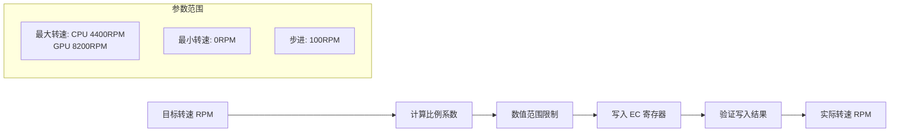

**图表来源**
- [HardwareAbstractionLayer.cs:237-265](file://server/hal/HardwareAbstractionLayer.cs#L237-L265)

**章节来源**
- [HardwareAbstractionLayer.cs:19-772](file://server/hal/HardwareAbstractionLayer.cs#L19-L772)

### WMI 接口实现

#### WMI 方法调用流程

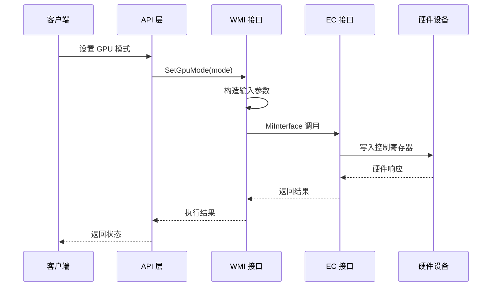

**图表来源**
- [WmiInterface.cs:50-60](file://server/api/WmiInterface.cs#L50-L60)

#### WMI 命令类型

| 命令类型 | 方法编号 | 功能描述 | 参数格式 |
|---------|---------|---------|---------|
| GPUMode | 9 | GPU 模式切换 | 0=混合, 1=集显, 2=独显 |
| FnLock | 11 | Fn 锁控制 | 0=关闭, 1=开启 |
| TPLock | 12 | 触摸板锁控制 | 0=解锁, 1=锁定 |
| MaxFanSwitch | 20 | 手动风扇控制开关 | 0=启用, 1=禁用 |
| MaxFanSpeed | 21 | 风扇目标转速 | data[4]=风扇类型, data[5]=RPM/100 |

**章节来源**
- [WmiInterface.cs:18-210](file://server/api/WmiInterface.cs#L18-L210)

### GPU 控制器

#### NVIDIA 命令封装

GPU 控制器通过 `nvidia-smi` 子进程实现：
- **频率锁定**：`--lock-gpu-clocks=min,max`
- **频率上限**：`--lock-gpu-clocks=0,max`
- **显存锁定**：`--lock-memory-clocks=min,max`
- **重置控制**：`--reset-gpu-clocks` 和 `--reset-memory-clocks`

#### GPU 状态查询

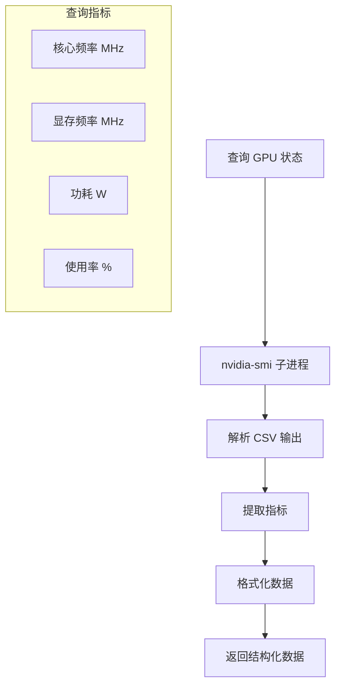

**图表来源**
- [GpuController.cs:77-86](file://server/hal/GpuController.cs#L77-L86)

**章节来源**
- [GpuController.cs:10-116](file://server/hal/GpuController.cs#L10-L116)

### SMU 控制器

#### RyzenAdj 集成

SMU 控制器通过 `ryzenadj.exe` 子进程实现 AMD 处理器控制：
- **功率限制**：`--stapm-limit`, `--fast-limit`, `--slow-limit`
- **温度限制**：`--tctl-temp`
- **曲线优化**：`--set-coall`
- **频率限制**：`--max-cpuclk`
- **睿频控制**：`--power-saving`, `--max-performance`

#### 错误处理机制

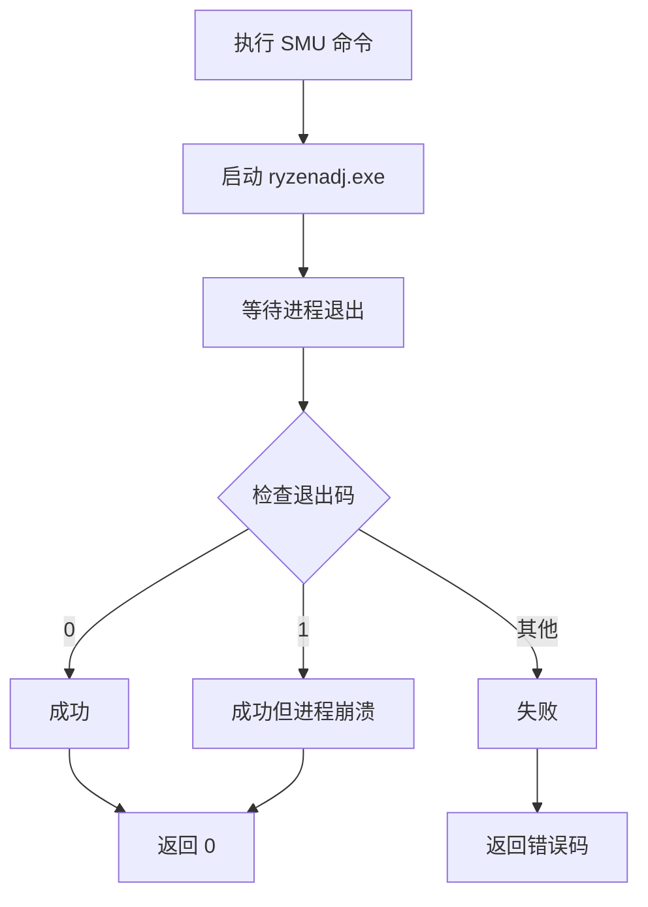

**图表来源**
- [SmuController.cs:59-101](file://server/hal/SmuController.cs#L59-L101)

**章节来源**
- [SmuController.cs:12-142](file://server/hal/SmuController.cs#L12-L142)

## 依赖关系分析

### 项目依赖图

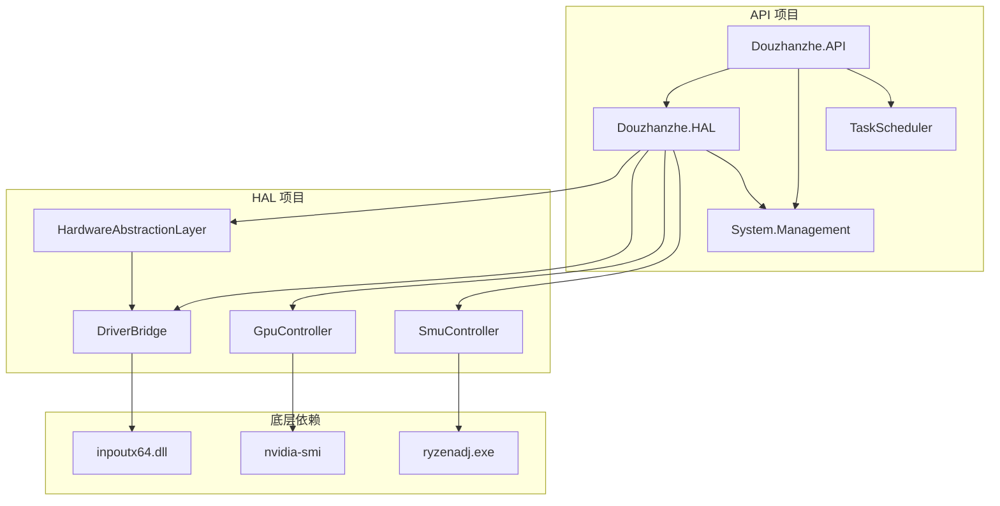

**图表来源**
- [Douzhanzhe.API.csproj:17-29](file://server/api/Douzhanzhe.API.csproj#L17-L29)
- [Douzhanzhe.HAL.csproj:13-15](file://server/hal/Douzhanzhe.HAL.csproj#L13-L15)

### 运行时依赖

| 依赖包 | 版本 | 用途 |
|-------|------|------|
| Microsoft.AspNetCore.OpenApi | 8.0.27 | OpenAPI 文档生成 |
| Swashbuckle.AspNetCore | 6.6.2 | Swagger UI |
| System.Management | 8.0.0 | WMI 接口访问 |
| TaskScheduler | 2.11.0 | Windows 任务计划程序 |

**章节来源**
- [Douzhanzhe.API.csproj:12-33](file://server/api/Douzhanzhe.API.csproj#L12-L33)
- [Douzhanzhe.HAL.csproj:13-15](file://server/hal/Douzhanzhe.HAL.csproj#L13-L15)

## 性能考虑

### 数据采样频率优化

系统采用分层采样策略：
- **高频数据**：CPU/GPU 使用率（2秒缓存）
- **中频数据**：内存使用率（2秒缓存）
- **低频数据**：磁盘使用率（5秒缓存）
- **极低频数据**：系统信息（10秒缓存）

### 内存管理优化

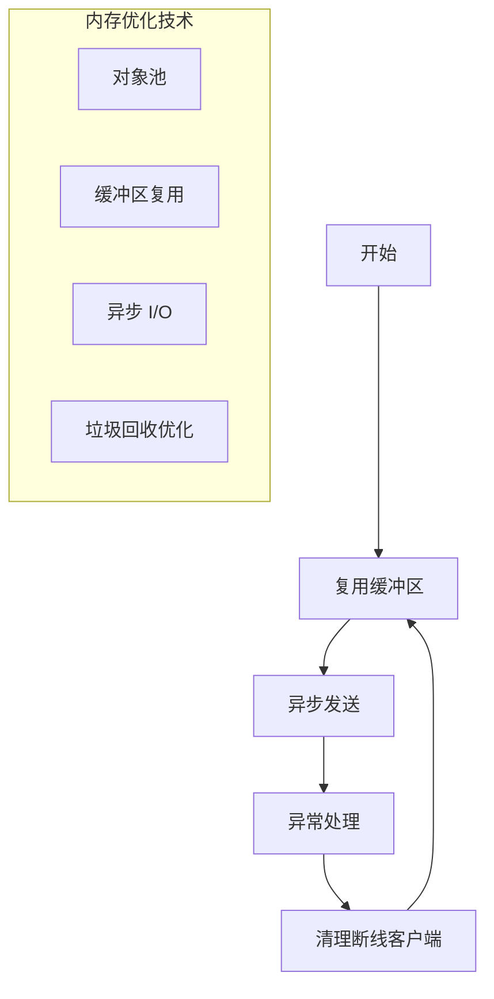

### 网络传输优化

- **二进制传输**：WebSocket 文本帧直接传输 JSON
- **批量推送**：单次轮询生成的数据广播给所有客户端
- **连接池管理**：静态客户端列表减少锁竞争
- **异常隔离**：单个客户端异常不影响其他客户端

## 故障排除指南

### 常见问题诊断

#### 硬件驱动问题

**症状**：遥测数据显示为 0 或异常值
**诊断步骤**：
1. 检查 `inpoutx64.dll` 是否存在且可加载
2. 验证管理员权限运行
3. 确认 EC 接口通信正常

**解决方案**：
- 重新安装 inpoutx64 驱动
- 以管理员身份运行服务
- 检查防火墙设置

#### WMI 接口问题

**症状**：WMI 相关功能无法使用
**诊断步骤**：
1. 检查 WMI 服务状态
2. 验证 `System.Management` 命名空间可用性
3. 测试 WMI 查询权限

**解决方案**：
- 重启 WMI 服务 (`winmgmt /resetrepository`)
- 检查用户权限
- 更新 .NET Framework

#### GPU 控制问题

**症状**：nvidia-smi 命令执行失败
**诊断步骤**：
1. 检查 NVIDIA 驱动安装
2. 验证 nvidia-smi 可执行文件
3. 确认 GPU 设备状态

**解决方案**：
- 重新安装 NVIDIA 驱动
- 检查 GPU 状态
- 以管理员权限运行

### 日志记录和监控

#### 服务日志配置

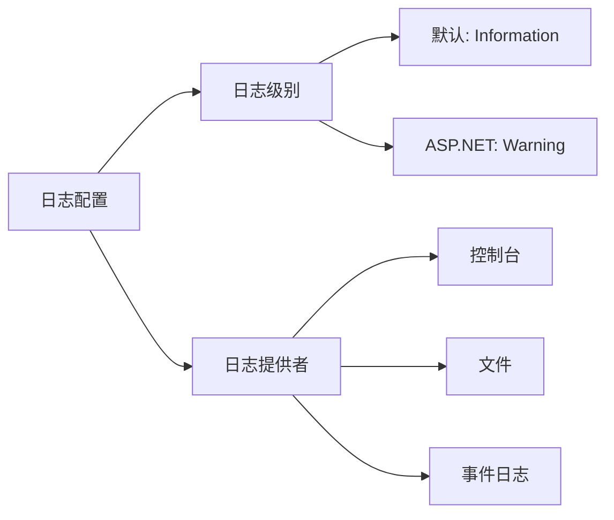

**图表来源**
- [appsettings.json:2-7](file://server/api/appsettings.json#L2-L7)

#### 监控指标

| 指标类型 | 监控内容 | 建议阈值 |
|---------|---------|---------|
| CPU 温度 | 正常: 40-80°C | 警告: >85°C, 危险: >95°C |
| GPU 温度 | 正常: 40-85°C | 警告: >90°C, 危险: >100°C |
| 风扇转速 | 正常: 30-100% | 异常: <20% |
| 内存使用率 | 正常: <80% | 警告: >85% |
| 磁盘使用率 | 正常: <85% | 警告: >90% |

**章节来源**
- [appsettings.json:1-10](file://server/api/appsettings.json#L1-L10)

## 结论

该遥测后台服务实现了高性能、低延迟的硬件监控系统，具有以下特点：

### 技术优势
- **实时性强**：250ms 采样周期，满足实时监控需求
- **可靠性高**：多层缓存和异常处理机制
- **扩展性好**：模块化设计，易于添加新硬件支持
- **跨平台兼容**：基于 .NET 8，支持 Windows 平台

### 架构特色
- **分层设计**：清晰的抽象层次，职责分离明确
- **异步处理**：非阻塞的网络和硬件访问
- **连接池管理**：高效的 WebSocket 客户端管理
- **缓存策略**：智能的数据缓存和更新机制

### 应用价值
该系统为高性能笔记本电脑提供了完整的硬件监控和控制解决方案，通过实时数据可视化帮助用户更好地理解和优化系统性能。其模块化设计也为后续的功能扩展奠定了良好基础。