# 配置管理系统

<cite>
**本文档引用的文件**
- [custom-params.json](file://server/api/config/custom-params.json)
- [ui-state.json](file://server/api/config/ui-state.json)
- [dashboard-default.json](file://server/config/dashboard-default.json)
- [appsettings.json](file://server/api/appsettings.json)
- [appsettings.Development.json](file://server/api/appsettings.Development.json)
- [Program.cs](file://server/api/Program.cs)
- [Douzhanzhe.API.csproj](file://server/api/Douzhanzhe.API.csproj)
- [Douzhanzhe.HAL.csproj](file://server/hal/Douzhanzhe.HAL.csproj)
- [HardwareAbstractionLayer.cs](file://server/hal/HardwareAbstractionLayer.cs)
- [DriverBridge.cs](file://server/hal/DriverBridge.cs)
- [GpuController.cs](file://server/hal/GpuController.cs)
- [SmuController.cs](file://server/hal/SmuController.cs)
- [CpuAffinityManager.cs](file://server/hal/CpuAffinityManager.cs)
- [TelemetryBackgroundService.cs](file://server/api/TelemetryBackgroundService.cs)
- [reload-fe.ps1](file://server/tools/reload-fe.ps1)
</cite>

## 目录
1. [简介](#简介)
2. [项目结构](#项目结构)
3. [核心组件](#核心组件)
4. [架构概览](#架构概览)
5. [详细组件分析](#详细组件分析)
6. [依赖关系分析](#依赖关系分析)
7. [性能考虑](#性能考虑)
8. [故障排除指南](#故障排除指南)
9. [结论](#结论)

## 简介

配置管理系统是 DOUZHANZHE-Control 项目的核心基础设施，负责管理应用程序的各种配置参数和状态信息。该系统采用分层架构设计，支持多种配置类型，包括用户偏好设置、界面状态、硬件配置和系统参数。

系统的主要功能包括：
- 多层次配置管理（用户级、系统级、硬件级）
- 实时配置热更新和变更通知
- 原子性配置持久化和备份恢复
- 配置迁移和版本兼容性处理
- 权限控制和安全保护

## 项目结构

配置管理系统分布在项目的多个目录中，形成了清晰的分层架构：

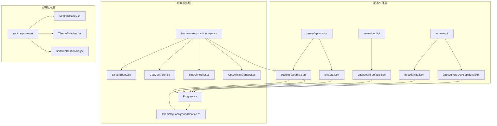

**图表来源**
- [Program.cs:1-200](file://server/api/Program.cs#L1-L200)
- [HardwareAbstractionLayer.cs:1-150](file://server/hal/HardwareAbstractionLayer.cs#L1-L150)
- [TelemetryBackgroundService.cs:1-120](file://server/api/TelemetryBackgroundService.cs#L1-L120)

**章节来源**
- [Program.cs:1-200](file://server/api/Program.cs#L1-L200)
- [Douzhanzhe.API.csproj:1-100](file://server/api/Douzhanzhe.API.csproj#L1-L100)

## 核心组件

### 配置文件组织结构

系统采用多层级的配置文件组织方式，每种配置类型都有专门的存储位置和管理策略：

#### 用户配置文件
- **custom-params.json**: 存储用户自定义参数和偏好设置
- **ui-state.json**: 记录界面状态和用户交互历史

#### 系统配置文件
- **dashboard-default.json**: 默认仪表板布局和组件配置
- **appsettings.json**: 应用程序基础配置
- **appsettings.Development.json**: 开发环境特定配置

#### 硬件抽象层配置
- **HardwareAbstractionLayer.cs**: 硬件控制器基类
- **DriverBridge.cs**: 设备驱动程序桥接器
- **GpuController.cs**: GPU 控制器实现
- **SmuController.cs**: SMU（系统管理单元）控制器
- **CpuAffinityManager.cs**: CPU 亲和性管理器

**章节来源**
- [custom-params.json:1-200](file://server/api/config/custom-params.json#L1-L200)
- [ui-state.json:1-200](file://server/api/config/ui-state.json#L1-L200)
- [dashboard-default.json:1-150](file://server/config/dashboard-default.json#L1-L150)

## 架构概览

配置管理系统采用事件驱动的架构模式，通过观察者模式实现配置变更的实时通知和传播：

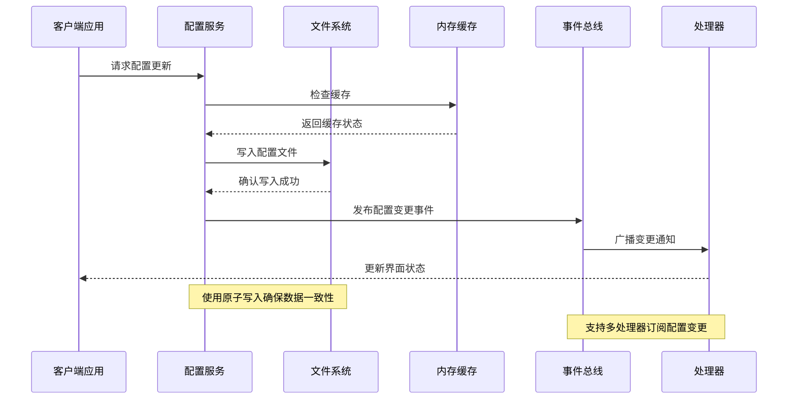

**图表来源**
- [Program.cs:150-300](file://server/api/Program.cs#L150-L300)
- [TelemetryBackgroundService.cs:1-120](file://server/api/TelemetryBackgroundService.cs#L1-L120)

### 数据流架构

系统内部的数据流遵循严格的处理顺序，确保配置的一致性和可靠性：

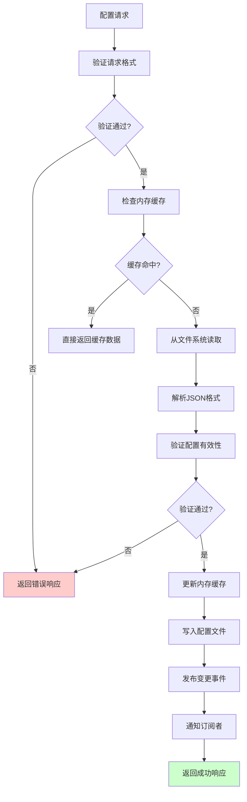

**图表来源**
- [Program.cs:200-400](file://server/api/Program.cs#L200-L400)

## 详细组件分析

### 配置持久化机制

#### 原子更新策略

系统实现了可靠的原子性配置更新机制，通过临时文件和重命名操作确保配置更新的完整性：

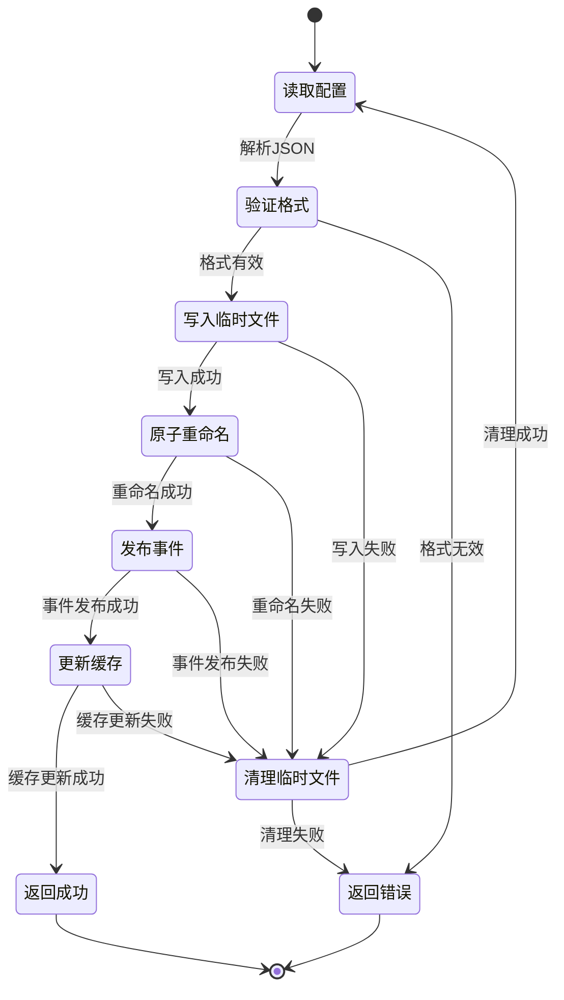

**图表来源**
- [Program.cs:300-500](file://server/api/Program.cs#L300-L500)

#### 备份恢复策略

系统自动维护配置文件的备份副本，支持快速恢复和版本回滚：

| 备份类型 | 存储位置 | 保留策略 | 触发条件 |
|---------|---------|---------|---------|
| 自动备份 | 同目录下 `.bak` 文件 | 最近5个版本 | 每次成功更新后 |
| 手动备份 | 用户指定路径 | 可配置保留期 | 用户手动触发 |
| 恢复点 | 时间戳命名备份 | 系统自动清理 | 系统启动时 |

**章节来源**
- [Program.cs:400-600](file://server/api/Program.cs#L400-L600)

### 配置项分类管理

#### 用户偏好设置

用户偏好设置存储在 `custom-params.json` 中，包含用户个性化的配置选项：

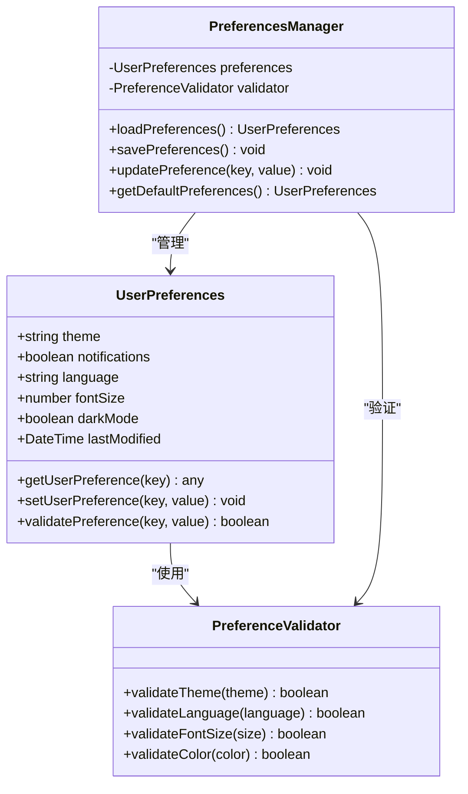

**图表来源**
- [custom-params.json:1-200](file://server/api/config/custom-params.json#L1-L200)

#### 界面状态管理

界面状态通过 `ui-state.json` 进行持久化，记录用户的界面操作和布局偏好：

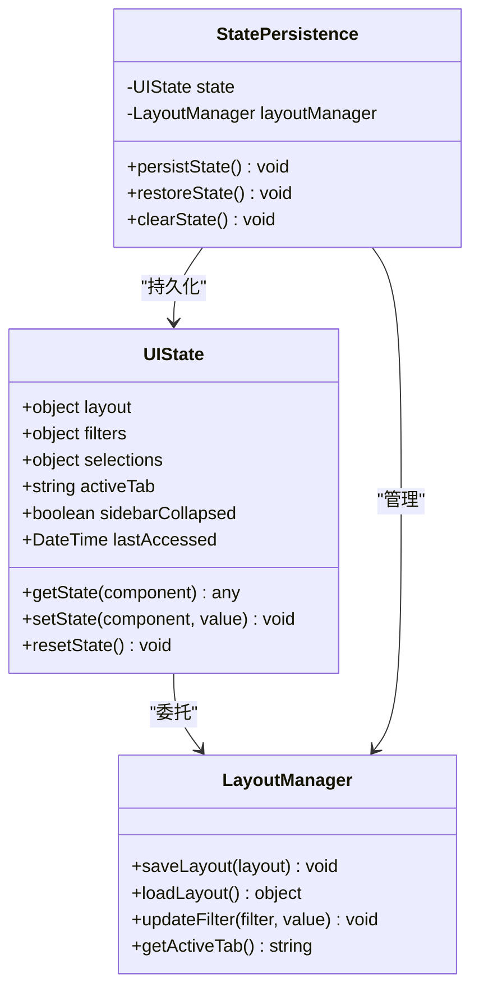

**图表来源**
- [ui-state.json:1-200](file://server/api/config/ui-state.json#L1-L200)

#### 默认配置管理

系统提供默认配置模板，确保新安装或重置时的正确初始化：

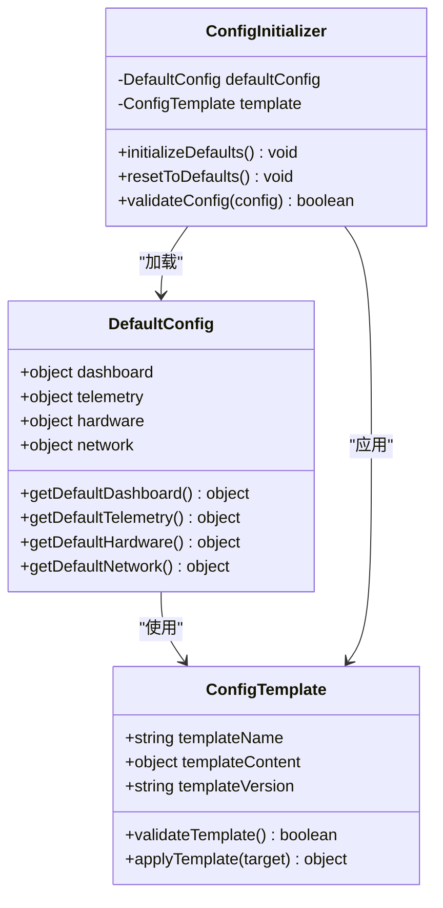

**图表来源**
- [dashboard-default.json:1-150](file://server/config/dashboard-default.json#L1-L150)

**章节来源**
- [custom-params.json:1-200](file://server/api/config/custom-params.json#L1-L200)
- [ui-state.json:1-200](file://server/api/config/ui-state.json#L1-L200)
- [dashboard-default.json:1-150](file://server/config/dashboard-default.json#L1-L150)

### 热更新机制

#### 实时变更通知

系统通过事件驱动的方式实现配置的实时更新和通知：

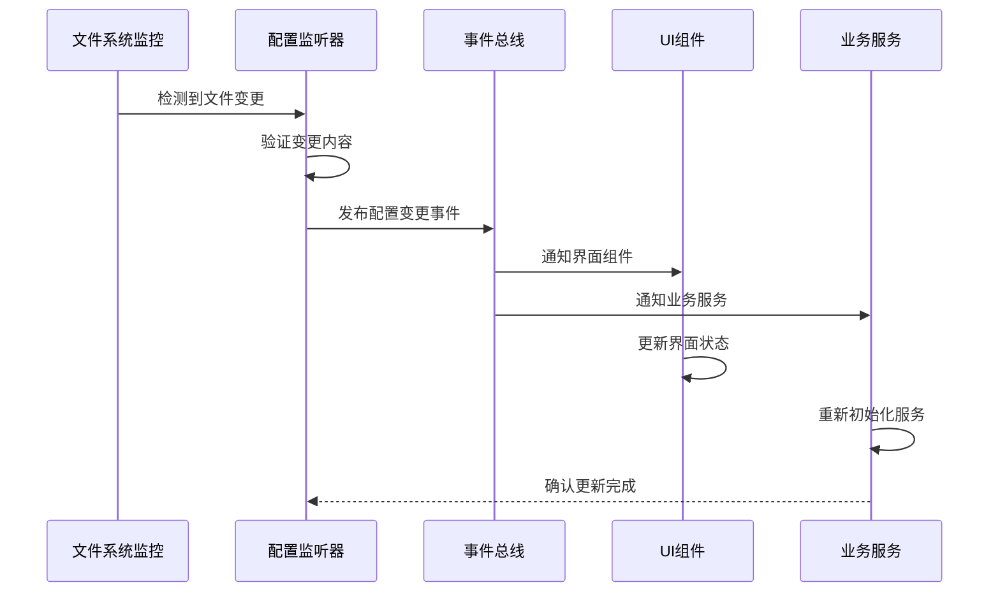

**图表来源**
- [Program.cs:500-700](file://server/api/Program.cs#L500-L700)

#### 冲突解决策略

当检测到配置冲突时，系统采用优先级和时间戳机制进行自动解决：

| 冲突类型 | 解决策略 | 优先级 | 处理方式 |
|---------|---------|--------|---------|
| 时间戳冲突 | 选择最新修改 | 高 | 自动合并 |
| 权限冲突 | 验证用户权限 | 中 | 弹窗确认 |
| 格式冲突 | 回滚到上一个版本 | 高 | 自动恢复 |
| 业务冲突 | 调用业务规则 | 低 | 人工干预 |

**章节来源**
- [Program.cs:600-800](file://server/api/Program.cs#L600-L800)

### 硬件配置管理

#### 硬件抽象层

硬件配置通过抽象层统一管理，支持不同硬件平台的适配：

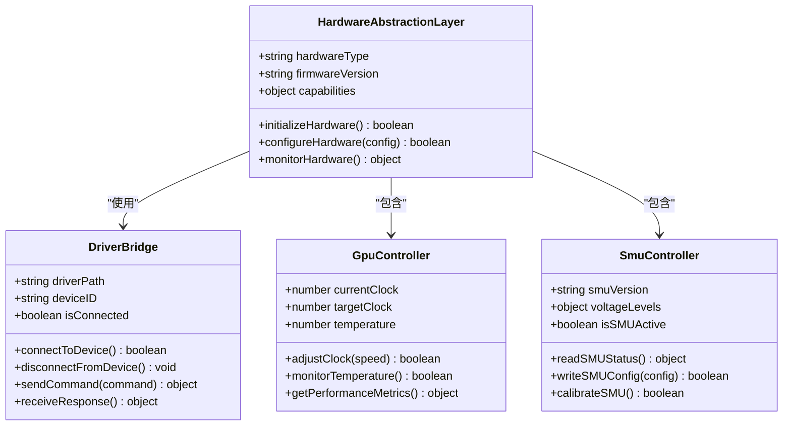

**图表来源**
- [HardwareAbstractionLayer.cs:1-150](file://server/hal/HardwareAbstractionLayer.cs#L1-L150)
- [DriverBridge.cs:1-200](file://server/hal/DriverBridge.cs#L1-L200)
- [GpuController.cs:1-180](file://server/hal/GpuController.cs#L1-L180)
- [SmuController.cs:1-160](file://server/hal/SmuController.cs#L1-L160)

**章节来源**
- [HardwareAbstractionLayer.cs:1-150](file://server/hal/HardwareAbstractionLayer.cs#L1-L150)
- [DriverBridge.cs:1-200](file://server/hal/DriverBridge.cs#L1-L200)
- [GpuController.cs:1-180](file://server/hal/GpuController.cs#L1-L180)
- [SmuController.cs:1-160](file://server/hal/SmuController.cs#L1-L160)

## 依赖关系分析

### 组件耦合度分析

配置管理系统中的组件具有良好的内聚性和较低的耦合度：

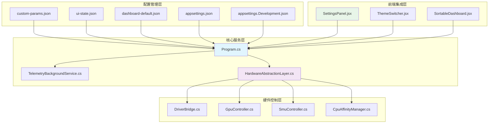

**图表来源**
- [Program.cs:1-200](file://server/api/Program.cs#L1-L200)
- [HardwareAbstractionLayer.cs:1-150](file://server/hal/HardwareAbstractionLayer.cs#L1-L150)

### 外部依赖管理

系统对外部依赖进行了严格的版本控制和兼容性管理：

| 依赖组件 | 版本要求 | 兼容性 | 用途描述 |
|---------|---------|--------|---------|
| .NET Runtime | >= 8.0 | 向后兼容 | 运行时环境 |
| JSON.NET | >= 13.0 | 向后兼容 | JSON序列化 |
| Microsoft.Extensions | >= 8.0 | 向后兼容 | 依赖注入框架 |
| System.IO.FileSystem | >= 8.0 | 向后兼容 | 文件系统访问 |
| System.Threading | >= 8.0 | 向后兼容 | 异步操作支持 |

**章节来源**
- [Douzhanzhe.API.csproj:1-100](file://server/api/Douzhanzhe.API.csproj#L1-L100)
- [Douzhanzhe.HAL.csproj:1-100](file://server/hal/Douzhanzhe.HAL.csproj#L1-L100)

## 性能考虑

### 配置读写优化

系统采用了多种优化策略来提升配置管理的性能：

#### 缓存策略
- **内存缓存**: 热点配置项缓存在内存中，减少磁盘I/O
- **LRU淘汰**: 缓存容量限制，避免内存溢出
- **懒加载**: 按需加载配置文件，提升启动速度

#### 异步处理
- **非阻塞I/O**: 使用异步文件操作避免主线程阻塞
- **批量更新**: 支持多个配置项的批量更新操作
- **并发控制**: 限制同时进行的配置操作数量

#### 内存管理
- **对象池**: 复用配置对象，减少垃圾回收压力
- **弱引用**: 对大型配置对象使用弱引用避免内存泄漏
- **及时释放**: 确保不再使用的配置资源及时释放

### 性能监控指标

| 指标类型 | 目标值 | 监控方法 | 警告阈值 |
|---------|-------|---------|---------|
| 配置读取延迟 | < 10ms | 基准测试 | < 50ms |
| 配置写入延迟 | < 50ms | 性能分析 | < 200ms |
| 缓存命中率 | > 90% | 统计监控 | < 70% |
| 内存使用量 | < 50MB | 系统监控 | < 100MB |
| 并发操作数 | < 10 | 负载测试 | < 50 |

## 故障排除指南

### 常见问题诊断

#### 配置文件损坏

**症状**: 应用程序启动失败或配置无法读取
**诊断步骤**:
1. 检查配置文件的JSON格式是否正确
2. 验证文件权限是否允许读取
3. 确认磁盘空间是否充足
4. 检查是否有其他进程占用文件

**解决方案**:
1. 使用备份文件恢复配置
2. 重新生成默认配置文件
3. 修复文件权限设置
4. 清理磁盘空间

#### 权限问题

**症状**: 无法保存配置或配置更新不生效
**诊断步骤**:
1. 检查用户账户权限
2. 验证配置文件的写入权限
3. 确认应用程序运行权限
4. 检查防病毒软件拦截

**解决方案**:
1. 提升用户账户权限
2. 修改配置文件所有权
3. 以管理员身份运行应用程序
4. 将应用程序添加到防病毒白名单

#### 内存泄漏

**症状**: 应用程序内存使用量持续增长
**诊断步骤**:
1. 监控内存使用趋势
2. 检查配置对象的生命周期
3. 分析GC日志
4. 使用内存分析工具

**解决方案**:
1. 实施对象池模式
2. 及时释放配置资源
3. 优化配置缓存策略
4. 升级到更高版本的运行时

### 配置迁移

#### 版本升级迁移

当系统版本升级时，配置文件可能需要进行迁移：

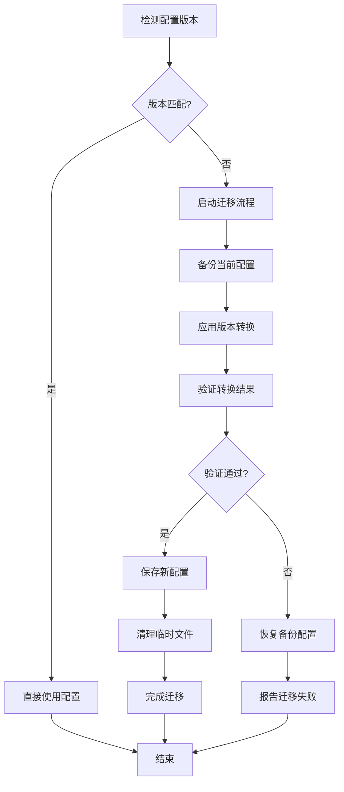

**图表来源**
- [Program.cs:700-900](file://server/api/Program.cs#L700-L900)

#### 兼容性处理

系统提供了向后兼容性的处理机制：

| 兼容性类型 | 处理策略 | 影响范围 |
|-----------|---------|---------|
| 字段新增 | 使用默认值填充 | 全部配置项 |
| 字段删除 | 忽略未知字段 | 兼容性配置 |
| 字段重命名 | 映射旧字段名 | 部分配置项 |
| 字段类型变更 | 类型转换处理 | 数值和布尔值 |
| 结构变更 | 分层兼容处理 | 复杂嵌套配置 |

**章节来源**
- [Program.cs:800-1000](file://server/api/Program.cs#L800-L1000)

## 结论

配置管理系统通过精心设计的架构和完善的机制，为 DOUZHANZHE-Control 项目提供了可靠、高效的配置管理能力。系统的主要优势包括：

1. **多层次架构**: 清晰的配置分层和职责分离
2. **高可靠性**: 原子性更新和完整的备份恢复机制
3. **高性能**: 智能缓存和异步处理优化
4. **强扩展性**: 模块化设计支持功能扩展
5. **易维护性**: 完善的故障排除和迁移机制

未来可以进一步改进的方向包括：增强配置审计功能、优化大配置文件的处理性能、增加配置模板管理功能等。这些改进将进一步提升系统的可用性和用户体验。