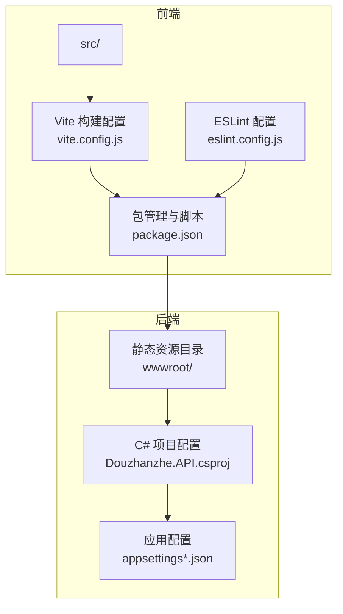
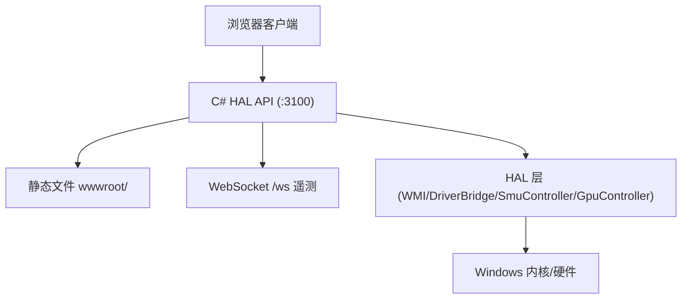
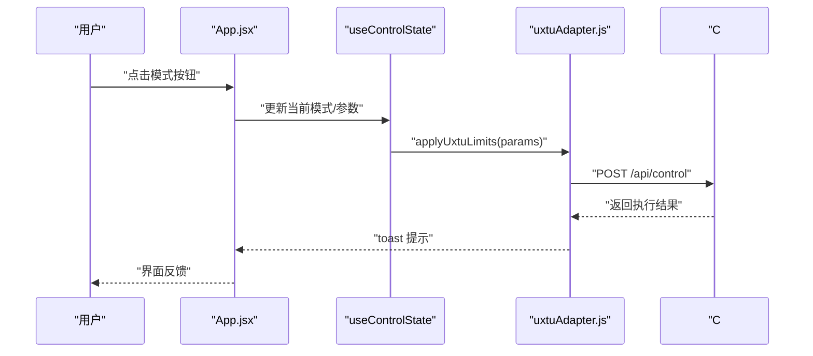
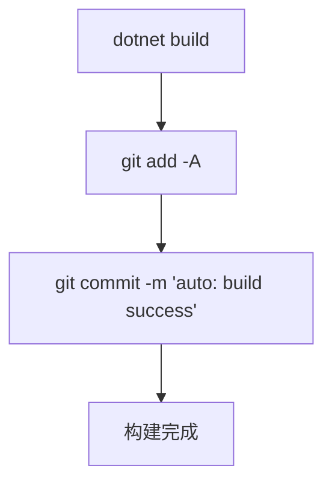
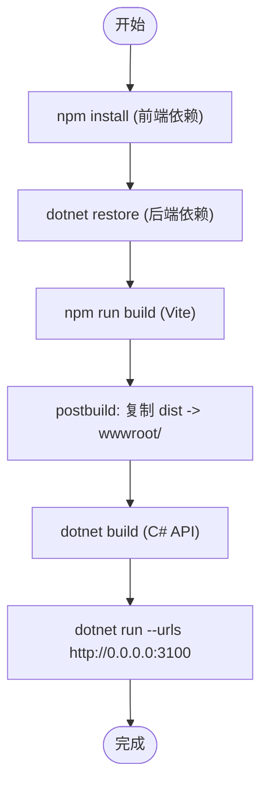
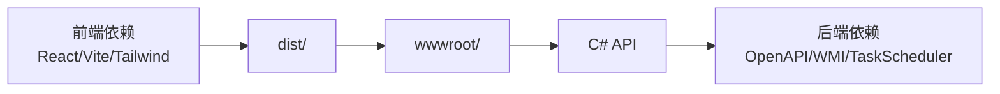

# 开发者指南

<cite>
**本文引用的文件**
- [package.json](file://package.json)
- [eslint.config.js](file://eslint.config.js)
- [vite.config.js](file://vite.config.js)
- [tailwind.config.js](file://tailwind.config.js)
- [postcss.config.js](file://postcss.config.js)
- [Douzhanzhe.API.csproj](file://server/api/Douzhanzhe.API.csproj)
- [appsettings.json](file://server/api/appsettings.json)
- [appsettings.Development.json](file://server/api/appsettings.Development.json)
- [dev-index.md](file://docs/dev-index.md)
- [dev-architecture.md](file://docs/dev-architecture.md)
- [main.jsx](file://src/main.jsx)
- [App.jsx](file://src/App.jsx)
</cite>

## 目录
1. [简介](#简介)
2. [项目结构](#项目结构)
3. [核心组件](#核心组件)
4. [架构总览](#架构总览)
5. [详细组件分析](#详细组件分析)
6. [依赖分析](#依赖分析)
7. [性能考虑](#性能考虑)
8. [故障排查指南](#故障排查指南)
9. [结论](#结论)
10. [附录](#附录)

## 简介
本指南面向开发者，提供从环境搭建、代码规范、构建流程、调试与测试到贡献流程的完整说明。项目采用“C# 后端 + 前端静态资源”的单体架构，前端资源由 C# API 内嵌托管，运行时通过本地管理员权限调用底层驱动与系统接口实现对硬件的遥测与控制。

## 项目结构
- 前端位于 src/，使用 React 19 + Vite 8 + Tailwind CSS 3，构建产物输出至 dist，并由 C# API 的 wwwroot/ 托管。
- 后端位于 server/，采用 .NET 8 Web SDK，Minimal API + WMI + inpoutx64 驱动，提供遥测、控制、WebSocket、调试页面与配置持久化。
- 文档位于 docs/，包含架构、后端、前端、API、任务看板等开发文档。

图表来源
- [vite.config.js:1-8](file://vite.config.js#L1-L8)
- [eslint.config.js:1-22](file://eslint.config.js#L1-L22)
- [package.json:1-33](file://package.json#L1-L33)
- [Douzhanzhe.API.csproj:1-40](file://server/api/Douzhanzhe.API.csproj#L1-L40)
- [appsettings.json:1-10](file://server/api/appsettings.json#L1-L10)
- [appsettings.Development.json:1-9](file://server/api/appsettings.Development.json#L1-L9)

章节来源
- [dev-index.md:98-128](file://docs/dev-index.md#L98-L128)
- [dev-architecture.md:89-98](file://docs/dev-architecture.md#L89-L98)

## 核心组件
- 前端根入口与主题注入：React 根节点在 main.jsx 初始化，App.jsx 负责导航、模式选择、仪表盘与状态同步。
- 后端项目配置：C# API 项目启用 Nullable/ImplicitUsings，目标框架为 net8.0-windows，引用 HAL 并包含 inpoutx64.dll，内置 TaskScheduler 与 System.Management。
- 应用配置：默认与开发环境日志级别配置，允许跨域访问。
- 构建与复制：package.json 中定义 build、lint、postbuild 脚本，postbuild 将 dist 内容复制到 server/api/wwwroot/。

章节来源
- [main.jsx:1-14](file://src/main.jsx#L1-L14)
- [App.jsx:1-134](file://src/App.jsx#L1-L134)
- [Douzhanzhe.API.csproj:1-40](file://server/api/Douzhanzhe.API.csproj#L1-L40)
- [appsettings.json:1-10](file://server/api/appsettings.json#L1-L10)
- [appsettings.Development.json:1-9](file://server/api/appsettings.Development.json#L1-L9)
- [package.json:6-10](file://package.json#L6-L10)

## 架构总览
系统采用“浏览器 → C# HAL API → 硬件”的单向控制链路，API 提供：
- 静态文件托管（wwwroot）
- Minimal API 端点
- WebSocket 遥测推送
- SMU/GPU 控制子进程
- Debug 页面与 UI 状态持久化

图表来源
- [dev-architecture.md:10-46](file://docs/dev-architecture.md#L10-L46)
- [dev-architecture.md:56-87](file://docs/dev-architecture.md#L56-L87)

章节来源
- [dev-architecture.md:1-120](file://docs/dev-architecture.md#L1-L120)

## 详细组件分析

### 前端组件与状态流
- 根组件 App.jsx 负责：
  - 导航与标签页切换（dashboard/system/settings）
  - 主题切换与持久化
  - 模式选择与参数下发（含预设恢复）
  - 仪表盘卡片排序与编辑模式
- 状态管理集中在 useControlState（由 hooks/useControlState.js 提供），并与 localStorage 同步 UI 状态。
- 服务层通过 uxtuAdapter.js 封装 API 请求，负责与后端交互与错误提示。

图表来源
- [App.jsx:86-128](file://src/App.jsx#L86-L128)
- [App.jsx:23-40](file://src/App.jsx#L23-L40)
- [App.jsx:110-127](file://src/App.jsx#L110-L127)

章节来源
- [App.jsx:1-134](file://src/App.jsx#L1-L134)
- [main.jsx:1-14](file://src/main.jsx#L1-L14)

### 后端项目与依赖
- 目标框架：net8.0-windows，启用可空引用与隐式 using。
- 关键依赖：
  - Microsoft.AspNetCore.OpenApi / Swashbuckle.AspNetCore：OpenAPI/Swagger 支持
  - System.Management：WMI 查询与控制
  - TaskScheduler：计划任务调度
  - inpoutx64.dll：EC 寄存器直写与 SMU 物理地址写入
- 构建钩子：AfterTargets="Build" 自动 git add/commit，便于持续集成。

图表来源
- [Douzhanzhe.API.csproj:35-38](file://server/api/Douzhanzhe.API.csproj#L35-L38)

章节来源
- [Douzhanzhe.API.csproj:1-40](file://server/api/Douzhanzhe.API.csproj#L1-L40)

### 构建与打包流程
- 前端构建：
  - 使用 Vite 构建 React 应用，生成 dist/
  - ESLint 校验 JavaScript/JSX
- 后端编译：
  - dotnet restore / dotnet build
- 打包发布：
  - postbuild 脚本将 dist 复制到 server/api/wwwroot/
  - 运行 C# API 即可提供静态资源与接口服务

图表来源
- [package.json:6-10](file://package.json#L6-L10)
- [vite.config.js:1-8](file://vite.config.js#L1-L8)
- [Douzhanzhe.API.csproj:35-38](file://server/api/Douzhanzhe.API.csproj#L35-L38)

章节来源
- [package.json:1-33](file://package.json#L1-L33)
- [vite.config.js:1-8](file://vite.config.js#L1-L8)
- [dev-index.md:54-71](file://docs/dev-index.md#L54-L71)

## 依赖分析
- 前端依赖：React、React DOM、dnd-kit、Tailwind CSS、Vite 插件生态。
- 后端依赖：ASP.NET Core OpenAPI、Swashbuckle、System.Management、TaskScheduler、inpoutx64。
- 构建链路：Vite → dist → wwwroot → C# API 静态托管。

图表来源
- [package.json:11-31](file://package.json#L11-L31)
- [Douzhanzhe.API.csproj:12-33](file://server/api/Douzhanzhe.API.csproj#L12-L33)
- [package.json:6-10](file://package.json#L6-L10)

章节来源
- [package.json:1-33](file://package.json#L1-L33)
- [Douzhanzhe.API.csproj:1-40](file://server/api/Douzhanzhe.API.csproj#L1-L40)

## 性能考虑
- 遥测轮询：后台服务以固定周期推送全量遥测，前端使用防抖减少控制请求频率。
- 资源托管：静态资源由 C# API 内嵌托管，避免额外反向代理开销。
- 构建优化：Vite 快速开发与生产构建，Tailwind 按需扫描内容，PostCSS 自动前缀提升兼容性。
- 权限与稳定性：以管理员权限运行，确保驱动与 WMI 访问稳定。

章节来源
- [dev-architecture.md:56-87](file://docs/dev-architecture.md#L56-L87)
- [tailwind.config.js:1-12](file://tailwind.config.js#L1-L12)
- [postcss.config.js:1-7](file://postcss.config.js#L1-L7)

## 故障排查指南
- 环境与权限
  - 确认 .NET SDK 8.0、Node.js >= 18、npm >= 9、Windows 10/11 x64
  - 以管理员身份运行 PowerShell/终端
- 构建与运行
  - 首次运行：npm install → cd server/api && dotnet restore → dotnet build
  - 启动后端：cd server/api && dotnet run --urls http://0.0.0.0:3100
  - 或使用 run.ps1 自动构建前端并启动
- 调试入口
  - 前端页面：http://127.0.0.1:3100/
  - Debug 面板：http://127.0.0.1:3100/debug
  - API 健康检查：http://localhost:3100/api/health
  - WebSocket 遥测：ws://127.0.0.1:3100/ws
- 驱动与硬件
  - 必须以管理员权限运行，确保 inpoutx64.dll 加载与 EC/SMU 写入
  - 若 C# DLL 被占用，尝试在非活动目录强制编译或重启后重试

章节来源
- [dev-index.md:31-71](file://docs/dev-index.md#L31-L71)
- [dev-index.md:88-97](file://docs/dev-index.md#L88-L97)
- [dev-architecture.md:99-114](file://docs/dev-architecture.md#L99-L114)

## 结论
本项目以简洁稳定的“C# 后端 + 前端静态资源”架构实现对硬件的遥测与控制。遵循本文的环境搭建、代码规范、构建与调试流程，可快速上手开发与贡献。

## 附录

### 开发环境搭建与 IDE 配置
- 环境要求
  - .NET SDK 8.0 (net8.0-windows)
  - Node.js >= 18
  - npm >= 9
  - Windows 10/11 x64
- IDE 建议
  - C# 后端：Visual Studio 2022+ 或 VS Code + C# 扩展
  - 前端：VS Code + React/ESLint/Prettier 插件
- 权限与驱动
  - 以管理员身份运行开发终端
  - 确保 inpoutx64.dll 可被加载

章节来源
- [dev-index.md:31-39](file://docs/dev-index.md#L31-L39)

### 调试工具与测试环境
- 前端调试
  - 浏览器 DevTools → Network → WS → ws://127.0.0.1:3100/ws 观察遥测
  - ESLint 校验：npm run lint
- 后端调试
  - dotnet run --urls http://0.0.0.0:3100
  - Debug 页面：http://127.0.0.1:3100/debug
  - 健康检查：http://localhost:3100/api/health
- 测试建议
  - 单元测试：为 JS 工具函数与适配器编写 Jest/React Testing Library 测试
  - 集成测试：通过 Swagger/OpenAPI 文档验证 API 行为
  - 端到端测试：使用 Playwright/Cypress 验证 UI 与控制链路

章节来源
- [dev-index.md:48-53](file://docs/dev-index.md#L48-L53)
- [eslint.config.js:1-22](file://eslint.config.js#L1-L22)

### 代码规范与约定
- JavaScript/JSX
  - 使用 ESLint 推荐规则与 React Hooks、React Refresh 插件
  - 全局浏览器环境变量启用，支持 JSX
- CSS/样式
  - Tailwind CSS 按内容扫描，确保未使用类名被 Tree-shaking 移除
  - PostCSS 自动添加浏览器前缀
- C#
  - 项目启用可空引用与隐式 using，保持简洁命名空间
  - 依赖项集中管理，避免重复引用

章节来源
- [eslint.config.js:7-21](file://eslint.config.js#L7-L21)
- [tailwind.config.js:1-12](file://tailwind.config.js#L1-L12)
- [postcss.config.js:1-7](file://postcss.config.js#L1-L7)
- [Douzhanzhe.API.csproj:3-10](file://server/api/Douzhanzhe.API.csproj#L3-L10)

### 构建流程详解
- 前端
  - npm run build：Vite 生产构建
  - npm run lint：ESLint 校验
  - postbuild：将 dist 复制到 wwwroot/
- 后端
  - dotnet restore：还原 NuGet 包
  - dotnet build：编译项目并执行自动 git 提交钩子
- 发布
  - 运行 C# API 即可提供静态资源与接口服务

章节来源
- [package.json:6-10](file://package.json#L6-L10)
- [Douzhanzhe.API.csproj:35-38](file://server/api/Douzhanzhe.API.csproj#L35-L38)
- [dev-index.md:54-71](file://docs/dev-index.md#L54-L71)

### 贡献指南
- 提交流程
  - 分支策略：基于 main 分支创建功能/修复分支
  - 提交信息：遵循“类型: 内容”格式，简明描述变更
  - Pull Request：关联任务看板条目，附带测试与文档更新
- 代码审查
  - 提交前执行 npm run lint
  - 确保构建与运行无误（dotnet restore/build/run）
- 版本控制
  - 使用 .gitignore 与 .gitattributes 管理构建产物与行尾
  - 手工 git add 审核，避免误提交大文件或敏感信息

章节来源
- [dev-index.md:88-97](file://docs/dev-index.md#L88-L97)