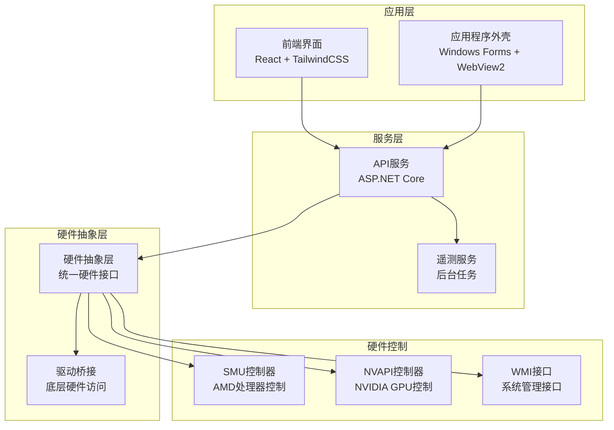
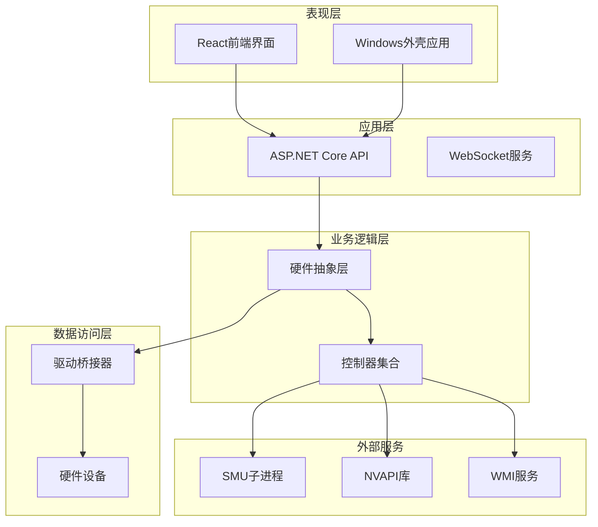
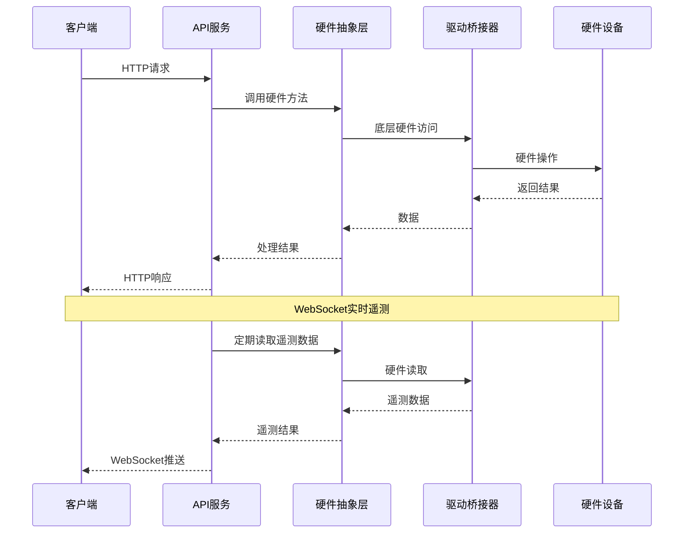
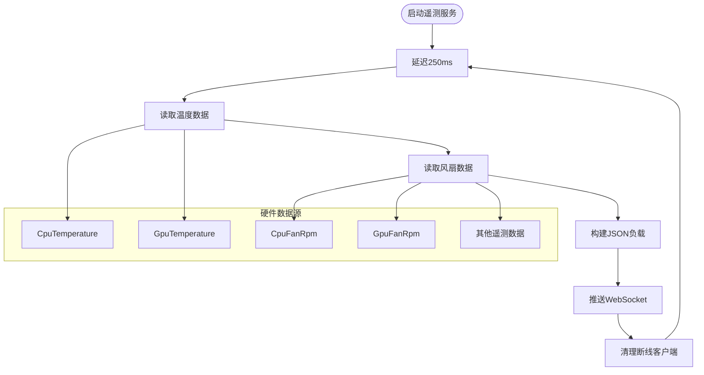
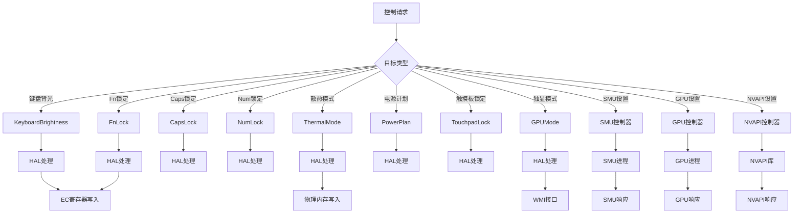
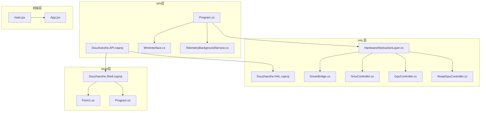

# 反编译工具集

<cite>
**本文档引用的文件**
- [Douzhanzhe.API.csproj](file://server/api/Douzhanzhe.API.csproj)
- [Douzhanzhe.HAL.csproj](file://server/hal/Douzhanzhe.HAL.csproj)
- [Douzhanzhe.Shell.csproj](file://server/shell/Douzhanzhe.Shell/Douzhanzhe.Shell.csproj)
- [Program.cs](file://server/api/Program.cs)
- [HardwareAbstractionLayer.cs](file://server/hal/HardwareAbstractionLayer.cs)
- [DriverBridge.cs](file://server/hal/DriverBridge.cs)
- [GpuController.cs](file://server/hal/GpuController.cs)
- [NvapiGpuController.cs](file://server/hal/NvapiGpuController.cs)
- [SmuController.cs](file://server/hal/SmuController.cs)
- [WmiInterface.cs](file://server/api/WmiInterface.cs)
- [TelemetryBackgroundService.cs](file://server/api/TelemetryBackgroundService.cs)
- [dashboard-default.json](file://server/config/dashboard-default.json)
- [Form1.cs](file://server/shell/Douzhanzhe.Shell/Form1.cs)
- [Program.cs](file://server/shell/Douzhanzhe.Shell/Program.cs)
- [main.jsx](file://src/main.jsx)
- [App.jsx](file://src/App.jsx)
</cite>

## 目录
1. [简介](#简介)
2. [项目结构](#项目结构)
3. [核心组件](#核心组件)
4. [架构概览](#架构概览)
5. [详细组件分析](#详细组件分析)
6. [依赖关系分析](#依赖关系分析)
7. [性能考虑](#性能考虑)
8. [故障排除指南](#故障排除指南)
9. [结论](#结论)

## 简介

Douzhanzhe Control（斗战者控制台）是一个综合性的硬件控制系统，主要针对AMD平台的笔记本电脑进行深度定制和优化。该项目的核心目标是提供一个完整的硬件抽象层，通过多种技术手段实现对系统硬件的精确控制。

该工具集采用多层架构设计，包括：
- **硬件抽象层（HAL）**：提供统一的硬件访问接口
- **后端API服务**：基于ASP.NET Core构建RESTful API
- **前端控制界面**：React构建的现代化用户界面
- **系统外壳**：Windows Forms + WebView2的应用程序外壳

## 项目结构

项目采用清晰的分层架构，主要包含以下核心模块：

**图表来源**
- [Program.cs:1-839](file://server/api/Program.cs#L1-L839)
- [HardwareAbstractionLayer.cs:1-772](file://server/hal/HardwareAbstractionLayer.cs#L1-L772)
- [DriverBridge.cs:1-150](file://server/hal/DriverBridge.cs#L1-L150)

**章节来源**
- [Douzhanzhe.API.csproj:1-40](file://server/api/Douzhanzhe.API.csproj#L1-L40)
- [Douzhanzhe.HAL.csproj:1-18](file://server/hal/Douzhanzhe.HAL.csproj#L1-L18)
- [Douzhanzhe.Shell.csproj:1-16](file://server/shell/Douzhanzhe.Shell/Douzhanzhe.Shell.csproj#L1-L16)

## 核心组件

### 硬件抽象层（HAL）

硬件抽象层是整个系统的核心，提供了统一的硬件访问接口。它封装了底层硬件的具体实现细节，向上层提供简洁的API。

**主要特性：**
- 支持多种硬件控制方式：EC寄存器、WMI、NVAPI、SMU
- 提供缓存机制以提高性能
- 实现健康检查确保硬件通信正常
- 支持系统信息查询和遥测数据收集

**章节来源**
- [HardwareAbstractionLayer.cs:1-772](file://server/hal/HardwareAbstractionLayer.cs#L1-L772)

### 驱动桥接器

驱动桥接器负责与底层硬件进行直接通信，支持多种硬件访问方式：

**支持的访问方式：**
- **EC寄存器访问**：通过I/O端口0x62/0x66协议访问EC寄存器
- **物理内存映射**：直接访问特定物理地址
- **I/O端口操作**：通过InpOut驱动进行I/O端口读写
- **SMI触发**：通过GSMI协议触发系统管理中断

**章节来源**
- [DriverBridge.cs:1-150](file://server/hal/DriverBridge.cs#L1-L150)

### SMU控制器

SMU（System Management Unit）控制器用于控制AMD处理器的功耗、频率和温度限制。通过调用ryzenadj.exe子进程实现对SMU的精确控制。

**支持的功能：**
- 设置长时功耗限制（stapm）
- 设置短时功耗限制（fast/slow）
- 设置温度限制（tctl）
- 频率限制设置
- 睿频禁用/启用

**章节来源**
- [SmuController.cs:1-142](file://server/hal/SmuController.cs#L1-L142)

### GPU控制器

GPU控制器专门处理NVIDIA GPU的控制，通过nvidia-smi命令行工具实现各种GPU操作。

**支持的操作：**
- 锁定GPU核心频率
- 锁定显存频率
- 重置频率设置
- 查询GPU状态信息
- 获取基准频率和最大频率

**章节来源**
- [GpuController.cs:1-116](file://server/hal/GpuController.cs#L1-L116)

### NVAPI控制器

NVAPI控制器提供对NVIDIA GPU的高级控制能力，支持超频、功率限制和温度控制。

**支持的功能：**
- P-State偏移设置（超频/降频）
- 功率限制设置
- 温度限制设置
- 当前频率查询
- P-State信息转储

**章节来源**
- [NvapiGpuController.cs:1-491](file://server/hal/NvapiGpuController.cs#L1-L491)

## 架构概览

系统采用分层架构设计，确保各层之间的职责分离和松耦合：

**图表来源**
- [Program.cs:1-839](file://server/api/Program.cs#L1-L839)
- [HardwareAbstractionLayer.cs:1-772](file://server/hal/HardwareAbstractionLayer.cs#L1-L772)
- [DriverBridge.cs:1-150](file://server/hal/DriverBridge.cs#L1-L150)

## 详细组件分析

### API服务架构

API服务基于ASP.NET Core构建，提供RESTful接口和WebSocket实时通信。

**图表来源**
- [Program.cs:57-87](file://server/api/Program.cs#L57-L87)
- [TelemetryBackgroundService.cs:54-141](file://server/api/TelemetryBackgroundService.cs#L54-L141)

**章节来源**
- [Program.cs:1-839](file://server/api/Program.cs#L1-L839)
- [TelemetryBackgroundService.cs:1-143](file://server/api/TelemetryBackgroundService.cs#L1-L143)

### 遥测系统

遥测系统每250毫秒自动收集硬件状态信息，并通过WebSocket实时推送给前端。

**图表来源**
- [TelemetryBackgroundService.cs:54-141](file://server/api/TelemetryBackgroundService.cs#L54-L141)

**章节来源**
- [TelemetryBackgroundService.cs:1-143](file://server/api/TelemetryBackgroundService.cs#L1-L143)

### 硬件控制流程

系统支持多种硬件控制方式，每种方式都有其特定的应用场景：

**图表来源**
- [Program.cs:145-203](file://server/api/Program.cs#L145-L203)
- [HardwareAbstractionLayer.cs:274-340](file://server/hal/HardwareAbstractionLayer.cs#L274-L340)

**章节来源**
- [Program.cs:145-203](file://server/api/Program.cs#L145-L203)
- [HardwareAbstractionLayer.cs:274-340](file://server/hal/HardwareAbstractionLayer.cs#L274-L340)

## 依赖关系分析

项目采用模块化设计，各组件之间保持松耦合：

**图表来源**
- [Douzhanzhe.API.csproj:1-40](file://server/api/Douzhanzhe.API.csproj#L1-L40)
- [Douzhanzhe.HAL.csproj:1-18](file://server/hal/Douzhanzhe.HAL.csproj#L1-L18)
- [Douzhanzhe.Shell.csproj:1-16](file://server/shell/Douzhanzhe.Shell/Douzhanzhe.Shell.csproj#L1-L16)

**章节来源**
- [Douzhanzhe.API.csproj:17-29](file://server/api/Douzhanzhe.API.csproj#L17-L29)
- [Douzhanzhe.HAL.csproj:13-15](file://server/hal/Douzhanzhe.HAL.csproj#L13-L15)

## 性能考虑

系统在设计时充分考虑了性能优化：

### 缓存策略
- **遥测数据缓存**：CPU使用率、GPU状态等数据缓存2秒
- **系统信息缓存**：系统型号、CPU/GPU名称等缓存10秒
- **GPU状态缓存**：GPU使用率、频率等缓存2秒

### 异步处理
- **WebSocket推送**：异步推送遥测数据，避免阻塞主线程
- **后台服务**：独立的遥测服务线程，定时收集硬件状态
- **非阻塞I/O**：使用异步API进行硬件通信

### 资源管理
- **连接池**：复用HTTP连接和数据库连接
- **对象池**：重用ByteBuffer等临时对象
- **及时释放**：确保硬件资源正确释放

## 故障排除指南

### 常见问题及解决方案

**硬件驱动问题**
- **症状**：硬件读取返回默认值
- **原因**：InpOut驱动未正确安装
- **解决**：重新安装InpOut驱动，确保以管理员权限运行

**SMU控制失败**
- **症状**：SMU设置命令执行失败
- **原因**：ryzenadj.exe不存在或权限不足
- **解决**：检查ryzenadj.exe路径，确保具有足够权限

**WMI接口错误**
- **症状**：WMI相关功能无法使用
- **原因**：WMI服务未启动或权限不足
- **解决**：启动WMI服务，检查用户权限

**章节来源**
- [Program.cs:737-768](file://server/api/Program.cs#L737-L768)
- [HardwareAbstractionLayer.cs:56-57](file://server/hal/HardwareAbstractionLayer.cs#L56-L57)

## 结论

Douzhanzhe Control是一个设计精良的硬件控制系统，具有以下特点：

**优势：**
- **模块化设计**：清晰的分层架构便于维护和扩展
- **多硬件支持**：同时支持AMD和NVIDIA硬件平台
- **实时监控**：通过WebSocket提供实时硬件状态
- **用户友好**：提供直观的图形界面和丰富的控制选项

**应用场景：**
- 笔记本电脑硬件优化
- 超频和降频控制
- 散热管理和风扇控制
- 功耗和性能平衡

该系统为硬件爱好者和专业用户提供了强大的工具集，通过合理的架构设计和实现细节，确保了系统的稳定性、性能和可扩展性。