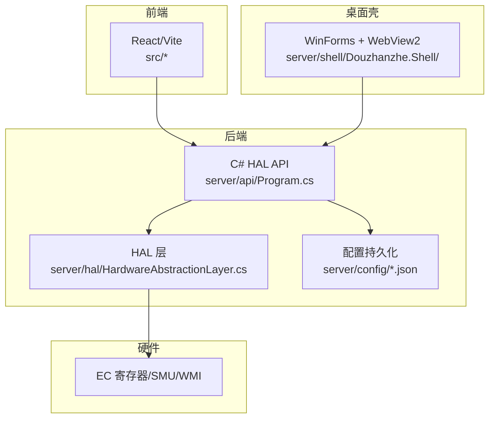
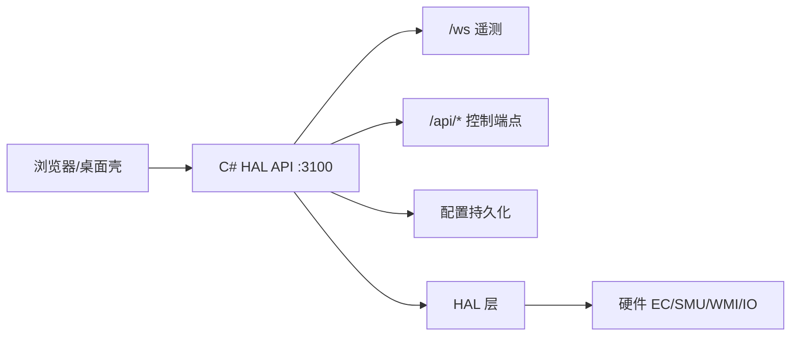
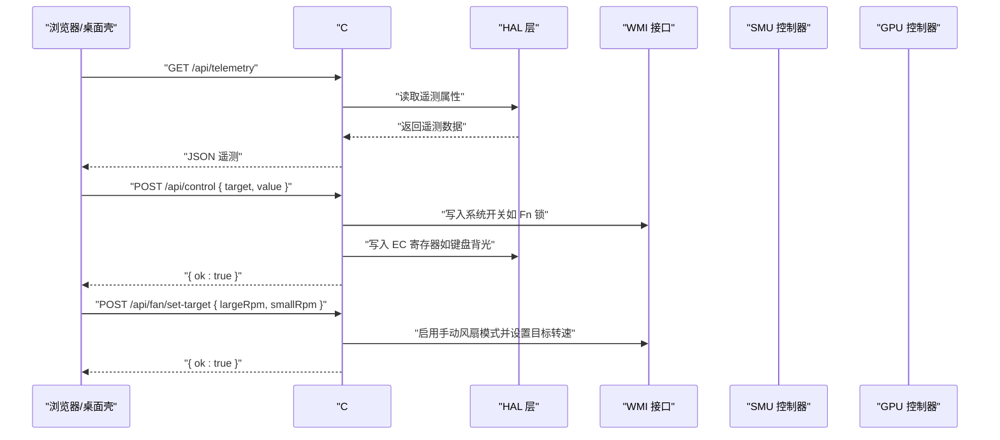
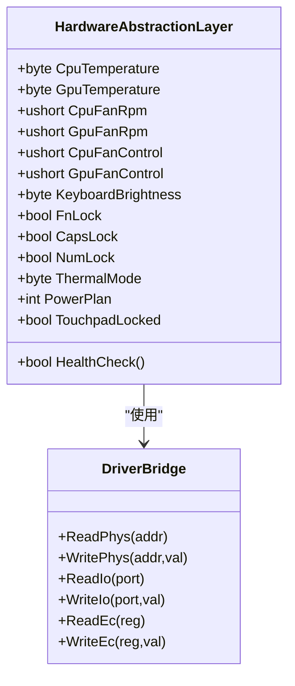
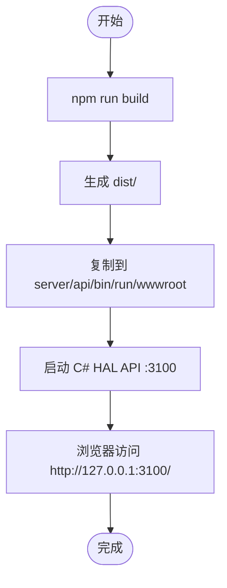
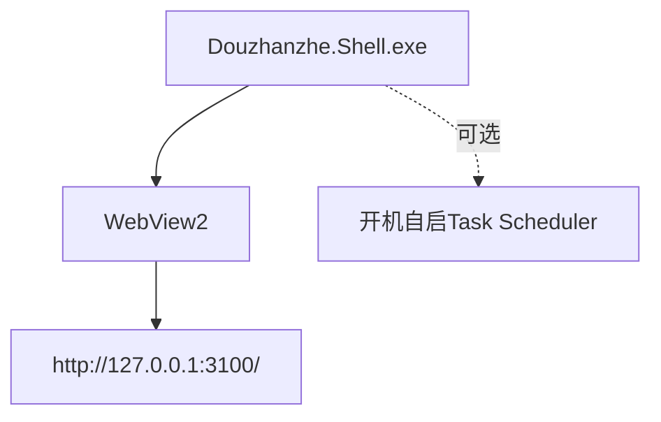
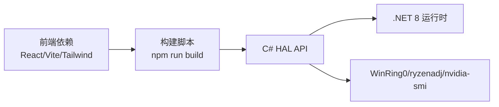

# 快速开始

<cite>
**本文引用的文件**
- [package.json](file://package.json)
- [vite.config.js](file://vite.config.js)
- [index.html](file://index.html)
- [src/main.jsx](file://src/main.jsx)
- [server/api/run.ps1](file://server/api/run.ps1)
- [server/tools/reload-fe.ps1](file://server/tools/reload-fe.ps1)
- [server/api/appsettings.json](file://server/api/appsettings.json)
- [server/api/appsettings.Development.json](file://server/api/appsettings.Development.json)
- [server/api/Program.cs](file://server/api/Program.cs)
- [server/hal/HardwareAbstractionLayer.cs](file://server/hal/HardwareAbstractionLayer.cs)
- [server/shell/Douzhanzhe.Shell/Douzhanzhe.Shell.csproj](file://server/shell/Douzhanzhe.Shell/Douzhanzhe.Shell.csproj)
- [docs/dev-architecture.md](file://docs/dev-architecture.md)
- [docs/dev-backend.md](file://docs/dev-backend.md)
- [docs/dev-known-issues.md](file://docs/dev-known-issues.md)
</cite>

## 目录
1. [简介](#简介)
2. [项目结构](#项目结构)
3. [核心组件](#核心组件)
4. [架构总览](#架构总览)
5. [详细组件分析](#详细组件分析)
6. [依赖关系分析](#依赖关系分析)
7. [性能考虑](#性能考虑)
8. [故障排查指南](#故障排查指南)
9. [结论](#结论)
10. [附录](#附录)

## 简介
本指南面向首次接触 DOUZHANZHE-Control 的用户，帮助你在约 30 分钟内完成环境准备、编译与运行，并掌握基础使用方法（查看硬件状态、简单风扇控制）。项目采用“后端 C# HAL API + 前端 React/Vite + 可选桌面壳”的架构，所有前端资源由后端自托管，无需额外 Node.js 服务。

## 项目结构
- 后端 API（C# .NET 8）位于 server/api，包含 Minimal API、WebSocket、静态文件托管与配置持久化。
- 硬件抽象层（HAL）位于 server/hal，封装 EC/SMU/GPU/WMI 等底层硬件交互。
- 前端位于 src，使用 Vite + React，通过 npm scripts 构建并复制到后端 wwwroot。
- 可选桌面壳位于 server/shell/Douzhanzhe.Shell，基于 WinForms + WebView2，用于系统托盘最小化。
- 文档位于 docs，包含架构、后端、前端、已知问题等说明。

图表来源
- [server/api/Program.cs:1-783](file://server/api/Program.cs#L1-L783)
- [server/hal/HardwareAbstractionLayer.cs:1-767](file://server/hal/HardwareAbstractionLayer.cs#L1-L767)
- [docs/dev-architecture.md:1-120](file://docs/dev-architecture.md#L1-L120)

章节来源
- [docs/dev-architecture.md:1-120](file://docs/dev-architecture.md#L1-L120)
- [docs/dev-backend.md:1-323](file://docs/dev-backend.md#L1-L323)

## 核心组件
- 后端 API（C# .NET 8）
  - 提供 /ws 实时遥测、/api/* 控制端点、静态文件托管（wwwroot）、配置持久化。
  - 依赖 HAL 层进行硬件读写，依赖 WMI/SMU/GPU 控制器。
- HAL 层
  - 将 EC 寄存器、SMU、WMI 等映射为语义化属性，如温度、风扇转速、键盘背光、散热模式等。
- 前端
  - React/Vite 构建，打包产物复制到后端 wwwroot，浏览器直接访问 http://127.0.0.1:3100/。
- 桌面壳
  - WinForms + WebView2，加载本地 127.0.0.1:3100，支持系统托盘最小化。

章节来源
- [server/api/Program.cs:1-783](file://server/api/Program.cs#L1-L783)
- [server/hal/HardwareAbstractionLayer.cs:1-767](file://server/hal/HardwareAbstractionLayer.cs#L1-L767)
- [package.json:1-33](file://package.json#L1-L33)
- [vite.config.js:1-8](file://vite.config.js#L1-L8)
- [index.html:1-14](file://index.html#L1-L14)
- [src/main.jsx:1-14](file://src/main.jsx#L1-L14)
- [server/shell/Douzhanzhe.Shell/Douzhanzhe.Shell.csproj:1-16](file://server/shell/Douzhanzhe.Shell/Douzhanzhe.Shell.csproj#L1-L16)

## 架构总览
- 系统分层
  - 桌面壳（可选）→ C# HAL API（:3100）→ HAL 层 → 硬件（EC/SMU/WMI/IO）。
- 数据流
  - HAL 以 250ms 轮询硬件，通过 /ws 推送全量遥测；前端通过 WebSocket 订阅。
  - 控制请求经 API 路由到 HAL/WMI/SMU/GPU 控制器执行。
- 部署
  - C# HAL API 单服务运行；桌面壳可选；前端静态资源由后端 wwwroot 提供。

图表来源
- [docs/dev-architecture.md:1-120](file://docs/dev-architecture.md#L1-L120)
- [server/api/Program.cs:56-120](file://server/api/Program.cs#L56-L120)

章节来源
- [docs/dev-architecture.md:1-120](file://docs/dev-architecture.md#L1-L120)

## 详细组件分析

### 后端 API（C# .NET 8）
- 服务与端口
  - C# HAL API :3100，提供 Minimal API、WebSocket、静态文件托管。
- 关键能力
  - 遥测：/api/telemetry、/ws。
  - 控制：/api/control、/api/fan/*、/api/smu/*、/api/gpu/*。
  - 配置：/api/custom-params、/api/ui-state、/api/default-config。
  - 系统：/api/auto-start*、/debug 页面。
- 驱动与权限
  - 需要管理员权限运行（加载 WinRing0 内核驱动）。
  - 启动时自动检测并尝试加载 WinRing0.sys。

图表来源
- [server/api/Program.cs:87-202](file://server/api/Program.cs#L87-L202)
- [server/api/Program.cs:345-394](file://server/api/Program.cs#L345-L394)

章节来源
- [server/api/Program.cs:1-783](file://server/api/Program.cs#L1-L783)
- [docs/dev-backend.md:1-323](file://docs/dev-backend.md#L1-L323)

### HAL 层（硬件抽象）
- 主要职责
  - 将 EC 寄存器、SMU、WMI 等映射为语义化属性，如温度、风扇转速、键盘背光、散热模式、电源计划等。
- 关键点
  - EC 读写通过 inpoutx64 驱动；SMU 通过 ryzenadj 子进程；GPU 通过 nvidia-smi。
  - 部分地址写入需使用 SetPhysLong 或 MapPhysToLin，部分寄存器写入有地址限制。

图表来源
- [server/hal/HardwareAbstractionLayer.cs:1-767](file://server/hal/HardwareAbstractionLayer.cs#L1-L767)

章节来源
- [server/hal/HardwareAbstractionLayer.cs:1-767](file://server/hal/HardwareAbstractionLayer.cs#L1-L767)
- [docs/dev-backend.md:66-85](file://docs/dev-backend.md#L66-L85)

### 前端（React/Vite）
- 构建与部署
  - npm run build 生成 dist，通过 run.ps1/postbuild 脚本复制到后端 wwwroot。
  - 开发期间可用 reload-fe.ps1 热更新前端到运行中的后端。
- 入口与路由
  - index.html → src/main.jsx → App.jsx，React 组件树渲染。
- 静态托管
  - 后端 UseStaticFiles + MapFallbackToFile，统一提供前端资源。

图表来源
- [package.json:6-10](file://package.json#L6-L10)
- [server/api/run.ps1:45-60](file://server/api/run.ps1#L45-L60)
- [server/tools/reload-fe.ps1:10-22](file://server/tools/reload-fe.ps1#L10-L22)

章节来源
- [package.json:1-33](file://package.json#L1-L33)
- [vite.config.js:1-8](file://vite.config.js#L1-L8)
- [index.html:1-14](file://index.html#L1-L14)
- [src/main.jsx:1-14](file://src/main.jsx#L1-L14)
- [server/api/run.ps1:1-67](file://server/api/run.ps1#L1-L67)
- [server/tools/reload-fe.ps1:1-33](file://server/tools/reload-fe.ps1#L1-L33)

### 桌面壳（可选）
- 组件
  - WinForms + WebView2，加载 http://127.0.0.1:3100/。
  - 支持系统托盘最小化与开机自启配置。
- 依赖
  - 需要 WebView2 运行时。

图表来源
- [server/shell/Douzhanzhe.Shell/Douzhanzhe.Shell.csproj:1-16](file://server/shell/Douzhanzhe.Shell/Douzhanzhe.Shell.csproj#L1-L16)
- [server/api/Program.cs:621-686](file://server/api/Program.cs#L621-L686)

章节来源
- [server/shell/Douzhanzhe.Shell/Douzhanzhe.Shell.csproj:1-16](file://server/shell/Douzhanzhe.Shell/Douzhanzhe.Shell.csproj#L1-L16)
- [server/api/Program.cs:621-686](file://server/api/Program.cs#L621-L686)

## 依赖关系分析
- 后端依赖
  - .NET 8 Minimal API、System.Management（WMI）、第三方 NuGet 包（如 WebView2）。
- 前端依赖
  - React、Vite、TailwindCSS、ESLint 等。
- 硬件依赖
  - WinRing0 内核驱动（自动加载）、ryzenadj.exe（SMU）、nvidia-smi（GPU）。
- 运行时要求
  - Windows（WMI/IO/SMU 依赖）、管理员权限（驱动加载）。

图表来源
- [package.json:11-31](file://package.json#L11-L31)
- [server/api/Program.cs:1-18](file://server/api/Program.cs#L1-L18)
- [docs/dev-architecture.md:99-107](file://docs/dev-architecture.md#L99-L107)

章节来源
- [package.json:1-33](file://package.json#L1-L33)
- [docs/dev-architecture.md:99-107](file://docs/dev-architecture.md#L99-L107)

## 性能考虑
- 遥测轮询
  - HAL 以 250ms 轮询硬件并通过 WebSocket 推送全量遥测，保证实时性。
- 前端渲染
  - React 组件按需更新，建议避免频繁重渲染；使用 Tailwind 的原子样式减少体积。
- 驱动与子进程
  - SMU/GPU 控制通过子进程调用，注意避免高频重复调用；合理使用去抖（如 500ms）。

章节来源
- [docs/dev-backend.md:119-125](file://docs/dev-backend.md#L119-L125)

## 故障排查指南
- 环境要求未满足
  - Windows 且具备管理员权限；.NET 8 运行时；Node.js（用于前端构建）。
- WinRing0 驱动未加载
  - 启动日志提示驱动加载失败时，确认 run.ps1/Program.cs 是否正确部署 WinRing0x64.sys，并以管理员身份运行。
- 前端资源未显示
  - 确认 npm run build 成功，且 run.ps1/postbuild 已将 dist 复制到 wwwroot。
- 端口冲突
  - run.ps1 会尝试终止占用 3100 的进程；若仍失败，手动结束相关进程后重试。
- 已知问题
  - ryzenadj 退出时偶发 0xC0000005（已适配为成功退出码，不影响写入）。
  - 前端热更新部署目标曾错误，现已修复。

章节来源
- [server/api/run.ps1:1-67](file://server/api/run.ps1#L1-L67)
- [server/tools/reload-fe.ps1:1-33](file://server/tools/reload-fe.ps1#L1-L33)
- [docs/dev-known-issues.md:1-16](file://docs/dev-known-issues.md#L1-L16)

## 结论
按照本指南准备环境、运行后端 API、构建前端并访问界面，你可以在 30 分钟内完成完整体验。若遇到驱动或权限问题，按“故障排查指南”逐项检查即可快速定位解决。

## 附录

### 环境准备清单
- 操作系统：Windows（推荐最新版本）
- 运行时与工具
  - .NET 8 运行时
  - Node.js（用于前端构建）
  - PowerShell（运行 run.ps1/reload-fe.ps1）
  - Visual Studio（可选，用于桌面壳调试）
- 硬件依赖
  - WinRing0 内核驱动（随项目提供）
  - ryzenadj.exe（SMU 控制）
  - nvidia-smi（GPU 控制）

章节来源
- [docs/dev-architecture.md:99-107](file://docs/dev-architecture.md#L99-L107)
- [server/api/run.ps1:22-43](file://server/api/run.ps1#L22-L43)

### 编译与运行流程
- 后端 API
  - 使用 run.ps1 启动：自动构建 C# API、复制工具、加载驱动、构建并部署前端、在 :3100 启动服务。
  - 或手动：dotnet build Douzhanzhe.API.csproj → dotnet run --urls=http://127.0.0.1:3100。
- 前端
  - npm run build → 自动复制到 wwwroot。
  - 开发热更新：server/tools/reload-fe.ps1。
- 桌面壳
  - Visual Studio 编译 Douzhanzhe.Shell → 运行 Douzhanzhe.Shell.exe，加载本地 127.0.0.1:3100。

章节来源
- [server/api/run.ps1:1-67](file://server/api/run.ps1#L1-L67)
- [server/tools/reload-fe.ps1:1-33](file://server/tools/reload-fe.ps1#L1-L33)
- [package.json:6-10](file://package.json#L6-L10)
- [server/shell/Douzhanzhe.Shell/Douzhanzhe.Shell.csproj:1-16](file://server/shell/Douzhanzhe.Shell/Douzhanzhe.Shell.csproj#L1-L16)

### 基本使用示例
- 查看硬件状态
  - 浏览器访问 http://127.0.0.1:3100/，进入“遥测”面板，观察 CPU/GPU/风扇/内存/磁盘等指标。
  - 或使用 /api/telemetry 获取 JSON 数据。
- 简单风扇控制
  - 使用 /api/fan/set-target 设置大/小风扇目标转速（RPM），或 /api/fan/restore 恢复固件控制。
- 系统开关与灯光
  - 使用 /api/control 设置 kb_light、fn_lock、num_lock、caps_lock、thermal_mode、power_plan 等。

章节来源
- [server/api/Program.cs:87-202](file://server/api/Program.cs#L87-L202)
- [server/api/Program.cs:345-394](file://server/api/Program.cs#L345-L394)