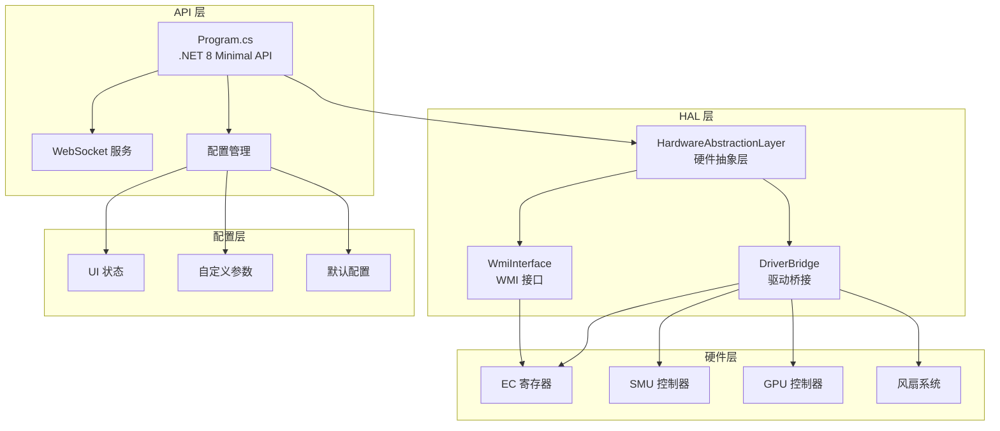
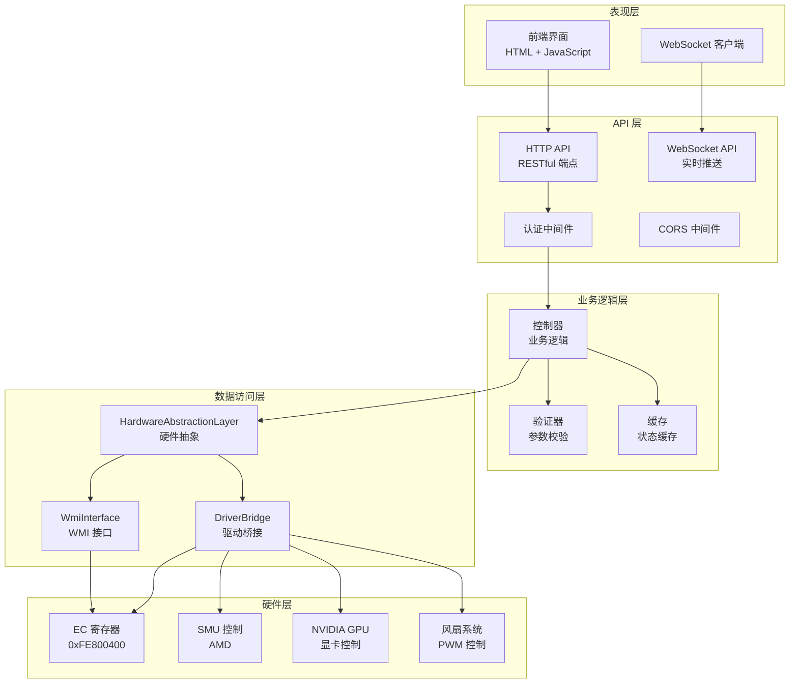
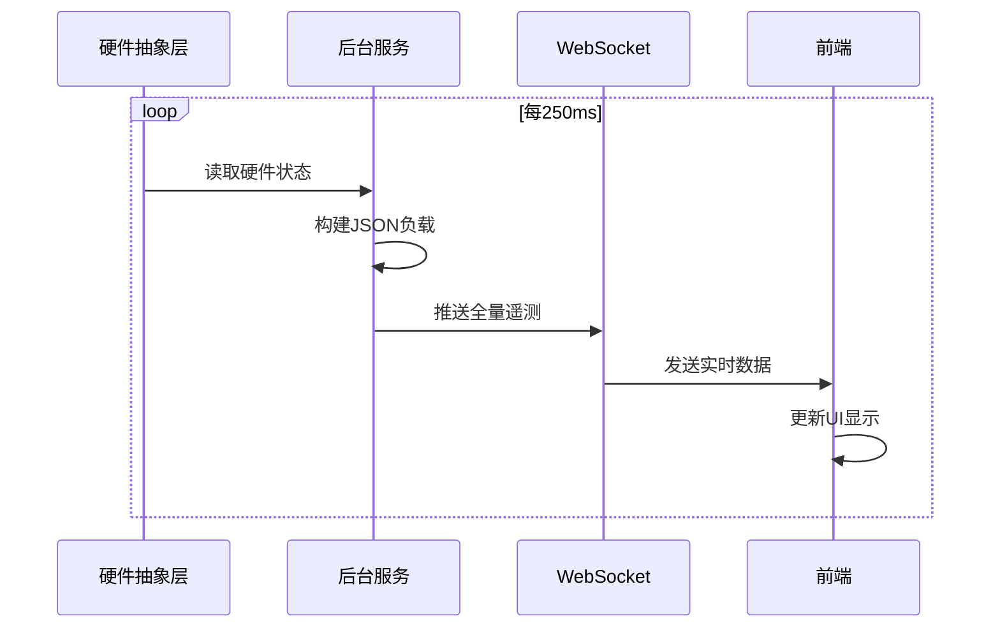
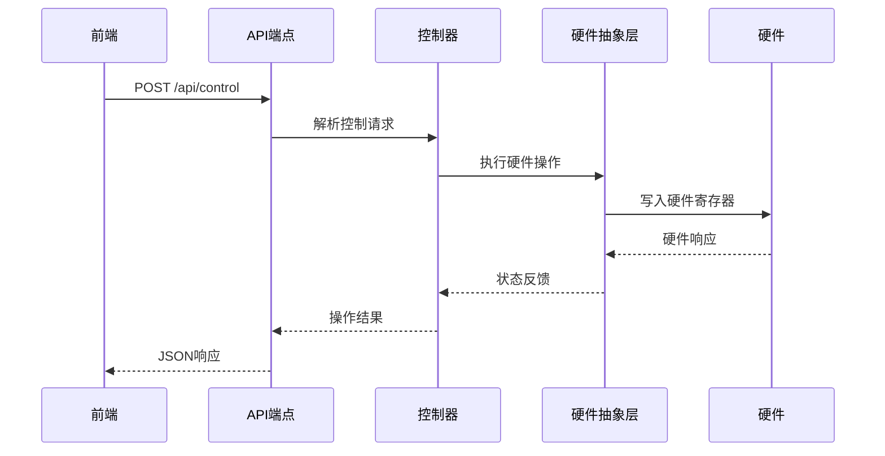
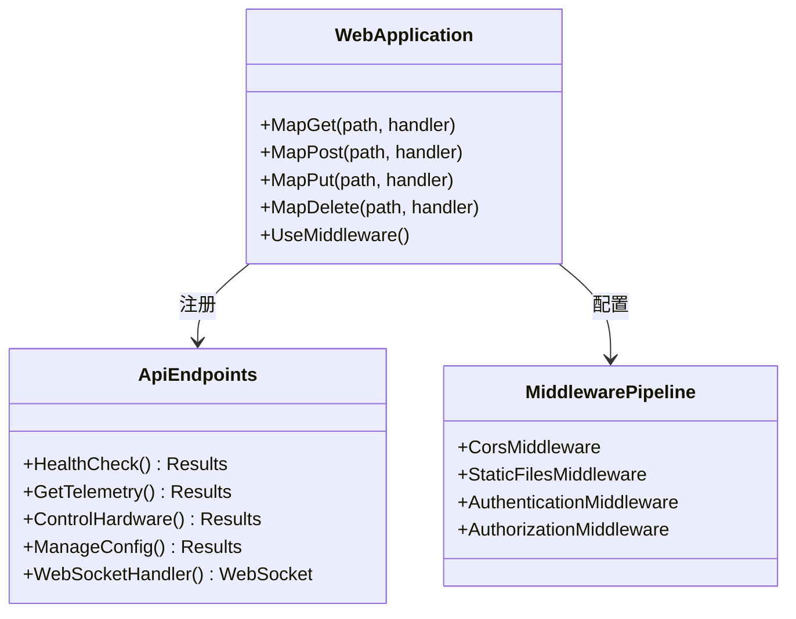
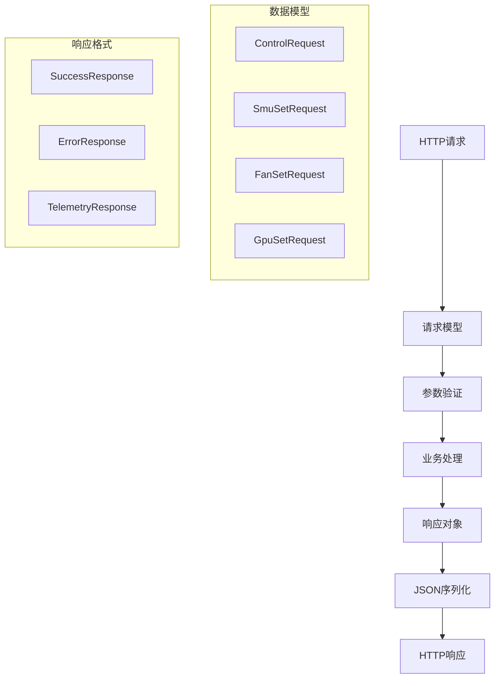
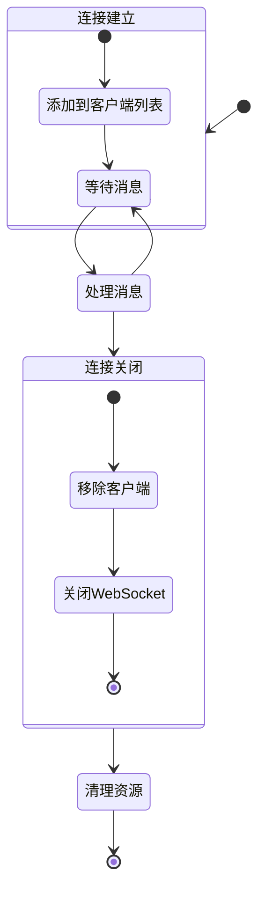
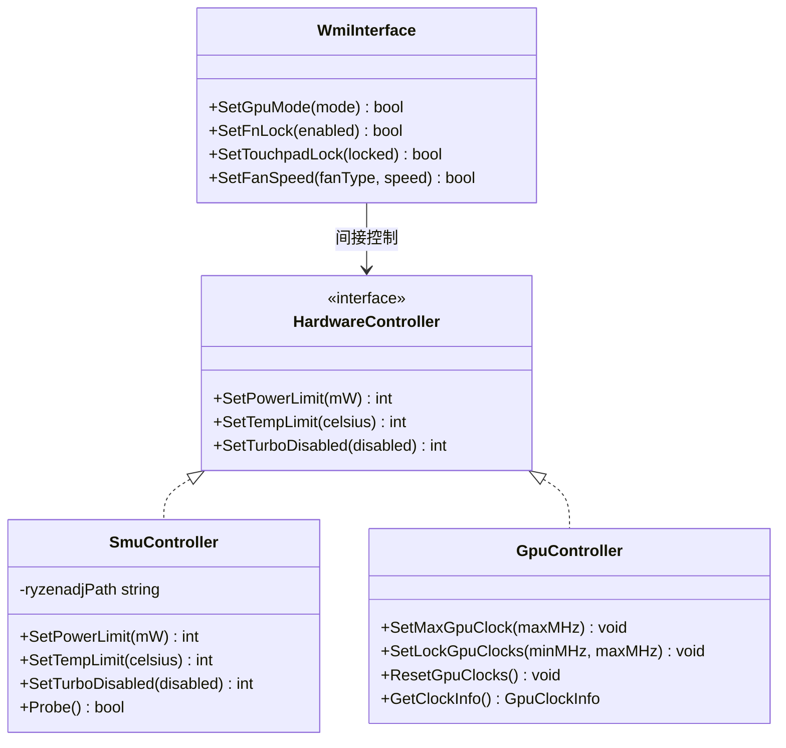
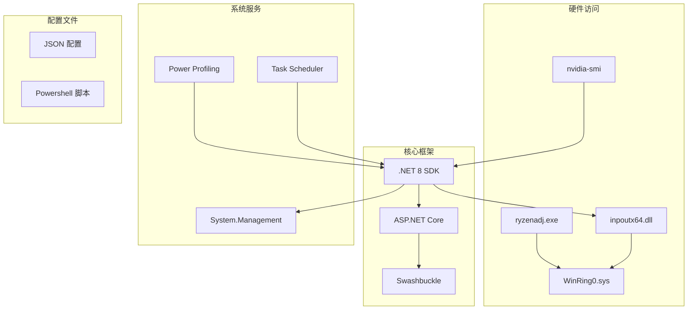
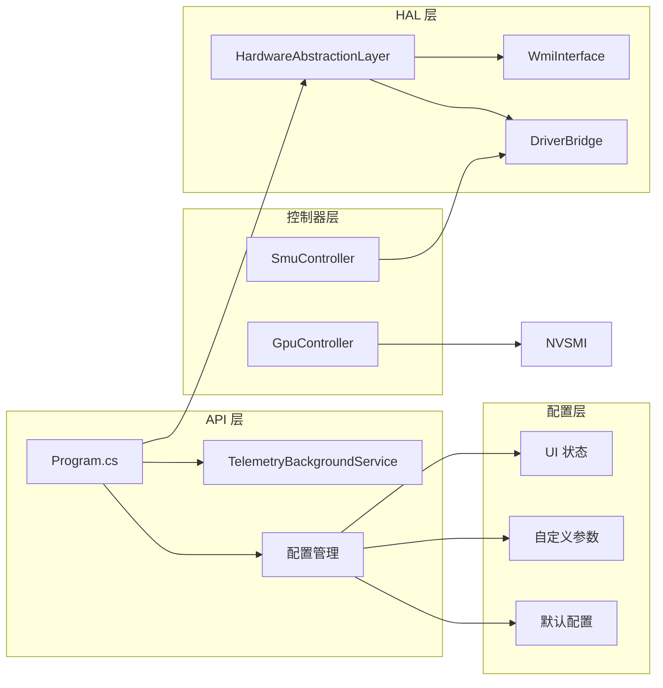

# API接口扩展

<cite>
**本文档引用的文件**
- [Douzhanzhe.API.csproj](file://server/api/Douzhanzhe.API.csproj)
- [Program.cs](file://server/api/Program.cs)
- [WmiInterface.cs](file://server/api/WmiInterface.cs)
- [TelemetryBackgroundService.cs](file://server/api/TelemetryBackgroundService.cs)
- [appsettings.json](file://server/api/appsettings.json)
- [appsettings.Development.json](file://server/api/appsettings.Development.json)
- [Douzhanzhe.API.http](file://server/api/Douzhanzhe.API.http)
- [Douzhanzhe.HAL.csproj](file://server/hal/Douzhanzhe.HAL.csproj)
- [HardwareAbstractionLayer.cs](file://server/hal/HardwareAbstractionLayer.cs)
- [DriverBridge.cs](file://server/hal/DriverBridge.cs)
- [GpuController.cs](file://server/hal/GpuController.cs)
- [SmuController.cs](file://server/hal/SmuController.cs)
- [dev-api.md](file://docs/dev-api.md)
- [dev-architecture.md](file://docs/dev-architecture.md)
- [dev-backend.md](file://docs/dev-backend.md)
- [dashboard-default.json](file://server/config/dashboard-default.json)
</cite>

## 目录
1. [简介](#简介)
2. [项目结构](#项目结构)
3. [核心组件](#核心组件)
4. [架构概览](#架构概览)
5. [详细组件分析](#详细组件分析)
6. [依赖关系分析](#依赖关系分析)
7. [性能考虑](#性能考虑)
8. [故障排除指南](#故障排除指南)
9. [结论](#结论)
10. [附录](#附录)

## 简介

Douzhanzhe-Control 是一个基于 .NET 8 的硬件控制和监控系统，采用 C# HAL（硬件抽象层）架构设计。该系统提供了完整的 API 接口扩展机制，支持 RESTful API 和 WebSocket 实时通信，能够对笔记本电脑的硬件进行深度控制和监控。

系统的核心特点包括：
- **模块化架构**：清晰的分层设计，便于扩展和维护
- **实时监控**：通过 WebSocket 提供 250ms 轮询的硬件状态推送
- **硬件控制**：支持 CPU、GPU、风扇、键盘背光等多种硬件控制
- **跨平台兼容**：基于 Windows 内核驱动的硬件访问
- **配置持久化**：支持用户界面状态和自定义参数的持久化存储

## 项目结构

项目采用典型的三层架构设计，主要分为 API 层、HAL 层和配置层：



**图表来源**
- [Program.cs:1-783](file://server/api/Program.cs#L1-L783)
- [HardwareAbstractionLayer.cs:1-772](file://server/hal/HardwareAbstractionLayer.cs#L1-L772)
- [WmiInterface.cs:1-210](file://server/api/WmiInterface.cs#L1-L210)

**章节来源**
- [dev-architecture.md:1-120](file://docs/dev-architecture.md#L1-L120)
- [Douzhanzhe.API.csproj:1-40](file://server/api/Douzhanzhe.API.csproj#L1-L40)

## 核心组件

### API 层组件

API 层是系统的入口点，负责处理 HTTP 请求和 WebSocket 连接。主要组件包括：

#### 主程序入口
- **Program.cs**：包含所有 API 端点定义和 WebSocket 处理逻辑
- 支持 CORS 配置，允许任意来源访问
- 集成了静态文件服务和路由映射

#### WebSocket 服务
- **TelemetryBackgroundService.cs**：后台遥测服务，每 250ms 推送硬件状态
- 支持多客户端连接管理
- 实现了线程安全的客户端列表管理

#### 配置管理
- **appsettings.json**：生产环境配置
- **appsettings.Development.json**：开发环境配置
- 支持 JSON 配置文件的读写操作

**章节来源**
- [Program.cs:1-783](file://server/api/Program.cs#L1-L783)
- [TelemetryBackgroundService.cs:1-143](file://server/api/TelemetryBackgroundService.cs#L1-L143)
- [appsettings.json:1-10](file://server/api/appsettings.json#L1-L10)

### HAL 层组件

HAL 层提供了硬件抽象和控制功能，是系统的核心逻辑层。

#### 硬件抽象层
- **HardwareAbstractionLayer.cs**：将底层硬件寄存器映射为语义化属性
- 提供温度、风扇、内存、磁盘等硬件状态的统一访问接口
- 实现了电源管理和散热模式控制

#### 驱动桥接层
- **DriverBridge.cs**：inpoutx64 驱动的线程安全封装
- 提供物理内存读写、IO 端口访问、EC 寄存器协议支持
- 实现了硬件访问的统一接口

#### WMI 接口层
- **WmiInterface.cs**：WMI ACPI MICommonInterface 的封装
- 提供系统开关控制（GPU 模式、Fn 锁、触摸板锁等）
- 支持风扇控制的 Bellator 协议

#### 控制器层
- **SmuController.cs**：AMD SMU 控制器，通过 ryzenadj.exe 子进程实现
- **GpuController.cs**：NVIDIA GPU 控制器，通过 nvidia-smi 子进程实现

**章节来源**
- [HardwareAbstractionLayer.cs:1-772](file://server/hal/HardwareAbstractionLayer.cs#L1-L772)
- [DriverBridge.cs:1-150](file://server/hal/DriverBridge.cs#L1-L150)
- [WmiInterface.cs:1-210](file://server/api/WmiInterface.cs#L1-L210)
- [SmuController.cs:1-142](file://server/hal/SmuController.cs#L1-L142)
- [GpuController.cs:1-116](file://server/hal/GpuController.cs#L1-L116)

## 架构概览

系统采用分层架构设计，实现了关注点分离和模块化组织：



**图表来源**
- [dev-architecture.md:1-120](file://docs/dev-architecture.md#L1-L120)
- [Program.cs:1-783](file://server/api/Program.cs#L1-L783)

### 数据流架构

系统的数据流分为两个主要方向：

#### 遥测数据流


#### 控制数据流


**图表来源**
- [TelemetryBackgroundService.cs:54-141](file://server/api/TelemetryBackgroundService.cs#L54-L141)
- [Program.cs:144-202](file://server/api/Program.cs#L144-L202)

## 详细组件分析

### RESTful API 扩展机制

#### 端点注册和路由

系统采用 .NET 8 Minimal API 模式，通过 `app.Map` 方法注册各种端点：



**图表来源**
- [Program.cs:87-584](file://server/api/Program.cs#L87-L584)

#### 请求响应格式定义

系统使用 System.Text.Json 进行序列化，支持驼峰命名约定：



**图表来源**
- [Program.cs:726-782](file://server/api/Program.cs#L726-L782)

#### 中间件集成

系统集成了多种中间件来增强功能：

| 中间件类型 | 功能 | 配置位置 |
|-----------|------|----------|
| CORS | 跨域资源共享 | Line 15-16 |
| StaticFiles | 静态文件服务 | Line 20-21 |
| Authentication | 身份验证 | 未启用 |
| Authorization | 授权控制 | 未启用 |

**章节来源**
- [Program.cs:15-22](file://server/api/Program.cs#L15-L22)

### WebSocket 通信扩展

#### 连接管理

WebSocket 服务实现了完整的连接生命周期管理：



**图表来源**
- [Program.cs:56-86](file://server/api/Program.cs#L56-L86)
- [TelemetryBackgroundService.cs:42-52](file://server/api/TelemetryBackgroundService.cs#L42-L52)

#### 实时数据传输

遥测数据通过 WebSocket 实时推送，包含 28 个硬件状态字段：

| 数据类别 | 字段数量 | 更新频率 | 说明 |
|----------|----------|----------|------|
| CPU 状态 | 4 | 250ms | 占用率、温度、频率、核心数 |
| GPU 状态 | 5 | 250ms | 占用率、温度、频率、显存、显存使用 |
| 风扇状态 | 4 | 250ms | 大风扇、小风扇 RPM，最大值 |
| 内存状态 | 3 | 250ms | 使用率、总容量、频率 |
| 磁盘状态 | 3 | 250ms | 使用率、总容量、剩余容量 |
| 系统状态 | 6 | 250ms | 键盘背光、锁状态、散热模式、电源计划 |
| 时间戳 | 1 | 250ms | 本地时间 |

**章节来源**
- [TelemetryBackgroundService.cs:70-102](file://server/api/TelemetryBackgroundService.cs#L70-L102)

### 硬件控制扩展

#### 控制器架构

系统通过控制器模式实现硬件控制的统一接口：



**图表来源**
- [SmuController.cs:12-142](file://server/hal/SmuController.cs#L12-L142)
- [GpuController.cs:10-116](file://server/hal/GpuController.cs#L10-L116)
- [WmiInterface.cs:18-210](file://server/api/WmiInterface.cs#L18-L210)

#### 扩展新硬件控制

要扩展新的硬件控制功能，需要遵循以下步骤：

1. **创建控制器类**：继承基础控制器接口或实现相应功能
2. **添加 API 端点**：在 Program.cs 中注册新的 HTTP 端点
3. **实现业务逻辑**：在控制器中实现具体的硬件操作
4. **添加配置支持**：如果需要持久化配置，添加相应的 JSON 模型
5. **测试和验证**：编写单元测试和集成测试

**章节来源**
- [Program.cs:238-286](file://server/api/Program.cs#L238-L286)
- [HardwareAbstractionLayer.cs:1-772](file://server/hal/HardwareAbstractionLayer.cs#L1-L772)

## 依赖关系分析

### 外部依赖

系统的主要外部依赖包括：



**图表来源**
- [Douzhanzhe.API.csproj:12-33](file://server/api/Douzhanzhe.API.csproj#L12-L33)
- [DriverBridge.cs:1-150](file://server/hal/DriverBridge.cs#L1-L150)

### 内部模块依赖



**图表来源**
- [Program.cs:1-14](file://server/api/Program.cs#L1-L14)
- [HardwareAbstractionLayer.cs:1-54](file://server/hal/HardwareAbstractionLayer.cs#L1-L54)

**章节来源**
- [Douzhanzhe.HAL.csproj:1-18](file://server/hal/Douzhanzhe.HAL.csproj#L1-L18)
- [dev-backend.md:1-323](file://docs/dev-backend.md#L1-L323)

## 性能考虑

### 硬件访问优化

系统在硬件访问方面采用了多项优化措施：

#### 缓存策略
- **遥测缓存**：硬件状态数据按不同粒度缓存，减少频繁的硬件访问
- **系统信息缓存**：系统信息每 10 秒更新一次，避免频繁的 PowerShell 调用
- **GPU 状态缓存**：GPU 数据每 2 秒更新一次，防止 nvidia-smi 过度调用

#### 并发控制
- **线程安全**：所有硬件访问都通过 DriverBridge 的线程安全封装
- **客户端管理**：WebSocket 客户端列表使用锁机制保证线程安全
- **异步处理**：所有硬件操作都是异步执行，避免阻塞主线程

#### 资源管理
- **驱动初始化**：驱动桥接器只初始化一次，避免重复的硬件访问
- **进程池**：子进程（ryzenadj.exe、nvidia-smi）使用进程池管理
- **内存管理**：及时释放硬件访问产生的临时对象

### 网络性能优化

#### WebSocket 优化
- **全量推送**：为了简化客户端逻辑，采用全量推送而非增量更新
- **批量发送**：将多个客户端的消息合并发送，减少网络开销
- **连接池**：管理 WebSocket 连接池，避免频繁的连接建立和销毁

#### API 性能
- **JSON 序列化**：使用 System.Text.Json 进行高效的 JSON 序列化
- **响应压缩**：可以考虑添加 Gzip 压缩中间件
- **缓存头**：静态文件使用适当的缓存头

**章节来源**
- [TelemetryBackgroundService.cs:54-141](file://server/api/TelemetryBackgroundService.cs#L54-L141)
- [HardwareAbstractionLayer.cs:576-747](file://server/hal/HardwareAbstractionLayer.cs#L576-L747)

## 故障排除指南

### 常见问题诊断

#### 硬件访问失败

**症状**：API 返回硬件不可用或操作失败
**原因**：
- inpoutx64 驱动未正确加载
- 程序未以管理员权限运行
- 硬件寄存器地址不正确

**解决方案**：
1. 确保以管理员权限运行 API 程序
2. 检查 inpoutx64.sys 是否存在于工具目录
3. 验证硬件寄存器地址映射是否正确

#### WebSocket 连接问题

**症状**：前端无法连接到 /ws 端点
**原因**：
- WebSocket 中间件未正确配置
- 防火墙阻止连接
- 客户端 URL 错误

**解决方案**：
1. 确保 UseWebSockets() 在 UseRouting() 之前调用
2. 检查防火墙设置
3. 验证前端连接 URL 为 ws://127.0.0.1:3100/ws

#### 配置文件读写失败

**症状**：配置持久化操作失败
**原因**：
- 配置目录权限不足
- JSON 格式错误
- 文件被其他进程锁定

**解决方案**：
1. 确保 API 程序有写入配置目录的权限
2. 验证 JSON 格式的正确性
3. 关闭可能锁定配置文件的其他进程

### 调试工具

系统提供了内置的调试界面，可以通过访问 `/debug` 端点进行功能测试：

#### 调试界面功能
- **硬件控制测试**：通过按钮和滑块测试各种硬件控制功能
- **遥测可视化**：实时显示硬件状态变化
- **命令测试**：测试 WMI 原始命令和 EC 寄存器访问
- **连接状态**：显示 WebSocket 连接状态和错误信息

**章节来源**
- [Program.cs:687-691](file://server/api/Program.cs#L687-L691)

## 结论

Douzhanzhe-Control 提供了一个完整且可扩展的 API 接口框架，具有以下优势：

### 架构优势
- **模块化设计**：清晰的分层架构便于维护和扩展
- **硬件抽象**：通过 HAL 层实现硬件无关的业务逻辑
- **实时通信**：WebSocket 提供高效的实时数据传输
- **配置持久化**：支持用户界面状态和自定义参数的持久化

### 扩展能力
- **API 端点扩展**：通过简单的 Map 方法注册新端点
- **硬件控制扩展**：通过控制器模式轻松添加新的硬件支持
- **中间件集成**：支持认证、授权、日志等中间件的集成
- **配置管理**：提供灵活的配置文件管理系统

### 最佳实践
- **错误处理**：完善的异常处理和错误响应机制
- **性能优化**：合理的缓存策略和并发控制
- **安全性**：CORS 配置和基本的身份验证支持
- **可维护性**：清晰的代码结构和详细的文档

该系统为硬件控制和监控应用提供了一个坚实的基础，开发者可以在此基础上快速构建复杂的硬件管理功能。

## 附录

### API 设计示例

#### 新增硬件控制端点示例

```csharp
// 1. 创建请求模型
public record NewHardwareRequest(
    [property: JsonPropertyName("target")] string Target,
    [property: JsonPropertyName("value")] int Value
);

// 2. 添加 API 端点
app.MapPost("/api/new-hardware", (NewHardwareRequest req, HardwareAbstractionLayer hal) =>
{
    try
    {
        switch (req.Target)
        {
            case "new_feature":
                // 实现新功能
                break;
            default:
                return Results.Problem($"未知目标: {req.Target}", statusCode: 400);
        }
        return Results.Ok(new { ok = true });
    }
    catch (Exception ex)
    {
        return Results.Problem(ex.Message, statusCode: 500);
    }
});
```

#### WebSocket 消息类型定义

```csharp
// 遥测消息结构
public record TelemetryMessage
{
    public int cpuUsage { get; set; }
    public int cpuTemp { get; set; }
    public float cpuFreq { get; set; }
    public int gpuUsage { get; set; }
    public int gpuTemp { get; set; }
    public float gpuFreq { get; set; }
    // ... 更多字段
    public string timestamp { get; set; }
}

// 控制响应消息结构
public record ControlResponse
{
    public bool ok { get; set; }
    public string message { get; set; }
}
```

### 测试方法

#### 单元测试
- **控制器测试**：使用 Mock 对象测试业务逻辑
- **硬件访问测试**：通过模拟驱动桥接器测试硬件交互
- **API 端点测试**：使用 TestServer 测试 HTTP 端点

#### 集成测试
- **端到端测试**：测试完整的硬件控制流程
- **WebSocket 测试**：验证实时数据传输功能
- **性能测试**：测试高并发场景下的系统表现

#### 配置测试
- **JSON 序列化测试**：验证配置文件的读写功能
- **持久化测试**：测试配置的持久化和恢复
- **边界条件测试**：测试配置文件的各种边界情况

### 性能优化建议

#### 硬件访问优化
- **批量操作**：将多个硬件操作合并为批量操作
- **异步处理**：使用异步方法避免阻塞
- **连接复用**：复用硬件访问连接减少开销

#### 网络优化
- **消息压缩**：对大量数据进行压缩传输
- **连接池**：管理 WebSocket 连接池
- **流量控制**：实现流量控制防止过载

#### 内存优化
- **对象池**：使用对象池减少垃圾回收
- **内存映射**：对大对象使用内存映射
- **及时释放**：确保资源及时释放