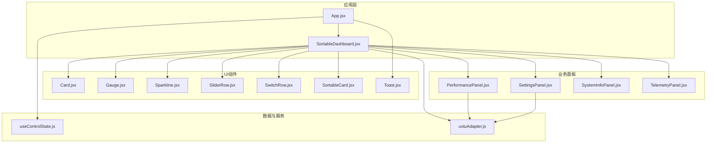
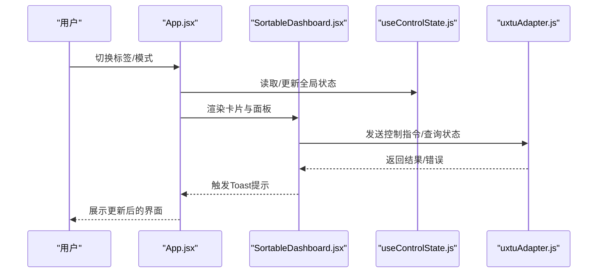
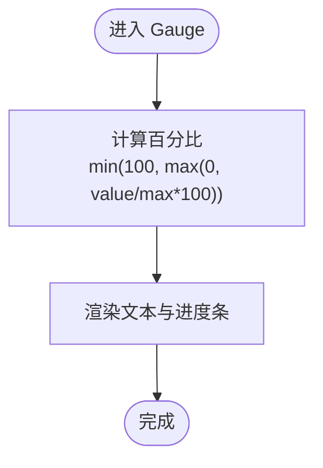
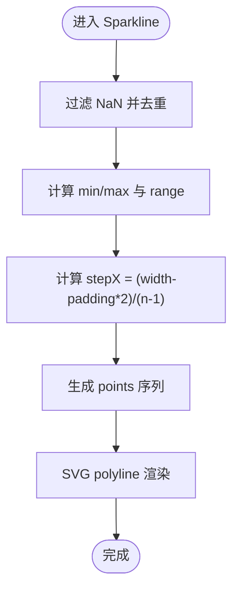
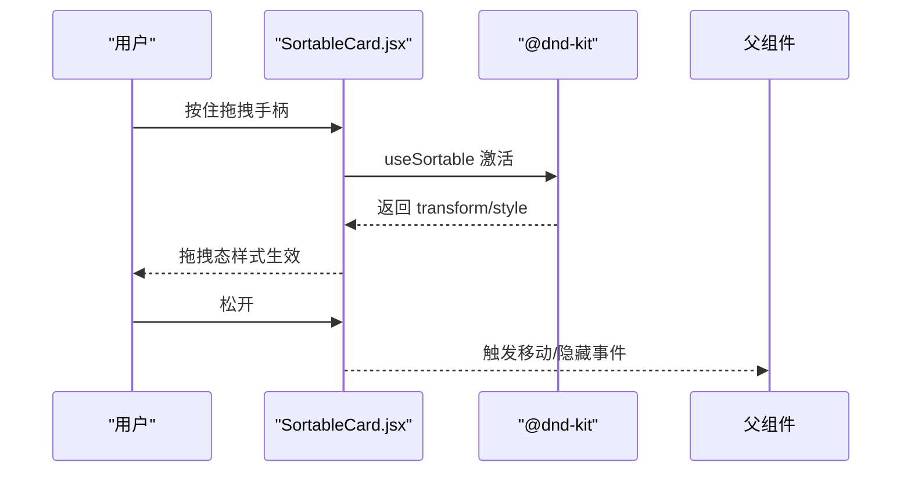
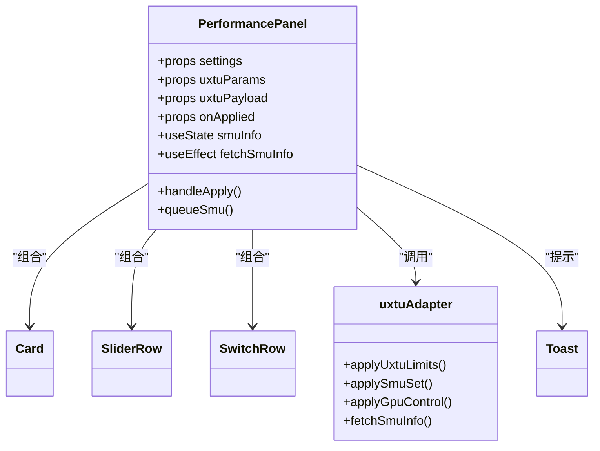
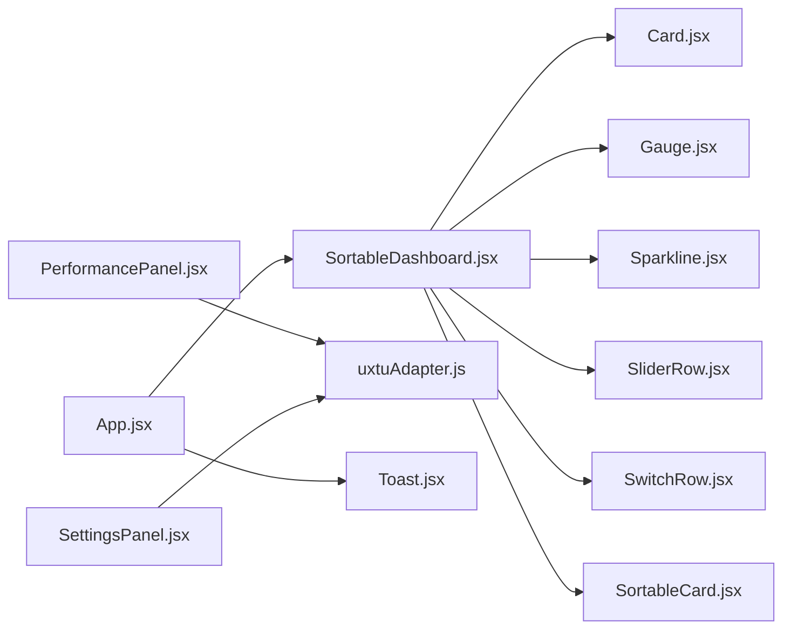

# UI组件扩展

<cite>
**本文引用的文件**
- [src/components/ui/Gauge.jsx](file://src/components/ui/Gauge.jsx)
- [src/components/ui/Sparkline.jsx](file://src/components/ui/Sparkline.jsx)
- [src/components/ui/Card.jsx](file://src/components/ui/Card.jsx)
- [src/components/ui/SliderRow.jsx](file://src/components/ui/SliderRow.jsx)
- [src/components/ui/SwitchRow.jsx](file://src/components/ui/SwitchRow.jsx)
- [src/components/ui/SortableCard.jsx](file://src/components/ui/SortableCard.jsx)
- [src/components/ui/Toast.jsx](file://src/components/ui/Toast.jsx)
- [src/components/SortableDashboard.jsx](file://src/components/SortableDashboard.jsx)
- [src/components/panels/PerformancePanel.jsx](file://src/components/panels/PerformancePanel.jsx)
- [src/components/panels/SettingsPanel.jsx](file://src/components/panels/SettingsPanel.jsx)
- [src/components/panels/SystemInfoPanel.jsx](file://src/components/panels/SystemInfoPanel.jsx)
- [src/components/panels/TelemetryPanel.jsx](file://src/components/panels/TelemetryPanel.jsx)
- [src/services/uxtuAdapter.js](file://src/services/uxtuAdapter.js)
- [src/hooks/useControlState.js](file://src/hooks/useControlState.js)
- [src/App.jsx](file://src/App.jsx)
- [package.json](file://package.json)
- [tailwind.config.js](file://tailwind.config.js)
- [src/data/themes.js](file://src/data/themes.js)
</cite>

## 目录
1. [简介](#简介)
2. [项目结构](#项目结构)
3. [核心组件](#核心组件)
4. [架构总览](#架构总览)
5. [组件详解与扩展指南](#组件详解与扩展指南)
6. [依赖关系分析](#依赖关系分析)
7. [性能与响应式设计](#性能与响应式设计)
8. [故障排查](#故障排查)
9. [结论](#结论)
10. [附录](#附录)

## 简介
本指南面向希望在现有前端框架基础上进行UI组件扩展与定制的开发者。文档聚焦于以下目标：
- 解释现有UI组件的设计模式与扩展机制（如Gauge仪表、Sparkline图表、可拖拽卡片等）
- 提供新面板组件的开发方法与现有组件的定制化路径
- 阐述数据绑定、样式定制与交互行为的修改方式
- 给出从设计到集成测试的完整流程，包含性能优化与响应式设计建议
- 提供可直接定位到源码的路径指引与最佳实践

## 项目结构
前端采用React + TailwindCSS + Vite构建，组件按职责分为：
- UI基础组件：Card、Gauge、Sparkline、SliderRow、SwitchRow、SortableCard、Toast
- 业务面板：PerformancePanel、SettingsPanel、SystemInfoPanel、TelemetryPanel
- 布局与编排：SortableDashboard（拖拽布局）、App（路由与主题）
- 数据与状态：useControlState（全局状态与遥测模拟）、uxtuAdapter（后端适配）
- 主题与样式：themes.js（主题列表）、tailwind.config.js（动画扩展）

**图表来源**
- [src/App.jsx:1-134](file://src/App.jsx#L1-L134)
- [src/components/SortableDashboard.jsx:1-247](file://src/components/SortableDashboard.jsx#L1-L247)
- [src/components/ui/Card.jsx:1-18](file://src/components/ui/Card.jsx#L1-L18)
- [src/components/ui/Gauge.jsx:1-21](file://src/components/ui/Gauge.jsx#L1-L21)
- [src/components/ui/Sparkline.jsx:1-40](file://src/components/ui/Sparkline.jsx#L1-L40)
- [src/components/ui/SliderRow.jsx:1-23](file://src/components/ui/SliderRow.jsx#L1-L23)
- [src/components/ui/SwitchRow.jsx:1-21](file://src/components/ui/SwitchRow.jsx#L1-L21)
- [src/components/ui/SortableCard.jsx:1-43](file://src/components/ui/SortableCard.jsx#L1-L43)
- [src/components/ui/Toast.jsx:1-50](file://src/components/ui/Toast.jsx#L1-L50)
- [src/components/panels/PerformancePanel.jsx:1-213](file://src/components/panels/PerformancePanel.jsx#L1-L213)
- [src/components/panels/SettingsPanel.jsx:1-124](file://src/components/panels/SettingsPanel.jsx#L1-L124)
- [src/components/panels/SystemInfoPanel.jsx:1-59](file://src/components/panels/SystemInfoPanel.jsx#L1-L59)
- [src/components/panels/TelemetryPanel.jsx:1-121](file://src/components/panels/TelemetryPanel.jsx#L1-L121)
- [src/services/uxtuAdapter.js:1-130](file://src/services/uxtuAdapter.js#L1-L130)
- [src/hooks/useControlState.js:1-355](file://src/hooks/useControlState.js#L1-L355)

**章节来源**
- [src/App.jsx:1-134](file://src/App.jsx#L1-L134)
- [src/components/SortableDashboard.jsx:1-247](file://src/components/SortableDashboard.jsx#L1-L247)
- [package.json:1-33](file://package.json#L1-L33)
- [tailwind.config.js:1-12](file://tailwind.config.js#L1-L12)

## 核心组件
本项目的核心UI组件遵循“可组合、可插拔”的设计原则，通过props注入数据与行为，配合TailwindCSS变量实现主题化样式。

- 卡片容器：Card.jsx
  - 职责：统一卡片外观、标题与操作区
  - 关键点：支持className/bodyClassName扩展；使用CSS变量实现主题色
  - 适用场景：所有面板与监控卡片的基础容器

- 仪表组件：Gauge.jsx
  - 职责：展示单指标（占用率/温度/频率等）与百分比进度条
  - 关键点：value/max计算百分比；color/unit可定制；响应式宽度
  - 扩展建议：增加阈值高亮、单位换算、动画过渡

- 折线图组件：Sparkline.jsx
  - 职责：绘制简明趋势折线，支持颜色与标题
  - 关键点：buildPoints归一化处理；SVG polyline渲染；padding与尺寸常量
  - 扩展建议：支持多系列、动态缩放、交互提示

- 拖拽卡片：SortableCard.jsx
  - 职责：为任意子内容提供拖拽排序与隐藏能力
  - 关键点：@dnd-kit集成；拖拽态样式；编辑模式下的操作按钮
  - 扩展建议：支持分组、拖拽禁用、批量操作

- 行级控件：SliderRow.jsx、SwitchRow.jsx
  - 职责：提供滑块与开关两类输入控件
  - 关键点：label/value/min/max/step/unit/disabled；onChange回调
  - 扩展建议：支持格式化显示、范围提示、联动校验

- 通知系统：Toast.jsx
  - 职责：全局消息提示（成功/错误/信息）
  - 关键点：上下文提供者；定时自动消失；点击移除
  - 扩展建议：支持队列、类型图标、静音策略

**章节来源**
- [src/components/ui/Card.jsx:1-18](file://src/components/ui/Card.jsx#L1-L18)
- [src/components/ui/Gauge.jsx:1-21](file://src/components/ui/Gauge.jsx#L1-L21)
- [src/components/ui/Sparkline.jsx:1-40](file://src/components/ui/Sparkline.jsx#L1-L40)
- [src/components/ui/SliderRow.jsx:1-23](file://src/components/ui/SliderRow.jsx#L1-L23)
- [src/components/ui/SwitchRow.jsx:1-21](file://src/components/ui/SwitchRow.jsx#L1-L21)
- [src/components/ui/SortableCard.jsx:1-43](file://src/components/ui/SortableCard.jsx#L1-L43)
- [src/components/ui/Toast.jsx:1-50](file://src/components/ui/Toast.jsx#L1-L50)

## 架构总览
应用通过App.jsx组织导航、主题与主面板；SortableDashboard负责布局与卡片编排；各面板组件通过useControlState与uxtuAdapter消费状态与后端服务。

**图表来源**
- [src/App.jsx:1-134](file://src/App.jsx#L1-L134)
- [src/components/SortableDashboard.jsx:1-247](file://src/components/SortableDashboard.jsx#L1-L247)
- [src/hooks/useControlState.js:1-355](file://src/hooks/useControlState.js#L1-L355)
- [src/services/uxtuAdapter.js:1-130](file://src/services/uxtuAdapter.js#L1-L130)

## 组件详解与扩展指南

### Gauge 仪表扩展
- 设计要点
  - props解耦：label、value、unit、color、max
  - 百分比计算与边界保护
  - 使用CSS变量实现主题色与背景色
- 扩展接口
  - 新增阈值高亮：基于value与阈值数组，动态切换color或添加装饰
  - 单位换算：unit映射（如MHz→GHz），displayValue格式化
  - 动画过渡：transition-duration与ease-in-out，结合max变化
- 最佳实践
  - 保持max非负且大于0，避免除零
  - 使用相对单位（%）保证响应式
  - 在父组件中集中管理color与unit，减少重复逻辑

**图表来源**
- [src/components/ui/Gauge.jsx:1-21](file://src/components/ui/Gauge.jsx#L1-L21)

**章节来源**
- [src/components/ui/Gauge.jsx:1-21](file://src/components/ui/Gauge.jsx#L1-L21)

### Sparkline 图表扩展
- 设计要点
  - 归一化算法：过滤NaN、计算min/max、按索引均匀分布x坐标
  - SVG polyline：points字符串拼接，strokeWidth与圆角
  - padding与固定尺寸：确保曲线紧凑且不溢出
- 扩展接口
  - 多系列：data为二维数组，逐条绘制polyline
  - 缩放与平移：支持滚动/缩放手势（可选）
  - 交互提示：hover显示数值、点击跳转详情
- 最佳实践
  - 预过滤无效数据，避免NaN导致断点
  - 固定宽高与padding，保证不同数据密度下的视觉一致性
  - 颜色与主题一致化，优先使用CSS变量

**图表来源**
- [src/components/ui/Sparkline.jsx:1-40](file://src/components/ui/Sparkline.jsx#L1-L40)

**章节来源**
- [src/components/ui/Sparkline.jsx:1-40](file://src/components/ui/Sparkline.jsx#L1-L40)

### 可拖拽卡片 SortableCard
- 设计要点
  - @dnd-kit集成：useSortable提供拖拽状态与样式
  - 编辑模式：显示拖拽手柄与隐藏按钮
  - 拖拽态样式：transform/transition/opacity/z-index
- 扩展接口
  - 分组拖拽：sortableContext指定group
  - 禁用拖拽：根据条件设置disabled
  - 批量操作：选中多个卡片执行统一动作
- 最佳实践
  - 保持id唯一性，避免拖拽冲突
  - 在父组件中集中处理moveCard/toggleHidden逻辑

**图表来源**
- [src/components/ui/SortableCard.jsx:1-43](file://src/components/ui/SortableCard.jsx#L1-L43)

**章节来源**
- [src/components/ui/SortableCard.jsx:1-43](file://src/components/ui/SortableCard.jsx#L1-L43)

### 行级控件 SliderRow 与 SwitchRow
- 设计要点
  - SliderRow：label/value/min/max/step/unit/displayValue/disabled
  - SwitchRow：label/checked/onToggle
- 扩展接口
  - SliderRow：支持自定义displayValue格式、联动更新、校验提示
  - SwitchRow：支持禁用态、图标/文案切换
- 最佳实践
  - onChange统一转换为Number（SliderRow）
  - 使用CSS变量控制边框与背景，保持与主题一致

**章节来源**
- [src/components/ui/SliderRow.jsx:1-23](file://src/components/ui/SliderRow.jsx#L1-L23)
- [src/components/ui/SwitchRow.jsx:1-21](file://src/components/ui/SwitchRow.jsx#L1-L21)

### 通知系统 Toast
- 设计要点
  - 上下文提供者：ToastProvider管理队列与生命周期
  - 动画：slide-up；点击移除
  - 类型区分：success/error/info
- 扩展接口
  - 支持定时器清理、手动移除、静音策略
  - 队列管理：去重、优先级
- 最佳实践
  - 错误与成功提示分离，避免滥用
  - 控制时长与数量，防止遮挡重要信息

**章节来源**
- [src/components/ui/Toast.jsx:1-50](file://src/components/ui/Toast.jsx#L1-L50)

### 面板组件开发流程（以PerformancePanel为例）
- 设计阶段
  - 明确数据域：CPU/GPU参数、电源计划、SMU控制
  - 定义props：settings/uxtuParams/uxtuPayload/onApplied
- 实现阶段
  - 使用Card/SilderRow/SwitchRow组合
  - 通过uxtuAdapter发起后端调用
  - 使用Toast反馈结果
- 集成阶段
  - 在SortableDashboard中注册卡片ID
  - 在App中挂载到对应标签页
- 测试与验证
  - 单元测试：参数变更→payload构造→调用链路
  - 端到端：后端可用/不可用两种模式下的行为
- 性能与响应式
  - 防抖/节流：applySmu/applyGpuControl
  - 响应式布局：Grid/Column断点

**图表来源**
- [src/components/panels/PerformancePanel.jsx:1-213](file://src/components/panels/PerformancePanel.jsx#L1-L213)
- [src/services/uxtuAdapter.js:1-130](file://src/services/uxtuAdapter.js#L1-L130)
- [src/components/ui/Card.jsx:1-18](file://src/components/ui/Card.jsx#L1-L18)
- [src/components/ui/SliderRow.jsx:1-23](file://src/components/ui/SliderRow.jsx#L1-L23)
- [src/components/ui/SwitchRow.jsx:1-21](file://src/components/ui/SwitchRow.jsx#L1-L21)
- [src/components/ui/Toast.jsx:1-50](file://src/components/ui/Toast.jsx#L1-L50)

**章节来源**
- [src/components/panels/PerformancePanel.jsx:1-213](file://src/components/panels/PerformancePanel.jsx#L1-L213)
- [src/services/uxtuAdapter.js:1-130](file://src/services/uxtuAdapter.js#L1-L130)

### 新面板组件开发步骤
- 步骤1：确定数据与交互
  - 明确需要的props（如settings/telemetry/uxtuParams）
  - 识别依赖的服务（如applyGpuControl/applyHardwareControl）
- 步骤2：编写组件骨架
  - 使用Card/SilderRow/SwitchRow等基础组件
  - 通过Toast提供反馈
- 步骤3：接入状态与服务
  - 在useControlState中维护状态
  - 在uxtuAdapter中封装后端调用
- 步骤4：在布局中注册
  - 在SortableDashboard的卡片映射中注册ID与渲染函数
  - 在App中挂载到目标标签页
- 步骤5：测试与优化
  - 单元测试：参数变更→调用链路
  - 集成测试：后端可用/不可用、网络异常
  - 性能：防抖/节流、虚拟滚动（如数据量大）

**章节来源**
- [src/components/SortableDashboard.jsx:1-247](file://src/components/SortableDashboard.jsx#L1-L247)
- [src/hooks/useControlState.js:1-355](file://src/hooks/useControlState.js#L1-L355)
- [src/services/uxtuAdapter.js:1-130](file://src/services/uxtuAdapter.js#L1-L130)

## 依赖关系分析
- 组件间依赖
  - SortableDashboard依赖Card/Gauge/Sparkline/SliderRow/SwitchRow/SortableCard
  - 面板组件依赖基础UI与uxtuAdapter
  - App依赖主题切换与全局状态
- 外部依赖
  - @dnd-kit：拖拽能力
  - react/react-dom：运行时
  - tailwindcss：样式与动画
- 循环依赖
  - 未发现循环导入；组件通过props与上下文传递数据

**图表来源**
- [src/components/SortableDashboard.jsx:1-247](file://src/components/SortableDashboard.jsx#L1-L247)
- [src/components/ui/Card.jsx:1-18](file://src/components/ui/Card.jsx#L1-L18)
- [src/components/ui/Gauge.jsx:1-21](file://src/components/ui/Gauge.jsx#L1-L21)
- [src/components/ui/Sparkline.jsx:1-40](file://src/components/ui/Sparkline.jsx#L1-L40)
- [src/components/ui/SliderRow.jsx:1-23](file://src/components/ui/SliderRow.jsx#L1-L23)
- [src/components/ui/SwitchRow.jsx:1-21](file://src/components/ui/SwitchRow.jsx#L1-L21)
- [src/components/ui/SortableCard.jsx:1-43](file://src/components/ui/SortableCard.jsx#L1-L43)
- [src/components/panels/PerformancePanel.jsx:1-213](file://src/components/panels/PerformancePanel.jsx#L1-L213)
- [src/components/panels/SettingsPanel.jsx:1-124](file://src/components/panels/SettingsPanel.jsx#L1-L124)
- [src/components/ui/Toast.jsx:1-50](file://src/components/ui/Toast.jsx#L1-L50)
- [src/App.jsx:1-134](file://src/App.jsx#L1-L134)
- [src/services/uxtuAdapter.js:1-130](file://src/services/uxtuAdapter.js#L1-L130)

**章节来源**
- [package.json:1-33](file://package.json#L1-L33)

## 性能与响应式设计
- 性能优化
  - 防抖/节流：applySmuSet/applyGpuControl/风扇目标转速
  - 计算缓存：useMemo（payload构造）、useCallback（事件处理）
  - 数据截断：历史数据MAX_HISTORY，避免内存膨胀
  - 模拟数据：后端离线时使用useControlState的mock逻辑
- 响应式设计
  - Grid/Column断点：md:columns-2、lg:columns-3
  - 文字与间距：Tailwind工具类与CSS变量
  - 动画：slide-up、风扇旋转动画
- 可访问性
  - 语义化标签：label/fieldset
  - 键盘可达：按钮与滑块支持键盘操作
  - 对比度：使用CSS变量保障文本与背景对比

**章节来源**
- [src/hooks/useControlState.js:1-355](file://src/hooks/useControlState.js#L1-L355)
- [src/components/SortableDashboard.jsx:1-247](file://src/components/SortableDashboard.jsx#L1-L247)
- [tailwind.config.js:1-12](file://tailwind.config.js#L1-L12)

## 故障排查
- 后端不可用
  - 现象：遥测来自mock，风扇与目标转速缓慢趋近
  - 处理：检查WebSocket连接与HTTP接口可用性
- 控制下发失败
  - 现象：Toast提示错误
  - 处理：确认后端服务状态、权限与参数合法性
- 拖拽异常
  - 现象：拖拽无响应或样式错乱
  - 处理：检查id唯一性、@dnd-kit传感器配置
- 主题不生效
  - 现象：CSS变量未正确解析
  - 处理：确认App.jsx中主题类名同步至body

**章节来源**
- [src/hooks/useControlState.js:242-336](file://src/hooks/useControlState.js#L242-L336)
- [src/services/uxtuAdapter.js:58-71](file://src/services/uxtuAdapter.js#L58-L71)
- [src/components/ui/Toast.jsx:1-50](file://src/components/ui/Toast.jsx#L1-L50)
- [src/components/ui/SortableCard.jsx:1-43](file://src/components/ui/SortableCard.jsx#L1-L43)
- [src/App.jsx:39-40](file://src/App.jsx#L39-L40)

## 结论
本指南提供了从组件设计到扩展实现的完整路径。通过复用基础UI组件与统一的状态/服务层，开发者可以快速构建新的面板与交互。建议在扩展过程中坚持：
- 以props为中心的数据流
- 以CSS变量为主题化的统一入口
- 以防抖/节流与缓存提升性能
- 以Toast与断点测试保障体验与稳定性

## 附录
- 主题列表：见themes.js
- 依赖清单：见package.json
- Tailwind动画：见tailwind.config.js

**章节来源**
- [src/data/themes.js:1-34](file://src/data/themes.js#L1-L34)
- [package.json:1-33](file://package.json#L1-L33)
- [tailwind.config.js:1-12](file://tailwind.config.js#L1-L12)