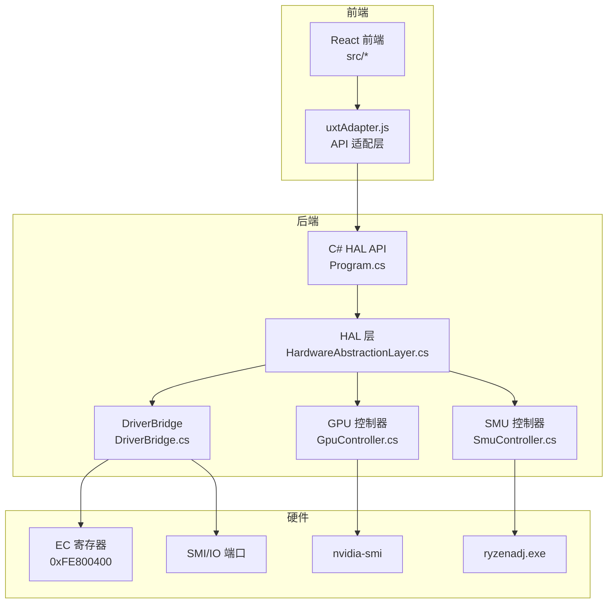
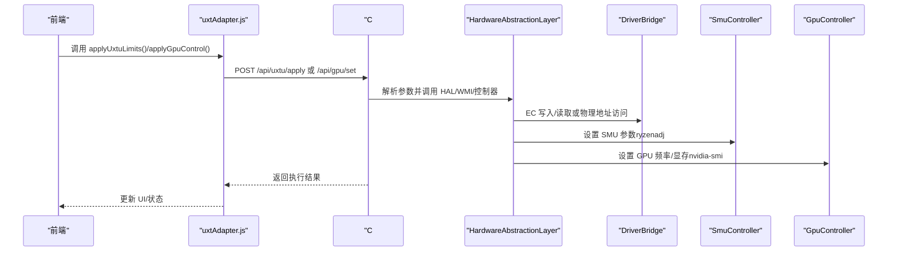
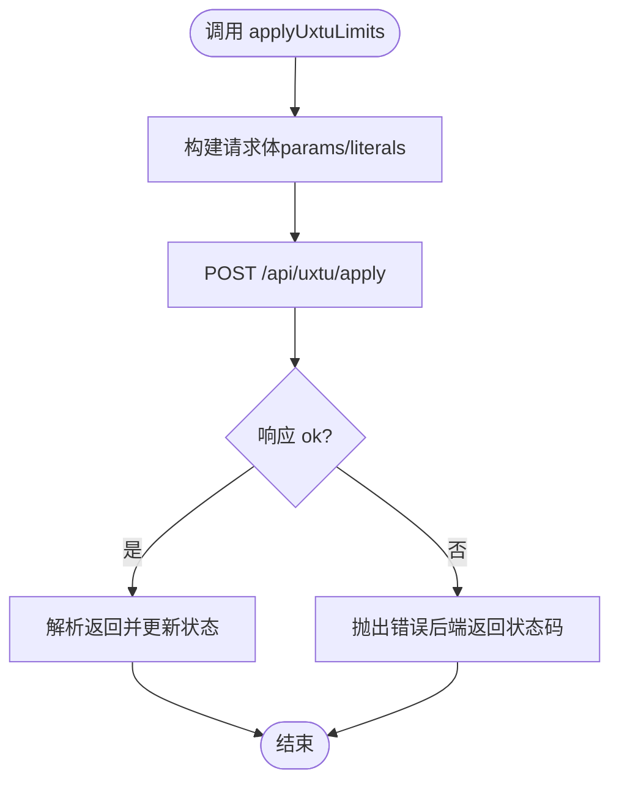
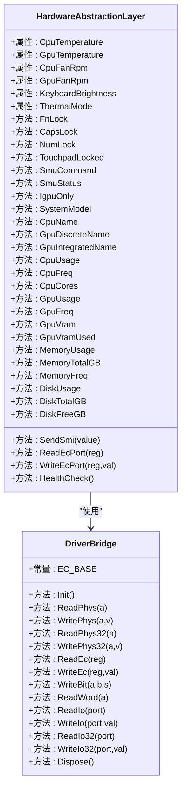
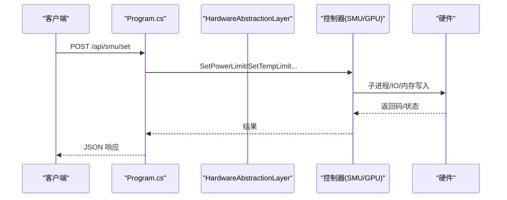
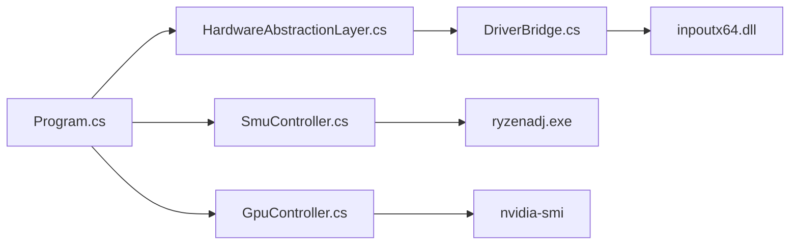

# 扩展开发

<cite>
**本文引用的文件**
- [uxtuAdapter.js](file://src/services/uxtuAdapter.js)
- [HardwareAbstractionLayer.cs](file://server/hal/HardwareAbstractionLayer.cs)
- [DriverBridge.cs](file://server/hal/DriverBridge.cs)
- [GpuController.cs](file://server/hal/GpuController.cs)
- [SmuController.cs](file://server/hal/SmuController.cs)
- [Program.cs](file://server/api/Program.cs)
- [Douzhanzhe.API.csproj](file://server/api/Douzhanzhe.API.csproj)
- [dev-architecture.md](file://docs/dev-architecture.md)
- [dev-ec-map.md](file://docs/dev-ec-map.md)
</cite>

## 目录
1. [简介](#简介)
2. [项目结构](#项目结构)
3. [核心组件](#核心组件)
4. [架构总览](#架构总览)
5. [详细组件分析](#详细组件分析)
6. [依赖关系分析](#依赖关系分析)
7. [性能考量](#性能考量)
8. [故障排查指南](#故障排查指南)
9. [结论](#结论)
10. [附录](#附录)

## 简介
本指南面向希望基于现有系统进行扩展开发的工程师，涵盖以下方向：
- 插件开发机制：硬件控制器扩展、UI 组件扩展、API 接口扩展
- uxtAdapter.js 适配器的设计原理与扩展接口：如何对接后端 HAL、如何新增参数映射与模式预设
- 硬件抽象层（HAL）扩展点：新控制器集成、EC 寄存器映射扩展、WMI/SMU/GPU 控制器接入
- 第三方集成指南：外部工具集成、API 扩展、数据交换协议
- 最佳实践、测试方法与发布流程

## 项目结构
系统采用前后端分离的“C# HAL API + 前端静态资源”的架构，前端通过 uxtAdapter.js 调用后端 API，后端通过 HAL 层统一访问硬件。

**图表来源**
- [dev-architecture.md:10-46](file://docs/dev-architecture.md#L10-L46)
- [Program.cs:1-22](file://server/api/Program.cs#L1-L22)
- [HardwareAbstractionLayer.cs:1-52](file://server/hal/HardwareAbstractionLayer.cs#L1-L52)
- [DriverBridge.cs:28-54](file://server/hal/DriverBridge.cs#L28-L54)
- [SmuController.cs:17-41](file://server/hal/SmuController.cs#L17-L41)
- [GpuController.cs:14-40](file://server/hal/GpuController.cs#L14-L40)

**章节来源**
- [dev-architecture.md:10-46](file://docs/dev-architecture.md#L10-L46)
- [Douzhanzhe.API.csproj:1-40](file://server/api/Douzhanzhe.API.csproj#L1-L40)

## 核心组件
- uxtAdapter.js：前端与后端 API 的适配层，负责将前端参数映射为后端请求，并建立遥测 WebSocket 连接。
- HAL 层：统一硬件访问入口，封装 EC 寄存器、WMI、SMU、GPU 等子系统。
- DriverBridge：底层 IO/内存映射桥接，提供 EC 协议、物理地址读写、SMI 触发等能力。
- SmuController：封装 ryzenadj.exe 子进程，提供 SMU 参数设置与探测。
- GpuController：封装 nvidia-smi 子进程，提供 GPU 频率/显存锁定与状态查询。
- Program.cs：后端 API 网关，注册 HAL、控制器、WebSocket、静态文件与持久化接口。

**章节来源**
- [uxtuAdapter.js:1-130](file://src/services/uxtuAdapter.js#L1-L130)
- [HardwareAbstractionLayer.cs:1-767](file://server/hal/HardwareAbstractionLayer.cs#L1-L767)
- [DriverBridge.cs:1-133](file://server/hal/DriverBridge.cs#L1-L133)
- [SmuController.cs:1-142](file://server/hal/SmuController.cs#L1-L142)
- [GpuController.cs:1-116](file://server/hal/GpuController.cs#L1-L116)
- [Program.cs:1-783](file://server/api/Program.cs#L1-L783)

## 架构总览
系统通过 HAL 将硬件细节抽象为统一接口，前端通过 uxtAdapter.js 调用后端 API，后端通过 DriverBridge 与硬件交互，SMU/GPU 控制器通过子进程完成特定硬件操作。

**图表来源**
- [uxtuAdapter.js:19-88](file://src/services/uxtuAdapter.js#L19-L88)
- [Program.cs:463-494](file://server/api/Program.cs#L463-L494)
- [Program.cs:396-447](file://server/api/Program.cs#L396-L447)
- [HardwareAbstractionLayer.cs:378-421](file://server/hal/HardwareAbstractionLayer.cs#L378-L421)
- [DriverBridge.cs:56-121](file://server/hal/DriverBridge.cs#L56-L121)
- [SmuController.cs:43-121](file://server/hal/SmuController.cs#L43-L121)
- [GpuController.cs:14-86](file://server/hal/GpuController.cs#L14-L86)

## 详细组件分析

### uxtAdapter.js 适配器设计与扩展
- 设计目标
  - 将前端参数映射为后端 API 请求，屏蔽 HAL 与硬件差异。
  - 提供遥测订阅（WebSocket）、风扇区间与模式预设、SMU/GPU 控制等统一接口。
- 关键映射
  - 散热模式与电源计划映射：thermalModeMap、powerPlanHALMap。
  - 模式预设与风扇区间：MODE_PRESETS、FAN_RANGES。
- 扩展接口
  - 新增后端端点时，前端在 uxtAdapter.js 中新增对应函数，并在调用处替换硬编码字符串。
  - 新增模式预设时，在 MODE_PRESETS 中追加键值，确保与后端参数保持一致。
  - 新增风扇区间时，在 FAN_RANGES 中追加键值，确保与硬件限制一致。
- 兼容性处理
  - 对后端返回状态进行校验，异常时抛出错误，便于前端捕获与提示。
  - WebSocket 断线自动重连，保证遥测持续性。

**图表来源**
- [uxtuAdapter.js:19-27](file://src/services/uxtuAdapter.js#L19-L27)
- [Program.cs:463-494](file://server/api/Program.cs#L463-L494)

**章节来源**
- [uxtuAdapter.js:1-130](file://src/services/uxtuAdapter.js#L1-L130)
- [Program.cs:463-494](file://server/api/Program.cs#L463-L494)

### HAL 硬件抽象层扩展点
- 扩展点概览
  - 新控制器集成：在 HAL 中新增属性/方法，或在 Program.cs 中注册新控制器服务。
  - EC 寄存器映射扩展：在 HAL 中新增偏移常量与读写封装，遵循现有命名与注释规范。
  - WMI/SMU/GPU 控制器接入：通过现有控制器类封装子进程或系统调用。
- 新控制器集成步骤
  - 在 HAL 中新增属性/方法，封装底层读写逻辑。
  - 在 Program.cs 中注册控制器服务并暴露 API。
  - 在 uxtAdapter.js 中新增前端调用，确保参数映射与后端一致。
- EC 寄存器映射扩展步骤
  - 在 HAL 中新增偏移常量与读写封装，明确注释来源与验证状态。
  - 若寄存器写入无效，优先使用 WritePhys(SetPhysLong) 或 WriteBit。
  - 对于只读状态寄存器，需通过 Windows API 或 WMI 替代写入。
- WMI/SMU/GPU 控制器接入
  - SMU：通过 SmuController 的子进程封装，支持功耗、温度、频率等参数设置。
  - GPU：通过 GpuController 的 nvidia-smi 封装，支持锁定/限制/重置频率与显存频率。
  - WMI：通过 Program.cs 中的 WMI 接口，实现系统级功能（如 Fn 锁、触控板锁、GPU 模式）。

**图表来源**
- [HardwareAbstractionLayer.cs:19-767](file://server/hal/HardwareAbstractionLayer.cs#L19-L767)
- [DriverBridge.cs:9-133](file://server/hal/DriverBridge.cs#L9-L133)

**章节来源**
- [HardwareAbstractionLayer.cs:1-767](file://server/hal/HardwareAbstractionLayer.cs#L1-L767)
- [DriverBridge.cs:1-133](file://server/hal/DriverBridge.cs#L1-L133)
- [dev-ec-map.md:20-72](file://docs/dev-ec-map.md#L20-L72)

### API 接口扩展与第三方集成
- API 扩展
  - 在 Program.cs 中新增路由与处理器，注入所需服务（HAL/控制器/WMI）。
  - 对外暴露 JSON 接口，支持参数校验、异常处理与状态码返回。
- 第三方集成
  - 外部工具集成：通过子进程封装（如 nvidia-smi、ryzenadj），在控制器中统一管理。
  - 数据交换协议：RESTful API + WebSocket，前端通过 uxtAdapter.js 访问。
- 兼容性与回退
  - 对于 nvidia-smi 返回异常或超时，HAL 提供回退策略（如物理内存读取、定时限制）。
  - 对于 SMU 写入后崩溃但返回码为特定值的情况，适配器按成功处理。

**图表来源**
- [Program.cs:238-274](file://server/api/Program.cs#L238-L274)
- [SmuController.cs:43-121](file://server/hal/SmuController.cs#L43-L121)

**章节来源**
- [Program.cs:238-274](file://server/api/Program.cs#L238-L274)
- [SmuController.cs:1-142](file://server/hal/SmuController.cs#L1-L142)
- [GpuController.cs:1-116](file://server/hal/GpuController.cs#L1-L116)

## 依赖关系分析
- 组件耦合
  - HAL 对 DriverBridge 有强依赖，所有 EC/IO/物理地址访问均通过 DriverBridge。
  - API 层对 HAL 与控制器有依赖，控制器之间相互独立。
- 外部依赖
  - inpoutx64.dll：EC/IO/物理地址访问的核心驱动。
  - ryzenadj.exe：SMU 参数设置。
  - nvidia-smi：GPU 频率/显存控制与状态查询。
- 循环依赖
  - 未发现循环依赖，HAL 与控制器通过 Program.cs 注册与注入解耦。

**图表来源**
- [Program.cs:1-17](file://server/api/Program.cs#L1-L17)
- [DriverBridge.cs:1-54](file://server/hal/DriverBridge.cs#L1-L54)
- [SmuController.cs:17-41](file://server/hal/SmuController.cs#L17-L41)
- [GpuController.cs:14-40](file://server/hal/GpuController.cs#L14-L40)

**章节来源**
- [Program.cs:1-17](file://server/api/Program.cs#L1-L17)
- [Douzhanzhe.API.csproj:24-25](file://server/api/Douzhanzhe.API.csproj#L24-L25)

## 性能考量
- 遥测轮询与 WebSocket
  - HAL 以约 250ms 轮询推送全量遥测，前端通过 WebSocket 接收，避免频繁轮询带来的 CPU 占用。
- 控制调用去抖
  - 前端对滑块/开关进行去抖（如 500ms），减少高频写入对硬件与驱动的压力。
- 子进程调用
  - SMU/GPU 控制通过子进程执行，建议在批量设置时合并参数，减少进程启动开销。
- 缓存与回退
  - HAL 对 nvidia-smi 与物理内存读取设置时间窗口缓存，避免重复调用。
  - 对 SMU 写入后崩溃但返回码为特定值的情况，按成功处理，提升稳定性。

[本节为通用指导，无需具体文件分析]

## 故障排查指南
- 驱动与权限
  - 必须以管理员权限运行 C# API，确保 inpoutx64 驱动加载成功。
  - 若驱动加载失败，检查 inpoutx64.dll 是否存在于输出目录。
- EC 寄存器写入无效
  - 对于部分寄存器（如风扇控制），物理写入无效时改用 WMI 或 Windows API。
  - 对于只读状态寄存器，需通过 Windows API 实现写入（如 CapsLock/NumLock）。
- nvidia-smi 与 ryzenadj
  - 若 nvidia-smi 返回异常或超时，HAL 提供回退策略；必要时检查显卡驱动与权限。
  - SMU 写入后崩溃但返回码为特定值时，视为成功处理。
- WebSocket 遥测断线
  - 前端自动重连，若长时间无法连接，检查后端服务与防火墙设置。

**章节来源**
- [dev-architecture.md:99-114](file://docs/dev-architecture.md#L99-L114)
- [dev-ec-map.md:90-120](file://docs/dev-ec-map.md#L90-L120)
- [GpuController.cs:14-40](file://server/hal/GpuController.cs#L14-L40)
- [SmuController.cs:59-65](file://server/hal/SmuController.cs#L59-L65)
- [uxtuAdapter.js:58-71](file://src/services/uxtuAdapter.js#L58-L71)

## 结论
本指南提供了从适配层到 HAL 层再到 API 层的完整扩展路径，明确了新硬件支持的添加流程、EC 寄存器映射扩展方法、第三方工具集成与数据交换协议。通过遵循本文的最佳实践与测试方法，开发者可以安全、稳定地扩展系统功能。

[本节为总结，无需具体文件分析]

## 附录

### 扩展开发最佳实践
- 参数映射与模式预设
  - 在 uxtAdapter.js 中维护映射表与预设，确保与后端一致。
- API 设计
  - 统一返回结构（ok/error/message），便于前端统一处理。
- 错误处理
  - 对后端返回状态进行校验，异常时抛出并记录日志。
- 测试方法
  - 单元测试：针对参数映射与预设逻辑。
  - 集成测试：通过后端 API 验证硬件控制行为。
  - 回归测试：在不同硬件平台验证兼容性。
- 发布流程
  - 构建后端 API（确保驱动与工具存在），打包前端静态资源，部署至生产环境。
  - 对于桌面壳（可选），单独编译并随安装包分发。

[本节为通用指导，无需具体文件分析]