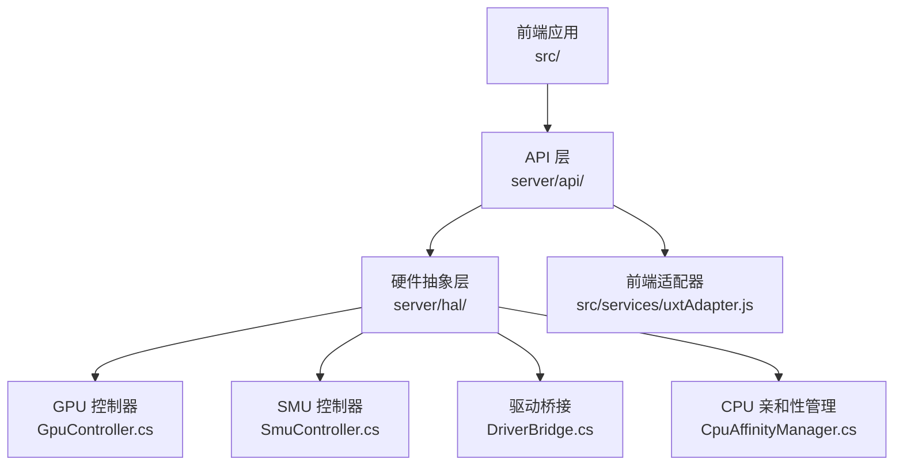
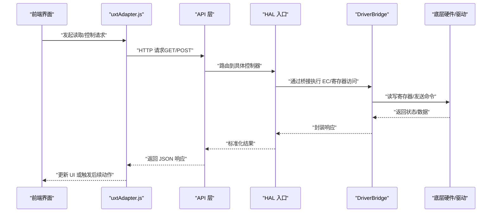
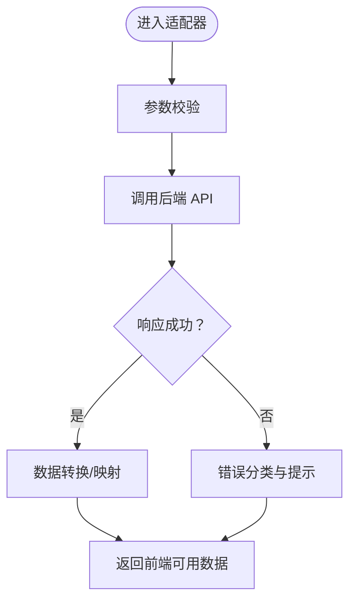
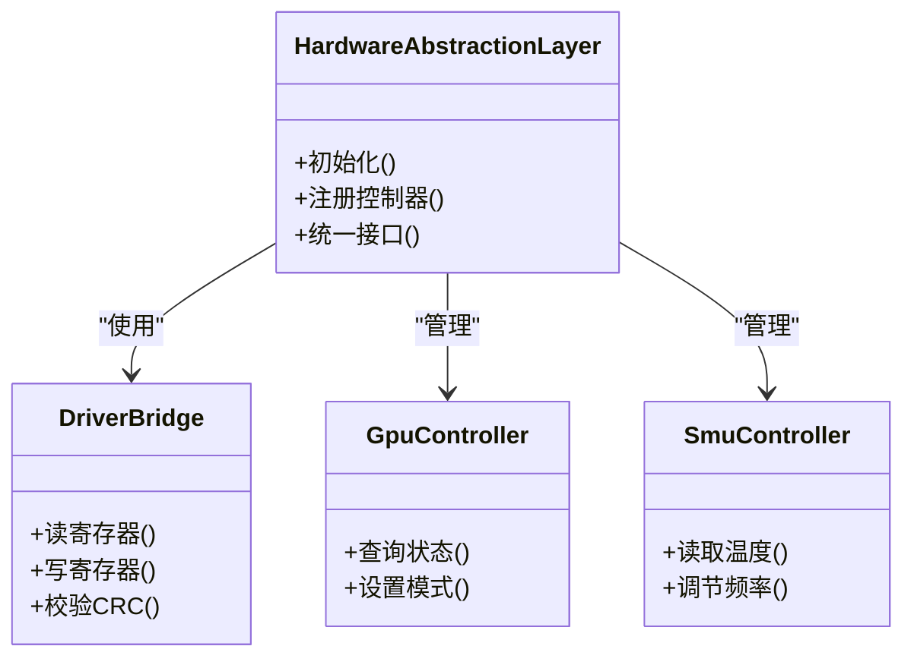
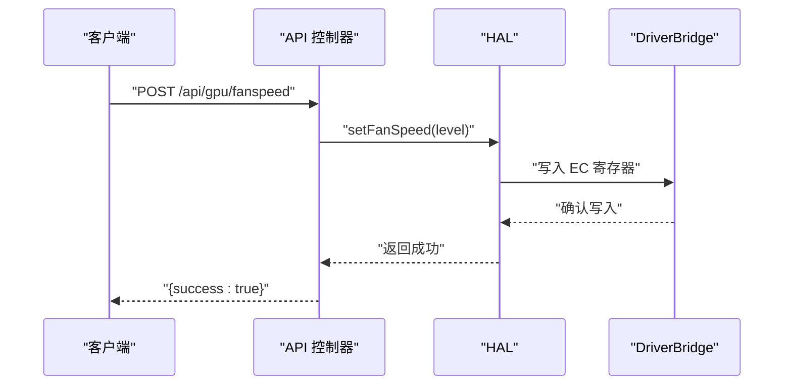
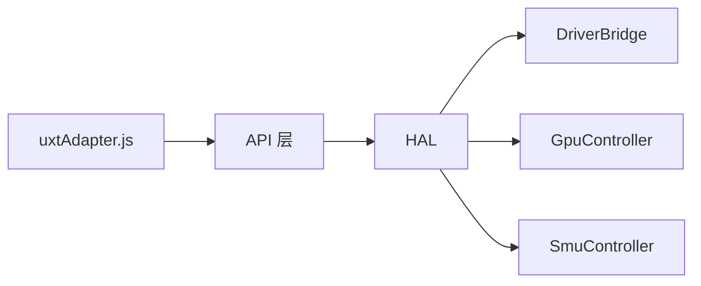

# 插件开发

<cite>
**本文引用的文件**
- [uxtAdapter.js](file://src/services/uxtAdapter.js)
- [HardwareAbstractionLayer.cs](file://server/hal/HardwareAbstractionLayer.cs)
- [DriverBridge.cs](file://server/hal/DriverBridge.cs)
- [GpuController.cs](file://server/hal/GpuController.cs)
- [SmuController.cs](file://server/hal/SmuController.cs)
- [CpuAffinityManager.cs](file://server/hal/CpuAffinityManager.cs)
- [Program.cs](file://server/api/Program.cs)
- [Douzhanzhe.API.http](file://server/api/Douzhanzhe.API.http)
- [dev-api.md](file://docs/dev-api.md)
- [dev-architecture.md](file://docs/dev-architecture.md)
- [dev-ec-map.md](file://docs/dev-ec-map.md)
- [dev-backend.md](file://docs/dev-backend.md)
- [dev-frontend.md](file://docs/dev-frontend.md)
- [dev-index.md](file://docs/dev-index.md)
- [reference-consoles.md](file://docs/reference-consoles.md)
</cite>

## 目录
1. [引言](#引言)
2. [项目结构](#项目结构)
3. [核心组件](#核心组件)
4. [架构总览](#架构总览)
5. [详细组件分析](#详细组件分析)
6. [依赖关系分析](#依赖关系分析)
7. [性能考虑](#性能考虑)
8. [故障排查指南](#故障排查指南)
9. [结论](#结论)
10. [附录](#附录)

## 引言
本指南面向希望为系统开发“插件”的工程师，聚焦于硬件抽象与适配器层（HAL）与前端适配器（uxtAdapter.js）之间的协作方式。文档将从接口设计、扩展点、新硬件接入流程、EC寄存器映射扩展、错误处理与性能优化等方面，给出可操作的步骤与最佳实践，并通过图示展示关键数据流与调用序列。

## 项目结构
该仓库采用前后端分离与硬件抽象分层的组织方式：
- 前端：React/Vite 应用位于 src/，其中服务适配器位于 src/services/uxtAdapter.js
- 后端：.NET 8 的 API 与 HAL 层位于 server/，包含硬件抽象层、驱动桥接、GPU/SMU 控制器等
- 文档：docs/ 提供开发 API、架构、EC 映射、后端与前端开发指南

**图表来源**
- [uxtAdapter.js](file://src/services/uxtAdapter.js)
- [HardwareAbstractionLayer.cs](file://server/hal/HardwareAbstractionLayer.cs)
- [DriverBridge.cs](file://server/hal/DriverBridge.cs)
- [GpuController.cs](file://server/hal/GpuController.cs)
- [SmuController.cs](file://server/hal/SmuController.cs)
- [CpuAffinityManager.cs](file://server/hal/CpuAffinityManager.cs)
- [Program.cs](file://server/api/Program.cs)

**章节来源**
- [dev-index.md](file://docs/dev-index.md)
- [dev-architecture.md](file://docs/dev-architecture.md)

## 核心组件
- 前端适配器（uxtAdapter.js）
  - 负责将前端 UI 与后端 HAL 接口对接，封装硬件读写、状态查询与控制命令
  - 提供统一的数据模型与错误处理策略，便于扩展新硬件时保持接口一致性
- 硬件抽象层（HAL）
  - HardwareAbstractionLayer.cs：统一入口，聚合各控制器与桥接模块
  - DriverBridge.cs：与底层驱动交互的桥接层，负责 EC 寄存器读写与设备通信
  - GpuController.cs / SmuController.cs：分别抽象 GPU 与 SMU（系统管理单元）的控制逻辑
  - CpuAffinityManager.cs：CPU 亲和性与调度相关能力
- API 层（Program.cs 与 API HTTP 定义）
  - Program.cs：应用启动与路由注册
  - Douzhanzhe.API.http：HTTP 接口契约与示例请求

**章节来源**
- [uxtAdapter.js](file://src/services/uxtAdapter.js)
- [HardwareAbstractionLayer.cs](file://server/hal/HardwareAbstractionLayer.cs)
- [DriverBridge.cs](file://server/hal/DriverBridge.cs)
- [GpuController.cs](file://server/hal/GpuController.cs)
- [SmuController.cs](file://server/hal/SmuController.cs)
- [CpuAffinityManager.cs](file://server/hal/CpuAffinityManager.cs)
- [Program.cs](file://server/api/Program.cs)
- [Douzhanzhe.API.http](file://server/api/Douzhanzhe.API.http)

## 架构总览
下图展示了从前端适配器到 HAL 再到驱动桥接的整体调用链路与职责边界：

**图表来源**
- [uxtAdapter.js](file://src/services/uxtAdapter.js)
- [Program.cs](file://server/api/Program.cs)
- [HardwareAbstractionLayer.cs](file://server/hal/HardwareAbstractionLayer.cs)
- [DriverBridge.cs](file://server/hal/DriverBridge.cs)

## 详细组件分析

### 前端适配器（uxtAdapter.js）
uxtAdapter.js 是插件开发的核心对接点，负责：
- 统一的请求封装与错误处理
- 数据模型转换与校验
- 与后端 API 的契约对齐（字段名、类型、状态码）

建议在新增硬件时：
- 在适配器中新增对应模块或函数，遵循现有命名与参数风格
- 对外部暴露一致的接口（如 getXXX、setXXX），内部统一走 API 层
- 对异常进行分类处理（网络、协议、业务），并提供用户可感知的提示

**图表来源**
- [uxtAdapter.js](file://src/services/uxtAdapter.js)

**章节来源**
- [uxtAdapter.js](file://src/services/uxtAdapter.js)

### 硬件抽象层（HAL）与控制器
HAL 将不同硬件控制器（GPU、SMU、CPU 等）统一抽象，提供一致的对外接口。关键扩展点：
- 新控制器集成
  - 在 HAL 中新增控制器类，实现通用接口
  - 在 HAL 入口中注册控制器实例，确保生命周期与依赖注入正确
  - 通过 DriverBridge 执行底层寄存器读写
- EC 寄存器映射扩展
  - 在 DriverBridge 中新增寄存器常量与访问方法
  - 在控制器中以枚举或配置形式声明寄存器偏移与位域
  - 通过 HAL 统一暴露给 API 层

**图表来源**
- [HardwareAbstractionLayer.cs](file://server/hal/HardwareAbstractionLayer.cs)
- [DriverBridge.cs](file://server/hal/DriverBridge.cs)
- [GpuController.cs](file://server/hal/GpuController.cs)
- [SmuController.cs](file://server/hal/SmuController.cs)

**章节来源**
- [HardwareAbstractionLayer.cs](file://server/hal/HardwareAbstractionLayer.cs)
- [DriverBridge.cs](file://server/hal/DriverBridge.cs)
- [GpuController.cs](file://server/hal/GpuController.cs)
- [SmuController.cs](file://server/hal/SmuController.cs)

### API 层与接口契约
API 层负责：
- 路由与中间件（鉴权、日志、跨域等）
- 统一响应格式与错误码
- 与 HAL 的交互与数据转发

建议：
- 使用 HTTP 方法与路径约定清晰表达语义（GET 查询、POST 设置）
- 对每个接口提供 .http 示例，便于联调
- 对高频接口增加缓存与节流策略，降低驱动压力

**图表来源**
- [Program.cs](file://server/api/Program.cs)
- [Douzhanzhe.API.http](file://server/api/Douzhanzhe.API.http)
- [HardwareAbstractionLayer.cs](file://server/hal/HardwareAbstractionLayer.cs)
- [DriverBridge.cs](file://server/hal/DriverBridge.cs)

**章节来源**
- [Program.cs](file://server/api/Program.cs)
- [Douzhanzhe.API.http](file://server/api/Douzhanzhe.API.http)

## 依赖关系分析
- 前端适配器依赖 API 层提供的接口契约
- API 层依赖 HAL，HAL 再依赖 DriverBridge 与各控制器
- 各控制器之间低耦合，通过 HAL 协调

**图表来源**
- [uxtAdapter.js](file://src/services/uxtAdapter.js)
- [Program.cs](file://server/api/Program.cs)
- [HardwareAbstractionLayer.cs](file://server/hal/HardwareAbstractionLayer.cs)
- [DriverBridge.cs](file://server/hal/DriverBridge.cs)
- [GpuController.cs](file://server/hal/GpuController.cs)
- [SmuController.cs](file://server/hal/SmuController.cs)

**章节来源**
- [dev-api.md](file://docs/dev-api.md)
- [dev-backend.md](file://docs/dev-backend.md)

## 性能考虑
- 驱动访问节流
  - 对频繁读写的寄存器/接口增加去抖与合并策略，避免过度轮询
- 缓存策略
  - 对稳定不变或变化缓慢的数据（如固件版本、硬件型号）启用短期缓存
- 并发与队列
  - 对写操作使用串行队列，保证寄存器写入顺序与一致性
- 前端渲染优化
  - 使用虚拟滚动、懒加载与按需更新，减少重绘与回流

## 故障排查指南
- 常见问题定位
  - 网络层：检查 API 是否可达、CORS 配置、超时设置
  - 协议层：核对请求体字段、枚举值范围、必填项
  - 硬件层：确认 EC 寄存器地址是否正确、权限是否足够
- 错误分类与处理
  - 网络错误：重试与降级提示
  - 协议错误：打印请求/响应上下文，定位字段不匹配
  - 硬件错误：记录寄存器值与时间戳，复现最小化场景
- 日志与监控
  - 在 API 层与 HAL 层埋点，记录关键路径耗时与失败原因

**章节来源**
- [dev-known-issues.md](file://docs/dev-known-issues.md)

## 结论
通过明确的分层与接口契约，系统为插件开发提供了清晰的扩展路径。前端适配器负责用户体验与数据呈现，API 层负责协议与路由，HAL 则承载了硬件抽象与驱动桥接。新增硬件时，建议优先完善 HAL 与 DriverBridge 的映射，再在前端适配器中补充 UI 与交互逻辑，最后完善 API 与文档。

## 附录

### 插件开发完整流程（从接口定义到实现）
- 接口定义
  - 在 API 层定义路由与请求/响应结构，参考现有接口风格
  - 在前端适配器中新增对应方法，保持参数与返回值一致
- HAL 扩展
  - 在 HAL 中新增控制器或扩展现有控制器，声明寄存器映射
  - 通过 DriverBridge 实现底层读写，确保幂等与安全
- 前端集成
  - 在面板组件中调用适配器方法，绑定状态与事件
  - 对异常进行用户友好提示，必要时提供重试机制
- 测试与验证
  - 使用 .http 文件编写测试用例，覆盖正常与异常分支
  - 在真实硬件上验证功能与稳定性

**章节来源**
- [dev-api.md](file://docs/dev-api.md)
- [dev-frontend.md](file://docs/dev-frontend.md)
- [dev-backend.md](file://docs/dev-backend.md)
- [dev-ec-map.md](file://docs/dev-ec-map.md)

### 新硬件支持添加流程（步骤化）
- 分析需求与硬件能力
  - 明确需要读取/控制的指标（温度、风扇、频率等）
  - 确定 EC 寄存器或专用接口
- EC 寄存器映射与校验
  - 在 DriverBridge 中新增寄存器常量与访问方法
  - 在 HAL 控制器中声明寄存器偏移、位域与默认值
- API 与适配器实现
  - 在 API 层新增路由，调用 HAL 控制器
  - 在前端适配器中新增方法，封装请求与响应
- UI 集成与测试
  - 在面板中添加控件，绑定状态与事件
  - 编写 .http 与单元测试，验证边界条件

**章节来源**
- [dev-ec-map.md](file://docs/dev-ec-map.md)
- [DriverBridge.cs](file://server/hal/DriverBridge.cs)
- [HardwareAbstractionLayer.cs](file://server/hal/HardwareAbstractionLayer.cs)

### 最佳实践清单
- 接口一致性：前后端字段名与类型保持一致
- 错误处理：区分网络、协议、硬件三类错误，提供明确提示
- 性能优化：对高频访问加缓存与节流，写操作串行化
- 可观测性：埋点关键路径，记录请求上下文与耗时
- 文档与测试：为每个接口提供 .http 示例与测试用例

**章节来源**
- [dev-api.md](file://docs/dev-api.md)
- [dev-frontend.md](file://docs/dev-frontend.md)
- [dev-backend.md](file://docs/dev-backend.md)
- [reference-consoles.md](file://docs/reference-consoles.md)