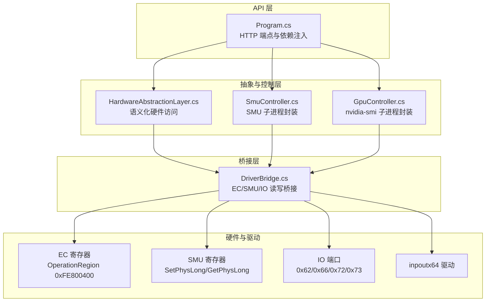
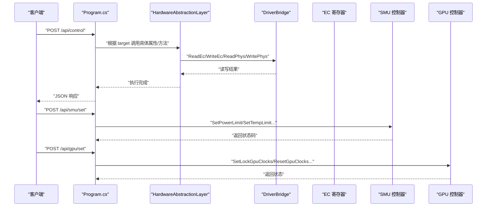
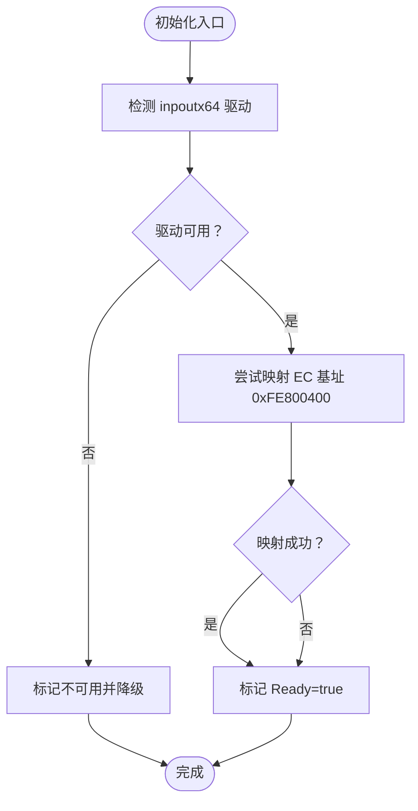
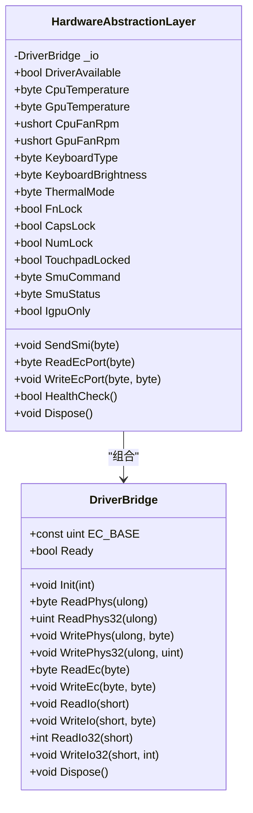
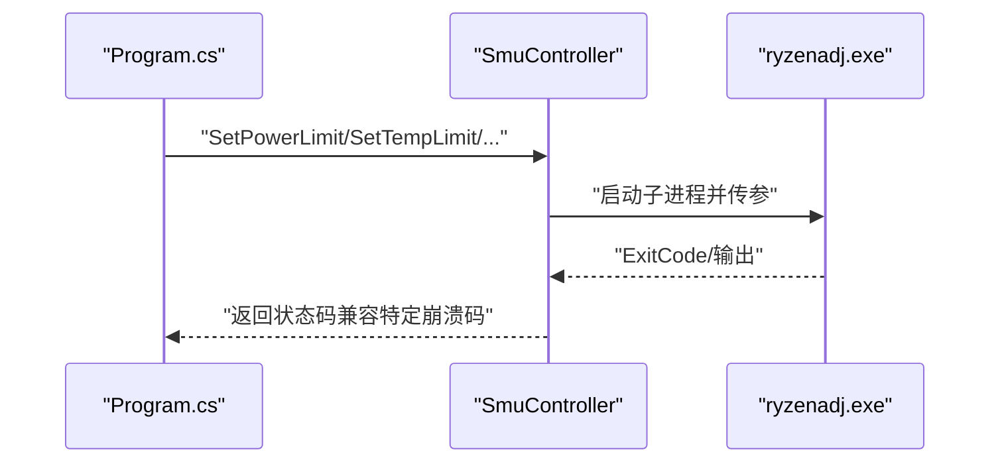
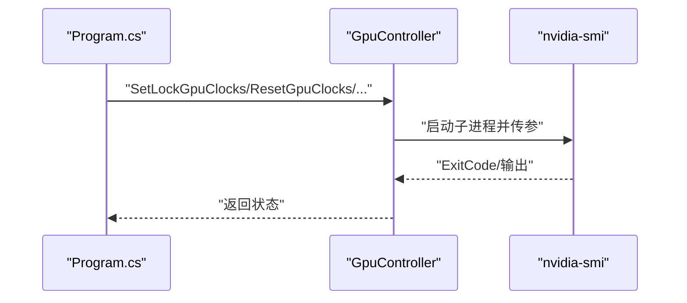
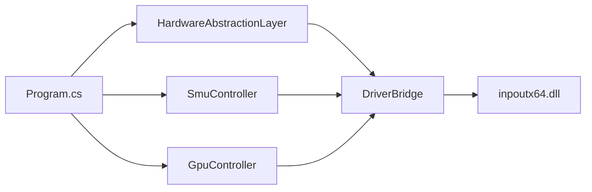

# 硬件控制器扩展

<cite>
**本文引用的文件**
- [GpuController.cs](file://server/hal/GpuController.cs)
- [SmuController.cs](file://server/hal/SmuController.cs)
- [DriverBridge.cs](file://server/hal/DriverBridge.cs)
- [HardwareAbstractionLayer.cs](file://server/hal/HardwareAbstractionLayer.cs)
- [Program.cs](file://server/api/Program.cs)
- [dev-ec-map.md](file://docs/dev-ec-map.md)
- [dev-architecture.md](file://docs/dev-architecture.md)
- [Douzhanzhe.API.csproj](file://server/api/Douzhanzhe.API.csproj)
</cite>

## 目录
1. [简介](#简介)
2. [项目结构](#项目结构)
3. [核心组件](#核心组件)
4. [架构总览](#架构总览)
5. [详细组件分析](#详细组件分析)
6. [依赖关系分析](#依赖关系分析)
7. [性能考量](#性能考量)
8. [故障排查指南](#故障排查指南)
9. [结论](#结论)
10. [附录](#附录)

## 简介
本文件面向希望扩展硬件控制器的工程师，系统性阐述如何在现有体系中新增控制器、扩展 EC 寄存器映射，并利用 DriverBridge 桥接层完成与底层硬件的通信。文档覆盖：
- GPU 控制器与 SMU 控制器的扩展机制与调用流程
- EC 寄存器映射的扩展方法与写入策略
- DriverBridge 桥接层的作用、初始化与通信协议
- 新硬件设备接入的完整流程、兼容性检查、错误处理与调试技巧
- 具体扩展实现示例（控制器基类继承、接口实现、配置管理）

## 项目结构
后端采用“桥接层 + 抽象层 + 控制器层 + API 层”的四层架构：
- DriverBridge：内核驱动桥接，提供 EC IO 协议、物理内存读写、IO 端口读写能力
- HardwareAbstractionLayer：在桥接层之上提供语义化硬件访问接口，统一温度、风扇、键盘背光、散热模式等
- SmuController/GpuController：分别封装 SMU（AMD）与 GPU（NVIDIA）子进程控制
- API 层：Minimal API 提供遥测、控制、诊断等 HTTP 接口

图表来源
- [Program.cs:10-14](file://server/api/Program.cs#L10-L14)
- [HardwareAbstractionLayer.cs:48-54](file://server/hal/HardwareAbstractionLayer.cs#L48-L54)
- [DriverBridge.cs:39-62](file://server/hal/DriverBridge.cs#L39-L62)
- [dev-architecture.md:10-46](file://docs/dev-architecture.md#L10-L46)

章节来源
- [dev-architecture.md:10-46](file://docs/dev-architecture.md#L10-L46)
- [Program.cs:10-14](file://server/api/Program.cs#L10-L14)

## 核心组件
- DriverBridge：负责 inpoutx64 驱动初始化、EC IO 协议、SMU 物理地址直写、IO 端口读写、EC 内存映射缓存等
- HardwareAbstractionLayer：在 DriverBridge 基础上提供语义化接口（温度、风扇、键盘背光、散热模式、dGPU 模式等）
- SmuController：封装 ryzenadj 子进程，提供功耗、温度、曲线优化、频率限制、睿频开关等设置
- GpuController：封装 nvidia-smi 子进程，提供锁频、上限、重置、显存频率控制与状态查询

章节来源
- [DriverBridge.cs:9-62](file://server/hal/DriverBridge.cs#L9-L62)
- [HardwareAbstractionLayer.cs:19-54](file://server/hal/HardwareAbstractionLayer.cs#L19-L54)
- [SmuController.cs:12-41](file://server/hal/SmuController.cs#L12-L41)
- [GpuController.cs:10-40](file://server/hal/GpuController.cs#L10-L40)

## 架构总览
系统分层清晰，API 层通过依赖注入获取 HAL、SMU、GPU 控制器实例，统一对外提供遥测与控制接口。桥接层承担与内核驱动的交互，抽象层提供稳定的硬件语义接口。

图表来源
- [Program.cs:144-202](file://server/api/Program.cs#L144-L202)
- [HardwareAbstractionLayer.cs:147-265](file://server/hal/HardwareAbstractionLayer.cs#L147-L265)
- [DriverBridge.cs:111-137](file://server/hal/DriverBridge.cs#L111-L137)
- [SmuController.cs:61-95](file://server/hal/SmuController.cs#L61-L95)
- [GpuController.cs:42-75](file://server/hal/GpuController.cs#L42-L75)

## 详细组件分析

### DriverBridge 桥接层
- 初始化与健康检查
  - 通过 inpoutx64.dll 检测驱动是否打开，若打开则尝试映射 EC 基址（0xFE800400），并标记 Ready
  - 若驱动不可用，记录日志并降级为安全默认值
- EC IO 协议
  - 通过端口 0x66（命令）与 0x62（数据）实现读写，写入前轮询 IBF（Input Buffer Full）标志
  - 提供 ReadEc/WriteEc 方法，内部带锁保证并发安全
- 物理内存与 IO 端口
  - ReadPhys/WritePhys 支持 8/32 位读写，优先使用预映射缓存（EC 区域），否则动态映射或 SetPhysLong
  - ReadIo/WriteIo/ReadIo32/WriteIo32 提供 IO 端口读写
- SMU 与 dGPU 控制
  - 通过 SMN/SMU 寄存器地址直写（SetPhysLong/GetPhysLong），并提供 ReadSmnRegister 读取接口
  - dGPU 电源控制通过 DSAD 方法（0xFED81E40 + 偏移）实现

图表来源
- [DriverBridge.cs:39-62](file://server/hal/DriverBridge.cs#L39-L62)

章节来源
- [DriverBridge.cs:9-62](file://server/hal/DriverBridge.cs#L9-L62)
- [DriverBridge.cs:111-148](file://server/hal/DriverBridge.cs#L111-L148)

### HardwareAbstractionLayer 抽象层
- 硬件语义化接口
  - 温度：优先从 EC 物理内存读取（GPUT/CPUT），失败回退 nvidia-smi
  - 风扇：通过 EC IO 读取高/低位寄存器，双读仲裁消除竞态
  - 键盘背光：通过 WritePhys(SetPhysLong) 直写 KBNL（0x9A）
  - 散热模式：通过 WritePhys(SetPhysLong) 写入 ITSM（0xE4）
  - dGPU 模式：通过 DSAD 方法（0xFED81E40 + 偏移）控制 ADPD bit3
  - SMI 触发：通过 APM 端口 0x72/0x73 触发 GSMI
- 能力与兼容性
  - 通过 HealthCheck() 读取 CPU 温度进行健康检查
  - 对于部分寄存器（如 CapsLock/NumLock），通过 Windows API 实现而非 EC/IO 写入

图表来源
- [HardwareAbstractionLayer.cs:19-771](file://server/hal/HardwareAbstractionLayer.cs#L19-L771)
- [DriverBridge.cs:9-149](file://server/hal/DriverBridge.cs#L9-L149)

章节来源
- [HardwareAbstractionLayer.cs:147-265](file://server/hal/HardwareAbstractionLayer.cs#L147-L265)
- [HardwareAbstractionLayer.cs:346-426](file://server/hal/HardwareAbstractionLayer.cs#L346-L426)
- [HardwareAbstractionLayer.cs:432-439](file://server/hal/HardwareAbstractionLayer.cs#L432-L439)
- [HardwareAbstractionLayer.cs:753-765](file://server/hal/HardwareAbstractionLayer.cs#L753-L765)

### SmuController（SMU 控制器）
- 子进程封装
  - 通过 ryzenadj.exe 子进程执行各类 SMU 设置（功耗、温度、曲线优化、频率限制、睿频开关）
  - 对特定返回码（如崩溃）进行兼容处理，提升鲁棒性
- 能力探测与寄存器读取
  - Probe() 用于探测 SMU 可用性
  - GetCapabilities() 返回当前控制器支持的能力集合
  - ReadSmnRegister() 读取 SMN 寄存器值（受 32 位地址限制）

图表来源
- [Program.cs:238-274](file://server/api/Program.cs#L238-L274)
- [SmuController.cs:43-57](file://server/hal/SmuController.cs#L43-L57)
- [SmuController.cs:61-95](file://server/hal/SmuController.cs#L61-L95)

章节来源
- [SmuController.cs:12-41](file://server/hal/SmuController.cs#L12-L41)
- [SmuController.cs:103-141](file://server/hal/SmuController.cs#L103-L141)

### GpuController（GPU 控制器）
- 子进程封装
  - 通过 nvidia-smi 子进程执行锁频、上限、重置、显存频率控制与状态查询
- 状态查询
  - GetClockInfo() 获取核心频率、显存频率与功耗
  - GetBaseClock()/GetMaxClock() 获取基准与硬件最大频率

图表来源
- [Program.cs:396-447](file://server/api/Program.cs#L396-L447)
- [GpuController.cs:14-40](file://server/hal/GpuController.cs#L14-L40)
- [GpuController.cs:77-107](file://server/hal/GpuController.cs#L77-L107)

章节来源
- [GpuController.cs:10-40](file://server/hal/GpuController.cs#L10-L40)
- [GpuController.cs:77-107](file://server/hal/GpuController.cs#L77-L107)

### EC 寄存器映射扩展
- 基址与区域
  - EC 主区域：0xFE800400，大小 0xFF
  - dGPU 控制：0xFED81E40 + (Arg0<<1)，DSAD 方法
- 写入策略优先级
  - 物理内存写入（SetPhysLong）优先，适用于地址 < 4GB
  - 先读取当前状态，再按位修改，最后通过 WritePhys(SetPhysLong) 写回
  - 避免使用 ReadPhys 预映射缓存指针写入（会引发 NRE）
  - 部分寄存器仅 IO 端口写入有效，需配合 EC IO 协议
- 已知只读寄存器
  - 0xFE800425（CapsLock/NumLock 等）为键盘控制器状态通知出口，外部写入无效，需通过 Windows API 实现

章节来源
- [dev-ec-map.md:13-18](file://docs/dev-ec-map.md#L13-L18)
- [dev-ec-map.md:20-41](file://docs/dev-ec-map.md#L20-L41)
- [dev-ec-map.md:97-104](file://docs/dev-ec-map.md#L97-L104)
- [dev-ec-map.md:105-119](file://docs/dev-ec-map.md#L105-L119)

## 依赖关系分析
- 依赖注入
  - Program.cs 注册 HAL、SmuController、GpuController、WmiInterface 为单例，供 API 端点使用
- 外部依赖
  - inpoutx64.dll：EC/IO/SMU 直写核心
  - ryzenadj.exe：SMU 设置
  - nvidia-smi：GPU 频率与状态查询
  - System.Management：WMI 访问（可选）

图表来源
- [Program.cs:10-14](file://server/api/Program.cs#L10-L14)
- [Douzhanzhe.API.csproj:24](file://server/api/Douzhanzhe.API.csproj#L24)

章节来源
- [Program.cs:10-14](file://server/api/Program.cs#L10-L14)
- [Douzhanzhe.API.csproj:12-29](file://server/api/Douzhanzhe.API.csproj#L12-L29)

## 性能考量
- HAL 遥测缓存
  - 对 CPU/GPU/内存/磁盘等遥测数据设置时间窗口缓存，降低频繁调用成本
- EC IO 协议轮询
  - 写入前轮询 IBF，避免阻塞；读取时进行双读仲裁，减少竞态
- 子进程调用
  - nvidia-smi/ryzenadj 为外部进程，调用需设置超时并捕获异常，避免阻塞 API

章节来源
- [HardwareAbstractionLayer.cs:25-42](file://server/hal/HardwareAbstractionLayer.cs#L25-L42)
- [DriverBridge.cs:139-147](file://server/hal/DriverBridge.cs#L139-L147)
- [GpuController.cs:12-40](file://server/hal/GpuController.cs#L12-L40)
- [SmuController.cs:43-57](file://server/hal/SmuController.cs#L43-L57)

## 故障排查指南
- 驱动与权限
  - 必须以管理员权限运行 API 进程，确保 inpoutx64 驱动可用
  - 若驱动不可用，HAL 将返回安全默认值，HealthCheck() 可用于快速验证
- EC 写入无效
  - 检查地址范围与写入策略：优先物理内存写入，必要时使用 IO 端口协议
  - 预映射缓存写入无效，需使用 SetPhysLong 或单地址映射
- SMU 读取限制
  - 某些硬件（如 Dragon Range）锁定 PM 表 API，无法读取实时功率表，但写命令仍可用
- 子进程异常
  - nvidia-smi/ryzenadj 超时或退出码异常时，捕获并返回友好错误信息

章节来源
- [dev-architecture.md:99-114](file://docs/dev-architecture.md#L99-L114)
- [HardwareAbstractionLayer.cs:753-765](file://server/hal/HardwareAbstractionLayer.cs#L753-L765)
- [DriverBridge.cs:76-99](file://server/hal/DriverBridge.cs#L76-L99)
- [SmuController.cs:59-65](file://server/hal/SmuController.cs#L59-L65)

## 结论
通过 DriverBridge 桥接层与 HAL 抽象层，系统实现了对 EC 寄存器、SMU、IO 端口与子进程的统一管理。扩展新硬件控制器的关键在于：
- 在 HAL 中提供语义化接口，屏蔽底层差异
- 在 DriverBridge 中遵循写入策略与协议规范
- 在 API 层通过依赖注入与端点路由完成控制与遥测

## 附录

### 扩展实现示例（步骤指引）
- 新建控制器类
  - 继承现有模式，封装子进程或硬件接口
  - 在 Program.cs 中注册为单例
- 在 HAL 中添加语义化属性
  - 通过 DriverBridge 的 ReadEc/WriteEc/ReadPhys/WritePhys 实现
  - 对于只读寄存器，通过 Windows API 或子进程实现
- 在 API 层添加端点
  - 在 Program.cs 中新增 MapPost/MapGet，调用控制器或 HAL 方法
- 配置与持久化
  - 使用 /api/custom-params 与 /api/ui-state 进行配置持久化
- 兼容性与错误处理
  - 使用 HealthCheck() 进行健康检查
  - 捕获并返回明确的错误信息，避免异常泄漏

章节来源
- [Program.cs:10-14](file://server/api/Program.cs#L10-L14)
- [Program.cs:144-202](file://server/api/Program.cs#L144-L202)
- [Program.cs:538-568](file://server/api/Program.cs#L538-L568)