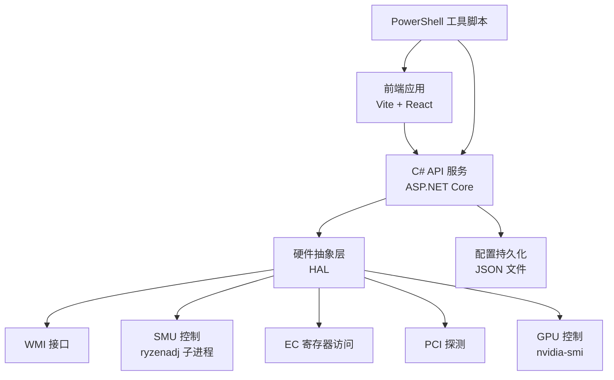
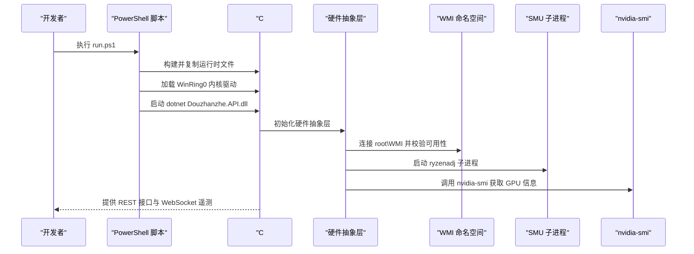
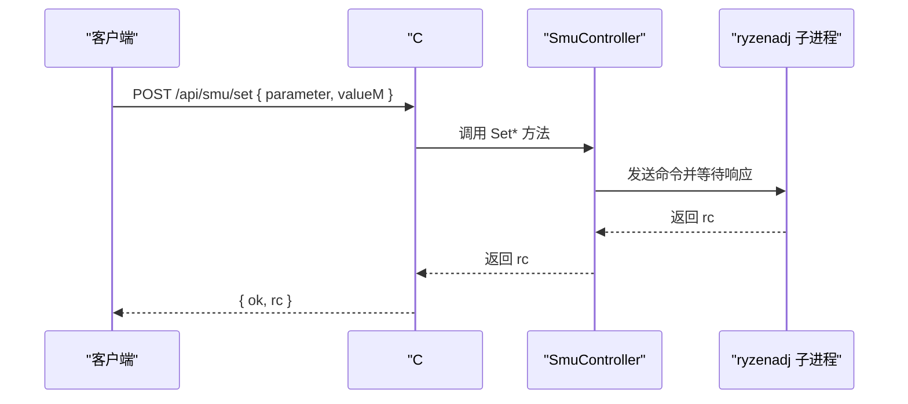
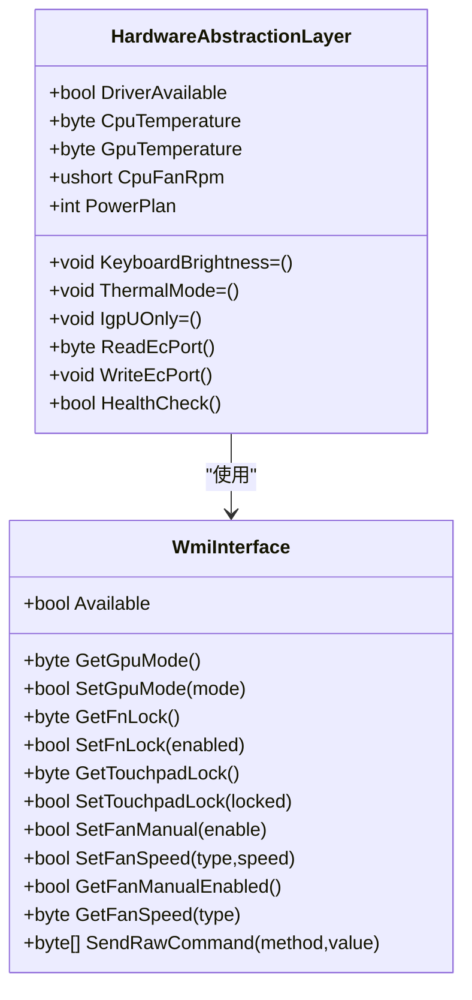
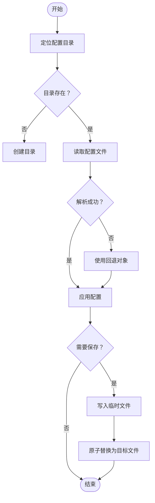
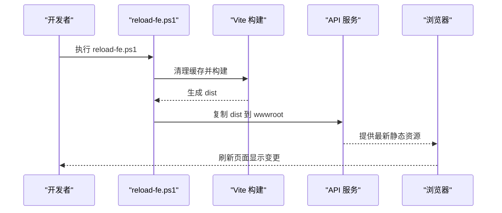
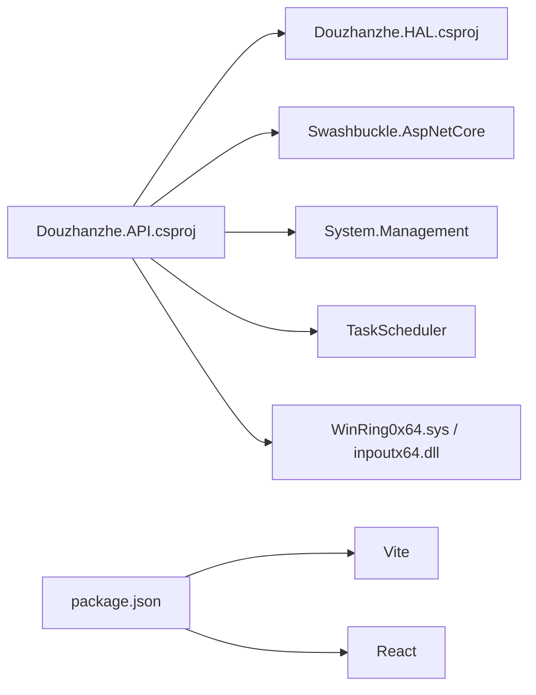

# 第三方集成

<cite>
**本文引用的文件**
- [Douzhanzhe.API.csproj](file://server/api/Douzhanzhe.API.csproj)
- [Program.cs](file://server/api/Program.cs)
- [appsettings.json](file://server/api/appsettings.json)
- [run.ps1](file://server/api/run.ps1)
- [reload-fe.ps1](file://server/tools/reload-fe.ps1)
- [Douzhanzhe.HAL.csproj](file://server/hal/Douzhanzhe.HAL.csproj)
- [HardwareAbstractionLayer.cs](file://server/hal/HardwareAbstractionLayer.cs)
- [WmiInterface.cs](file://server/api/WmiInterface.cs)
- [custom-params.json](file://server/api/config/custom-params.json)
- [ui-state.json](file://server/api/config/ui-state.json)
- [dashboard-default.json](file://server/config/dashboard-default.json)
- [package.json](file://package.json)
</cite>

## 目录
1. [简介](#简介)
2. [项目结构](#项目结构)
3. [核心组件](#核心组件)
4. [架构总览](#架构总览)
5. [详细组件分析](#详细组件分析)
6. [依赖关系分析](#依赖关系分析)
7. [性能考量](#性能考量)
8. [故障排除指南](#故障排除指南)
9. [结论](#结论)
10. [附录](#附录)

## 简介
本指南面向需要将外部工具与本项目进行集成的开发者，涵盖以下主题：
- API 集成：如何调用现有 REST/WS 接口实现遥测采集、系统控制与硬件调节。
- 数据交换协议：请求/响应格式、查询参数约定、WebSocket 遥测流。
- 系统接口对接：WMI、SMU、EC、PCI、nvidia-smi 等底层接口的使用方式。
- 配置管理扩展：新增配置项、默认配置与持久化策略。
- 脚本自动化集成：PowerShell 脚本的编写与系统工具集成方法。
- 安全与兼容性：权限、驱动加载、平台差异与常见问题排查。

## 项目结构
项目采用前后端分离与多层架构设计：
- 前端：基于 Vite 的 React 应用，构建产物部署至后端 wwwroot。
- 后端：ASP.NET Core Web API，提供 REST 接口与 WebSocket 遥测。
- 硬件抽象层：.NET 层封装底层硬件访问（WMI、SMU、EC、PCI、nvidia-smi）。
- 工具链：PowerShell 自动化脚本负责构建、部署与驱动加载。

图表来源
- [Program.cs:1-783](file://server/api/Program.cs#L1-L783)
- [Douzhanzhe.HAL.csproj:1-18](file://server/hal/Douzhanzhe.HAL.csproj#L1-L18)
- [HardwareAbstractionLayer.cs:1-200](file://server/hal/HardwareAbstractionLayer.cs#L1-L200)
- [WmiInterface.cs:1-200](file://server/api/WmiInterface.cs#L1-L200)
- [run.ps1:1-67](file://server/api/run.ps1#L1-L67)
- [reload-fe.ps1:1-33](file://server/tools/reload-fe.ps1#L1-L33)

章节来源
- [Douzhanzhe.API.csproj:1-40](file://server/api/Douzhanzhe.API.csproj#L1-L40)
- [Program.cs:1-783](file://server/api/Program.cs#L1-L783)
- [package.json:1-33](file://package.json#L1-L33)

## 核心组件
- API 服务：提供 REST 接口、WebSocket 遥测、配置读写、开机自启管理等能力。
- 硬件抽象层：统一硬件访问语义，封装底层驱动与系统接口。
- WMI 接口：通过 System.Management 访问 root\WMI 命名空间，执行厂商特定命令。
- SMU 控制：通过子进程调用 ryzenadj 实现 AMD CPU 功率、温度、频率等参数调节。
- 配置管理：以 JSON 文件形式持久化用户界面状态、默认仪表盘布局与自定义参数。

章节来源
- [Program.cs:87-584](file://server/api/Program.cs#L87-L584)
- [HardwareAbstractionLayer.cs:1-200](file://server/hal/HardwareAbstractionLayer.cs#L1-L200)
- [WmiInterface.cs:1-200](file://server/api/WmiInterface.cs#L1-L200)
- [custom-params.json:1-22](file://server/api/config/custom-params.json#L1-L22)
- [ui-state.json:1-17](file://server/api/config/ui-state.json#L1-L17)
- [dashboard-default.json:1-7](file://server/config/dashboard-default.json#L1-L7)

## 架构总览
后端服务启动时会尝试加载 WinRing0 内核驱动以启用 SMU 控制，并在运行目录复制必要的工具与驱动文件。前端通过 Vite 构建并部署到 wwwroot，API 提供静态资源与接口。

图表来源
- [run.ps1:32-65](file://server/api/run.ps1#L32-L65)
- [Program.cs:692-725](file://server/api/Program.cs#L692-L725)
- [HardwareAbstractionLayer.cs:174-191](file://server/hal/HardwareAbstractionLayer.cs#L174-L191)

## 详细组件分析

### API 集成与数据交换协议
- REST 端点概览
  - 遥测与系统信息：/api/telemetry、/api/system/info、/api/health
  - 控制接口：/api/control（支持键盘背光、Fn/Num/Caps 锁、电源计划、散热模式、独显/集显切换等）
  - EC 扫描：/api/ec-scan（偏移与范围查询）
  - SMU 控制：/api/smu/set、/api/smu/raw、/api/smu/probe、/api/smu/status、/api/smu/read-reg
  - 风扇控制：/api/fan/set-target、/api/fan/restore、/api/fan/status
  - GPU 控制：/api/gpu/set、/api/gpu/status
  - WMI 命令：/api/wmi/cmd
  - 配置管理：/api/custom-params、/api/ui-state、/api/default-config
  - 开机自启：/api/auto-start、/api/auto-start-opts
  - 兼容性端点：/api/system/settings（已废弃）
- WebSocket 遥测：/ws，客户端建立连接后接收实时遥测数据。
- 请求/响应约定
  - JSON 请求体字段区分大小写，后端采用驼峰命名策略。
  - 成功返回 JSON 对象；错误返回 Problem 结果（含状态码）。
  - 部分端点支持查询参数（如 /api/ec-scan 的 offset/count）。
- 示例流程（SMU 功率限制设置）
  - 客户端发送 POST /api/smu/set，携带 parameter/valueM。
  - 后端根据 parameter 分派到具体 SMU 设置函数。
  - 返回 { ok, rc } 或错误信息。

图表来源
- [Program.cs:238-286](file://server/api/Program.cs#L238-L286)
- [Program.cs:495-503](file://server/api/Program.cs#L495-L503)

章节来源
- [Program.cs:87-584](file://server/api/Program.cs#L87-L584)

### 硬件抽象层与系统接口对接
- WMI 接口
  - 通过 root\WMI 的 MICommonInterface 实例执行厂商特定命令。
  - 支持读取/设置：Fn 锁、触摸板锁、GPU 模式、风扇手动模式与目标转速等。
  - 可通过 /api/wmi/cmd 发送通用命令。
- SMU 控制
  - 通过子进程调用 ryzenadj，支持功率限制、温度墙、曲线优化、频率限制、睿频禁用等。
  - 需要 WinRing0 内核驱动加载成功。
- EC 寄存器访问
  - 通过 DriverBridge 访问 EC 基址（0xFE800400），读取温度、风扇转速、键盘背光等。
  - 支持 /api/ec-scan 扫描指定范围寄存器。
- nvidia-smi 集成
  - 用于回退读取 GPU 温度与状态，作为物理内存读取失败时的备用方案。
- PCI 探测
  - 通过配置空间访问判断设备供应商与类型（例如 AMD 0x1022）。

图表来源
- [HardwareAbstractionLayer.cs:1-200](file://server/hal/HardwareAbstractionLayer.cs#L1-L200)
- [WmiInterface.cs:1-200](file://server/api/WmiInterface.cs#L1-L200)

章节来源
- [HardwareAbstractionLayer.cs:147-195](file://server/hal/HardwareAbstractionLayer.cs#L147-L195)
- [WmiInterface.cs:62-198](file://server/api/WmiInterface.cs#L62-L198)
- [Program.cs:299-314](file://server/api/Program.cs#L299-L314)

### 配置管理扩展机制
- 配置文件位置
  - 后端共享配置目录位于 ../config（相对于 API 输出目录），不存在则回退到 BaseDirectory 上级。
- 默认配置
  - 仪表盘默认布局：/api/default-config（GET/POST）。
  - UI 状态：/api/ui-state（卡片顺序与隐藏卡片）。
  - 自定义参数：/api/custom-params（GET/POST）。
- 持久化策略
  - 读取：JsonRead<T>(fileName, fallback)；失败返回回退对象。
  - 写入：JsonWrite<T>(fileName, data)；先写临时文件再原子替换。
- 新增配置项步骤
  - 在后端为新配置定义强类型记录（参考 UiState、DefaultConfig）。
  - 添加对应的 GET/POST 端点，使用 JsonRead/JsonWrite 进行读写。
  - 在前端发起请求更新配置，或通过 /api/ui-state 与 /api/default-config 维护界面行为。

图表来源
- [Program.cs:23-55](file://server/api/Program.cs#L23-L55)
- [Program.cs:569-584](file://server/api/Program.cs#L569-L584)
- [Program.cs:538-568](file://server/api/Program.cs#L538-L568)
- [Program.cs:542-552](file://server/api/Program.cs#L542-L552)

章节来源
- [Program.cs:23-55](file://server/api/Program.cs#L23-L55)
- [Program.cs:538-584](file://server/api/Program.cs#L538-L584)
- [custom-params.json:1-22](file://server/api/config/custom-params.json#L1-L22)
- [ui-state.json:1-17](file://server/api/config/ui-state.json#L1-L17)
- [dashboard-default.json:1-7](file://server/config/dashboard-default.json#L1-L7)

### 脚本自动化集成（PowerShell）
- run.ps1
  - 构建 C# 项目与前端，复制运行时依赖（WinRing0、ryzenadj、inpoutx64）。
  - 自动加载 WinRing0 内核驱动（提升权限绕过杀软拦截）。
  - 启动 API 服务监听 127.0.0.1:3100。
- reload-fe.ps1
  - 清理 Vite 深缓存并重新构建前端。
  - 将 dist 目录内容复制到运行中的 API 服务的 wwwroot。
  - 若检测到 API 正在运行，提示刷新浏览器生效。
- 使用建议
  - 在 CI/CD 中复用 run.ps1 完成一键构建与部署。
  - 在本地开发中使用 reload-fe.ps1 快速热更新前端。

图表来源
- [reload-fe.ps1:10-31](file://server/tools/reload-fe.ps1#L10-L31)
- [run.ps1:45-65](file://server/api/run.ps1#L45-L65)

章节来源
- [run.ps1:1-67](file://server/api/run.ps1#L1-L67)
- [reload-fe.ps1:1-33](file://server/tools/reload-fe.ps1#L1-L33)

## 依赖关系分析
- 后端项目依赖
  - ASP.NET Core、Swashbuckle（OpenAPI）、System.Management、TaskScheduler。
  - 引用 HAL 项目与外部驱动（WinRing0、inpoutx64）。
- 前端项目依赖
  - Vite、React、TailwindCSS、ESLint 等。
- 运行时依赖
  - Windows 任务计划程序（Task Scheduler）用于开机自启。
  - WinRing0 内核驱动（WinRing0x64.sys）用于 SMU 访问。
  - ryzenadj.exe 用于 SMU 参数调节。
  - nvidia-smi 用于 NVIDIA GPU 信息读取。

图表来源
- [Douzhanzhe.API.csproj:12-33](file://server/api/Douzhanzhe.API.csproj#L12-L33)
- [Douzhanzhe.HAL.csproj:13-15](file://server/hal/Douzhanzhe.HAL.csproj#L13-L15)
- [package.json:6-31](file://package.json#L6-L31)

章节来源
- [Douzhanzhe.API.csproj:1-40](file://server/api/Douzhanzhe.API.csproj#L1-L40)
- [Douzhanzhe.HAL.csproj:1-18](file://server/hal/Douzhanzhe.HAL.csproj#L1-L18)
- [package.json:1-33](file://package.json#L1-L33)

## 性能考量
- 遥测读取
  - GPU 温度在物理内存读取失败时回退到 nvidia-smi，建议限制查询频率避免阻塞。
- SMU 控制
  - 子进程调用存在开销，批量操作建议合并请求或减少调用次数。
- 配置读写
  - 使用临时文件 + 原子替换，避免并发写入冲突。
- 驱动加载
  - WinRing0 首次加载可能较慢，建议在启动阶段完成初始化。

## 故障排除指南
- WinRing0 驱动加载失败
  - 症状：SMU 控制不可用。
  - 处理：检查 run.ps1 是否成功创建并启动服务；确认 sc.exe 命令执行结果；以管理员权限运行。
- nvidia-smi 不可用
  - 症状：GPU 温度读取失败或返回 0。
  - 处理：确认 NVIDIA 驱动安装；允许命令行访问；适当放宽超时。
- WMI 调用异常
  - 症状：/api/wmi/cmd 或风扇/锁相关接口返回错误。
  - 处理：检查 root\WMI 可用性；确认 MICommonInterface 实例存在；以管理员权限运行。
- 配置读写失败
  - 症状：/api/custom-params、/api/ui-state、/api/default-config 返回错误。
  - 处理：检查配置目录权限；确认 JSON 格式正确；避免并发写入。
- 开机自启无效
  - 症状：/api/auto-start 返回 disabled。
  - 处理：确认 Task Scheduler 可用；检查任务是否存在；验证可执行文件路径与参数。

章节来源
- [Program.cs:692-725](file://server/api/Program.cs#L692-L725)
- [HardwareAbstractionLayer.cs:174-191](file://server/hal/HardwareAbstractionLayer.cs#L174-L191)
- [WmiInterface.cs:24-48](file://server/api/WmiInterface.cs#L24-L48)
- [Program.cs:586-686](file://server/api/Program.cs#L586-L686)

## 结论
本项目提供了完善的硬件抽象与系统接口集成能力，配合 REST/WS 接口与配置持久化机制，能够满足第三方工具与系统的对接需求。通过 PowerShell 脚本实现自动化构建与部署，结合默认配置与自定义参数扩展，可快速适配不同场景。建议在生产环境中关注权限、驱动与兼容性问题，并遵循配置读写的原子性原则。

## 附录
- 常用端点速查
  - 遥测：/api/telemetry、/api/system/info、/api/health
  - 控制：/api/control、/api/ec-scan
  - SMU：/api/smu/set、/api/smu/raw、/api/smu/probe、/api/smu/status、/api/smu/read-reg
  - 风扇：/api/fan/set-target、/api/fan/restore、/api/fan/status
  - GPU：/api/gpu/set、/api/gpu/status
  - WMI：/api/wmi/cmd
  - 配置：/api/custom-params、/api/ui-state、/api/default-config
  - 自启：/api/auto-start、/api/auto-start-opts
- 前端构建与部署
  - npm run build；构建产物复制到 server/api/wwwroot。
- 运行与调试
  - 使用 run.ps1 启动完整服务栈；通过 /debug 页面进行交互式调试。