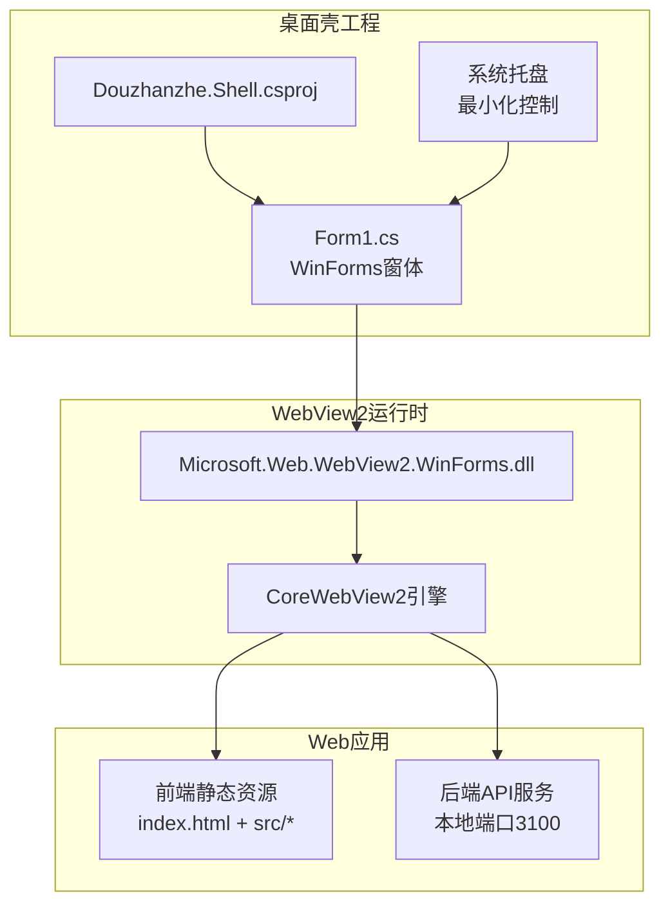
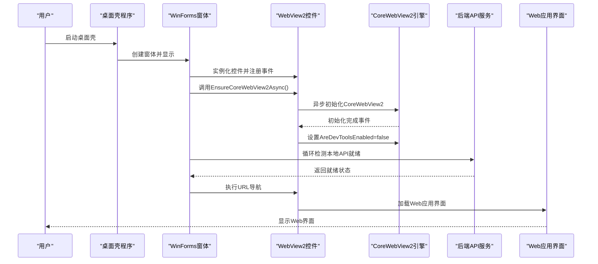
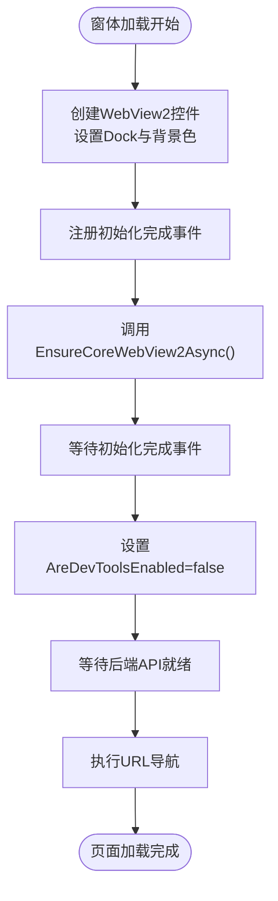
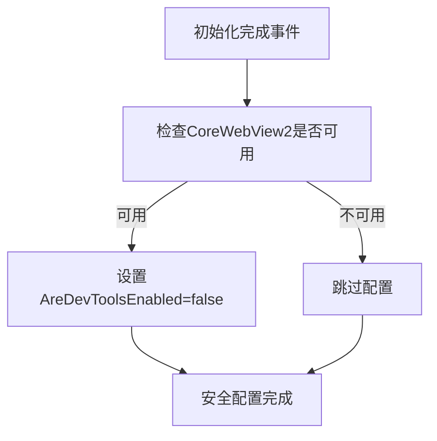
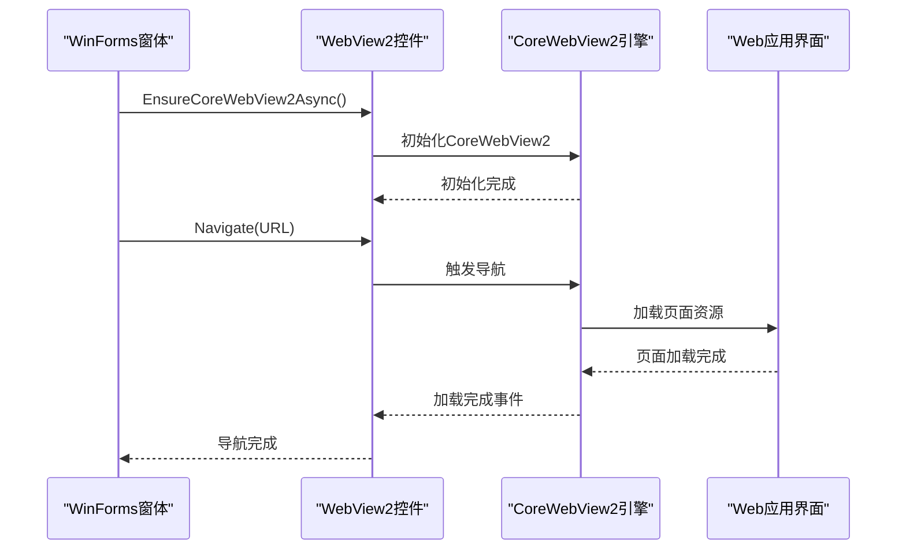
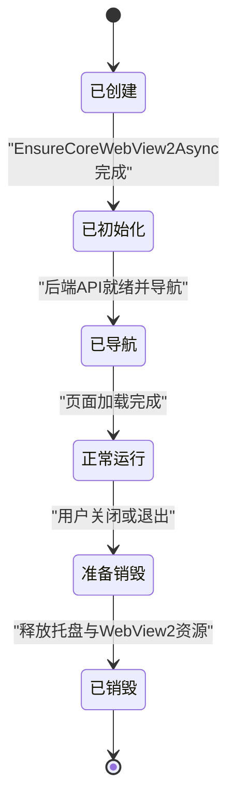
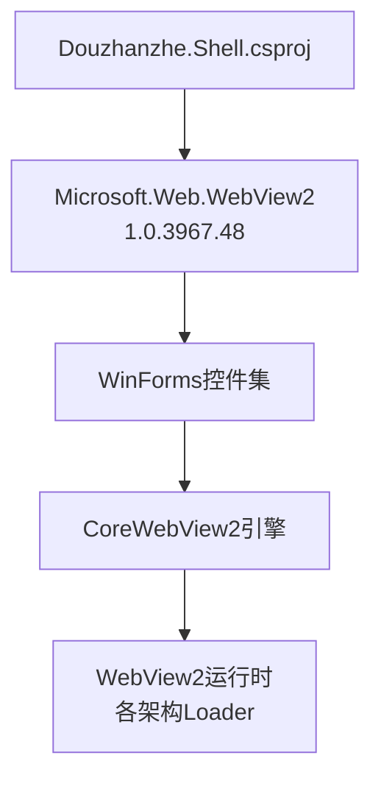

# WebView2集成机制

<cite>
**本文档引用的文件**
- [Form1.cs](file://server/shell/Douzhanzhe.Shell/Form1.cs)
- [Douzhanzhe.Shell.csproj](file://server/shell/Douzhanzhe.Shell/Douzhanzhe.Shell.csproj)
- [dev-architecture.md](file://docs/dev-architecture.md)
- [dev-backend.md](file://docs/dev-backend.md)
- [Microsoft.Web.WebView2.WinForms.xml](file://server/shell/Douzhanzhe.Shell/bin/Debug/net8.0-windows/Microsoft.Web.WebView2.WinForms.xml)
- [Microsoft.Web.WebView2.Core.xml](file://server/shell/Douzhanzhe.Shell/bin/Debug/net8.0-windows/Microsoft.Web.WebView2.Core.xml)
</cite>

## 目录
1. [引言](#引言)
2. [项目结构](#项目结构)
3. [核心组件](#核心组件)
4. [架构概览](#架构概览)
5. [详细组件分析](#详细组件分析)
6. [依赖关系分析](#依赖关系分析)
7. [性能考虑](#性能考虑)
8. [故障排除指南](#故障排除指南)
9. [结论](#结论)
10. [附录](#附录)

## 引言
本文件针对项目中的WebView2集成机制进行深入技术解析，重点覆盖以下方面：
- WebView2控件初始化流程，特别是EnsureCoreWebView2Async的使用与异步加载机制
- 安全配置策略，包括AreDevToolsEnabled设置与开发工具禁用策略
- WebView2与Web应用的通信方式，涵盖URL导航、页面加载与错误处理
- 生命周期管理，包括控件创建、销毁与资源释放
- 最佳实践建议，涉及性能优化、内存管理与调试技巧

该实现位于桌面壳工程中，采用WinForms + WebView2的组合模式，通过系统托盘最小化并在后台运行，等待后端API就绪后再进行页面导航。

## 项目结构
项目采用分层架构，桌面壳工程(server/shell/Douzhanzhe.Shell)负责承载WebView2控件，前端静态资源由独立的Web应用提供，后端API服务在本地运行并通过HTTP接口暴露。

**图表来源**
- [Douzhanzhe.Shell.csproj:1-16](file://server/shell/Douzhanzhe.Shell/Douzhanzhe.Shell.csproj#L1-L16)
- [Form1.cs:45-56](file://server/shell/Douzhanzhe.Shell/Form1.cs#L45-L56)

**章节来源**
- [dev-architecture.md:14-18](file://docs/dev-architecture.md#L14-L18)
- [dev-architecture.md:93-96](file://docs/dev-architecture.md#L93-L96)
- [dev-backend.md:15](file://docs/dev-backend.md#L15)

## 核心组件
- WebView2控件实例：在窗体加载时创建，设置停靠填充与背景色，并注册初始化完成事件以进行安全配置。
- 初始化流程：通过EnsureCoreWebView2Async执行异步初始化，确保CoreWebView2可用后再进行后续操作。
- 导航策略：等待后端API就绪后，再进行URL导航，避免空页面或网络错误。
- 资源管理：在窗体重写Dispose方法中显式释放WebView2控件与托盘相关资源。

关键实现位置：
- 控件创建与事件注册：[Form1.cs:45-56](file://server/shell/Douzhanzhe.Shell/Form1.cs#L45-L56)
- 异步初始化调用：[Form1.cs:71-72](file://server/shell/Douzhanzhe.Shell/Form1.cs#L71-L72)
- API就绪等待与导航：[Form1.cs:74-119](file://server/shell/Douzhanzhe.Shell/Form1.cs#L74-L119)
- 资源释放：[Form1.cs:129-139](file://server/shell/Douzhanzhe.Shell/Form1.cs#L129-L139)

**章节来源**
- [Form1.cs:45-56](file://server/shell/Douzhanzhe.Shell/Form1.cs#L45-L56)
- [Form1.cs:71-72](file://server/shell/Douzhanzhe.Shell/Form1.cs#L71-L72)
- [Form1.cs:74-119](file://server/shell/Douzhanzhe.Shell/Form1.cs#L74-L119)
- [Form1.cs:129-139](file://server/shell/Douzhanzhe.Shell/Form1.cs#L129-L139)

## 架构概览
下图展示了从桌面壳启动到WebView2完成初始化、等待后端API就绪并进行页面导航的整体流程。

**图表来源**
- [Form1.cs:45-56](file://server/shell/Douzhanzhe.Shell/Form1.cs#L45-L56)
- [Form1.cs:71-72](file://server/shell/Douzhanzhe.Shell/Form1.cs#L71-L72)
- [Form1.cs:74-119](file://server/shell/Douzhanzhe.Shell/Form1.cs#L74-L119)

## 详细组件分析

### WebView2初始化与异步加载机制
- 控件创建：在窗体构造函数中创建WebView2实例，设置停靠方式为填满容器，并指定深色背景以匹配主题。
- 初始化事件：注册CoreWebView2InitializationCompleted事件，在回调中对CoreWebView2进行安全配置。
- 异步初始化：在窗体Load事件中调用EnsureCoreWebView2Async，该方法返回Task，确保CoreWebView2完全初始化后再继续。
- 等待策略：初始化完成后，通过循环+短超时的方式轮询后端API就绪状态，避免过早导航导致的错误。

**图表来源**
- [Form1.cs:45-56](file://server/shell/Douzhanzhe.Shell/Form1.cs#L45-L56)
- [Form1.cs:71-72](file://server/shell/Douzhanzhe.Shell/Form1.cs#L71-L72)
- [Form1.cs:74-119](file://server/shell/Douzhanzhe.Shell/Form1.cs#L74-L119)

**章节来源**
- [Form1.cs:45-56](file://server/shell/Douzhanzhe.Shell/Form1.cs#L45-L56)
- [Form1.cs:71-72](file://server/shell/Douzhanzhe.Shell/Form1.cs#L71-L72)
- [Form1.cs:74-119](file://server/shell/Douzhanzhe.Shell/Form1.cs#L74-L119)

### 安全配置：AreDevToolsEnabled设置与禁用策略
- 配置触发点：在CoreWebView2InitializationCompleted事件回调中，当CoreWebView2可用时立即设置AreDevToolsEnabled=false。
- 目标与效果：禁用开发者工具，降低调试风险，防止非授权访问底层调试能力。
- 配置时机：确保在初始化完成后进行，避免因CoreWebView2尚未就绪导致的异常。

**图表来源**
- [Form1.cs:51-55](file://server/shell/Douzhanzhe.Shell/Form1.cs#L51-L55)

**章节来源**
- [Form1.cs:51-55](file://server/shell/Douzhanzhe.Shell/Form1.cs#L51-L55)
- [Microsoft.Web.WebView2.Core.xml:6212](file://server/shell/Douzhanzhe.Shell/bin/Debug/net8.0-windows/Microsoft.Web.WebView2.Core.xml#L6212)

### 与Web应用的通信方式：URL导航、页面加载与错误处理
- URL导航：在后端API就绪后，通过WebView2执行导航至Web应用地址，实现桌面壳与Web界面的连接。
- 页面加载：CoreWebView2负责页面渲染与资源加载，桌面壳仅作为承载容器。
- 错误处理：当前实现包含对后端API就绪的轮询等待，若长时间无法就绪，可通过异常捕获与重试策略进一步完善（建议在实际部署中增加超时与重试逻辑）。

**图表来源**
- [Form1.cs:71-72](file://server/shell/Douzhanzhe.Shell/Form1.cs#L71-L72)
- [Form1.cs:74-119](file://server/shell/Douzhanzhe.Shell/Form1.cs#L74-L119)

**章节来源**
- [Form1.cs:71-72](file://server/shell/Douzhanzhe.Shell/Form1.cs#L71-L72)
- [Form1.cs:74-119](file://server/shell/Douzhanzhe.Shell/Form1.cs#L74-L119)

### 生命周期管理：创建、销毁与资源释放
- 创建阶段：在窗体构造函数中创建WebView2控件并添加到控件树，同时注册初始化完成事件。
- 运行阶段：等待初始化完成并进行安全配置，随后等待后端API就绪并执行导航。
- 销毁阶段：在窗体重写Dispose方法中，显式释放托盘图标、上下文菜单以及WebView2控件，确保资源得到及时回收。

**图表来源**
- [Form1.cs:45-56](file://server/shell/Douzhanzhe.Shell/Form1.cs#L45-L56)
- [Form1.cs:129-139](file://server/shell/Douzhanzhe.Shell/Form1.cs#L129-L139)

**章节来源**
- [Form1.cs:45-56](file://server/shell/Douzhanzhe.Shell/Form1.cs#L45-L56)
- [Form1.cs:129-139](file://server/shell/Douzhanzhe.Shell/Form1.cs#L129-L139)

## 依赖关系分析
- 外部依赖：项目通过NuGet包引入Microsoft.Web.WebView2，版本为1.0.3967.48，支持WinForms与WPF平台。
- 运行时要求：桌面壳需要安装WebView2运行时，且在不同CPU架构(x86/x64/ARM64)上均需对应Loader库。
- 组件耦合：桌面壳与Web应用通过HTTP协议解耦，桌面壳仅负责承载与导航，Web应用负责业务逻辑与界面展示。

**图表来源**
- [Douzhanzhe.Shell.csproj:12-13](file://server/shell/Douzhanzhe.Shell/Douzhanzhe.Shell.csproj#L12-L13)
- [Microsoft.Web.WebView2.WinForms.xml:14](file://server/shell/Douzhanzhe.Shell/bin/Debug/net8.0-windows/Microsoft.Web.WebView2.WinForms.xml#L14)

**章节来源**
- [Douzhanzhe.Shell.csproj:12-13](file://server/shell/Douzhanzhe.Shell/Douzhanzhe.Shell.csproj#L12-L13)
- [Microsoft.Web.WebView2.WinForms.xml:14](file://server/shell/Douzhanzhe.Shell/bin/Debug/net8.0-windows/Microsoft.Web.WebView2.WinForms.xml#L14)

## 性能考虑
- 初始化时机：在窗体Load事件中进行EnsureCoreWebView2Async，避免阻塞UI线程，提升启动体验。
- API就绪等待：使用短超时循环检测后端API，减少不必要的等待时间；建议结合指数退避策略与最大重试次数，防止资源浪费。
- 资源释放：在Dispose中统一释放托盘与WebView2控件，避免内存泄漏与句柄泄露。
- 网络稳定性：在网络波动场景下，建议增加超时与重试逻辑，确保用户体验稳定。

## 故障排除指南
- 开发者工具问题：若发现开发者工具仍可打开，检查初始化完成事件回调是否被执行，确认AreDevToolsEnabled设置是否生效。
- 初始化失败：若EnsureCoreWebView2Async长时间无响应，检查WebView2运行时是否正确安装及架构匹配。
- 导航失败：若页面无法加载，确认后端API地址与端口正确，以及网络连通性；可在导航前增加健康检查与错误提示。
- 资源泄漏：若出现内存占用持续上升，检查Dispose逻辑是否被调用，确保所有托管与非托管资源均被释放。

**章节来源**
- [Form1.cs:51-55](file://server/shell/Douzhanzhe.Shell/Form1.cs#L51-L55)
- [Form1.cs:129-139](file://server/shell/Douzhanzhe.Shell/Form1.cs#L129-L139)

## 结论
本项目通过WinForms + WebView2的组合实现了桌面壳与Web应用的无缝集成。初始化流程采用异步EnsureCoreWebView2Async，配合安全配置与API就绪等待策略，确保了稳定的用户体验。生命周期管理与资源释放遵循最佳实践，有助于长期运行的稳定性。建议在生产环境中进一步完善错误处理、超时与重试机制，以提升系统的健壮性与可维护性。

## 附录
- 相关文档：桌面壳架构说明与后端服务介绍
  - [dev-architecture.md:14-18](file://docs/dev-architecture.md#L14-L18)
  - [dev-architecture.md:93-96](file://docs/dev-architecture.md#L93-L96)
  - [dev-backend.md:15](file://docs/dev-backend.md#L15)