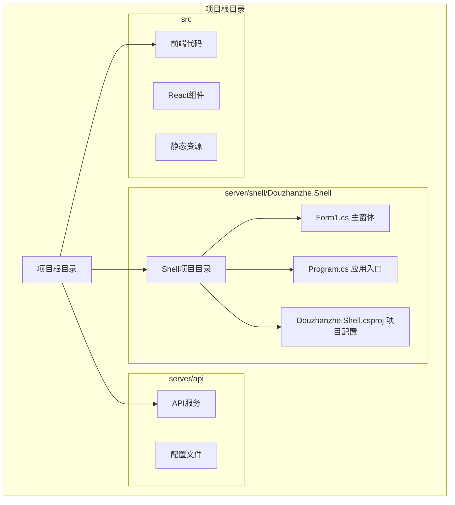
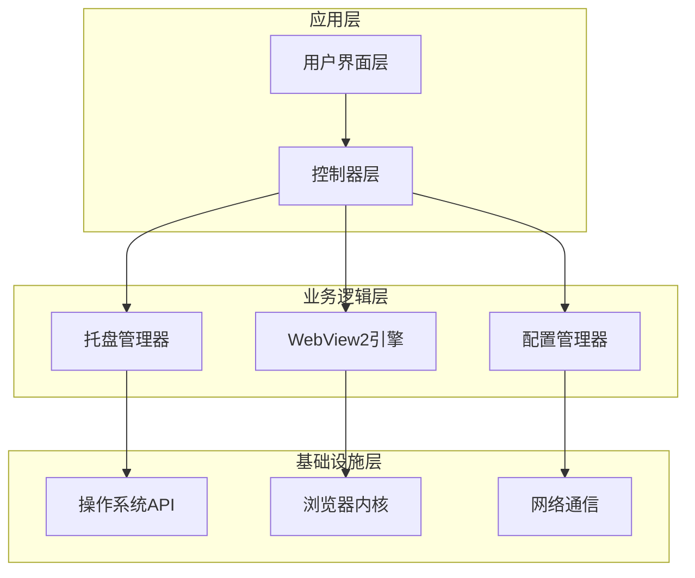
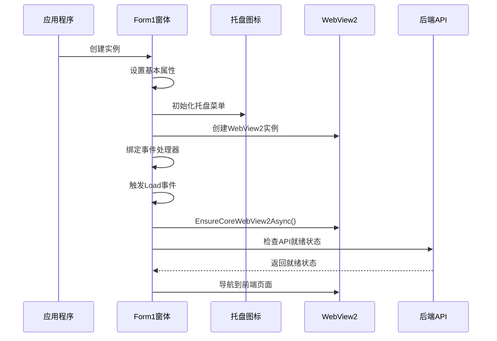
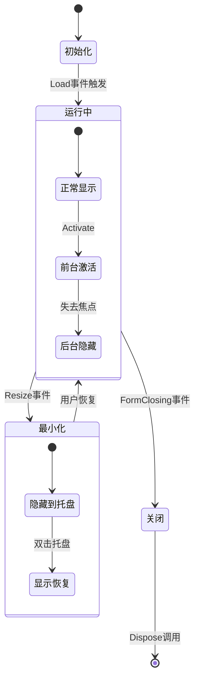
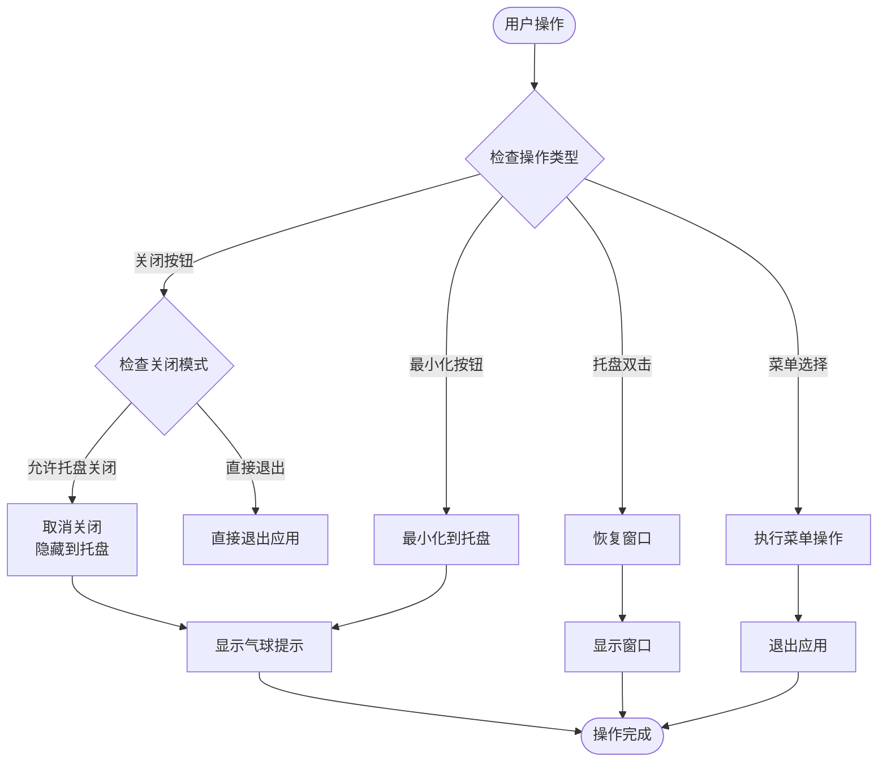
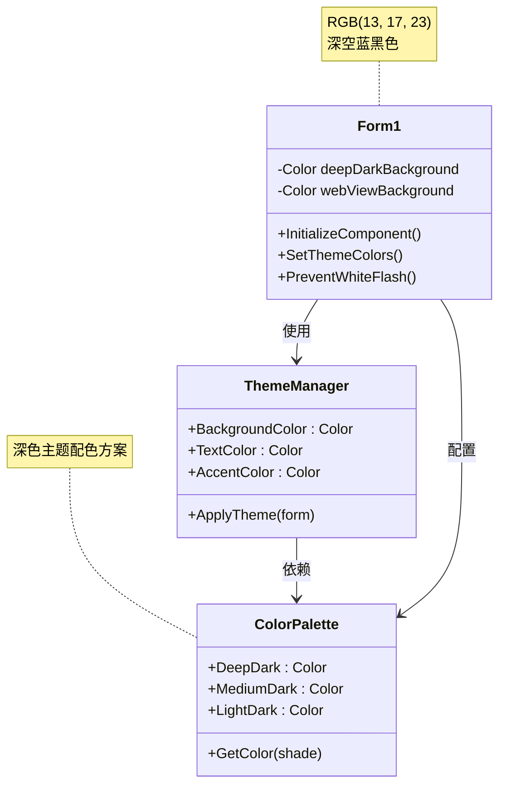
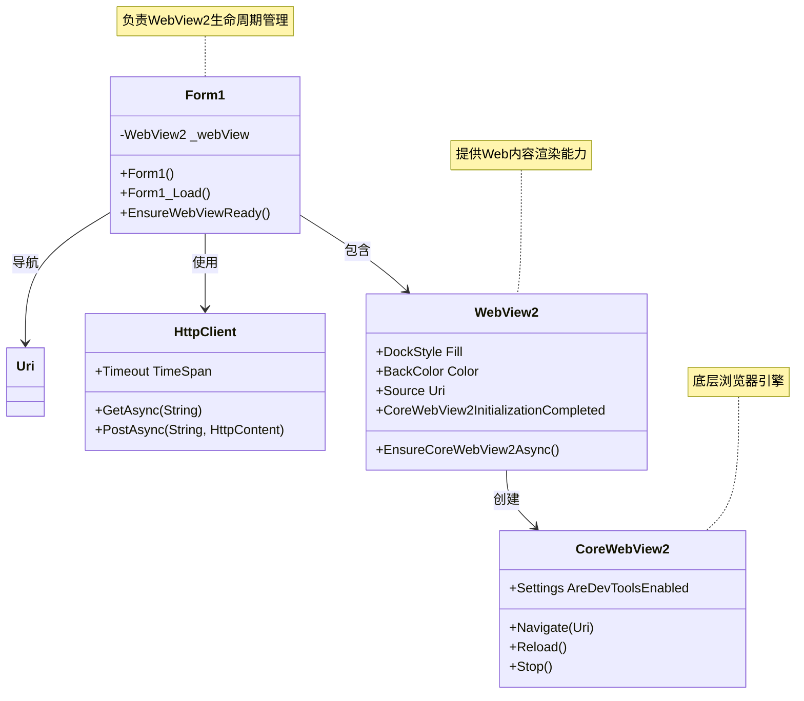
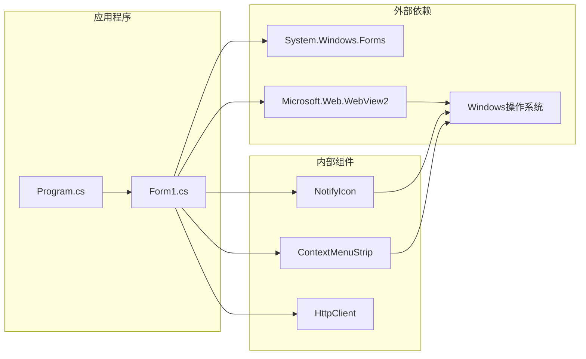

# WinForms主窗体设计

<cite>
**本文档引用的文件**
- [Form1.cs](file://server/shell/Douzhanzhe.Shell/Form1.cs)
- [Program.cs](file://server/shell/Douzhanzhe.Shell/Program.cs)
- [Douzhanzhe.Shell.csproj](file://server/shell/Douzhanzhe.Shell/Douzhanzhe.Shell.csproj)
</cite>

## 目录
1. [引言](#引言)
2. [项目结构](#项目结构)
3. [核心组件](#核心组件)
4. [架构概览](#架构概览)
5. [详细组件分析](#详细组件分析)
6. [依赖关系分析](#依赖关系分析)
7. [性能考虑](#性能考虑)
8. [故障排除指南](#故障排除指南)
9. [结论](#结论)

## 引言

本文件详细分析了基于WinForms的主窗体设计实现，重点围绕Form1类的架构设计、初始化流程、生命周期管理和功能特性。该应用程序采用现代WinForms技术栈，集成了WebView2浏览器组件，实现了桌面应用与Web前端的无缝结合。本文档旨在为开发者提供深入的技术理解，涵盖从基础架构到高级特性的完整知识体系。

## 项目结构

该项目采用分层架构设计，主要包含以下关键目录和文件：

**图表来源**
- [Douzhanzhe.Shell.csproj:1-16](file://server/shell/Douzhanzhe.Shell/Douzhanzhe.Shell.csproj#L1-L16)
- [Program.cs:1-11](file://server/shell/Douzhanzhe.Shell/Program.cs#L1-L11)

**章节来源**
- [Douzhanzhe.Shell.csproj:1-16](file://server/shell/Douzhanzhe.Shell/Douzhanzhe.Shell.csproj#L1-L16)
- [Program.cs:1-11](file://server/shell/Douzhanzhe.Shell/Program.cs#L1-L11)

## 核心组件

### Form1主窗体类

Form1是整个应用程序的核心组件，继承自System.Windows.Forms.Form基类，实现了完整的桌面应用程序界面。该类集成了多种功能模块，包括WebView2浏览器集成、系统托盘管理、窗口状态控制等。

### 关键特性概述

1. **深色主题设计**: 采用RGB(13, 17, 23)的深色背景，有效防止白屏闪烁现象
2. **WebView2集成**: 内置现代化浏览器引擎，支持现代Web技术
3. **系统托盘功能**: 支持最小化到托盘和从托盘恢复
4. **智能启动控制**: 支持命令行参数控制启动行为
5. **资源管理**: 完善的内存管理和资源释放机制

**章节来源**
- [Form1.cs:6-140](file://server/shell/Douzhanzhe.Shell/Form1.cs#L6-L140)

## 架构概览

应用程序采用分层架构设计，各组件职责明确，耦合度低，便于维护和扩展。

**图表来源**
- [Form1.cs:19-59](file://server/shell/Douzhanzhe.Shell/Form1.cs#L19-L59)
- [Program.cs:5-10](file://server/shell/Douzhanzhe.Shell/Program.cs#L5-L10)

## 详细组件分析

### 窗体初始化架构

Form1的初始化过程遵循严格的顺序，确保所有组件正确配置和就绪。

**图表来源**
- [Form1.cs:19-59](file://server/shell/Douzhanzhe.Shell/Form1.cs#L19-L59)
- [Form1.cs:61-92](file://server/shell/Douzhanzhe.Shell/Form1.cs#L61-L92)

#### 初始化流程详解

1. **属性配置阶段**: 设置窗体标题、尺寸、启动位置和图标
2. **事件绑定阶段**: 注册窗体关闭、调整大小等关键事件
3. **托盘初始化**: 创建上下文菜单和通知图标
4. **WebView2集成**: 配置浏览器组件并设置回调
5. **异步加载**: 等待后端API就绪后加载前端内容

**章节来源**
- [Form1.cs:19-59](file://server/shell/Douzhanzhe.Shell/Form1.cs#L19-L59)

### 生命周期管理

Form1实现了完整的生命周期管理，包括构造函数初始化、事件处理和资源清理。

**图表来源**
- [Form1.cs:94-127](file://server/shell/Douzhanzhe.Shell/Form1.cs#L94-L127)
- [Form1.cs:129-138](file://server/shell/Douzhanzhe.Shell/Form1.cs#L129-L138)

#### 关键生命周期事件

1. **构造函数**: 完成基本属性设置和组件初始化
2. **Load事件**: 处理启动参数和异步资源加载
3. **FormClosing事件**: 实现关闭到托盘功能
4. **Resize事件**: 处理最小化到托盘逻辑
5. **Dispose方法**: 清理所有托管和非托管资源

**章节来源**
- [Form1.cs:94-138](file://server/shell/Douzhanzhe.Shell/Form1.cs#L94-L138)

### 行为控制机制

应用程序实现了多种用户交互控制机制，提供灵活的用户体验。

**图表来源**
- [Form1.cs:94-127](file://server/shell/Douzhanzhe.Shell/Form1.cs#L94-L127)

#### 功能特性实现

1. **关闭到托盘**: 用户点击关闭按钮时，窗体被隐藏而非完全关闭
2. **最小化处理**: 窗体最小化时自动隐藏到系统托盘
3. **托盘交互**: 支持双击托盘图标恢复窗口
4. **菜单控制**: 提供显示窗口和退出应用的菜单选项

**章节来源**
- [Form1.cs:94-127](file://server/shell/Douzhanzhe.Shell/Form1.cs#L94-L127)

### 深色主题实现

应用程序采用了精心设计的深色主题方案，有效避免了常见的白屏闪烁问题。

**图表来源**
- [Form1.cs:24-25](file://server/shell/Douzhanzhe.Shell/Form1.cs#L24-L25)
- [Form1.cs:48-49](file://server/shell/Douzhanzhe.Shell/Form1.cs#L48-L49)

#### 防白闪机制

应用程序通过以下策略防止白屏闪烁：

1. **预设背景色**: 在窗体创建时立即设置深色背景
2. **WebView2背景同步**: 确保WebView2组件使用相同的深色背景
3. **渐进式加载**: 先设置背景再加载内容，避免空白期
4. **异常容错**: 即使初始化失败也保持深色主题一致性

**章节来源**
- [Form1.cs:24-25](file://server/shell/Douzhanzhe.Shell/Form1.cs#L24-L25)
- [Form1.cs:48-49](file://server/shell/Douzhanzhe.Shell/Form1.cs#L48-L49)

### WebView2集成架构

应用程序集成了现代WebView2浏览器引擎，提供强大的Web内容渲染能力。

**图表来源**
- [Form1.cs:45-56](file://server/shell/Douzhanzhe.Shell/Form1.cs#L45-L56)
- [Form1.cs:61-92](file://server/shell/Douzhanzhe.Shell/Form1.cs#L61-L92)

#### WebView2配置要点

1. **Dock填充**: WebView2占满整个窗体客户区
2. **深色背景**: 与应用程序主题保持一致
3. **开发工具禁用**: 生产环境关闭调试功能
4. **异步初始化**: 确保浏览器引擎完全就绪

**章节来源**
- [Form1.cs:45-56](file://server/shell/Douzhanzhe.Shell/Form1.cs#L45-L56)

## 依赖关系分析

应用程序的依赖关系清晰明确，主要依赖于.NET 8.0 Windows Forms框架和WebView2组件。

**图表来源**
- [Douzhanzhe.Shell.csproj:12-14](file://server/shell/Douzhanzhe.Shell/Douzhanzhe.Shell.csproj#L12-L14)
- [Program.cs:5-10](file://server/shell/Douzhanzhe.Shell/Program.cs#L5-L10)

### 核心依赖项

1. **System.Windows.Forms**: 提供WinForms基础UI框架
2. **Microsoft.Web.WebView2**: 现代浏览器引擎，基于Chromium
3. **Windows操作系统**: 提供系统托盘和通知功能

**章节来源**
- [Douzhanzhe.Shell.csproj:12-14](file://server/shell/Douzhanzhe.Shell/Douzhanzhe.Shell.csproj#L12-L14)

## 性能考虑

应用程序在设计时充分考虑了性能优化，特别是在启动速度和资源使用方面。

### 启动性能优化

1. **异步初始化**: WebView2组件采用异步初始化，避免阻塞主线程
2. **超时控制**: API就绪检测设置合理超时时间，防止无限等待
3. **渐进式加载**: 先显示深色背景，再加载Web内容

### 内存管理

1. **及时释放**: Dispose方法中正确释放所有资源
2. **弱引用**: 避免循环引用导致的内存泄漏
3. **事件解绑**: 窗体销毁时自动解绑事件处理器

## 故障排除指南

### 常见问题及解决方案

#### WebView2初始化失败

**问题症状**: 应用程序启动但Web内容无法加载

**可能原因**:
1. WebView2运行时未安装
2. 浏览器引擎初始化超时
3. 网络连接问题

**解决步骤**:
1. 检查WebView2运行时是否正确安装
2. 验证后端API服务是否正常运行
3. 查看应用程序日志获取详细错误信息

#### 托盘功能异常

**问题症状**: 托盘图标不显示或无法恢复窗口

**可能原因**:
1. 系统托盘权限问题
2. 托盘图标资源缺失
3. 事件处理器绑定失败

**解决步骤**:
1. 检查应用程序是否有托盘访问权限
2. 验证托盘图标资源文件是否存在
3. 重新启动应用程序测试功能

#### 深色主题显示异常

**问题症状**: 窗体背景色不正确或出现白屏闪烁

**可能原因**:
1. 颜色值设置错误
2. 控件层次顺序问题
3. 窗体重绘时机不当

**解决步骤**:
1. 验证颜色值格式是否正确
2. 检查控件的Dock属性设置
3. 确保在窗体Load事件之前设置背景色

**章节来源**
- [Form1.cs:74-92](file://server/shell/Douzhanzhe.Shell/Form1.cs#L74-L92)
- [Form1.cs:129-138](file://server/shell/Douzhanzhe.Shell/Form1.cs#L129-L138)

## 结论

本WinForms主窗体设计展现了现代桌面应用程序的最佳实践。通过精心设计的架构，应用程序实现了以下关键目标：

1. **功能完整性**: 集成了WebView2、系统托盘、深色主题等现代功能
2. **用户体验**: 提供流畅的启动体验和直观的用户交互
3. **性能优化**: 采用异步处理和资源管理策略
4. **可维护性**: 清晰的代码结构和完善的错误处理机制

该设计为类似的应用程序提供了优秀的参考模板，展示了如何在传统WinForms基础上集成现代Web技术，创造出既熟悉又现代化的用户体验。