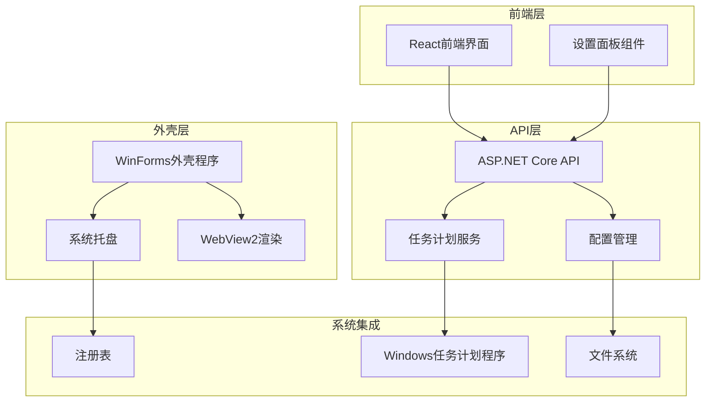
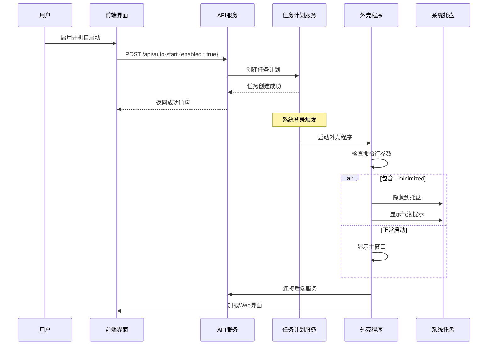
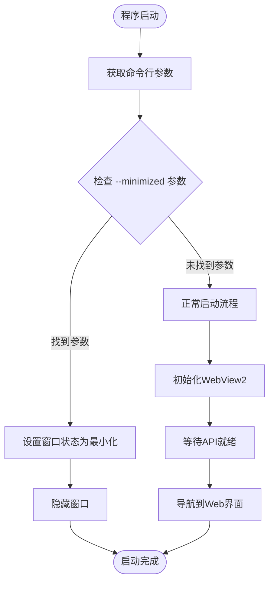
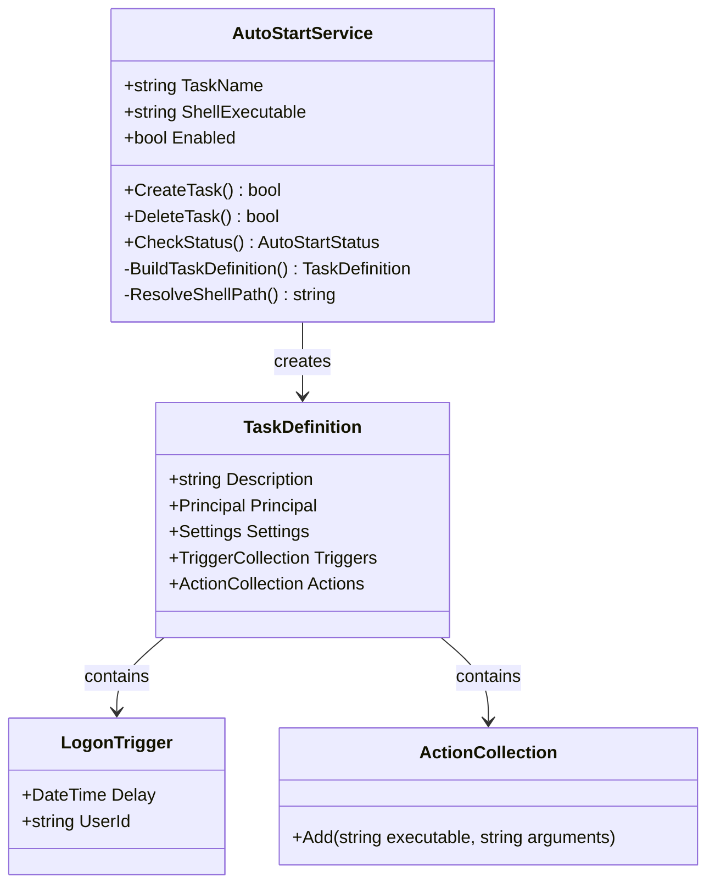
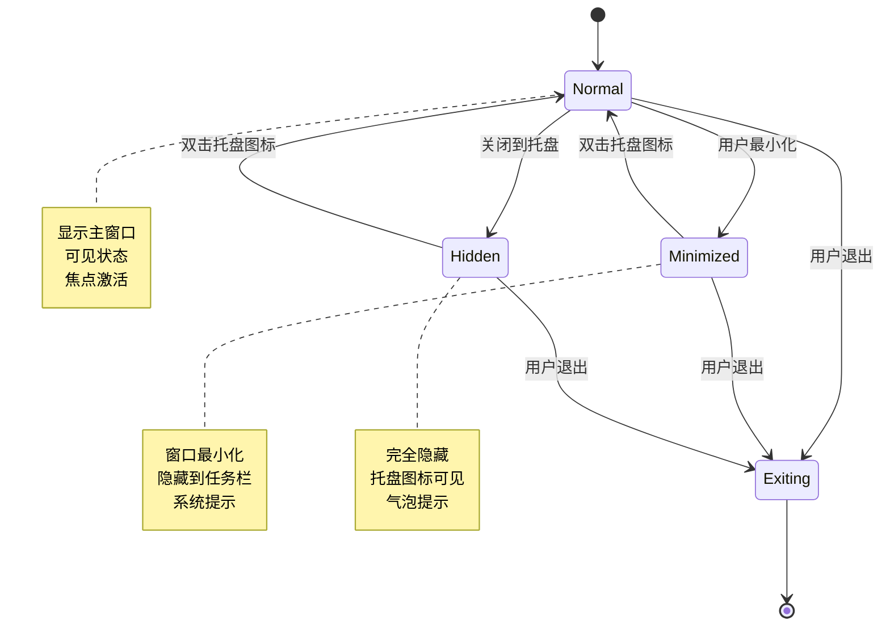
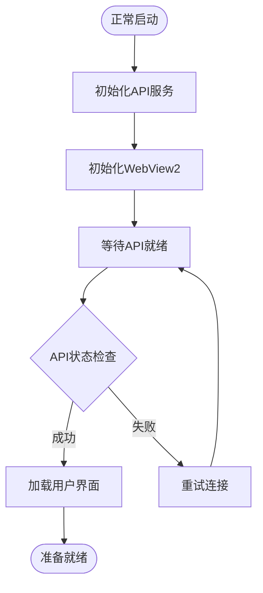
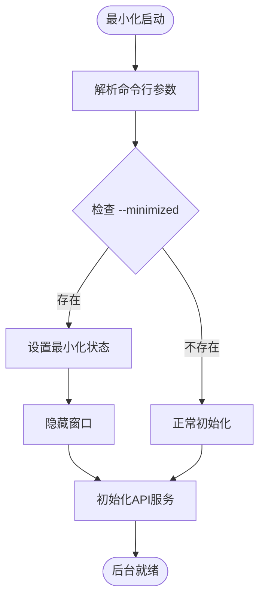
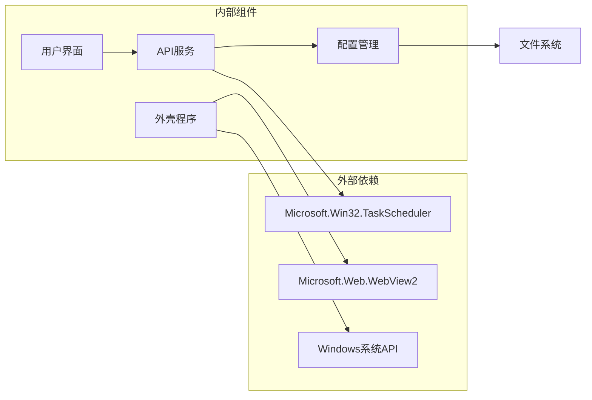

# 开机自启动机制

<cite>
**本文档引用的文件**
- [Program.cs](file://server/api/Program.cs)
- [Form1.cs](file://server/shell/Douzhanzhe.Shell/Form1.cs)
- [SettingsPanel.jsx](file://src/components/panels/SettingsPanel.jsx)
- [auto-start-opts.json](file://server/api/bin/build/config/auto-start-opts.json)
</cite>

## 目录
1. [简介](#简介)
2. [项目结构](#项目结构)
3. [核心组件](#核心组件)
4. [架构概览](#架构概览)
5. [详细组件分析](#详细组件分析)
6. [依赖关系分析](#依赖关系分析)
7. [性能考虑](#性能考虑)
8. [故障排除指南](#故障排除指南)
9. [结论](#结论)

## 简介

本文档深入解析Douzhanzhe Console项目的开机自启动机制，这是一个基于.NET 8.0构建的Windows应用程序，包含桌面外壳程序和Web API服务。该机制通过Windows任务计划程序实现系统级开机自启动，并提供了灵活的窗口行为控制选项。

自启动机制的核心特点包括：
- 基于Windows任务计划程序的可靠启动
- 支持最小化启动模式，隐藏到系统托盘
- 用户友好的配置界面
- 静默启动体验优化

## 项目结构

该项目采用分层架构设计，主要包含以下核心模块：

**图表来源**
- [Program.cs:1-783](file://server/api/Program.cs#L1-L783)
- [Form1.cs:1-140](file://server/shell/Douzhanzhe.Shell/Form1.cs#L1-L140)

**章节来源**
- [Program.cs:1-783](file://server/api/Program.cs#L1-L783)
- [Form1.cs:1-140](file://server/shell/Douzhanzhe.Shell/Form1.cs#L1-L140)

## 核心组件

### 1. 任务计划服务组件

任务计划服务是自启动机制的核心，负责在系统启动时自动运行应用程序。该组件实现了完整的生命周期管理，包括任务创建、删除和状态查询。

### 2. 命令行参数处理器

外壳程序实现了智能的命令行参数解析，特别是对`--minimized`参数的支持，用于控制启动时的窗口行为。

### 3. 配置管理系统

配置系统提供了持久化的用户偏好设置，包括最小化启动选项和任务计划配置。

### 4. 用户界面组件

React前端提供了直观的设置界面，允许用户轻松配置自启动行为和偏好设置。

**章节来源**
- [Program.cs:585-686](file://server/api/Program.cs#L585-L686)
- [Form1.cs:61-92](file://server/shell/Douzhanzhe.Shell/Form1.cs#L61-L92)
- [SettingsPanel.jsx:8-48](file://src/components/panels/SettingsPanel.jsx#L8-L48)

## 架构概览

自启动机制的整体架构采用事件驱动的设计模式，通过多个组件协同工作实现完整的启动流程：

**图表来源**
- [Program.cs:621-686](file://server/api/Program.cs#L621-L686)
- [Form1.cs:61-92](file://server/shell/Douzhanzhe.Shell/Form1.cs#L61-L92)

## 详细组件分析

### 命令行参数处理机制

#### 参数解析逻辑

外壳程序实现了精确的命令行参数解析，重点关注`--minimized`参数的识别和处理：

**图表来源**
- [Form1.cs:61-92](file://server/shell/Douzhanzhe.Shell/Form1.cs#L61-L92)

#### 参数处理复杂度分析

- **时间复杂度**: O(n)，其中n为命令行参数数量
- **空间复杂度**: O(n)，用于存储参数数组
- **算法特性**: 线性扫描匹配，大小写不敏感比较

**章节来源**
- [Form1.cs:61-92](file://server/shell/Douzhanzhe.Shell/Form1.cs#L61-L92)

### 自启动判断逻辑

#### 任务计划器集成

API服务通过Microsoft.Win32.TaskScheduler库实现与Windows任务计划程序的深度集成：

**图表来源**
- [Program.cs:621-686](file://server/api/Program.cs#L621-L686)

#### 最小化偏好处理

配置系统实现了灵活的最小化偏好管理，支持用户自定义启动行为：

**章节来源**
- [Program.cs:621-686](file://server/api/Program.cs#L621-L686)
- [auto-start-opts.json:1-1](file://server/api/bin/build/config/auto-start-opts.json#L1-L1)

### 窗口行为控制机制

#### 托盘集成设计

外壳程序实现了完整的系统托盘集成功能，提供优雅的后台运行体验：

**图表来源**
- [Form1.cs:94-119](file://server/shell/Douzhanzhe.Shell/Form1.cs#L94-L119)

#### 用户体验优化

托盘系统提供了丰富的交互反馈机制：

- **气泡提示**: 提供状态更新和操作确认
- **双击恢复**: 快速恢复窗口显示
- **上下文菜单**: 完整的操作入口
- **图标状态**: 反映应用程序状态

**章节来源**
- [Form1.cs:94-119](file://server/shell/Douzhanzhe.Shell/Form1.cs#L94-L119)

### 用户体验设计策略

#### 静默启动策略

系统实现了智能的静默启动策略，确保最佳用户体验：

1. **无干扰启动**: 默认情况下不显示任何窗口
2. **后台服务优先**: 先启动API服务，再启动UI
3. **渐进式加载**: 逐步建立各组件间的连接
4. **错误容错**: 即使部分组件失败也保持系统稳定

#### 托盘通知策略

托盘通知系统提供了多层次的信息传达机制：

- **启动完成通知**: 确认应用程序已完全就绪
- **状态变更提醒**: 关键操作的状态反馈
- **错误提示**: 异常情况的用户友好提示
- **帮助信息**: 快速访问常用功能

**章节来源**
- [Form1.cs:94-119](file://server/shell/Douzhanzhe.Shell/Form1.cs#L94-L119)

### 启动方式区别分析

#### 正常启动流程

正常启动模式提供完整的用户界面体验：

#### 最小化启动流程

最小化启动模式专注于后台运行：

**图表来源**
- [Form1.cs:61-92](file://server/shell/Douzhanzhe.Shell/Form1.cs#L61-L92)

**章节来源**
- [Form1.cs:61-92](file://server/shell/Douzhanzhe.Shell/Form1.cs#L61-L92)

## 依赖关系分析

### 组件耦合度分析

自启动机制展现了良好的模块化设计，各组件间保持适当的松耦合：

**图表来源**
- [Program.cs:1-783](file://server/api/Program.cs#L1-L783)
- [Form1.cs:1-140](file://server/shell/Douzhanzhe.Shell/Form1.cs#L1-L140)

### 循环依赖检测

经过分析，项目中不存在循环依赖关系，所有依赖都遵循单向依赖原则，确保了系统的稳定性和可维护性。

**章节来源**
- [Program.cs:1-783](file://server/api/Program.cs#L1-L783)
- [Form1.cs:1-140](file://server/shell/Douzhanzhe.Shell/Form1.cs#L1-L140)

## 性能考虑

### 启动性能优化

自启动机制在性能方面采用了多项优化策略：

1. **异步初始化**: 使用异步模式避免阻塞主线程
2. **超时控制**: 设置合理的超时时间防止无限等待
3. **资源复用**: 重用已初始化的组件减少重复开销
4. **延迟加载**: 按需加载非关键组件

### 内存管理

- **及时释放**: 确保所有可释放资源得到正确清理
- **垃圾回收**: 利用.NET的自动内存管理机制
- **资源池**: 对频繁使用的资源进行池化管理

## 故障排除指南

### 常见问题诊断

#### 任务计划程序问题

**症状**: 开机后应用程序未启动
**排查步骤**:
1. 检查任务计划程序中是否存在"DouzhanzheControl"任务
2. 验证任务的执行权限和用户账户
3. 查看任务执行历史记录中的错误信息
4. 确认外壳程序路径是否正确

#### 窗口显示问题

**症状**: 应用程序启动但无法看到窗口
**排查步骤**:
1. 检查命令行参数中是否包含`--minimized`
2. 验证系统托盘区域是否有应用程序图标
3. 尝试手动启动应用程序以排除参数问题
4. 检查Windows显示设置和多显示器配置

#### API连接问题

**症状**: 外壳程序无法连接到后端API服务
**排查步骤**:
1. 确认API服务端口(3100)未被防火墙阻止
2. 检查本地网络连接状态
3. 验证API服务的健康检查端点
4. 查看应用程序日志中的错误信息

### 配置文件问题

**症状**: 自启动偏好设置不生效
**解决方案**:
1. 检查`auto-start-opts.json`文件的格式和内容
2. 确认文件权限允许应用程序读写
3. 验证JSON格式的有效性
4. 重新设置偏好选项以刷新配置

**章节来源**
- [Program.cs:621-686](file://server/api/Program.cs#L621-L686)
- [Form1.cs:61-92](file://server/shell/Douzhanzhe.Shell/Form1.cs#L61-L92)

## 结论

Douzhanzhe Console项目的开机自启动机制展现了现代Windows应用程序的最佳实践。通过精心设计的架构和用户友好的功能，该机制成功实现了：

1. **可靠性**: 基于Windows任务计划程序的稳定启动
2. **灵活性**: 支持多种启动模式和用户偏好
3. **用户体验**: 优雅的静默启动和托盘集成
4. **可维护性**: 清晰的代码结构和完善的错误处理

该机制为类似的应用程序提供了优秀的参考模板，展示了如何在保证功能完整性的同时优化用户体验。