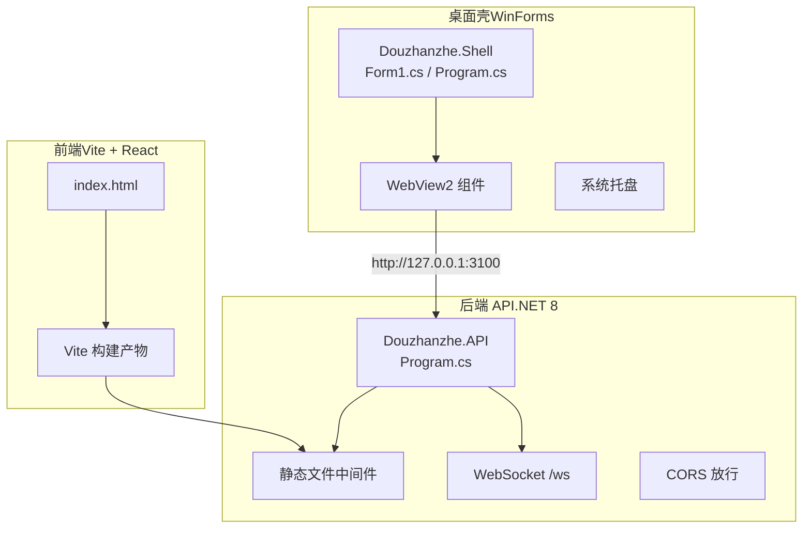
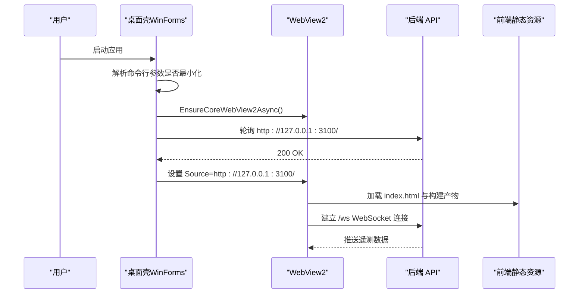
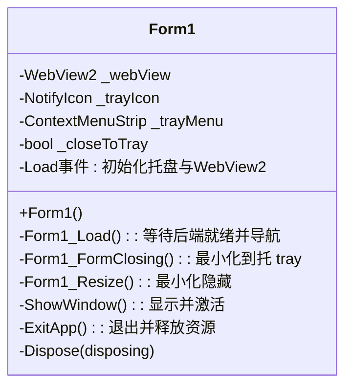
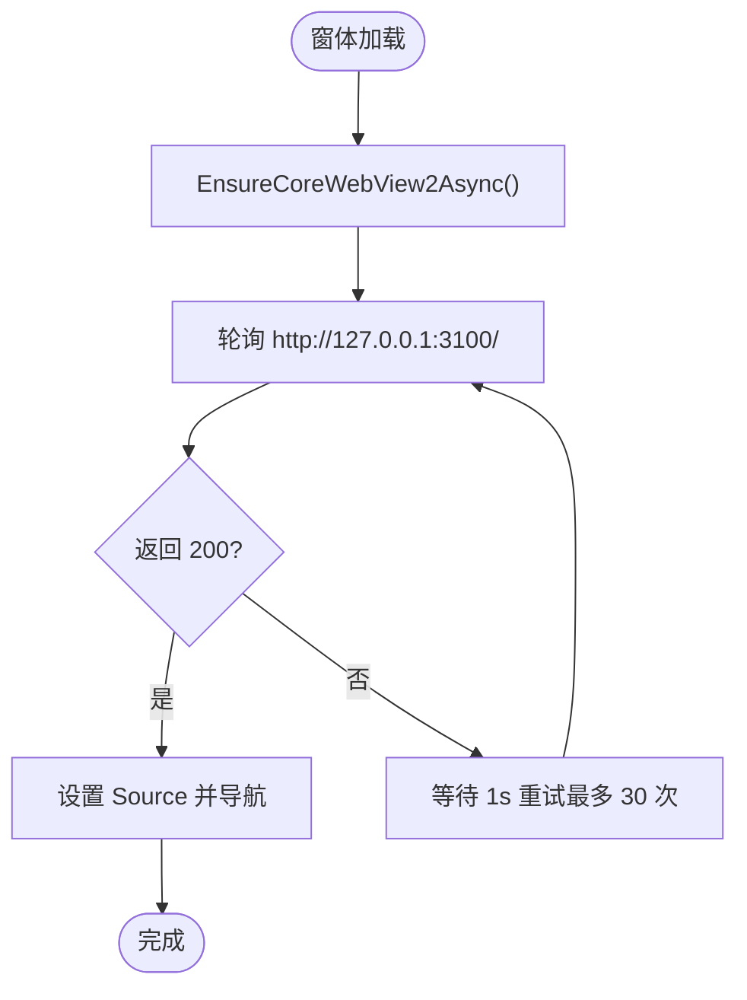
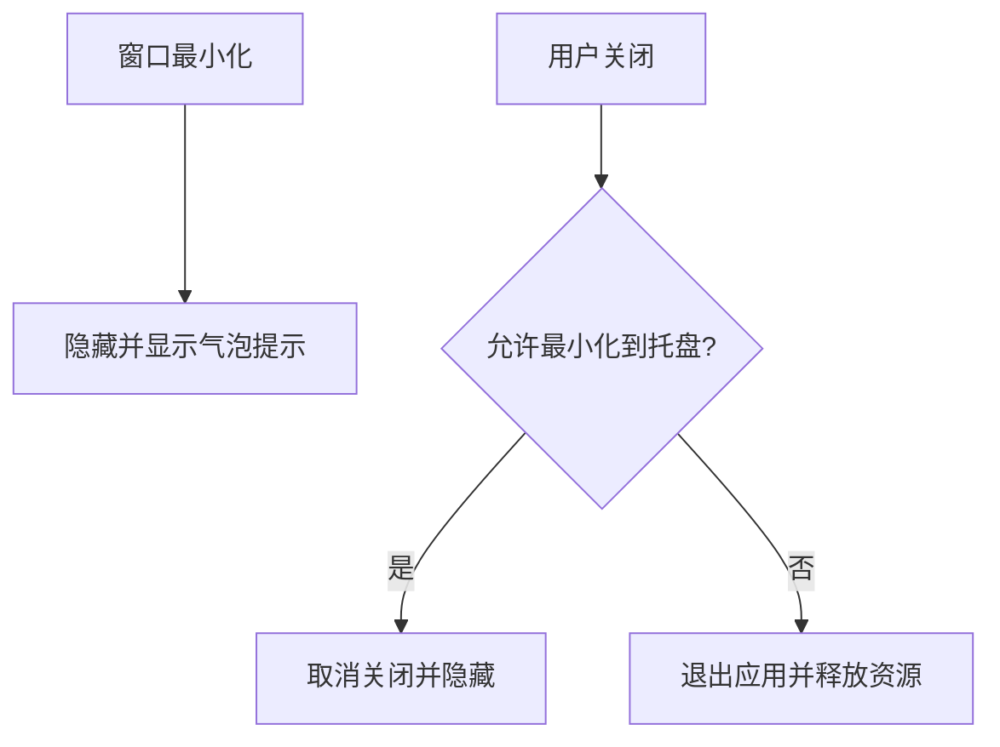
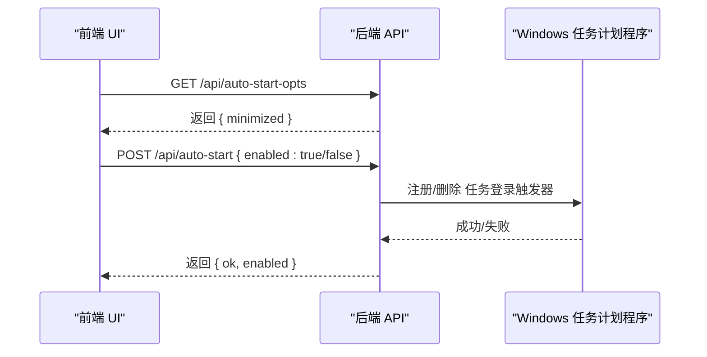
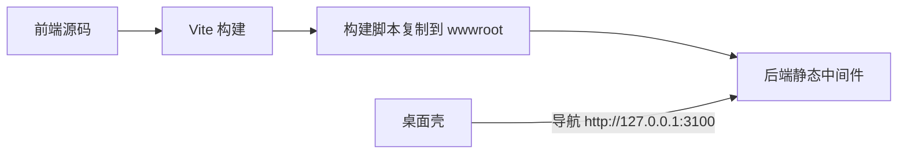
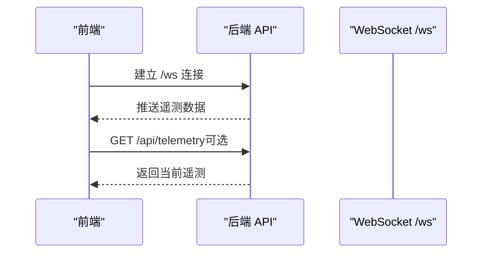
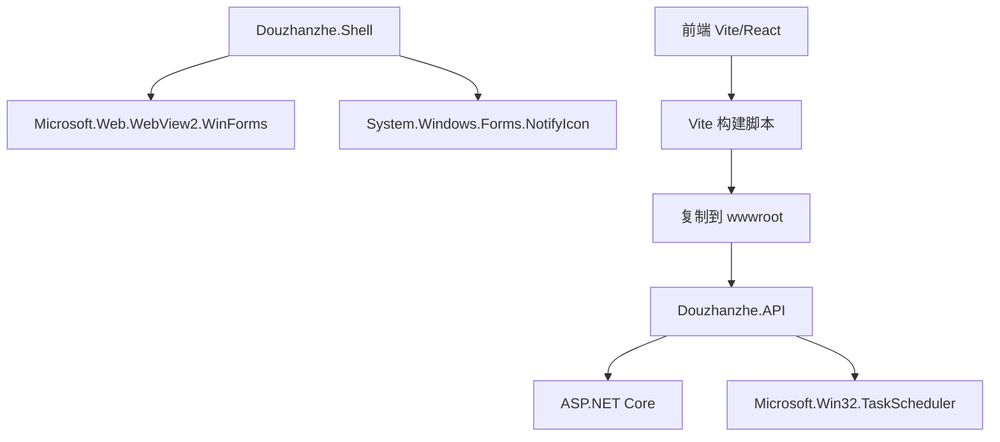

# 桌面壳应用

<cite>
**本文引用的文件**
- [Form1.cs](file://server/shell/Douzhanzhe.Shell/Form1.cs)
- [Program.cs](file://server/shell/Douzhanzhe.Shell/Program.cs)
- [Program.cs](file://server/api/Program.cs)
- [index.html](file://index.html)
- [package.json](file://package.json)
- [dashboard-default.json](file://server/config/dashboard-default.json)
</cite>

## 目录
1. [简介](#简介)
2. [项目结构](#项目结构)
3. [核心组件](#核心组件)
4. [架构总览](#架构总览)
5. [详细组件分析](#详细组件分析)
6. [依赖关系分析](#依赖关系分析)
7. [性能考量](#性能考量)
8. [故障排查指南](#故障排查指南)
9. [结论](#结论)
10. [附录](#附录)

## 简介
本项目为“斗战者控制台”桌面壳应用，采用 WinForms + WebView2 技术在 Windows 上承载前端 Web 应用，并通过本地 HTTP/WebSocket 服务向 Web 提供硬件遥测与控制能力。桌面壳负责：
- 主窗体生命周期与托盘交互
- WebView2 初始化与导航
- 本地服务发现与延迟导航
- 开机自启动（Windows 任务计划程序）集成
- 基础 UI 定制与持久化配置

后端 API 使用 ASP.NET Core 提供 REST/WS 接口，前端基于 Vite + React 构建并通过构建脚本自动发布到后端静态资源目录。

## 项目结构
项目采用分层组织：
- server/shell：WinForms 桌面壳工程，包含主窗体与入口程序
- server/api：ASP.NET Core 后端 API，提供硬件控制与遥测接口
- server/config：共享配置目录（JSON）
- src：前端源码（React/Vite）
- 根目录：打包与构建脚本、入口 HTML

图表来源
- [Form1.cs:19-92](file://server/shell/Douzhanzhe.Shell/Form1.cs#L19-L92)
- [Program.cs:1-783](file://server/api/Program.cs#L1-L783)
- [index.html:1-14](file://index.html#L1-L14)
- [package.json:1-33](file://package.json#L1-L33)

章节来源
- [Form1.cs:19-139](file://server/shell/Douzhanzhe.Shell/Form1.cs#L19-L139)
- [Program.cs:1-11](file://server/shell/Douzhanzhe.Shell/Program.cs#L1-L11)
- [Program.cs:1-783](file://server/api/Program.cs#L1-L783)
- [index.html:1-14](file://index.html#L1-L14)
- [package.json:1-33](file://package.json#L1-L33)

## 核心组件
- 桌面壳主窗体（Form1）
  - 负责 WebView2 初始化、导航、托盘图标管理、最小化行为与退出流程
  - 通过命令行参数支持开机自启时的“最小化启动”
- 后端 API（Program.cs）
  - 提供静态文件服务与回退页面，映射多组硬件控制与遥测接口
  - 内置 WebSocket 遥测通道
  - 提供开机自启动（Windows 任务计划程序）相关接口
- 前端（Vite + React）
  - 构建后产物复制到后端 wwwroot，由后端静态中间件提供
  - 通过 HTTP/WS 与后端交互

章节来源
- [Form1.cs:19-139](file://server/shell/Douzhanzhe.Shell/Form1.cs#L19-L139)
- [Program.cs:1-783](file://server/api/Program.cs#L1-L783)
- [index.html:1-14](file://index.html#L1-L14)
- [package.json:1-33](file://package.json#L1-L33)

## 架构总览
桌面壳以 WinForms 作为宿主，WebView2 承载 Web 应用；后端 API 在本地 3100 端口提供 HTTP/WS 服务。桌面壳在启动时等待后端就绪，随后导航至本地地址。前端通过 HTTP 获取静态资源，通过 WebSocket 订阅遥测数据。

图表来源
- [Form1.cs:61-92](file://server/shell/Douzhanzhe.Shell/Form1.cs#L61-L92)
- [Program.cs:15-22](file://server/api/Program.cs#L15-L22)
- [Program.cs:56-86](file://server/api/Program.cs#L56-L86)

## 详细组件分析

### 桌面壳主窗体（Form1）
职责与行为
- 窗体初始化：设置标题、尺寸、深色背景、图标
- 托盘图标：右键菜单包含“显示主窗口”“退出”，双击恢复窗口
- WebView2：填充布局，禁用开发者工具，等待后端就绪后导航
- 生命周期：最小化到托盘、关闭时可取消并隐藏、退出时释放资源
- 自启动参数：识别 --minimized，用于开机自启时隐藏窗口

图表来源
- [Form1.cs:6-139](file://server/shell/Douzhanzhe.Shell/Form1.cs#L6-L139)

章节来源
- [Form1.cs:19-139](file://server/shell/Douzhanzhe.Shell/Form1.cs#L19-L139)

### WebView2 集成与导航流程
- 先 EnsureCoreWebView2Async，再轮询后端健康检查，超时也尝试导航
- 导航目标：http://127.0.0.1:3100/
- 禁用开发者工具，避免调试态对白屏的干扰

图表来源
- [Form1.cs:61-92](file://server/shell/Douzhanzhe.Shell/Form1.cs#L61-L92)

章节来源
- [Form1.cs:61-92](file://server/shell/Douzhanzhe.Shell/Form1.cs#L61-L92)

### 系统托盘功能
- 图标与菜单：显示主窗口、退出
- 双击托盘：恢复主窗口
- 最小化行为：最小化到托盘并提示
- 关闭行为：若允许最小化到托盘则取消关闭并隐藏

图表来源
- [Form1.cs:94-127](file://server/shell/Douzhanzhe.Shell/Form1.cs#L94-L127)

章节来源
- [Form1.cs:94-127](file://server/shell/Douzhanzhe.Shell/Form1.cs#L94-L127)

### 开机自启动（Windows 任务计划程序）
- 后端提供 /api/auto-start 与 /api/auto-start-opts 接口
- 前端通过 /api/auto-start-opts 读取最小化偏好
- 后端根据偏好在任务计划程序中注册登录触发器，执行桌面壳并附加 --minimized 参数
- 若已存在任务则删除

图表来源
- [Program.cs:586-686](file://server/api/Program.cs#L586-L686)

章节来源
- [Program.cs:586-686](file://server/api/Program.cs#L586-L686)

### 桌面壳与 Web 应用的集成
- 前端构建：Vite 构建后复制到 server/api/wwwroot
- 静态资源：后端 UseStaticFiles + MapFallbackToFile 提供
- 导航：桌面壳在后端就绪后导航到 http://127.0.0.1:3100/

图表来源
- [package.json:6-10](file://package.json#L6-L10)
- [Program.cs:20-22](file://server/api/Program.cs#L20-L22)
- [Form1.cs:80-92](file://server/shell/Douzhanzhe.Shell/Form1.cs#L80-L92)

章节来源
- [package.json:6-10](file://package.json#L6-L10)
- [Program.cs:20-22](file://server/api/Program.cs#L20-L22)
- [Form1.cs:80-92](file://server/shell/Douzhanzhe.Shell/Form1.cs#L80-L92)

### 数据流与遥测
- WebSocket：/ws 通道推送遥测数据
- HTTP：/api/telemetry 提供一次性遥测查询
- 前端通过 WebSocket 订阅实时数据

图表来源
- [Program.cs:56-86](file://server/api/Program.cs#L56-L86)
- [Program.cs:87-120](file://server/api/Program.cs#L87-L120)

章节来源
- [Program.cs:56-86](file://server/api/Program.cs#L56-L86)
- [Program.cs:87-120](file://server/api/Program.cs#L87-L120)

## 依赖关系分析
- 桌面壳依赖 WebView2.WinForms 与系统托盘组件
- 后端依赖 ASP.NET Core、TaskScheduler（Windows 任务计划程序）
- 前端依赖 Vite、React 生态，构建脚本将产物复制到后端静态目录

图表来源
- [Form1.cs:1-2](file://server/shell/Douzhanzhe.Shell/Form1.cs#L1-L2)
- [Program.cs:8](file://server/api/Program.cs#L8)
- [package.json:6-10](file://package.json#L6-L10)

章节来源
- [Form1.cs:1-2](file://server/shell/Douzhanzhe.Shell/Form1.cs#L1-L2)
- [Program.cs:8](file://server/api/Program.cs#L8)
- [package.json:6-10](file://package.json#L6-L10)

## 性能考量
- WebView2 初始化与后端就绪检测：采用异步 EnsureCoreWebView2Async 与轮询，避免阻塞 UI
- 遥测推送：WebSocket 保持长连接，前端按需订阅，减少不必要的 HTTP 请求
- 静态资源：后端统一托管，减少跨域与额外网络往返
- 托盘提示：最小化/关闭时弹出提示，降低用户误操作成本

## 故障排查指南
常见问题与定位建议
- 后端未就绪导致导航失败
  - 现象：桌面壳多次重试后仍无法导航
  - 排查：确认后端监听 3100 端口、静态文件中间件启用、回退页面可用
  - 参考路径：[Form1.cs:74-92](file://server/shell/Douzhanzhe.Shell/Form1.cs#L74-L92)，[Program.cs:20-22](file://server/api/Program.cs#L20-L22)
- WebSocket 遥测不更新
  - 现象：前端无数据或连接异常
  - 排查：确认 /ws 路由、WebSocket 中间件、客户端连接逻辑
  - 参考路径：[Program.cs:56-86](file://server/api/Program.cs#L56-L86)
- 托盘图标不显示或菜单无效
  - 现象：托盘无图标或右键菜单不可用
  - 排查：确认 NotifyIcon 初始化、图标资源、菜单项绑定
  - 参考路径：[Form1.cs:31-43](file://server/shell/Douzhanzhe.Shell/Form1.cs#L31-L43)
- 开机自启动未生效
  - 现象：登录后未自动启动或未最小化
  - 排查：确认任务计划程序任务存在、执行路径正确、最小化偏好写入
  - 参考路径：[Program.cs:621-686](file://server/api/Program.cs#L621-L686)
- 前端资源 404
  - 现象：页面空白或资源加载失败
  - 排查：确认构建脚本已执行、产物复制到 wwwroot、MapFallbackToFile 正常工作
  - 参考路径：[package.json:6-10](file://package.json#L6-L10)，[Program.cs:20-22](file://server/api/Program.cs#L20-L22)，[index.html:1-14](file://index.html#L1-L14)

章节来源
- [Form1.cs:74-92](file://server/shell/Douzhanzhe.Shell/Form1.cs#L74-L92)
- [Program.cs:56-86](file://server/api/Program.cs#L56-L86)
- [Program.cs:621-686](file://server/api/Program.cs#L621-L686)
- [package.json:6-10](file://package.json#L6-L10)
- [Program.cs:20-22](file://server/api/Program.cs#L20-L22)
- [index.html:1-14](file://index.html#L1-L14)

## 结论
该桌面壳应用通过 WinForms + WebView2 实现轻量级宿主，结合本地 ASP.NET Core API 提供硬件控制与遥测能力。其设计要点在于：
- 桌面壳负责用户体验与系统集成（托盘、最小化、自启动）
- 后端专注业务与硬件抽象，提供稳定接口
- 前后端通过本地 HTTP/WS 无缝协作，构建一致的控制台体验

## 附录

### 定制指南
- 外观修改
  - 窗体尺寸与背景色：参考窗体构造函数中的尺寸与背景设置
  - 图标：使用 AssociatedIcon 或替换为自定义图标
  - 参考路径：[Form1.cs:21-26](file://server/shell/Douzhanzhe.Shell/Form1.cs#L21-L26)
- 功能扩展
  - 新增托盘菜单项：在托盘菜单初始化处添加新项并绑定事件
  - 参考路径：[Form1.cs:32-34](file://server/shell/Douzhanzhe.Shell/Form1.cs#L32-L34)
- 用户体验优化
  - 导航等待策略：调整轮询间隔与超时次数
  - 参考路径：[Form1.cs:75-89](file://server/shell/Douzhanzhe.Shell/Form1.cs#L75-L89)
- 配置持久化
  - UI 状态与默认仪表盘配置：通过 /api/ui-state 与 /api/default-config 读写 JSON 文件
  - 参考路径：[Program.cs:553-568](file://server/api/Program.cs#L553-L568)，[Program.cs:569-584](file://server/api/Program.cs#L569-L584)，[dashboard-default.json](file://server/config/dashboard-default.json)

章节来源
- [Form1.cs:21-26](file://server/shell/Douzhanzhe.Shell/Form1.cs#L21-L26)
- [Form1.cs:32-34](file://server/shell/Douzhanzhe.Shell/Form1.cs#L32-L34)
- [Form1.cs:75-89](file://server/shell/Douzhanzhe.Shell/Form1.cs#L75-L89)
- [Program.cs:553-568](file://server/api/Program.cs#L553-L568)
- [Program.cs:569-584](file://server/api/Program.cs#L569-L584)
- [dashboard-default.json](file://server/config/dashboard-default.json)