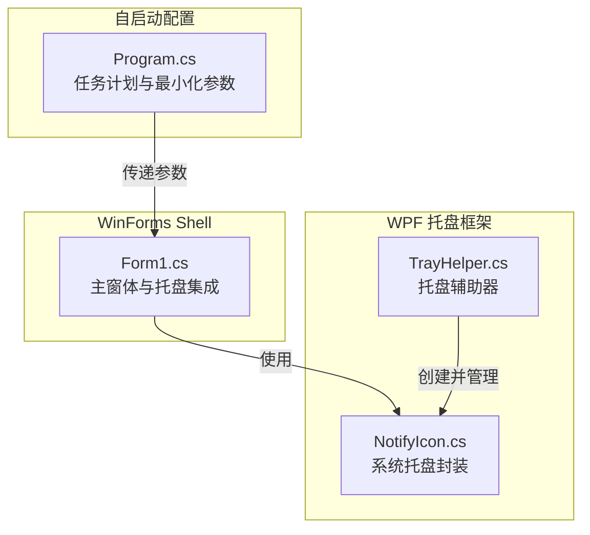
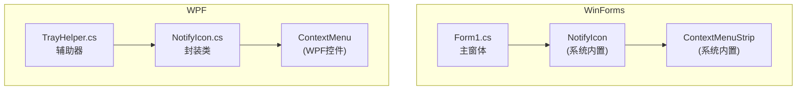
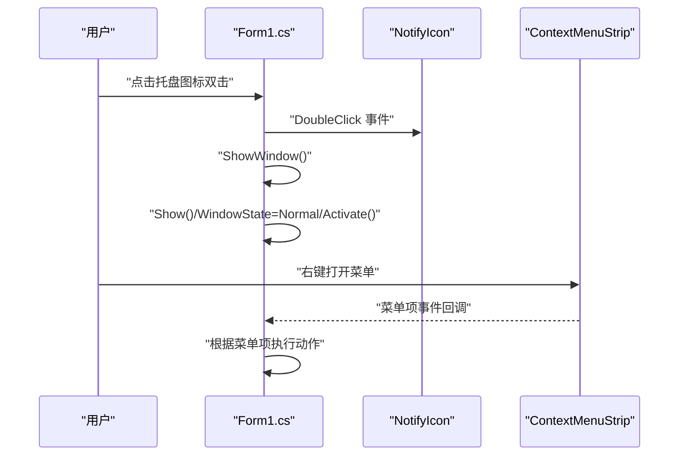
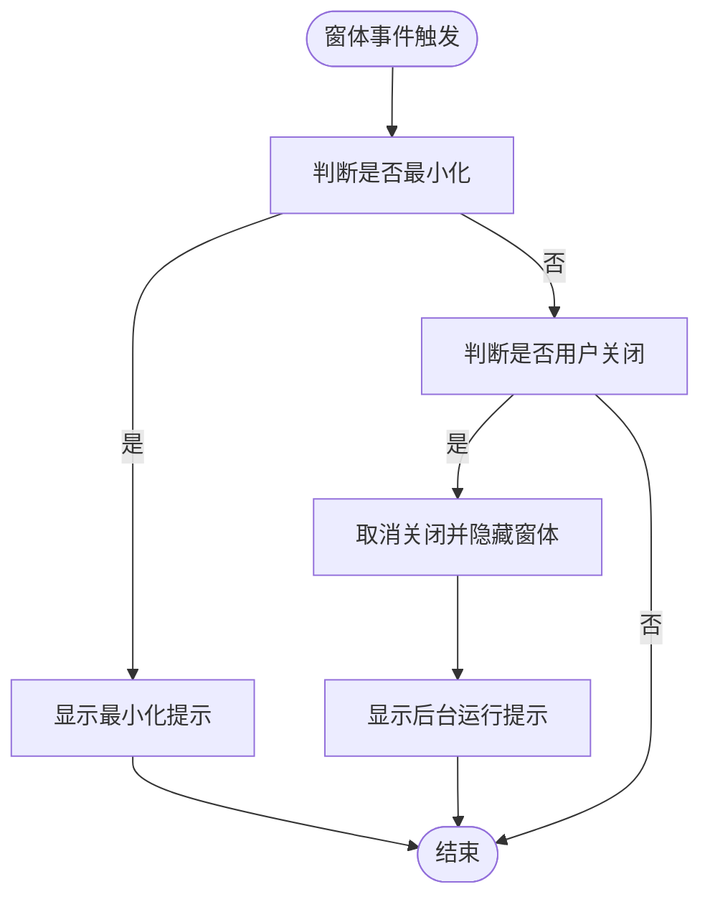
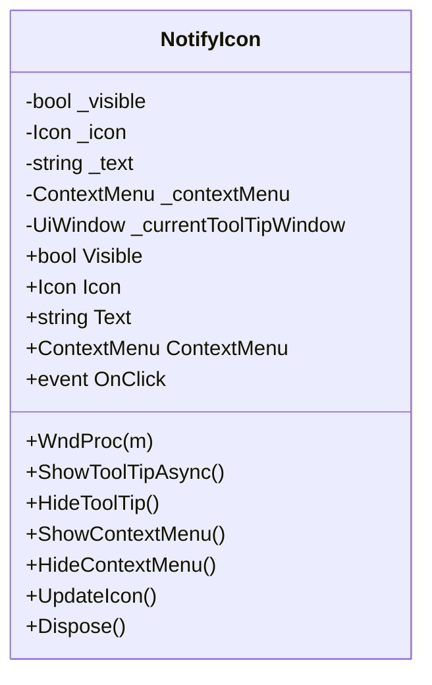
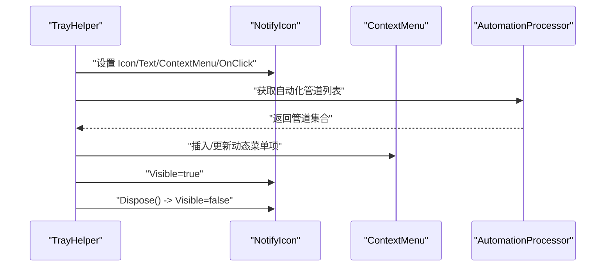
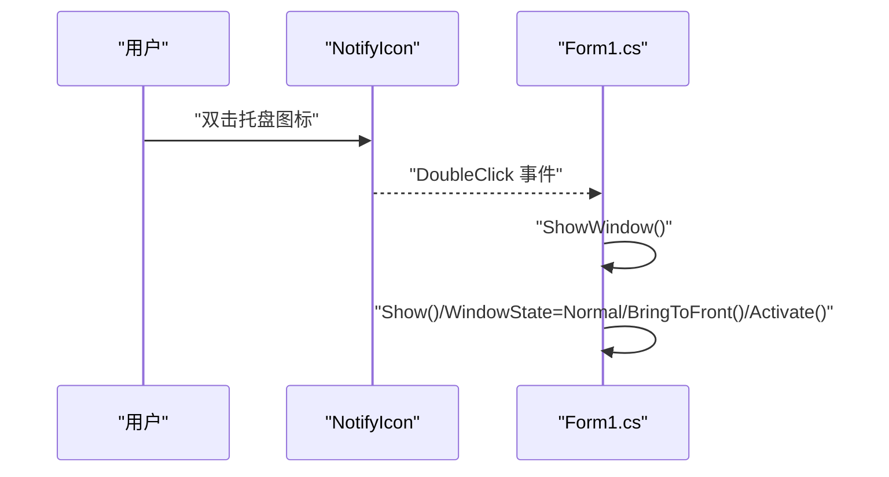
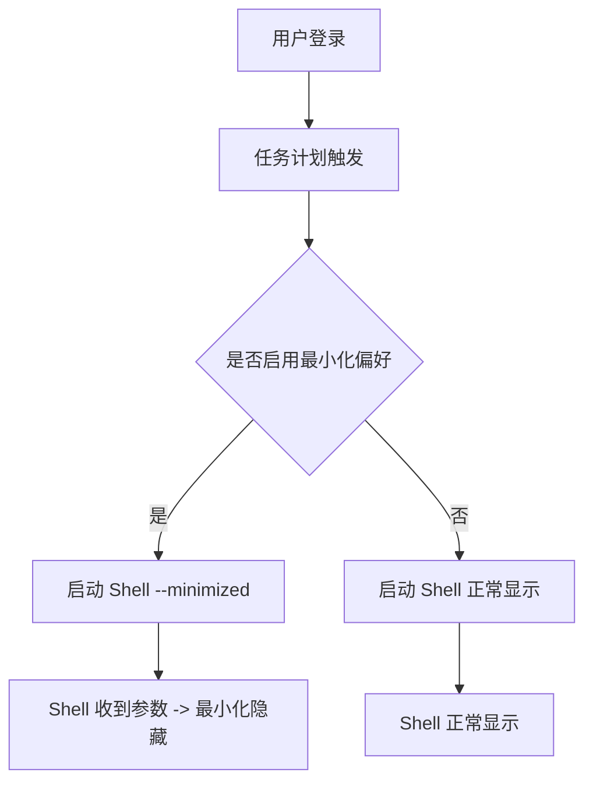
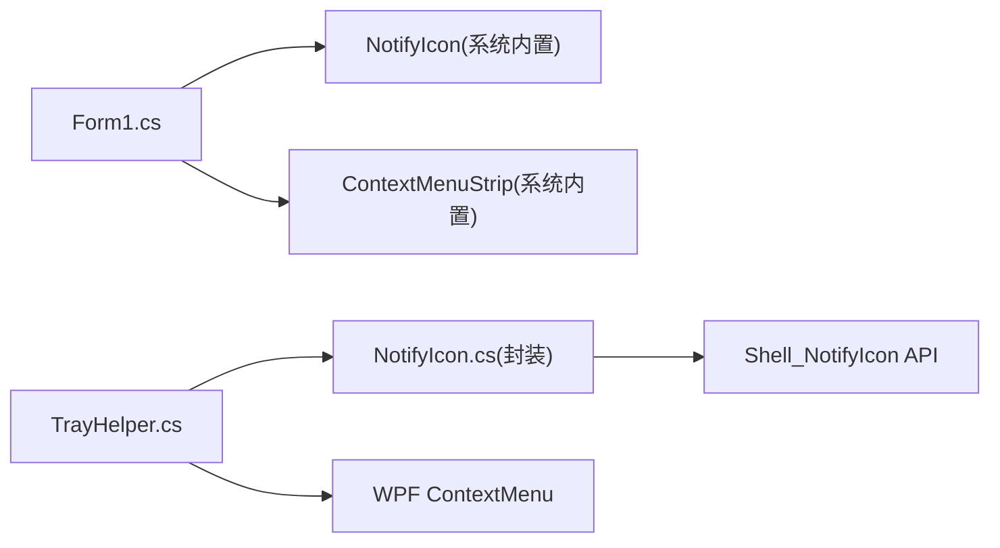

# 系统托盘管理

<cite>
**本文档引用的文件**
- [Form1.cs](file://server/shell/Douzhanzhe.Shell/Form1.cs)
- [NotifyIcon.cs](file://llt-reference/LenovoLegionToolkit.WPF/Utils/NotifyIcon.cs)
- [TrayHelper.cs](file://llt-reference/LenovoLegionToolkit.WPF/Utils/TrayHelper.cs)
- [Program.cs](file://server/api/Program.cs)
</cite>

## 目录
1. [简介](#简介)
2. [项目结构](#项目结构)
3. [核心组件](#核心组件)
4. [架构总览](#架构总览)
5. [详细组件分析](#详细组件分析)
6. [依赖关系分析](#依赖关系分析)
7. [性能考虑](#性能考虑)
8. [故障排除指南](#故障排除指南)
9. [结论](#结论)
10. [附录](#附录)

## 简介
本文件面向系统托盘管理的技术实现，围绕以下目标展开：
- NotifyIcon 的实现架构：托盘图标的加载、可见性控制与文本设置
- 右键菜单系统：ContextMenuStrip 的创建、菜单项配置与事件处理
- 托盘通知机制：气泡提示的显示、图标状态与用户交互响应
- 托盘图标的双击事件处理：窗口显示与激活逻辑
- 托盘功能的定制指南：图标修改、菜单扩展与通知优化

该实现同时参考了 WinForms 与 WPF 的两种模式，前者在 Shell 层直接使用 NotifyIcon 与 ContextMenuStrip，后者通过封装的 NotifyIcon 类与 TrayHelper 提供更丰富的上下文菜单与动态自动化项。

## 项目结构
本项目的系统托盘相关代码主要分布在以下位置：
- WinForms 实现：位于 Shell 工程中的主窗体，负责托盘图标、右键菜单与最小化行为
- WPF 实现：位于参考工程中，提供可复用的 NotifyIcon 封装类与 TrayHelper 辅助类
- 自启动集成：API 层负责根据用户偏好参数决定是否以最小化方式启动 Shell

**图表来源**
- [Form1.cs:19-59](file://server/shell/Douzhanzhe.Shell/Form1.cs#L19-L59)
- [NotifyIcon.cs:20-84](file://llt-reference/LenovoLegionToolkit.WPF/Utils/NotifyIcon.cs#L20-L84)
- [TrayHelper.cs:37-57](file://llt-reference/LenovoLegionToolkit.WPF/Utils/TrayHelper.cs#L37-L57)
- [Program.cs:648-675](file://server/api/Program.cs#L648-L675)

**章节来源**
- [Form1.cs:1-140](file://server/shell/Douzhanzhe.Shell/Form1.cs#L1-L140)
- [NotifyIcon.cs:1-277](file://llt-reference/LenovoLegionToolkit.WPF/Utils/NotifyIcon.cs#L1-L277)
- [TrayHelper.cs:1-162](file://llt-reference/LenovoLegionToolkit.WPF/Utils/TrayHelper.cs#L1-L162)
- [Program.cs:648-675](file://server/api/Program.cs#L648-L675)

## 核心组件
- 托盘图标与菜单（WinForms）：在主窗体中创建 NotifyIcon 与 ContextMenuStrip，并绑定双击显示窗口、关闭应用等事件
- 托盘通知（WinForms）：在窗体最小化与关闭时通过 ShowBalloonTip 显示提示
- 托盘封装（WPF）：NotifyIcon 封装底层 Shell_NotifyIcon 调用，支持图标、文本、可见性、上下文菜单与工具提示窗口
- 托盘辅助器（WPF）：TrayHelper 动态构建右键菜单，包含导航项、静态操作与自动化管道项

**章节来源**
- [Form1.cs:31-43](file://server/shell/Douzhanzhe.Shell/Form1.cs#L31-L43)
- [Form1.cs:94-111](file://server/shell/Douzhanzhe.Shell/Form1.cs#L94-L111)
- [NotifyIcon.cs:20-84](file://llt-reference/LenovoLegionToolkit.WPF/Utils/NotifyIcon.cs#L20-L84)
- [TrayHelper.cs:28-57](file://llt-reference/LenovoLegionToolkit.WPF/Utils/TrayHelper.cs#L28-L57)

## 架构总览
WinForms 与 WPF 两套实现共享同一目标：在系统托盘中提供稳定的图标、菜单与通知能力。WinForms 版本直接使用 .NET 提供的 NotifyIcon 与 ContextMenuStrip；WPF 版本通过封装类与辅助器提供更灵活的菜单与动态项。

**图表来源**
- [Form1.cs:31-43](file://server/shell/Douzhanzhe.Shell/Form1.cs#L31-L43)
- [NotifyIcon.cs:20-84](file://llt-reference/LenovoLegionToolkit.WPF/Utils/NotifyIcon.cs#L20-L84)
- [TrayHelper.cs:28-57](file://llt-reference/LenovoLegionToolkit.WPF/Utils/TrayHelper.cs#L28-L57)

## 详细组件分析

### 托盘图标与菜单（WinForms）
- 图标加载：从可执行文件提取关联图标作为默认图标
- 菜单创建：创建 ContextMenuStrip 并添加“显示主窗口”“退出”菜单项
- 绑定事件：双击托盘图标触发显示主窗口；窗体关闭时拦截并最小化到托盘
- 可见性控制：通过 Visible 属性切换托盘图标显示

**图表来源**
- [Form1.cs:31-43](file://server/shell/Douzhanzhe.Shell/Form1.cs#L31-L43)
- [Form1.cs:113-119](file://server/shell/Douzhanzhe.Shell/Form1.cs#L113-L119)

**章节来源**
- [Form1.cs:13-17](file://server/shell/Douzhanzhe.Shell/Form1.cs#L13-L17)
- [Form1.cs:31-43](file://server/shell/Douzhanzhe.Shell/Form1.cs#L31-L43)
- [Form1.cs:94-111](file://server/shell/Douzhanzhe.Shell/Form1.cs#L94-L111)
- [Form1.cs:113-119](file://server/shell/Douzhanzhe.Shell/Form1.cs#L113-L119)

### 托盘通知机制（WinForms）
- 最小化通知：窗体最小化时显示气泡提示，告知已进入系统托盘
- 关闭通知：用户尝试关闭窗体时，取消关闭并最小化，同时显示提示说明程序仍在后台运行

**图表来源**
- [Form1.cs:104-111](file://server/shell/Douzhanzhe.Shell/Form1.cs#L104-L111)
- [Form1.cs:94-101](file://server/shell/Douzhanzhe.Shell/Form1.cs#L94-L101)

**章节来源**
- [Form1.cs:94-111](file://server/shell/Douzhanzhe.Shell/Form1.cs#L94-L111)

### 托盘封装与菜单（WPF）
- NotifyIcon 封装：内部维护图标、文本、可见性与上下文菜单，通过 Shell_NotifyIcon API 完成添加、修改、删除与版本设置
- 事件处理：捕获托盘消息，区分左键弹起（点击）、右键弹起（显示菜单）与弹出/关闭（显示/隐藏工具提示）
- 上下文菜单：支持 WPF 的 ContextMenu，自动置顶并设置为鼠标位置
- 工具提示窗口：可选的异步工具提示窗口，带延迟显示与取消逻辑

**图表来源**
- [NotifyIcon.cs:20-84](file://llt-reference/LenovoLegionToolkit.WPF/Utils/NotifyIcon.cs#L20-L84)
- [NotifyIcon.cs:86-133](file://llt-reference/LenovoLegionToolkit.WPF/Utils/NotifyIcon.cs#L86-L133)
- [NotifyIcon.cs:135-184](file://llt-reference/LenovoLegionToolkit.WPF/Utils/NotifyIcon.cs#L135-L184)
- [NotifyIcon.cs:186-206](file://llt-reference/LenovoLegionToolkit.WPF/Utils/NotifyIcon.cs#L186-L206)
- [NotifyIcon.cs:208-255](file://llt-reference/LenovoLegionToolkit.WPF/Utils/NotifyIcon.cs#L208-L255)
- [NotifyIcon.cs:257-277](file://llt-reference/LenovoLegionToolkit.WPF/Utils/NotifyIcon.cs#L257-L277)

**章节来源**
- [NotifyIcon.cs:20-84](file://llt-reference/LenovoLegionToolkit.WPF/Utils/NotifyIcon.cs#L20-L84)
- [NotifyIcon.cs:86-133](file://llt-reference/LenovoLegionToolkit.WPF/Utils/NotifyIcon.cs#L86-L133)
- [NotifyIcon.cs:135-184](file://llt-reference/LenovoLegionToolkit.WPF/Utils/NotifyIcon.cs#L135-L184)
- [NotifyIcon.cs:186-206](file://llt-reference/LenovoLegionToolkit.WPF/Utils/NotifyIcon.cs#L186-L206)
- [NotifyIcon.cs:208-255](file://llt-reference/LenovoLegionToolkit.WPF/Utils/NotifyIcon.cs#L208-L255)
- [NotifyIcon.cs:257-277](file://llt-reference/LenovoLegionToolkit.WPF/Utils/NotifyIcon.cs#L257-L277)

### 托盘辅助器（WPF）
- 静态菜单项：包含导航项、打开、关闭等静态操作
- 动态菜单项：基于自动化管道生成可执行项，支持插入与更新
- 主题适配：监听主题变化，同步更新菜单资源
- 可见性控制：对外暴露 MakeVisible 与 Dispose，统一托盘图标生命周期

**图表来源**
- [TrayHelper.cs:37-57](file://llt-reference/LenovoLegionToolkit.WPF/Utils/TrayHelper.cs#L37-L57)
- [TrayHelper.cs:59-66](file://llt-reference/LenovoLegionToolkit.WPF/Utils/TrayHelper.cs#L59-L66)
- [TrayHelper.cs:68-106](file://llt-reference/LenovoLegionToolkit.WPF/Utils/TrayHelper.cs#L68-L106)
- [TrayHelper.cs:108-141](file://llt-reference/LenovoLegionToolkit.WPF/Utils/TrayHelper.cs#L108-L141)
- [TrayHelper.cs:143-149](file://llt-reference/LenovoLegionToolkit.WPF/Utils/TrayHelper.cs#L143-L149)
- [TrayHelper.cs:151-160](file://llt-reference/LenovoLegionToolkit.WPF/Utils/TrayHelper.cs#L151-L160)

**章节来源**
- [TrayHelper.cs:19-57](file://llt-reference/LenovoLegionToolkit.WPF/Utils/TrayHelper.cs#L19-L57)
- [TrayHelper.cs:59-66](file://llt-reference/LenovoLegionToolkit.WPF/Utils/TrayHelper.cs#L59-L66)
- [TrayHelper.cs:68-106](file://llt-reference/LenovoLegionToolkit.WPF/Utils/TrayHelper.cs#L68-L106)
- [TrayHelper.cs:108-141](file://llt-reference/LenovoLegionToolkit.WPF/Utils/TrayHelper.cs#L108-L141)
- [TrayHelper.cs:143-149](file://llt-reference/LenovoLegionToolkit.WPF/Utils/TrayHelper.cs#L143-L149)
- [TrayHelper.cs:151-160](file://llt-reference/LenovoLegionToolkit.WPF/Utils/TrayHelper.cs#L151-L160)

### 双击事件与窗口激活（WinForms）
- 双击托盘图标：触发 ShowWindow，恢复主窗体显示并激活
- 窗口激活：设置 Normal 状态、置前并激活，确保用户体验一致

**图表来源**
- [Form1.cs](file://server/shell/Douzhanzhe.Shell/Form1.cs#L43)
- [Form1.cs:113-119](file://server/shell/Douzhanzhe.Shell/Form1.cs#L113-L119)

**章节来源**
- [Form1.cs](file://server/shell/Douzhanzhe.Shell/Form1.cs#L43)
- [Form1.cs:113-119](file://server/shell/Douzhanzhe.Shell/Form1.cs#L113-L119)

### 自启动与最小化偏好（API 层）
- 任务计划：在登录时启动 Shell，根据配置决定是否传入 --minimized 参数
- Shell 行为：接收 --minimized 后，启动即最小化并隐藏窗体

**图表来源**
- [Program.cs:648-675](file://server/api/Program.cs#L648-L675)
- [Form1.cs:63-69](file://server/shell/Douzhanzhe.Shell/Form1.cs#L63-L69)

**章节来源**
- [Program.cs:648-675](file://server/api/Program.cs#L648-L675)
- [Form1.cs:63-69](file://server/shell/Douzhanzhe.Shell/Form1.cs#L63-L69)

## 依赖关系分析
- WinForms 侧：Form1 直接依赖系统内置的 NotifyIcon 与 ContextMenuStrip，通过事件驱动完成托盘交互
- WPF 侧：NotifyIcon 封装底层 Shell_NotifyIcon API，TrayHelper 负责菜单构建与生命周期管理
- 事件耦合：双击、右键、弹出/关闭等消息在封装类中统一处理，避免上层重复实现
- 外部依赖：WPF 版本引入 Windows.Win32 与 WPF 控件集，WinForms 版本依赖 System.Windows.Forms

**图表来源**
- [Form1.cs:31-43](file://server/shell/Douzhanzhe.Shell/Form1.cs#L31-L43)
- [NotifyIcon.cs:208-255](file://llt-reference/LenovoLegionToolkit.WPF/Utils/NotifyIcon.cs#L208-L255)
- [TrayHelper.cs:28-57](file://llt-reference/LenovoLegionToolkit.WPF/Utils/TrayHelper.cs#L28-L57)

**章节来源**
- [Form1.cs:31-43](file://server/shell/Douzhanzhe.Shell/Form1.cs#L31-L43)
- [NotifyIcon.cs:208-255](file://llt-reference/LenovoLegionToolkit.WPF/Utils/NotifyIcon.cs#L208-L255)
- [TrayHelper.cs:28-57](file://llt-reference/LenovoLegionToolkit.WPF/Utils/TrayHelper.cs#L28-L57)

## 性能考虑
- 延迟显示工具提示：WPF 封装中对工具提示采用延迟显示与取消机制，避免频繁闪烁
- 资源释放：Dispose 中统一释放图标、菜单与句柄，防止内存泄漏
- 事件处理：仅在需要时更新托盘状态，减少不必要的 Shell_NotifyIcon 调用
- UI 线程：WinForms 中的菜单与托盘操作均在 UI 线程内完成，保证一致性

**章节来源**
- [NotifyIcon.cs:135-184](file://llt-reference/LenovoLegionToolkit.WPF/Utils/NotifyIcon.cs#L135-L184)
- [NotifyIcon.cs:257-277](file://llt-reference/LenovoLegionToolkit.WPF/Utils/NotifyIcon.cs#L257-L277)
- [Form1.cs:129-138](file://server/shell/Douzhanzhe.Shell/Form1.cs#L129-L138)

## 故障排除指南
- 托盘图标不显示
  - 检查 Visible 属性是否被设置为 true
  - 确认 UpdateIcon 中的句柄创建与 Shell_NotifyIcon 调用成功
- 右键菜单无法打开
  - 确认 ContextMenu/ContextMenuStrip 已正确赋值
  - 查看 WndProc 中对右键弹起消息的处理
- 气泡提示未出现
  - 确认 ShowBalloonTip 的调用时机与参数（标题、正文、时长）
  - 检查系统托盘区域的通知权限
- 双击无响应
  - 确认 DoubleClick 事件绑定与 ShowWindow 的调用链
  - 验证窗口状态与激活流程

**章节来源**
- [NotifyIcon.cs:86-133](file://llt-reference/LenovoLegionToolkit.WPF/Utils/NotifyIcon.cs#L86-L133)
- [NotifyIcon.cs:186-206](file://llt-reference/LenovoLegionToolkit.WPF/Utils/NotifyIcon.cs#L186-L206)
- [Form1.cs:94-111](file://server/shell/Douzhanzhe.Shell/Form1.cs#L94-L111)
- [Form1.cs:113-119](file://server/shell/Douzhanzhe.Shell/Form1.cs#L113-L119)

## 结论
本项目提供了两套系统托盘实现方案：
- WinForms 方案：简洁直接，适合快速集成托盘图标、菜单与通知
- WPF 方案：功能丰富，支持动态菜单、工具提示窗口与主题适配

两者均遵循统一的事件模型与生命周期管理，可根据产品形态选择合适的实现方式，并在此基础上进行图标、菜单与通知的定制扩展。

## 附录

### 定制指南：图标修改
- WinForms：设置 NotifyIcon 的 Icon 属性即可替换图标
- WPF：通过 NotifyIcon 的 Icon 属性或构造函数注入图标资源

**章节来源**
- [Form1.cs:36-42](file://server/shell/Douzhanzhe.Shell/Form1.cs#L36-L42)
- [NotifyIcon.cs:44-53](file://llt-reference/LenovoLegionToolkit.WPF/Utils/NotifyIcon.cs#L44-L53)

### 定制指南：菜单扩展
- WinForms：向 ContextMenuStrip 添加新项并绑定事件
- WPF：通过 TrayHelper 初始化静态项与动态项，或直接设置 ContextMenu

**章节来源**
- [Form1.cs:32-34](file://server/shell/Douzhanzhe.Shell/Form1.cs#L32-L34)
- [TrayHelper.cs:68-106](file://llt-reference/LenovoLegionToolkit.WPF/Utils/TrayHelper.cs#L68-L106)
- [TrayHelper.cs:108-141](file://llt-reference/LenovoLegionToolkit.WPF/Utils/TrayHelper.cs#L108-L141)

### 定制指南：通知优化
- WinForms：根据场景调整 ShowBalloonTip 的标题、正文与时长
- WPF：可选地启用 ToolTipWindow，实现富文本或复杂 UI 的工具提示

**章节来源**
- [Form1.cs:100-109](file://server/shell/Douzhanzhe.Shell/Form1.cs#L100-L109)
- [NotifyIcon.cs:67-75](file://llt-reference/LenovoLegionToolkit.WPF/Utils/NotifyIcon.cs#L67-L75)