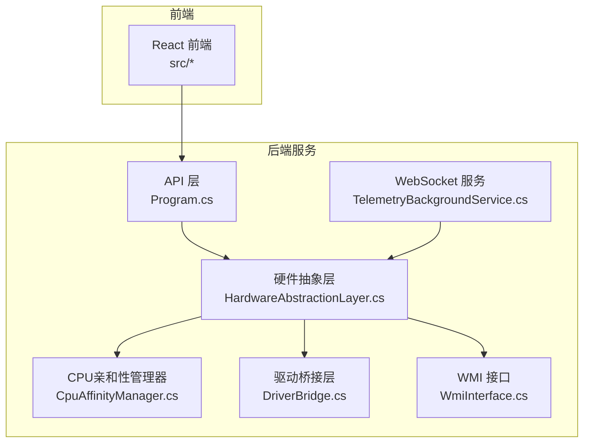
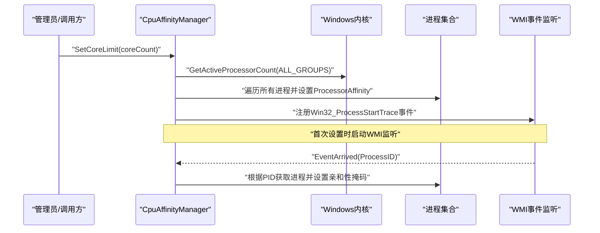
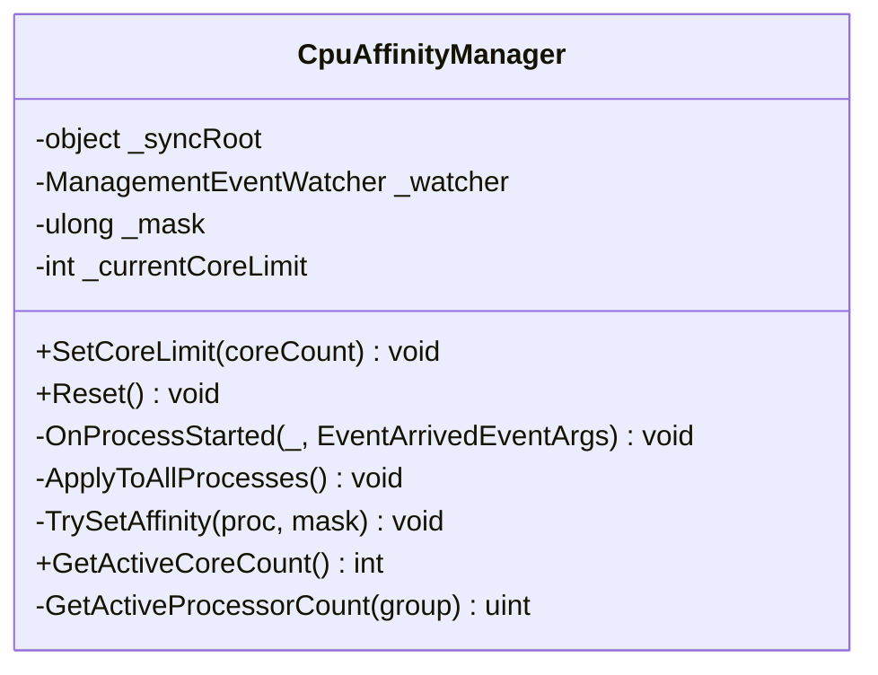
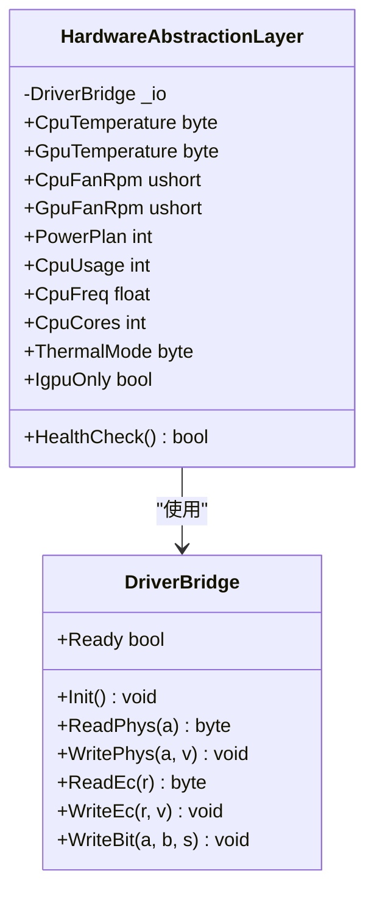
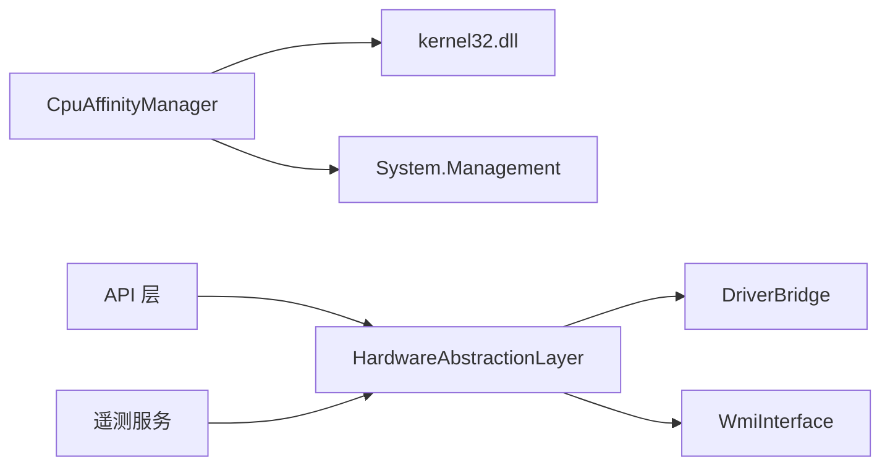

# CPU亲和性管理器

<cite>
**本文档引用的文件**
- [CpuAffinityManager.cs](file://server/hal/CpuAffinityManager.cs)
- [HardwareAbstractionLayer.cs](file://server/hal/HardwareAbstractionLayer.cs)
- [DriverBridge.cs](file://server/hal/DriverBridge.cs)
- [Program.cs](file://server/api/Program.cs)
- [TelemetryBackgroundService.cs](file://server/api/TelemetryBackgroundService.cs)
- [WmiInterface.cs](file://server/api/WmiInterface.cs)
- [reference-consoles.md](file://docs/reference-consoles.md)
</cite>

## 目录
1. [简介](#简介)
2. [项目结构](#项目结构)
3. [核心组件](#核心组件)
4. [架构概览](#架构概览)
5. [详细组件分析](#详细组件分析)
6. [依赖关系分析](#依赖关系分析)
7. [性能考量](#性能考量)
8. [故障排除指南](#故障排除指南)
9. [结论](#结论)
10. [附录](#附录)

## 简介
本文件面向CPU亲和性管理器，系统性阐述其在多核系统中的作用、实现原理与最佳实践。CPU亲和性（CPU affinity）是操作系统调度器将进程或线程绑定到特定CPU核心的技术，用于优化缓存命中率、降低跨核通信开销、提升实时性与稳定性。该管理器通过Windows进程亲和性接口实现全局核心数量限制，并结合WMI事件监听实现新进程的自动绑定，从而在系统范围内统一调度行为。

## 项目结构
本项目采用前后端分离架构，后端使用.NET 8构建的Web API，HAL层封装硬件抽象与底层驱动交互，CPU亲和性管理器位于HAL层中，负责进程亲和性设置与全局核心限制。

**图表来源**
- [Program.cs](file://server/api/Program.cs)
- [TelemetryBackgroundService.cs](file://server/api/TelemetryBackgroundService.cs)
- [HardwareAbstractionLayer.cs](file://server/hal/HardwareAbstractionLayer.cs)
- [CpuAffinityManager.cs](file://server/hal/CpuAffinityManager.cs)
- [DriverBridge.cs](file://server/hal/DriverBridge.cs)
- [WmiInterface.cs](file://server/api/WmiInterface.cs)

**章节来源**
- [Program.cs](file://server/api/Program.cs)
- [HardwareAbstractionLayer.cs](file://server/hal/HardwareAbstractionLayer.cs)
- [CpuAffinityManager.cs](file://server/hal/CpuAffinityManager.cs)
- [DriverBridge.cs](file://server/hal/DriverBridge.cs)
- [WmiInterface.cs](file://server/api/WmiInterface.cs)

## 核心组件
- CPU亲和性管理器（CpuAffinityManager）：提供全局核心限制设置、新进程自动绑定、现有进程批量应用亲和性掩码、重置与查询活动核心数等功能。
- 硬件抽象层（HAL）：提供系统遥测、风扇转速、温度、电源计划、GPU模式等硬件状态读取与控制接口，支撑上层UI与策略决策。
- 驱动桥接层（DriverBridge）：封装底层硬件访问（EC寄存器、物理内存映射、IO端口），为HAL提供稳定的数据通道。
- WMI接口：提供与系统WMI服务交互的能力，用于读取/设置部分硬件状态（如Fn锁定、触摸板锁定、GPU模式等）。

**章节来源**
- [CpuAffinityManager.cs](file://server/hal/CpuAffinityManager.cs)
- [HardwareAbstractionLayer.cs](file://server/hal/HardwareAbstractionLayer.cs)
- [DriverBridge.cs](file://server/hal/DriverBridge.cs)
- [WmiInterface.cs](file://server/api/WmiInterface.cs)

## 架构概览
CPU亲和性管理器通过以下路径实现系统范围内的核心限制：
- 设置核心上限：计算掩码并应用到所有现有进程。
- 新进程绑定：通过WMI事件监听Win32_ProcessStartTrace，捕获新进程PID并立即设置亲和性掩码。
- 查询活动核心：调用系统API获取当前活动逻辑核心数，用于边界判断与UI显示。

**图表来源**
- [CpuAffinityManager.cs](file://server/hal/CpuAffinityManager.cs)

**章节来源**
- [CpuAffinityManager.cs](file://server/hal/CpuAffinityManager.cs)

## 详细组件分析

### CPU亲和性管理器（CpuAffinityManager）
- 功能职责
  - 全局核心限制：将可用核心数限制为指定数量，掩码为低位连续coreCount位为1。
  - 新进程自动绑定：通过WMI事件监听进程启动，捕获PID并设置亲和性掩码。
  - 现有进程批量应用：在设置新限制时，遍历系统所有进程并应用相同掩码。
  - 重置与查询：停止WMI监听、清空状态、查询当前活动核心数。
- 关键实现要点
  - 使用System.Management的ManagementEventWatcher订阅Win32_ProcessStartTrace事件，确保新进程自动应用亲和性。
  - 通过Process.ProcessorAffinity设置掩码，异常时静默处理，避免影响其他进程。
  - 使用临界区保护共享状态（掩码、当前核心数、WMI监听器），防止并发冲突。
  - 通过kernel32.dll的GetActiveProcessorCount查询活动核心数，支持多NUMA组场景。
- 数据结构与复杂度
  - 掩码构造：O(1)，按coreCount生成低位连续coreCount位的掩码。
  - 现有进程应用：O(N)，N为当前进程数，逐个设置亲和性。
  - 新进程事件处理：O(1)，按PID获取进程并设置亲和性。
- 错误处理与边界
  - 输入校验：coreCount<0直接返回；coreCount为0或≥总核心数时重置为不限制。
  - 异常容错：设置亲和性失败时忽略，保证不影响其他进程。
  - 并发安全：使用同步对象保护全局状态，避免重复设置与竞态。

**图表来源**
- [CpuAffinityManager.cs](file://server/hal/CpuAffinityManager.cs)

**章节来源**
- [CpuAffinityManager.cs](file://server/hal/CpuAffinityManager.cs)

### 硬件抽象层（HAL）
- 职责与能力
  - 提供系统遥测：CPU使用率、频率、温度、风扇转速、内存与磁盘使用情况。
  - 硬件控制：电源计划切换、键盘背光、Fn锁、Caps/Num锁、散热模式、IGPU独显模式等。
  - WMI集成：通过WmiInterface读取/设置部分硬件状态（如Fn锁定、触摸板锁定、GPU模式）。
- 与CPU亲和性的关系
  - HAL提供系统状态查询（CPU核心数、使用率、温度等），为亲和性策略提供依据。
  - HAL与WMI接口协同，确保在不同硬件平台下尽可能提供一致的控制面。

**图表来源**
- [HardwareAbstractionLayer.cs](file://server/hal/HardwareAbstractionLayer.cs)
- [DriverBridge.cs](file://server/hal/DriverBridge.cs)

**章节来源**
- [HardwareAbstractionLayer.cs](file://server/hal/HardwareAbstractionLayer.cs)
- [DriverBridge.cs](file://server/hal/DriverBridge.cs)
- [WmiInterface.cs](file://server/api/WmiInterface.cs)

### 驱动桥接层（DriverBridge）
- 职责
  - 封装底层硬件访问：EC寄存器读写、物理内存映射、IO端口读写。
  - 初始化与健康检查：尝试打开硬件驱动，建立EC映射，失败时降级为安全默认值。
- 与CPU亲和性的关系
  - HAL通过DriverBridge读取系统状态（温度、风扇、电源计划等），间接支撑亲和性策略的执行环境评估。

**章节来源**
- [DriverBridge.cs](file://server/hal/DriverBridge.cs)

### API与遥测服务
- API层提供遥测接口与WebSocket服务，向前端推送系统状态（CPU/GPU使用率、温度、风扇转速、内存/磁盘使用、键盘背光、电源计划、GPU模式等）。
- 遥测服务每250ms轮询HAL状态并通过WebSocket广播，前端可据此展示与交互。

**章节来源**
- [Program.cs](file://server/api/Program.cs)
- [TelemetryBackgroundService.cs](file://server/api/TelemetryBackgroundService.cs)

## 依赖关系分析
- 组件耦合
  - CpuAffinityManager依赖System.Management进行WMI事件监听，依赖kernel32.dll进行核心数查询。
  - HAL依赖DriverBridge进行硬件访问，依赖WMI接口进行部分状态读取/设置。
  - API层依赖HAL与WMI接口提供遥测与系统信息。
- 外部依赖
  - Windows WMI服务：用于事件监听与部分硬件状态读取。
  - Windows内核API：用于查询活动核心数与进程亲和性设置。
  - 硬件驱动（inpoutx64）：用于EC寄存器与物理内存访问。

**图表来源**
- [CpuAffinityManager.cs](file://server/hal/CpuAffinityManager.cs)
- [HardwareAbstractionLayer.cs](file://server/hal/HardwareAbstractionLayer.cs)
- [DriverBridge.cs](file://server/hal/DriverBridge.cs)
- [WmiInterface.cs](file://server/api/WmiInterface.cs)
- [Program.cs](file://server/api/Program.cs)
- [TelemetryBackgroundService.cs](file://server/api/TelemetryBackgroundService.cs)

**章节来源**
- [CpuAffinityManager.cs](file://server/hal/CpuAffinityManager.cs)
- [HardwareAbstractionLayer.cs](file://server/hal/HardwareAbstractionLayer.cs)
- [DriverBridge.cs](file://server/hal/DriverBridge.cs)
- [WmiInterface.cs](file://server/api/WmiInterface.cs)
- [Program.cs](file://server/api/Program.cs)
- [TelemetryBackgroundService.cs](file://server/api/TelemetryBackgroundService.cs)

## 性能考量
- 亲和性设置的性能影响
  - 减少跨核迁移：将进程绑定到固定核心可降低TLB抖动与缓存失效，提高热点数据的缓存命中率。
  - 降低调度开销：在高并发场景下，限制核心数可减少调度器的负载均衡压力，提升系统响应一致性。
  - 实时性增强：对实时任务（如音频/视频处理）绑定专用核心，可降低抖动与延迟。
- 设置策略建议
  - 游戏性能优化：将游戏进程绑定到高频且未被占用的核心，避免与系统关键线程竞争。
  - 后台任务管理：将非关键后台任务绑定到低优先级核心，释放高优先级核心给前台应用。
  - 实时系统配置：为实时线程（如音频渲染线程）设置严格亲和性，配合电源计划“高性能”。
- 注意事项
  - 过度限制核心可能导致资源浪费：若核心数过少，进程可能因争抢而出现饥饿。
  - 与电源计划协作：在“高性能”电源计划下，CPU频率与电压更易保持稳定，有利于亲和性策略发挥效果。
  - WMI事件监听的开销：事件监听本身轻量，但在大量进程频繁启动的场景下需关注异常处理与日志开销。

[本节为通用性能讨论，无需具体文件分析]

## 故障排除指南
- 问题：设置核心限制后新进程未生效
  - 检查WMI事件监听是否成功启动：确认SetCoreLimit首次调用后已注册Win32_ProcessStartTrace事件。
  - 核查权限：确保运行账户具有设置进程亲和性的权限。
  - 查看异常：TrySetAffinity内部捕获异常，若失败可能由权限或进程状态导致。
- 问题：亲和性设置后系统不稳定或性能下降
  - 检查核心数限制是否过高或过低：过高导致争抢，过低导致资源不足。
  - 结合电源计划：切换至“高性能”以减少频率波动对亲和性策略的影响。
- 问题：硬件状态读取异常（温度/风扇/电源计划）
  - 检查驱动初始化：DriverBridge.Init失败时会降级为安全默认值，需确认硬件驱动可用。
  - WMI接口可用性：WmiInterface在连接失败时会记录错误，需排查WMI服务状态。

**章节来源**
- [CpuAffinityManager.cs](file://server/hal/CpuAffinityManager.cs)
- [HardwareAbstractionLayer.cs](file://server/hal/HardwareAbstractionLayer.cs)
- [DriverBridge.cs](file://server/hal/DriverBridge.cs)
- [WmiInterface.cs](file://server/api/WmiInterface.cs)

## 结论
CPU亲和性管理器通过进程亲和性掩码与WMI事件监听，在系统范围内实现了统一的核心限制与新进程自动绑定。结合HAL提供的系统遥测与硬件控制能力，可为不同应用场景（游戏、后台任务、实时系统）提供灵活的性能优化方案。实际部署中需综合考虑核心数限制、电源计划、线程绑定策略与异常处理，以达到最佳的稳定性与性能平衡。

[本节为总结性内容，无需具体文件分析]

## 附录

### 应用场景示例
- 游戏性能优化
  - 将游戏进程绑定到高频核心，避免与系统服务争抢；同时启用“高性能”电源计划。
- 后台任务管理
  - 将下载、索引等后台任务绑定到低优先级核心，保障前台应用流畅度。
- 实时系统配置
  - 为音频/视频渲染线程设置严格亲和性，配合实时调度策略，降低延迟与抖动。

[本节为概念性内容，无需具体文件分析]

### 最佳实践清单
- 合理设置核心数：根据工作负载与系统资源设定上限，避免过度限制。
- 与电源计划协同：优先使用“高性能”，必要时结合“平衡”以兼顾能耗。
- 事件监听与异常处理：确保WMI事件监听可用，对设置失败进行静默容错。
- 状态监控：通过HAL遥测持续观察CPU使用率、温度与风扇转速，动态调整策略。

[本节为通用指导，无需具体文件分析]