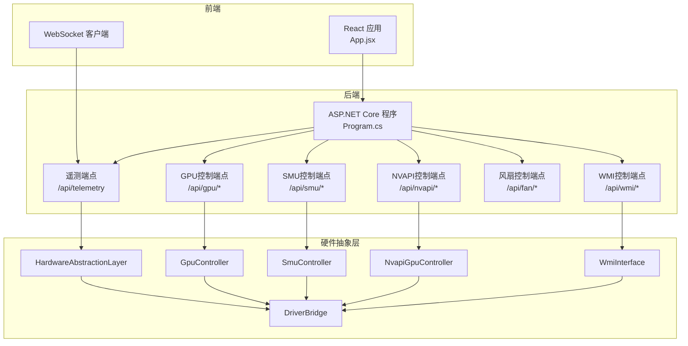
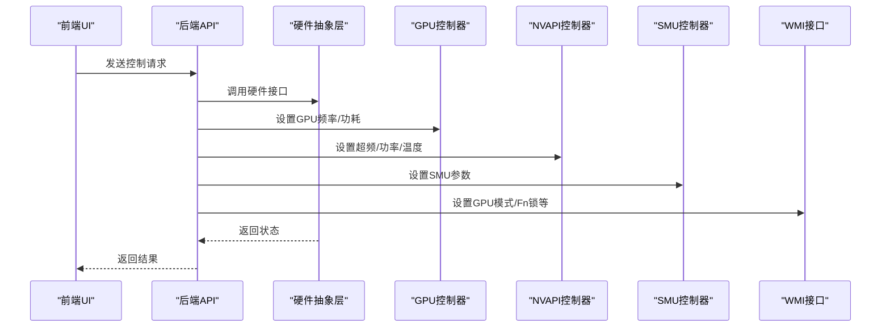
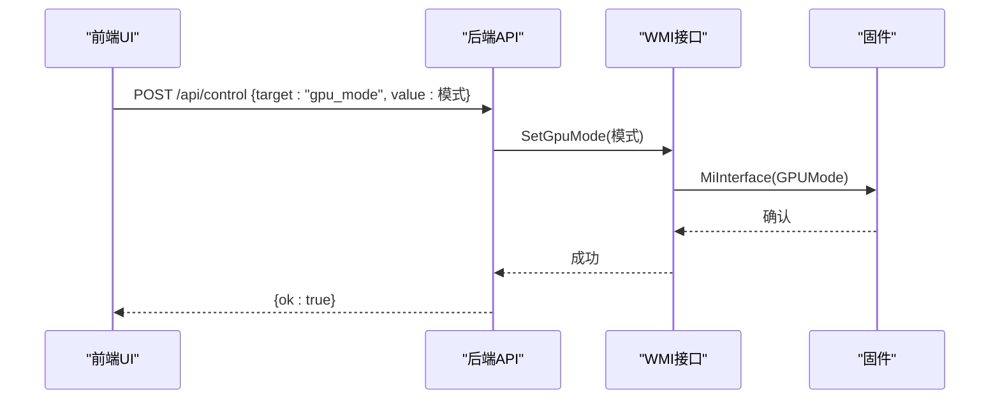
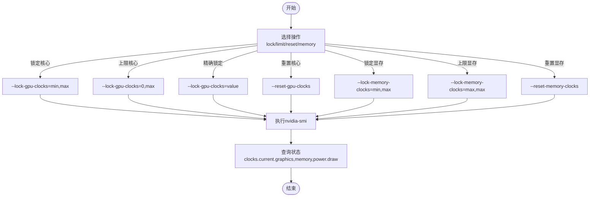
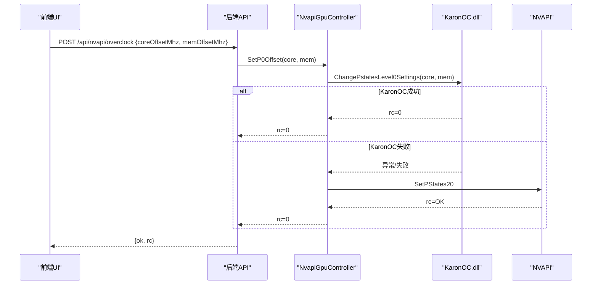
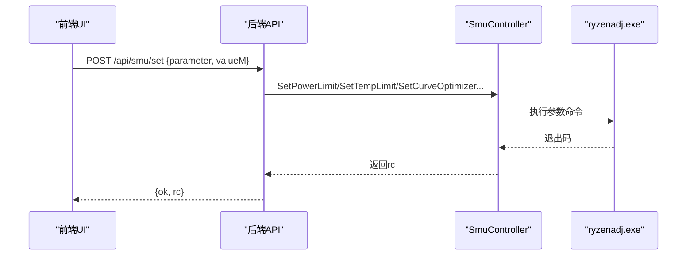
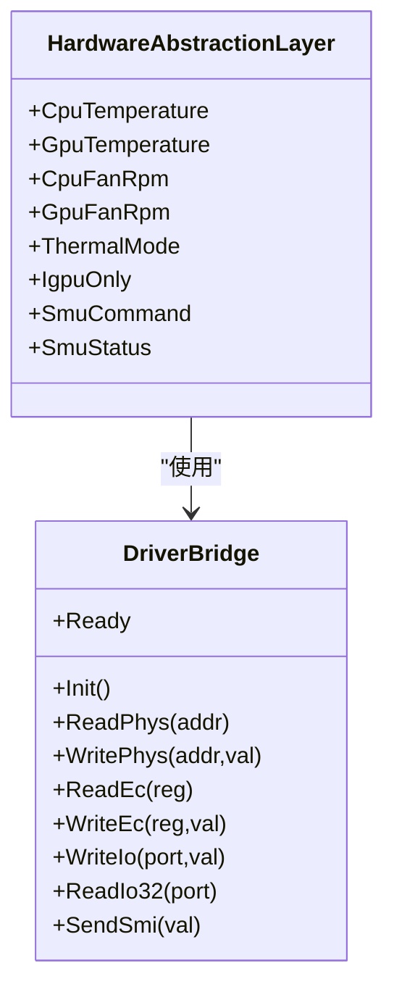
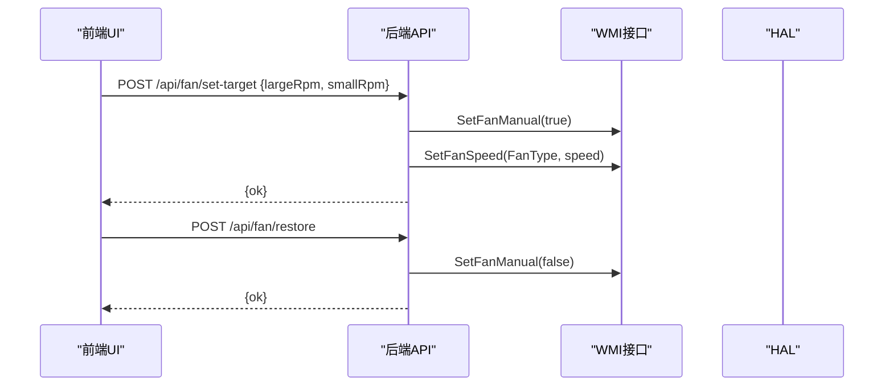
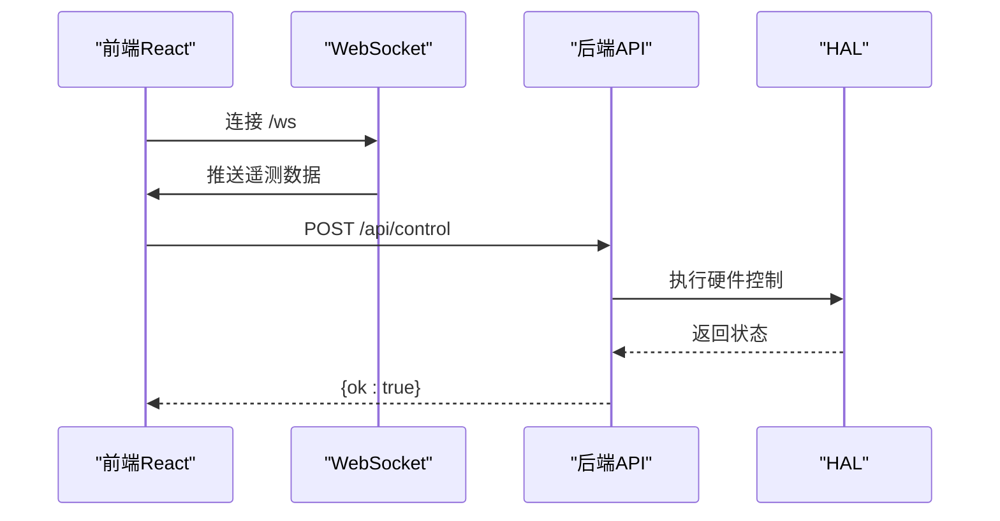
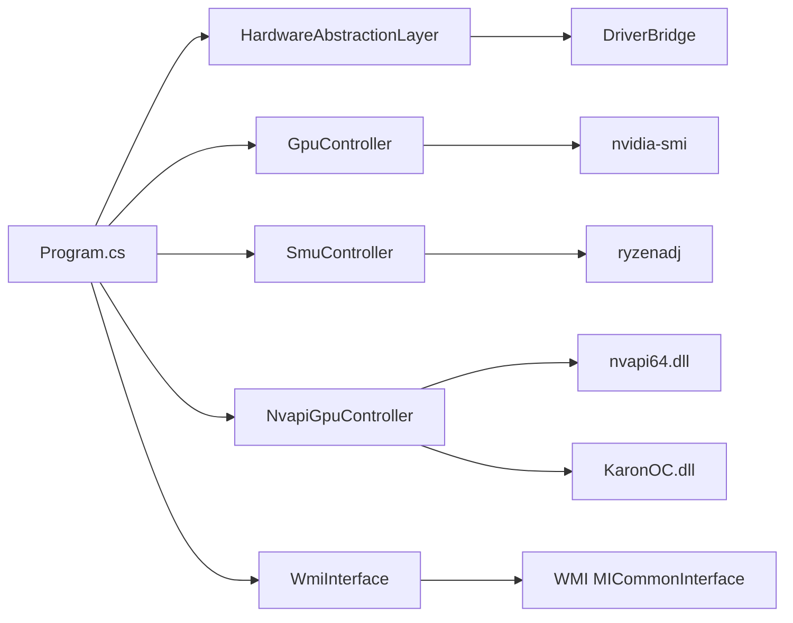

# GPU控制器

<cite>
**本文档引用的文件**
- [GpuController.cs](file://server/hal/GpuController.cs)
- [NvapiGpuController.cs](file://server/hal/NvapiGpuController.cs)
- [SmuController.cs](file://server/hal/SmuController.cs)
- [DriverBridge.cs](file://server/hal/DriverBridge.cs)
- [HardwareAbstractionLayer.cs](file://server/hal/HardwareAbstractionLayer.cs)
- [WmiInterface.cs](file://server/api/WmiInterface.cs)
- [Program.cs](file://server/api/Program.cs)
- [App.jsx](file://src/App.jsx)
- [main.jsx](file://src/main.jsx)
</cite>

## 更新摘要
**所做更改**
- 新增NvapiGpuController组件章节，详细介绍NVAPI + KaronOC.dll双层GPU控制架构
- 更新NVAPI GPU控制器Blackwell架构优化章节，包括结构体大小调整和时钟条目布局优化
- 新增NVAPI超频控制端点和状态查询接口章节
- 更新GPU电源管理章节，增加双引擎超频控制选项

## 目录
1. [简介](#简介)
2. [项目结构](#项目结构)
3. [核心组件](#核心组件)
4. [架构总览](#架构总览)
5. [详细组件分析](#详细组件分析)
6. [依赖关系分析](#依赖关系分析)
7. [性能考虑](#性能考虑)
8. [故障排除指南](#故障排除指南)
9. [结论](#结论)
10. [附录](#附录)

## 简介
本项目提供了一个跨平台的GPU控制器，支持多种GPU模式（集显、独显、混合）的切换、功耗与温度管理、风扇控制以及与WMI接口的协作。系统采用前后端分离架构：后端基于.NET 8的ASP.NET Core提供REST API与WebSocket遥测；前端基于React提供可视化界面与用户交互。硬件抽象层负责底层硬件访问（EC寄存器、SMU通信、PCI探测），并通过子进程调用nvidia-smi与ryzenadj实现GPU与CPU电源管理。

**更新** 新增NvapiGpuController组件，提供基于NVAPI的GPU控制能力，支持KaronOC.dll双引擎超频技术，实现绕过NVAPI限制的直接超频能力。

## 项目结构
- 后端服务（server/api）
  - 提供REST API与WebSocket遥测，注册HAL与控制器服务，暴露GPU、SMU、WMI、风扇、系统信息等接口
  - 新增NVAPI GPU控制器端点：/api/nvapi/status、/api/nvapi/dump-pstates、/api/nvapi/overclock、/api/nvapi/power-limit、/api/nvapi/thermal-limit
- 硬件抽象层（server/hal）
  - DriverBridge：底层硬件访问（EC寄存器、I/O端口、物理内存映射）
  - HardwareAbstractionLayer：语义化硬件接口（温度、风扇、散热模式、dGPU控制、遥测）
  - GpuController：封装nvidia-smi进行GPU频率与功耗控制
  - SmuController：封装ryzenadj进行AMD平台SMU控制
  - NvapiGpuController：基于NVAPI的GPU控制，支持KaronOC.dll双引擎超频
  - WmiInterface：通过WMI MICommonInterface与固件通信（GPU模式、Fn锁、触摸板锁等）
- 前端应用（src）
  - React应用，提供仪表盘、系统信息、设置面板与模式预设

**图表来源**
- [Program.cs:10-15](file://server/api/Program.cs#L10-L15)
- [Program.cs:464-505](file://server/api/Program.cs#L464-L505)
- [HardwareAbstractionLayer.cs:19-772](file://server/hal/HardwareAbstractionLayer.cs#L19-L772)
- [GpuController.cs:10-116](file://server/hal/GpuController.cs#L10-L116)
- [NvapiGpuController.cs:154-480](file://server/hal/NvapiGpuController.cs#L154-L480)
- [SmuController.cs:12-142](file://server/hal/SmuController.cs#L12-L142)
- [WmiInterface.cs:18-210](file://server/api/WmiInterface.cs#L18-L210)

**章节来源**
- [Program.cs:10-15](file://server/api/Program.cs#L10-L15)
- [Program.cs:464-505](file://server/api/Program.cs#L464-L505)
- [HardwareAbstractionLayer.cs:19-772](file://server/hal/HardwareAbstractionLayer.cs#L19-L772)

## 核心组件
- GpuController：封装nvidia-smi子进程，提供GPU频率锁定/上限设置、显存频率控制与当前状态查询
- SmuController：封装ryzenadj子进程，提供功耗限制、温度墙、曲线优化、CPU频率限制与睿频开关等SMU控制
- NvapiGpuController：基于NVAPI的GPU控制器，支持KaronOC.dll双引擎超频，提供P0偏移设置、时钟频率查询、功率限制和温度控制
- HardwareAbstractionLayer：统一硬件访问接口，提供温度、风扇、散热模式、dGPU控制、遥测与系统信息
- WmiInterface：通过WMI MICommonInterface与固件通信，支持GPU模式、Fn锁、触摸板锁、风扇控制等
- DriverBridge：底层硬件桥接，提供EC寄存器读写、I/O端口访问、物理内存映射与SMU通信

**更新** 新增NvapiGpuController组件，提供基于NVAPI的GPU控制能力，支持KaronOC.dll双引擎超频技术。

**章节来源**
- [GpuController.cs:10-116](file://server/hal/GpuController.cs#L10-L116)
- [NvapiGpuController.cs:154-480](file://server/hal/NvapiGpuController.cs#L154-L480)
- [SmuController.cs:12-142](file://server/hal/SmuController.cs#L12-L142)
- [HardwareAbstractionLayer.cs:19-772](file://server/hal/HardwareAbstractionLayer.cs#L19-L772)
- [WmiInterface.cs:18-210](file://server/api/WmiInterface.cs#L18-L210)
- [DriverBridge.cs:9-150](file://server/hal/DriverBridge.cs#L9-L150)

## 架构总览
系统采用分层架构：
- 表现层：React前端通过HTTP与WebSocket与后端交互
- 控制层：ASP.NET Core路由与控制器，注入HAL与各控制器服务
- 抽象层：HAL封装底层硬件访问，屏蔽差异
- 设备层：通过子进程调用nvidia-smi与ryzenadj，或通过WMI与固件通信

**图表来源**
- [Program.cs:144-202](file://server/api/Program.cs#L144-L202)
- [Program.cs:464-505](file://server/api/Program.cs#L464-L505)
- [HardwareAbstractionLayer.cs:19-772](file://server/hal/HardwareAbstractionLayer.cs#L19-L772)
- [GpuController.cs:42-86](file://server/hal/GpuController.cs#L42-L86)
- [NvapiGpuController.cs:312-344](file://server/hal/NvapiGpuController.cs#L312-L344)
- [SmuController.cs:61-95](file://server/hal/SmuController.cs#L61-L95)
- [WmiInterface.cs:62-87](file://server/api/WmiInterface.cs#L62-87)

## 详细组件分析

### GPU模式切换机制
- 模式枚举：混合（GPUMode 0）、集显（GPUMode 1）、独显（GPUMode 2）
- 实现方式：通过WMI MICommonInterface的GPUMode方法读取与设置
- 状态管理：后端提供GET /api/telemetry返回当前GPU模式，POST /api/control支持设置
- 切换流程：前端触发设置请求，后端调用WMI接口完成切换

**图表来源**
- [Program.cs:176-182](file://server/api/Program.cs#L176-L182)
- [WmiInterface.cs:72-87](file://server/api/WmiInterface.cs#L72-L87)

**章节来源**
- [Program.cs:176-182](file://server/api/Program.cs#L176-L182)
- [WmiInterface.cs:62-87](file://server/api/WmiInterface.cs#L62-L87)

### GPU电源管理与频率控制
- 功率限制：通过nvidia-smi设置GPU核心频率上限或精确锁定
- 显存频率：支持锁定显存频率区间或设置上限
- 当前状态：查询当前核心频率、显存频率与功耗
- 基准与最大频率：查询固件默认最大频率与硬件最大频率

**更新** 新增NVAPI双引擎超频控制，支持KaronOC.dll直接超频和NVAPI回退机制。

**图表来源**
- [GpuController.cs:42-86](file://server/hal/GpuController.cs#L42-L86)
- [Program.cs:396-461](file://server/api/Program.cs#L396-L461)

**章节来源**
- [GpuController.cs:42-86](file://server/hal/GpuController.cs#L42-L86)
- [Program.cs:396-461](file://server/api/Program.cs#L396-L461)

### NVAPI双引擎超频控制
- KaronOC.dll引擎：直接绕过NVAPI限制的超频引擎，支持P0偏移设置
- NVAPI回退引擎：标准NVAPI SetPStates20方法作为回退方案
- 自动检测机制：优先尝试KaronOC.dll，失败则自动回退到NVAPI
- Blackwell架构优化：针对RTX 5060 Laptop GPU的结构体布局优化

**图表来源**
- [Program.cs:486-491](file://server/api/Program.cs#L486-L491)
- [NvapiGpuController.cs:231-243](file://server/hal/NvapiGpuController.cs#L231-L243)
- [NvapiGpuController.cs:312-323](file://server/hal/NvapiGpuController.cs#L312-L323)

**章节来源**
- [Program.cs:486-491](file://server/api/Program.cs#L486-L491)
- [NvapiGpuController.cs:231-243](file://server/hal/NvapiGpuController.cs#L231-L243)
- [NvapiGpuController.cs:312-323](file://server/hal/NvapiGpuController.cs#L312-L323)

### Blackwell架构优化
- 结构体大小调整：NV_GPU_PSTATES20结构体大小优化为7316字节
- 时钟条目布局优化：时钟条目大小从48字节优化为44字节
- 内存布局优化：每状态字节数从460优化为456字节
- 数据访问优化：CLK_DELTA_OFF偏移位置优化为12字节

**章节来源**
- [NvapiGpuController.cs:29-55](file://server/hal/NvapiGpuController.cs#L29-L55)
- [NvapiGpuController.cs:446-470](file://server/hal/NvapiGpuController.cs#L446-L470)

### SMU电源管理与温度控制
- 功能支持：长时功耗限制、短时功耗限制、温度墙、曲线优化、CPU频率限制、睿频开关
- 实现方式：通过ryzenadj子进程执行对应参数
- 能力探测：后端提供探测与能力查询端点，返回支持的功能列表
- 异常处理：ryzenadj在特定场景下会崩溃但返回码可识别，后端进行兼容处理

**图表来源**
- [Program.cs:238-274](file://server/api/Program.cs#L238-L274)
- [SmuController.cs:61-95](file://server/hal/SmuController.cs#L61-L95)

**章节来源**
- [SmuController.cs:61-95](file://server/hal/SmuController.cs#L61-L95)
- [Program.cs:238-274](file://server/api/Program.cs#L238-L274)

### 硬件寄存器映射与操作
- EC寄存器基址：0xFE800400，包含温度、风扇、键盘背光、散热模式等偏移
- SMU通信：通过EC寄存器SMPR/SMST/SMAD/SDAT进行SMU命令与状态读写
- dGPU控制：通过DSAD方法与ADPD位控制电源状态（集显/混合/独显）
- I/O端口：通过APMD/APMC端口触发SMI，实现与固件通信

**图表来源**
- [DriverBridge.cs:9-150](file://server/hal/DriverBridge.cs#L9-L150)
- [HardwareAbstractionLayer.cs:19-772](file://server/hal/HardwareAbstractionLayer.cs#L19-L772)

**章节来源**
- [DriverBridge.cs:9-150](file://server/hal/DriverBridge.cs#L9-L150)
- [HardwareAbstractionLayer.cs:61-81](file://server/hal/HardwareAbstractionLayer.cs#L61-L81)
- [HardwareAbstractionLayer.cs:383-391](file://server/hal/HardwareAbstractionLayer.cs#L383-L391)
- [HardwareAbstractionLayer.cs:401-426](file://server/hal/HardwareAbstractionLayer.cs#L401-L426)

### 风扇控制与散热模式
- 手动风扇控制：通过WMI Bellator协议启用手动模式并设置目标转速
- 固件恢复：关闭手动模式以恢复固件控制
- 散热模式：通过EC寄存器ITSM设置散热模式（0-3）

**图表来源**
- [Program.cs:345-379](file://server/api/Program.cs#L345-L379)
- [WmiInterface.cs:139-184](file://server/api/WmiInterface.cs#L139-L184)

**章节来源**
- [Program.cs:345-379](file://server/api/Program.cs#L345-L379)
- [WmiInterface.cs:139-184](file://server/api/WmiInterface.cs#L139-L184)

### 系统集成与前端交互
- WebSocket遥测：后端推送实时遥测数据，前端渲染仪表盘
- 模式预设：前端根据选择的模式构建参数并调用后端apply接口
- 控制请求：前端通过HTTP POST向后端发送控制指令，后端路由到相应控制器

**图表来源**
- [Program.cs:56-86](file://server/api/Program.cs#L56-L86)
- [Program.cs:87-120](file://server/api/Program.cs#L87-L120)
- [App.jsx:87-128](file://src/App.jsx#L87-L128)

**章节来源**
- [Program.cs:56-86](file://server/api/Program.cs#L56-L86)
- [Program.cs:87-120](file://server/api/Program.cs#L87-L120)
- [App.jsx:87-128](file://src/App.jsx#L87-L128)

## 依赖关系分析
- 组件耦合
  - Program.cs集中注册与路由，依赖HAL与各控制器
  - HAL依赖DriverBridge进行底层硬件访问
  - GPU/SMU/NVAPI/WMI控制器分别封装外部工具调用
- 外部依赖
  - nvidia-smi：用于NVIDIA GPU频率与功耗控制
  - ryzenadj：用于AMD平台SMU控制
  - nvapi64.dll：NVIDIA官方API库
  - KaronOC.dll：蛟龙控制台超频引擎（可选）
  - WMI MICommonInterface：用于固件通信（GPU模式、Fn锁等）
  - inpoutx64：用于I/O端口与物理内存访问（需管理员权限）

**更新** 新增KaronOC.dll和nvapi64.dll依赖，提供双引擎超频控制能力。

**图表来源**
- [Program.cs:10-15](file://server/api/Program.cs#L10-L15)
- [HardwareAbstractionLayer.cs:21-51](file://server/hal/HardwareAbstractionLayer.cs#L21-L51)
- [GpuController.cs:14-40](file://server/hal/GpuController.cs#L14-L40)
- [SmuController.cs:43-57](file://server/hal/SmuController.cs#L43-L57)
- [NvapiGpuController.cs:199-220](file://server/hal/NvapiGpuController.cs#L199-L220)
- [WmiInterface.cs:50-60](file://server/api/WmiInterface.cs#L50-L60)

**章节来源**
- [Program.cs:10-15](file://server/api/Program.cs#L10-L15)
- [HardwareAbstractionLayer.cs:21-51](file://server/hal/HardwareAbstractionLayer.cs#L21-L51)

## 性能考虑
- 遥测缓存：HAL对频繁查询的遥测数据进行缓存，减少nvidia-smi与系统命令调用频率
- 超时控制：GPU控制器对nvidia-smi调用设置超时，避免阻塞
- 驱动降级：当底层驱动不可用时，HAL返回安全默认值，保证系统可用性
- 端点幂等：控制端点尽量设计为幂等，避免重复设置导致的抖动
- NVAPI优化：Blackwell架构优化减少内存占用和提高数据访问效率

**更新** 新增NVAPI Blackwell架构优化，减少结构体大小和内存占用。

## 故障排除指南
- nvidia-smi失败
  - 现象：GPU控制端点返回错误
  - 排查：确认NVIDIA驱动安装、权限与版本兼容性
  - 参考：GPU控制器内部对nvidia-smi的超时与错误处理
- ryzenadj无响应或崩溃
  - 现象：SMU控制返回特定崩溃码
  - 排查：确认ryzenadj可用、管理员权限、平台兼容性
  - 参考：SMU控制器对崩溃码的兼容处理
- WMI调用失败
  - 现象：GPU模式/Fn锁等设置失败
  - 排查：确认WMI服务可用、固件支持对应方法
  - 参考：WMI接口的可用性检测与错误记录
- NVAPI初始化失败
  - 现象：/api/nvapi/status返回不可用
  - 排查：确认nvapi64.dll存在、KaronOC.dll路径正确、管理员权限
  - 参考：NvapiGpuController的初始化与回退机制
- KaronOC.dll加载失败
  - 现象：超频功能不可用，回退到NVAPI
  - 排查：确认KaronOC.dll存在于指定路径、架构匹配、权限足够
  - 参考：KaronOC.dll搜索路径和动态加载机制

**更新** 新增NVAPI和KaronOC.dll相关故障排除指南。

**章节来源**
- [GpuController.cs:14-40](file://server/hal/GpuController.cs#L14-L40)
- [SmuController.cs:59-121](file://server/hal/SmuController.cs#L59-L121)
- [WmiInterface.cs:24-48](file://server/api/WmiInterface.cs#L24-L48)
- [NvapiGpuController.cs:195-250](file://server/hal/NvapiGpuController.cs#L195-L250)
- [NvapiGpuController.cs:252-270](file://server/hal/NvapiGpuController.cs#L252-L270)
- [HardwareAbstractionLayer.cs:56-57](file://server/hal/HardwareAbstractionLayer.cs#L56-L57)

## 结论
本GPU控制器通过清晰的分层架构实现了对多平台GPU与CPU电源管理的统一控制。后端以HAL为核心，向上提供稳定的API与WebSocket遥测，向下封装nvidia-smi、ryzenadj、nvapi64.dll与WMI等外部工具与固件接口。**更新** 新增的NvapiGpuController组件提供了基于NVAPI的GPU控制能力，通过KaronOC.dll双引擎超频架构实现了绕过NVAPI限制的直接超频功能，同时保持向后的NVAPI回退机制，确保系统稳定性。前端通过直观的UI与模式预设简化了用户的操作体验。系统具备良好的扩展性与容错能力，适合在多种笔记本与台式机平台上部署与使用。

## 附录
- 常见应用场景
  - 游戏模式切换：通过WMI设置GPUMode为独显，提升性能
  - 节能模式启用：设置GPUMode为集显，降低功耗
  - 高负载散热优化：提高散热模式与风扇目标转速，配合SMU温度墙
  - **超频应用**：通过KaronOC.dll引擎实现P0偏移超频，提升GPU性能
  - **功率管理**：设置GPU功率限制，平衡性能与功耗
  - **温度控制**：设置温度墙限制，保护硬件安全
- 最佳实践
  - 使用模式预设快速切换，避免手动配置复杂参数
  - 结合遥测监控温度与功耗，防止过热与过载
  - 定期检查驱动与工具可用性，确保控制链路畅通
  - **超频谨慎**：首次使用超频功能建议从小幅度开始，逐步调整
  - **备份配置**：超频前做好系统备份，以便出现问题时快速恢复