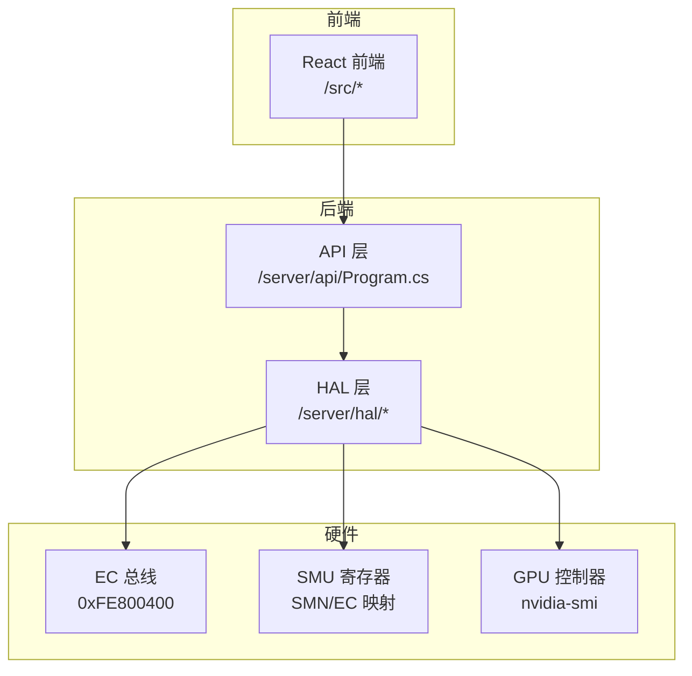
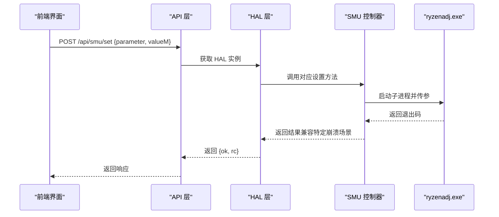
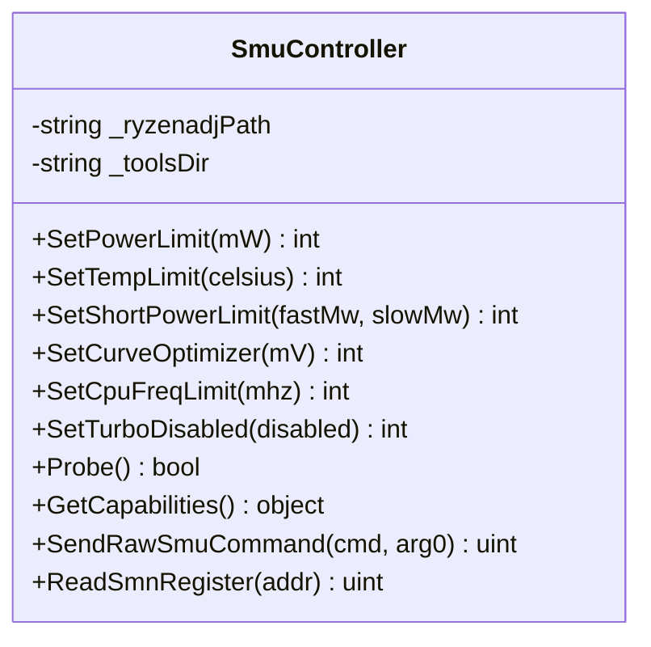
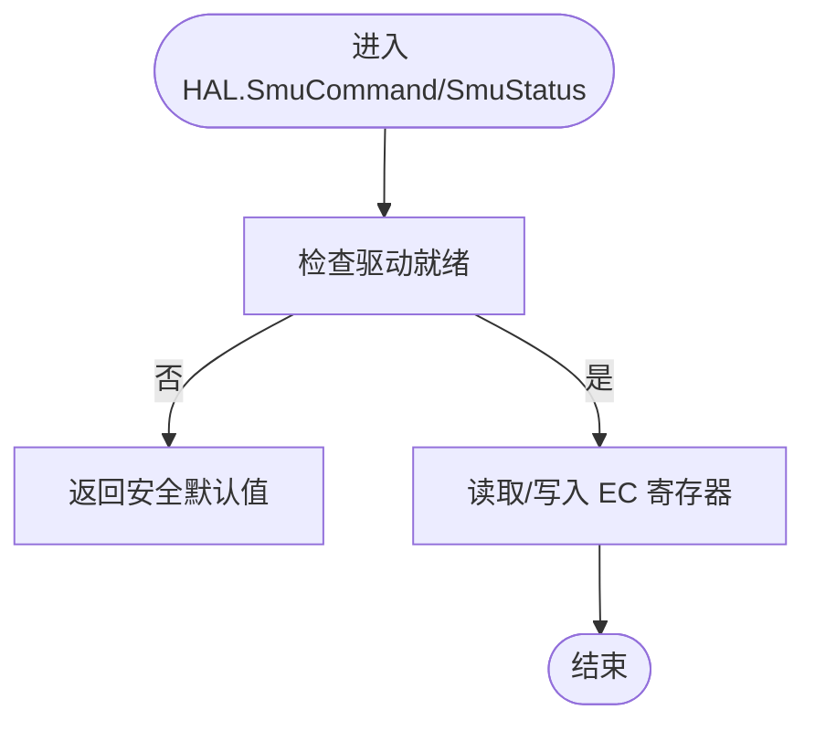
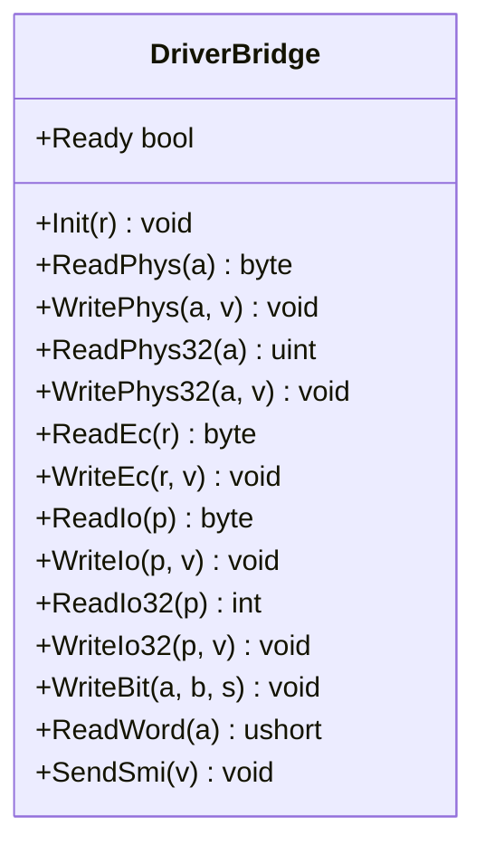
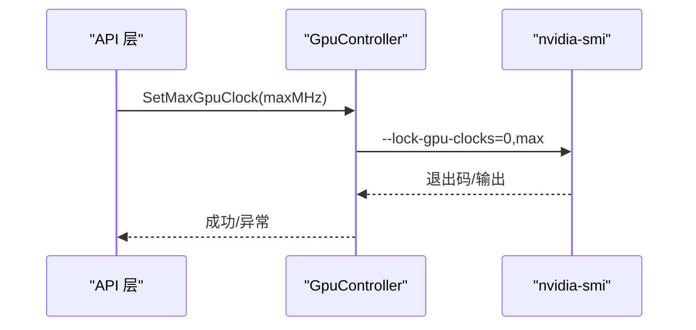
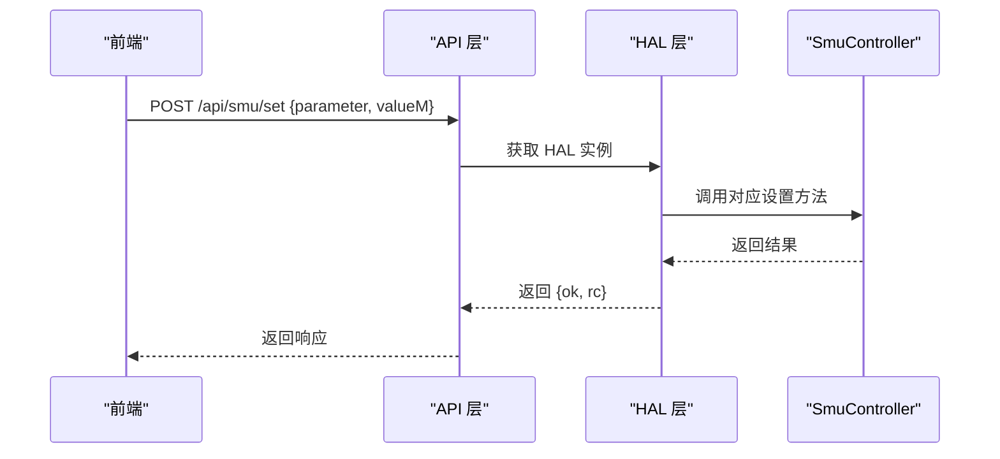
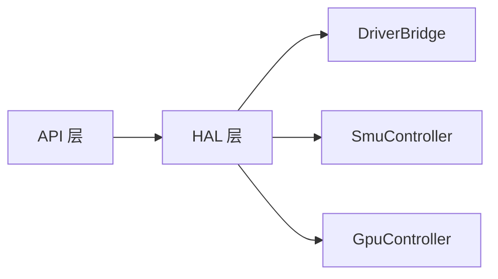

# SMU控制器

<cite>
**本文引用的文件**
- [SmuController.cs](file://server/hal/SmuController.cs)
- [HardwareAbstractionLayer.cs](file://server/hal/HardwareAbstractionLayer.cs)
- [DriverBridge.cs](file://server/hal/DriverBridge.cs)
- [GpuController.cs](file://server/hal/GpuController.cs)
- [Program.cs](file://server/api/Program.cs)
- [uxtuAdapter.js](file://src/services/uxtuAdapter.js)
</cite>

## 目录
1. [简介](#简介)
2. [项目结构](#项目结构)
3. [核心组件](#核心组件)
4. [架构总览](#架构总览)
5. [详细组件分析](#详细组件分析)
6. [依赖关系分析](#依赖关系分析)
7. [性能考虑](#性能考虑)
8. [故障排查指南](#故障排查指南)
9. [结论](#结论)
10. [附录](#附录)

## 简介
本文件面向SMU（系统管理单元）控制器的技术文档，聚焦于AMD平台下SMU的控制与通信机制。SMU负责CPU/GPU的功耗、频率、温度等动态管理，是现代笔记本平台实现“性能-温度-噪音”平衡的关键硬件单元。本文将结合仓库中现有的SMU控制实现，系统阐述：
- SMU工作原理与在电源管理中的角色
- SMU寄存器访问方法与数据格式（基于EC总线与SMN寄存器）
- 功率限制、频率曲线、温度保护等调优能力
- 典型应用场景（CPU超频、GPU性能优化、散热策略）
- 安全机制与权限校验（操作验证与回滚保护）
- SMU通信协议与调试方法

## 项目结构
本项目采用分层架构：
- HAL层：抽象底层硬件访问（EC总线、SMU寄存器、物理内存映射、IO端口）
- API层：提供REST接口，接收前端请求并调用HAL层执行具体控制
- 前端层：通过HTTP调用API，实现用户交互与可视化

图表来源
- [Program.cs:238-274](file://server/api/Program.cs#L238-L274)
- [HardwareAbstractionLayer.cs:383-392](file://server/hal/HardwareAbstractionLayer.cs#L383-L392)
- [GpuController.cs:14-40](file://server/hal/GpuController.cs#L14-L40)

章节来源
- [Program.cs:238-274](file://server/api/Program.cs#L238-L274)
- [HardwareAbstractionLayer.cs:383-392](file://server/hal/HardwareAbstractionLayer.cs#L383-L392)
- [GpuController.cs:14-40](file://server/hal/GpuController.cs#L14-L40)

## 核心组件
- SMU控制器（SmuController）：封装ryzenadj.exe子进程，提供功率限制、温度限制、短时功率限制、曲线优化、CPU频率限制、禁用睿频等能力；支持探测与能力查询。
- HAL（HardwareAbstractionLayer）：提供EC寄存器读写、SMU命令/状态寄存器访问、风扇控制、电源计划切换、遥测采集等通用硬件抽象。
- 驱动桥（DriverBridge）：封装inpoutx64驱动，提供EC IO协议、物理内存读写、IO端口读写、SMI触发等底层能力。
- GPU控制器（GpuController）：封装nvidia-smi子进程，提供GPU频率锁定、复位等操作。

章节来源
- [SmuController.cs:12-141](file://server/hal/SmuController.cs#L12-L141)
- [HardwareAbstractionLayer.cs:19-772](file://server/hal/HardwareAbstractionLayer.cs#L19-L772)
- [DriverBridge.cs:9-150](file://server/hal/DriverBridge.cs#L9-L150)
- [GpuController.cs:10-116](file://server/hal/GpuController.cs#L10-L116)

## 架构总览
SMU控制的典型调用链路如下：

图表来源
- [Program.cs:238-274](file://server/api/Program.cs#L238-L274)
- [SmuController.cs:43-57](file://server/hal/SmuController.cs#L43-L57)
- [SmuController.cs:61-95](file://server/hal/SmuController.cs#L61-L95)

## 详细组件分析

### SMU控制器（SmuController）
职责与能力
- 通过子进程调用ryzenadj.exe实现SMU参数设置，覆盖功率限制、温度限制、短时/慢速功率限制、曲线优化、CPU频率限制、睿频禁用等。
- 支持探测（Probe）与能力查询（GetCapabilities），用于运行时能力判断。
- 对特定退出码进行兼容处理，提升鲁棒性。

关键方法与行为
- 设置总功率限制：将毫瓦值转换为SMU参数并调用ryzenadj.exe，兼容特定崩溃场景。
- 设置温度限制：以摄氏度为单位设置热节流阈值。
- 设置短时/慢速功率限制：分别设置快速与慢速窗口的功率上限。
- 设置曲线优化：调整曲线优化参数（单位：毫伏）。
- 设置CPU频率限制：限制CPU最大频率（单位：MHz）。
- 禁用/启用睿频：根据布尔值选择不同模式。
- 探测与能力查询：返回当前硬件支持的能力集合。

图表来源
- [SmuController.cs:12-141](file://server/hal/SmuController.cs#L12-L141)

章节来源
- [SmuController.cs:12-141](file://server/hal/SmuController.cs#L12-L141)

### HAL（硬件抽象层）
职责与能力
- 提供EC寄存器访问（读写0x62/0x66端口）、SMU命令/状态寄存器访问（通过EC偏移量映射）。
- 提供风扇目标转速控制、键盘背光、Fn锁、Caps/Num Lock等系统控制。
- 提供电源计划切换（平衡/高性能/节能）。
- 提供遥测采集（CPU/GPU温度、风扇转速、GPU占用/频率/显存等）。

SMU寄存器映射
- SMU命令寄存器（OFF_SMPR）：写入SMU命令。
- SMU状态寄存器（OFF_SMST）：读取SMU状态。
- SMU地址寄存器（OFF_SMAD）：写入SMN地址。
- SMU数据寄存器（OFF_SDAT）：读写SMN数据（16位）。

图表来源
- [HardwareAbstractionLayer.cs:383-392](file://server/hal/HardwareAbstractionLayer.cs#L383-L392)
- [DriverBridge.cs:111-137](file://server/hal/DriverBridge.cs#L111-L137)

章节来源
- [HardwareAbstractionLayer.cs:383-392](file://server/hal/HardwareAbstractionLayer.cs#L383-L392)
- [DriverBridge.cs:111-137](file://server/hal/DriverBridge.cs#L111-L137)

### 驱动桥（DriverBridge）
职责与能力
- 初始化inpoutx64驱动，检测驱动可用性。
- 提供EC IO协议读写（0x62/0x66端口）、物理内存读写、IO端口读写、SMI触发等底层能力。
- 对EC写入过程进行IBF等待，确保协议时序正确。

图表来源
- [DriverBridge.cs:9-150](file://server/hal/DriverBridge.cs#L9-L150)

章节来源
- [DriverBridge.cs:9-150](file://server/hal/DriverBridge.cs#L9-L150)

### GPU控制器（GpuController）
职责与能力
- 通过nvidia-smi子进程实现GPU频率锁定、复位等操作。
- 提供GPU时钟与功耗查询能力，辅助性能调优与监控。

图表来源
- [GpuController.cs:42-60](file://server/hal/GpuController.cs#L42-L60)

章节来源
- [GpuController.cs:10-116](file://server/hal/GpuController.cs#L10-L116)

### API层（REST接口）
职责与能力
- 提供/POST /api/smu/set接口，接收前端请求并调用SmuController执行SMU参数设置。
- 提供/GET /api/ec/read接口，读取EC寄存器范围值，便于调试与验证。

图表来源
- [Program.cs:238-274](file://server/api/Program.cs#L238-L274)
- [uxtuAdapter.js:121-129](file://src/services/uxtuAdapter.js#L121-L129)

章节来源
- [Program.cs:238-274](file://server/api/Program.cs#L238-L274)
- [uxtuAdapter.js:121-129](file://src/services/uxtuAdapter.js#L121-L129)

## 依赖关系分析
- API层依赖HAL层提供的硬件抽象能力。
- HAL层依赖DriverBridge提供的底层IO与内存访问。
- SMU控制器通过子进程调用外部工具（ryzenadj.exe）实现SMU参数设置。
- GPU控制器通过nvidia-smi实现GPU频率控制。

图表来源
- [Program.cs:238-274](file://server/api/Program.cs#L238-L274)
- [HardwareAbstractionLayer.cs:19-772](file://server/hal/HardwareAbstractionLayer.cs#L19-L772)
- [DriverBridge.cs:9-150](file://server/hal/DriverBridge.cs#L9-L150)
- [SmuController.cs:12-141](file://server/hal/SmuController.cs#L12-L141)
- [GpuController.cs:10-116](file://server/hal/GpuController.cs#L10-L116)

章节来源
- [Program.cs:238-274](file://server/api/Program.cs#L238-L274)
- [HardwareAbstractionLayer.cs:19-772](file://server/hal/HardwareAbstractionLayer.cs#L19-L772)
- [DriverBridge.cs:9-150](file://server/hal/DriverBridge.cs#L9-L150)
- [SmuController.cs:12-141](file://server/hal/SmuController.cs#L12-L141)
- [GpuController.cs:10-116](file://server/hal/GpuController.cs#L10-L116)

## 性能考虑
- 子进程调用开销：ryzenadj.exe每次设置都会启动子进程，建议批量参数合并或减少频繁调用。
- EC协议时序：EC写入需等待IBF空闲，避免过快轮询导致阻塞。
- 遥测采样：GPU遥测调用nvidia-smi存在超时风险，建议设置合理超时并做降级处理。
- 缓存与仲裁：风扇转速读取采用多次仲裁取首个非零值，降低竞态影响。

[本节为通用性能讨论，无需列出章节来源]

## 故障排查指南
常见问题与定位
- 驱动不可用：DriverBridge初始化失败时，HAL会降级为安全默认值。可通过HealthCheck验证驱动与EC通信是否正常。
- 子进程异常：ryzenadj.exe返回特定崩溃码时，SMU控制器会将其视为成功，但需关注稳定性。
- nvidia-smi超时：GPU控制器对超时抛出异常，需检查驱动与权限。
- EC写入失败：DriverBridge在无法映射或写入时抛出异常，需确认物理地址与权限。

建议排查步骤
- 使用/GET /api/ec/read读取SMU相关寄存器，确认EC总线可读。
- 调用/POST /api/smu/set进行最小化参数设置，观察返回码。
- 查看系统日志与驱动状态，确认inpoutx64驱动加载成功。
- 对GPU相关操作，先确认nvidia-smi可用且无权限限制。

章节来源
- [HardwareAbstractionLayer.cs:754-765](file://server/hal/HardwareAbstractionLayer.cs#L754-L765)
- [DriverBridge.cs:39-62](file://server/hal/DriverBridge.cs#L39-L62)
- [SmuController.cs:59-65](file://server/hal/SmuController.cs#L59-L65)
- [GpuController.cs:28-40](file://server/hal/GpuController.cs#L28-L40)

## 结论
本项目通过HAL层抽象底层硬件，API层提供统一的REST接口，SMU控制器封装ryzenadj.exe实现对AMD平台SMU的参数控制。配合GPU控制器与EC寄存器访问，实现了功率限制、温度保护、频率曲线优化、CPU频率限制与睿频控制等关键能力。建议在生产环境中加强参数校验、错误处理与回滚保护，并结合遥测数据持续优化调优策略。

[本节为总结性内容，无需列出章节来源]

## 附录

### SMU寄存器与数据格式
- SMU命令寄存器（EC偏移量）：写入SMU命令字。
- SMU状态寄存器（EC偏移量）：读取SMU状态字。
- SMU地址寄存器（EC偏移量）：写入SMN地址。
- SMU数据寄存器（EC偏移量）：读写SMN数据（16位）。

章节来源
- [HardwareAbstractionLayer.cs:77-80](file://server/hal/HardwareAbstractionLayer.cs#L77-L80)
- [HardwareAbstractionLayer.cs:383-392](file://server/hal/HardwareAbstractionLayer.cs#L383-L392)

### SMU通信协议与调试
- EC IO协议：通过0x62/0x66端口实现寄存器读写，写入前需等待IBF空闲。
- SMN寄存器：通过SMU地址/数据寄存器间接访问，适合高级调试与底层控制。
- 调试建议：使用/GET /api/ec/read读取EC寄存器范围，核对SMU相关寄存器值变化。

章节来源
- [DriverBridge.cs:111-147](file://server/hal/DriverBridge.cs#L111-L147)
- [Program.cs:214-237](file://server/api/Program.cs#L214-L237)