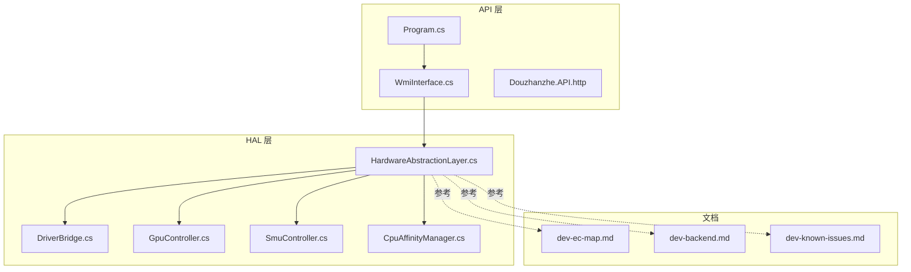
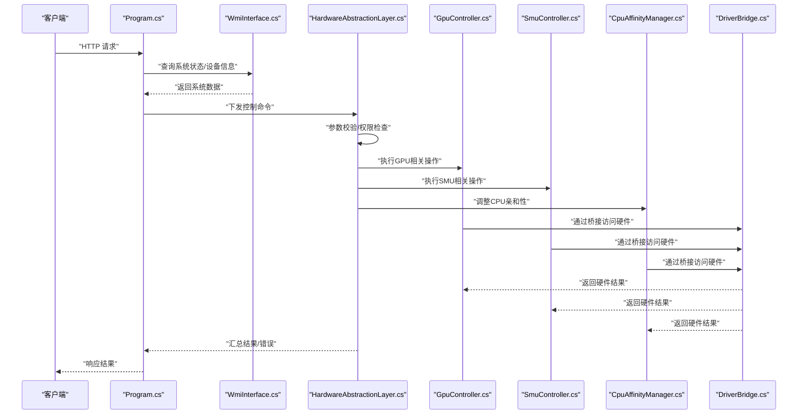
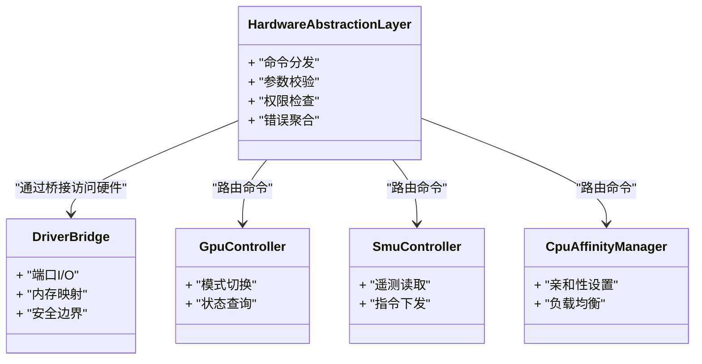

# 硬件控制模块

<cite>
**本文引用的文件**
- [HardwareAbstractionLayer.cs](file://server/hal/HardwareAbstractionLayer.cs)
- [DriverBridge.cs](file://server/hal/DriverBridge.cs)
- [GpuController.cs](file://server/hal/GpuController.cs)
- [SmuController.cs](file://server/hal/SmuController.cs)
- [CpuAffinityManager.cs](file://server/hal/CpuAffinityManager.cs)
- [WmiInterface.cs](file://server/api/WmiInterface.cs)
- [Program.cs](file://server/api/Program.cs)
- [dev-ec-map.md](file://docs/dev-ec-map.md)
- [dev-backend.md](file://docs/dev-backend.md)
- [dev-known-issues.md](file://docs/dev-known-issues.md)
- [Douzhanzhe.API.http](file://server/api/Douzhanzhe.API.http)
</cite>

## 目录
1. [简介](#简介)
2. [项目结构](#项目结构)
3. [核心组件](#核心组件)
4. [架构总览](#架构总览)
5. [详细组件分析](#详细组件分析)
6. [依赖关系分析](#依赖关系分析)
7. [性能考量](#性能考量)
8. [故障排查指南](#故障排查指南)
9. [结论](#结论)
10. [附录](#附录)

## 简介
本技术文档聚焦于硬件控制模块（Hardware Abstraction Layer，HAL），系统性阐述EC寄存器映射机制与硬件访问原理，解析inpoutx64驱动在Windows平台上的工作方式与安全边界；深入分析GPU控制器、SMU控制器与CPU亲和性管理器的功能与接口设计；梳理控制指令的生成与执行流程，覆盖参数校验、权限检查与错误处理；提供风扇转速调节、GPU模式切换、背光控制等典型场景的实践思路；最后总结硬件兼容性处理、设备检测与降级策略。

## 项目结构
HAL位于后端服务的server/hal目录，包含抽象层、驱动桥接、GPU控制器、SMU控制器与CPU亲和性管理器等关键组件；API层通过WMI接口与HAL交互，并提供HTTP接口用于外部调用；文档目录docs提供了EC映射、后端架构与已知问题等参考资料。

**图示来源**
- [Program.cs](file://server/api/Program.cs)
- [WmiInterface.cs](file://server/api/WmiInterface.cs)
- [HardwareAbstractionLayer.cs](file://server/hal/HardwareAbstractionLayer.cs)
- [DriverBridge.cs](file://server/hal/DriverBridge.cs)
- [GpuController.cs](file://server/hal/GpuController.cs)
- [SmuController.cs](file://server/hal/SmuController.cs)
- [CpuAffinityManager.cs](file://server/hal/CpuAffinityManager.cs)
- [dev-ec-map.md](file://docs/dev-ec-map.md)
- [dev-backend.md](file://docs/dev-backend.md)
- [dev-known-issues.md](file://docs/dev-known-issues.md)

**章节来源**
- [Program.cs](file://server/api/Program.cs)
- [WmiInterface.cs](file://server/api/WmiInterface.cs)
- [dev-backend.md](file://docs/dev-backend.md)

## 核心组件
- 抽象层（HardwareAbstractionLayer）：统一硬件访问入口，聚合各控制器能力，负责命令分发、参数校验与错误汇总。
- 驱动桥接（DriverBridge）：封装底层硬件访问（如inpoutx64），提供安全可控的I/O通道，承担权限与边界检查。
- GPU控制器（GpuController）：负责显卡模式切换、状态查询与相关策略执行。
- SMU控制器（SmuController）：面向系统管理单元（System Management Unit）的控制与通信。
- CPU亲和性管理器（CpuAffinityManager）：调整进程/线程CPU亲和性，优化调度与功耗表现。
- WMI接口（WmiInterface）：提供系统级硬件信息查询与事件订阅，作为HAL的数据来源之一。

**章节来源**
- [HardwareAbstractionLayer.cs](file://server/hal/HardwareAbstractionLayer.cs)
- [DriverBridge.cs](file://server/hal/DriverBridge.cs)
- [GpuController.cs](file://server/hal/GpuController.cs)
- [SmuController.cs](file://server/hal/SmuController.cs)
- [CpuAffinityManager.cs](file://server/hal/CpuAffinityManager.cs)
- [WmiInterface.cs](file://server/api/WmiInterface.cs)

## 架构总览
下图展示从API到HAL再到具体控制器与驱动桥接的整体调用链路，以及EC寄存器映射与硬件访问的安全边界。

**图示来源**
- [Program.cs](file://server/api/Program.cs)
- [WmiInterface.cs](file://server/api/WmiInterface.cs)
- [HardwareAbstractionLayer.cs](file://server/hal/HardwareAbstractionLayer.cs)
- [GpuController.cs](file://server/hal/GpuController.cs)
- [SmuController.cs](file://server/hal/SmuController.cs)
- [CpuAffinityManager.cs](file://server/hal/CpuAffinityManager.cs)
- [DriverBridge.cs](file://server/hal/DriverBridge.cs)

## 详细组件分析

### 抽象层（HardwareAbstractionLayer）
职责与特性
- 统一命令入口：接收来自API层的控制请求，进行参数合法性与权限校验。
- 路由与编排：根据命令类型路由至对应控制器（GPU/SMU/CPU）。
- 错误聚合：收集各控制器返回的异常与状态，形成一致的错误响应。
- 兼容性与降级：在设备不可用或驱动缺失时，执行降级策略并记录日志。

关键流程
- 命令解析：识别命令类型、目标设备、参数范围与默认值。
- 权限检查：确保调用方具备执行该操作的权限（例如管理员态）。
- 参数验证：范围检查、格式校验、依赖关系验证。
- 执行与回滚：在部分失败时尝试回滚已生效的变更。
- 结果汇总：将成功/失败信息打包为统一响应格式。

**章节来源**
- [HardwareAbstractionLayer.cs](file://server/hal/HardwareAbstractionLayer.cs)

### 驱动桥接（DriverBridge）
职责与特性
- 底层硬件访问：封装inpoutx64等驱动，提供受控的端口I/O与内存映射访问。
- 安全边界：限制可访问的地址范围、访问次数与并发度，避免破坏系统稳定性。
- 异常隔离：捕获驱动层异常并转换为上层可理解的错误码。
- 可观测性：记录访问日志与耗时，便于诊断与审计。

工作原理（基于仓库中对inpoutx64的使用）
- 初始化：加载驱动库，建立与内核模块的通信通道。
- 访问控制：仅允许预定义的EC寄存器地址区间与特定命令集。
- 同步与超时：为每次I/O设置超时阈值，防止阻塞。
- 清理：释放资源，关闭句柄，确保无泄漏。

安全考虑
- 最小权限原则：仅授予必要的I/O权限。
- 输入过滤：严格过滤来自上层的地址与数据。
- 速率限制：限制高频连续访问，降低硬件与系统风险。
- 失败保护：出现异常时立即中断后续操作并上报。

**章节来源**
- [DriverBridge.cs](file://server/hal/DriverBridge.cs)
- [dev-ec-map.md](file://docs/dev-ec-map.md)

### GPU控制器（GpuController）
功能与接口设计
- 模式切换：支持独显直连、混合模式、集成显卡模式等切换。
- 状态查询：查询当前显卡模式、频率、温度与功耗。
- 策略执行：结合系统负载与用户偏好，自动选择最优模式。
- 与HAL协作：通过抽象层进行参数校验与错误处理。

典型场景
- 场景A：用户请求切换到独显直连模式
  - 参数：目标模式标识、是否强制切换
  - 流程：校验目标模式可用性 → 触发切换 → 查询确认 → 返回结果
- 场景B：自动模式切换
  - 触发条件：电池电量低、CPU温度高、外接电源断开
  - 动作：切换到节能模式 → 记录日志 → 通知UI更新

**章节来源**
- [GpuController.cs](file://server/hal/GpuController.cs)
- [HardwareAbstractionLayer.cs](file://server/hal/HardwareAbstractionLayer.cs)

### SMU控制器（SmuController）
功能与接口设计
- 系统管理：与SMU通信，下发控制指令以调节风扇曲线、功耗墙、PPT等。
- 状态读取：读取温度、电压、电流、功率等遥测数据。
- 策略联动：与GPU控制器、CPU亲和性管理器协同，实现全局能耗优化。

典型场景
- 场景A：提升散热性能
  - 参数：目标风扇曲线、温度阈值
  - 流程：校验曲线有效性 → 下发SMU指令 → 等待确认 → 上报结果
- 场景B：动态PPT调整
  - 触发条件：长时间高负载
  - 动作：适度上调PPT → 监控温度 → 回退策略

**章节来源**
- [SmuController.cs](file://server/hal/SmuController.cs)
- [HardwareAbstractionLayer.cs](file://server/hal/HardwareAbstractionLayer.cs)

### CPU亲和性管理器（CpuAffinityManager）
功能与接口设计
- 亲和性设置：为指定进程/线程设置CPU亲和掩码，影响调度行为。
- 性能优化：在多核环境下平衡负载，降低跨NUMA访问成本。
- 与SMU/GPU联动：在高负载场景下限制非关键任务，保障关键路径性能。

典型场景
- 场景A：游戏模式
  - 动作：将渲染线程亲和到高性能核组 → 关闭后台任务亲和
- 场景B：节能模式
  - 动作：将非关键线程迁移到低功耗核组 → 降低整体功耗

**章节来源**
- [CpuAffinityManager.cs](file://server/hal/CpuAffinityManager.cs)
- [HardwareAbstractionLayer.cs](file://server/hal/HardwareAbstractionLayer.cs)

### EC寄存器映射机制与硬件访问原理
EC（Embedded Controller）是笔记本主板上的专用控制器，负责键盘、风扇、背光、热敏元件等外围设备的控制。EC寄存器映射机制如下：
- 寄存器寻址：通过主从端口（如0x60/0x64）发送命令，随后通过数据端口读写EC内部寄存器。
- 数据协议：遵循EC命令序列，包含地址写入、数据读写、状态轮询等步骤。
- 安全边界：仅允许访问白名单内的寄存器，避免破坏系统关键状态。

在本项目中，DriverBridge封装了EC访问逻辑，HAL通过抽象层统一调度，确保访问安全与可追溯。

**章节来源**
- [dev-ec-map.md](file://docs/dev-ec-map.md)
- [DriverBridge.cs](file://server/hal/DriverBridge.cs)
- [HardwareAbstractionLayer.cs](file://server/hal/HardwareAbstractionLayer.cs)

### 控制指令生成与执行流程
参数验证
- 类型与范围：确保数值在有效区间内，字符串符合白名单。
- 依赖关系：若某参数依赖其他参数，需先校验前置条件。
- 默认值：为可选参数提供合理默认值，减少调用复杂度。

权限检查
- 进程权限：要求以管理员身份运行，避免I/O受限。
- 设备权限：检查目标设备是否存在且可写，避免无效操作。

错误处理
- 分层错误码：区分参数错误、权限不足、设备不可用、驱动异常等。
- 回滚策略：在部分成功时撤销已生效的变更，保持系统一致性。
- 日志记录：记录关键步骤与错误上下文，便于定位问题。

**章节来源**
- [HardwareAbstractionLayer.cs](file://server/hal/HardwareAbstractionLayer.cs)
- [DriverBridge.cs](file://server/hal/DriverBridge.cs)

### 硬件控制示例（实践思路）
以下示例描述典型场景的调用路径与注意事项，不包含具体代码内容。

- 风扇转速调节
  - 步骤：选择风扇曲线 → 校验曲线有效性 → 下发SMU指令 → 等待确认 → 查询温度变化
  - 注意：避免频繁切换，防止机械磨损；在高温场景下优先启用强风模式
- GPU模式切换
  - 步骤：判断当前模式 → 检查目标模式可用性 → 触发切换 → 等待确认 → 刷新UI状态
  - 注意：切换前保存用户工作，避免因驱动重载导致应用中断
- 背光控制
  - 步骤：读取当前亮度 → 计算目标亮度 → 通过EC下发背光命令 → 确认生效
  - 注意：避免过亮/过暗造成视觉疲劳；与电源管理策略联动

**章节来源**
- [GpuController.cs](file://server/hal/GpuController.cs)
- [SmuController.cs](file://server/hal/SmuController.cs)
- [DriverBridge.cs](file://server/hal/DriverBridge.cs)

### 硬件兼容性处理、设备检测与降级策略
兼容性处理
- 设备检测：通过WMI查询硬件型号、固件版本与支持能力，动态决定可用功能。
- 平台适配：针对不同机型（如不同EC固件版本）采用差异化策略。

设备检测
- 依赖WMI接口获取主板、GPU、风扇等设备信息，作为功能开关与参数范围的依据。

降级策略
- 驱动缺失：提示安装/启用驱动，同时禁用相关功能按钮。
- 设备不可用：返回友好错误信息，建议检查连接或重启系统。
- 参数越界：使用最近有效值替代，避免直接拒绝请求。

**章节来源**
- [WmiInterface.cs](file://server/api/WmiInterface.cs)
- [HardwareAbstractionLayer.cs](file://server/hal/HardwareAbstractionLayer.cs)
- [dev-known-issues.md](file://docs/dev-known-issues.md)

## 依赖关系分析
HAL内部组件之间的耦合与协作如下：

**图示来源**
- [HardwareAbstractionLayer.cs](file://server/hal/HardwareAbstractionLayer.cs)
- [DriverBridge.cs](file://server/hal/DriverBridge.cs)
- [GpuController.cs](file://server/hal/GpuController.cs)
- [SmuController.cs](file://server/hal/SmuController.cs)
- [CpuAffinityManager.cs](file://server/hal/CpuAffinityManager.cs)

**章节来源**
- [HardwareAbstractionLayer.cs](file://server/hal/HardwareAbstractionLayer.cs)
- [DriverBridge.cs](file://server/hal/DriverBridge.cs)
- [GpuController.cs](file://server/hal/GpuController.cs)
- [SmuController.cs](file://server/hal/SmuController.cs)
- [CpuAffinityManager.cs](file://server/hal/CpuAffinityManager.cs)

## 性能考量
- I/O批量化：合并多次相近的硬件访问，减少驱动调用次数。
- 缓存策略：对频繁读取的遥测数据进行缓存，设置合理的过期时间。
- 并发控制：限制同一时间内的硬件访问数量，避免拥塞。
- 超时与重试：为硬件访问设置合理超时，必要时进行有限次重试。
- 资源回收：及时释放驱动句柄与缓冲区，防止内存泄漏。

[本节为通用指导，无需列出“章节来源”]

## 故障排查指南
常见问题与处理
- 驱动未安装/未启用：安装inpoutx64并以管理员身份启动服务；检查服务状态与日志。
- 权限不足：以管理员身份运行API服务与客户端；确认用户账户控制策略。
- 设备不可用：通过WMI确认设备存在；检查硬件连接与固件版本。
- 参数错误：核对参数范围与格式；查看错误码与日志上下文。
- 高频访问导致不稳定：降低刷新频率；合并请求；启用速率限制。

定位手段
- 日志：关注HAL与DriverBridge的关键步骤与异常堆栈。
- WMI：查询硬件状态与事件，辅助判断问题根因。
- 回滚：在部分成功场景下，检查是否执行了回滚动作。

**章节来源**
- [dev-known-issues.md](file://docs/dev-known-issues.md)
- [WmiInterface.cs](file://server/api/WmiInterface.cs)
- [DriverBridge.cs](file://server/hal/DriverBridge.cs)

## 结论
硬件控制模块通过抽象层统一调度、驱动桥接提供安全边界、各控制器实现具体功能，形成了稳定、可扩展的硬件控制体系。结合EC寄存器映射与WMI设备检测，系统能够在不同机型与固件版本下实现兼容性与降级策略。通过严格的参数校验、权限检查与错误处理，模块在保证安全性的同时提升了用户体验。

[本节为总结性内容，无需列出“章节来源”]

## 附录
- API接口参考：通过HTTP接口调用后端服务，请求体与响应格式由API层定义。
- 文档索引：EC映射、后端架构与已知问题等文档为开发与运维提供补充说明。

**章节来源**
- [Douzhanzhe.API.http](file://server/api/Douzhanzhe.API.http)
- [dev-ec-map.md](file://docs/dev-ec-map.md)
- [dev-backend.md](file://docs/dev-backend.md)
- [dev-known-issues.md](file://docs/dev-known-issues.md)