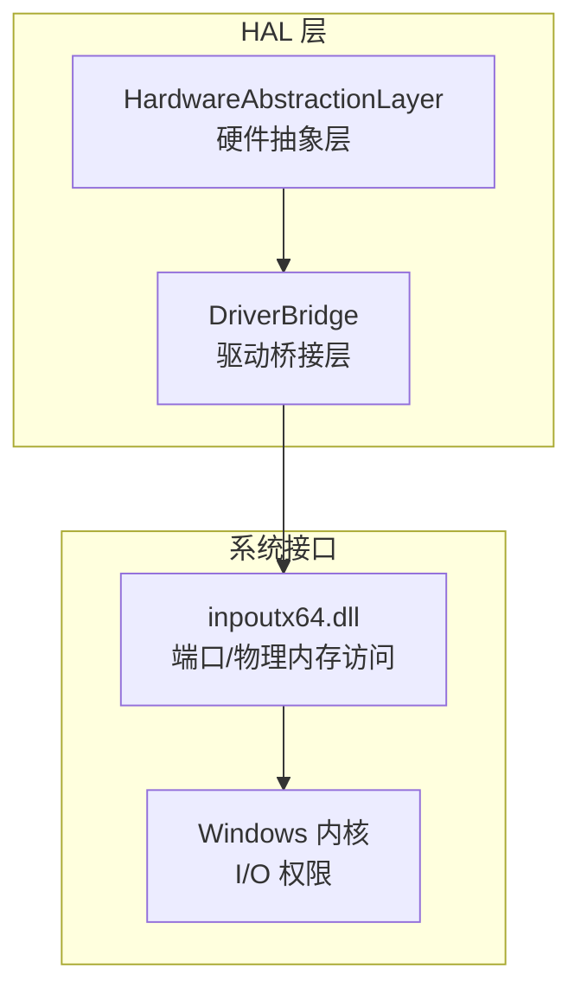
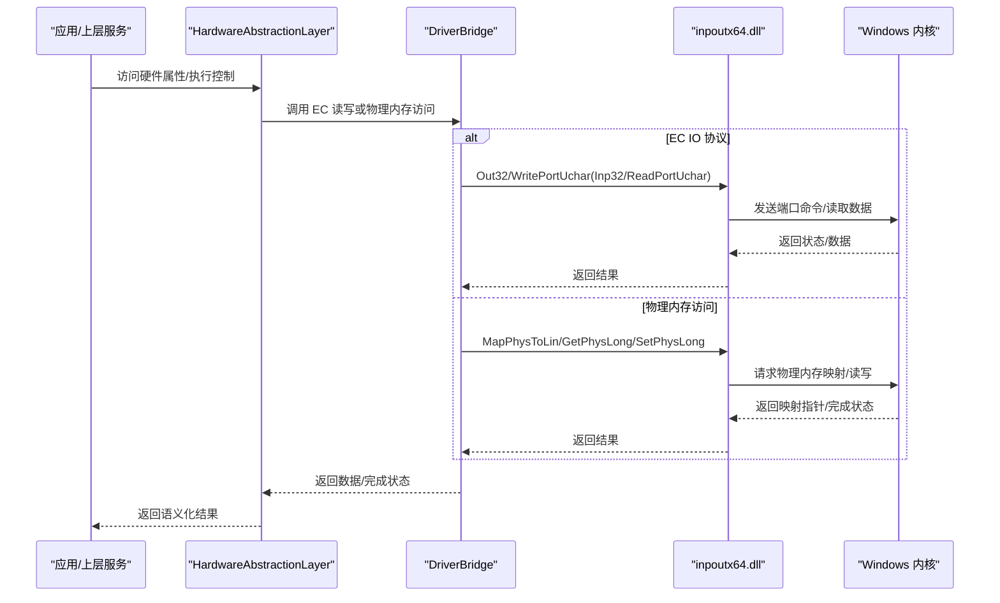
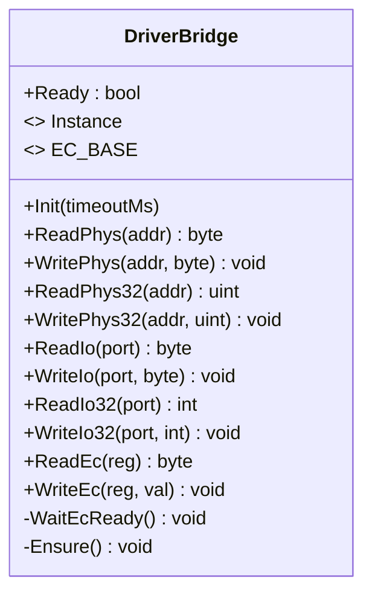
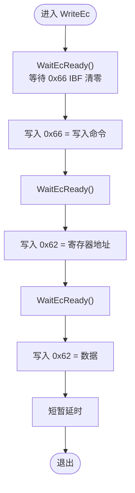
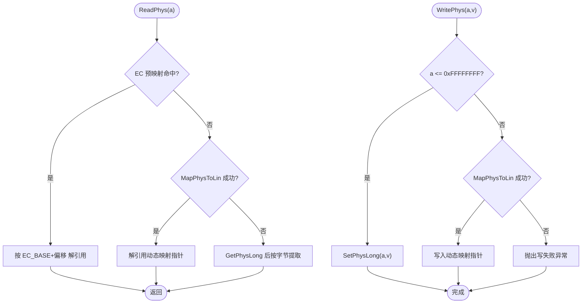
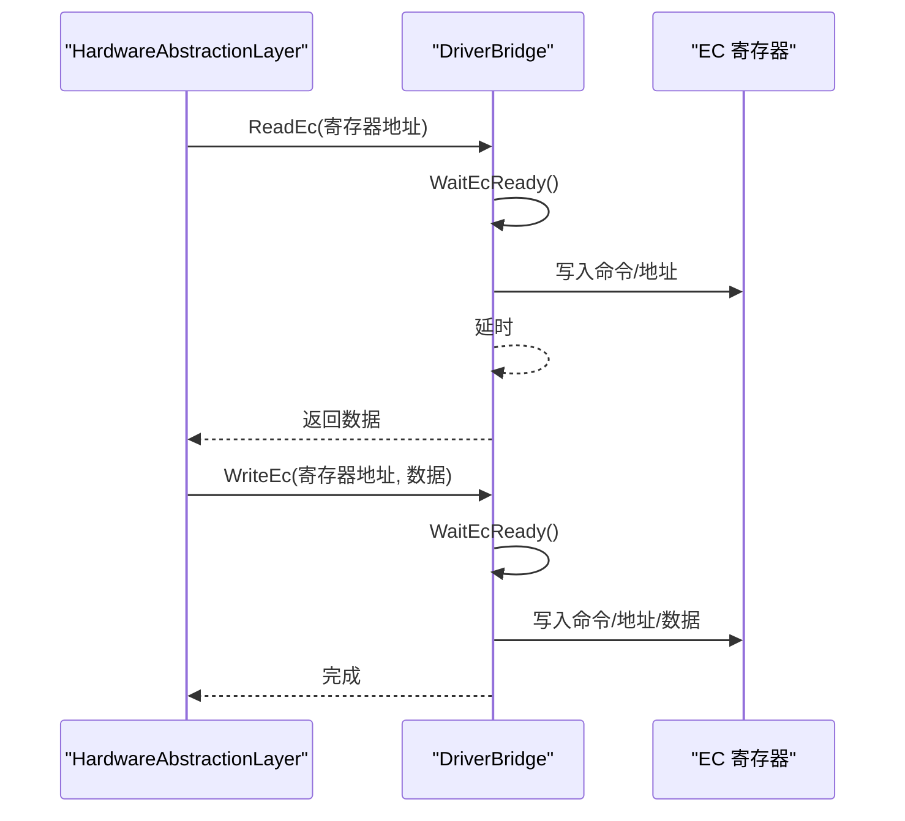

# 驱动桥接层

<cite>
**本文引用的文件**
- [DriverBridge.cs](file://server/hal/DriverBridge.cs)
- [HardwareAbstractionLayer.cs](file://server/hal/HardwareAbstractionLayer.cs)
- [Program.cs](file://server/api/Program.cs)
</cite>

## 目录
1. [引言](#引言)
2. [项目结构](#项目结构)
3. [核心组件](#核心组件)
4. [架构总览](#架构总览)
5. [详细组件分析](#详细组件分析)
6. [依赖关系分析](#依赖关系分析)
7. [性能考量](#性能考量)
8. [故障排查指南](#故障排查指南)
9. [结论](#结论)
10. [附录](#附录)

## 引言
本文件面向驱动桥接层（DriverBridge）与上层硬件抽象层（HardwareAbstractionLayer），系统性阐述以下主题：
- inpoutx64 驱动的集成原理与初始化流程（驱动检测、内存映射、端口访问）
- EC 寄存器访问协议（EC_BASE 基址、寄存器读写、线程安全）
- 物理内存访问方法（ReadPhys、WritePhys、ReadPhys32、WritePhys32）的实现与使用场景
- EC IO 协议的完整时序（WaitEcReady、寄存器地址写入、数据写入）
- 典型硬件访问示例（风扇控制、背光控制等）
- 错误处理与异常策略

## 项目结构
驱动桥接层位于 server/hal 目录，包含两个关键类：
- DriverBridge：封装 inpoutx64 的 P/Invoke 调用，提供底层端口与物理内存访问能力，并实现 EC IO 协议
- HardwareAbstractionLayer：在 DriverBridge 之上提供语义化硬件访问接口，集中管理 EC 寄存器偏移、电源计划、风扇控制、键盘背光等

图表来源
- [DriverBridge.cs:1-133](file://server/hal/DriverBridge.cs#L1-L133)
- [HardwareAbstractionLayer.cs:19-767](file://server/hal/HardwareAbstractionLayer.cs#L19-L767)

章节来源
- [DriverBridge.cs:1-133](file://server/hal/DriverBridge.cs#L1-L133)
- [HardwareAbstractionLayer.cs:19-767](file://server/hal/HardwareAbstractionLayer.cs#L19-L767)

## 核心组件
- DriverBridge
  - 提供端口读写（8/32 位）、物理内存映射与访问、EC IO 协议封装
  - 使用懒加载单例与双重检查锁确保线程安全初始化
  - 对 EC 区域提供预映射加速与回退路径
- HardwareAbstractionLayer
  - 定义 EC 寄存器偏移常量与语义化属性（风扇、背光、散热模式、电源计划等）
  - 统一封装 EC IO 与物理内存访问，提供健康检查与遥测读取

章节来源
- [DriverBridge.cs:9-133](file://server/hal/DriverBridge.cs#L9-L133)
- [HardwareAbstractionLayer.cs:19-767](file://server/hal/HardwareAbstractionLayer.cs#L19-L767)

## 架构总览
下图展示 HAL 与驱动桥接层之间的交互，以及与系统内核的调用链：

图表来源
- [DriverBridge.cs:11-26](file://server/hal/DriverBridge.cs#L11-L26)
- [DriverBridge.cs:39-52](file://server/hal/DriverBridge.cs#L39-L52)
- [DriverBridge.cs:97-130](file://server/hal/DriverBridge.cs#L97-L130)

## 详细组件分析

### DriverBridge：驱动桥接与 EC 协议
- 初始化与驱动检测
  - 通过 Out32(0x80)=0 后轮询 IsInpOutDriverOpen，超时则抛出异常
  - 成功后尝试 MapPhysToLin(EC_BASE, EC_SIZE)，建立 EC 区域预映射
- 端口访问
  - 8 位：ReadPortUcharNative/WritePortUcharNative
  - 32 位：Inp32Native/Out32Native
- 物理内存访问
  - ReadPhys：优先 EC 预映射；否则尝试动态 MapPhysToLin；最后回退到 GetPhysLong
  - WritePhys：优先 SetPhysLong；否则动态 MapPhysToLin 后写入
  - ReadPhys32/WritePhys32：直接使用 Get/SetPhysLong
- EC IO 协议
  - ReadEc/WriteEc：封装标准 EC 读写时序，内部使用 WaitEcReady 等待 IBF 空闲
  - WaitEcReady：轮询 0x66 状态，直到 IBF 标志位清零

图表来源
- [DriverBridge.cs:9-133](file://server/hal/DriverBridge.cs#L9-L133)

章节来源
- [DriverBridge.cs:39-52](file://server/hal/DriverBridge.cs#L39-L52)
- [DriverBridge.cs:56-85](file://server/hal/DriverBridge.cs#L56-L85)
- [DriverBridge.cs:97-130](file://server/hal/DriverBridge.cs#L97-L130)

### EC IO 协议时序（WriteEc）
WriteEc 的完整流程如下：
- 等待 IBF 空（WaitEcReady）
- 写入写入命令至 0x66
- 再次等待 IBF 空
- 写入寄存器地址至 0x62
- 再次等待 IBF 空
- 写入数据至 0x62
- 适当延时以满足硬件时序要求

图表来源
- [DriverBridge.cs:106-121](file://server/hal/DriverBridge.cs#L106-L121)
- [DriverBridge.cs:123-130](file://server/hal/DriverBridge.cs#L123-L130)

章节来源
- [DriverBridge.cs:106-121](file://server/hal/DriverBridge.cs#L106-L121)
- [DriverBridge.cs:123-130](file://server/hal/DriverBridge.cs#L123-L130)

### 物理内存访问方法
- ReadPhys
  - EC 预映射命中：按偏移计算指针后解引用
  - 动态映射：MapPhysToLin 后解引用
  - 回退：GetPhysLong 后按字节提取
- WritePhys
  - 低地址：SetPhysLong 直写（避免缓存无效）
  - 大地址：MapPhysToLin 后写入
- ReadPhys32/WritePhys32
  - 直接使用 Get/SetPhysLong

图表来源
- [DriverBridge.cs:56-85](file://server/hal/DriverBridge.cs#L56-L85)

章节来源
- [DriverBridge.cs:56-85](file://server/hal/DriverBridge.cs#L56-L85)

### 硬件抽象层（HAL）中的典型用法
- 风扇目标转速控制
  - 读取：EC 寄存器 0x5F（CPU）/0x5B（GPU），按公式转换为 RPM
  - 设置：将 RPM 转换为 0-255 的值后写入对应寄存器
- 键盘背光
  - 通过 WritePhys 写入 EC_BASE + OFF_KBNL，避免预映射缓存无效
- 散热模式
  - 通过 WritePhys 写入 EC_BASE + OFF_ITSM
- Fn 锁
  - 读取/修改 EC_BASE + OFF_FNHK 的特定位，再写回物理地址

图表来源
- [HardwareAbstractionLayer.cs:232-260](file://server/hal/HardwareAbstractionLayer.cs#L232-L260)
- [HardwareAbstractionLayer.cs:314-324](file://server/hal/HardwareAbstractionLayer.cs#L314-L324)
- [HardwareAbstractionLayer.cs:330-335](file://server/hal/HardwareAbstractionLayer.cs#L330-L335)
- [HardwareAbstractionLayer.cs:269-280](file://server/hal/HardwareAbstractionLayer.cs#L269-L280)

章节来源
- [HardwareAbstractionLayer.cs:232-260](file://server/hal/HardwareAbstractionLayer.cs#L232-L260)
- [HardwareAbstractionLayer.cs:314-324](file://server/hal/HardwareAbstractionLayer.cs#L314-L324)
- [HardwareAbstractionLayer.cs:330-335](file://server/hal/HardwareAbstractionLayer.cs#L330-L335)
- [HardwareAbstractionLayer.cs:269-280](file://server/hal/HardwareAbstractionLayer.cs#L269-L280)

## 依赖关系分析
- DriverBridge 依赖 inpoutx64.dll 的导出函数，负责端口与物理内存访问
- HardwareAbstractionLayer 依赖 DriverBridge 实例，提供高层语义化接口
- 程序入口在 API 层，会读取并展示 EC_BASE 常量用于调试

图表来源
- [Program.cs:207](file://server/api/Program.cs#L207)
- [HardwareAbstractionLayer.cs:48-52](file://server/hal/HardwareAbstractionLayer.cs#L48-L52)
- [DriverBridge.cs:37-52](file://server/hal/DriverBridge.cs#L37-L52)

章节来源
- [Program.cs:207](file://server/api/Program.cs#L207)
- [HardwareAbstractionLayer.cs:48-52](file://server/hal/HardwareAbstractionLayer.cs#L48-L52)
- [DriverBridge.cs:37-52](file://server/hal/DriverBridge.cs#L37-L52)

## 性能考量
- EC 区域预映射：优先使用 MapPhysToLin 建立一次性映射，减少重复映射开销
- 写入路径优化：针对特定地址（如键盘背光）直接使用 SetPhysLong，避免无效缓存
- EC IO 仲裁：风扇转速读取采用双字节读取与多次尝试，降低竞态影响
- 线程安全：初始化使用双重检查锁；EC IO 使用互斥锁保护时序一致性

章节来源
- [DriverBridge.cs:49](file://server/hal/DriverBridge.cs#L49)
- [DriverBridge.cs:30-32](file://server/hal/DriverBridge.cs#L30-L32)
- [DriverBridge.cs:100-104](file://server/hal/DriverBridge.cs#L100-L104)
- [HardwareAbstractionLayer.cs:192-224](file://server/hal/HardwareAbstractionLayer.cs#L192-L224)

## 故障排查指南
- 驱动初始化失败
  - 现象：抛出“驱动失败”异常
  - 排查：确认已以管理员权限运行；检查 IsInpOutDriverOpen 是否返回真；适当增大 Init 超时
- EC IO 读写异常
  - 现象：读取返回 0 或抛出异常
  - 排查：确认 WaitEcReady 成功；检查寄存器地址与目标设备兼容性；必要时回退到物理内存访问
- 物理内存访问失败
  - 现象：ReadPhys/WritePhys 抛出“读失败/写失败”
  - 排查：确认地址范围与权限；对于大地址使用动态映射；对需要直写的地址使用 SetPhysLong
- 线程安全问题
  - 现象：并发读写导致时序错乱
  - 排查：确保使用 DriverBridge 的内置锁；避免在外部自行并发访问 EC IO

章节来源
- [DriverBridge.cs:39-52](file://server/hal/DriverBridge.cs#L39-L52)
- [DriverBridge.cs:56-85](file://server/hal/DriverBridge.cs#L56-L85)
- [DriverBridge.cs:97-130](file://server/hal/DriverBridge.cs#L97-L130)

## 结论
驱动桥接层通过 inpoutx64 提供了稳定的端口与物理内存访问能力，并以 EC IO 协议封装了对嵌入式控制器（EC）的统一访问接口。硬件抽象层在此基础上提供了丰富的语义化控制与遥测读取，兼顾性能与可靠性。遵循本文所述初始化流程、时序控制与错误处理策略，可有效提升系统的稳定性与可维护性。

## 附录
- EC_BASE 常量与 EC 区域大小
  - EC_BASE：系统内存映射的 EC 基址
  - EC_SIZE：EC 区域大小
- 关键 API 路径参考
  - 初始化：[DriverBridge.cs:39-52](file://server/hal/DriverBridge.cs#L39-L52)
  - EC 读写：[DriverBridge.cs:97-130](file://server/hal/DriverBridge.cs#L97-L130)
  - 物理内存读写：[DriverBridge.cs:56-85](file://server/hal/DriverBridge.cs#L56-L85)
  - HAL 示例用法：[HardwareAbstractionLayer.cs:232-260](file://server/hal/HardwareAbstractionLayer.cs#L232-L260), [HardwareAbstractionLayer.cs:314-324](file://server/hal/HardwareAbstractionLayer.cs#L314-L324), [HardwareAbstractionLayer.cs:330-335](file://server/hal/HardwareAbstractionLayer.cs#L330-L335), [HardwareAbstractionLayer.cs:269-280](file://server/hal/HardwareAbstractionLayer.cs#L269-L280)