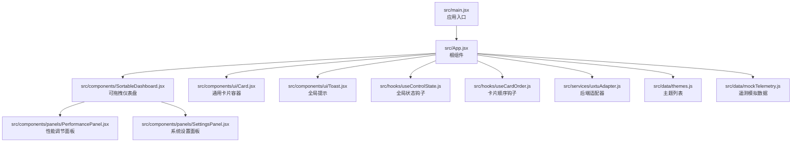
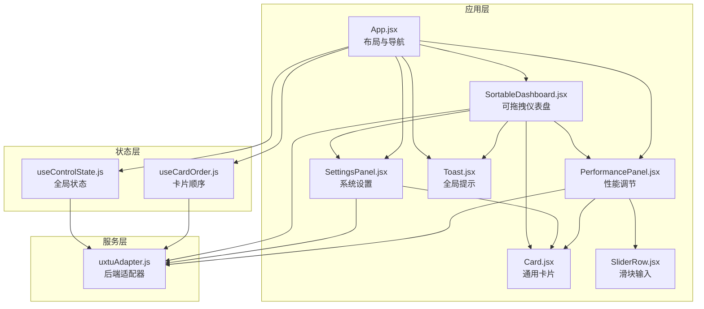
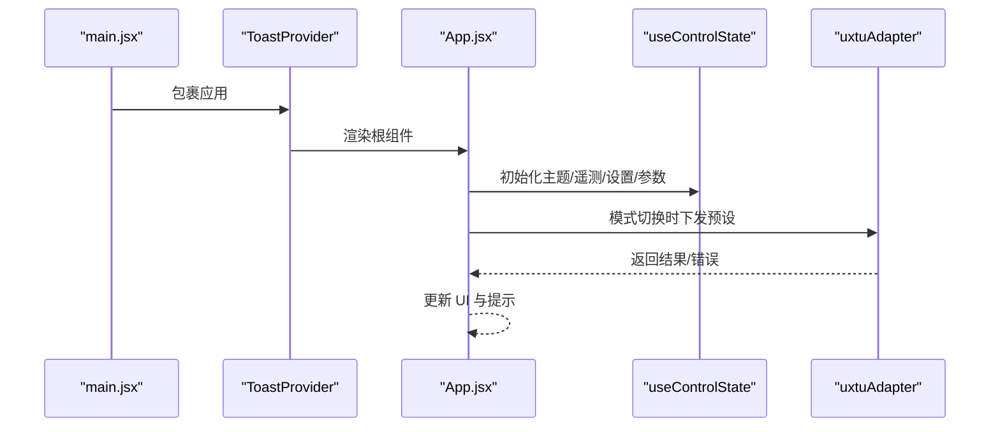
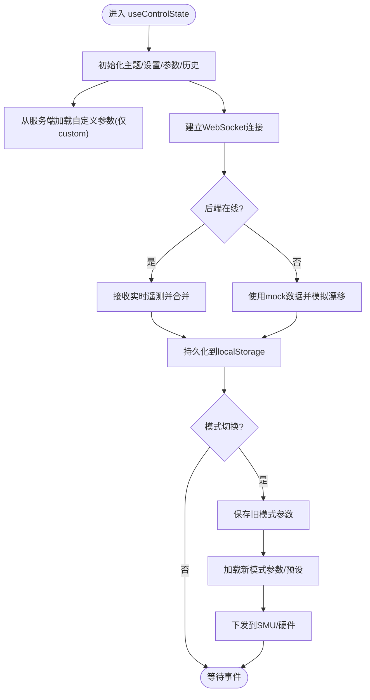
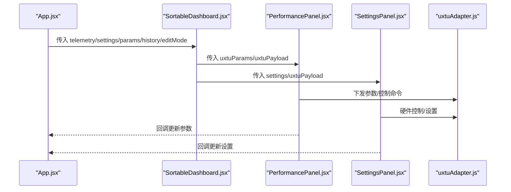
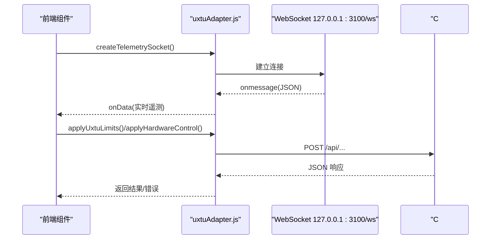
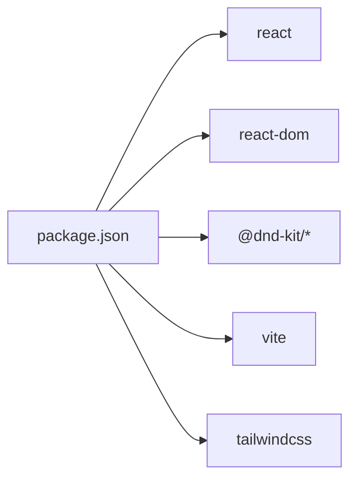

# 前端架构

<cite>
**本文引用的文件**
- [src/App.jsx](file://src/App.jsx)
- [src/main.jsx](file://src/main.jsx)
- [src/hooks/useControlState.js](file://src/hooks/useControlState.js)
- [src/hooks/useCardOrder.js](file://src/hooks/useCardOrder.js)
- [src/services/uxtuAdapter.js](file://src/services/uxtuAdapter.js)
- [src/components/SortableDashboard.jsx](file://src/components/SortableDashboard.jsx)
- [src/components/panels/PerformancePanel.jsx](file://src/components/panels/PerformancePanel.jsx)
- [src/components/panels/SettingsPanel.jsx](file://src/components/panels/SettingsPanel.jsx)
- [src/components/ui/Toast.jsx](file://src/components/ui/Toast.jsx)
- [src/components/ui/Card.jsx](file://src/components/ui/Card.jsx)
- [src/components/ui/SliderRow.jsx](file://src/components/ui/SliderRow.jsx)
- [src/data/themes.js](file://src/data/themes.js)
- [src/data/mockTelemetry.js](file://src/data/mockTelemetry.js)
- [package.json](file://package.json)
- [vite.config.js](file://vite.config.js)
</cite>

## 目录
1. [引言](#引言)
2. [项目结构](#项目结构)
3. [核心组件](#核心组件)
4. [架构总览](#架构总览)
5. [组件详解](#组件详解)
6. [依赖关系分析](#依赖关系分析)
7. [性能考量](#性能考量)
8. [故障排查指南](#故障排查指南)
9. [结论](#结论)
10. [附录](#附录)

## 引言
本文件面向 DOUZHANZHE-Control 前端应用，提供一份系统化的架构文档。内容涵盖 React 应用的组件层次结构、根组件 App 的设计模式与路由配置、状态管理机制（含自定义 Hook useCardOrder 与 useControlState）、组件间通信模式、前端与后端的通信机制（WebSocket 实时数据与 RESTful API 调用）、模块化设计与可维护性建议，并通过多种可视化图表帮助读者快速理解系统。

## 项目结构
前端采用基于功能域的模块化组织方式，主要目录与职责如下：
- src/main.jsx：应用入口，挂载根组件与全局 Provider
- src/App.jsx：根组件，负责页面布局、主题切换、标签页导航、模式选择与面板渲染
- src/hooks：自定义 Hook，封装跨组件共享的状态逻辑
- src/components：UI 组件与业务面板，按功能域拆分（ui、panels）
- src/services：后端接口适配层，统一 REST 与 WebSocket 访问
- src/data：静态数据与主题列表
- vite.config.js：构建与开发服务器配置
- package.json：依赖与脚本

**图表来源**
- [src/main.jsx:1-14](file://src/main.jsx#L1-L14)
- [src/App.jsx:1-134](file://src/App.jsx#L1-L134)
- [src/components/SortableDashboard.jsx:1-247](file://src/components/SortableDashboard.jsx#L1-L247)
- [src/components/panels/PerformancePanel.jsx:1-213](file://src/components/panels/PerformancePanel.jsx#L1-L213)
- [src/components/panels/SettingsPanel.jsx:1-124](file://src/components/panels/SettingsPanel.jsx#L1-L124)
- [src/components/ui/Card.jsx:1-18](file://src/components/ui/Card.jsx#L1-L18)
- [src/components/ui/Toast.jsx:1-50](file://src/components/ui/Toast.jsx#L1-L50)
- [src/hooks/useControlState.js:1-355](file://src/hooks/useControlState.js#L1-L355)
- [src/hooks/useCardOrder.js:1-128](file://src/hooks/useCardOrder.js#L1-L128)
- [src/services/uxtuAdapter.js:1-130](file://src/services/uxtuAdapter.js#L1-L130)
- [src/data/themes.js:1-34](file://src/data/themes.js#L1-L34)
- [src/data/mockTelemetry.js:1-22](file://src/data/mockTelemetry.js#L1-L22)

**章节来源**
- [src/main.jsx:1-14](file://src/main.jsx#L1-L14)
- [src/App.jsx:1-134](file://src/App.jsx#L1-L134)
- [package.json:1-33](file://package.json#L1-L33)
- [vite.config.js:1-8](file://vite.config.js#L1-L8)

## 核心组件
- 根组件 App：负责主题与布局、标签页导航、模式选择、面板渲染与全局状态注入
- 自定义 Hook
  - useControlState：集中管理主题、遥测、历史曲线、UX TU 参数、风扇目标转速、设置、后端连接状态与持久化策略
  - useCardOrder：管理卡片顺序、隐藏集合、本地与服务端同步
- 业务面板
  - SortableDashboard：可拖拽卡片布局，聚合各功能卡片
  - PerformancePanel：CPU/GPU 调节与参数下发
  - SettingsPanel：系统开关、键盘灯、开机自启等设置
- UI 组件
  - Card：通用卡片容器
  - SliderRow：滑块输入
  - Toast：全局提示

**章节来源**
- [src/App.jsx:23-134](file://src/App.jsx#L23-L134)
- [src/hooks/useControlState.js:26-355](file://src/hooks/useControlState.js#L26-L355)
- [src/hooks/useCardOrder.js:46-128](file://src/hooks/useCardOrder.js#L46-L128)
- [src/components/SortableDashboard.jsx:38-247](file://src/components/SortableDashboard.jsx#L38-L247)
- [src/components/panels/PerformancePanel.jsx:13-213](file://src/components/panels/PerformancePanel.jsx#L13-L213)
- [src/components/panels/SettingsPanel.jsx:8-124](file://src/components/panels/SettingsPanel.jsx#L8-L124)
- [src/components/ui/Card.jsx:1-18](file://src/components/ui/Card.jsx#L1-L18)
- [src/components/ui/SliderRow.jsx:1-23](file://src/components/ui/SliderRow.jsx#L1-L23)
- [src/components/ui/Toast.jsx:1-50](file://src/components/ui/Toast.jsx#L1-L50)

## 架构总览
前端采用“根组件 + 自定义 Hook + 业务面板 + UI 组件”的分层架构。根组件 App 负责顶层布局与状态注入，自定义 Hook 抽离跨组件共享的状态与副作用，业务面板组合 UI 组件完成具体功能，服务层统一封装后端交互。

**图表来源**
- [src/App.jsx:23-134](file://src/App.jsx#L23-L134)
- [src/components/SortableDashboard.jsx:38-247](file://src/components/SortableDashboard.jsx#L38-L247)
- [src/components/panels/PerformancePanel.jsx:13-213](file://src/components/panels/PerformancePanel.jsx#L13-L213)
- [src/components/panels/SettingsPanel.jsx:8-124](file://src/components/panels/SettingsPanel.jsx#L8-L124)
- [src/components/ui/Card.jsx:1-18](file://src/components/ui/Card.jsx#L1-L18)
- [src/components/ui/SliderRow.jsx:1-23](file://src/components/ui/SliderRow.jsx#L1-L23)
- [src/components/ui/Toast.jsx:1-50](file://src/components/ui/Toast.jsx#L1-L50)
- [src/hooks/useControlState.js:26-355](file://src/hooks/useControlState.js#L26-L355)
- [src/hooks/useCardOrder.js:46-128](file://src/hooks/useCardOrder.js#L46-L128)
- [src/services/uxtuAdapter.js:19-130](file://src/services/uxtuAdapter.js#L19-L130)

## 组件详解

### 根组件 App.jsx 设计模式与路由配置
- 设计模式
  - Provider 注入：在入口 main.jsx 中通过 ToastProvider 包裹 App，实现全局提示能力
  - 状态注入：useControlState 提供主题、遥测、历史、UX TU 参数、设置、风扇目标转速等状态
  - 条件渲染：根据 activeTab 渲染不同面板；编辑模式下展示排序工具
  - 模式选择：通过 MODE_PRESETS 与 thermalModeMap 下发预设与散热模式
- 路由配置
  - 未使用 React Router，采用本地状态 activeTab 控制面板切换，持久化于 localStorage
  - 导航项与 tab 映射通过 NAV_ITEMS 与 NAV_TABS 定义

**图表来源**
- [src/main.jsx:7-13](file://src/main.jsx#L7-L13)
- [src/App.jsx:23-134](file://src/App.jsx#L23-L134)
- [src/hooks/useControlState.js:26-355](file://src/hooks/useControlState.js#L26-L355)
- [src/services/uxtuAdapter.js:19-130](file://src/services/uxtuAdapter.js#L19-L130)

**章节来源**
- [src/main.jsx:1-14](file://src/main.jsx#L1-L14)
- [src/App.jsx:14-134](file://src/App.jsx#L14-L134)

### 状态管理机制：useControlState 与 useCardOrder
- useControlState
  - 职责：主题、遥测、历史曲线、UX TU 参数、风扇目标转速、设置、后端在线状态、持久化策略
  - 关键点：
    - 遥测历史：MAX_HISTORY 控制长度，每次 telemetry 变化追加
    - 模式切换：保存旧模式参数至 localStorage，加载新模式参数或预设
    - 自定义参数：仅在 custom 模式下持久化至服务端，其他模式走预设
    - 风扇目标转速：去抖 600ms 同步至后端
    - WebSocket：实时接收后端遥测，失败时回退 mock 数据
- useCardOrder
  - 职责：卡片顺序与隐藏集合管理，本地与服务端同步
  - 关键点：
    - 默认顺序与隐藏集合来自常量数组
    - 启动时从 /api/ui-state 拉取服务端 UI 状态，合并默认项
    - 退出编辑模式时同步到服务端

**图表来源**
- [src/hooks/useControlState.js:26-355](file://src/hooks/useControlState.js#L26-L355)
- [src/data/mockTelemetry.js:1-22](file://src/data/mockTelemetry.js#L1-L22)

**章节来源**
- [src/hooks/useControlState.js:26-355](file://src/hooks/useControlState.js#L26-L355)
- [src/hooks/useCardOrder.js:46-128](file://src/hooks/useCardOrder.js#L46-L128)

### 组件间通信模式
- 父组件到子组件
  - App.jsx 向 SortableDashboard 传递 telemetry、settings、uxtuParams、风扇目标转速、history、editMode 等
  - SortableDashboard 向 PerformancePanel 与 SettingsPanel 传递对应 props
- 子组件到父组件
  - 子组件通过回调（如 setUxtuParams、setSettings、setFanLargeRpmTarget 等）更新上层状态
  - ToastProvider 通过 useToast 在任意层级弹出提示

**图表来源**
- [src/App.jsx:70-128](file://src/App.jsx#L70-L128)
- [src/components/SortableDashboard.jsx:38-247](file://src/components/SortableDashboard.jsx#L38-L247)
- [src/components/panels/PerformancePanel.jsx:13-213](file://src/components/panels/PerformancePanel.jsx#L13-L213)
- [src/components/panels/SettingsPanel.jsx:8-124](file://src/components/panels/SettingsPanel.jsx#L8-L124)
- [src/services/uxtuAdapter.js:19-130](file://src/services/uxtuAdapter.js#L19-L130)

**章节来源**
- [src/App.jsx:28-128](file://src/App.jsx#L28-L128)
- [src/components/SortableDashboard.jsx:38-247](file://src/components/SortableDashboard.jsx#L38-L247)
- [src/components/panels/PerformancePanel.jsx:13-213](file://src/components/panels/PerformancePanel.jsx#L13-L213)
- [src/components/panels/SettingsPanel.jsx:8-124](file://src/components/panels/SettingsPanel.jsx#L8-L124)

### 前端与后端通信机制
- WebSocket 实时数据
  - 使用 uxtuAdapter.createTelemetrySocket 连接本地 127.0.0.1:3100/ws
  - 成功时更新遥测与在线状态，失败时自动重连
- RESTful API
  - 遥测与参数：/api/telemetry、/api/uxtu/apply
  - 硬件控制：/api/control、/api/fan/set-target、/api/gpu/set、/api/gpu/status、/api/smu/set
  - UI 状态：/api/ui-state
  - 自定义参数：/api/custom-params
  - 开机自启：/api/auto-start、/api/auto-start-opts
- 适配器封装
  - 所有网络请求集中于 uxtuAdapter，便于统一错误处理与扩展

**图表来源**
- [src/services/uxtuAdapter.js:58-71](file://src/services/uxtuAdapter.js#L58-L71)
- [src/services/uxtuAdapter.js:19-88](file://src/services/uxtuAdapter.js#L19-L88)
- [src/hooks/useControlState.js:242-257](file://src/hooks/useControlState.js#L242-L257)

**章节来源**
- [src/services/uxtuAdapter.js:19-130](file://src/services/uxtuAdapter.js#L19-L130)
- [src/hooks/useControlState.js:242-336](file://src/hooks/useControlState.js#L242-L336)

### 模块化设计与可维护性
- 分层清晰：UI 组件、业务面板、自定义 Hook、服务适配器职责明确
- 单一职责：每个 Hook/组件只关注自身领域，降低耦合
- 可测试性：服务层集中封装，便于替换与模拟
- 可扩展性：新增卡片/面板只需遵循现有模式，无需改动根组件

**章节来源**
- [src/components/ui/Card.jsx:1-18](file://src/components/ui/Card.jsx#L1-L18)
- [src/components/ui/SliderRow.jsx:1-23](file://src/components/ui/SliderRow.jsx#L1-L23)
- [src/components/ui/Toast.jsx:1-50](file://src/components/ui/Toast.jsx#L1-L50)
- [src/hooks/useControlState.js:26-355](file://src/hooks/useControlState.js#L26-L355)
- [src/hooks/useCardOrder.js:46-128](file://src/hooks/useCardOrder.js#L46-L128)

## 依赖关系分析
- 依赖管理：React 19、@dnd-kit 实现拖拽、TailwindCSS 样式、Vite 构建
- 运行时依赖集中在 package.json，构建脚本自动将 dist 内容复制到后端 wwwroot

**图表来源**
- [package.json:11-31](file://package.json#L11-L31)

**章节来源**
- [package.json:1-33](file://package.json#L1-L33)
- [vite.config.js:1-8](file://vite.config.js#L1-L8)

## 性能考量
- 遥测更新策略：useControlState 对风扇目标转速与自定义参数进行去抖，减少频繁请求
- 历史数据截断：MAX_HISTORY 控制数组长度，避免内存膨胀
- 模式切换优化：仅在必要时下发参数，避免重复调用
- 拖拽体验：@dnd-kit 提供高性能拖拽，激活约束降低误触

[本节为通用指导，无需特定文件引用]

## 故障排查指南
- WebSocket 不可用
  - 现象：遥测停止更新，界面提示后端离线
  - 排查：确认本地 127.0.0.1:3100/ws 是否可达，检查 uxtuAdapter 的连接与重连逻辑
- 参数下发失败
  - 现象：点击“应用”无响应或提示失败
  - 排查：查看 uxtuAdapter.applyUxtuLimits 返回状态，确认后端是否正确处理
- UI 状态不同步
  - 现象：退出编辑模式后卡片顺序未保存
  - 排查：确认 useCardOrder.syncToServer 是否被触发，检查 /api/ui-state 的返回码
- 开机自启设置失败
  - 现象：设置开关无效
  - 排查：检查 /api/auto-start 与 /api/auto-start-opts 的响应体与错误信息

**章节来源**
- [src/services/uxtuAdapter.js:58-71](file://src/services/uxtuAdapter.js#L58-L71)
- [src/hooks/useControlState.js:144-169](file://src/hooks/useControlState.js#L144-L169)
- [src/hooks/useCardOrder.js:78-91](file://src/hooks/useCardOrder.js#L78-L91)
- [src/components/panels/SettingsPanel.jsx:23-48](file://src/components/panels/SettingsPanel.jsx#L23-L48)

## 结论
该前端应用通过清晰的分层与自定义 Hook，实现了状态集中管理与高效的数据流；通过服务层统一封装后端交互，提升了可维护性与可扩展性；组件间通信简洁明确，配合拖拽与实时遥测，提供了良好的用户体验。建议后续可引入更完善的错误边界与日志上报，进一步增强可观测性。

[本节为总结，无需特定文件引用]

## 附录
- 主题列表：位于 themes.js，支持多套主题切换
- 模拟遥测：位于 mockTelemetry.js，用于后端不可用时的回退

**章节来源**
- [src/data/themes.js:1-34](file://src/data/themes.js#L1-L34)
- [src/data/mockTelemetry.js:1-22](file://src/data/mockTelemetry.js#L1-L22)