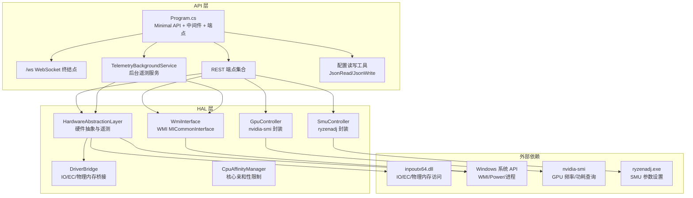
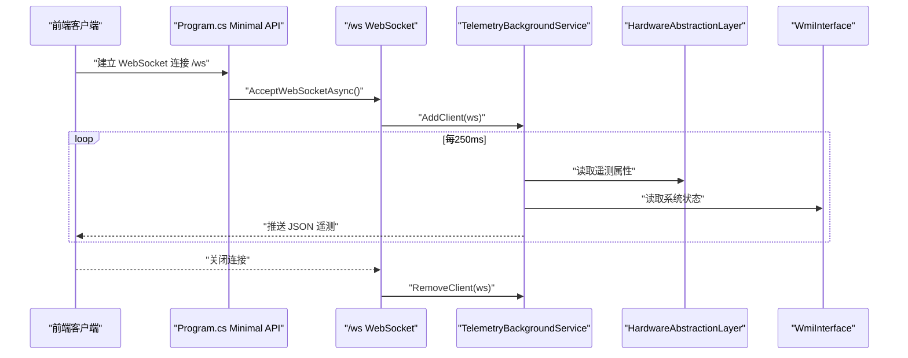
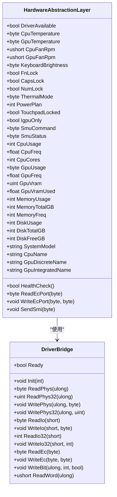
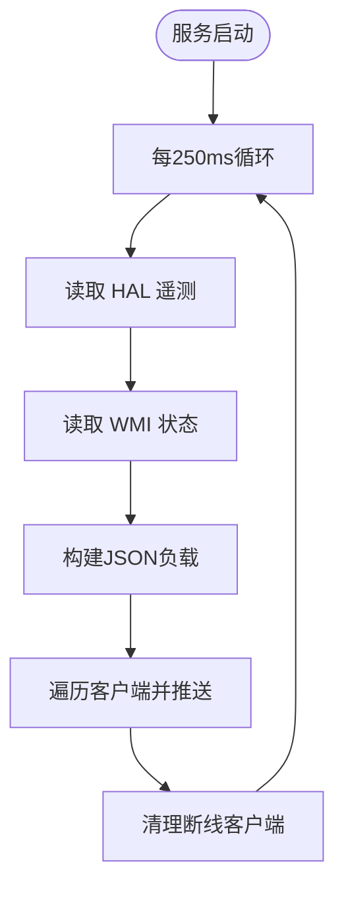
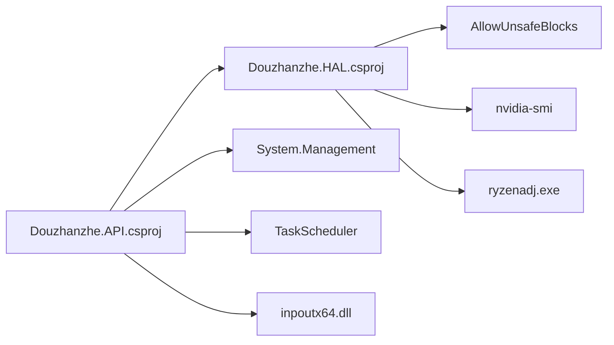

# 后端架构

<cite>
**本文引用的文件**
- [Program.cs](file://server/api/Program.cs)
- [TelemetryBackgroundService.cs](file://server/api/TelemetryBackgroundService.cs)
- [HardwareAbstractionLayer.cs](file://server/hal/HardwareAbstractionLayer.cs)
- [DriverBridge.cs](file://server/hal/DriverBridge.cs)
- [WmiInterface.cs](file://server/api/WmiInterface.cs)
- [GpuController.cs](file://server/hal/GpuController.cs)
- [SmuController.cs](file://server/hal/SmuController.cs)
- [CpuAffinityManager.cs](file://server/hal/CpuAffinityManager.cs)
- [Douzhanzhe.API.csproj](file://server/api/Douzhanzhe.API.csproj)
- [Douzhanzhe.HAL.csproj](file://server/hal/Douzhanzhe.HAL.csproj)
- [appsettings.json](file://server/api/appsettings.json)
- [custom-params.json](file://server/api/config/custom-params.json)
- [dashboard-default.json](file://server/config/dashboard-default.json)
</cite>

## 目录
1. [简介](#简介)
2. [项目结构](#项目结构)
3. [核心组件](#核心组件)
4. [架构总览](#架构总览)
5. [详细组件分析](#详细组件分析)
6. [依赖关系分析](#依赖关系分析)
7. [性能考量](#性能考量)
8. [故障排查指南](#故障排查指南)
9. [结论](#结论)
10. [附录](#附录)

## 简介
本架构文档面向 DOUZHANZHE-Control 后端服务，围绕基于 ASP.NET Core 的 Minimal API 设计与中间件配置，系统性阐述硬件抽象层（HAL）设计理念与实现，后台服务机制（TelemetryBackgroundService）与定时任务管理，RESTful API 设计规范（端点设计原则、请求/响应格式与错误处理），以及 WebSocket 实时通信与客户端连接管理。同时覆盖服务生命周期管理、配置管理与性能优化策略，帮助读者快速理解并高效维护该系统。

## 项目结构
后端采用“API 层 + HAL 层”的分层架构：
- API 层：负责 Minimal API 端点、中间件、静态资源托管、后台服务注册与生命周期管理。
- HAL 层：提供硬件抽象与控制能力，封装底层驱动桥接、WMI 接口、GPU 控制、SMU 控制与 CPU 核心限制等。
- 配置与持久化：通过 JSON 文件进行 UI 状态、默认仪表盘布局与自定义参数的持久化。

图表来源
- [Program.cs:1-783](file://server/api/Program.cs#L1-L783)
- [HardwareAbstractionLayer.cs:1-772](file://server/hal/HardwareAbstractionLayer.cs#L1-L772)
- [DriverBridge.cs:1-150](file://server/hal/DriverBridge.cs#L1-L150)
- [WmiInterface.cs:1-210](file://server/api/WmiInterface.cs#L1-L210)
- [GpuController.cs:1-116](file://server/hal/GpuController.cs#L1-L116)
- [SmuController.cs:1-142](file://server/hal/SmuController.cs#L1-L142)
- [CpuAffinityManager.cs:1-100](file://server/hal/CpuAffinityManager.cs#L1-L100)

章节来源
- [Program.cs:1-783](file://server/api/Program.cs#L1-L783)
- [Douzhanzhe.API.csproj:1-40](file://server/api/Douzhanzhe.API.csproj#L1-L40)
- [Douzhanzhe.HAL.csproj:1-18](file://server/hal/Douzhanzhe.HAL.csproj#L1-L18)

## 核心组件
- Minimal API 与中间件
  - 使用 WebApplicationBuilder 构建应用，注册 HAL、控制器与后台服务，启用 CORS、WebSocket、静态文件与 SPA 回退。
  - 通过路由映射实现 REST 端点与 WebSocket 终结点。
- 硬件抽象层（HAL）
  - 提供统一硬件访问接口，封装 EC/IO/物理内存读写、遥测采集、系统信息查询、电源计划切换、键盘背光与锁状态、散热模式、IGPU 模式、SMI 触发、EC 协议访问等。
- 后台遥测服务
  - 每 250ms 采集一次遥测并通过 WebSocket 推送给所有客户端；支持客户端连接管理与断线清理。
- WMI 接口
  - 通过 root/WMI 的 MICommonInterface 实现 FnLock、触摸板锁、GPU 模式、风扇控制等系统级操作。
- GPU 控制器
  - 基于 nvidia-smi 的子进程封装，提供锁频、上限限制、显存频率控制与状态查询。
- SMU 控制器
  - 基于 ryzenadj 的子进程封装，提供功耗、温度、曲线优化、频率限制与睿频禁用等参数设置。
- CPU 核心亲和性管理
  - 通过 WMI 监听进程启动事件，动态设置进程 CPU 亲和性掩码，实现核心数限制。
- 配置与持久化
  - 提供 JSON 读写工具，持久化自定义参数、UI 状态与默认仪表盘布局。

章节来源
- [Program.cs:1-783](file://server/api/Program.cs#L1-L783)
- [HardwareAbstractionLayer.cs:1-772](file://server/hal/HardwareAbstractionLayer.cs#L1-L772)
- [TelemetryBackgroundService.cs:1-143](file://server/api/TelemetryBackgroundService.cs#L1-L143)
- [WmiInterface.cs:1-210](file://server/api/WmiInterface.cs#L1-L210)
- [GpuController.cs:1-116](file://server/hal/GpuController.cs#L1-L116)
- [SmuController.cs:1-142](file://server/hal/SmuController.cs#L1-L142)
- [CpuAffinityManager.cs:1-100](file://server/hal/CpuAffinityManager.cs#L1-L100)

## 架构总览
后端采用 Minimal API 的极简风格，结合后台服务与 WebSocket 实现实时遥测推送。HAL 作为硬件抽象核心，向上提供统一语义接口，向下通过 DriverBridge 访问 IO/EC/物理内存，并通过 WMI、nvidia-smi、ryzenadj 等系统/第三方工具完成系统级与硬件级控制。

图表来源
- [Program.cs:56-86](file://server/api/Program.cs#L56-L86)
- [TelemetryBackgroundService.cs:54-141](file://server/api/TelemetryBackgroundService.cs#L54-L141)
- [HardwareAbstractionLayer.cs:580-747](file://server/hal/HardwareAbstractionLayer.cs#L580-L747)
- [WmiInterface.cs:62-87](file://server/api/WmiInterface.cs#L62-L87)

## 详细组件分析

### Minimal API 与中间件配置
- 依赖注入与服务注册
  - 注册 HAL、SMU 控制器、GPU 控制器、WMI 接口与后台遥测服务。
  - 添加跨域策略，默认允许任意来源/方法/头。
- 中间件管线
  - UseCors → UseWebSockets → UseDefaultFiles → UseStaticFiles → MapFallbackToFile("index.html")
- 静态资源与 SPA 回退
  - 提供前端静态资源与 SPA 回退至 index.html，便于前后端一体化部署。
- 配置目录与持久化工具
  - 自动定位 config 目录（支持共享 Node.js 目录），提供 JsonRead/JsonWrite 工具进行 JSON 持久化。
- 端点映射
  - /ws：WebSocket 遥测通道
  - /api/telemetry：一次性遥测查询
  - /api/system/info：系统信息查询
  - /api/health：健康检查
  - /api/control：通用控制端点（键盘背光、锁状态、散热模式、电源计划、IGPU 模式、EC 写入等）
  - /api/discover：发现与驱动状态
  - /api/ec-scan：EC 寄存器扫描
  - /api/smu/*：SMU 参数设置、探测、寄存器读取等
  - /api/pci/probe：PCI 设备探测
  - /api/fan/*：风扇手动控制与状态读取
  - /api/gpu/*：GPU 频率/显存控制与状态查询
  - /api/wmi/cmd：WMI 原始命令调用
  - /api/custom-params、/api/ui-state、/api/default-config：配置持久化端点
  - /api/auto-start*：Windows 自启动任务管理
  - /debug：调试页面（内嵌 HTML）

章节来源
- [Program.cs:9-27](file://server/api/Program.cs#L9-L27)
- [Program.cs:15-22](file://server/api/Program.cs#L15-L22)
- [Program.cs:28-55](file://server/api/Program.cs#L28-L55)
- [Program.cs:56-86](file://server/api/Program.cs#L56-L86)
- [Program.cs:87-584](file://server/api/Program.cs#L87-L584)

### 硬件抽象层（HAL）设计与实现
- 设计理念
  - 在 DriverBridge 之上提供语义化硬件访问接口，屏蔽底层 EC/IO/物理内存细节，统一遥测与控制语义。
  - 所有物理地址偏移与寄存器映射均来自 DSDT/SSDT 反编译确认的 EC 寄存器映射。
- 关键职责
  - 遥测采集：CPU/GPU 温度、使用率、频率、显存、内存、磁盘、风扇转速等。
  - 系统开关：Fn 锁、CapsLock/NumLock、散热模式、电源计划、IGPU 模式、触摸板锁等。
  - EC 协议：通过 EC IO 端口 0x62/0x66 读写寄存器。
  - SMI 触发：通过 APM 端口触发 SMI。
  - 系统信息：通过 PowerShell 查询制造商、型号、CPU/GPU 名称等。
  - 健康检查：验证驱动与 EC 通信是否正常。
- 数据缓存与降级
  - 对频繁查询的遥测与系统信息设置缓存窗口，避免过度调用系统工具。
  - 当底层驱动不可用时，返回安全默认值，保证服务可用性。
- 依赖注入
  - HAL 由构造函数注入，DriverBridge 作为单例实例，确保硬件访问一致性。

图表来源
- [HardwareAbstractionLayer.cs:19-772](file://server/hal/HardwareAbstractionLayer.cs#L19-L772)
- [DriverBridge.cs:9-150](file://server/hal/DriverBridge.cs#L9-L150)

章节来源
- [HardwareAbstractionLayer.cs:1-772](file://server/hal/HardwareAbstractionLayer.cs#L1-L772)
- [DriverBridge.cs:1-150](file://server/hal/DriverBridge.cs#L1-L150)

### 后台遥测服务（TelemetryBackgroundService）
- 职责
  - 每 250ms 采集 HAL 与 WMI 的遥测数据，序列化为 JSON 并推送给所有已连接的 WebSocket 客户端。
  - 维护客户端列表，自动清理断线客户端。
- 生命周期
  - 继承 BackgroundService，在服务启动时开始循环，取消令牌触发时退出。
- 线程安全
  - 客户端列表使用锁保护，避免并发写入导致异常。
- 日志与异常
  - 记录启动日志与推送异常，便于问题定位。

图表来源
- [TelemetryBackgroundService.cs:54-141](file://server/api/TelemetryBackgroundService.cs#L54-L141)

章节来源
- [TelemetryBackgroundService.cs:1-143](file://server/api/TelemetryBackgroundService.cs#L1-L143)

### WMI 接口（WmiInterface）
- 功能
  - 通过 root/WMI 的 MICommonInterface 实现系统级控制与查询，如 FnLock、触摸板锁、GPU 模式、风扇控制等。
  - 支持通用原始命令调用，按方法号与可选参数进行读写。
- 可用性
  - 初始化时尝试连接 WMI 作用域，失败则标记不可用，后续调用返回安全行为。
- 风扇控制
  - 采用 Bellator 协议：先启用手动模式，再设置目标转速；支持查询当前模式与目标转速。

章节来源
- [WmiInterface.cs:1-210](file://server/api/WmiInterface.cs#L1-L210)

### GPU 控制器（GpuController）
- 功能
  - 基于 nvidia-smi 的子进程封装，提供锁频、上限限制、显存频率控制与状态查询。
  - 支持基准频率与硬件最大频率查询。
- 异常处理
  - 超时与非零退出码抛出异常，调用方需捕获处理。

章节来源
- [GpuController.cs:1-116](file://server/hal/GpuController.cs#L1-L116)

### SMU 控制器（SmuController）
- 功能
  - 基于 ryzenadj 的子进程封装，提供功耗、温度、曲线优化、频率限制与睿频禁用等参数设置。
  - 支持探测与能力查询。
- 行为特征
  - 部分操作成功后进程可能崩溃（特定返回码），但视为成功，调用方可据此判断。
- 能力矩阵
  - 支持功耗限制、温度限制、短时功耗限制、曲线优化、CPU 频率限制、睿频禁用等。

章节来源
- [SmuController.cs:1-142](file://server/hal/SmuController.cs#L1-L142)

### CPU 核心亲和性管理（CpuAffinityManager）
- 功能
  - 通过 WMI 监听进程启动事件，动态设置新进程的 CPU 亲和性掩码，实现核心数限制。
  - 支持重置，停止监听并清除掩码。
- 适用场景
  - 与 SMU 参数中的频率限制配合，形成更精细的性能/功耗控制策略。

章节来源
- [CpuAffinityManager.cs:1-100](file://server/hal/CpuAffinityManager.cs#L1-L100)

### 配置与持久化
- 配置目录
  - 自动定位共享配置目录（支持回退路径），确保前后端共享配置。
- JSON 持久化工具
  - JsonRead：带回退的 JSON 读取，忽略异常。
  - JsonWrite：原子写入（临时文件 + 移动），避免部分写入。
- 端点
  - /api/custom-params、/api/ui-state、/api/default-config：读取/写入配置。
  - /api/auto-start*：Windows 任务计划程序集成，开机自启与最小化偏好。

章节来源
- [Program.cs:24-55](file://server/api/Program.cs#L24-L55)
- [Program.cs:538-584](file://server/api/Program.cs#L538-L584)
- [custom-params.json:1-22](file://server/api/config/custom-params.json#L1-L22)
- [dashboard-default.json:1-7](file://server/config/dashboard-default.json#L1-L7)

## 依赖关系分析
- 项目依赖
  - API 项目引用 HAL 项目，依赖 System.Management 与 TaskScheduler 包。
  - HAL 项目启用不安全代码块，以便直接内存访问。
- 运行时依赖
  - inpoutx64.dll：IO/EC/物理内存访问。
  - nvidia-smi：GPU 频率/显存/功耗查询与控制。
  - ryzenadj.exe：SMU 参数设置与探测。
  - Windows WMI：系统级控制与查询。

图表来源
- [Douzhanzhe.API.csproj:1-40](file://server/api/Douzhanzhe.API.csproj#L1-L40)
- [Douzhanzhe.HAL.csproj:1-18](file://server/hal/Douzhanzhe.HAL.csproj#L1-L18)

章节来源
- [Douzhanzhe.API.csproj:1-40](file://server/api/Douzhanzhe.API.csproj#L1-L40)
- [Douzhanzhe.HAL.csproj:1-18](file://server/hal/Douzhanzhe.HAL.csproj#L1-L18)

## 性能考量
- 遥测采集频率与缓存
  - 后台服务每 250ms 采集一次，HAL 对频繁查询的遥测与系统信息设置缓存窗口，减少系统调用与子进程开销。
- 子进程超时与错误处理
  - nvidia-smi 与 ryzenadj 设置超时与非零退出码异常，避免阻塞主线程。
- WebSocket 广播
  - 使用 UTF-8 字节段广播，避免重复序列化；对断线客户端进行清理，降低无效推送成本。
- 驱动降级
  - DriverBridge 初始化失败时进入降级模式，HAL 返回安全默认值，保证服务可用性。
- I/O 与 EC 协议
  - EC 写入采用标准协议与就绪等待，避免竞态；物理内存写入直写，绕过缓存映射无效区域。

章节来源
- [TelemetryBackgroundService.cs:54-141](file://server/api/TelemetryBackgroundService.cs#L54-L141)
- [HardwareAbstractionLayer.cs:580-747](file://server/hal/HardwareAbstractionLayer.cs#L580-L747)
- [GpuController.cs:14-40](file://server/hal/GpuController.cs#L14-L40)
- [SmuController.cs:43-57](file://server/hal/SmuController.cs#L43-L57)
- [DriverBridge.cs:138-147](file://server/hal/DriverBridge.cs#L138-L147)

## 故障排查指南
- WebSocket 连接失败
  - 确认 /ws 端点被正确映射且 UseWebSockets 已启用；检查客户端是否发送了正确的升级请求。
- 遥测不更新
  - 检查后台服务是否启动（日志）；确认 HAL 驱动可用；验证 WMI 可用性。
- 控制端点返回 500
  - 查看具体控制分支（如 WMI 设置、SMU 参数、GPU 子进程）的异常信息；确认对应工具可用与权限足够。
- 配置读写异常
  - 检查配置目录是否存在与可写；确认 JSON 结构合法；注意 JsonWrite 的原子写入流程。
- Windows 自启动失败
  - 检查任务计划程序中是否存在任务；确认 Shell 可执行文件路径与最小化偏好；查看日志输出。

章节来源
- [Program.cs:56-86](file://server/api/Program.cs#L56-L86)
- [TelemetryBackgroundService.cs:54-141](file://server/api/TelemetryBackgroundService.cs#L54-L141)
- [WmiInterface.cs:62-87](file://server/api/WmiInterface.cs#L62-L87)
- [SmuController.cs:43-57](file://server/hal/SmuController.cs#L43-L57)
- [GpuController.cs:14-40](file://server/hal/GpuController.cs#L14-L40)

## 结论
本后端以 Minimal API 为核心，结合 HAL 抽象与后台服务，实现了对硬件与系统的统一访问与控制。通过 WebSocket 实时推送与完善的配置持久化机制，满足了高性能、低耦合与易维护的工程目标。建议在生产环境中强化异常监控与日志分级，持续评估子进程调用与硬件访问的稳定性，并根据设备差异优化缓存策略与 I/O 协议。

## 附录
- 服务生命周期
  - Startup：注册服务、中间件、静态文件与 SPA 回退。
  - Run：启动 HTTP 服务器与后台服务。
- 配置管理
  - appsettings.json：日志级别与主机白名单。
  - custom-params.json：自定义参数持久化。
  - ui-state.json：前端 UI 状态持久化。
  - dashboard-default.json：默认仪表盘布局。

章节来源
- [appsettings.json:1-10](file://server/api/appsettings.json#L1-L10)
- [Program.cs:538-584](file://server/api/Program.cs#L538-L584)
- [custom-params.json:1-22](file://server/api/config/custom-params.json#L1-L22)
- [dashboard-default.json:1-7](file://server/config/dashboard-default.json#L1-L7)