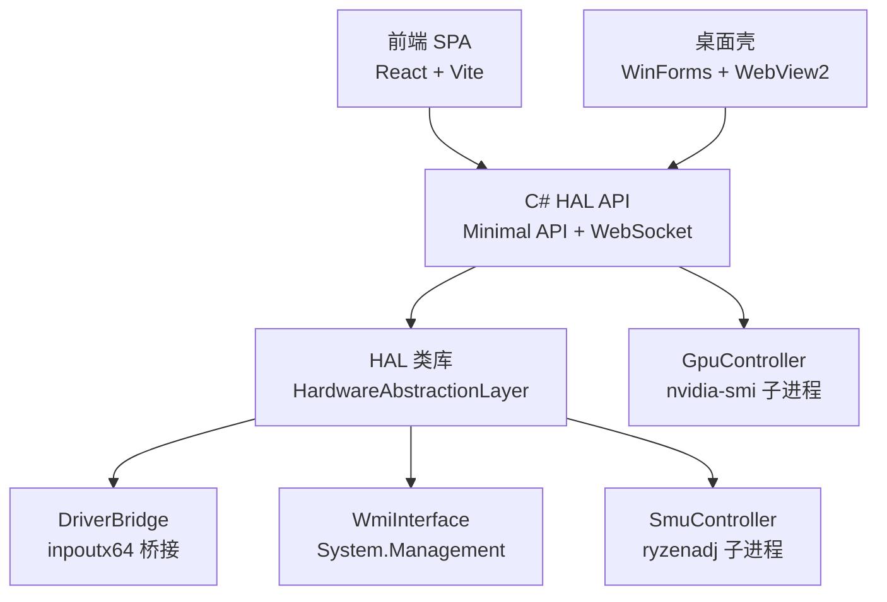
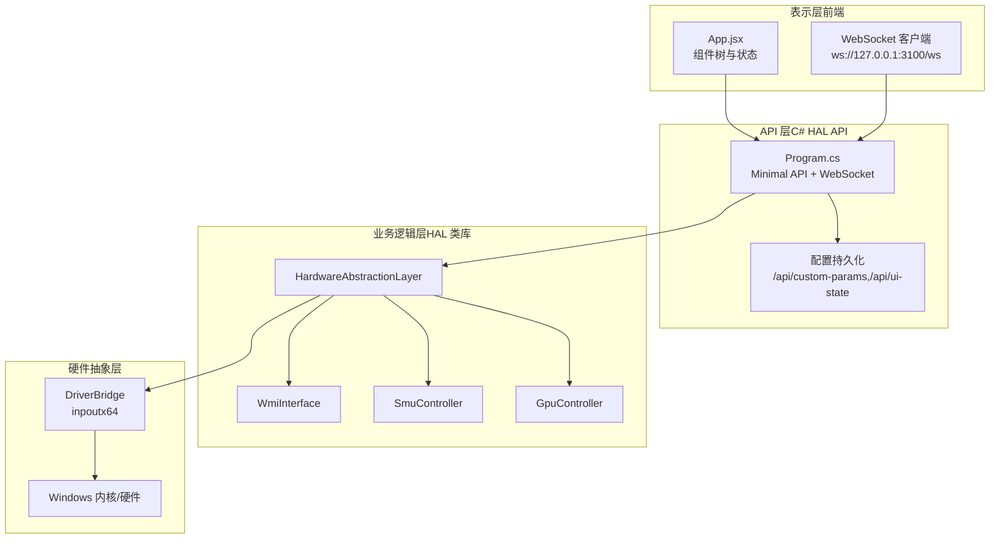
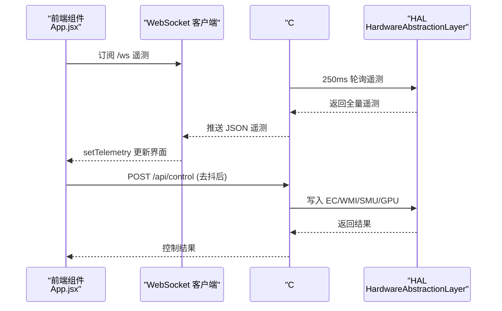
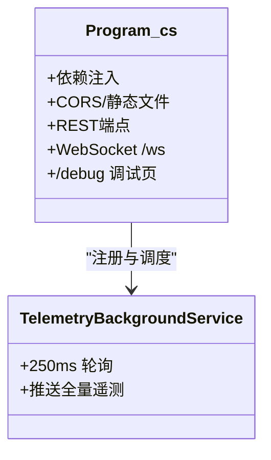
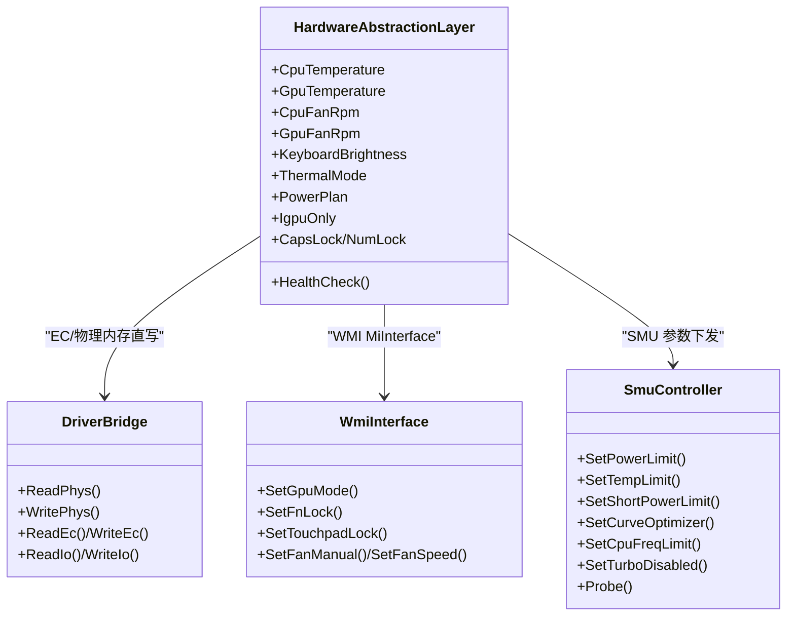
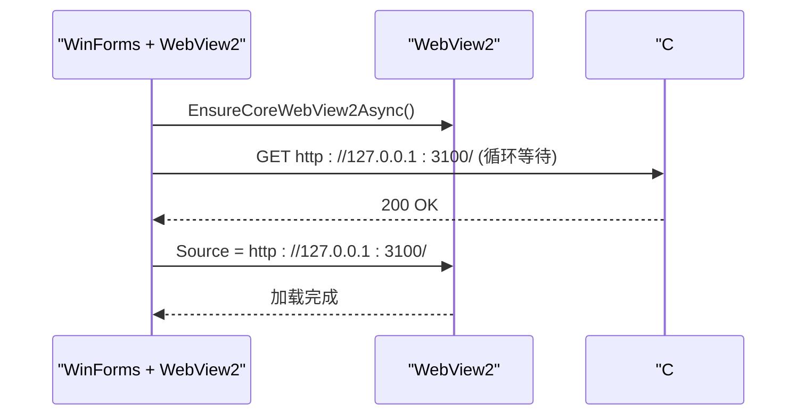
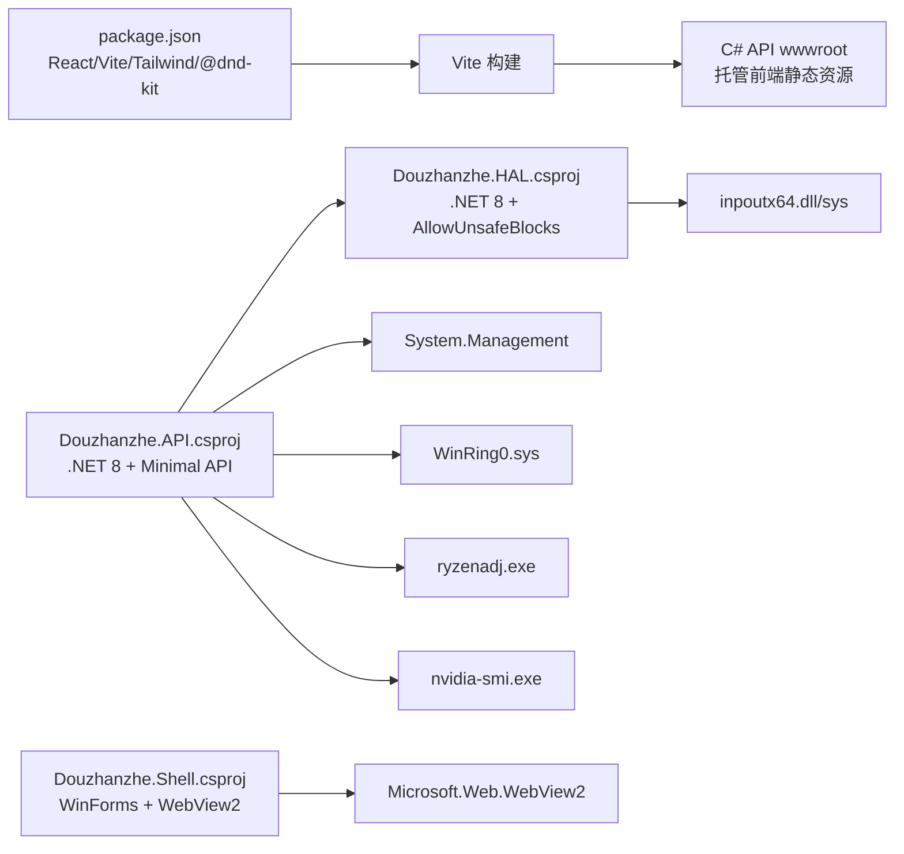

# 整体架构设计

<cite>
**本文引用的文件**
- [README.md](file://README.md)
- [dev-architecture.md](file://docs/dev-architecture.md)
- [dev-backend.md](file://docs/dev-backend.md)
- [Program.cs](file://server/api/Program.cs)
- [Douzhanzhe.API.csproj](file://server/api/Douzhanzhe.API.csproj)
- [HardwareAbstractionLayer.cs](file://server/hal/HardwareAbstractionLayer.cs)
- [DriverBridge.cs](file://server/hal/DriverBridge.cs)
- [SmuController.cs](file://server/hal/SmuController.cs)
- [Douzhanzhe.Shell.csproj](file://server/shell/Douzhanzhe.Shell/Douzhanzhe.Shell.csproj)
- [Form1.cs](file://server/shell/Douzhanzhe.Shell/Form1.cs)
- [package.json](file://package.json)
- [vite.config.js](file://vite.config.js)
- [App.jsx](file://src/App.jsx)
</cite>

## 目录
1. [引言](#引言)
2. [项目结构](#项目结构)
3. [核心组件](#核心组件)
4. [架构总览](#架构总览)
5. [详细组件分析](#详细组件分析)
6. [依赖关系分析](#依赖关系分析)
7. [性能考虑](#性能考虑)
8. [故障排查指南](#故障排查指南)
9. [结论](#结论)
10. [附录](#附录)

## 引言
本项目“DOUZHANZHE-Control”是一个面向 Lenovo Legion N176 2025（宝龙达 OEM）的开源硬件控制面板，旨在替代官方联想电脑管家，提供完整的硬件监控、性能调优与系统控制能力。系统采用前后端分离架构：前端为基于 React/Vite 的单页应用（SPA），由 C# HAL API 服务端托管；后端以 C#/.NET 8 Minimal API 为核心，结合 WMI、EC 寄存器直写、SMU 控制与 GPU 子进程等方式实现对硬件的统一抽象与控制。

系统边界清晰：前端负责用户界面与交互、状态管理与持久化；后端负责硬件抽象层（HAL）、设备驱动桥接、WMI 与 SMU/GPU 控制、遥测采集与 WebSocket 推送；桌面壳（WinForms + WebView2）作为可选外壳，提供系统托盘最小化与本地 WebView2 加载 UI 的体验。

## 项目结构
- 前端（src/）：React 19 + Vite 8 + Tailwind CSS 3，组件化布局与主题切换，状态通过自定义 Hook 管理，UI 配置持久化于本地存储与后端 JSON。
- 后端（server/）：C#/.NET 8 Minimal API（Douzhanzhe.API），依赖 HAL 类库（Douzhanzhe.HAL），提供 REST API、WebSocket 遥测、调试页面与配置持久化。
- 硬件抽象（server/hal/）：DriverBridge（inpoutx64 P/Invoke 桥接）、HardwareAbstractionLayer（EC 寄存器语义化映射）、SmuController（ryzenadj 子进程封装）。
- 桌面壳（server/shell/Douzhanzhe.Shell/）：WinForms + WebView2，系统托盘最小化，自动等待后端 API 就绪后导航到本地 UI。
- 文档（docs/）：包含整体架构、后端架构、前端架构、API 定义等文档。

图表来源
- [Program.cs:1-783](file://server/api/Program.cs#L1-L783)
- [HardwareAbstractionLayer.cs:1-767](file://server/hal/HardwareAbstractionLayer.cs#L1-L767)
- [DriverBridge.cs:1-133](file://server/hal/DriverBridge.cs#L1-L133)
- [SmuController.cs:1-142](file://server/hal/SmuController.cs#L1-L142)
- [Form1.cs:1-140](file://server/shell/Douzhanzhe.Shell/Form1.cs#L1-L140)

章节来源
- [README.md:1-144](file://README.md#L1-L144)
- [dev-architecture.md:1-120](file://docs/dev-architecture.md#L1-L120)
- [dev-backend.md:1-323](file://docs/dev-backend.md#L1-L323)

## 核心组件
- 前端（React SPA）
  - 组件树：侧边栏导航、仪表盘（可拖拽排序）、系统信息面板、设置面板。
  - 状态管理：useControlState Hook 管理遥测、设置、UX TU 参数、风扇目标、历史记录等。
  - 主题系统：ThemeSwitcher 切换主题，CSS 变量随主题同步。
  - 数据持久化：localStorage（即时）与后端 JSON（退出编辑/1s 去抖）双向同步。
- C# HAL API（Minimal API）
  - REST 端点：/api/telemetry、/api/control、/api/smu/*、/api/gpu/*、/api/fan/*、/api/system/* 等。
  - WebSocket：/ws 实时推送全量遥测（250ms 轮询）。
  - 配置持久化：/api/custom-params、/api/ui-state、/api/default-config。
  - 调试页面：/debug 内联 HTML，提供硬件控制按钮/滑块测试。
- HAL 类库（Douzhanzhe.HAL）
  - DriverBridge：inpoutx64 P/Invoke 封装，提供物理内存读写、IO 端口读写、EC 寄存器协议读写。
  - HardwareAbstractionLayer：将 EC 寄存器映射为语义化属性（温度、风扇、键盘背光、散热模式、电源计划等），并封装 WMI 与子进程调用。
  - SmuController：封装 ryzenadj.exe 子进程，实现 SMU 参数下发与探测。
- 桌面壳（Douzhanzhe.Shell）
  - WinForms + WebView2，系统托盘最小化，自动等待后端 API 就绪后导航到本地 UI。

章节来源
- [App.jsx:1-134](file://src/App.jsx#L1-L134)
- [Program.cs:1-783](file://server/api/Program.cs#L1-L783)
- [HardwareAbstractionLayer.cs:1-767](file://server/hal/HardwareAbstractionLayer.cs#L1-L767)
- [DriverBridge.cs:1-133](file://server/hal/DriverBridge.cs#L1-L133)
- [SmuController.cs:1-142](file://server/hal/SmuController.cs#L1-L142)
- [Form1.cs:1-140](file://server/shell/Douzhanzhe.Shell/Form1.cs#L1-L140)

## 架构总览
系统采用“前后端分离 + 硬件抽象层”的分层架构：
- 表示层（前端 SPA）：负责用户交互、主题与布局、状态持久化。
- API 层（C# HAL API）：提供 REST 与 WebSocket，聚合 HAL 与外部子进程，统一对外接口。
- 业务逻辑层（HAL 类库）：将底层硬件抽象为高层语义（温度、风扇、背光、散热模式、电源计划等）。
- 硬件抽象层（DriverBridge + WMI + 子进程）：通过 inpoutx64、WMI、SMU/GPU 子进程实现对硬件的直接控制。

数据流与控制流：
- 遥测：硬件 EC 寄存器 → HAL → 250ms WebSocket 推送 → 前端 setTelemetry。
- 控制：前端滑块/开关 → 500ms 去抖 → POST /api/control → HAL → EC/WMI/SMU/GPU。
- 持久化：localStorage（即时） ↔ 前端状态；C# JSON（config/*.json）↔ 后端持久化端点。

图表来源
- [Program.cs:1-783](file://server/api/Program.cs#L1-L783)
- [HardwareAbstractionLayer.cs:1-767](file://server/hal/HardwareAbstractionLayer.cs#L1-L767)
- [DriverBridge.cs:1-133](file://server/hal/DriverBridge.cs#L1-L133)
- [SmuController.cs:1-142](file://server/hal/SmuController.cs#L1-L142)
- [App.jsx:1-134](file://src/App.jsx#L1-L134)

章节来源
- [dev-architecture.md:56-87](file://docs/dev-architecture.md#L56-L87)
- [dev-backend.md:107-125](file://docs/dev-backend.md#L107-L125)

## 详细组件分析

### 前端组件分析（React SPA）
- 组件组织：侧边栏导航、仪表盘（SortableDashboard）、系统信息面板、设置面板、主题切换器。
- 状态管理：useControlState Hook 聚合遥测、设置、UX TU 参数、风扇目标与历史记录，支持本地存储持久化。
- 交互流程：滑块/开关事件经 500ms 去抖后调用后端 /api/control；WebSocket 每 250ms 推送全量遥测。

图表来源
- [App.jsx:1-134](file://src/App.jsx#L1-L134)
- [Program.cs:56-202](file://server/api/Program.cs#L56-L202)

章节来源
- [App.jsx:1-134](file://src/App.jsx#L1-L134)
- [vite.config.js:1-8](file://vite.config.js#L1-L8)
- [package.json:1-33](file://package.json#L1-L33)

### C# HAL API（Minimal API）分析
- 依赖注入：注册 HAL、SMU、GPU、WMI、后台服务（遥测）。
- CORS 与静态文件：允许跨域、托管 wwwroot、回退到 index.html。
- 端点职责：
  - /api/telemetry：返回 CPU/GPU/内存/磁盘/风扇/键盘背光等遥测。
  - /api/control：统一硬件控制入口（键盘背光、Fn 锁、Num/Caps 锁、触摸板锁、电源计划、散热模式、IGPU 等）。
  - /api/smu/*：SMU 参数下发、探测、状态查询。
  - /api/gpu/*：GPU 频率/显存锁定与状态查询。
  - /api/fan/*：风扇目标转速下发与恢复固件控制。
  - /ws：WebSocket 实时推送全量遥测。
  - /debug：内联 HTML 调试面板。
- 配置持久化：/api/custom-params、/api/ui-state、/api/default-config。

图表来源
- [Program.cs:1-783](file://server/api/Program.cs#L1-L783)

章节来源
- [Program.cs:1-783](file://server/api/Program.cs#L1-L783)
- [Douzhanzhe.API.csproj:1-40](file://server/api/Douzhanzhe.API.csproj#L1-L40)

### HAL 类库（HardwareAbstractionLayer）分析
- EC 寄存器映射：将温度、风扇转速、键盘背光、散热模式、Fn 锁等映射为语义化属性。
- 物理内存直写：通过 DriverBridge 提供的 ReadPhys/WritePhys/WriteBit 等方法实现。
- WMI 集成：通过 System.Management 调用 WMI MiInterface 方法，实现 GPU 模式、Fn 锁、触摸板锁、风扇控制等。
- 子进程封装：nvidia-smi 用于 GPU 遥测与频率控制；ryzenadj 用于 SMU 参数下发。
- 健康检查：通过读取 CPU 温度进行健康检查。

图表来源
- [HardwareAbstractionLayer.cs:1-767](file://server/hal/HardwareAbstractionLayer.cs#L1-L767)
- [DriverBridge.cs:1-133](file://server/hal/DriverBridge.cs#L1-L133)
- [SmuController.cs:1-142](file://server/hal/SmuController.cs#L1-L142)

章节来源
- [HardwareAbstractionLayer.cs:1-767](file://server/hal/HardwareAbstractionLayer.cs#L1-L767)
- [DriverBridge.cs:1-133](file://server/hal/DriverBridge.cs#L1-L133)
- [SmuController.cs:1-142](file://server/hal/SmuController.cs#L1-L142)

### 桌面壳（WinForms + WebView2）分析
- 设计理念：提供系统托盘最小化、开机自启、本地 UI 加载体验；不强制依赖，可直接通过浏览器访问本地 UI。
- WebView2 集成：先初始化 WebView2，再等待后端 API 就绪（最多 30 秒），然后导航到 http://127.0.0.1:3100/。
- 托盘交互：双击托盘图标恢复窗口；关闭行为可配置为最小化到托盘。

图表来源
- [Form1.cs:61-92](file://server/shell/Douzhanzhe.Shell/Form1.cs#L61-L92)
- [Douzhanzhe.Shell.csproj:1-16](file://server/shell/Douzhanzhe.Shell/Douzhanzhe.Shell.csproj#L1-L16)

章节来源
- [Form1.cs:1-140](file://server/shell/Douzhanzhe.Shell/Form1.cs#L1-L140)
- [Douzhanzhe.Shell.csproj:1-16](file://server/shell/Douzhanzhe.Shell/Douzhanzhe.Shell.csproj#L1-L16)

## 依赖关系分析
- 前端依赖：React、@dnd-kit（拖拽排序）、Tailwind CSS、Vite。
- 后端依赖：.NET 8、Minimal API、System.Management（WMI）、TaskScheduler（开机自启）、inpoutx64（驱动）。
- 硬件依赖：Windows 内核驱动（inpoutx64.sys）、WinRing0.sys（SMU）、ryzenadj.exe、nvidia-smi.exe。
- 桌面壳依赖：Microsoft.Web.WebView2。

图表来源
- [package.json:1-33](file://package.json#L1-L33)
- [Douzhanzhe.API.csproj:1-40](file://server/api/Douzhanzhe.API.csproj#L1-L40)
- [Douzhanzhe.Shell.csproj:1-16](file://server/shell/Douzhanzhe.Shell/Douzhanzhe.Shell.csproj#L1-L16)

章节来源
- [package.json:1-33](file://package.json#L1-L33)
- [Douzhanzhe.API.csproj:1-40](file://server/api/Douzhanzhe.API.csproj#L1-L40)
- [dev-backend.md:1-323](file://docs/dev-backend.md#L1-L323)

## 性能考虑
- 遥测轮询：250ms 轮询 HAL，推送全量遥测，减少前端变化检测开销，保证 UI 实时性。
- 去抖控制：前端滑块/开关 500ms 去抖，降低频繁写入 EC/WMI 的压力。
- 物理内存写入策略：DriverBridge 优先使用 SetPhysLong 或动态 MapPhysToLin，避免预映射缓存无效地址写入。
- 子进程调用：SMU/GPU 控制通过子进程执行，避免阻塞 API 主线程；ryzenadj 退出时的已知崩溃被适配为成功。
- 驱动加载：WinRing0 驱动自动安装与启动，确保 SMU 可用性。

## 故障排查指南
- 管理员权限：C# HAL API 必须以管理员权限运行（inpoutx64 驱动要求）。
- 驱动状态：检查 WinRing0.sys 是否加载成功；Program.cs 启动时会自动检测并尝试安装。
- 硬件兼容性：Dragon Range（R9 8940HX）上 SMU PM 表 API 被硬件锁死，无法读取实时功率表值，但写命令可用。
- EC 寄存器：部分地址写入需使用 SetPhysLong 或动态映射，避免预映射缓存无效。
- WMI 方法：本机为宝龙达 OEM 模具，LENOVO_* WMI 类不可用，需通过 WmiInterface 直调或 EC 物理内存直写替代。
- 桌面壳：若 UI 未加载，检查后端 API 是否在 30 秒内就绪；可手动访问 http://127.0.0.1:3100/。

章节来源
- [dev-backend.md:286-323](file://docs/dev-backend.md#L286-L323)
- [Program.cs:692-724](file://server/api/Program.cs#L692-L724)

## 结论
本系统通过前后端分离与硬件抽象层的清晰分层，实现了对复杂硬件生态的统一控制与可视化呈现。C# HAL API 作为核心枢纽，整合 HAL、WMI、SMU 与 GPU 子进程，既保证了功能完整性，又兼顾了可维护性与可扩展性。桌面壳提供可选的本地体验，前端 SPA 则带来现代化的交互与主题体系。整体架构在满足 OEM 硬件适配需求的同时，也为后续扩展（如新硬件寄存器映射、新控制项）提供了良好的基础。

## 附录
- 快速启动与调试入口：参见 README 的“快速开始”与“调试入口”章节。
- 技术栈选择理由：React/Vite 提供高效开发与构建体验；.NET 8 Minimal API 适合轻量服务端；WMI 与 inpoutx64 满足硬件直连需求；SMU/GPU 控制通过子进程规避复杂依赖。

章节来源
- [README.md:77-100](file://README.md#L77-L100)
- [README.md:103-114](file://README.md#L103-L114)