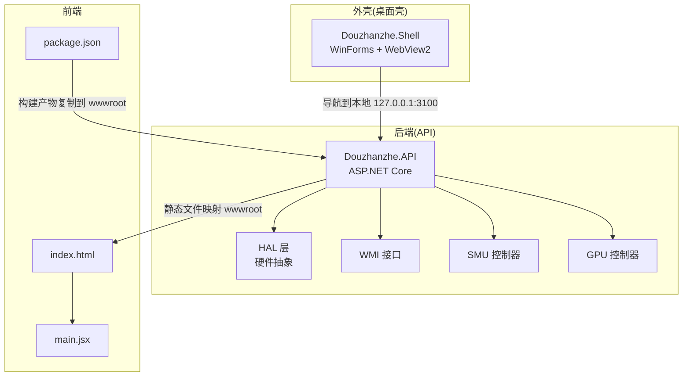
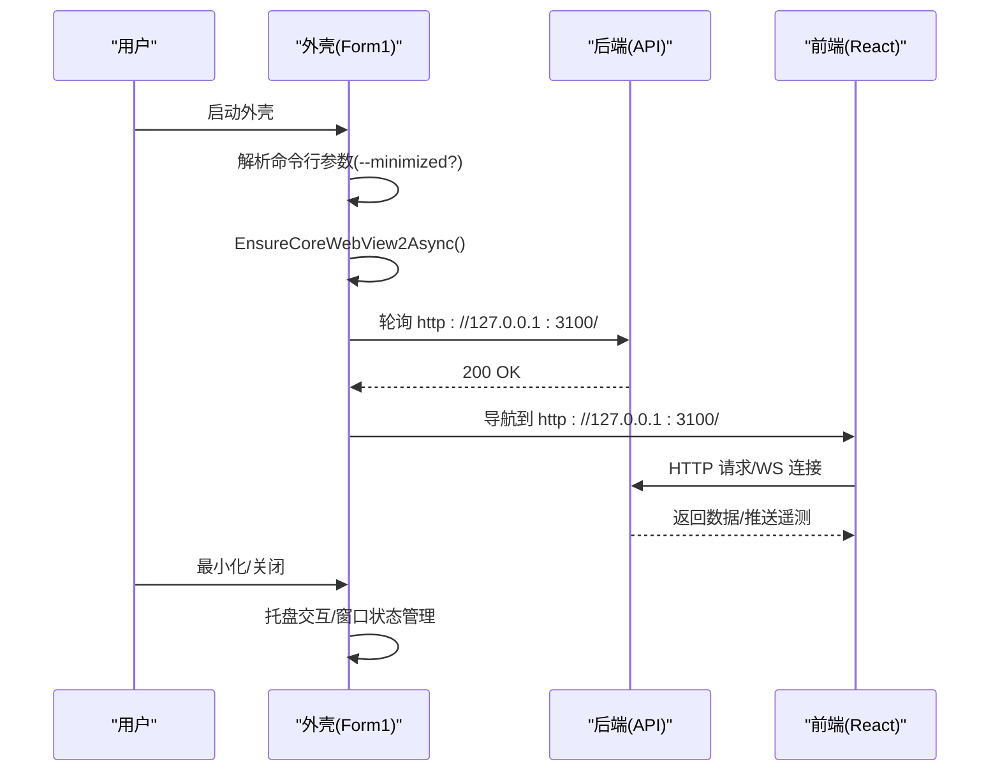
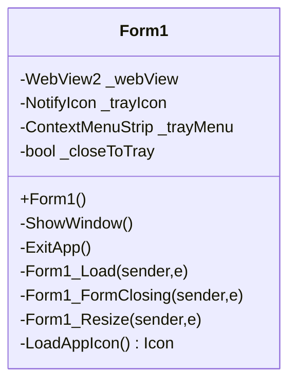
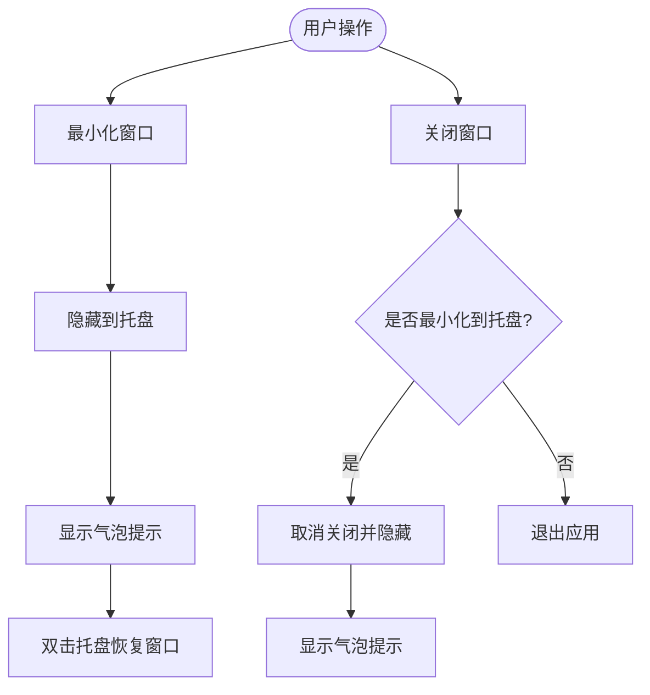
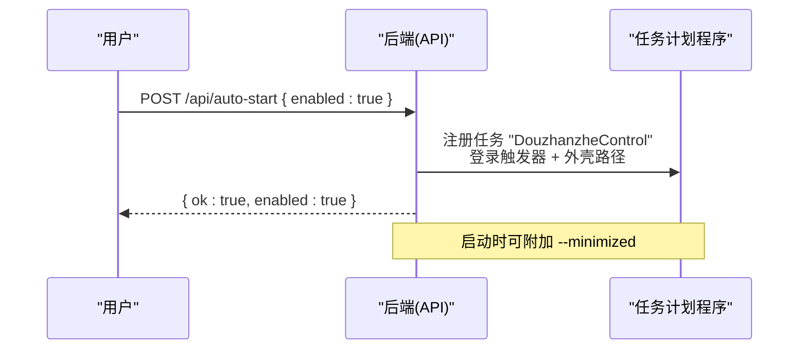
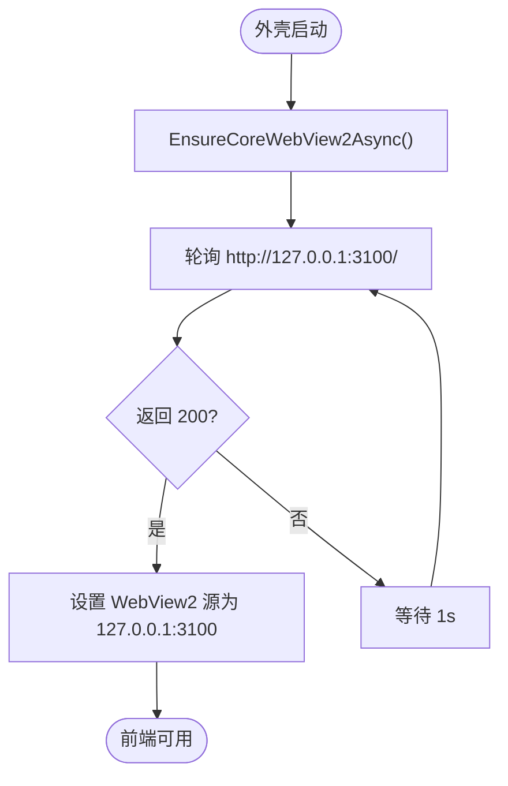
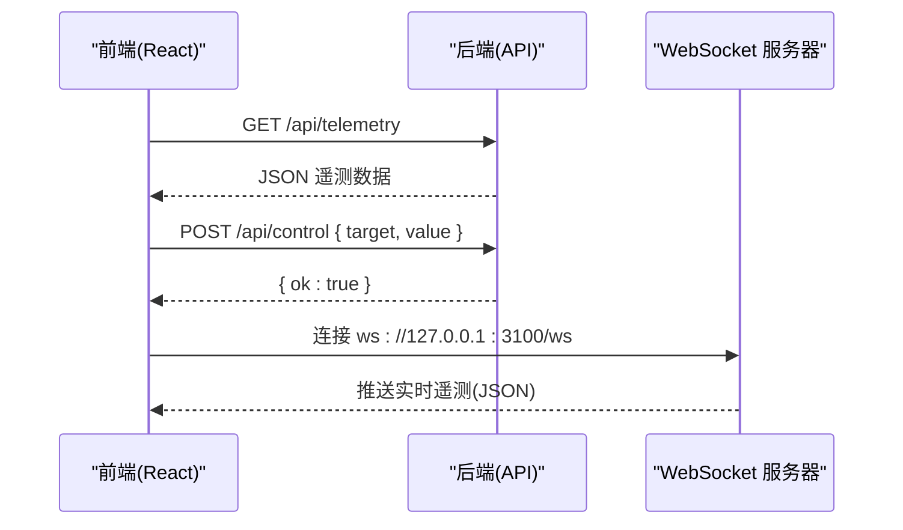
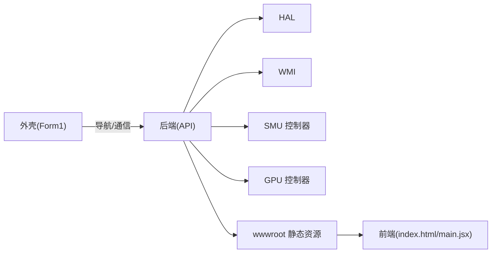

# 桌面壳架构

<cite>
**本文引用的文件**
- [Form1.cs](file://server/shell/Douzhanzhe.Shell/Form1.cs)
- [Program.cs](file://server/shell/Douzhanzhe.Shell/Program.cs)
- [Program.cs](file://server/api/Program.cs)
- [index.html](file://index.html)
- [main.jsx](file://src/main.jsx)
- [package.json](file://package.json)
- [appsettings.json](file://server/api/appsettings.json)
- [run.ps1](file://server/api/run.ps1)
</cite>

## 目录
1. [引言](#引言)
2. [项目结构](#项目结构)
3. [核心组件](#核心组件)
4. [架构总览](#架构总览)
5. [详细组件分析](#详细组件分析)
6. [依赖关系分析](#依赖关系分析)
7. [性能考量](#性能考量)
8. [故障排查指南](#故障排查指南)
9. [结论](#结论)
10. [附录](#附录)

## 引言
本架构文档面向 DOUZHANZHE-Control 的桌面壳应用，围绕基于 WinForms 的外壳程序与内置 WebView2 的集成方案展开，系统性说明以下方面：
- 主窗体 Form1 的架构设计与窗口生命周期管理
- 与 Web 前端的通信机制（HTTP/WebSocket）
- 系统托盘集成、开机自启动与窗口管理
- 安全与权限相关的设计要点
- 用户体验与窗口状态管理
- 部署策略、版本管理与故障恢复

## 项目结构
该仓库采用“前后端分离”的多项目布局：
- server/shell/Douzhanzhe.Shell：WinForms 外壳，承载 WebView2 并负责托盘、窗口与启动参数处理
- server/api：.NET 8 后端 API，提供硬件抽象层与遥测接口，并内嵌静态前端资源
- src：React/Vite 前端源码
- 根目录：构建脚本与配置

图表来源
- [Form1.cs:45-92](file://server/shell/Douzhanzhe.Shell/Form1.cs#L45-L92)
- [Program.cs:10-22](file://server/api/Program.cs#L10-L22)
- [index.html:1-14](file://index.html#L1-L14)
- [main.jsx:1-14](file://src/main.jsx#L1-L14)
- [package.json:6-10](file://package.json#L6-L10)

章节来源
- [Form1.cs:1-140](file://server/shell/Douzhanzhe.Shell/Form1.cs#L1-L140)
- [Program.cs:1-783](file://server/api/Program.cs#L1-L783)
- [index.html:1-14](file://index.html#L1-L14)
- [main.jsx:1-14](file://src/main.jsx#L1-L14)
- [package.json:1-33](file://package.json#L1-L33)

## 核心组件
- 外壳主窗体 Form1
  - 负责 WebView2 初始化、导航、托盘图标、最小化行为与退出流程
  - 支持命令行参数 --minimized 实现开机自启时最小化到托盘
- ASP.NET Core API（Douzhanzhe.API）
  - 提供 REST 与 WebSocket 接口，封装 HAL/WMI/SMU/GPU 控制
  - 内置静态文件服务，将前端构建产物映射到 / 与 index.html 回退
- 前端（React/Vite）
  - 构建后产物通过 npm 脚本复制到 API 的 wwwroot，由后端提供服务

章节来源
- [Form1.cs:19-92](file://server/shell/Douzhanzhe.Shell/Form1.cs#L19-L92)
- [Program.cs:10-22](file://server/api/Program.cs#L10-L22)
- [package.json:6-10](file://package.json#L6-L10)

## 架构总览
桌面壳以“外壳 + 内置 API + 前端”的方式工作：
- 外壳在启动时等待后端 API 就绪（轮询 30 秒），随后导航到本地 127.0.0.1:3100
- 后端提供静态资源与 REST/WebSocket 接口，前端通过 HTTP 与 WebSocket 与后端交互
- 外壳负责托盘、窗口状态与开机自启动策略

图表来源
- [Form1.cs:61-92](file://server/shell/Douzhanzhe.Shell/Form1.cs#L61-L92)
- [Program.cs:15-22](file://server/api/Program.cs#L15-L22)

## 详细组件分析

### 外壳主窗体 Form1
- 视图与托盘
  - 使用 WebView2 填充主窗体，禁用开发者工具
  - 创建系统托盘图标，支持双击恢复窗口与退出
- 生命周期与窗口管理
  - 关闭事件：默认最小化到托盘，显示气泡提示
  - 最小化事件：隐藏到托盘，显示提示
  - 显示窗口：激活并置于前台
- 启动与导航
  - 解析命令行参数 --minimized，开机自启时隐藏
  - 先初始化 WebView2 再轮询后端 API，最多等待 30 秒
  - 成功后设置 WebView2 源地址为本地 127.0.0.1:3100

图表来源
- [Form1.cs:6-139](file://server/shell/Douzhanzhe.Shell/Form1.cs#L6-L139)

章节来源
- [Form1.cs:13-139](file://server/shell/Douzhanzhe.Shell/Form1.cs#L13-L139)

### 系统托盘与窗口管理
- 托盘菜单项：显示主窗口、退出
- 双击托盘图标恢复窗口
- 最小化行为：最小化即隐藏到托盘并提示
- 关闭行为：用户关闭默认最小化到托盘，避免进程退出

图表来源
- [Form1.cs:94-127](file://server/shell/Douzhanzhe.Shell/Form1.cs#L94-L127)

章节来源
- [Form1.cs:94-127](file://server/shell/Douzhanzhe.Shell/Form1.cs#L94-L127)

### 开机自启动与启动参数
- 后端提供 /api/auto-start 与 /api/auto-start-opts 端点，通过 Windows 任务计划程序实现开机自启
- 外壳解析 --minimized 参数，用于开机自启时最小化到托盘
- 自动启动时会将外壳进程注册到登录触发器，并可携带 --minimized 参数

图表来源
- [Program.cs:621-686](file://server/api/Program.cs#L621-L686)
- [Form1.cs:61-69](file://server/shell/Douzhanzhe.Shell/Form1.cs#L61-L69)

章节来源
- [Program.cs:586-686](file://server/api/Program.cs#L586-L686)
- [Form1.cs:61-69](file://server/shell/Douzhanzhe.Shell/Form1.cs#L61-L69)

### WebView2 集成与导航策略
- 外壳启动时先初始化 WebView2，再轮询后端 API 是否就绪
- 成功后将 WebView2 源设置为本地 127.0.0.1:3100
- 禁用开发者工具，减少攻击面

图表来源
- [Form1.cs:71-92](file://server/shell/Douzhanzhe.Shell/Form1.cs#L71-L92)

章节来源
- [Form1.cs:71-92](file://server/shell/Douzhanzhe.Shell/Form1.cs#L71-L92)

### 前端与后端通信机制
- HTTP 接口
  - REST API：/api/telemetry、/api/system/info、/api/control、/api/smu/*、/api/fan/*、/api/gpu/* 等
  - 配置持久化：/api/ui-state、/api/default-config、/api/custom-params
  - 自动启动选项：/api/auto-start、/api/auto-start-opts
- WebSocket 接口
  - /ws：后端维持客户端集合，向前端推送遥测数据
- 前端资源
  - index.html 作为 SPA 入口，main.jsx 渲染根节点，构建产物复制到 wwwroot

图表来源
- [Program.cs:56-86](file://server/api/Program.cs#L56-L86)
- [Program.cs:87-143](file://server/api/Program.cs#L87-L143)
- [index.html:1-14](file://index.html#L1-L14)
- [main.jsx:1-14](file://src/main.jsx#L1-L14)

章节来源
- [Program.cs:56-143](file://server/api/Program.cs#L56-L143)
- [Program.cs:553-568](file://server/api/Program.cs#L553-L568)
- [Program.cs:586-618](file://server/api/Program.cs#L586-L618)
- [Program.cs:621-686](file://server/api/Program.cs#L621-L686)
- [index.html:1-14](file://index.html#L1-L14)
- [main.jsx:1-14](file://src/main.jsx#L1-L14)

### 安全与权限考虑
- WebView2 开发者工具禁用，降低前端调试风险
- 本地回环访问（127.0.0.1:3100），避免暴露至外网
- CORS 允许任意来源，便于前端开发调试；生产部署建议收紧
- 部分硬件控制涉及管理员权限（如 WinRing0 驱动、WMI、SMU 子进程），需以高权限运行
- 自动启动注册任务时使用最高权限级别（RunLevel.Highest）

章节来源
- [Form1.cs:51-55](file://server/shell/Douzhanzhe.Shell/Form1.cs#L51-L55)
- [Program.cs:15-18](file://server/api/Program.cs#L15-L18)
- [Program.cs:692-723](file://server/api/Program.cs#L692-L723)
- [Program.cs:640-676](file://server/api/Program.cs#L640-L676)

### 用户体验与窗口状态管理
- 深色主题背景与深色 WebView2 背景色，减少白屏闪烁
- 最小化到托盘时显示提示，避免用户误以为程序崩溃
- 双击托盘图标快速恢复窗口
- 启动时根据 --minimized 参数决定是否显示窗口

章节来源
- [Form1.cs:20-26](file://server/shell/Douzhanzhe.Shell/Form1.cs#L20-L26)
- [Form1.cs:104-119](file://server/shell/Douzhanzhe.Shell/Form1.cs#L104-L119)
- [Form1.cs:61-69](file://server/shell/Douzhanzhe.Shell/Form1.cs#L61-L69)

## 依赖关系分析
- 外壳依赖 WebView2.WinForms，负责渲染本地静态资源
- 后端依赖 HAL/WMI/SMU/GPU 控制器，提供统一 API
- 前端通过 HTTP/WebSocket 与后端交互
- 构建脚本将前端产物复制到 API 的 wwwroot，实现静态资源内嵌

图表来源
- [Form1.cs:45-56](file://server/shell/Douzhanzhe.Shell/Form1.cs#L45-L56)
- [Program.cs:10-22](file://server/api/Program.cs#L10-L22)
- [package.json:6-10](file://package.json#L6-L10)

章节来源
- [Form1.cs:45-56](file://server/shell/Douzhanzhe.Shell/Form1.cs#L45-L56)
- [Program.cs:10-22](file://server/api/Program.cs#L10-L22)
- [package.json:6-10](file://package.json#L6-L10)

## 性能考量
- 外壳启动阶段的轮询等待（最多 30 秒）可导致首次可见延迟，建议在产品化时优化为“就绪信号”或异步引导
- WebView2 初始化与本地静态资源加载对首屏渲染影响较小，但应避免在主线程执行阻塞操作
- WebSocket 遥测推送频率与前端渲染开销需平衡，避免过度刷新导致 CPU 占用上升
- 前端构建产物复制到 wwwroot 的过程可在 CI 中缓存，减少重复拷贝

## 故障排查指南
- 外壳无法显示页面
  - 检查后端 API 是否在 127.0.0.1:3100 正常监听
  - 查看外壳日志与轮询超时情况
- 托盘无响应
  - 确认托盘图标创建与事件绑定是否成功
  - 检查外壳是否最小化到托盘而非关闭
- 开机自启动无效
  - 检查 /api/auto-start 与 /api/auto-start-opts 的返回值
  - 确认任务计划程序中是否存在 "DouzhanzheControl" 任务
- 权限问题（风扇/SMU/GPU 控制失败）
  - 确认以管理员身份运行
  - 检查 WinRing0 驱动是否成功加载
- CORS 或跨域问题
  - 生产环境建议收紧 CORS 策略

章节来源
- [Form1.cs:74-92](file://server/shell/Douzhanzhe.Shell/Form1.cs#L74-L92)
- [Program.cs:621-686](file://server/api/Program.cs#L621-L686)
- [Program.cs:692-723](file://server/api/Program.cs#L692-L723)
- [appsettings.json:1-10](file://server/api/appsettings.json#L1-L10)

## 结论
该桌面壳通过 WinForms + WebView2 将本地 API 与前端界面无缝整合，具备完善的托盘交互、最小化行为与开机自启动能力。后端以 REST/WebSocket 提供硬件控制与遥测能力，前端通过构建脚本内嵌至后端静态资源。整体架构清晰、职责明确，适合在 Windows 平台上进行硬件控制与监控场景的桌面化交付。

## 附录

### 部署策略与版本管理
- 构建与运行
  - 使用 run.ps1 统一构建后端与前端，复制到独立运行目录并启动 API
  - 前端构建后自动复制到 API 的 wwwroot，保证资源一致性
- 版本管理
  - 前端版本号在 package.json 中定义，可用于前端缓存与更新策略
- 故障恢复
  - run.ps1 在启动前清理占用 3100 端口的进程，避免端口冲突
  - 外壳启动时的轮询与兜底导航，提升鲁棒性

章节来源
- [run.ps1:1-67](file://server/api/run.ps1#L1-L67)
- [package.json:1-33](file://package.json#L1-L33)