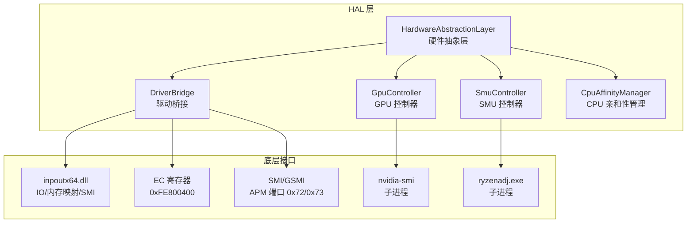
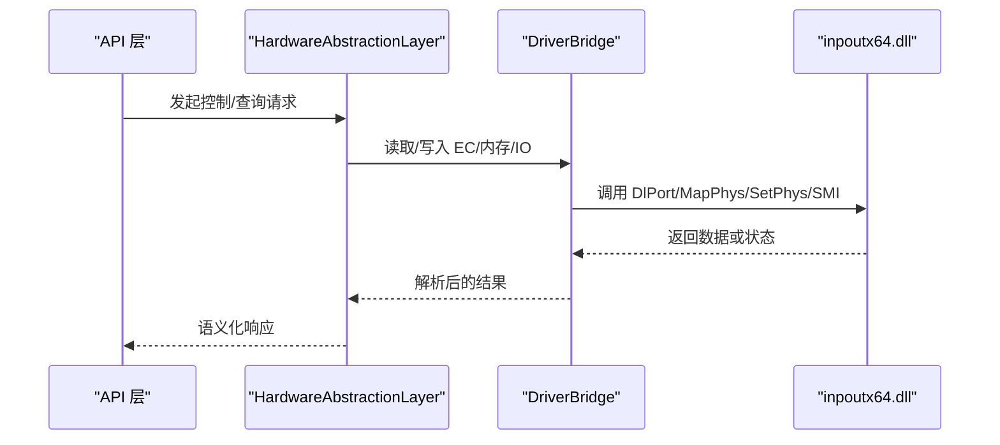
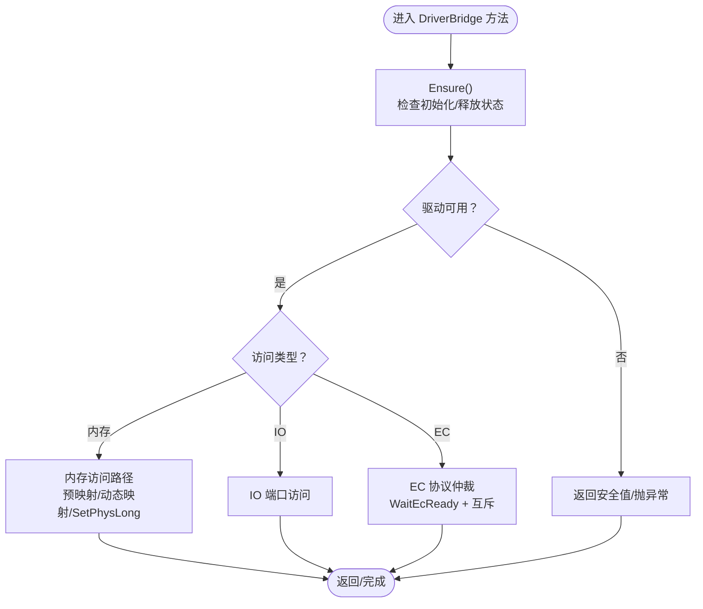
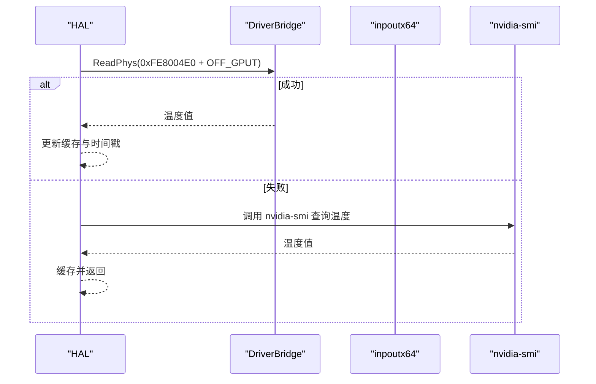
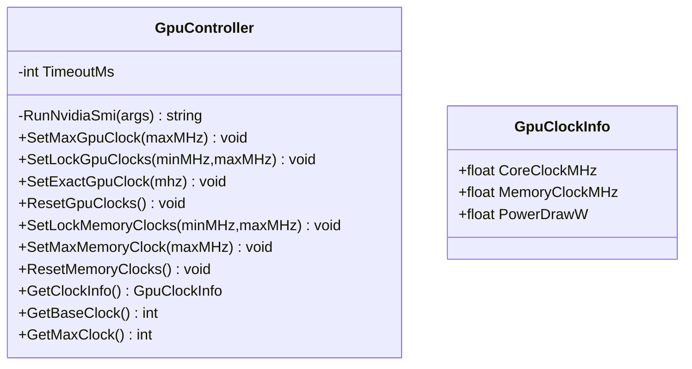
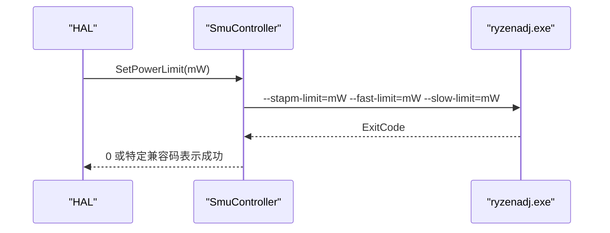
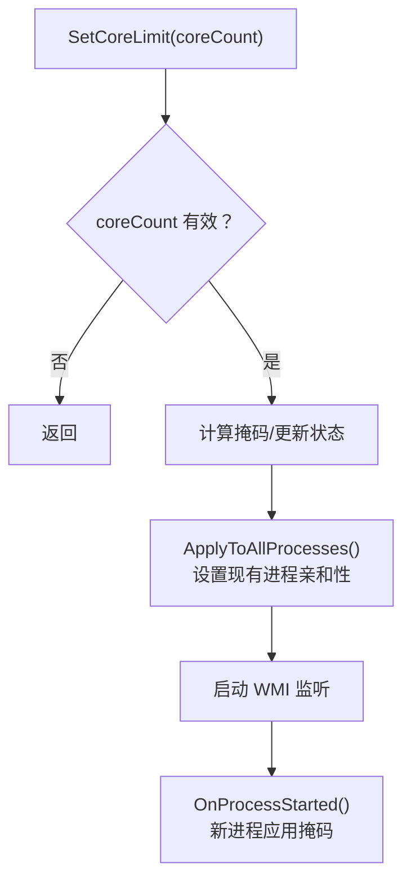
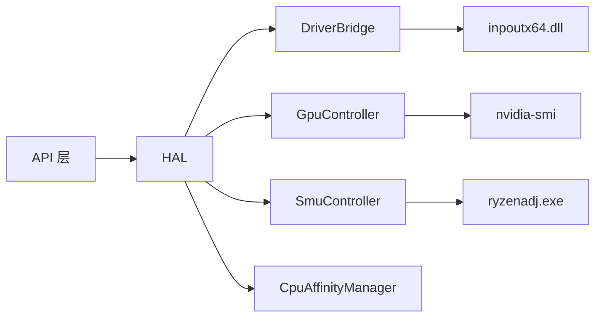

# 硬件抽象层

<cite>
**本文引用的文件**
- [HardwareAbstractionLayer.cs](file://server/hal/HardwareAbstractionLayer.cs)
- [DriverBridge.cs](file://server/hal/DriverBridge.cs)
- [GpuController.cs](file://server/hal/GpuController.cs)
- [SmuController.cs](file://server/hal/SmuController.cs)
- [CpuAffinityManager.cs](file://server/hal/CpuAffinityManager.cs)
- [dev-ec-map.md](file://docs/dev-ec-map.md)
- [dev-api.md](file://docs/dev-api.md)
- [Program.cs.bak2](file://server/api/Program.cs.bak2)
</cite>

## 目录
1. [简介](#简介)
2. [项目结构](#项目结构)
3. [核心组件](#核心组件)
4. [架构总览](#架构总览)
5. [详细组件分析](#详细组件分析)
6. [依赖关系分析](#依赖关系分析)
7. [性能考量](#性能考量)
8. [故障排查指南](#故障排查指南)
9. [结论](#结论)
10. [附录](#附录)

## 简介
本文件为 DOUZHANZHE-Control 硬件抽象层（Hardware Abstraction Layer, HAL）的技术文档，聚焦于硬件访问的统一接口设计与抽象化策略，深入解析 DriverBridge 的桥接机制与 EC 寄存器访问方法，阐述 GpuController 与 SmuController 的职责与实现细节，并总结硬件状态管理、兼容性处理、错误恢复与性能优化等关键主题。文档同时给出初始化流程、资源管理与安全访问控制的实践建议。

## 项目结构
HAL 位于后端服务的 server/hal 目录，围绕 DriverBridge 构建硬件访问能力，向上提供语义化接口给业务层（API 层），向下对接 inpoutx64 驱动与 EC/SMI/IO 等底层硬件接口。相关控制器模块（GpuController、SmuController）作为外部工具调用的封装，补充 GPU/SMU 控制能力。

图表来源
- [HardwareAbstractionLayer.cs:19-772](file://server/hal/HardwareAbstractionLayer.cs#L19-L772)
- [DriverBridge.cs:9-150](file://server/hal/DriverBridge.cs#L9-L150)
- [GpuController.cs:10-116](file://server/hal/GpuController.cs#L10-L116)
- [SmuController.cs:12-142](file://server/hal/SmuController.cs#L12-L142)
- [CpuAffinityManager.cs:15-101](file://server/hal/CpuAffinityManager.cs#L15-L101)

章节来源
- [HardwareAbstractionLayer.cs:19-772](file://server/hal/HardwareAbstractionLayer.cs#L19-L772)
- [DriverBridge.cs:9-150](file://server/hal/DriverBridge.cs#L9-L150)
- [GpuController.cs:10-116](file://server/hal/GpuController.cs#L10-L116)
- [SmuController.cs:12-142](file://server/hal/SmuController.cs#L12-L142)
- [CpuAffinityManager.cs:15-101](file://server/hal/CpuAffinityManager.cs#L15-L101)

## 核心组件
- HardwareAbstractionLayer（HAL）：面向业务的统一硬件访问接口，负责温度/风扇/键盘背光/散热模式/电源计划/触摸板锁定等硬件状态读写与遥测聚合；内部通过 DriverBridge 访问 EC/IO/SMI/内存；对不可用场景提供安全默认值与降级策略。
- DriverBridge：底层硬件访问桥接，封装 inpoutx64 的 IO、内存映射、SMI、EC 协议等能力，提供线程安全的读写方法与 EC 协议仲裁。
- GpuController：基于 nvidia-smi 的 GPU 频率与功耗控制封装，提供锁频、解锁、查询等能力。
- SmuController：基于 ryzenadj.exe 的 AMD SMU 控制封装，提供功率、温度、短时功率、曲线优化、CPU 频率限制、涡轮开关等能力。
- CpuAffinityManager：通过 WMI 事件监听与进程亲和性设置，实现全局核心数限制与新进程自动应用。

章节来源
- [HardwareAbstractionLayer.cs:19-772](file://server/hal/HardwareAbstractionLayer.cs#L19-L772)
- [DriverBridge.cs:9-150](file://server/hal/DriverBridge.cs#L9-L150)
- [GpuController.cs:10-116](file://server/hal/GpuController.cs#L10-L116)
- [SmuController.cs:12-142](file://server/hal/SmuController.cs#L12-L142)
- [CpuAffinityManager.cs:15-101](file://server/hal/CpuAffinityManager.cs#L15-L101)

## 架构总览
HAL 采用“高层语义接口 + 底层桥接”的分层设计。上层通过 HAL 的属性与方法进行硬件控制与状态查询，底层由 DriverBridge 统一调度 inpoutx64 的 IO/内存/SMI/EC 能力，并对 EC 协议进行仲裁与超时控制。GPU/SMU 控制通过子进程调用外部工具实现，避免直接内核交互风险。

图表来源
- [HardwareAbstractionLayer.cs:113-136](file://server/hal/HardwareAbstractionLayer.cs#L113-L136)
- [DriverBridge.cs:39-63](file://server/hal/DriverBridge.cs#L39-L63)
- [DriverBridge.cs:111-137](file://server/hal/DriverBridge.cs#L111-L137)

## 详细组件分析

### DriverBridge：驱动桥接与 EC 协议
- 初始化与可用性
  - 通过 Out32(0x80)=0 触发驱动准备，轮询 IsInpOutDriverOpenNative()，超时则降级为不可用。
  - 成功后尝试 MapPhysToLin(EC_BASE, EC_SIZE) 建立 EC 区域预映射，提升后续 EC 访问性能。
- 内存访问
  - ReadPhys/WritePhys 支持 EC 预映射与动态映射双路径；对大地址使用 SetPhysLong；对小地址优先 SetPhysLong。
  - ReadPhys32/WritePhys32 提供 32 位访问。
- IO 访问
  - ReadIo/WriteIo/ReadIo32/WriteIo32 提供端口级访问。
- EC 协议
  - ReadEc/WriteEc 实现标准 EC 协议：先等待 IBF 空闲，再按序写入命令、寄存器地址、数据；WriteEc 使用互斥锁保证仲裁。
- SMI 与 Bit 操作
  - WriteBit 提供按位设置/清除；SendSmi 通过 APM 端口触发 SMI（GSMI）。

图表来源
- [DriverBridge.cs:39-63](file://server/hal/DriverBridge.cs#L39-L63)
- [DriverBridge.cs:66-104](file://server/hal/DriverBridge.cs#L66-L104)
- [DriverBridge.cs:111-147](file://server/hal/DriverBridge.cs#L111-L147)

章节来源
- [DriverBridge.cs:9-150](file://server/hal/DriverBridge.cs#L9-L150)

### HardwareAbstractionLayer：统一硬件接口与状态管理
- 驱动可用性与降级
  - 构造时初始化 DriverBridge，若不可用则记录日志，后续读取返回安全默认值。
- EC 寄存器常量与偏移
  - 定义 OFF_KBNL、OFF_FNHK、OFF_CALK、OFF_NULK、OFF_FNRC、OFF_ITSM、OFF_GPUT、OFF_CPUT、OFF_F1HI/LO、OFF_F3HI/LO、OFF_KBTY、OFF_SMPR/SMST/SMAD/SDAT 等偏移，均来自 DSDT/SSDT 反编译确认。
- 温度与风扇
  - CpuTemperature：通过 EC IO 端口 0x1C 读取。
  - GpuTemperature：优先从物理内存 0xFE8004E0 读取，失败时回退 nvidia-smi，带 2 秒冷却窗口与缓存。
  - Cpu/Gpu 风扇 RPM：通过 EC IO 端口 0x9D/0x9E、0x96/0x97 读取，采用双读仲裁消除 16 位竞态。
- 风扇目标转速控制
  - Cpu/GpuFanControl：通过 EC 0x5F/0x5B 读写，采用“RPM→原始值”转换公式。
- 键盘与系统开关
  - KeyboardType：EC 0x99。
  - FnLock：EC 0x20 bit3，写入使用 WritePhys(SetPhysLong)。
  - CapsLock/NumLock：通过 Win32 keybd_event 切换。
- 键盘背光
  - KeyboardBrightness：EC 0x9A，写入使用 WritePhys，不走缓存映射。
- 散热模式
  - ThermalMode：EC 0xE4，写入使用 WritePhys。
- dGPU 模式（IgpuOnly）
  - 通过 DSAD 方法（0xFED81E40 + (0x0B<<1)）设置 ADPD bit3，实现集显模式。
- SMI 触发
  - SendSmi：通过 IO 端口 0x72/0x73 触发 GSMI。
- EC 协议访问
  - ReadEcPort/WriteEcPort：提供备选 EC 访问。
- 系统信息与遥测
  - SystemModel/CpuName/GpuDiscreteName/GpuIntegratedName：通过 PowerShell WMI 查询，带缓存。
  - CpuUsage/CpuFreq/Memory/Disk：通过 PowerShell/WMI/nvidia-smi 子进程查询，带缓存与阈值保护。
- 健康检查
  - HealthCheck：读取 CPU 温度并在合理范围内判定健康。

图表来源
- [HardwareAbstractionLayer.cs:150-195](file://server/hal/HardwareAbstractionLayer.cs#L150-L195)
- [DriverBridge.cs:66-75](file://server/hal/DriverBridge.cs#L66-L75)

章节来源
- [HardwareAbstractionLayer.cs:19-772](file://server/hal/HardwareAbstractionLayer.cs#L19-L772)
- [dev-ec-map.md:13-40](file://docs/dev-ec-map.md#L13-L40)

### GpuController：GPU 控制与查询
- 子进程封装
  - RunNvidiaSmi：统一执行 nvidia-smi 并处理超时/退出码。
- 频率与功耗控制
  - SetMaxGpuClock/SetLockGpuClocks/SetExactGpuClock/ResetGpuClocks
  - SetLockMemoryClocks/SetMaxMemoryClock/ResetMemoryClocks
- 查询能力
  - GetClockInfo：查询核心/内存频率与功耗。
  - GetBaseClock/GetMaxClock：查询基准与最大频率。
- 异常处理
  - 超时抛出 TimeoutException；非零退出码抛出异常并附带错误输出。

图表来源
- [GpuController.cs:10-116](file://server/hal/GpuController.cs#L10-L116)

章节来源
- [GpuController.cs:10-116](file://server/hal/GpuController.cs#L10-L116)

### SmuController：AMD SMU 控制
- 工具定位
  - 通过多路径候选查找 ryzenadj.exe，确定工作目录。
- 参数下发
  - SetPowerLimit/SetTempLimit/SetShortPowerLimit/SetCurveOptimizer/SetCpuFreqLimit/SetTurboDisabled：通过命令行参数调用，兼容特定返回码视为成功。
- 能力探测
  - Probe：通过 -i 参数探测工具可用性。
  - GetCapabilities：声明支持的能力集合。
- 不支持项
  - VRM Current、Raw SMU Command、SMN Register Read 等在当前硬件上不支持。

图表来源
- [SmuController.cs:43-57](file://server/hal/SmuController.cs#L43-L57)
- [SmuController.cs:61-95](file://server/hal/SmuController.cs#L61-L95)

章节来源
- [SmuController.cs:12-142](file://server/hal/SmuController.cs#L12-L142)

### CpuAffinityManager：CPU 核心限制
- 全局核心限制
  - SetCoreLimit：计算掩码并应用到现有与未来进程；通过 WMI 监听 Win32_ProcessStartTrace 事件，新进程启动即强制应用亲和性。
- 重置
  - Reset：停止监听并清除状态。
- 边界与容错
  - 对无效进程/权限不足进行捕获，避免影响其他进程。

图表来源
- [CpuAffinityManager.cs:25-53](file://server/hal/CpuAffinityManager.cs#L25-L53)
- [CpuAffinityManager.cs:67-78](file://server/hal/CpuAffinityManager.cs#L67-L78)

章节来源
- [CpuAffinityManager.cs:15-101](file://server/hal/CpuAffinityManager.cs#L15-L101)

## 依赖关系分析
- HAL 依赖 DriverBridge 提供底层硬件访问能力；对不可用场景进行降级处理。
- HAL 通过子进程调用 nvidia-smi 与 ryzenadj.exe，实现 GPU/SMU 控制与查询。
- CpuAffinityManager 通过 WMI 事件与 Process.ProcessorAffinity 实现全局核心限制。
- API 层通过路由将外部请求映射到 HAL 的语义化接口，例如 /api/control、/api/health、/api/telemetry 等。

图表来源
- [dev-api.md:14-50](file://docs/dev-api.md#L14-L50)
- [Program.cs.bak2:287-322](file://server/api/Program.cs.bak2#L287-L322)

章节来源
- [dev-api.md:14-50](file://docs/dev-api.md#L14-L50)
- [Program.cs.bak2:287-322](file://server/api/Program.cs.bak2#L287-L322)

## 性能考量
- EC 访问优化
  - DriverBridge 在初始化阶段尝试 MapPhysToLin 建立 EC 区域预映射，减少后续频繁映射开销。
  - 对小地址优先使用 SetPhysLong，对大地址采用动态映射，兼顾性能与兼容性。
- 遥测缓存
  - HAL 对系统遥测（CPU/GPU/内存/磁盘）设置时间窗口缓存，降低子进程调用频率与系统负载。
- EC 协议仲裁
  - 通过 WaitEcReady 与互斥锁确保 EC 写入时序正确，避免竞态与失败。
- 子进程超时与错误处理
  - GPU/SMU 控制与查询设置超时阈值，失败时快速返回或降级，避免阻塞主线程。

## 故障排查指南
- 驱动不可用
  - 现象：DriverBridge 初始化失败，HAL 返回安全默认值。
  - 排查：确认 inpoutx64 驱动加载状态；检查权限与系统兼容性。
- EC 访问失败
  - 现象：读取返回 0 或抛出异常。
  - 排查：确认物理地址范围与映射有效性；检查 WritePhys 路径选择（SetPhysLong vs 动态映射）。
- nvidia-smi/ryzenadj 不可用
  - 现象：GPU/SMU 控制失败或超时。
  - 排查：确认工具路径与工作目录；检查进程退出码与错误输出；验证硬件支持情况。
- 风扇读数为 0
  - 现象：风扇 RPM 读数为 0。
  - 排查：确认 EC 端口映射与仲裁逻辑；必要时增加重试次数或检查硬件固件版本。
- 健康检查失败
  - 现象：HealthCheck 返回 false。
  - 排查：检查 CpuTemperature 是否在合理区间；确认 HAL 初始化与驱动可用性。

章节来源
- [DriverBridge.cs:39-63](file://server/hal/DriverBridge.cs#L39-L63)
- [GpuController.cs:14-40](file://server/hal/GpuController.cs#L14-L40)
- [SmuController.cs:43-57](file://server/hal/SmuController.cs#L43-L57)
- [HardwareAbstractionLayer.cs:754-765](file://server/hal/HardwareAbstractionLayer.cs#L754-L765)

## 结论
HAL 通过 DriverBridge 将复杂的底层硬件访问抽象为简洁的语义化接口，结合缓存与降级策略，在保证稳定性的同时兼顾性能。GPU/SMU 控制通过外部工具封装实现，既规避了直接内核交互的风险，又提供了灵活的参数下发能力。配合 CpuAffinityManager 的全局核心限制与 API 层的路由映射，形成一套可维护、可扩展且安全的硬件抽象体系。

## 附录
- 硬件初始化流程
  - HAL 构造函数初始化 DriverBridge，等待驱动就绪；若不可用则记录日志并继续运行（安全默认值）。
  - EC 区域预映射在首次需要时建立，避免不必要的初始化成本。
- 资源管理
  - DriverBridge 生命周期与 HAL 绑定，HAL Dispose 时释放底层资源。
  - 子进程在可控超时内执行，失败时及时回收。
- 安全访问控制
  - 严格区分 EC/IO/内存/SMI 访问路径；对敏感寄存器写入采用互斥与仲裁；对外部工具调用进行参数校验与超时控制。