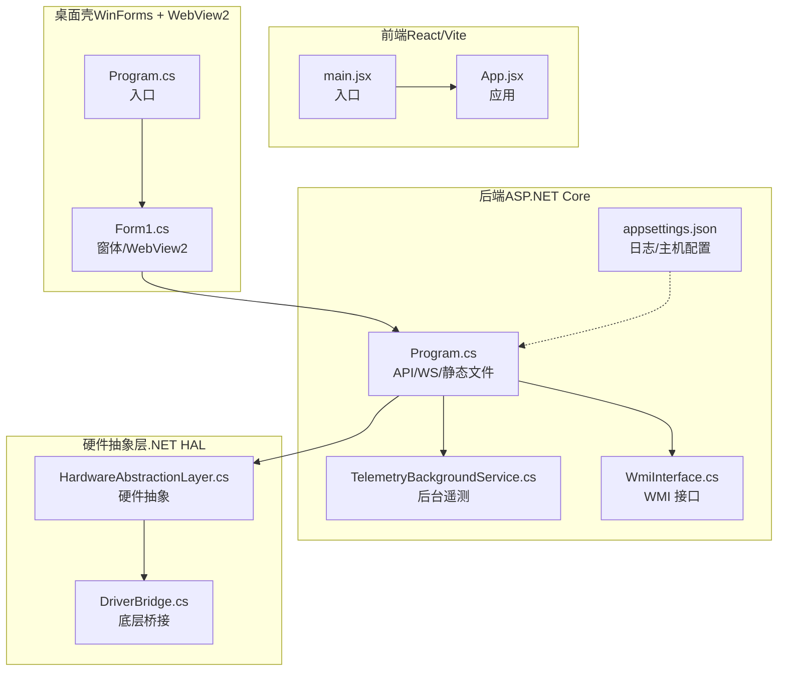
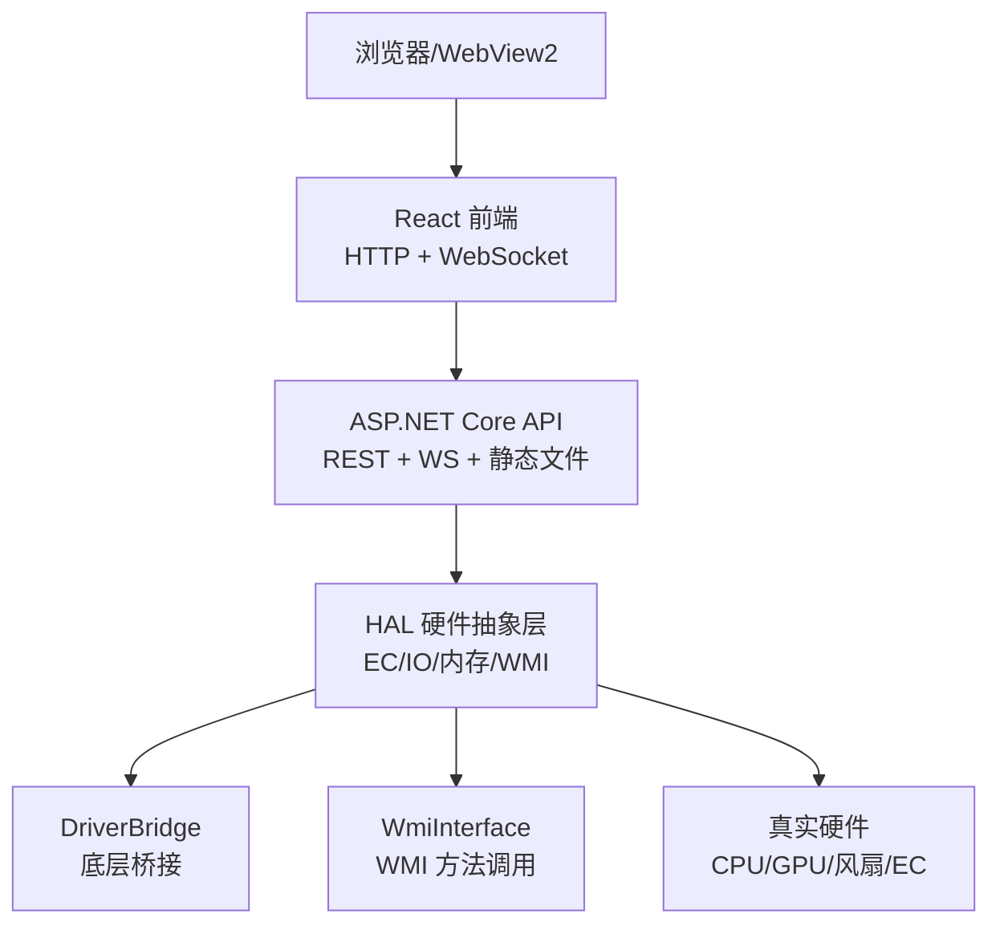
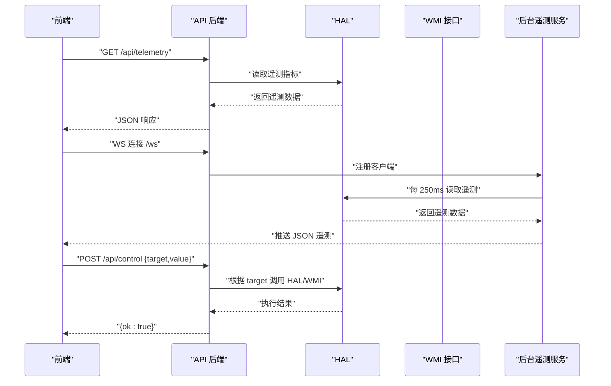
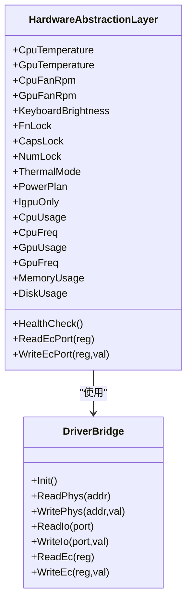
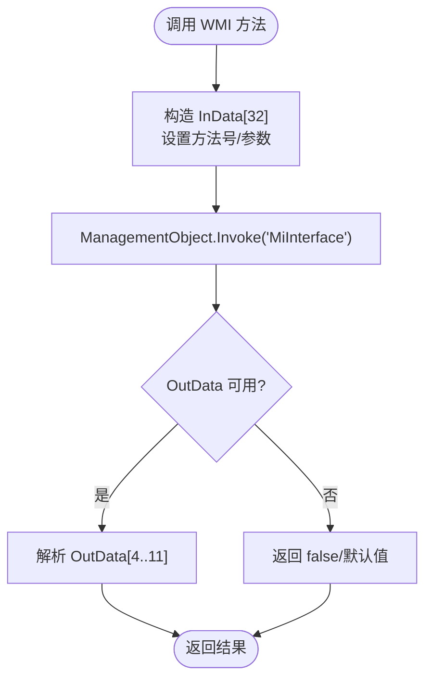
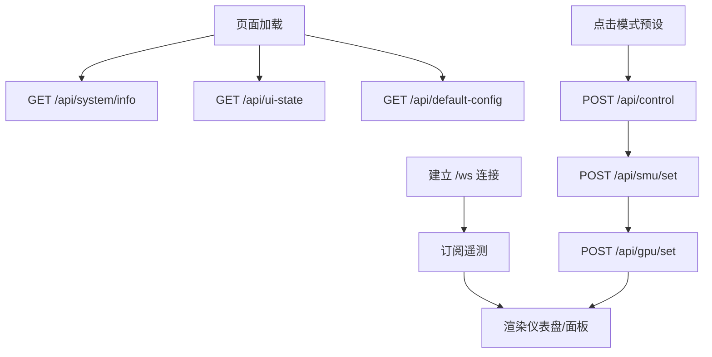
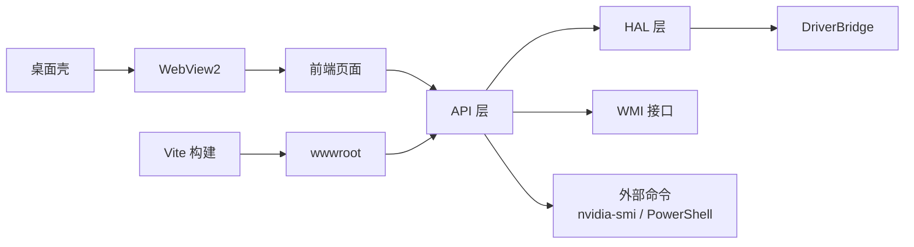

# 系统架构

<cite>
**本文引用的文件**
- [Douzhanzhe.API.csproj](file://server/api/Douzhanzhe.API.csproj)
- [Douzhanzhe.HAL.csproj](file://server/hal/Douzhanzhe.HAL.csproj)
- [Douzhanzhe.Shell.csproj](file://server/shell/Douzhanzhe.Shell/Douzhanzhe.Shell.csproj)
- [package.json（前端）](file://package.json)
- [package.json（后端 Node.js）](file://server/package.json)
- [Program.cs（API 后端）](file://server/api/Program.cs)
- [HardwareAbstractionLayer.cs](file://server/hal/HardwareAbstractionLayer.cs)
- [DriverBridge.cs](file://server/hal/DriverBridge.cs)
- [TelemetryBackgroundService.cs](file://server/api/TelemetryBackgroundService.cs)
- [WmiInterface.cs](file://server/api/WmiInterface.cs)
- [Form1.cs（WinForms 桌面壳）](file://server/shell/Douzhanzhe.Shell/Form1.cs)
- [Program.cs（桌面壳入口）](file://server/shell/Douzhanzhe.Shell/Program.cs)
- [main.jsx（前端入口）](file://src/main.jsx)
- [App.jsx（前端应用）](file://src/App.jsx)
- [appsettings.json（API 后端配置）](file://server/api/appsettings.json)
</cite>

## 目录
1. [引言](#引言)
2. [项目结构](#项目结构)
3. [核心组件](#核心组件)
4. [架构总览](#架构总览)
5. [详细组件分析](#详细组件分析)
6. [依赖分析](#依赖分析)
7. [性能考虑](#性能考虑)
8. [故障排查指南](#故障排查指南)
9. [结论](#结论)
10. [附录](#附录)

## 引言
本架构文档面向 DOUZHANZHE-Control 系统，系统采用前后端分离设计，后端由 ASP.NET Core 提供 REST API 与 WebSocket 实时遥测，前端基于 React/Vite 构建，桌面壳使用 WinForms + WebView2 承载前端页面。硬件抽象层（HAL）在 .NET 层之上封装底层硬件访问，屏蔽不同机型差异，提供统一的硬件控制与遥测接口。系统支持实时遥测推送、风扇控制、SMU 参数调节、GPU 频率锁定、电源计划与散热模式切换等能力。

## 项目结构
- 顶层前端工程位于 src/，构建产物发布至 server/api/wwwroot，由后端静态文件中间件提供。
- 后端分为三部分：
  - API 层：server/api，提供 REST API、WebSocket、静态文件托管与后台遥测服务。
  - HAL 层：server/hal，封装底层硬件访问（EC、IO、物理内存、WMI）。
  - 桌面壳：server/shell/Douzhanzhe.Shell，WinForms + WebView2 承载前端页面。
- 配置与持久化：后端通过共享 config 目录进行 JSON 配置读写；桌面壳通过 Windows 任务计划服务实现开机自启。



**图表来源**
- [Program.cs（API 后端）:1-783](file://server/api/Program.cs#L1-L783)
- [TelemetryBackgroundService.cs:1-143](file://server/api/TelemetryBackgroundService.cs#L1-L143)
- [WmiInterface.cs:1-210](file://server/api/WmiInterface.cs#L1-L210)
- [HardwareAbstractionLayer.cs:1-767](file://server/hal/HardwareAbstractionLayer.cs#L1-L767)
- [DriverBridge.cs:1-133](file://server/hal/DriverBridge.cs#L1-L133)
- [Form1.cs（WinForms 桌面壳）:1-140](file://server/shell/Douzhanzhe.Shell/Form1.cs#L1-L140)
- [Program.cs（桌面壳入口）:1-11](file://server/shell/Douzhanzhe.Shell/Program.cs#L1-L11)
- [main.jsx（前端入口）:1-14](file://src/main.jsx#L1-L14)
- [App.jsx（前端应用）:1-134](file://src/App.jsx#L1-L134)
- [appsettings.json（API 后端配置）:1-10](file://server/api/appsettings.json#L1-L10)

**章节来源**
- [Douzhanzhe.API.csproj:1-40](file://server/api/Douzhanzhe.API.csproj#L1-L40)
- [Douzhanzhe.HAL.csproj:1-18](file://server/hal/Douzhanzhe.HAL.csproj#L1-L18)
- [Douzhanzhe.Shell.csproj:1-16](file://server/shell/Douzhanzhe.Shell/Douzhanzhe.Shell.csproj#L1-L16)
- [package.json（前端）:1-33](file://package.json#L1-L33)
- [package.json（后端 Node.js）:1-16](file://server/package.json#L1-L16)

## 核心组件
- 表示层（前端）
  - React 组件体系，包含仪表盘、系统信息、设置面板等，支持卡片拖拽排序与主题切换。
  - 通过 HTTP 与 WebSocket 与后端交互，实现遥测订阅与控制下发。
- API 层（后端）
  - ASP.NET Core Web 应用，提供 REST API、静态文件托管、WebSocket 遥测推送、后台服务。
  - 依赖 HAL 与 WMI 接口，负责业务编排与配置持久化。
- 业务逻辑层（HAL）
  - 封装 EC、IO、物理内存、WMI 访问，提供统一的硬件控制与遥测读取接口。
  - 包含缓存与降级策略，如 GPU 温度回退 nvidia-smi、遥测缓存等。
- 硬件抽象层（HAL）
  - DriverBridge 提供底层 IO/EC/物理内存访问与同步互斥。
  - WmiInterface 提供 WMI 方法调用，用于风扇、GPU 模式、Fn/TPLock 等控制。
- 桌面壳（WinForms + WebView2）
  - 作为系统托盘应用，承载前端页面，具备最小化到托盘、开机自启等功能。

**章节来源**
- [Program.cs（API 后端）:1-783](file://server/api/Program.cs#L1-L783)
- [HardwareAbstractionLayer.cs:1-767](file://server/hal/HardwareAbstractionLayer.cs#L1-L767)
- [DriverBridge.cs:1-133](file://server/hal/DriverBridge.cs#L1-L133)
- [WmiInterface.cs:1-210](file://server/api/WmiInterface.cs#L1-L210)
- [Form1.cs（WinForms 桌面壳）:1-140](file://server/shell/Douzhanzhe.Shell/Form1.cs#L1-L140)
- [main.jsx（前端入口）:1-14](file://src/main.jsx#L1-L14)
- [App.jsx（前端应用）:1-134](file://src/App.jsx#L1-L134)

## 架构总览
系统采用“桌面壳 + 前后端分离”的整体形态：
- 桌面壳（WinForms + WebView2）负责应用生命周期与用户交互，加载本地 127.0.0.1:3100 的前端页面。
- 前端通过 HTTP 获取系统信息、UI 状态、默认配置等，并通过 WebSocket 订阅实时遥测。
- 后端提供 REST API 与 WebSocket，内部依赖 HAL 与 WMI 接口完成硬件控制与遥测采集。
- HAL 通过 DriverBridge 访问 EC、IO、物理内存，必要时回退到子进程（如 nvidia-smi）或 PowerShell 命令。



**图表来源**
- [Program.cs（API 后端）:56-86](file://server/api/Program.cs#L56-L86)
- [TelemetryBackgroundService.cs:54-141](file://server/api/TelemetryBackgroundService.cs#L54-L141)
- [HardwareAbstractionLayer.cs:1-767](file://server/hal/HardwareAbstractionLayer.cs#L1-L767)
- [DriverBridge.cs:1-133](file://server/hal/DriverBridge.cs#L1-L133)
- [WmiInterface.cs:1-210](file://server/api/WmiInterface.cs#L1-L210)

## 详细组件分析

### 组件 A：API 后端（REST + WebSocket + 静态文件）
- 职责
  - 提供 REST API：遥测查询、系统信息、健康检查、控制下发、SMU/GPU/WMI 等接口。
  - 提供 WebSocket：每 250ms 推送全量遥测给前端。
  - 提供静态文件：构建产物发布至 wwwroot，由后端托管。
  - 依赖注入：HAL、WMI、SMU/GPU 控制器、后台遥测服务。
- 关键流程
  - WebSocket 建立：/ws，接收连接后加入推送队列。
  - 遥测推送：后台服务定时读取 HAL/WMI 数据，序列化后广播。
  - 控制下发：/api/control 根据 target 分派到 HAL/WMI/SMBIOS 子进程。
  - 配置持久化：/api/custom-params、/api/ui-state、/api/default-config。
- 性能与可靠性
  - 遥测周期 250ms，避免过载；对异常连接进行清理。
  - 对 nvidia-smi、PowerShell 等外部命令设置超时与降级策略。



**图表来源**
- [Program.cs（API 后端）:87-202](file://server/api/Program.cs#L87-L202)
- [TelemetryBackgroundService.cs:54-141](file://server/api/TelemetryBackgroundService.cs#L54-L141)

**章节来源**
- [Program.cs（API 后端）:1-783](file://server/api/Program.cs#L1-L783)
- [TelemetryBackgroundService.cs:1-143](file://server/api/TelemetryBackgroundService.cs#L1-L143)
- [appsettings.json（API 后端配置）:1-10](file://server/api/appsettings.json#L1-L10)

### 组件 B：硬件抽象层（HAL）
- 职责
  - 在 DriverBridge 之上提供语义化硬件访问接口。
  - 统一键盘背光、Fn/Caps/Num 锁、散热模式、电源计划、风扇目标转速、SMU 通信等。
  - 通过物理内存与 EC IO 协议读写，必要时回退到 nvidia-smi、PowerShell。
- 关键点
  - EC 偏移常量与位掩码定义，确保跨机型一致性。
  - 风扇目标转速写入采用比例换算，读取采用仲裁策略减少竞态。
  - GPU 温度优先物理内存，失败则回退 nvidia-smi 并带缓存时间窗。
- 优化
  - 遥测数据缓存与降级，避免频繁外部命令调用。
  - 电源计划与设备禁用通过系统 API 直接调用，降低复杂度。



**图表来源**
- [HardwareAbstractionLayer.cs:1-767](file://server/hal/HardwareAbstractionLayer.cs#L1-L767)
- [DriverBridge.cs:1-133](file://server/hal/DriverBridge.cs#L1-L133)

**章节来源**
- [HardwareAbstractionLayer.cs:1-767](file://server/hal/HardwareAbstractionLayer.cs#L1-L767)
- [DriverBridge.cs:1-133](file://server/hal/DriverBridge.cs#L1-L133)

### 组件 C：WMI 接口（WmiInterface）
- 职责
  - 通过 System.Management 访问 root\WMI 的 MICommonInterface，实现风扇控制、GPU 模式、Fn/TPLock 等。
  - 支持通用方法号与可选参数的原始命令发送。
- 使用场景
  - 风扇手动模式与目标转速下发（Bellator 协议）。
  - GPU 模式切换（混合/集显/独显）。
  - Fn/TPLock 状态读取与设置。
- 错误处理
  - 初始化失败记录错误；方法调用异常返回 false，保证上层容错。



**图表来源**
- [WmiInterface.cs:50-209](file://server/api/WmiInterface.cs#L50-L209)

**章节来源**
- [WmiInterface.cs:1-210](file://server/api/WmiInterface.cs#L1-L210)

### 组件 D：桌面壳（WinForms + WebView2）
- 职责
  - WinForms 窗体承载 WebView2，作为系统托盘应用，支持最小化到托盘、双击恢复。
  - 启动时等待后端 API 就绪（最多 30s），再导航到本地前端页面。
  - 支持命令行参数 --minimized 控制开机自启时的显示行为。
- 交互
  - 通过 HttpClient 轮询 127.0.0.1:3100，确保后端可用后再加载前端。
  - WebView2 禁用开发者工具，提升安全性与稳定性。

```mermaid
sequenceDiagram
participant OS as "Windows 任务计划"
participant Shell as "Douzhanzhe.Shell"
participant WV as "WebView2"
participant API as "127.0.0.1 : 3100"
OS->>Shell : "启动 Douzhanzhe.Shell.exe [--minimized]"
Shell->>WV : "EnsureCoreWebView2Async()"
loop 最多 30s
Shell->>API : "GET /"
alt 成功
Shell->>WV : "Source = http : //127.0.0.1 : 3100/"
exit
else 失败
Shell->>Shell : "等待 1s"
end
end
Shell->>WV : "仍尝试加载前端"
```

**图表来源**
- [Form1.cs（WinForms 桌面壳）:61-92](file://server/shell/Douzhanzhe.Shell/Form1.cs#L61-L92)
- [Program.cs（桌面壳入口）:1-11](file://server/shell/Douzhanzhe.Shell/Program.cs#L1-L11)

**章节来源**
- [Form1.cs（WinForms 桌面壳）:1-140](file://server/shell/Douzhanzhe.Shell/Form1.cs#L1-L140)
- [Program.cs（桌面壳入口）:1-11](file://server/shell/Douzhanzhe.Shell/Program.cs#L1-L11)

### 组件 E：前端（React/Vite）
- 职责
  - 提供仪表盘、系统信息、设置面板等 UI。
  - 通过 HTTP 获取系统信息、UI 状态、默认配置；通过 WebSocket 订阅遥测。
  - 支持卡片排序、主题切换、模式预设一键应用。
- 数据流
  - useControlState 管理全局状态（遥测、设置、UX TU 参数、风扇目标等）。
  - 通过 uxtuAdapter 与后端 API 交互，实现 SMU/GPU 控制与预设应用。



**图表来源**
- [App.jsx（前端应用）:23-134](file://src/App.jsx#L23-L134)
- [Program.cs（API 后端）:87-202](file://server/api/Program.cs#L87-L202)
- [Program.cs（API 后端）:238-298](file://server/api/Program.cs#L238-L298)
- [Program.cs（API 后端）:396-447](file://server/api/Program.cs#L396-L447)

**章节来源**
- [main.jsx（前端入口）:1-14](file://src/main.jsx#L1-L14)
- [App.jsx（前端应用）:1-134](file://src/App.jsx#L1-L134)

## 依赖分析
- 项目依赖关系
  - API 层引用 HAL 层，HAL 层依赖底层驱动桥接（DriverBridge）。
  - API 层通过 System.Management 访问 WMI，通过子进程调用 nvidia-smi、PowerShell。
  - 桌面壳依赖 WebView2，承载前端页面。
  - 前端通过 Vite 构建，构建产物复制到后端 wwwroot。
- 外部依赖
  - inpoutx64.dll：提供 IO/EC/物理内存访问。
  - WinRing0x64.sys：SMU 控制所需内核驱动，启动时自动安装/启动。
  - Windows 任务计划服务：实现开机自启与最小化偏好。



**图表来源**
- [Douzhanzhe.API.csproj:17-33](file://server/api/Douzhanzhe.API.csproj#L17-L33)
- [Douzhanzhe.HAL.csproj:13-15](file://server/hal/Douzhanzhe.HAL.csproj#L13-L15)
- [Program.cs（API 后端）:24-29](file://server/api/Program.cs#L24-L29)
- [Program.cs（API 后端）:692-723](file://server/api/Program.cs#L692-L723)
- [package.json（前端）:9-9](file://package.json#L9-L9)

**章节来源**
- [Douzhanzhe.API.csproj:1-40](file://server/api/Douzhanzhe.API.csproj#L1-L40)
- [Douzhanzhe.HAL.csproj:1-18](file://server/hal/Douzhanzhe.HAL.csproj#L1-L18)
- [package.json（前端）:1-33](file://package.json#L1-L33)
- [Program.cs（API 后端）:24-29](file://server/api/Program.cs#L24-L29)

## 性能考虑
- 遥测采样与缓存
  - HAL 对 GPU 温度、使用率、内存、磁盘等指标设置缓存时间窗，减少外部命令调用频率。
  - 后台遥测服务以 250ms 间隔轮询，兼顾实时性与负载。
- I/O 与同步
  - EC 写入采用互斥锁与就绪检测，避免竞态；风扇目标转速写入采用比例换算，避免越界。
- 外部命令降级
  - nvidia-smi、PowerShell 等命令设置超时与降级策略，失败时返回最近有效值。
- 静态资源与网络
  - 前端构建产物放置于后端 wwwroot，减少跨域与额外转发。
- 驱动与内核
  - WinRing0 驱动按需安装与启动，失败时记录日志但不影响其他功能。

[本节为通用性能建议，无需特定文件引用]

## 故障排查指南
- WebSocket 无法连接
  - 检查后端是否监听 127.0.0.1:3100，确认 /ws 路由与 UseWebSockets 已启用。
  - 查看后台遥测服务日志，确认客户端加入与推送循环正常。
- 遥测为空或异常
  - 检查 HAL 健康检查（CPU 温度应在合理范围），确认 EC/IO 访问成功。
  - 若 nvidia-smi 不可用，GPU 温度/使用率会回退，属预期行为。
- 控制下发无效
  - 确认 /api/control 的 target 与 value 合法，WMI 方法调用是否抛出异常。
  - 对于 SMU/GPU 控制，检查子进程与驱动状态。
- 驱动与权限
  - WinRing0.sys 是否存在且已启动；API 启动日志是否提示加载失败。
  - inpoutx64.dll 是否复制到输出目录，驱动初始化是否成功。
- 桌面壳无法加载前端
  - 桌面壳启动后轮询 127.0.0.1:3100，若超时仍尝试加载，检查后端是否启动成功。

**章节来源**
- [Program.cs（API 后端）:56-86](file://server/api/Program.cs#L56-L86)
- [TelemetryBackgroundService.cs:54-141](file://server/api/TelemetryBackgroundService.cs#L54-L141)
- [HardwareAbstractionLayer.cs:748-760](file://server/hal/HardwareAbstractionLayer.cs#L748-L760)
- [Program.cs（API 后端）:692-723](file://server/api/Program.cs#L692-L723)

## 结论
DOUZHANZHE-Control 通过清晰的分层架构实现了前后端分离与硬件抽象，桌面壳提供稳定的用户入口，API 层承担业务编排与实时遥测，HAL 层屏蔽底层差异并提供统一接口。系统在性能与可靠性方面做了多项优化，包括遥测缓存、降级策略与后台服务管理。未来可在以下方向持续演进：增强错误上报与可观测性、扩展更多机型的 EC 映射与 WMI 方法、引入更细粒度的权限与安全控制。

[本节为总结性内容，无需特定文件引用]

## 附录
- 关键端点概览
  - GET /api/telemetry：获取全量遥测
  - GET /api/system/info：获取系统信息
  - GET /api/health：健康检查
  - POST /api/control：控制下发（键盘背光、锁键、散热模式、电源计划、GPU 模式等）
  - /ws：WebSocket 遥测推送
  - /api/smu/*：SMU 参数设置与探测
  - /api/gpu/*：GPU 频率锁定与状态查询
  - /api/wmi/cmd：WMI 原始命令
  - /api/auto-start*：开机自启配置
- 配置文件
  - custom-params.json、ui-state.json、dashboard-default.json：用户自定义参数与 UI 状态持久化
  - appsettings.json：日志与主机允许策略

**章节来源**
- [Program.cs（API 后端）:87-584](file://server/api/Program.cs#L87-L584)
- [appsettings.json（API 后端配置）:1-10](file://server/api/appsettings.json#L1-L10)