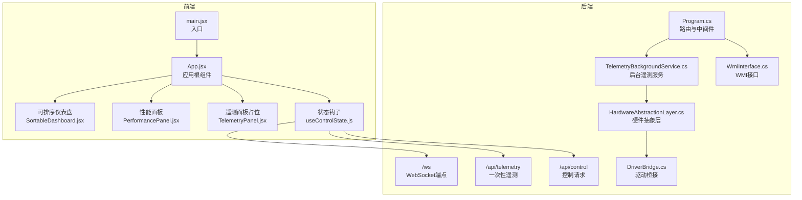
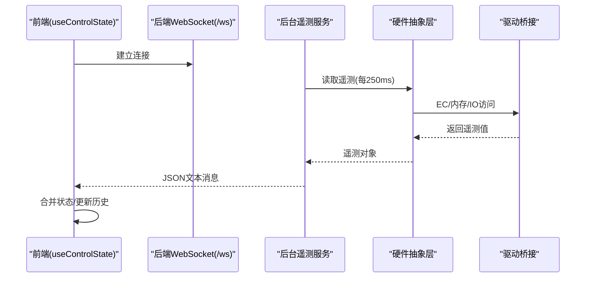
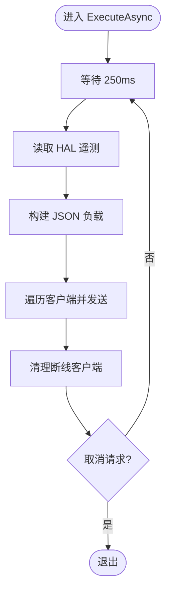
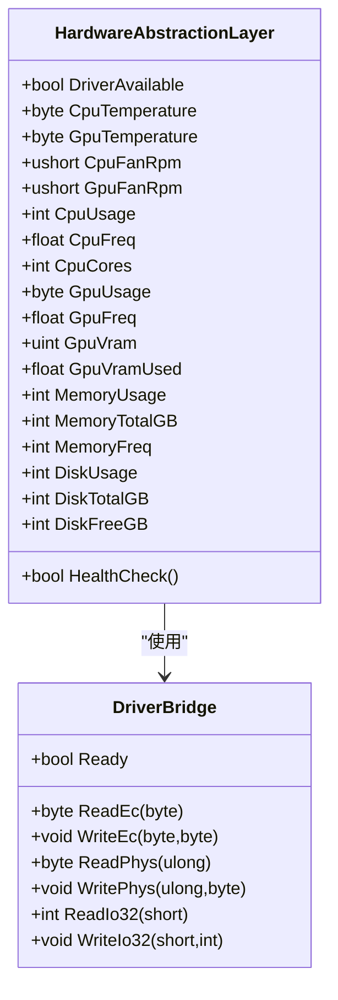
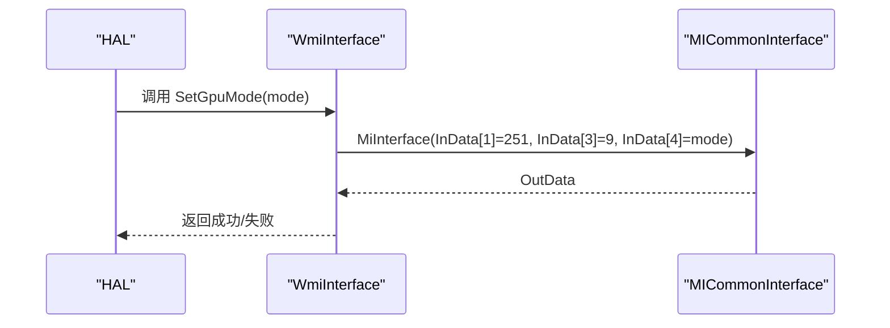
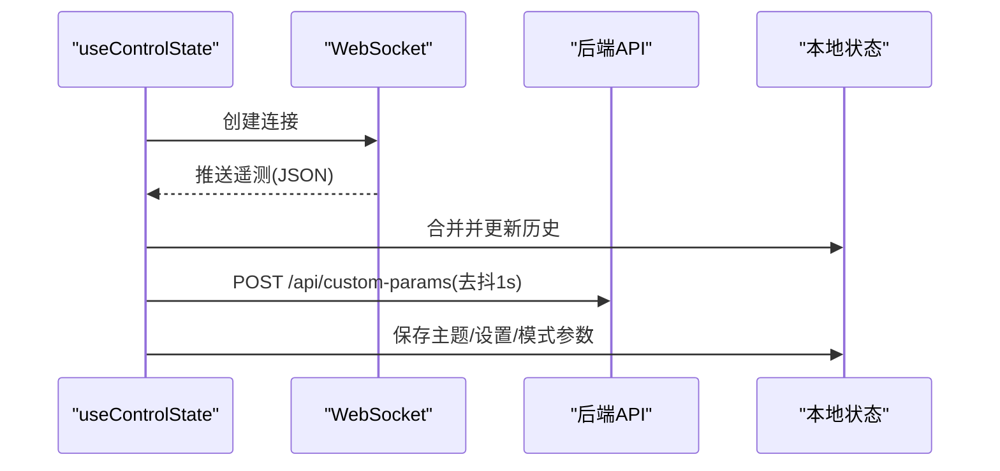
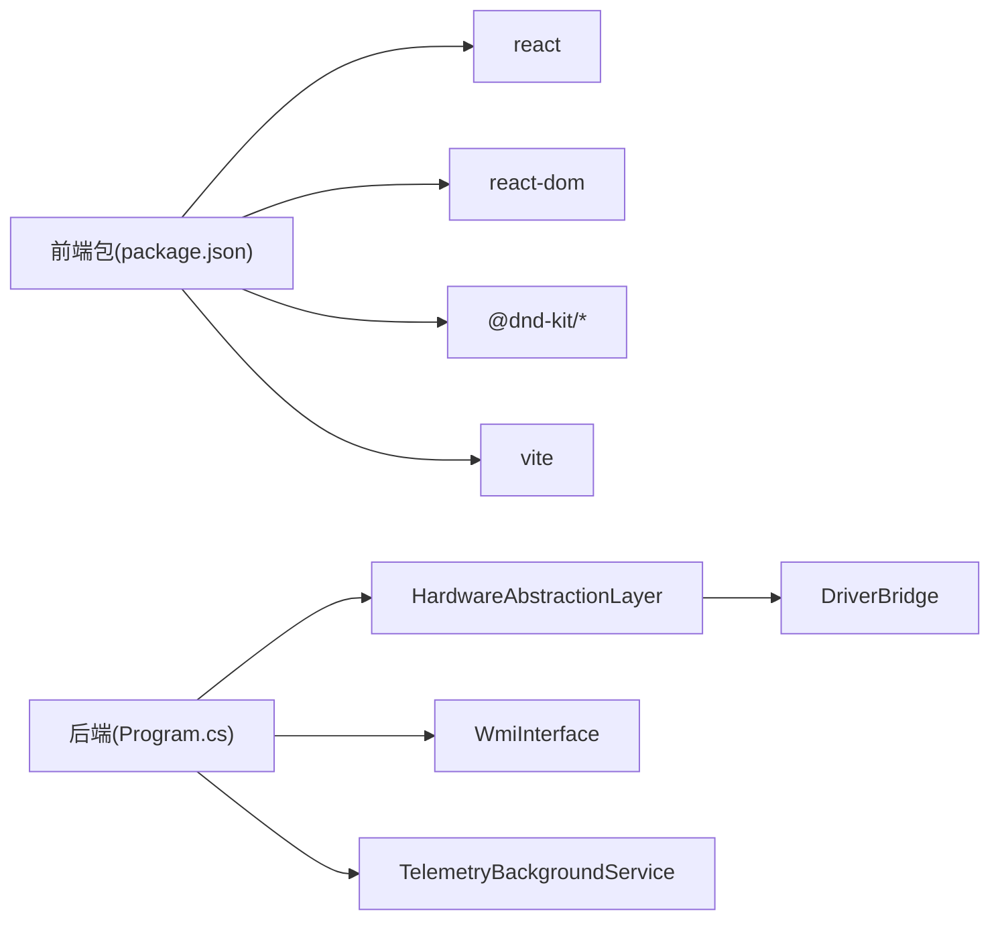

# 性能优化

<cite>
**本文引用的文件**
- [Program.cs](file://server/api/Program.cs)
- [TelemetryBackgroundService.cs](file://server/api/TelemetryBackgroundService.cs)
- [WmiInterface.cs](file://server/api/WmiInterface.cs)
- [HardwareAbstractionLayer.cs](file://server/hal/HardwareAbstractionLayer.cs)
- [DriverBridge.cs](file://server/hal/DriverBridge.cs)
- [App.jsx](file://src/App.jsx)
- [main.jsx](file://src/main.jsx)
- [PerformancePanel.jsx](file://src/components/panels/PerformancePanel.jsx)
- [TelemetryPanel.jsx](file://src/components/panels/TelemetryPanel.jsx)
- [useControlState.js](file://src/hooks/useControlState.js)
- [package.json](file://package.json)
- [vite.config.js](file://vite.config.js)
</cite>

## 目录
1. [简介](#简介)
2. [项目结构](#项目结构)
3. [核心组件](#核心组件)
4. [架构总览](#架构总览)
5. [详细组件分析](#详细组件分析)
6. [依赖关系分析](#依赖关系分析)
7. [性能考量与优化建议](#性能考量与优化建议)
8. [故障排查指南](#故障排查指南)
9. [结论](#结论)
10. [附录](#附录)

## 简介
本指南面向 DOUZHANZHE-Control 的性能优化，聚焦以下方面：
- 硬件监控服务的性能瓶颈与优化：遥测采样频率、内存与 CPU 占用控制、后台服务稳定性。
- 前端性能优化策略：React 组件渲染、WebSocket 连接与 UI 更新频率控制。
- 硬件访问层的性能考量：EC 寄存器读写、驱动调用效率。
- 系统资源监控与性能基准测试方法。
- 不同硬件配置下的调优建议与最佳实践。

## 项目结构
项目采用前后端分离架构：
- 后端（C#）：ASP.NET Core Web API + 后台遥测服务，负责硬件抽象、WMI 交互、SMU/GPU 控制与遥测推送。
- 前端（React/Vite）：基于 Vite 构建，通过 WebSocket 实时接收遥测数据，提供仪表盘与控制面板。

图表来源
- [Program.cs:1-783](file://server/api/Program.cs#L1-L783)
- [TelemetryBackgroundService.cs:1-143](file://server/api/TelemetryBackgroundService.cs#L1-L143)
- [HardwareAbstractionLayer.cs:1-772](file://server/hal/HardwareAbstractionLayer.cs#L1-L772)
- [DriverBridge.cs:1-150](file://server/hal/DriverBridge.cs#L1-L150)
- [WmiInterface.cs:1-210](file://server/api/WmiInterface.cs#L1-L210)
- [useControlState.js:1-355](file://src/hooks/useControlState.js#L1-L355)
- [main.jsx:1-14](file://src/main.jsx#L1-L14)
- [App.jsx:1-134](file://src/App.jsx#L1-L134)

章节来源
- [Program.cs:1-783](file://server/api/Program.cs#L1-L783)
- [vite.config.js:1-8](file://vite.config.js#L1-L8)
- [package.json:1-33](file://package.json#L1-L33)

## 核心组件
- 后台遥测服务：每 250ms 采集一次遥测并通过 WebSocket 推送，同时清理断线客户端。
- 硬件抽象层：封装 EC/SMU/内存/IO 访问，提供温度、风扇、电源计划、散热模式等属性与控制。
- 驱动桥接：通过 inpoutx64.dll 提供 IO/内存映射访问能力，并实现 EC 协议读写。
- WMI 接口：封装 MICommonInterface 方法，支持风扇手动模式、目标转速、GPU 模式等。
- 前端状态与连接：统一管理主题、设置、遥测历史、WebSocket 连接与本地存储；在后端离线时启用模拟数据。

章节来源
- [TelemetryBackgroundService.cs:54-141](file://server/api/TelemetryBackgroundService.cs#L54-L141)
- [HardwareAbstractionLayer.cs:19-772](file://server/hal/HardwareAbstractionLayer.cs#L19-L772)
- [DriverBridge.cs:9-149](file://server/hal/DriverBridge.cs#L9-L149)
- [WmiInterface.cs:18-209](file://server/api/WmiInterface.cs#L18-L209)
- [useControlState.js:26-355](file://src/hooks/useControlState.js#L26-L355)

## 架构总览
后端通过 Program.cs 注册 HAL、SMU、WMI、后台服务与 CORS/WebSocket 支持；前端通过 useControlState.js 建立 WebSocket 连接，接收全量遥测并合并到本地状态；控制请求通过 /api/control 下发至 HAL/WMI。

图表来源
- [Program.cs:56-86](file://server/api/Program.cs#L56-L86)
- [TelemetryBackgroundService.cs:54-141](file://server/api/TelemetryBackgroundService.cs#L54-L141)
- [HardwareAbstractionLayer.cs:580-747](file://server/hal/HardwareAbstractionLayer.cs#L580-L747)
- [DriverBridge.cs:66-137](file://server/hal/DriverBridge.cs#L66-L137)
- [useControlState.js:245-257](file://src/hooks/useControlState.js#L245-L257)

## 详细组件分析

### 后台遥测服务（TelemetryBackgroundService）
- 采样周期：固定 250ms 延迟，随后读取全量遥测并广播给所有已连接客户端。
- 并发与稳定性：使用静态客户端列表与锁保护；对异常进行日志记录并清理断线客户端。
- 数据构建：序列化包含 CPU/GPU/内存/磁盘/风扇/键盘灯/系统状态等字段。

图表来源
- [TelemetryBackgroundService.cs:54-141](file://server/api/TelemetryBackgroundService.cs#L54-L141)

章节来源
- [TelemetryBackgroundService.cs:54-141](file://server/api/TelemetryBackgroundService.cs#L54-L141)

### 硬件抽象层（HardwareAbstractionLayer）
- 遥测缓存：对 CPU/GPU/内存/磁盘等指标设置时间窗口缓存，减少频繁系统查询。
- EC/SMU 访问：封装 EC IO 协议读写、SMU 寄存器访问、物理内存读写与位操作。
- 系统信息：通过 PowerShell 查询 CPU/GPU/系统型号，带缓存与超时保护。
- 健康检查：读取 CPU 温度进行基本健康校验。

图表来源
- [HardwareAbstractionLayer.cs:19-772](file://server/hal/HardwareAbstractionLayer.cs#L19-L772)
- [DriverBridge.cs:9-149](file://server/hal/DriverBridge.cs#L9-L149)

章节来源
- [HardwareAbstractionLayer.cs:580-747](file://server/hal/HardwareAbstractionLayer.cs#L580-L747)
- [DriverBridge.cs:66-137](file://server/hal/DriverBridge.cs#L66-L137)

### WMI 接口（WmiInterface）
- 方法封装：提供 GPUMode、FnLock、TouchpadLock、风扇手动/目标转速、通用 Raw 命令等。
- 调用方式：通过 MICommonInterface 的 MiInterface 方法，构造 InData/OutData。

图表来源
- [WmiInterface.cs:72-87](file://server/api/WmiInterface.cs#L72-L87)

章节来源
- [WmiInterface.cs:62-135](file://server/api/WmiInterface.cs#L62-L135)

### 前端状态与连接（useControlState.js）
- WebSocket 连接：首次建立连接后，收到消息即合并到本地 telemetry；断开则标记 offline。
- 模拟数据：后端离线时，按 1 秒间隔生成模拟遥测，包含风扇目标趋近、模式偏差、功耗/温度目标等。
- 历史数据：维护 CPU/GPU/风扇/温度的历史数组，用于曲线展示。
- 参数持久化：localStorage 保存主题、设置、各模式参数；自定义模式下同步到服务端 /api/custom-params。

图表来源
- [useControlState.js:245-336](file://src/hooks/useControlState.js#L245-L336)
- [Program.cs:56-86](file://server/api/Program.cs#L56-L86)

章节来源
- [useControlState.js:245-336](file://src/hooks/useControlState.js#L245-L336)

### 前端控制面板（PerformancePanel.jsx）
- SMU 参数调整：通过队列与去抖（约 600ms）减少频繁调用，降低后端压力。
- 功率/频率/温度墙/核心限制等滑块联动，支持快速下发。

章节来源
- [PerformancePanel.jsx:21-35](file://src/components/panels/PerformancePanel.jsx#L21-L35)

### 前端应用入口与根组件（main.jsx、App.jsx）
- React.StrictMode 包裹，确保副作用检测。
- 主题切换与标签页持久化，仪表盘可排序。

章节来源
- [main.jsx:7-13](file://src/main.jsx#L7-L13)
- [App.jsx:23-134](file://src/App.jsx#L23-L134)

## 依赖关系分析
- 前端依赖：React、React DOM、拖拽库与 TailwindCSS，构建工具链由 Vite 提供。
- 后端依赖：WinRing0/inpoutx64 驱动（用于 IO/内存访问）、WMI（MICommonInterface）、TaskScheduler（开机自启）。

图表来源
- [package.json:11-31](file://package.json#L11-L31)
- [Program.cs:1-20](file://server/api/Program.cs#L1-L20)
- [HardwareAbstractionLayer.cs:19-54](file://server/hal/HardwareAbstractionLayer.cs#L19-L54)
- [DriverBridge.cs:9-64](file://server/hal/DriverBridge.cs#L9-L64)

章节来源
- [package.json:1-33](file://package.json#L1-L33)
- [Program.cs:1-20](file://server/api/Program.cs#L1-L20)

## 性能考量与优化建议

### 硬件监控服务（后端）
- 采样频率优化
  - 当前：每 250ms 采样一次，全量推送。若 UI 频繁刷新，建议：
    - 前端侧改为按需订阅（仅订阅可见卡片），后端按卡片维度分发。
    - 引入“增量遥测”：仅在字段变化或阈值变更时推送。
  - 参考路径：[TelemetryBackgroundService.cs:62-102](file://server/api/TelemetryBackgroundService.cs#L62-L102)
- 内存与 CPU 占用控制
  - 减少 JSON 序列化开销：使用流式/池化序列化选项，或共享缓冲区。
  - 客户端清理：保持现有断线清理逻辑，避免僵尸连接占用内存。
  - 参考路径：[TelemetryBackgroundService.cs:105-130](file://server/api/TelemetryBackgroundService.cs#L105-L130)
- 后台服务稳定性
  - 异常隔离：捕获并记录异常，避免服务中断；必要时重启后台任务。
  - 参考路径：[TelemetryBackgroundService.cs:136-139](file://server/api/TelemetryBackgroundService.cs#L136-L139)

### 硬件访问层（HAL/DriverBridge）
- EC 寄存器读写优化
  - 读写加锁：DriverBridge 对 EC 读写使用互斥锁，避免并发冲突。
  - 批量读取：对相邻寄存器读取可合并为一次事务，减少端口往返。
  - 参考路径：[DriverBridge.cs:115-137](file://server/hal/DriverBridge.cs#L115-L137)
- 驱动调用效率
  - 缓存 Ready 状态：避免重复初始化与探测。
  - 物理映射优先：对 EC 区域使用预映射，减少动态映射成本。
  - 参考路径：[DriverBridge.cs:39-64](file://server/hal/DriverBridge.cs#L39-L64)
- 遥测缓存策略
  - HAL 对 CPU/GPU/内存/磁盘指标设置时间窗口缓存，减少系统查询频率。
  - 参考路径：[HardwareAbstractionLayer.cs:580-747](file://server/hal/HardwareAbstractionLayer.cs#L580-L747)

### 前端性能优化
- React 组件渲染优化
  - 使用 memo/浅比较：对不随状态变化的子组件使用 memo，避免无谓重渲染。
  - 分片渲染：将大型列表拆分为多个批次，避免主线程阻塞。
  - 参考路径：[App.jsx:23-134](file://src/App.jsx#L23-L134)
- WebSocket 连接管理
  - 前端去抖：对频繁变更的参数（如风扇目标）使用去抖（当前约 600ms），减少网络与后端压力。
  - 参考路径：[useControlState.js:117-126](file://src/hooks/useControlState.js#L117-L126)
- UI 更新频率控制
  - 后端推送：当前 250ms 一次，前端按需渲染；若 UI 卡顿，可考虑前端侧节流或仅更新可见区域。
  - 模拟数据：后端离线时按 1 秒间隔生成，避免高频轮询。
  - 参考路径：[useControlState.js:333-336](file://src/hooks/useControlState.js#L333-L336)

### 系统资源监控与基准测试
- 监控指标
  - 后端：CPU 使用率、内存占用、WebSocket 客户端数量、HAL/驱动调用耗时。
  - 前端：主线程帧耗时、GC 次数、WebSocket 延迟、组件渲染耗时。
- 基准测试
  - 后端：使用压测工具对 /api/telemetry 与 /api/control 接口施压，观察延迟与错误率。
  - 前端：使用浏览器性能面板测量渲染与脚本执行时间，定位热点函数。
  - 参考路径：[Program.cs:87-212](file://server/api/Program.cs#L87-L212)

### 不同硬件配置下的调优建议
- 低配设备（CPU/GPU 较弱）
  - 降低后端采样频率（如 500ms），前端仅订阅关键指标。
  - 关闭非必要动画与曲线绘制，减少渲染压力。
- 高频 CPU/强显平台
  - 保持 250ms 采样，开启全量遥测；优化 HAL 缓存命中率，减少系统查询。
  - 前端使用虚拟滚动与懒加载，避免一次性渲染大量卡片。

## 故障排查指南
- 后端驱动不可用
  - 现象：HAL 返回默认值，健康检查失败。
  - 排查：确认 inpoutx64 驱动加载状态，检查 WinRing0 服务。
  - 参考路径：[DriverBridge.cs:39-64](file://server/hal/DriverBridge.cs#L39-L64)
- WMI 方法调用失败
  - 现象：SetGpuMode/SetFanSpeed 等返回失败。
  - 排查：确认 MICommonInterface 可用性与权限，检查输入参数。
  - 参考路径：[WmiInterface.cs:72-87](file://server/api/WmiInterface.cs#L72-L87)
- WebSocket 断连
  - 现象：前端显示离线，后端日志出现异常。
  - 排查：检查网络与防火墙，确认客户端清理逻辑正常。
  - 参考路径：[TelemetryBackgroundService.cs:111-130](file://server/api/TelemetryBackgroundService.cs#L111-L130)
- 前端卡顿
  - 现象：UI 响应慢、渲染抖动。
  - 排查：使用性能面板定位组件重渲染热点，减少不必要的状态更新。
  - 参考路径：[useControlState.js:245-257](file://src/hooks/useControlState.js#L245-L257)

章节来源
- [DriverBridge.cs:39-64](file://server/hal/DriverBridge.cs#L39-L64)
- [WmiInterface.cs:72-87](file://server/api/WmiInterface.cs#L72-L87)
- [TelemetryBackgroundService.cs:111-130](file://server/api/TelemetryBackgroundService.cs#L111-L130)
- [useControlState.js:245-257](file://src/hooks/useControlState.js#L245-L257)

## 结论
通过在后端降低采样频率、优化 HAL 缓存与驱动调用、在前端实施去抖与渲染优化，可在保证体验的同时显著降低系统资源占用。针对不同硬件配置采取差异化策略，结合持续的监控与基准测试，可实现稳定高效的运行表现。

## 附录
- 构建与打包
  - 使用 Vite 构建前端产物，构建完成后复制到后端 wwwroot。
  - 参考路径：[vite.config.js:1-8](file://vite.config.js#L1-L8)，[package.json:6-10](file://package.json#L6-L10)