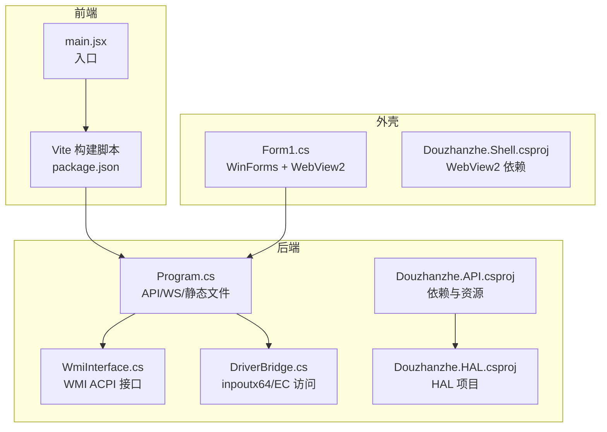
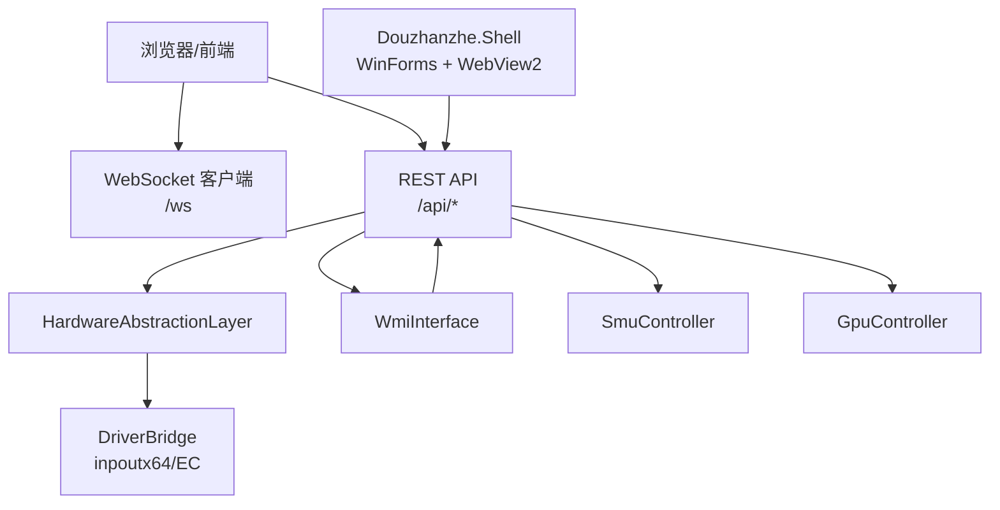
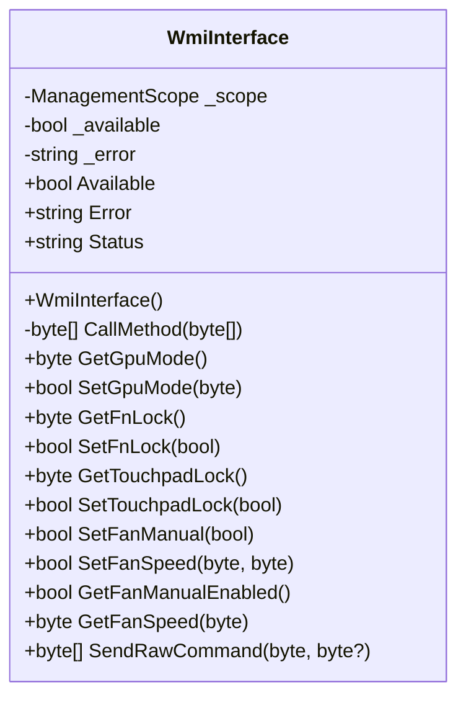
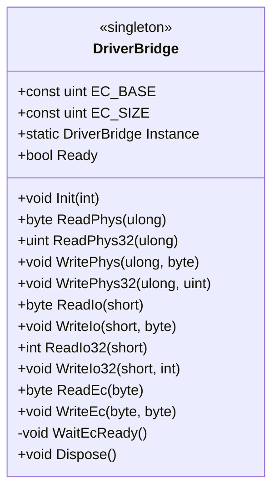
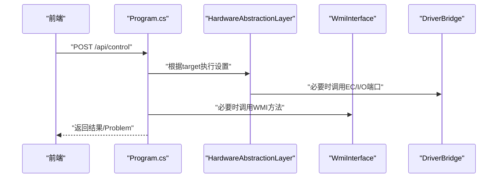
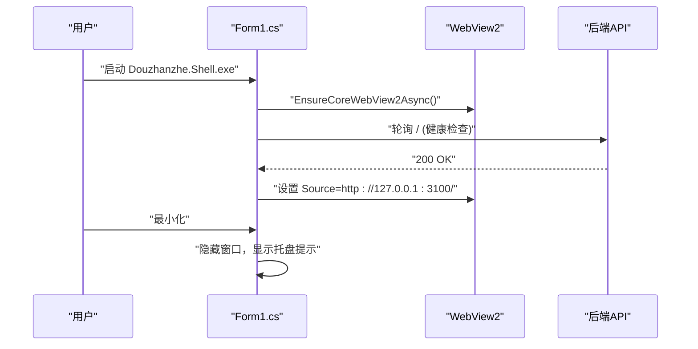
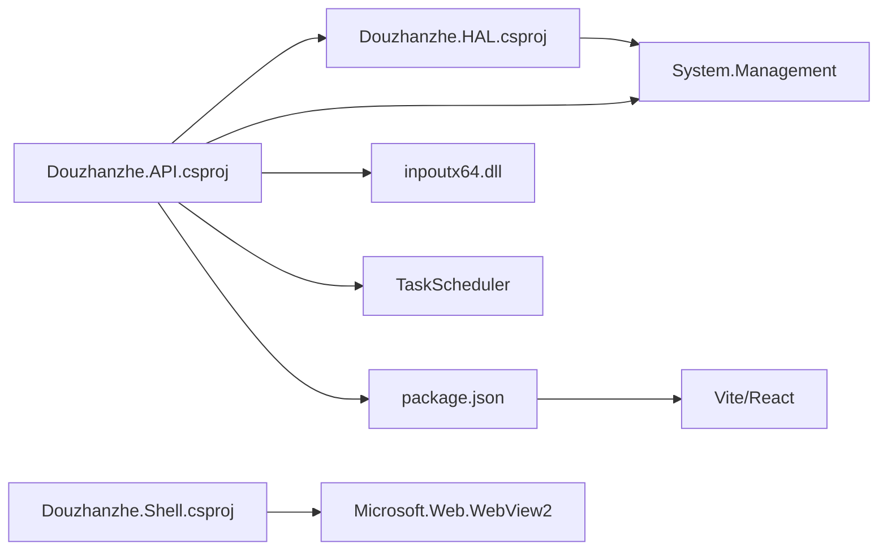

# 故障排除

<cite>
**本文引用的文件**
- [Douzhanzhe.API.csproj](file://server/api/Douzhanzhe.API.csproj)
- [Douzhanzhe.HAL.csproj](file://server/hal/Douzhanzhe.HAL.csproj)
- [Douzhanzhe.Shell.csproj](file://server/shell/Douzhanzhe.Shell/Douzhanzhe.Shell.csproj)
- [WmiInterface.cs](file://server/api/WmiInterface.cs)
- [DriverBridge.cs](file://server/hal/DriverBridge.cs)
- [Program.cs](file://server/api/Program.cs)
- [Form1.cs](file://server/shell/Douzhanzhe.Shell/Form1.cs)
- [appsettings.Development.json](file://server/api/appsettings.Development.json)
- [package.json](file://package.json)
- [main.jsx](file://src/main.jsx)
</cite>

## 目录
1. [简介](#简介)
2. [项目结构](#项目结构)
3. [核心组件](#核心组件)
4. [架构总览](#架构总览)
5. [详细组件分析](#详细组件分析)
6. [依赖关系分析](#依赖关系分析)
7. [性能考量](#性能考量)
8. [故障排除指南](#故障排除指南)
9. [结论](#结论)
10. [附录](#附录)

## 简介
本指南面向DOUZHANZHE-Control项目的使用者与维护者，提供系统化的故障排除流程与解决方案，覆盖硬件驱动问题、权限不足、网络连接失败、UI无响应、inpoutx64驱动错误、WMI接口异常、WebSocket连接问题、日志分析与调试技巧，以及紧急恢复与数据备份策略。文档基于仓库中的真实源码与配置进行分析，确保建议可操作且可追溯。

## 项目结构
项目采用前后端分离与嵌入式前端资源的架构：
- 后端服务（C# ASP.NET Core）：提供REST API、WebSocket遥测、HAL抽象层、WMI接口、SMU/GPU控制等能力，并内置静态资源发布。
- 硬件抽象层（HAL）：封装底层硬件访问（EC、I/O端口、物理内存映射），并提供安全降级逻辑。
- Shell包装器（WinForms + WebView2）：负责启动后端、等待就绪、承载前端页面，支持最小化到托盘。
- 前端（React/Vite）：构建产物被复制到后端wwwroot，由后端提供静态文件服务。

**图示来源**
- [Program.cs:1-783](file://server/api/Program.cs#L1-L783)
- [WmiInterface.cs:1-210](file://server/api/WmiInterface.cs#L1-L210)
- [DriverBridge.cs:1-150](file://server/hal/DriverBridge.cs#L1-L150)
- [Douzhanzhe.API.csproj:1-40](file://server/api/Douzhanzhe.API.csproj#L1-L40)
- [Douzhanzhe.HAL.csproj:1-18](file://server/hal/Douzhanzhe.HAL.csproj#L1-L18)
- [Douzhanzhe.Shell.csproj:1-16](file://server/shell/Douzhanzhe.Shell/Douzhanzhe.Shell.csproj#L1-L16)
- [Form1.cs:1-140](file://server/shell/Douzhanzhe.Shell/Form1.cs#L1-L140)
- [package.json:1-33](file://package.json#L1-L33)
- [main.jsx:1-14](file://src/main.jsx#L1-L14)

**章节来源**
- [Program.cs:1-783](file://server/api/Program.cs#L1-L783)
- [Douzhanzhe.API.csproj:1-40](file://server/api/Douzhanzhe.API.csproj#L1-L40)
- [Douzhanzhe.HAL.csproj:1-18](file://server/hal/Douzhanzhe.HAL.csproj#L1-L18)
- [Douzhanzhe.Shell.csproj:1-16](file://server/shell/Douzhanzhe.Shell/Douzhanzhe.Shell.csproj#L1-L16)
- [Form1.cs:1-140](file://server/shell/Douzhanzhe.Shell/Form1.cs#L1-L140)
- [package.json:1-33](file://package.json#L1-L33)
- [main.jsx:1-14](file://src/main.jsx#L1-L14)

## 核心组件
- 硬件抽象层（HAL）
  - 提供系统信息、遥测数据读取、EC端口读写、风扇控制、键盘灯、锁键状态等能力。
  - 当底层驱动不可用时，提供安全降级（返回默认值），避免阻塞上层功能。
- WMI接口（WmiInterface）
  - 通过root/WMI命名空间调用MICommonInterface，实现GPU模式、Fn/TPLock、风扇控制等。
  - 初始化时尝试连接并校验可用性，失败时记录错误类型与消息。
- inpoutx64驱动桥（DriverBridge）
  - 通过P/Invoke调用inpoutx64.dll，提供物理内存读写、EC协议端口访问、I/O端口读写等。
  - 初始化包含超时与异常处理，失败时输出降级提示并标记为不可用。
- 后端API（Program.cs）
  - 提供REST API、WebSocket遥测、SMU/GPU控制、自动启动、配置持久化等。
  - 自动加载WinRing0内核驱动用于SMU控制；内置调试页便于快速验证。
- Shell包装器（Form1.cs）
  - 使用WebView2承载前端页面，等待后端就绪（轮询健康检查），支持最小化到托盘。
- 前端（React/Vite）
  - 构建后复制至后端wwwroot，由后端提供静态文件服务。

**章节来源**
- [DriverBridge.cs:1-150](file://server/hal/DriverBridge.cs#L1-L150)
- [WmiInterface.cs:1-210](file://server/api/WmiInterface.cs#L1-L210)
- [Program.cs:1-783](file://server/api/Program.cs#L1-L783)
- [Form1.cs:1-140](file://server/shell/Douzhanzhe.Shell/Form1.cs#L1-L140)

## 架构总览
后端作为统一入口，聚合HAL与WMI能力，提供REST与WebSocket接口；Shell负责启动与展示；前端通过静态资源与后端交互。

**图示来源**
- [Program.cs:1-783](file://server/api/Program.cs#L1-L783)
- [WmiInterface.cs:1-210](file://server/api/WmiInterface.cs#L1-L210)
- [DriverBridge.cs:1-150](file://server/hal/DriverBridge.cs#L1-L150)

## 详细组件分析

### 组件A：WMI接口（WmiInterface）
- 功能要点
  - 初始化阶段连接root/WMI命名空间并校验MICommonInterface实例可用性。
  - 支持GPUMode、FnLock、TPLock、风扇控制（Bellator协议）、通用raw命令等。
  - 方法调用失败时捕获异常并返回布尔或默认值，避免崩溃。
- 关键行为
  - 可用性检测：Available/Error/Status属性反映当前状态。
  - 命令格式：InData[1]标识GET/SET，InData[3]为方法号，部分方法携带参数。
- 常见问题
  - 权限不足导致WMI连接失败。
  - 设备不支持特定方法或固件版本不匹配。
  - 调用超时或返回数据长度不足。

**图示来源**
- [WmiInterface.cs:1-210](file://server/api/WmiInterface.cs#L1-L210)

**章节来源**
- [WmiInterface.cs:1-210](file://server/api/WmiInterface.cs#L1-L210)

### 组件B：驱动桥（DriverBridge）
- 功能要点
  - 通过inpoutx64.dll提供物理内存读写、EC端口读写、I/O端口读写。
  - 初始化包含超时循环与异常捕获，失败时输出降级提示。
  - 对EC区域提供预映射优化，其他地址采用动态映射。
- 关键行为
  - Ready属性指示驱动是否可用。
  - ReadPhys/WritePhys/ReadEc/WriteEc等方法在不可用时返回默认值或抛出异常。
- 常见问题
  - inpoutx64驱动未安装或未加载。
  - 权限不足导致无法打开驱动。
  - 物理地址越界或设备不支持特定端口。

**图示来源**
- [DriverBridge.cs:1-150](file://server/hal/DriverBridge.cs#L1-L150)

**章节来源**
- [DriverBridge.cs:1-150](file://server/hal/DriverBridge.cs#L1-L150)

### 组件C：后端API（Program.cs）
- 功能要点
  - 提供REST API：/api/telemetry、/api/control、/api/fan/*、/api/smu/*、/api/gpu/*、/api/wmi/cmd等。
  - 提供WebSocket：/ws用于实时遥测推送。
  - 自动加载WinRing0内核驱动以支持SMU控制。
  - 静态文件服务：前端构建产物位于wwwroot。
  - 配置持久化：custom-params.json、ui-state.json、dashboard-default.json等。
- 常见问题
  - 端口占用导致服务启动失败。
  - CORS/跨域配置不当导致前端无法访问。
  - WebSocket握手失败或客户端未正确处理关闭事件。
  - Windows任务计划程序自启动配置失败。

**图示来源**
- [Program.cs:144-202](file://server/api/Program.cs#L144-L202)
- [DriverBridge.cs:1-150](file://server/hal/DriverBridge.cs#L1-L150)
- [WmiInterface.cs:1-210](file://server/api/WmiInterface.cs#L1-L210)

**章节来源**
- [Program.cs:1-783](file://server/api/Program.cs#L1-L783)

### 组件D：Shell包装器（Form1.cs）
- 功能要点
  - 使用WebView2加载本地后端页面（http://127.0.0.1:3100）。
  - 启动时等待后端健康检查（最多30秒），支持--minimized参数最小化到托盘。
  - 提供托盘菜单：显示主窗口、退出。
- 常见问题
  - 后端未就绪导致页面加载失败。
  - WebView2初始化失败或版本不兼容。
  - 托盘图标显示异常或最小化行为不符合预期。

**图示来源**
- [Form1.cs:61-92](file://server/shell/Douzhanzhe.Shell/Form1.cs#L61-L92)

**章节来源**
- [Form1.cs:1-140](file://server/shell/Douzhanzhe.Shell/Form1.cs#L1-L140)

## 依赖关系分析
- 后端依赖
  - System.Management：WMI访问。
  - TaskScheduler：Windows任务计划程序集成。
  - inpoutx64.dll：底层硬件端口访问（随项目复制到输出目录）。
- HAL依赖
  - System.Management：WMI访问（HAL项目引用）。
  - unsafe块：允许指针操作以提升性能。
- Shell依赖
  - Microsoft.Web.WebView2：承载前端页面。
- 前端依赖
  - React/Vite：开发与构建工具链。
  - TailwindCSS：样式框架。

**图示来源**
- [Douzhanzhe.API.csproj:1-40](file://server/api/Douzhanzhe.API.csproj#L1-L40)
- [Douzhanzhe.HAL.csproj:1-18](file://server/hal/Douzhanzhe.HAL.csproj#L1-L18)
- [Douzhanzhe.Shell.csproj:1-16](file://server/shell/Douzhanzhe.Shell/Douzhanzhe.Shell.csproj#L1-L16)
- [package.json:1-33](file://package.json#L1-L33)

**章节来源**
- [Douzhanzhe.API.csproj:1-40](file://server/api/Douzhanzhe.API.csproj#L1-L40)
- [Douzhanzhe.HAL.csproj:1-18](file://server/hal/Douzhanzhe.HAL.csproj#L1-L18)
- [Douzhanzhe.Shell.csproj:1-16](file://server/shell/Douzhanzhe.Shell/Douzhanzhe.Shell.csproj#L1-L16)
- [package.json:1-33](file://package.json#L1-L33)

## 性能考量
- HAL层对EC端口与物理内存访问采用预映射与缓存策略，减少频繁映射开销。
- WMI调用为远程过程调用，应避免高频轮询，建议结合WebSocket订阅。
- 前端构建产物直接由后端提供静态文件服务，减少额外代理层。
- WinRing0驱动加载仅在存在sys文件时尝试，失败不影响其他功能。

[本节为一般性指导，无需具体文件分析]

## 故障排除指南

### 一、系统化诊断流程
1. 硬件连接检查
   - 确认设备型号与固件版本支持所需功能（WMI方法、EC寄存器）。
   - 检查风扇、键盘背光、触摸板等外设是否正常。
2. 权限与驱动
   - 以管理员身份运行，确保可访问inpoutx64与WinRing0。
   - 检查驱动服务状态：sc.exe query WinRing0_1_2_0；若未运行则尝试重新创建与启动。
3. 网络与服务
   - 确认后端监听端口（默认3100）未被占用。
   - 浏览器访问 http://127.0.0.1:3100/ 检查静态文件服务。
   - 使用 /api/health 或 /api/discover 验证后端健康状态。
4. UI与Shell
   - 若Shell未显示界面，检查是否最小化到托盘；使用托盘菜单恢复窗口。
   - 确认WebView2初始化成功，必要时更新系统WebView2运行库。
5. 日志与调试
   - 启用详细日志（Development配置）观察控制台输出。
   - 使用内置调试页（/debug）验证各功能模块（WMI、风扇、SMU、GPU）。
6. 数据与配置
   - 检查配置文件：custom-params.json、ui-state.json、dashboard-default.json。
   - 必要时重置为默认配置，确认问题是否与用户配置相关。

**章节来源**
- [Program.cs:1-783](file://server/api/Program.cs#L1-L783)
- [Form1.cs:1-140](file://server/shell/Douzhanzhe.Shell/Form1.cs#L1-L140)
- [appsettings.Development.json:1-8](file://server/api/appsettings.Development.json#L1-L8)

### 二、常见问题与解决方案

#### 1. inpoutx64驱动错误
- 症状
  - 控制台输出“驱动不可用，硬件访问降级为安全默认值”。
  - EC读写或I/O端口操作返回默认值或抛出异常。
- 根因
  - 驱动未安装、未加载或权限不足。
  - 系统策略阻止内核驱动加载。
- 解决方案
  - 以管理员身份运行后端与Shell。
  - 确认inpoutx64.dll存在于输出目录（项目已配置复制）。
  - 检查系统安全软件是否拦截驱动加载。
  - 在设备管理器中确认驱动服务状态；必要时重新安装驱动。
- 紧急恢复
  - 保持后端运行，部分功能（如遥测、WMI）仍可使用，但EC相关功能受限。

**章节来源**
- [DriverBridge.cs:39-62](file://server/hal/DriverBridge.cs#L39-L62)
- [Douzhanzhe.API.csproj:24-24](file://server/api/Douzhanzhe.API.csproj#L24-L24)

#### 2. WMI接口异常
- 症状
  - WmiInterface.Available为false，Error包含异常类型与消息。
  - 设置FnLock、TouchpadLock、GPUMode等返回失败。
- 根因
  - 权限不足或WMI服务未启动。
  - 设备不支持特定MICommonInterface方法。
  - 固件版本不匹配导致方法号或参数无效。
- 解决方案
  - 以管理员身份运行，确保WMI服务正常。
  - 使用SendRawCommand方法验证底层通信是否可达。
  - 在调试页中选择常用命令（如GPUMode/FnLock）进行验证。
- 紧急恢复
  - 若WMI不可用，HAL会回退到自身状态读取（如FnLock/TouchpadLock），保证基本功能。

**章节来源**
- [WmiInterface.cs:24-48](file://server/api/WmiInterface.cs#L24-L48)
- [Program.cs:111-118](file://server/api/Program.cs#L111-L118)

#### 3. WebSocket连接问题
- 症状
  - /ws握手失败或客户端未收到消息。
  - 页面显示“连接错误”或“已断开”。
- 根因
  - 客户端未正确发起WebSocket请求或URL错误。
  - 服务器未启用WebSocket中间件或路由不匹配。
  - 网络代理或防火墙拦截。
- 解决方案
  - 确认前端WebSocket连接URL为ws://127.0.0.1:3100/ws。
  - 检查后端UseWebSockets与MapWebSocket路由配置。
  - 在调试页中观察连接状态与消息流。
- 紧急恢复
  - 使用REST API替代（/api/telemetry），定期轮询获取遥测数据。

**章节来源**
- [Program.cs:56-86](file://server/api/Program.cs#L56-L86)

#### 4. UI无响应或空白
- 症状
  - Shell窗口未显示或白屏。
  - WebView2初始化失败。
- 根因
  - WebView2运行库缺失或版本过低。
  - 后端未就绪，Shell等待超时但仍尝试加载。
  - 最小化到托盘后未恢复窗口。
- 解决方案
  - 更新系统WebView2运行库。
  - 确保后端已监听3100端口，Shell可访问/。
  - 使用托盘菜单恢复窗口；或重启Shell。
- 紧急恢复
  - 直接访问 http://127.0.0.1:3100/ 查看静态页面。

**章节来源**
- [Form1.cs:61-92](file://server/shell/Douzhanzhe.Shell/Form1.cs#L61-L92)

#### 5. 权限不足
- 症状
  - WinRing0驱动加载失败，SMU控制不可用。
  - inpoutx64驱动初始化超时。
- 根因
  - 非管理员权限。
  - 安全软件阻止内核驱动加载。
- 解决方案
  - 以管理员身份运行所有组件。
  - 临时关闭安全软件或添加白名单。
  - 检查组策略或企业策略限制。

**章节来源**
- [Program.cs:692-723](file://server/api/Program.cs#L692-L723)

### 三、错误代码与异常信息含义
- inpoutx64相关
  - “驱动不可用，硬件访问降级为安全默认值”：初始化超时或驱动未打开。
  - “读失败/写失败”：物理地址映射或端口访问失败。
- WMI相关
  - “Available=false，Error=异常类型:异常消息”：连接或调用失败。
  - “WMI GPUMode failed”：设置GPUMode调用返回失败。
- WebSocket相关
  - “需要 WebSocket 连接”：HTTP请求未满足WebSocket升级条件。
  - 连接异常/关闭：网络中断或客户端主动关闭。
- 配置持久化
  - JSON解析失败：文件损坏或格式错误，返回fallback默认值。

**章节来源**
- [DriverBridge.cs:49-60](file://server/hal/DriverBridge.cs#L49-L60)
- [WmiInterface.cs:39-43](file://server/api/WmiInterface.cs#L39-L43)
- [Program.cs:58-63](file://server/api/Program.cs#L58-L63)
- [Program.cs:179-181](file://server/api/Program.cs#L179-L181)

### 四、日志分析与调试技巧
- 启用详细日志
  - Development配置中将默认日志级别设为Information，观察控制台输出。
- 捕获异常堆栈
  - 后端API在异常时返回Problem，前端可据此定位调用点。
- 定位根因
  - 使用/health与/discover快速判断后端健康与驱动状态。
  - 使用/debug页面逐项验证WMI、风扇、SMU、GPU等模块。
- 前端调试
  - 检查浏览器开发者工具Network与Console，确认静态资源与API请求。
  - 确认Vite构建产物已复制到wwwroot。

**章节来源**
- [appsettings.Development.json:1-8](file://server/api/appsettings.Development.json#L1-L8)
- [Program.cs:196-201](file://server/api/Program.cs#L196-L201)
- [Program.cs:687-691](file://server/api/Program.cs#L687-L691)
- [package.json:9-9](file://package.json#L9-L9)

### 五、紧急恢复方案与数据备份策略
- 紧急恢复
  - 优先以管理员身份重启后端与Shell。
  - 若WMI不可用，使用HAL回退状态；若驱动不可用，保留基础遥测。
  - 通过REST API（/api/telemetry、/api/health）绕过WebSocket。
- 数据备份与恢复
  - 配置文件位置：config目录下的custom-params.json、ui-state.json、dashboard-default.json。
  - 备份策略：定期复制config目录；修改前先保存副本。
  - 恢复策略：出现配置损坏时，删除或重命名对应文件，后端会回退到默认值。

**章节来源**
- [Program.cs:23-27](file://server/api/Program.cs#L23-L27)
- [Program.cs:538-584](file://server/api/Program.cs#L538-L584)

## 结论
本指南提供了从硬件到软件的全链路故障排除流程，结合源码分析明确了关键组件的行为边界与常见陷阱。遵循系统化诊断步骤、利用内置调试工具与日志，通常可在较短时间内定位并解决问题。对于关键配置，务必做好备份与回滚准备，确保在紧急情况下快速恢复系统可用性。

[本节为总结性内容，无需具体文件分析]

## 附录

### A. 关键端点与功能对照
- REST API
  - /api/telemetry：获取遥测数据
  - /api/control：控制键盘灯、锁键、散热模式、电源计划等
  - /api/fan/set-target：手动设置风扇目标转速
  - /api/fan/restore：恢复固件控制
  - /api/smu/set：设置SMU参数
  - /api/gpu/set：设置GPU频率
  - /api/wmi/cmd：发送WMI原始命令
- WebSocket
  - /ws：实时遥测推送
- 配置持久化
  - /api/custom-params、/api/ui-state、/api/default-config

**章节来源**
- [Program.cs:87-584](file://server/api/Program.cs#L87-L584)

### B. Shell启动与最小化行为
- 启动后等待后端就绪（最多30秒），然后加载本地页面。
- 支持--minimized参数开机自启时最小化到托盘。
- 托盘菜单提供“显示主窗口/退出”。

**章节来源**
- [Form1.cs:61-92](file://server/shell/Douzhanzhe.Shell/Form1.cs#L61-L92)