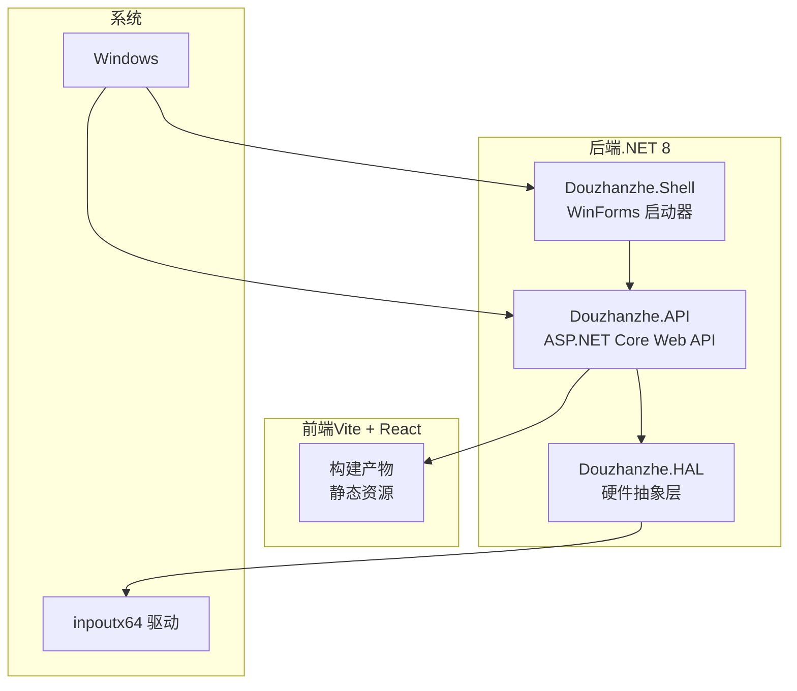
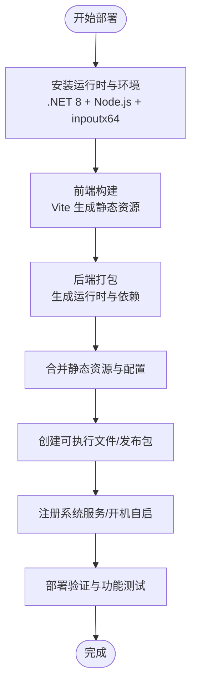
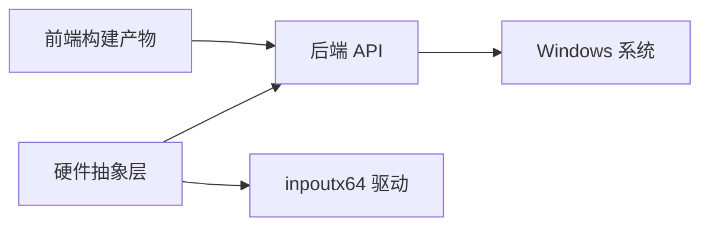

# 生产环境部署

<cite>
**本文引用的文件**
- [Douzhanzhe.API.csproj](file://server/api/Douzhanzhe.API.csproj)
- [Douzhanzhe.API.runtimeconfig.json](file://server/api/Douzhanzhe.API.runtimeconfig.json)
- [Douzhanzhe.API.http](file://server/api/Douzhanzhe.API.http)
- [Program.cs](file://server/api/Program.cs)
- [appsettings.json](file://server/api/appsettings.json)
- [appsettings.Development.json](file://server/api/appsettings.Development.json)
- [vite.config.js](file://vite.config.js)
- [package.json](file://package.json)
- [Douzhanzhe.HAL.csproj](file://server/hal/Douzhanzhe.HAL.csproj)
- [DriverBridge.cs](file://server/hal/DriverBridge.cs)
- [CpuAffinityManager.cs](file://server/hal/CpuAffinityManager.cs)
- [GpuController.cs](file://server/hal/GpuController.cs)
- [SmuController.cs](file://server/hal/SmuController.cs)
- [HardwareAbstractionLayer.cs](file://server/hal/HardwareAbstractionLayer.cs)
- [reload-fe.ps1](file://server/tools/reload-fe.ps1)
- [dashboard-default.json](file://server/config/dashboard-default.json)
- [custom-params.json](file://server/api/config/custom-params.json)
- [ui-state.json](file://server/api/config/ui-state.json)
- [run.ps1](file://server/api/run.ps1)
- [_run_admin.bat](file://server/api/_run_admin.bat)
- [Douzhanzhe.Shell.csproj](file://server/shell/Douzhanzhe.Shell/Douzhanzhe.Shell.csproj)
- [Form1.cs](file://server/shell/Douzhanzhe.Shell/Form1.cs)
- [Program.cs](file://server/shell/Douzhanzhe.Shell/Program.cs)
</cite>

## 目录
1. [简介](#简介)
2. [项目结构](#项目结构)
3. [核心组件](#核心组件)
4. [架构总览](#架构总览)
5. [详细组件分析](#详细组件分析)
6. [依赖关系分析](#依赖关系分析)
7. [性能考虑](#性能考虑)
8. [故障排除指南](#故障排除指南)
9. [结论](#结论)
10. [附录](#附录)

## 简介
本文件面向在 Windows 平台上部署 DOUZHANZHE-Control 的运维与开发人员，提供从环境准备到应用发布、配置与服务化的一体化生产部署指南。内容涵盖：
- 运行时与环境要求：.NET 8 运行时、Node.js、inpoutx64 驱动
- 应用打包与发布：前后端编译、静态资源生成、可执行文件创建
- 生产环境配置：日志级别、主机白名单、安全配置
- 系统服务注册与开机自启动
- 部署验证与基础功能测试

## 项目结构
项目采用“后端（.NET 8）+ 前端（Vite + React）+ 硬件抽象层（HAL）”的分层架构。后端通过 ASP.NET Core 提供 API 与静态资源托管；前端通过 Vite 构建静态资源；HAL 负责 CPU/GPU/SMU 等硬件控制与驱动交互。

图表来源
- [Douzhanzhe.API.csproj](file://server/api/Douzhanzhe.API.csproj)
- [Douzhanzhe.HAL.csproj](file://server/hal/Douzhanzhe.HAL.csproj)
- [Douzhanzhe.Shell.csproj](file://server/shell/Douzhanzhe.Shell/Douzhanzhe.Shell.csproj)
- [vite.config.js](file://vite.config.js)

章节来源
- [Douzhanzhe.API.csproj](file://server/api/Douzhanzhe.API.csproj)
- [Douzhanzhe.HAL.csproj](file://server/hal/Douzhanzhe.HAL.csproj)
- [Douzhanzhe.Shell.csproj](file://server/shell/Douzhanzhe.Shell/Douzhanzhe.Shell.csproj)
- [vite.config.js](file://vite.config.js)

## 核心组件
- 后端 API（Douzhanzhe.API）
  - 使用 ASP.NET Core 承载，支持静态资源发布与 HTTP 接口
  - 包含运行时配置与依赖清单，便于独立部署
- 硬件抽象层（Douzhanzhe.HAL）
  - 提供 CPU、GPU、SMU 控制能力，桥接底层驱动
- WinForms 启动器（Douzhanzhe.Shell）
  - 提供托盘/窗口入口，便于用户交互与后台运行
- 前端（Vite + React）
  - 通过 Vite 构建静态资源，由后端统一托管

章节来源
- [Douzhanzhe.API.csproj](file://server/api/Douzhanzhe.API.csproj)
- [Douzhanzhe.HAL.csproj](file://server/hal/Douzhanzhe.HAL.csproj)
- [Douzhanzhe.Shell.csproj](file://server/shell/Douzhanzhe.Shell/Douzhanzhe.Shell.csproj)
- [vite.config.js](file://vite.config.js)

## 架构总览
下图展示生产部署的关键路径：环境准备 → 前后端构建 → 配置与资源整合 → 可执行文件与服务注册 → 验证与测试。

图表来源
- [Douzhanzhe.API.runtimeconfig.json](file://server/api/Douzhanzhe.API.runtimeconfig.json)
- [Douzhanzhe.API.http](file://server/api/Douzhanzhe.API.http)
- [vite.config.js](file://vite.config.js)
- [package.json](file://package.json)

## 详细组件分析

### 后端 API（Douzhanzhe.API）部署要点
- 运行时与依赖
  - 运行时配置文件用于指定 .NET 运行时版本与附加库加载策略
  - 依赖清单确保运行时正确解析第三方库
- 静态资源托管
  - 通过 ASP.NET Core 静态文件中间件托管前端构建产物
  - 静态资源运行时元数据用于发布时的资源定位
- HTTP 接口
  - API 定义文件用于接口文档与调用
- 启动脚本
  - PowerShell 启动脚本与管理员批处理脚本用于权限与调试场景

章节来源
- [Douzhanzhe.API.runtimeconfig.json](file://server/api/Douzhanzhe.API.runtimeconfig.json)
- [Douzhanzhe.API.http](file://server/api/Douzhanzhe.API.http)
- [Douzhanzhe.API.staticwebassets.runtime.json](file://server/api/Douzhanzhe.API.staticwebassets.runtime.json)
- [run.ps1](file://server/api/run.ps1)
- [_run_admin.bat](file://server/api/_run_admin.bat)

### 硬件抽象层（Douzhanzhe.HAL）部署要点
- 驱动桥接
  - DriverBridge 负责与底层驱动通信，需确保驱动已正确安装
- 硬件控制器
  - CPU/GPU/SMU 控制器通过 HAL 暴露统一接口，供后端调用
- 性能与亲和性
  - CPU 亲和性管理器用于优化线程调度与性能

章节来源
- [DriverBridge.cs](file://server/hal/DriverBridge.cs)
- [CpuAffinityManager.cs](file://server/hal/CpuAffinityManager.cs)
- [GpuController.cs](file://server/hal/GpuController.cs)
- [SmuController.cs](file://server/hal/SmuController.cs)
- [HardwareAbstractionLayer.cs](file://server/hal/HardwareAbstractionLayer.cs)

### WinForms 启动器（Douzhanzhe.Shell）部署要点
- 启动器职责
  - 提供图形界面入口，承载托盘图标与最小化到托盘行为
- 与后端协作
  - 通过本地 HTTP 接口与后端通信，实现状态同步与控制下发

章节来源
- [Douzhanzhe.Shell.csproj](file://server/shell/Douzhanzhe.Shell/Douzhanzhe.Shell.csproj)
- [Form1.cs](file://server/shell/Douzhanzhe.Shell/Form1.cs)
- [Program.cs](file://server/shell/Douzhanzhe.Shell/Program.cs)

### 前端（Vite + React）构建与发布
- 构建配置
  - Vite 配置定义输出目录与资源路径策略
- 依赖与脚本
  - package.json 中包含构建脚本与依赖项，确保构建一致性
- 发布策略
  - 将构建产物复制到后端静态资源目录，由后端统一托管

章节来源
- [vite.config.js](file://vite.config.js)
- [package.json](file://package.json)

## 依赖关系分析
后端、前端与 HAL 的依赖关系如下：

图表来源
- [Douzhanzhe.API.csproj](file://server/api/Douzhanzhe.API.csproj)
- [Douzhanzhe.HAL.csproj](file://server/hal/Douzhanzhe.HAL.csproj)
- [vite.config.js](file://vite.config.js)

章节来源
- [Douzhanzhe.API.csproj](file://server/api/Douzhanzhe.API.csproj)
- [Douzhanzhe.HAL.csproj](file://server/hal/Douzhanzhe.HAL.csproj)
- [vite.config.js](file://vite.config.js)

## 性能考虑
- 静态资源缓存与压缩
  - 建议在生产环境中启用静态资源缓存与压缩，减少带宽占用
- 线程与亲和性
  - 合理设置 CPU 亲和性，避免与高优先级任务抢占
- 日志级别
  - 生产环境建议降低日志级别，避免频繁写入影响性能

## 故障排除指南
- 启动失败
  - 检查 .NET 8 运行时是否正确安装
  - 确认管理员权限运行（如需要）
- 驱动问题
  - 确认 inpoutx64 驱动已正确安装且无冲突
- 前端资源无法加载
  - 确认构建产物已复制至后端静态资源目录
- 端口占用
  - 修改后端监听端口或释放占用端口

章节来源
- [run.ps1](file://server/api/run.ps1)
- [_run_admin.bat](file://server/api/_run_admin.bat)
- [DriverBridge.cs](file://server/hal/DriverBridge.cs)

## 结论
通过遵循本部署文档，可在 Windows 平台完成 DOUZHANZHE-Control 的生产环境部署。关键在于正确安装运行时与驱动、完成前后端构建与资源整合、合理配置生产参数，并完成系统服务注册与验证测试。

## 附录

### 环境准备与安装
- .NET 8 运行时
  - 在目标 Windows 主机上安装 .NET 8 运行时，确保后端可独立运行
- Node.js
  - 安装 Node.js 以支持前端构建与开发工具链
- inpoutx64 驱动
  - 安装并正确加载 inpoutx64 驱动，确保 HAL 能与底层硬件通信

### 前后端构建与发布
- 前端构建
  - 使用构建脚本生成静态资源，输出目录遵循 Vite 配置
- 后端打包
  - 生成运行时与依赖清单，确保可独立部署
- 资源整合
  - 将前端构建产物复制到后端静态资源目录，确保访问路径一致

章节来源
- [vite.config.js](file://vite.config.js)
- [package.json](file://package.json)
- [Douzhanzhe.API.runtimeconfig.json](file://server/api/Douzhanzhe.API.runtimeconfig.json)

### 生产环境配置
- 日志级别
  - 在生产环境中调整日志级别，避免过量日志写入
- 主机白名单与安全
  - 限制允许访问的主机与来源，启用必要的安全头
- 配置文件位置
  - appsettings.json 用于生产配置，appsettings.Development.json 仅用于开发

章节来源
- [appsettings.json](file://server/api/appsettings.json)
- [appsettings.Development.json](file://server/api/appsettings.Development.json)

### 系统服务注册与开机自启动
- 注册系统服务
  - 使用 Windows 服务管理器或命令行工具将后端 API 注册为服务
- 开机自启动
  - 配置启动器（Shell）在登录时自动运行，确保后端服务可用

章节来源
- [Douzhanzhe.Shell.csproj](file://server/shell/Douzhanzhe.Shell/Douzhanzhe.Shell.csproj)
- [Form1.cs](file://server/shell/Douzhanzhe.Shell/Form1.cs)
- [Program.cs](file://server/shell/Douzhanzhe.Shell/Program.cs)

### 部署验证与功能测试
- 功能验证
  - 访问后端接口，确认静态资源可正常加载
  - 通过启动器检查托盘图标与窗口状态
- 性能验证
  - 观察日志级别与资源占用，确保运行稳定
- 回归测试
  - 执行基础控制与监控功能，确保 HAL 与驱动交互正常

章节来源
- [reload-fe.ps1](file://server/tools/reload-fe.ps1)
- [dashboard-default.json](file://server/config/dashboard-default.json)
- [custom-params.json](file://server/api/config/custom-params.json)
- [ui-state.json](file://server/api/config/ui-state.json)