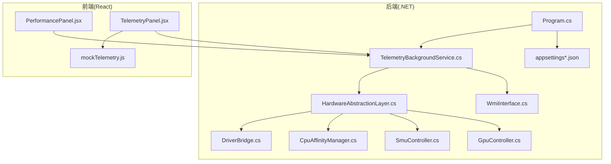
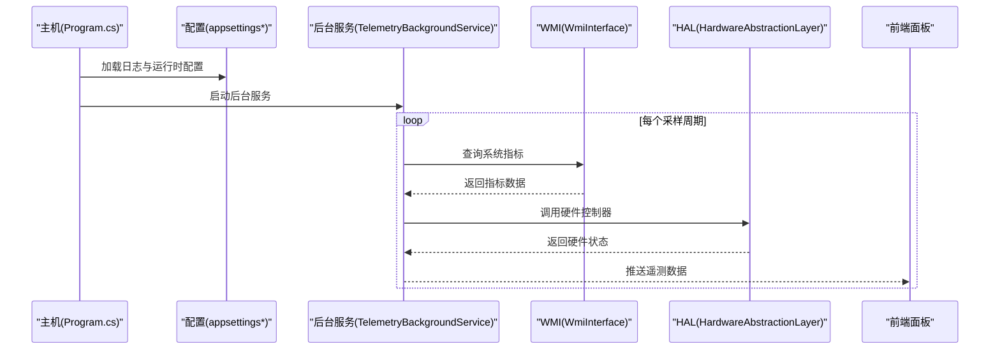
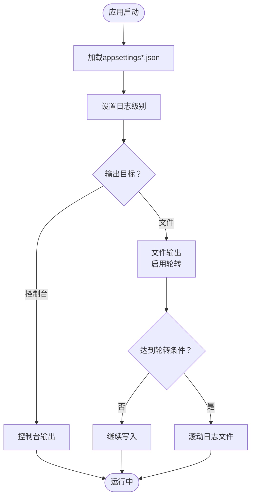
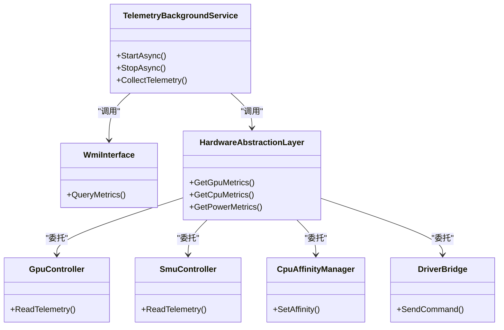
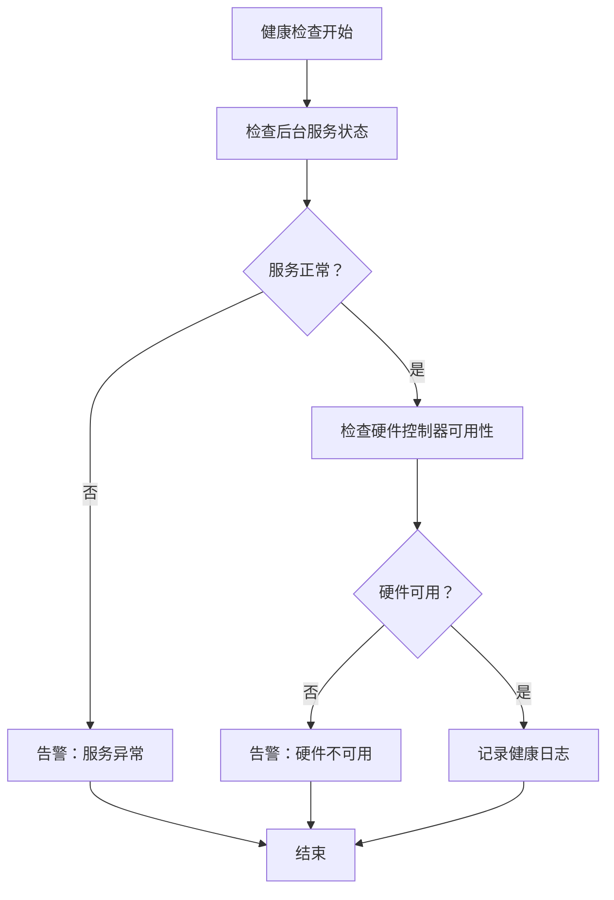
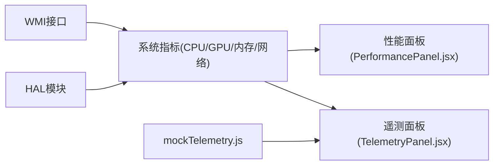
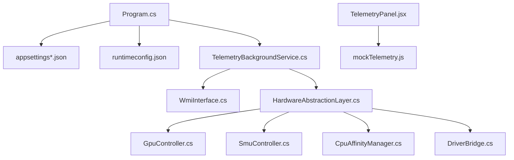

# 监控与日志

<cite>
**本文引用的文件**
- [appsettings.json](file://server/api/appsettings.json)
- [appsettings.Development.json](file://server/api/appsettings.Development.json)
- [Douzhanzhe.API.csproj](file://server/api/Douzhanzhe.API.csproj)
- [Program.cs](file://server/api/Program.cs)
- [TelemetryBackgroundService.cs](file://server/api/TelemetryBackgroundService.cs)
- [WmiInterface.cs](file://server/api/WmiInterface.cs)
- [HardwareAbstractionLayer.cs](file://server/hal/HardwareAbstractionLayer.cs)
- [GpuController.cs](file://server/hal/GpuController.cs)
- [SmuController.cs](file://server/hal/SmuController.cs)
- [CpuAffinityManager.cs](file://server/hal/CpuAffinityManager.cs)
- [DriverBridge.cs](file://server/hal/DriverBridge.cs)
- [PerformancePanel.jsx](file://src/components/panels/PerformancePanel.jsx)
- [TelemetryPanel.jsx](file://src/components/panels/TelemetryPanel.jsx)
- [mockTelemetry.js](file://src/data/mockTelemetry.js)
</cite>

## 目录
1. [简介](#简介)
2. [项目结构](#项目结构)
3. [核心组件](#核心组件)
4. [架构总览](#架构总览)
5. [详细组件分析](#详细组件分析)
6. [依赖关系分析](#依赖关系分析)
7. [性能考量](#性能考量)
8. [故障排查指南](#故障排查指南)
9. [结论](#结论)
10. [附录](#附录)

## 简介
本文件面向DOUZHANZHE-Control项目的监控与日志管理，围绕以下目标展开：系统日志配置（.NET日志级别、日志文件位置与轮转）、遥测数据采集与存储（实时指标、历史记录与清理策略）、系统健康检查（服务状态、硬件连接、异常告警）、性能指标监控（CPU/GPU、内存、网络）以及日志分析工具与常见问题排查方法。文档以仓库现有实现为依据，结合前端可视化与后端遥测服务进行说明。

## 项目结构
项目采用前后端分离架构，后端基于.NET 8构建，前端使用React/Vite。监控与日志相关的关键位置如下：
- 后端配置与入口：appsettings.json、appsettings.Development.json、Program.cs、Douzhanzhe.API.csproj
- 遥测与后台服务：TelemetryBackgroundService.cs、WmiInterface.cs
- 硬件抽象层：HardwareAbstractionLayer.cs、GpuController.cs、SmuController.cs、CpuAffinityManager.cs、DriverBridge.cs
- 前端监控面板：PerformancePanel.jsx、TelemetryPanel.jsx；mock数据：mockTelemetry.js

**图表来源**
- [Program.cs](file://server/api/Program.cs)
- [appsettings.json](file://server/api/appsettings.json)
- [TelemetryBackgroundService.cs](file://server/api/TelemetryBackgroundService.cs)
- [WmiInterface.cs](file://server/api/WmiInterface.cs)
- [HardwareAbstractionLayer.cs](file://server/hal/HardwareAbstractionLayer.cs)
- [GpuController.cs](file://server/hal/GpuController.cs)
- [SmuController.cs](file://server/hal/SmuController.cs)
- [CpuAffinityManager.cs](file://server/hal/CpuAffinityManager.cs)
- [DriverBridge.cs](file://server/hal/DriverBridge.cs)
- [PerformancePanel.jsx](file://src/components/panels/PerformancePanel.jsx)
- [TelemetryPanel.jsx](file://src/components/panels/TelemetryPanel.jsx)
- [mockTelemetry.js](file://src/data/mockTelemetry.js)

**章节来源**
- [Program.cs](file://server/api/Program.cs)
- [appsettings.json](file://server/api/appsettings.json)
- [appsettings.Development.json](file://server/api/appsettings.Development.json)
- [Douzhanzhe.API.csproj](file://server/api/Douzhanzhe.API.csproj)

## 核心组件
- 日志配置与运行时：通过appsettings.json与appsettings.Development.json定义日志级别、输出目标与轮转策略；Program.cs负责初始化主机与服务；.csproj声明运行时配置。
- 遥测后台服务：TelemetryBackgroundService.cs周期性采集遥测数据，WmiInterface.cs封装WMI查询接口，HAL模块提供GPU、SMU、CPU、驱动桥接等硬件控制与监控能力。
- 前端监控面板：PerformancePanel.jsx与TelemetryPanel.jsx展示实时与历史遥测数据，mockTelemetry.js提供示例数据以便开发调试。

**章节来源**
- [appsettings.json](file://server/api/appsettings.json)
- [appsettings.Development.json](file://server/api/appsettings.Development.json)
- [Program.cs](file://server/api/Program.cs)
- [Douzhanzhe.API.csproj](file://server/api/Douzhanzhe.API.csproj)
- [TelemetryBackgroundService.cs](file://server/api/TelemetryBackgroundService.cs)
- [WmiInterface.cs](file://server/api/WmiInterface.cs)
- [HardwareAbstractionLayer.cs](file://server/hal/HardwareAbstractionLayer.cs)
- [PerformancePanel.jsx](file://src/components/panels/PerformancePanel.jsx)
- [TelemetryPanel.jsx](file://src/components/panels/TelemetryPanel.jsx)
- [mockTelemetry.js](file://src/data/mockTelemetry.js)

## 架构总览
后端以Program.cs为入口，加载配置并启动Web主机；TelemetryBackgroundService.cs作为后台任务持续采集遥测；WMI接口用于系统信息获取；HAL模块封装硬件控制器；前端通过面板组件消费遥测数据。

**图表来源**
- [Program.cs](file://server/api/Program.cs)
- [appsettings.json](file://server/api/appsettings.json)
- [TelemetryBackgroundService.cs](file://server/api/TelemetryBackgroundService.cs)
- [WmiInterface.cs](file://server/api/WmiInterface.cs)
- [HardwareAbstractionLayer.cs](file://server/hal/HardwareAbstractionLayer.cs)
- [PerformancePanel.jsx](file://src/components/panels/PerformancePanel.jsx)
- [TelemetryPanel.jsx](file://src/components/panels/TelemetryPanel.jsx)

## 详细组件分析

### 日志配置与轮转
- 日志级别与输出：通过appsettings.json与appsettings.Development.json定义日志最小级别、输出目标（控制台、文件）及格式化选项。
- 文件位置：通常位于运行目录下的logs或由配置指定的自定义路径。
- 轮转策略：通过配置启用按大小或时间的滚动，避免单文件过大；生产环境建议开启轮转并限制保留数量与最大文件大小。
- 运行时配置：Douzhanzhe.API.runtimeconfig.json与.csproj中的运行时节点影响.NET运行时行为，间接影响日志输出与性能。

**图表来源**
- [appsettings.json](file://server/api/appsettings.json)
- [appsettings.Development.json](file://server/api/appsettings.Development.json)
- [Douzhanzhe.API.csproj](file://server/api/Douzhanzhe.API.csproj)

**章节来源**
- [appsettings.json](file://server/api/appsettings.json)
- [appsettings.Development.json](file://server/api/appsettings.Development.json)
- [Douzhanzhe.API.csproj](file://server/api/Douzhanzhe.API.csproj)

### 遥测数据采集与存储
- 采集周期：TelemetryBackgroundService.cs以固定间隔执行采集逻辑。
- 数据源：WmiInterface.cs通过WMI查询系统级指标；HAL模块提供GPU、SMU、CPU、驱动桥接等硬件层面的数据。
- 存储与推送：采集到的数据在服务内部处理后推送到前端面板组件；mockTelemetry.js提供示例数据便于开发与测试。
- 历史记录与清理：当前实现未见显式历史数据库或持久化存储；如需历史记录，可在服务中引入本地文件或数据库，并制定定期清理策略（例如按天/周/月归档并删除过期数据）。

**图表来源**
- [TelemetryBackgroundService.cs](file://server/api/TelemetryBackgroundService.cs)
- [WmiInterface.cs](file://server/api/WmiInterface.cs)
- [HardwareAbstractionLayer.cs](file://server/hal/HardwareAbstractionLayer.cs)
- [GpuController.cs](file://server/hal/GpuController.cs)
- [SmuController.cs](file://server/hal/SmuController.cs)
- [CpuAffinityManager.cs](file://server/hal/CpuAffinityManager.cs)
- [DriverBridge.cs](file://server/hal/DriverBridge.cs)

**章节来源**
- [TelemetryBackgroundService.cs](file://server/api/TelemetryBackgroundService.cs)
- [WmiInterface.cs](file://server/api/WmiInterface.cs)
- [HardwareAbstractionLayer.cs](file://server/hal/HardwareAbstractionLayer.cs)
- [GpuController.cs](file://server/hal/GpuController.cs)
- [SmuController.cs](file://server/hal/SmuController.cs)
- [CpuAffinityManager.cs](file://server/hal/CpuAffinityManager.cs)
- [DriverBridge.cs](file://server/hal/DriverBridge.cs)
- [mockTelemetry.js](file://src/data/mockTelemetry.js)

### 健康检查与异常告警
- 服务状态监控：通过后台服务的启动/停止生命周期与异常捕获实现基本健康检查；可扩展为HTTP端点返回健康状态。
- 硬件连接状态：HAL模块各控制器在访问底层驱动或设备失败时应抛出异常或返回错误码；前端面板可据此显示“离线/不可用”状态。
- 异常告警：建议在Program.cs或服务启动处注册全局异常处理器，将严重异常写入日志并触发告警通知（如邮件、IM或系统通知）。

**图表来源**
- [Program.cs](file://server/api/Program.cs)
- [TelemetryBackgroundService.cs](file://server/api/TelemetryBackgroundService.cs)
- [HardwareAbstractionLayer.cs](file://server/hal/HardwareAbstractionLayer.cs)

**章节来源**
- [Program.cs](file://server/api/Program.cs)
- [TelemetryBackgroundService.cs](file://server/api/TelemetryBackgroundService.cs)
- [HardwareAbstractionLayer.cs](file://server/hal/HardwareAbstractionLayer.cs)

### 性能指标监控
- CPU/GPU：通过WMI与HAL模块分别获取CPU利用率、频率、温度与GPU负载、温度、功耗等指标；前端PerformancePanel.jsx与TelemetryPanel.jsx负责展示。
- 内存：可从WMI查询物理内存与页面文件使用情况；若无现成接口，可在HAL中扩展。
- 网络：WMI可提供网卡统计信息；若无接口，可在HAL中扩展。
- 可视化：mockTelemetry.js提供示例数据，便于在无真实硬件时验证UI与交互。

**图表来源**
- [WmiInterface.cs](file://server/api/WmiInterface.cs)
- [HardwareAbstractionLayer.cs](file://server/hal/HardwareAbstractionLayer.cs)
- [PerformancePanel.jsx](file://src/components/panels/PerformancePanel.jsx)
- [TelemetryPanel.jsx](file://src/components/panels/TelemetryPanel.jsx)
- [mockTelemetry.js](file://src/data/mockTelemetry.js)

**章节来源**
- [WmiInterface.cs](file://server/api/WmiInterface.cs)
- [HardwareAbstractionLayer.cs](file://server/hal/HardwareAbstractionLayer.cs)
- [PerformancePanel.jsx](file://src/components/panels/PerformancePanel.jsx)
- [TelemetryPanel.jsx](file://src/components/panels/TelemetryPanel.jsx)
- [mockTelemetry.js](file://src/data/mockTelemetry.js)

## 依赖关系分析
- 后端依赖：Program.cs依赖appsettings*与运行时配置；TelemetryBackgroundService.cs依赖WMI与HAL；HAL依赖各控制器与驱动桥接。
- 前端依赖：面板组件依赖遥测数据源；mockTelemetry.js为开发时替代数据。

**图表来源**
- [Program.cs](file://server/api/Program.cs)
- [appsettings.json](file://server/api/appsettings.json)
- [appsettings.Development.json](file://server/api/appsettings.Development.json)
- [Douzhanzhe.API.csproj](file://server/api/Douzhanzhe.API.csproj)
- [TelemetryBackgroundService.cs](file://server/api/TelemetryBackgroundService.cs)
- [WmiInterface.cs](file://server/api/WmiInterface.cs)
- [HardwareAbstractionLayer.cs](file://server/hal/HardwareAbstractionLayer.cs)
- [GpuController.cs](file://server/hal/GpuController.cs)
- [SmuController.cs](file://server/hal/SmuController.cs)
- [CpuAffinityManager.cs](file://server/hal/CpuAffinityManager.cs)
- [DriverBridge.cs](file://server/hal/DriverBridge.cs)
- [TelemetryPanel.jsx](file://src/components/panels/TelemetryPanel.jsx)
- [mockTelemetry.js](file://src/data/mockTelemetry.js)

**章节来源**
- [Program.cs](file://server/api/Program.cs)
- [TelemetryBackgroundService.cs](file://server/api/TelemetryBackgroundService.cs)
- [HardwareAbstractionLayer.cs](file://server/hal/HardwareAbstractionLayer.cs)
- [TelemetryPanel.jsx](file://src/components/panels/TelemetryPanel.jsx)
- [mockTelemetry.js](file://src/data/mockTelemetry.js)

## 性能考量
- 采样频率：降低后台服务采样频率可减少CPU/GPU占用，但会降低实时性；建议根据硬件能力与用户需求折中。
- I/O开销：日志轮转与磁盘写入可能成为瓶颈；建议使用异步写入与合理的缓冲策略。
- WMI查询：频繁查询可能增加系统开销；建议缓存短期结果并在必要时去重。
- 前端渲染：大量历史数据可能导致UI卡顿；建议分页、虚拟化或降采样展示。

## 故障排查指南
- 日志无法生成或路径不正确
  - 检查appsettings*中的日志输出配置与文件路径；确认运行账户对目标目录有写权限。
  - 参考：[appsettings.json](file://server/api/appsettings.json)、[appsettings.Development.json](file://server/api/appsettings.Development.json)
- 遥测数据为空或异常
  - 检查TelemetryBackgroundService是否正常运行；验证WMI接口是否可用；查看HAL各控制器是否抛出异常。
  - 参考：[TelemetryBackgroundService.cs](file://server/api/TelemetryBackgroundService.cs)、[WmiInterface.cs](file://server/api/WmiInterface.cs)、[HardwareAbstractionLayer.cs](file://server/hal/HardwareAbstractionLayer.cs)
- 前端面板无数据显示
  - 确认遥测数据已推送至前端；检查mockTelemetry.js是否被替换为真实数据流。
  - 参考：[TelemetryPanel.jsx](file://src/components/panels/TelemetryPanel.jsx)、[mockTelemetry.js](file://src/data/mockTelemetry.js)
- 系统资源占用过高
  - 降低采样频率；优化WMI查询；检查日志轮转配置；评估前端渲染压力。
  - 参考：[Program.cs](file://server/api/Program.cs)、[PerformancePanel.jsx](file://src/components/panels/PerformancePanel.jsx)

**章节来源**
- [appsettings.json](file://server/api/appsettings.json)
- [appsettings.Development.json](file://server/api/appsettings.Development.json)
- [TelemetryBackgroundService.cs](file://server/api/TelemetryBackgroundService.cs)
- [WmiInterface.cs](file://server/api/WmiInterface.cs)
- [HardwareAbstractionLayer.cs](file://server/hal/HardwareAbstractionLayer.cs)
- [TelemetryPanel.jsx](file://src/components/panels/TelemetryPanel.jsx)
- [mockTelemetry.js](file://src/data/mockTelemetry.js)
- [PerformancePanel.jsx](file://src/components/panels/PerformancePanel.jsx)
- [Program.cs](file://server/api/Program.cs)

## 结论
本项目已具备基础的日志与遥测能力：日志配置通过.NET配置系统管理，遥测通过后台服务与WMI/HAL模块采集并推送至前端面板。为进一步完善监控体系，建议补充历史数据存储与清理策略、健康检查端点、异常告警机制以及更细粒度的性能优化与前端渲染优化。

## 附录
- 日志分析工具推荐
  - Windows：Event Viewer、PowerShell Get-EventLog、LogParser
  - 跨平台：ELK Stack（Elasticsearch/Filebeat/Logstash/Kibana）、Fluentd、Seq
  - 实时分析：Prometheus + Grafana（结合.NET指标导出）
- 常见问题
  - 权限不足导致日志写入失败
  - WMI服务未启动或被防火墙阻断
  - 前端数据源未正确切换至真实遥测流
  - 采样频率过高导致系统抖动