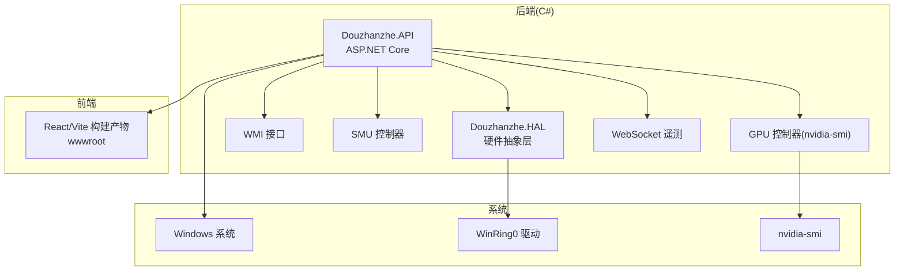
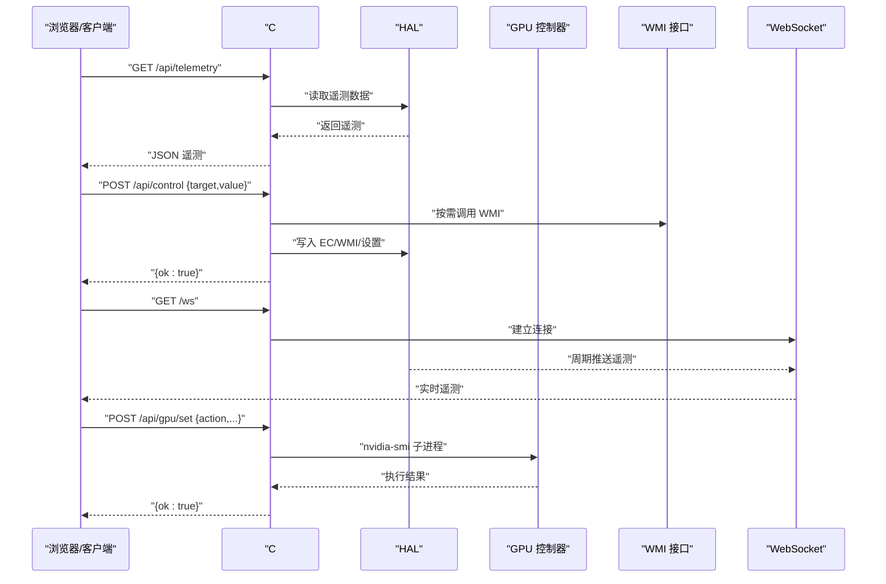
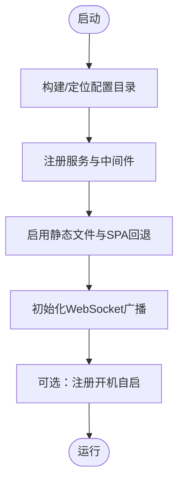
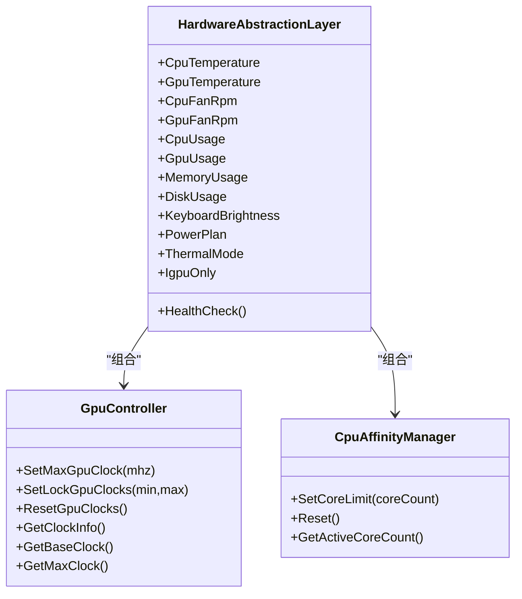
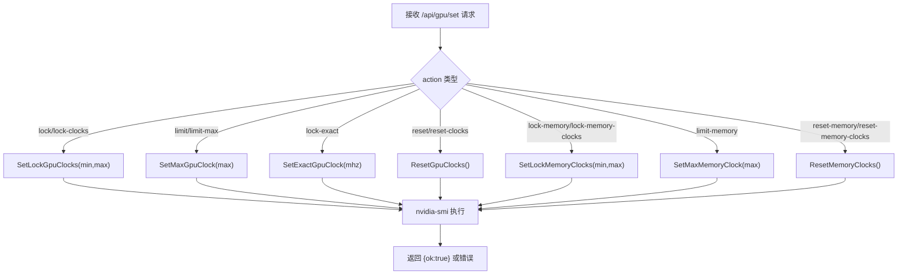
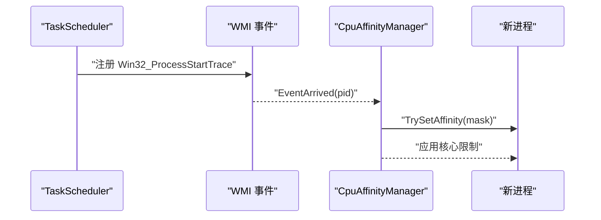
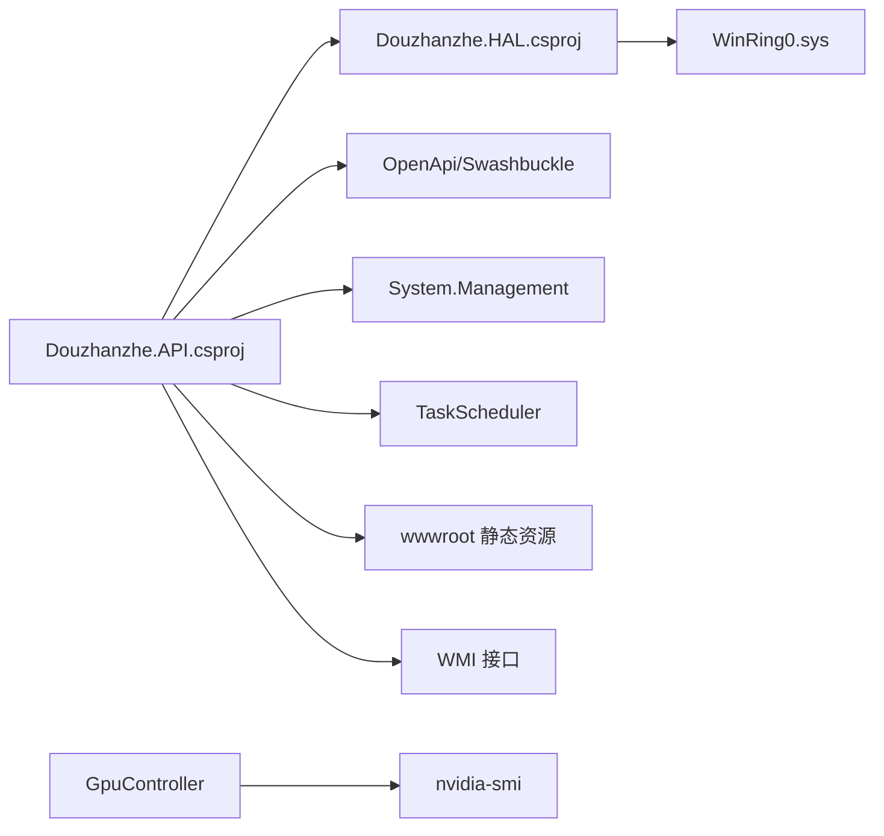

# 部署运维

<cite>
**本文引用的文件**
- [server/api/appsettings.json](file://server/api/appsettings.json)
- [server/api/appsettings.Development.json](file://server/api/appsettings.Development.json)
- [server/api/Douzhanzhe.API.csproj](file://server/api/Douzhanzhe.API.csproj)
- [server/api/Program.cs](file://server/api/Program.cs)
- [server/api/run.ps1](file://server/api/run.ps1)
- [server/tools/reload-fe.ps1](file://server/tools/reload-fe.ps1)
- [server/config/dashboard-default.json](file://server/config/dashboard-default.json)
- [server/api/config/custom-params.json](file://server/api/config/custom-params.json)
- [server/api/config/ui-state.json](file://server/api/config/ui-state.json)
- [server/package.json](file://server/package.json)
- [package.json](file://package.json)
- [server/hal/HardwareAbstractionLayer.cs](file://server/hal/HardwareAbstractionLayer.cs)
- [server/hal/GpuController.cs](file://server/hal/GpuController.cs)
- [server/hal/CpuAffinityManager.cs](file://server/hal/CpuAffinityManager.cs)
</cite>

## 目录
1. [简介](#简介)
2. [项目结构](#项目结构)
3. [核心组件](#核心组件)
4. [架构总览](#架构总览)
5. [详细组件分析](#详细组件分析)
6. [依赖关系分析](#依赖关系分析)
7. [性能考虑](#性能考虑)
8. [监控与日志](#监控与日志)
9. [故障排除指南](#故障排除指南)
10. [升级与回滚](#升级与回滚)
11. [安全加固与备份恢复](#安全加固与备份恢复)
12. [结论](#结论)

## 简介
本文件面向生产环境的 DOUZHANZHE-Control 部署与运维，覆盖依赖安装、配置持久化、权限与驱动加载、性能优化、监控与日志、故障排除、升级回滚以及安全加固与备份恢复等主题。内容基于仓库中的 C# 后端、HAL 层、前端构建脚本与配置文件进行整理与提炼。

## 项目结构
- 后端服务（C# ASP.NET Core）位于 server/api，负责提供 REST/WebSocket 接口、硬件抽象与遥测采集。
- HAL 层位于 server/hal，封装底层硬件访问、SMU/WMI/IO 等能力。
- 前端位于根目录 src，通过 Vite 构建产物输出至 server/api/wwwroot。
- 配置持久化位于 server/api/config 与 server/config，包含自定义参数、UI 状态与仪表盘默认布局。
- 运维脚本位于 server/api/run.ps1 与 server/tools/reload-fe.ps1，用于一键构建、复制驱动与前端资源，并启动服务。

**图表来源**
- [server/api/Program.cs:1-25](file://server/api/Program.cs#L1-L25)
- [server/hal/HardwareAbstractionLayer.cs:1-50](file://server/hal/HardwareAbstractionLayer.cs#L1-L50)
- [server/hal/GpuController.cs:1-30](file://server/hal/GpuController.cs#L1-L30)

**章节来源**
- [server/api/Douzhanzhe.API.csproj:1-40](file://server/api/Douzhanzhe.API.csproj#L1-L40)
- [server/api/Program.cs:1-25](file://server/api/Program.cs#L1-L25)
- [package.json:1-33](file://package.json#L1-L33)
- [server/package.json:1-16](file://server/package.json#L1-L16)

## 核心组件
- 硬件抽象层（HAL）
  - 提供温度、风扇转速、电源计划、键盘背光、散热模式、触摸板锁定、IGPU 模式切换等能力；封装 EC/WMI/SMU 访问。
- GPU 控制器
  - 通过 nvidia-smi 子进程实现锁频、上限限制、显存频率控制与状态查询。
- CPU 核心限制管理
  - 通过 WMI 事件监听新进程并设置 ProcessorAffinity，实现全局核心数限制。
- 后端 API
  - 提供遥测接口、系统信息、健康检查、控制接口、SMU/GPU/WMI 命令转发、WebSocket 遥测推送、配置持久化读写等。
- 前端构建与部署
  - Vite 构建后复制到 wwwroot，随 C# 服务提供静态页面与资源。

**章节来源**
- [server/hal/HardwareAbstractionLayer.cs:1-120](file://server/hal/HardwareAbstractionLayer.cs#L1-L120)
- [server/hal/GpuController.cs:1-116](file://server/hal/GpuController.cs#L1-L116)
- [server/hal/CpuAffinityManager.cs:1-101](file://server/hal/CpuAffinityManager.cs#L1-L101)
- [server/api/Program.cs:87-212](file://server/api/Program.cs#L87-L212)

## 架构总览
后端采用 ASP.NET Core Minimal API 风格，注册 HAL、SMU、GPU、WMI 等服务，启用 CORS、WebSocket、静态文件与 SPA 回退。前端通过 Vite 构建，产物放置于 wwwroot，由 C# 服务直接提供。

**图表来源**
- [server/api/Program.cs:56-120](file://server/api/Program.cs#L56-L120)
- [server/hal/HardwareAbstractionLayer.cs:142-190](file://server/hal/HardwareAbstractionLayer.cs#L142-L190)
- [server/hal/GpuController.cs:39-86](file://server/hal/GpuController.cs#L39-L86)

## 详细组件分析

### 后端服务与启动流程
- 服务注册
  - 注册 HAL、SMU、GPU、WMI、后台遥测服务与 CORS。
- 静态文件与 SPA 回退
  - 使用静态文件中间件与回退到 index.html，支持前端路由。
- 配置目录与持久化
  - 统一在 ../config 或 BaseDirectory/../.. 的 config 目录读写 JSON 文件，避免跨语言差异。
- WebSocket 遥测
  - /ws 接收客户端连接，后台服务向所有连接广播遥测。
- 自动启动（Windows 任务计划程序）
  - 通过 TaskScheduler 注册开机自启，支持最小化启动偏好。

**图表来源**
- [server/api/Program.cs:9-22](file://server/api/Program.cs#L9-L22)
- [server/api/Program.cs:28-55](file://server/api/Program.cs#L28-L55)
- [server/api/Program.cs:686-686](file://server/api/Program.cs#L686-L686)

**章节来源**
- [server/api/Program.cs:9-22](file://server/api/Program.cs#L9-L22)
- [server/api/Program.cs:28-55](file://server/api/Program.cs#L28-L55)
- [server/api/Program.cs:620-686](file://server/api/Program.cs#L620-L686)

### 硬件抽象层（HAL）
- 能力概览
  - 遥测：CPU/GPU 占用、温度、频率、显存、内存、磁盘、风扇转速。
  - 系统开关：电源计划、散热模式、Fn/Num/Caps 锁定、触摸板锁定、IGPU 模式。
  - 硬件控制：键盘背光、SMU/WMI/IO 访问。
- 数据缓存与降采样
  - 对频繁查询的遥测项设置缓存窗口，降低 WMI/nvidia-smi 调用频率。
- 健康检查
  - 通过读取 CPU 温度范围判断 EC/WMI/驱动是否正常。

**图表来源**
- [server/hal/HardwareAbstractionLayer.cs:142-190](file://server/hal/HardwareAbstractionLayer.cs#L142-L190)
- [server/hal/GpuController.cs:42-107](file://server/hal/GpuController.cs#L42-L107)
- [server/hal/CpuAffinityManager.cs:25-65](file://server/hal/CpuAffinityManager.cs#L25-L65)

**章节来源**
- [server/hal/HardwareAbstractionLayer.cs:574-760](file://server/hal/HardwareAbstractionLayer.cs#L574-L760)
- [server/hal/GpuController.cs:77-107](file://server/hal/GpuController.cs#L77-L107)
- [server/hal/CpuAffinityManager.cs:25-65](file://server/hal/CpuAffinityManager.cs#L25-L65)

### GPU 控制（nvidia-smi 子进程）
- 支持动作
  - 锁定核心/显存频率、上限限制、精确锁定、重置、查询状态。
- 超时与错误处理
  - 子进程等待超时抛出异常，非零退出码抛出异常，便于上层统一处理。
- 基线与最大频率
  - 通过查询 supported-clocks 与 max.graphics 获取基准与上限。

**图表来源**
- [server/api/Program.cs:396-447](file://server/api/Program.cs#L396-L447)
- [server/hal/GpuController.cs:42-75](file://server/hal/GpuController.cs#L42-L75)

**章节来源**
- [server/api/Program.cs:396-447](file://server/api/Program.cs#L396-L447)
- [server/hal/GpuController.cs:14-86](file://server/hal/GpuController.cs#L14-L86)

### CPU 核心限制（WMI 监听）
- 通过 Win32_ProcessStartTrace 监听新进程，对每个进程设置 ProcessorAffinity 掩码。
- 支持重置，停止 WMI 监听并释放资源。

**图表来源**
- [server/hal/CpuAffinityManager.cs:47-78](file://server/hal/CpuAffinityManager.cs#L47-L78)

**章节来源**
- [server/hal/CpuAffinityManager.cs:25-84](file://server/hal/CpuAffinityManager.cs#L25-L84)

### 配置持久化与 UI 状态
- 自定义参数（custom-params.json）
  - 包含 CPU/GPU 功率、温度、频率、核心数、风扇目标等默认值。
- UI 状态（ui-state.json）
  - 记录卡片顺序与隐藏项，支持用户自定义布局。
- 仪表盘默认（dashboard-default.json）
  - 默认卡片顺序与隐藏集合。

**章节来源**
- [server/api/config/custom-params.json:1-22](file://server/api/config/custom-params.json#L1-L22)
- [server/api/config/ui-state.json:1-17](file://server/api/config/ui-state.json#L1-L17)
- [server/config/dashboard-default.json:1-7](file://server/config/dashboard-default.json#L1-L7)

## 依赖关系分析
- 后端依赖
  - Microsoft.AspNetCore.OpenApi/Swashbuckle.AspNetCore、System.Management、TaskScheduler。
  - 与 HAL、WMI、SMU、GPU 控制器耦合。
- 前端依赖
  - React、TailwindCSS、Vite 等，构建后产物复制到 wwwroot。
- 系统依赖
  - WinRing0 驱动（WinRing0x64.sys）、nvidia-smi、Windows 任务计划程序。

**图表来源**
- [server/api/Douzhanzhe.API.csproj:12-33](file://server/api/Douzhanzhe.API.csproj#L12-L33)
- [server/hal/HardwareAbstractionLayer.cs:1-20](file://server/hal/HardwareAbstractionLayer.cs#L1-L20)
- [server/hal/GpuController.cs:1-10](file://server/hal/GpuController.cs#L1-L10)

**章节来源**
- [server/api/Douzhanzhe.API.csproj:12-33](file://server/api/Douzhanzhe.API.csproj#L12-L33)
- [server/package.json:10-14](file://server/package.json#L10-L14)

## 性能考虑
- 遥测降采样
  - HAL 对 CPU/GPU/内存/磁盘等遥测设置缓存窗口，减少频繁调用外部工具（如 nvidia-smi、WMI）带来的开销。
- 子进程超时
  - GPU 控制器对 nvidia-smi 设置固定超时，避免阻塞主线程。
- WebSocket 广播
  - 后台服务按需推送，避免无谓的全量刷新。
- CPU 核心限制
  - 通过 WMI 监听自动应用核心限制，避免手动干预导致的资源争用。

**章节来源**
- [server/hal/HardwareAbstractionLayer.cs:617-648](file://server/hal/HardwareAbstractionLayer.cs#L617-L648)
- [server/hal/GpuController.cs:12-40](file://server/hal/GpuController.cs#L12-L40)
- [server/hal/CpuAffinityManager.cs:67-78](file://server/hal/CpuAffinityManager.cs#L67-L78)

## 监控与日志
- 日志级别
  - 默认日志级别为 Information，Microsoft.AspNetCore 输出警告级别。
- 遥测接口
  - /api/telemetry 返回 CPU/GPU/内存/磁盘/风扇/键盘背光等实时数据，可用于仪表盘展示。
- 健康检查
  - /api/health 返回硬件健康状态与时间戳，便于心跳检测。
- WebSocket 遥测
  - /ws 提供实时推送，适合前端图表与告警联动。
- 配置持久化
  - /api/custom-params 与 /api/ui-state 支持读写，便于运维侧集中管理默认策略与界面布局。

**章节来源**
- [server/api/appsettings.json:2-7](file://server/api/appsettings.json#L2-L7)
- [server/api/appsettings.Development.json:2-7](file://server/api/appsettings.Development.json#L2-L7)
- [server/api/Program.cs:87-143](file://server/api/Program.cs#L87-L143)
- [server/api/Program.cs:538-568](file://server/api/Program.cs#L538-L568)

## 故障排除指南
- WinRing0 驱动未加载
  - 现象：SMU 控制不可用。
  - 处理：确认 WinRing0x64.sys 存在，后端启动时尝试创建/启动服务；若失败，检查杀软拦截与管理员权限。
- nvidia-smi 不可用
  - 现象：GPU 遥测或控制失败。
  - 处理：确认 NVIDIA 驱动安装与 nvidia-smi 可执行；检查超时与退出码。
- 权限不足
  - 现象：无法写入 EC/WMI、无法设置进程亲和性。
  - 处理：以管理员身份运行；检查 TaskScheduler 权限与 UAC 设置。
- 端口冲突
  - 现象：启动失败或端口被占用。
  - 处理：run.ps1 会尝试终止占用 3100 的进程；也可手动释放端口。
- 前端热更新无效
  - 现象：修改前端后浏览器未刷新。
  - 处理：使用 reload-fe.ps1；确保服务已在运行且检测到 3100 端口。

**章节来源**
- [server/api/run.ps1:32-43](file://server/api/run.ps1#L32-L43)
- [server/api/run.ps1:6-11](file://server/api/run.ps1#L6-L11)
- [server/hal/GpuController.cs:28-40](file://server/hal/GpuController.cs#L28-L40)
- [server/tools/reload-fe.ps1:24-31](file://server/tools/reload-fe.ps1#L24-L31)

## 升级与回滚
- 升级流程
  - 使用 run.ps1 一键构建：清理旧运行目录、复制 WinRing0/ryzenadj 等工具、构建前端并复制到 wwwroot、启动 C# API。
  - 若存在自定义参数与 UI 状态，保持在 config 目录，升级后仍可保留。
- 回滚流程
  - 停止服务，回滚到上一个 bin/build 或备份的运行目录，重新执行 run.ps1 启动。
- 数据迁移与兼容性
  - custom-params.json 与 ui-state.json 为用户侧配置，升级时注意新增字段的默认值与兼容性；必要时在升级脚本中添加迁移逻辑。
- 自动启动
  - 升级后 TaskScheduler 任务仍有效，如需调整启动参数可在 /api/auto-start 更新。

**章节来源**
- [server/api/run.ps1:13-20](file://server/api/run.ps1#L13-L20)
- [server/api/run.ps1:62-66](file://server/api/run.ps1#L62-L66)
- [server/api/Program.cs:620-686](file://server/api/Program.cs#L620-L686)

## 安全加固与备份恢复
- 安全加固
  - 以管理员权限运行，避免驱动加载与硬件控制失败；限制对外暴露端口，仅在内网或本地监听。
  - CORS 已启用，默认允许任意来源，生产环境建议收紧为受信域名。
- 备份策略
  - 定期备份 config 目录（custom-params.json、ui-state.json、dashboard-default.json），以及运行目录下的 wwwroot 与 DLL。
- 灾难恢复
  - 准备可快速恢复的运行目录镜像；确保 WinRing0.sys 与 nvidia-smi 可用；验证 TaskScheduler 自启动任务。

**章节来源**
- [server/api/Program.cs:15-18](file://server/api/Program.cs#L15-L18)
- [server/api/config/custom-params.json:1-22](file://server/api/config/custom-params.json#L1-L22)
- [server/api/config/ui-state.json:1-17](file://server/api/config/ui-state.json#L1-L17)

## 结论
本文档基于仓库现有代码与脚本，给出了 DOUZHANZHE-Control 生产部署与运维的完整实践指南。通过 run.ps1 与 reload-fe.ps1 实现一键构建与热更新，结合 HAL 与控制器模块化设计，满足硬件控制、遥测与前端交互需求。建议在生产环境中进一步收紧 CORS、完善日志与告警、定期备份配置与运行目录，并制定标准化的升级回滚流程。