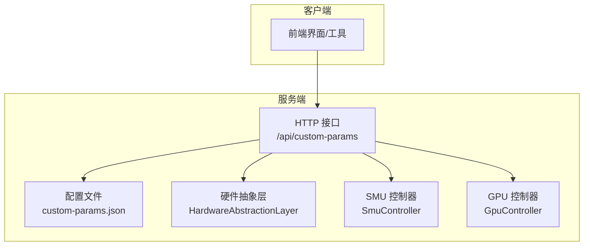
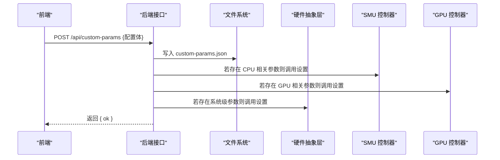
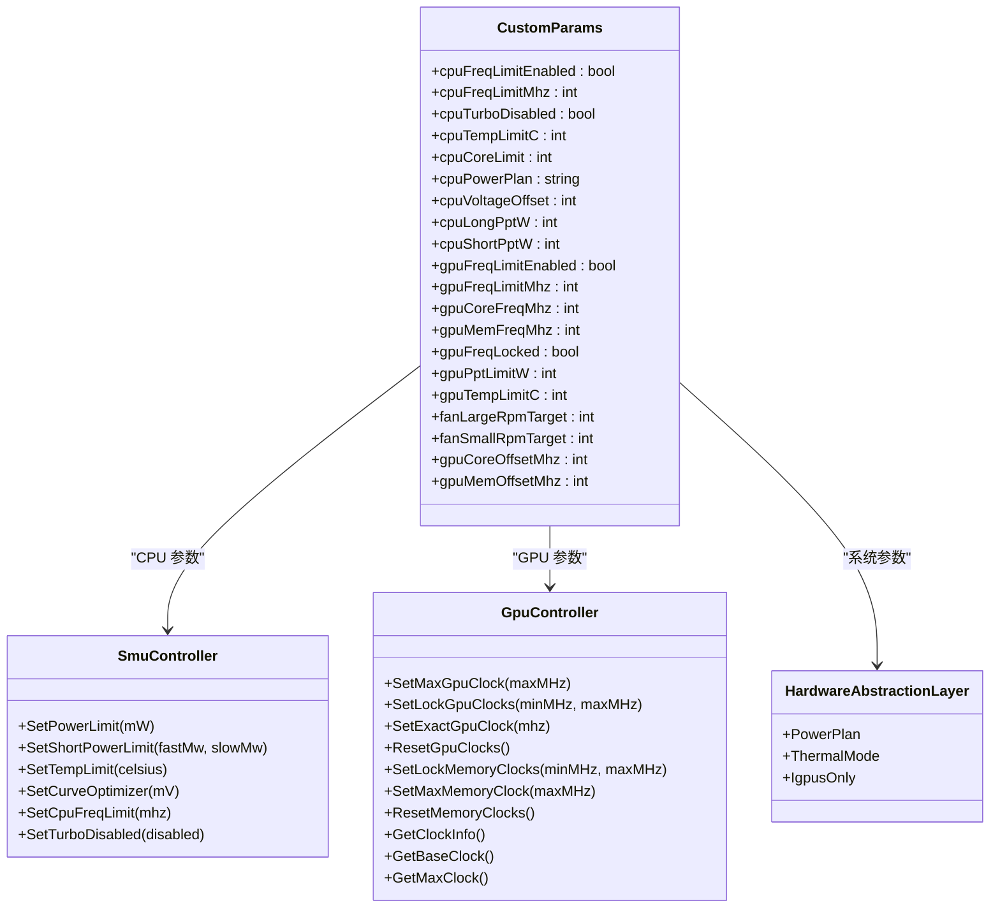
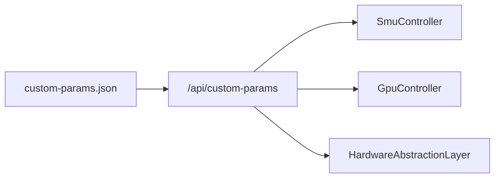

# 用户配置文件

<cite>
**本文引用的文件**
- [custom-params.json](file://server/api/config/custom-params.json)
- [Program.cs](file://server/api/Program.cs)
- [HardwareAbstractionLayer.cs](file://server/hal/HardwareAbstractionLayer.cs)
- [GpuController.cs](file://server/hal/GpuController.cs)
- [SmuController.cs](file://server/hal/SmuController.cs)
</cite>

## 目录
1. [简介](#简介)
2. [项目结构](#项目结构)
3. [核心组件](#核心组件)
4. [架构总览](#架构总览)
5. [详细组件分析](#详细组件分析)
6. [依赖关系分析](#依赖关系分析)
7. [性能考量](#性能考量)
8. [故障排查指南](#故障排查指南)
9. [结论](#结论)
10. [附录](#附录)

## 简介
本文件面向“用户配置文件”中的 custom-params.json，提供完整的技术说明与使用指南。内容涵盖：
- 配置项的结构、数据类型、有效范围与默认值
- 各项配置的作用与相互影响
- 修改示例与最佳实践
- 验证规则与错误处理机制
- 与后端控制接口的映射关系

## 项目结构
custom-params.json 位于服务端配置目录，由后端提供读取/写入接口，前端通过 HTTP 访问进行持久化管理。

图表来源
- [Program.cs:538-552](file://server/api/Program.cs#L538-L552)
- [custom-params.json:1-22](file://server/api/config/custom-params.json#L1-L22)

章节来源
- [Program.cs:23-55](file://server/api/Program.cs#L23-L55)
- [custom-params.json:1-22](file://server/api/config/custom-params.json#L1-L22)

## 核心组件
- 配置文件 custom-params.json：定义用户可调整的硬件行为参数集合，支持持久化存储与动态更新。
- HTTP 接口：
  - GET /api/custom-params：读取当前配置
  - POST /api/custom-params：写入新配置（覆盖式）
- 硬件抽象层 HAL：提供系统级遥测与控制能力（电源计划、散热模式、风扇等）。
- SMU 控制器：通过子进程调用外部工具实现对 CPU 功耗、温度、睿频等的控制。
- GPU 控制器：通过 nvidia-smi 子进程实现对显卡核心/显存频率的锁定与重置。

章节来源
- [Program.cs:538-552](file://server/api/Program.cs#L538-L552)
- [HardwareAbstractionLayer.cs:108-131](file://server/hal/HardwareAbstractionLayer.cs#L108-L131)
- [SmuController.cs:61-95](file://server/hal/SmuController.cs#L61-L95)
- [GpuController.cs:42-75](file://server/hal/GpuController.cs#L42-L75)

## 架构总览
以下序列图展示配置变更的端到端流程：前端提交配置 → 服务端写入文件 → 服务端根据配置调用底层控制器。

图表来源
- [Program.cs:542-552](file://server/api/Program.cs#L542-L552)
- [SmuController.cs:61-95](file://server/hal/SmuController.cs#L61-L95)
- [GpuController.cs:42-75](file://server/hal/GpuController.cs#L42-L75)
- [HardwareAbstractionLayer.cs:108-131](file://server/hal/HardwareAbstractionLayer.cs#L108-L131)

## 详细组件分析

### 配置项清单与规范
以下表格汇总了 custom-params.json 中所有配置项的语义、数据类型、有效范围与默认值。字段名与含义均来自配置文件本身。

| 字段名 | 数据类型 | 默认值 | 有效范围/说明 | 作用域/影响 |
|---|---|---|---|---|
| cpuFreqLimitEnabled | 布尔 | false | true/false | 启用/禁用 CPU 频率上限；启用时需配合 cpuFreqLimitMhz 使用 |
| cpuFreqLimitMhz | 整数 | 4500 | 实际受平台与 BIOS 支持限制 | 设置 CPU 最大频率上限（单位 MHz） |
| cpuTurboDisabled | 布尔 | false | true/false | 关闭/开启 CPU 睿频（Turbo） |
| cpuTempLimitC | 整数 | 90 | 实际受平台与 BIOS 支持限制 | 设置 CPU 温度墙（单位 °C） |
| cpuCoreLimit | 整数 | 0 | 0 表示不限制；>0 表示限制核心数 | 限制参与调度的核心数量 |
| cpuPowerPlan | 字符串 | "balance" | "balance"/"performance"/"quiet"（映射到系统电源计划） | 设置 Windows 电源计划 |
| cpuVoltageOffset | 整数 | -18 | 实际受 SMU 支持范围限制 | 设置曲线优化（Curve Optimizer，单位 mV） |
| cpuLongPptW | 整数 | 55 | 单位 W；与短时 PPT 协同设置 | 设置长时功耗墙（PPT） |
| cpuShortPptW | 整数 | 70 | 单位 W；与长时 PPT 协同设置 | 设置短时功耗墙（PPT） |
| gpuFreqLimitEnabled | 布尔 | false | true/false | 启用/禁用 GPU 频率上限；启用时需配合 gpuFreqLimitMhz 使用 |
| gpuFreqLimitMhz | 整数 | 2200 | 实际受显卡与驱动支持限制 | 设置 GPU 最大频率上限（单位 MHz） |
| gpuCoreFreqMhz | 整数 | 2700 | 实际受显卡与驱动支持限制 | 设置 GPU 核心频率（单位 MHz） |
| gpuMemFreqMhz | 整数 | 1 | 实际受显卡与驱动支持限制 | 设置 GPU 显存频率（单位 MHz） |
| gpuFreqLocked | 布尔 | false | true/false | 锁定/释放 GPU 频率（与 nvidia-smi 对应） |
| gpuPptLimitW | 整数 | 75 | 单位 W；用于限制 GPU 功耗 | 设置 GPU 功耗墙（PPT） |
| gpuTempLimitC | 整数 | 85 | 实际受平台与 BIOS 支持限制 | 设置 GPU 温度墙（单位 °C） |
| fanLargeRpmTarget | 整数 | 3600 | 实际受风扇与固件限制 | 大风扇目标转速（单位 RPM） |
| fanSmallRpmTarget | 整数 | 6200 | 实际受风扇与固件限制 | 小风扇目标转速（单位 RPM） |
| gpuCoreOffsetMhz | 整数 | 0 | 实际受显卡与驱动支持限制 | 设置 GPU 核心频率偏移（单位 MHz） |
| gpuMemOffsetMhz | 整数 | 0 | 实际受显卡与驱动支持限制 | 设置 GPU 显存频率偏移（单位 MHz） |

章节来源
- [custom-params.json:1-22](file://server/api/config/custom-params.json#L1-L22)

### 参数分类与控制路径
- CPU 相关
  - 功耗与温度：cpuLongPptW、cpuShortPptW、cpuTempLimitC、cpuPowerPlan
  - 频率与睿频：cpuFreqLimitEnabled、cpuFreqLimitMhz、cpuTurboDisabled
  - 电压与曲线优化：cpuVoltageOffset
  - 核心限制：cpuCoreLimit
- GPU 相关
  - 频率与锁定：gpuFreqLimitEnabled、gpuFreqLimitMhz、gpuCoreFreqMhz、gpuMemFreqMhz、gpuFreqLocked
  - 功耗与温度：gpuPptLimitW、gpuTempLimitC
  - 偏移：gpuCoreOffsetMhz、gpuMemOffsetMhz
- 风扇相关
  - fanLargeRpmTarget、fanSmallRpmTarget

章节来源
- [Program.cs:538-552](file://server/api/Program.cs#L538-L552)
- [SmuController.cs:61-95](file://server/hal/SmuController.cs#L61-L95)
- [GpuController.cs:42-75](file://server/hal/GpuController.cs#L42-L75)
- [HardwareAbstractionLayer.cs:108-131](file://server/hal/HardwareAbstractionLayer.cs#L108-L131)

### 配置应用流程（类图）
以下类图展示配置与后端控制器之间的关系与调用方向。

图表来源
- [custom-params.json:1-22](file://server/api/config/custom-params.json#L1-L22)
- [SmuController.cs:61-95](file://server/hal/SmuController.cs#L61-L95)
- [GpuController.cs:42-75](file://server/hal/GpuController.cs#L42-L75)
- [HardwareAbstractionLayer.cs:108-131](file://server/hal/HardwareAbstractionLayer.cs#L108-L131)

### 配置验证与错误处理
- 文件读取与写入
  - 读取：若文件不存在或反序列化失败，返回空对象作为回退。
  - 写入：采用临时文件 + 原子替换策略，确保写入一致性。
- 参数有效性
  - 数值型参数：未限定严格范围，实际生效取决于硬件与驱动支持。
  - 字符串型参数：如电源计划名称需符合后端映射集合。
- 异常处理
  - 写入异常、SMU/GPU 子进程异常、WMI/硬件访问异常均被捕获并返回错误信息。

章节来源
- [Program.cs:29-55](file://server/api/Program.cs#L29-L55)
- [Program.cs:542-552](file://server/api/Program.cs#L542-L552)

### 修改示例与最佳实践
- 示例一：限制 CPU 频率并关闭睿频
  - 设置 cpuFreqLimitEnabled=true、cpuFreqLimitMhz=4000、cpuTurboDisabled=true
  - 适用场景：需要稳定帧时间或降低发热
- 示例二：提升 GPU 性能（谨慎）
  - 设置 gpuFreqLimitEnabled=false、gpuCoreFreqMhz=2800、gpuMemFreqMhz=12000
  - 注意：需确保显卡供电与散热满足要求
- 示例三：降低风扇噪音
  - 设置 fanLargeRpmTarget=3000、fanSmallRpmTarget=5000
  - 注意：需结合温度监控，避免过热
- 最佳实践
  - 逐步调整：每次只改一项，观察温度与稳定性
  - 温度优先：优先设置温度墙，再考虑功耗与频率
  - 备份配置：修改前备份 custom-params.json
  - 平台适配：不同主板/BIOS对参数支持不同，以实际生效为准

章节来源
- [custom-params.json:1-22](file://server/api/config/custom-params.json#L1-L22)
- [Program.cs:538-552](file://server/api/Program.cs#L538-L552)

### 参数相互影响与依赖约束
- CPU 频率上限与睿频互斥
  - 启用频率上限时，建议同时设置 cpuTurboDisabled=true，避免系统在特定工况下突破限制
- 功耗与温度协同
  - cpuLongPptW 与 cpuShortPptW 应成对设置，避免短时过载导致系统保护
  - gpuPptLimitW 与 gpuTempLimitC 需与散热设计匹配
- 风扇与温度
  - 提升频率/功耗时，应同步提高风扇目标转速，防止温度越界
- 系统电源计划
  - cpuPowerPlan 会改变系统整体调度策略，建议与频率/功耗设置保持一致的性能预期

章节来源
- [custom-params.json:1-22](file://server/api/config/custom-params.json#L1-L22)
- [HardwareAbstractionLayer.cs:108-131](file://server/hal/HardwareAbstractionLayer.cs#L108-L131)

## 依赖关系分析
- 配置文件依赖于后端 JSON 序列化/反序列化逻辑，以及文件系统写入策略。
- CPU 控制依赖 SMU 控制器与外部工具；GPU 控制依赖 nvidia-smi；系统级控制依赖 HAL 与 WMI。
- 依赖链路如下：

图表来源
- [Program.cs:538-552](file://server/api/Program.cs#L538-L552)
- [SmuController.cs:61-95](file://server/hal/SmuController.cs#L61-L95)
- [GpuController.cs:42-75](file://server/hal/GpuController.cs#L42-L75)
- [HardwareAbstractionLayer.cs:108-131](file://server/hal/HardwareAbstractionLayer.cs#L108-L131)

章节来源
- [Program.cs:538-552](file://server/api/Program.cs#L538-L552)

## 性能考量
- 功耗墙与温度墙是安全边界，建议优先设定合理的温度墙，再逐步收紧功耗墙。
- 频率上限与睿频关闭可降低瞬态功耗峰值，有利于长期稳定性。
- GPU 频率与显存频率需与显卡供电能力匹配，避免降频或系统不稳定。
- 风扇转速与散热设计密切相关，建议在高负载场景下适当提高目标转速。

## 故障排查指南
- 配置未生效
  - 检查 custom-params.json 是否成功写入
  - 确认对应控制器（SMU/GPU/HAL）是否可用
- SMU 控制失败
  - 确认外部工具路径与权限
  - 检查平台是否支持相应参数
- GPU 控制失败
  - 确认 nvidia-smi 可用且具备管理员权限
  - 检查显卡型号与驱动版本
- 系统参数异常
  - 检查电源计划与散热模式映射
  - 确认 WMI 接口可用性

章节来源
- [Program.cs:29-55](file://server/api/Program.cs#L29-L55)
- [SmuController.cs:103-121](file://server/hal/SmuController.cs#L103-L121)
- [GpuController.cs:14-40](file://server/hal/GpuController.cs#L14-L40)

## 结论
custom-params.json 提供了对 CPU、GPU、风扇与系统参数的集中化配置入口。通过后端接口与底层控制器的协作，用户可以灵活地进行性能调优与安全约束。建议以温度与功耗为先，频率与睿频为辅，逐步迭代达到稳定高效的运行状态。

## 附录
- 接口定义
  - GET /api/custom-params：返回当前配置
  - POST /api/custom-params：写入新配置（覆盖式）

章节来源
- [Program.cs:538-552](file://server/api/Program.cs#L538-L552)