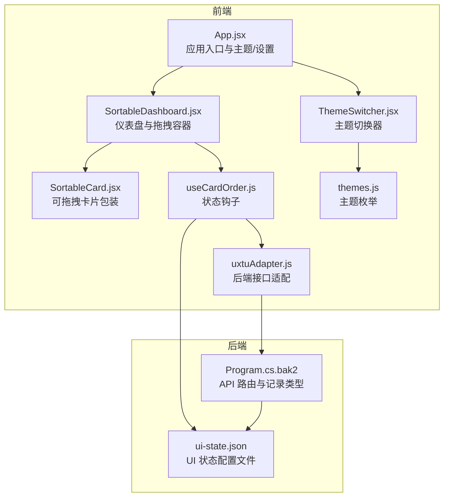
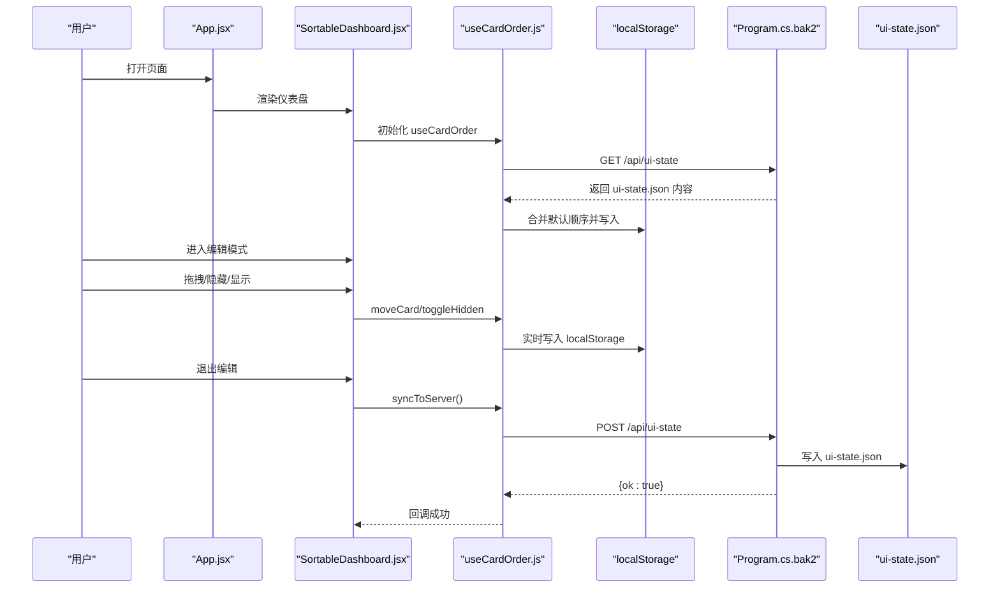
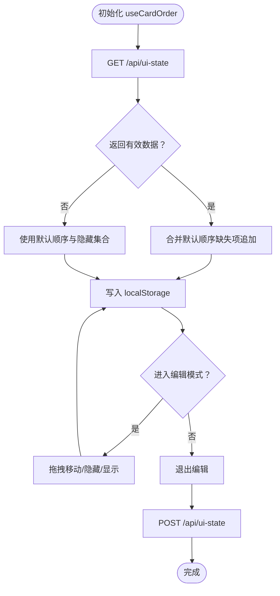
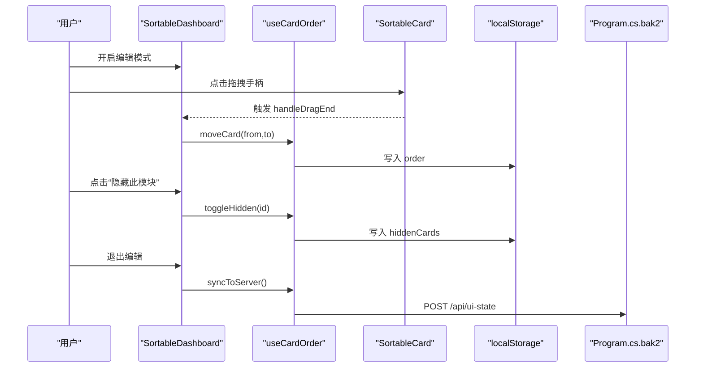
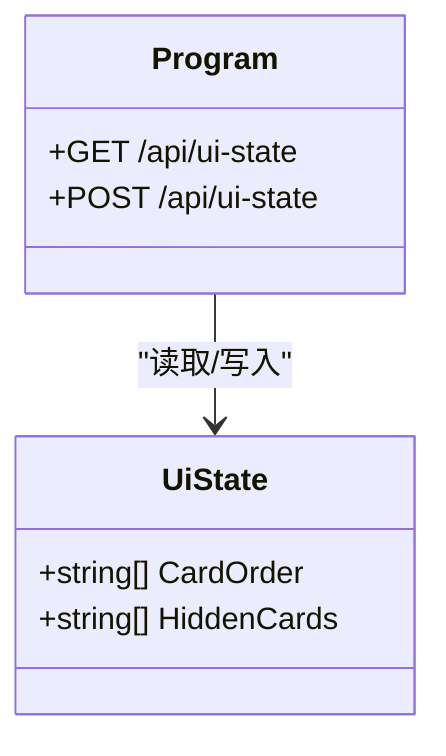
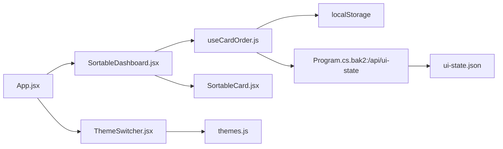

# 界面状态管理

<cite>
**本文引用的文件**
- [ui-state.json](file://server/api/config/ui-state.json)
- [Program.cs.bak2](file://server/api/Program.cs.bak2)
- [useCardOrder.js](file://src/hooks/useCardOrder.js)
- [SortableDashboard.jsx](file://src/components/SortableDashboard.jsx)
- [SortableCard.jsx](file://src/components/ui/SortableCard.jsx)
- [App.jsx](file://src/App.jsx)
- [uxtuAdapter.js](file://src/services/uxtuAdapter.js)
- [themes.js](file://src/data/themes.js)
- [ThemeSwitcher.jsx](file://src/components/ThemeSwitcher.jsx)
</cite>

## 目录
1. [简介](#简介)
2. [项目结构](#项目结构)
3. [核心组件](#核心组件)
4. [架构总览](#架构总览)
5. [详细组件分析](#详细组件分析)
6. [依赖关系分析](#依赖关系分析)
7. [性能考量](#性能考量)
8. [故障排查指南](#故障排查指南)
9. [结论](#结论)
10. [附录](#附录)

## 简介
本文件系统性阐述界面状态管理子系统的实现与设计，重点围绕 ui-state.json 的作用与结构、状态的序列化/反序列化机制、状态变更的监听与通知流程、界面状态与用户交互（拖拽排序、面板开关、布局调整）的关系，以及状态扩展与自定义选项、状态同步与冲突解决策略。通过前端 Hook、组件与后端 API 的协同，系统实现了“本地优先、服务端回写”的状态持久化与跨设备同步能力。

## 项目结构
界面状态管理涉及前端 React 组件与后端 C# API 的协作：
- 前端负责状态的本地持久化（localStorage）、UI 渲染与交互（拖拽、隐藏/显示面板），并在退出编辑模式时将状态同步至服务端。
- 后端提供 REST 接口读取/写入 ui-state.json，作为全局默认状态的来源与持久化目标。

图表来源
- [App.jsx:1-134](file://src/App.jsx#L1-L134)
- [SortableDashboard.jsx:1-247](file://src/components/SortableDashboard.jsx#L1-L247)
- [SortableCard.jsx:1-43](file://src/components/ui/SortableCard.jsx#L1-L43)
- [useCardOrder.js:1-128](file://src/hooks/useCardOrder.js#L1-L128)
- [uxtuAdapter.js:1-130](file://src/services/uxtuAdapter.js#L1-L130)
- [themes.js:1-34](file://src/data/themes.js#L1-L34)
- [ThemeSwitcher.jsx:1-24](file://src/components/ThemeSwitcher.jsx#L1-L24)
- [Program.cs.bak2:1120-1340](file://server/api/Program.cs.bak2#L1120-L1340)
- [ui-state.json:1-17](file://server/api/config/ui-state.json#L1-L17)

章节来源
- [App.jsx:1-134](file://src/App.jsx#L1-L134)
- [SortableDashboard.jsx:1-247](file://src/components/SortableDashboard.jsx#L1-L247)
- [useCardOrder.js:1-128](file://src/hooks/useCardOrder.js#L1-L128)
- [Program.cs.bak2:1120-1340](file://server/api/Program.cs.bak2#L1120-L1340)
- [ui-state.json:1-17](file://server/api/config/ui-state.json#L1-L17)

## 核心组件
- 状态钩子 useCardOrder：负责加载/保存卡片顺序与隐藏集合，支持本地持久化与服务端同步。
- 仪表盘 SortableDashboard：提供拖拽排序容器与编辑模式下的隐藏/显示控制。
- 可拖拽卡片 SortableCard：封装 @dnd-kit 的拖拽行为与编辑态 UI。
- 应用入口 App：协调主题、设置、模式切换与状态同步时机。
- 后端 Program：暴露 /api/ui-state GET/POST，读写 ui-state.json。
- ui-state.json：服务端默认 UI 状态文件，包含卡片顺序与隐藏列表。

章节来源
- [useCardOrder.js:1-128](file://src/hooks/useCardOrder.js#L1-L128)
- [SortableDashboard.jsx:1-247](file://src/components/SortableDashboard.jsx#L1-L247)
- [SortableCard.jsx:1-43](file://src/components/ui/SortableCard.jsx#L1-L43)
- [App.jsx:1-134](file://src/App.jsx#L1-L134)
- [Program.cs.bak2:1120-1340](file://server/api/Program.cs.bak2#L1120-L1340)
- [ui-state.json:1-17](file://server/api/config/ui-state.json#L1-L17)

## 架构总览
界面状态管理采用“前端本地优先 + 服务端回写”的双层持久化策略：
- 启动时：前端从服务端 /api/ui-state 获取默认状态，合并默认卡片集合，确保新卡片追加到末尾。
- 编辑态：用户通过拖拽改变顺序、隐藏/显示面板，状态先写入 localStorage。
- 退出编辑：前端将当前状态通过 POST /api/ui-state 同步到服务端，覆盖 ui-state.json。
- 主题与设置：主题与通用设置通过 localStorage 持久化，并在 App 中同步到 DOM 类名。

图表来源
- [useCardOrder.js:53-91](file://src/hooks/useCardOrder.js#L53-L91)
- [SortableDashboard.jsx:49-57](file://src/components/SortableDashboard.jsx#L49-L57)
- [Program.cs.bak2:1121-1153](file://server/api/Program.cs.bak2#L1121-L1153)
- [ui-state.json:1-17](file://server/api/config/ui-state.json#L1-L17)

## 详细组件分析

### ui-state.json 结构与用途
- 卡片顺序（cardOrder）：决定面板渲染顺序，数组元素为卡片标识符。
- 隐藏列表（hiddenCards）：决定哪些卡片初始不显示。
- 默认值：当服务端未提供或为空时，前端使用内置默认顺序与隐藏集合进行回退。

章节来源
- [ui-state.json:1-17](file://server/api/config/ui-state.json#L1-L17)

### 前端状态钩子 useCardOrder
职责与流程：
- 初始化加载：启动时调用 GET /api/ui-state，若返回有效数据则合并默认顺序（缺失的新卡片追加到末尾），否则回退到默认值。
- 本地持久化：每次 order 或 hiddenCards 变化即写入 localStorage 对应键。
- 拖拽移动：moveCard 支持在本地即时更新顺序。
- 面板显隐：toggleHidden 在编辑态切换某卡片的隐藏状态；showAll 清空隐藏集合；resetOrder 恢复默认顺序与隐藏。
- 服务端同步：syncToServer 在退出编辑时将当前状态 POST 到 /api/ui-state，成功回调传入 true，失败传入 false。

复杂度与性能：
- 顺序合并为 O(n)，n 为默认顺序长度。
- Set 查询与插入为 O(1) 平均时间。
- localStorage 写入为 O(k)，k 为数组长度。

错误处理：
- GET /api/ui-state 失败时忽略并继续使用默认值。
- POST /api/ui-state 失败时回调 false，保证 UI 不阻塞。

图表来源
- [useCardOrder.js:53-91](file://src/hooks/useCardOrder.js#L53-L91)

章节来源
- [useCardOrder.js:1-128](file://src/hooks/useCardOrder.js#L1-L128)

### 仪表盘 SortableDashboard 与 SortableCard
- SortableDashboard：
  - 使用 @dnd-kit 提供的 DndContext/SortableContext 实现拖拽排序。
  - 通过 useCardOrder 提供的 order 与 visibleCards 渲染可见卡片。
  - 在编辑模式下展示隐藏面板列表与“全部显示/重置排序”按钮。
  - 退出编辑时触发 syncToServer，确保状态回写服务端。
- SortableCard：
  - 包装卡片内容，启用拖拽句柄与隐藏按钮（编辑态）。
  - 通过 useSortable 提供的 attributes/listeners 绑定拖拽事件。

图表来源
- [SortableDashboard.jsx:64-71](file://src/components/SortableDashboard.jsx#L64-L71)
- [SortableDashboard.jsx:196-206](file://src/components/SortableDashboard.jsx#L196-L206)
- [SortableCard.jsx:4-42](file://src/components/ui/SortableCard.jsx#L4-L42)
- [useCardOrder.js:93-121](file://src/hooks/useCardOrder.js#L93-L121)

章节来源
- [SortableDashboard.jsx:1-247](file://src/components/SortableDashboard.jsx#L1-L247)
- [SortableCard.jsx:1-43](file://src/components/ui/SortableCard.jsx#L1-L43)
- [useCardOrder.js:1-128](file://src/hooks/useCardOrder.js#L1-L128)

### 主题与设置的持久化与同步
- 主题选择：ThemeSwitcher 从 themes.js 读取主题列表，App.jsx 将当前主题类名同步到 document.body，使 CSS 变量生效。
- 设置持久化：useControlState 将主题与设置写入 localStorage，并在模式切换时按模式维度保存/加载参数。
- 与 UI 状态的关系：主题与设置属于“界面偏好设置”的一部分，与卡片顺序/隐藏共同构成用户个性化体验。

章节来源
- [ThemeSwitcher.jsx:1-24](file://src/components/ThemeSwitcher.jsx#L1-L24)
- [themes.js:1-34](file://src/data/themes.js#L1-L34)
- [App.jsx:23-40](file://src/App.jsx#L23-L40)
- [useControlState.js:140-142](file://src/hooks/useControlState.js#L140-L142)

### 后端 API 与 ui-state.json
- GET /api/ui-state：读取 ui-state.json 并返回给前端。
- POST /api/ui-state：接收前端 payload，写入 ui-state.json。
- 数据模型：UiState(record) 包含 CardOrder 与 HiddenCards 两个字符串数组字段。

图表来源
- [Program.cs.bak2:1315-1325](file://server/api/Program.cs.bak2#L1315-L1325)
- [Program.cs.bak2:1121-1153](file://server/api/Program.cs.bak2#L1121-L1153)

章节来源
- [Program.cs.bak2:1120-1340](file://server/api/Program.cs.bak2#L1120-L1340)
- [ui-state.json:1-17](file://server/api/config/ui-state.json#L1-L17)

## 依赖关系分析
- 组件耦合：
  - SortableDashboard 依赖 useCardOrder 提供的状态与方法。
  - SortableCard 依赖 @dnd-kit 的 useSortable，仅在编辑态启用交互。
  - App.jsx 作为顶层容器，协调主题、设置与仪表盘。
- 外部依赖：
  - localStorage：本地持久化。
  - 后端 REST API：ui-state.json 的读写。
  - WebSocket（非 UI 状态相关）：遥测数据流，不影响 UI 状态。

图表来源
- [App.jsx:1-134](file://src/App.jsx#L1-L134)
- [SortableDashboard.jsx:1-247](file://src/components/SortableDashboard.jsx#L1-L247)
- [SortableCard.jsx:1-43](file://src/components/ui/SortableCard.jsx#L1-L43)
- [useCardOrder.js:1-128](file://src/hooks/useCardOrder.js#L1-L128)
- [Program.cs.bak2:1121-1153](file://server/api/Program.cs.bak2#L1121-L1153)
- [ui-state.json:1-17](file://server/api/config/ui-state.json#L1-L17)
- [ThemeSwitcher.jsx:1-24](file://src/components/ThemeSwitcher.jsx#L1-L24)
- [themes.js:1-34](file://src/data/themes.js#L1-L34)

章节来源
- [App.jsx:1-134](file://src/App.jsx#L1-L134)
- [SortableDashboard.jsx:1-247](file://src/components/SortableDashboard.jsx#L1-L247)
- [useCardOrder.js:1-128](file://src/hooks/useCardOrder.js#L1-L128)
- [Program.cs.bak2:1121-1153](file://server/api/Program.cs.bak2#L1121-L1153)

## 性能考量
- 拖拽性能：@dnd-kit 使用 CSS Transform 与最小重排，拖拽过程保持高帧率。
- 状态写入：localStorage 写入为 O(k)，建议避免频繁微小变更；当前实现已在编辑态即时写入，退出编辑再统一回写服务端，平衡了交互流畅性与一致性。
- 合并与回退：默认顺序合并为 O(n)，n 较小（约 10 左右），开销可忽略。
- 网络请求：同步仅在退出编辑时触发，降低网络压力。

## 故障排查指南
- 服务端 /api/ui-state 无响应
  - 现象：前端初始化阶段未加载到服务端状态，回退到默认值。
  - 排查：检查后端路由是否正确映射，ui-state.json 是否存在且可写。
- 同步失败
  - 现象：退出编辑后提示保存失败。
  - 排查：查看 POST /api/ui-state 的返回体，确认 ui-state.json 写入权限与路径。
- 本地状态异常
  - 现象：刷新后顺序或隐藏状态丢失。
  - 排查：检查 localStorage 中对应键是否存在与格式是否正确；必要时清理后重试。
- 新增卡片未出现
  - 现象：新增卡片未出现在默认顺序末尾。
  - 排查：确认 ui-state.json 中 cardOrder 是否包含该卡片；若缺失，前端会自动追加。

章节来源
- [useCardOrder.js:53-67](file://src/hooks/useCardOrder.js#L53-L67)
- [useCardOrder.js:78-91](file://src/hooks/useCardOrder.js#L78-L91)

## 结论
界面状态管理通过“前端本地优先 + 服务端回写”的机制，实现了用户对面板布局与可见性的个性化定制，并在多设备间保持一致体验。ui-state.json 作为服务端默认状态源，与前端 Hook 的本地持久化形成互补，既保证了离线可用性，又支持在线同步。拖拽排序、隐藏/显示面板与主题切换等交互均围绕统一的状态模型展开，具备良好的扩展性与可维护性。

## 附录

### 状态字段定义与默认值
- 卡片顺序（cardOrder）：字符串数组，表示面板渲染顺序。
- 隐藏列表（hiddenCards）：字符串数组，表示初始隐藏的面板。
- 默认顺序与默认隐藏：当服务端未提供或为空时，前端使用内置默认值。

章节来源
- [ui-state.json:1-17](file://server/api/config/ui-state.json#L1-L17)
- [useCardOrder.js:7-19](file://src/hooks/useCardOrder.js#L7-L19)

### 状态扩展与自定义选项
- 新增面板卡片
  - 在前端 CARD_MAP 与默认顺序中添加新卡片标识符。
  - 服务端 ui-state.json 中无需预先包含，前端会在加载时自动将缺失的新卡片追加到末尾。
- 自定义面板显隐
  - 通过编辑模式下的“隐藏此模块”与“全部显示”按钮进行操作。
  - 隐藏状态写入 localStorage，并在退出编辑时同步到服务端。
- 主题扩展
  - 在 themes.js 中新增主题条目，ThemeSwitcher 会自动渲染。
  - 主题类名同步到 document.body，影响 CSS 变量。

章节来源
- [SortableDashboard.jsx:25-36](file://src/components/SortableDashboard.jsx#L25-L36)
- [useCardOrder.js:18-19](file://src/hooks/useCardOrder.js#L18-L19)
- [themes.js:1-34](file://src/data/themes.js#L1-L34)
- [ThemeSwitcher.jsx:1-24](file://src/components/ThemeSwitcher.jsx#L1-L24)

### 状态同步与冲突解决策略
- 启动时：前端优先使用服务端 ui-state.json，若为空则回退到本地默认值。
- 编辑时：本地状态优先，保证交互流畅。
- 退出编辑：统一回写服务端，覆盖 ui-state.json，实现“最终一致”。

章节来源
- [useCardOrder.js:53-67](file://src/hooks/useCardOrder.js#L53-L67)
- [useCardOrder.js:78-91](file://src/hooks/useCardOrder.js#L78-L91)
- [Program.cs.bak2:1121-1153](file://server/api/Program.cs.bak2#L1121-L1153)