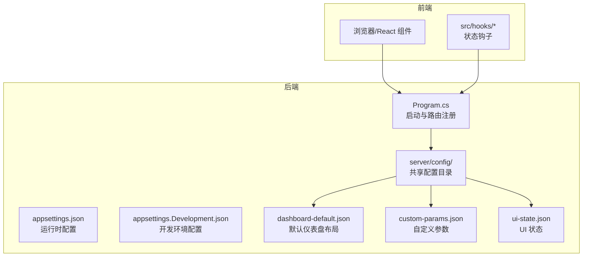
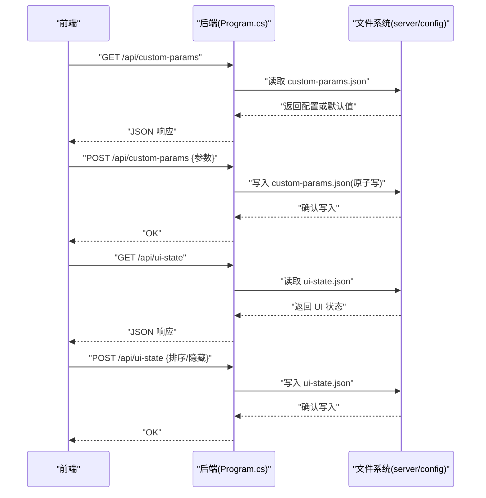
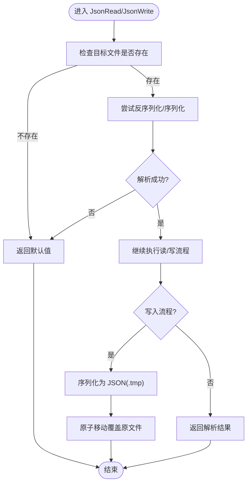
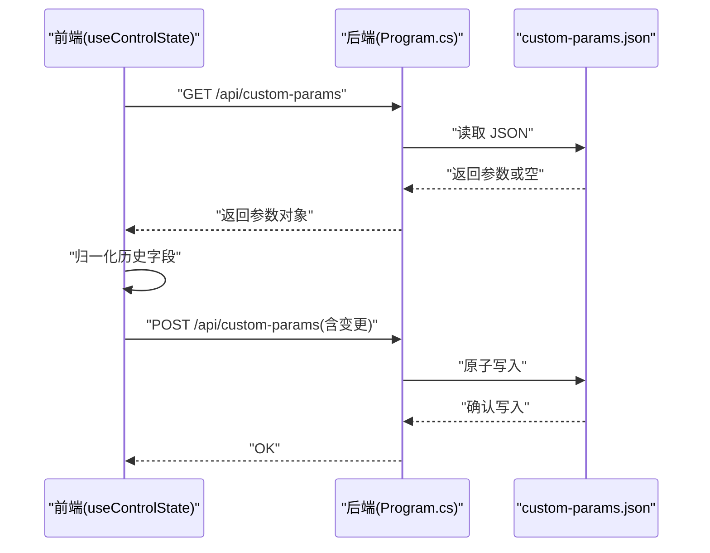
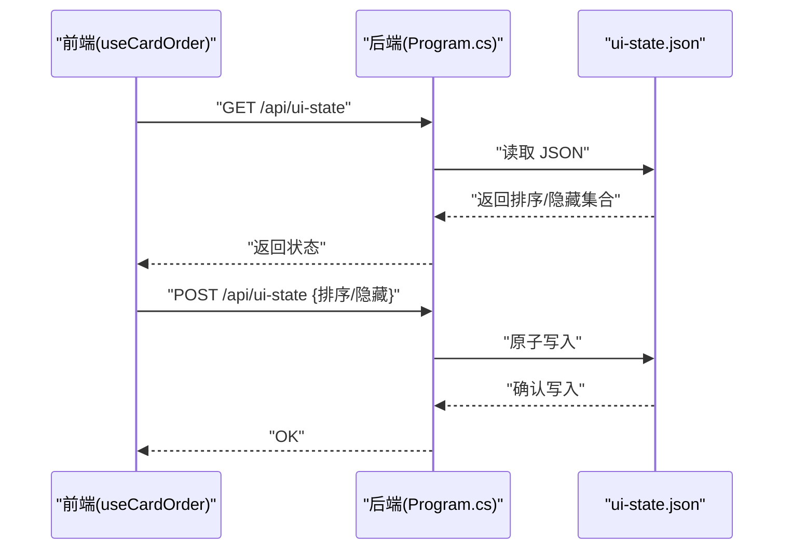
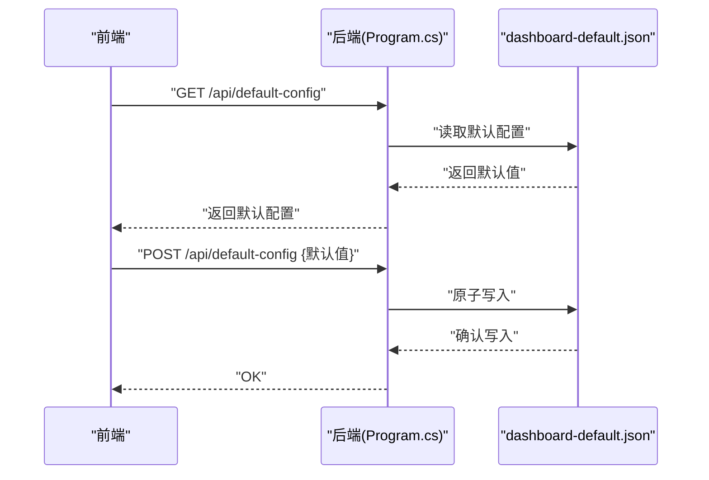
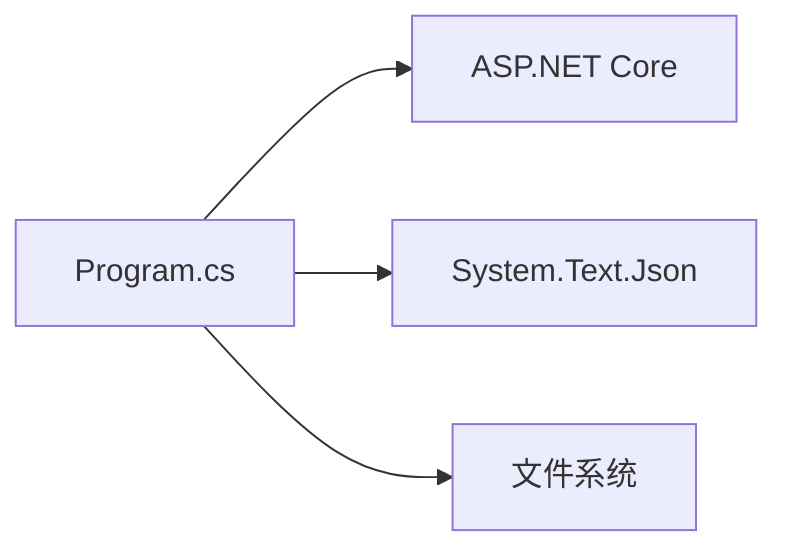

# 配置生命周期管理

<cite>
**本文引用的文件**
- [Program.cs](file://server/api/Program.cs)
- [appsettings.json](file://server/api/appsettings.json)
- [appsettings.Development.json](file://server/api/appsettings.Development.json)
- [dashboard-default.json](file://server/config/dashboard-default.json)
- [custom-params.json](file://server/config/custom-params.json)
- [ui-state.json](file://server/config/ui-state.json)
- [dev-frontend.md](file://docs/dev-frontend.md)
</cite>

## 目录
1. [引言](#引言)
2. [项目结构](#项目结构)
3. [核心组件](#核心组件)
4. [架构总览](#架构总览)
5. [详细组件分析](#详细组件分析)
6. [依赖关系分析](#依赖关系分析)
7. [性能考量](#性能考量)
8. [故障排除指南](#故障排除指南)
9. [结论](#结论)
10. [附录](#附录)

## 引言
本文件围绕配置生命周期管理进行系统化技术文档编制，涵盖配置文件的加载顺序、初始化过程、运行时更新机制；配置验证、错误处理与异常恢复策略；持久化存储、备份与迁移机制；热重载实现方案与注意事项；配置版本控制与兼容性检查；配置审计日志与变更追踪；以及故障排除与调试方法。文档以仓库中的实际代码与配置文件为依据，结合前后端协同的配置管理实践，提供可操作的指导。

## 项目结构
本项目的配置相关文件主要分布在以下位置：
- 后端 ASP.NET Core 配置：appsettings.json、appsettings.Development.json
- 后端共享配置目录：server/config 下的 dashboard-default.json、custom-params.json、ui-state.json
- 前端状态与持久化：前端通过 HTTP 接口读写后端配置，并在本地存储中缓存部分状态

**图表来源**
- [Program.cs](file://server/api/Program.cs)
- [appsettings.json](file://server/api/appsettings.json)
- [appsettings.Development.json](file://server/api/appsettings.Development.json)
- [dashboard-default.json](file://server/config/dashboard-default.json)
- [custom-params.json](file://server/config/custom-params.json)
- [ui-state.json](file://server/config/ui-state.json)

**章节来源**
- [Program.cs](file://server/api/Program.cs)
- [appsettings.json](file://server/api/appsettings.json)
- [appsettings.Development.json](file://server/api/appsettings.Development.json)
- [dashboard-default.json](file://server/config/dashboard-default.json)
- [custom-params.json](file://server/config/custom-params.json)
- [ui-state.json](file://server/config/ui-state.json)

## 核心组件
- 配置目录解析与持久化工具
  - 后端通过统一的配置目录解析逻辑定位 server/config，并提供 JSON 读写辅助函数，确保读取失败时返回默认值，写入采用临时文件 + 原子移动的方式保证一致性。
- 配置接口
  - 提供 /api/custom-params、/api/ui-state、/api/default-config 等接口，分别用于读取/写入自定义参数、UI 状态与默认布局。
- 前端状态与持久化
  - 前端在启动时从后端拉取配置，回退到本地存储，再回退到默认值；UI 排序与隐藏卡片状态由后端统一管理，前端负责展示与交互。

**章节来源**
- [Program.cs](file://server/api/Program.cs)
- [custom-params.json](file://server/config/custom-params.json)
- [ui-state.json](file://server/config/ui-state.json)
- [dashboard-default.json](file://server/config/dashboard-default.json)
- [dev-frontend.md](file://docs/dev-frontend.md)

## 架构总览
后端以 ASP.NET Core 作为入口，启动时解析配置目录并注册静态文件与路由。前端通过 HTTP 接口访问后端配置，后端以 JSON 文件形式持久化配置。整体流程如下：

**图表来源**
- [Program.cs](file://server/api/Program.cs)
- [custom-params.json](file://server/config/custom-params.json)
- [ui-state.json](file://server/config/ui-state.json)

## 详细组件分析

### 配置目录解析与持久化工具
- 目录解析
  - 后端优先尝试基于当前工作目录的相对路径定位 server/config，若不存在则回退到 AppContext.BaseDirectory 的上层路径，确保在不同部署形态下均能找到配置目录。
- 读取逻辑
  - 读取指定 JSON 文件，若文件不存在或反序列化失败，返回提供的默认值，避免因配置缺失导致崩溃。
- 写入逻辑
  - 使用临时文件 + 原子移动的方式写入，先序列化到 .tmp 文件，再以覆盖方式移动到目标文件，降低并发写入与断电风险带来的数据损坏概率。

**图表来源**
- [Program.cs](file://server/api/Program.cs)

**章节来源**
- [Program.cs](file://server/api/Program.cs)

### 自定义参数配置(custom-params)
- 加载顺序
  - 前端启动时通过 /api/custom-params 获取后端保存的参数；若为空则回退到本地存储与默认值；同时对历史字段进行归一化处理（如显存频率索引化）。
- 初始化与运行时更新
  - 后端提供 GET/POST 接口；前端在参数变化时触发保存（带防抖），后端以原子写入方式落盘。
- 兼容性与校验
  - 前端对历史字段进行兼容转换；后端对输入进行基本校验（如数值范围），异常时返回错误信息。

**图表来源**
- [Program.cs](file://server/api/Program.cs)
- [custom-params.json](file://server/config/custom-params.json)
- [dev-frontend.md](file://docs/dev-frontend.md)

**章节来源**
- [Program.cs](file://server/api/Program.cs)
- [custom-params.json](file://server/config/custom-params.json)
- [dev-frontend.md](file://docs/dev-frontend.md)

### UI 状态配置(ui-state)
- 加载顺序
  - 前端启动时通过 /api/ui-state 获取卡片排序与隐藏集合；若为空则使用默认布局。
- 初始化与运行时更新
  - 前端在拖拽排序与隐藏卡片时触发保存；后端以原子写入方式落盘。
- 兼容性与校验
  - 后端对请求体进行大小写不敏感解析；异常时返回错误信息。

**图表来源**
- [Program.cs](file://server/api/Program.cs)
- [ui-state.json](file://server/config/ui-state.json)

**章节来源**
- [Program.cs](file://server/api/Program.cs)
- [ui-state.json](file://server/config/ui-state.json)

### 默认仪表盘配置(default-config)
- 用途
  - 定义默认卡片顺序与隐藏集合，作为 UI 状态的后备。
- 初始化与运行时更新
  - 后端提供 GET/POST 接口；前端在首次打开或重置时写入默认值。

**图表来源**
- [Program.cs](file://server/api/Program.cs)
- [dashboard-default.json](file://server/config/dashboard-default.json)

**章节来源**
- [Program.cs](file://server/api/Program.cs)
- [dashboard-default.json](file://server/config/dashboard-default.json)

### 运行时更新机制与热重载
- 现状
  - 后端未实现配置文件的自动监听与热重载；所有更新均通过 HTTP 接口触发写入。
- 可选方案
  - 在后端引入 FileSystemWatcher 监听 server/config 下的 JSON 文件变更，变更时触发内存缓存刷新与通知前端。
  - 对于前端，可在收到变更通知后重新拉取配置或触发局部状态更新。
- 注意事项
  - 热重载需考虑并发写入、原子性与一致性；建议保留当前的原子写入策略。
  - 对于关键配置（如自定义参数），建议增加版本号字段并在热重载时进行兼容性检查。

**章节来源**
- [Program.cs](file://server/api/Program.cs)

### 配置验证、错误处理与异常恢复
- 验证策略
  - 后端对请求体进行大小写不敏感解析；对数值型字段进行范围约束（如风扇目标、温度墙、频率限制等）。
  - 前端对历史字段进行归一化处理，避免跨版本差异导致的异常。
- 错误处理
  - 读取失败返回默认值；写入失败返回错误信息；网络异常时前端回退到本地存储或默认值。
- 异常恢复
  - 通过默认配置与本地存储实现多级回退；必要时允许用户通过接口重置为默认值。

**章节来源**
- [Program.cs](file://server/api/Program.cs)
- [dev-frontend.md](file://docs/dev-frontend.md)

### 持久化存储、备份与迁移
- 持久化
  - 所有配置以 JSON 文件形式存储于 server/config；采用原子写入保障一致性。
- 备份
  - 建议在写入前生成备份文件（如 .bak），写入成功后再删除旧备份，防止意外覆盖。
- 迁移
  - 前端在加载自定义参数时对历史字段进行归一化；后端可扩展版本字段与迁移脚本，自动修复旧格式。

**章节来源**
- [Program.cs](file://server/api/Program.cs)
- [custom-params.json](file://server/config/custom-params.json)
- [dev-frontend.md](file://docs/dev-frontend.md)

### 配置版本控制与兼容性检查
- 版本字段
  - 建议在配置根对象中加入 version 字段，记录配置格式版本。
- 兼容性检查
  - 后端在读取配置时检查版本，若低于当前支持版本，则触发迁移流程；迁移失败时回退到默认配置。
- 前端兼容
  - 前端在加载时对历史字段进行兼容转换，避免因字段名或取值范围变化导致异常。

**章节来源**
- [Program.cs](file://server/api/Program.cs)
- [custom-params.json](file://server/config/custom-params.json)
- [dev-frontend.md](file://docs/dev-frontend.md)

### 配置审计日志与变更追踪
- 审计日志
  - 建议在后端写入配置时记录操作时间、操作者（IP）、变更字段与新旧值；可输出到独立的日志文件或数据库。
- 变更追踪
  - 前端在保存配置时记录变更事件（如“保存自定义参数”、“调整 UI 排序”），便于用户回溯。
- 可视化
  - 提供管理界面展示最近变更与回滚选项。

**章节来源**
- [Program.cs](file://server/api/Program.cs)

## 依赖关系分析
后端配置模块与外部依赖的关系如下：
- ASP.NET Core：提供 Web 应用框架与路由注册
- System.Text.Json：提供 JSON 序列化/反序列化能力
- 文件系统：提供配置文件的读写与原子移动

**图表来源**
- [Program.cs](file://server/api/Program.cs)

**章节来源**
- [Program.cs](file://server/api/Program.cs)

## 性能考量
- I/O 原子性
  - 使用 .tmp + 移动的写入策略减少锁竞争与数据损坏风险。
- 解析优化
  - 对 JSON 解析启用大小写不敏感与命名策略，减少字段映射开销。
- 缓存策略
  - 前端对配置进行本地缓存，减少重复请求；后端可引入内存缓存以降低频繁读取的 I/O 压力。
- 并发安全
  - 在高并发场景下，建议对同一配置文件的写入加锁或采用队列串行化处理。

**章节来源**
- [Program.cs](file://server/api/Program.cs)

## 故障排除指南
- 配置无法读取
  - 检查 server/config 目录是否存在且可读；确认文件权限与路径解析逻辑。
- 写入失败
  - 查看 .tmp 文件是否生成；确认磁盘空间与文件锁定情况；检查后端异常日志。
- 前端状态不同步
  - 确认后端接口返回的 JSON 结构与前端解析一致；检查大小写不敏感解析是否生效。
- 历史字段异常
  - 前端是否进行了归一化处理；后端是否对数值范围进行了约束。
- 热重载无效
  - 是否启用了文件监听；是否正确实现了版本控制与兼容性检查。

**章节来源**
- [Program.cs](file://server/api/Program.cs)
- [dev-frontend.md](file://docs/dev-frontend.md)

## 结论
本项目通过后端统一的配置目录与 JSON 持久化策略，实现了自定义参数、UI 状态与默认布局的集中管理。前端在启动时从后端拉取配置，并在本地存储中进行回退，确保了良好的用户体验。未来可在热重载、版本控制、审计日志与迁移机制方面进一步完善，以提升系统的稳定性与可维护性。

## 附录
- 配置文件清单
  - server/config/custom-params.json：自定义参数
  - server/config/ui-state.json：UI 排序与隐藏集合
  - server/config/dashboard-default.json：默认仪表盘布局
  - server/api/appsettings.json：运行时配置
  - server/api/appsettings.Development.json：开发环境配置

**章节来源**
- [custom-params.json](file://server/config/custom-params.json)
- [ui-state.json](file://server/config/ui-state.json)
- [dashboard-default.json](file://server/config/dashboard-default.json)
- [appsettings.json](file://server/api/appsettings.json)
- [appsettings.Development.json](file://server/api/appsettings.Development.json)