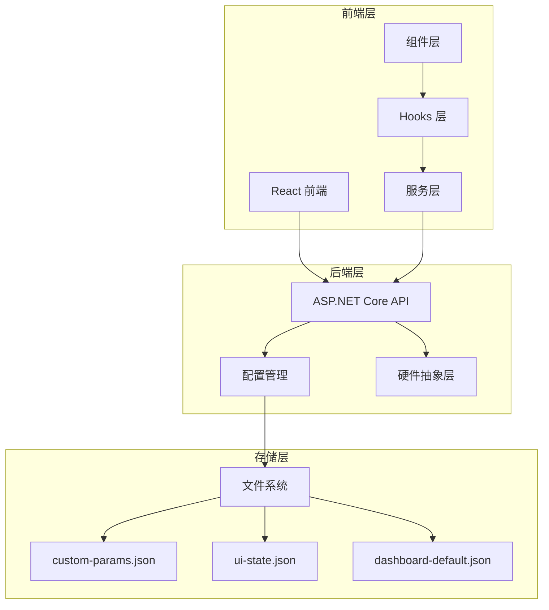
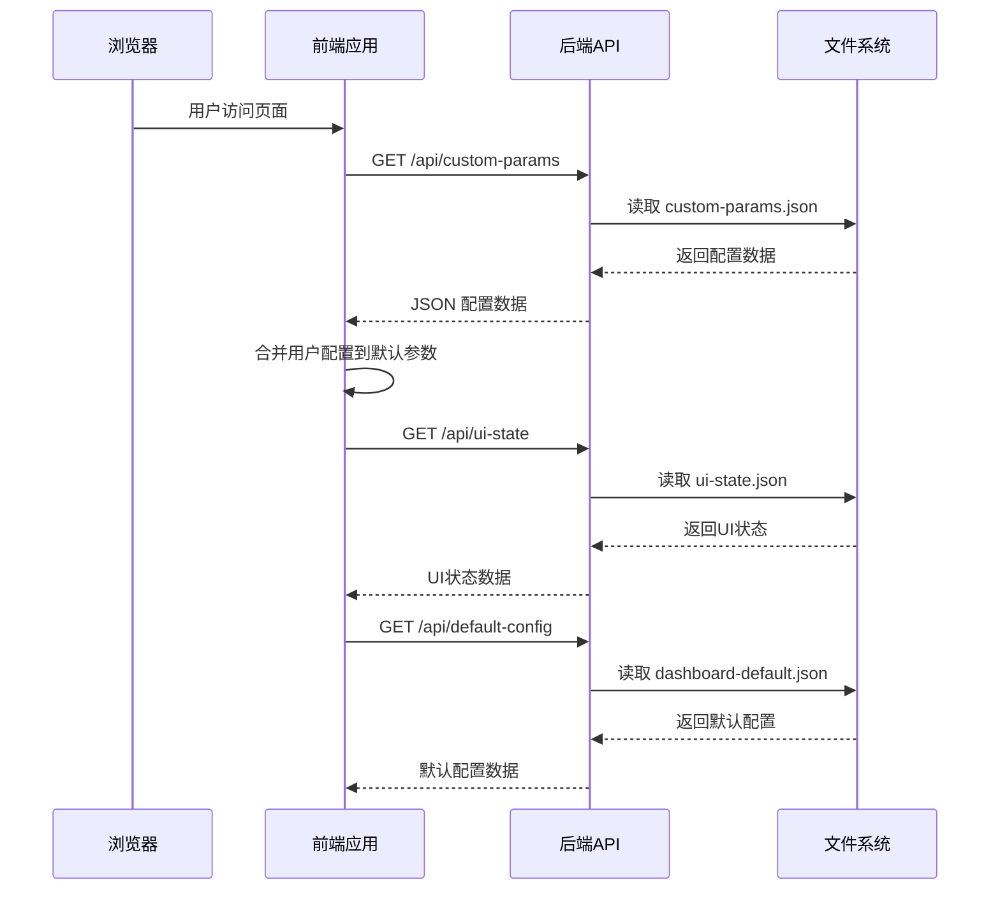
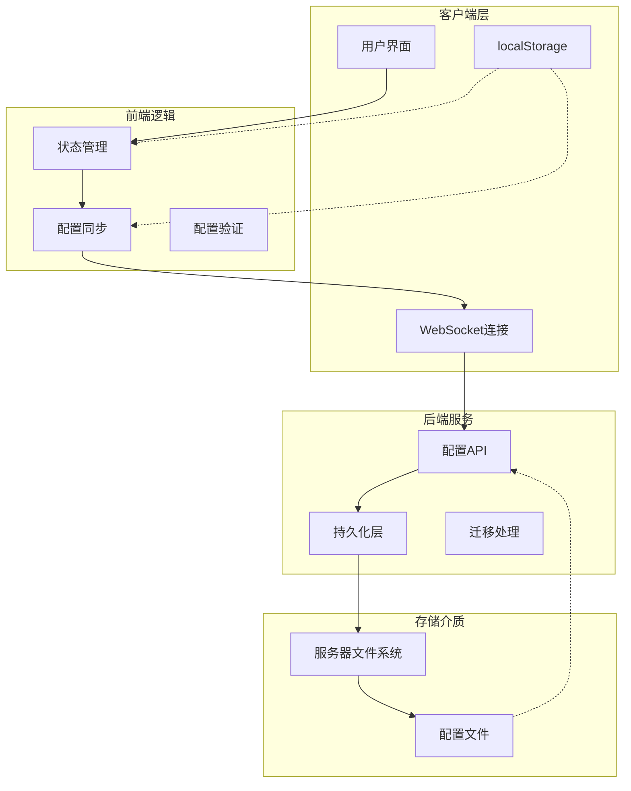
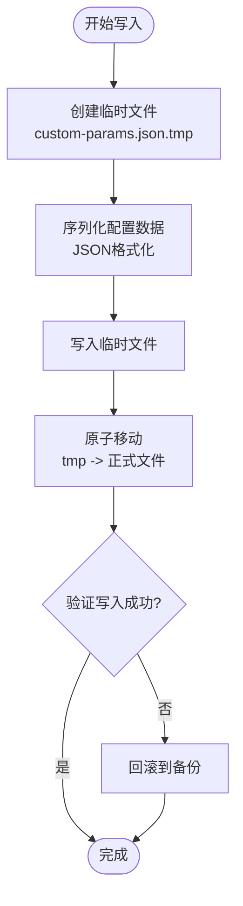
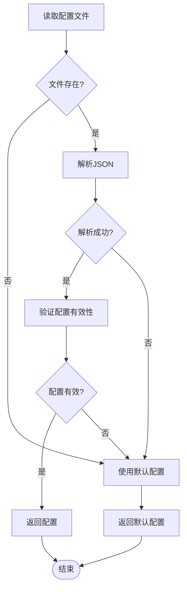
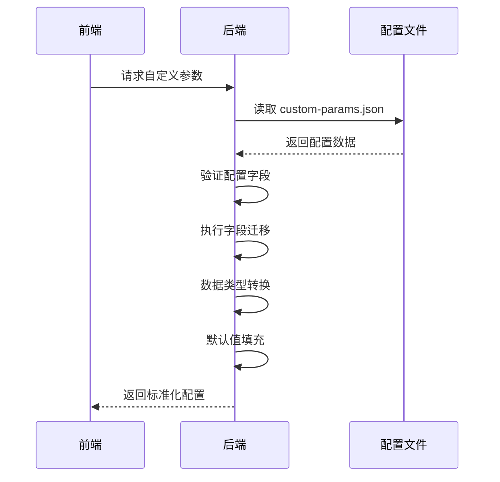
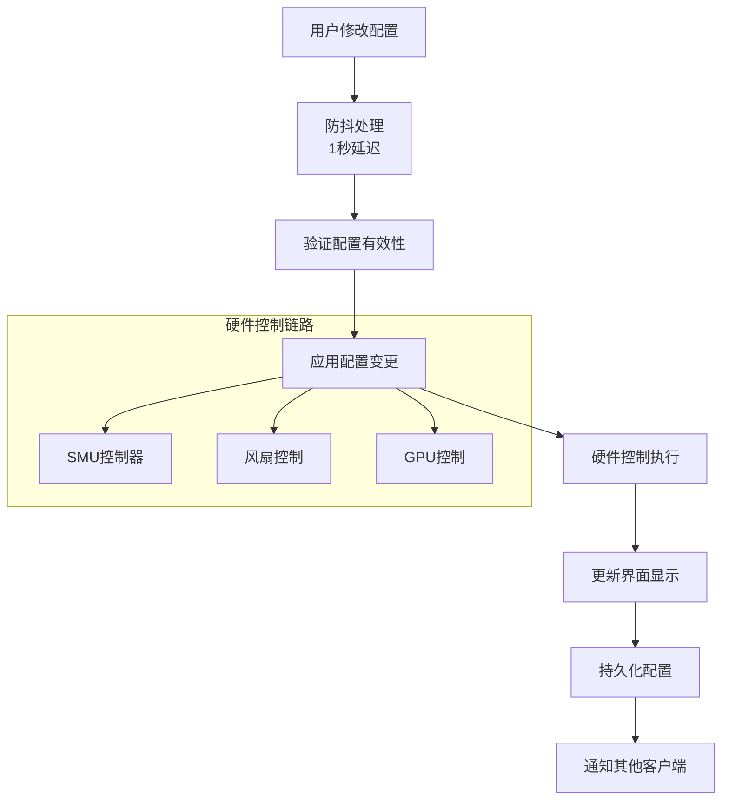
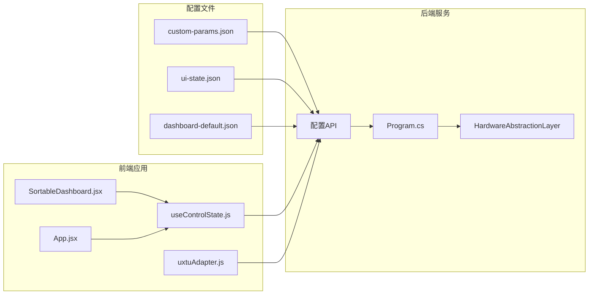

# 配置管理系统

<cite>
**本文档引用的文件**
- [Program.cs](file://server/api/Program.cs)
- [custom-params.json](file://server/api/config/custom-params.json)
- [ui-state.json](file://server/api/config/ui-state.json)
- [dashboard-default.json](file://server/config/dashboard-default.json)
- [App.jsx](file://src/App.jsx)
- [SortableDashboard.jsx](file://src/components/SortableDashboard.jsx)
- [useControlState.js](file://src/hooks/useControlState.js)
- [uxtuAdapter.js](file://src/services/uxtuAdapter.js)
- [HardwareAbstractionLayer.cs](file://server/hal/HardwareAbstractionLayer.cs)
</cite>

## 目录
1. [简介](#简介)
2. [项目结构](#项目结构)
3. [核心组件](#核心组件)
4. [架构概览](#架构概览)
5. [详细组件分析](#详细组件分析)
6. [依赖关系分析](#依赖关系分析)
7. [性能考虑](#性能考虑)
8. [故障排除指南](#故障排除指南)
9. [结论](#结论)
10. [附录](#附录)

## 简介

配置管理系统是 Douzhanzhe Console 的核心基础设施，负责管理用户界面布局、硬件控制参数和系统设置。该系统采用分层配置架构，支持用户自定义参数、界面状态管理和默认配置三个层次，实现了灵活的配置持久化和热重载机制。

系统主要功能包括：
- 多层次配置管理（用户配置、界面状态、默认配置）
- 实时配置持久化和同步
- 配置验证和迁移机制
- 硬件控制参数的动态调整
- 配置热重载和版本兼容性

## 项目结构

配置管理系统由前后端协同实现，采用分层架构设计：

**图表来源**
- [Program.cs:24-27](file://server/api/Program.cs#L24-L27)
- [App.jsx:23-134](file://src/App.jsx#L23-L134)

**章节来源**
- [Program.cs:1-783](file://server/api/Program.cs#L1-L783)
- [custom-params.json:1-22](file://server/api/config/custom-params.json#L1-L22)
- [ui-state.json:1-17](file://server/api/config/ui-state.json#L1-L17)
- [dashboard-default.json:1-7](file://server/config/dashboard-default.json#L1-L7)

## 核心组件

### 配置文件层次结构

系统采用三层配置架构，每层具有不同的作用域和优先级：

#### 用户配置 (custom-params.json)
- **作用域**: 用户级别的硬件控制参数
- **内容**: CPU/GPU 频率限制、温度限制、功率限制、风扇目标转速等
- **持久化**: 服务器端 JSON 文件存储
- **访问方式**: 通过 `/api/custom-params` 端点读取和写入

#### 界面状态 (ui-state.json)
- **作用域**: 用户界面布局和可见性设置
- **内容**: 仪表板卡片顺序、隐藏卡片列表
- **持久化**: 服务器端 JSON 文件存储
- **访问方式**: 通过 `/api/ui-state` 端点读取和写入

#### 默认配置 (dashboard-default.json)
- **作用域**: 系统默认的仪表板配置
- **内容**: 默认卡片顺序和隐藏列表
- **持久化**: 服务器端 JSON 文件存储
- **访问方式**: 通过 `/api/default-config` 端点读取和写入

### 配置加载机制

**图表来源**
- [Program.cs:538-584](file://server/api/Program.cs#L538-L584)
- [useControlState.js:87-107](file://src/hooks/useControlState.js#L87-L107)

**章节来源**
- [Program.cs:29-55](file://server/api/Program.cs#L29-L55)
- [Program.cs:538-584](file://server/api/Program.cs#L538-L584)
- [useControlState.js:87-107](file://src/hooks/useControlState.js#L87-L107)

## 架构概览

配置管理系统采用客户端-服务器架构，结合本地存储和远程持久化：

**图表来源**
- [useControlState.js:144-169](file://src/hooks/useControlState.js#L144-L169)
- [Program.cs:44-55](file://server/api/Program.cs#L44-L55)

## 详细组件分析

### 配置持久化机制

系统实现了安全的 JSON 文件持久化机制，确保配置数据的可靠存储：

#### 原子写入流程

**图表来源**
- [Program.cs:44-55](file://server/api/Program.cs#L44-L55)

#### 配置读取策略

系统采用容错读取机制，确保配置文件缺失时的降级行为：

**图表来源**
- [Program.cs:29-43](file://server/api/Program.cs#L29-L43)

**章节来源**
- [Program.cs:29-55](file://server/api/Program.cs#L29-L55)

### 配置验证和迁移

系统实现了智能的配置验证和迁移机制，确保新旧版本的兼容性：

#### 配置迁移流程

**图表来源**
- [useControlState.js:87-107](file://src/hooks/useControlState.js#L87-L107)

#### 特殊迁移处理

系统针对特定字段实现了专门的迁移逻辑：

| 字段名 | 迁移规则 | 处理逻辑 |
|--------|----------|----------|
| `gpuMemFreqMhz` | 从 MHz 值转换为索引 | 将 0-3 范围内的数值转换为对应的显存频率索引 |
| `cpuPowerPlan` | 电源计划映射 | 将字符串映射转换为对应的数值常量 |

**章节来源**
- [useControlState.js:87-107](file://src/hooks/useControlState.js#L87-L107)

### 热重载机制

系统实现了配置的热重载能力，支持实时更新硬件控制参数：

#### 配置热重载流程

**图表来源**
- [useControlState.js:144-169](file://src/hooks/useControlState.js#L144-L169)
- [uxtuAdapter.js:19-27](file://src/services/uxtuAdapter.js#L19-L27)

**章节来源**
- [useControlState.js:144-169](file://src/hooks/useControlState.js#L144-L169)
- [uxtuAdapter.js:19-27](file://src/services/uxtuAdapter.js#L19-L27)

### 安全性考虑

系统在配置管理中实施了多重安全措施：

#### 权限控制
- **文件访问权限**: 配置文件存储在专用目录，限制外部直接访问
- **API 访问控制**: 所有配置操作通过受保护的 API 端点进行
- **输入验证**: 对所有配置数据进行严格的类型和范围验证

#### 数据完整性
- **原子写入**: 使用临时文件和原子移动确保配置写入的完整性
- **校验和验证**: 配置文件读取时进行基本的 JSON 语法和结构验证
- **回滚机制**: 写入失败时自动回滚到之前的配置状态

#### 配置隔离
- **作用域分离**: 不同类型的配置文件保持独立的存储和访问权限
- **命名空间隔离**: 配置键名采用明确的前缀和命名约定
- **访问日志**: 关键配置操作记录访问日志用于审计

**章节来源**
- [Program.cs:44-55](file://server/api/Program.cs#L44-L55)
- [HardwareAbstractionLayer.cs:311-335](file://server/hal/HardwareAbstractionLayer.cs#L311-L335)

## 依赖关系分析

配置管理系统涉及多个组件之间的复杂依赖关系：

**图表来源**
- [Program.cs:538-584](file://server/api/Program.cs#L538-L584)
- [useControlState.js:87-107](file://src/hooks/useControlState.js#L87-L107)

**章节来源**
- [Program.cs:538-584](file://server/api/Program.cs#L538-L584)
- [useControlState.js:87-107](file://src/hooks/useControlState.js#L87-L107)

## 性能考虑

配置管理系统在设计时充分考虑了性能优化：

### 缓存策略
- **本地缓存**: 用户配置在浏览器 localStorage 中缓存，减少网络请求
- **防抖机制**: 配置变更采用 1 秒防抖，避免频繁的 API 调用
- **批量更新**: 多个配置变更合并为单次请求发送

### 异步处理
- **非阻塞操作**: 配置持久化采用异步方式，不影响用户界面响应
- **并发控制**: 同时只允许一个配置写入操作，避免竞态条件
- **超时处理**: 所有网络请求设置合理的超时时间

### 内存管理
- **增量更新**: 只更新发生变化的配置项，而非整个配置对象
- **垃圾回收**: 及时清理不再使用的配置引用，防止内存泄漏

## 故障排除指南

### 常见问题诊断

#### 配置文件读取失败
**症状**: 应用启动时配置丢失或使用默认值
**排查步骤**:
1. 检查配置文件是否存在且可读
2. 验证 JSON 格式的正确性
3. 确认文件权限设置正确
4. 查看后端日志中的异常信息

#### 配置持久化失败
**症状**: 修改的配置在重启后丢失
**排查步骤**:
1. 检查服务器磁盘空间是否充足
2. 验证配置目录的写入权限
3. 确认文件系统没有损坏
4. 查看临时文件是否被清理

#### 硬件控制失效
**症状**: 配置更改后硬件设置未生效
**排查步骤**:
1. 检查 HAL 层的硬件接口状态
2. 验证 WMI 服务的可用性
3. 确认驱动程序正常加载
4. 查看硬件抽象层的日志输出

**章节来源**
- [Program.cs:29-43](file://server/api/Program.cs#L29-L43)
- [HardwareAbstractionLayer.cs:311-335](file://server/hal/HardwareAbstractionLayer.cs#L311-L335)

## 结论

配置管理系统通过分层架构设计，实现了灵活、安全、可靠的配置管理能力。系统的主要优势包括：

1. **多层配置架构**: 支持用户自定义、界面状态和默认配置的分层管理
2. **安全持久化**: 采用原子写入和回滚机制确保配置数据的完整性
3. **智能迁移**: 自动处理配置格式的版本兼容性问题
4. **热重载支持**: 实现配置的实时更新和硬件控制的即时生效
5. **性能优化**: 通过缓存、防抖和异步处理提升用户体验

该系统为硬件控制应用提供了坚实的配置管理基础，支持复杂的用户需求和场景变化。

## 附录

### 配置扩展指南

#### 新增配置项步骤
1. 在相应的配置文件中添加新的键值对
2. 更新后端的配置读取逻辑以支持新字段
3. 在前端添加对应的 UI 控制组件
4. 实现必要的数据验证和迁移逻辑
5. 测试配置的持久化和热重载功能

#### 配置验证规则
- **类型验证**: 确保配置值的数据类型正确
- **范围验证**: 限制配置值的有效范围
- **依赖验证**: 检查配置项之间的依赖关系
- **格式验证**: 验证特殊格式的配置值（如时间戳、颜色值）

#### 配置热重载最佳实践
- 使用防抖机制避免频繁更新
- 实现增量更新而非全量替换
- 提供配置回滚机制
- 记录配置变更的历史信息
- 实现配置验证和错误处理