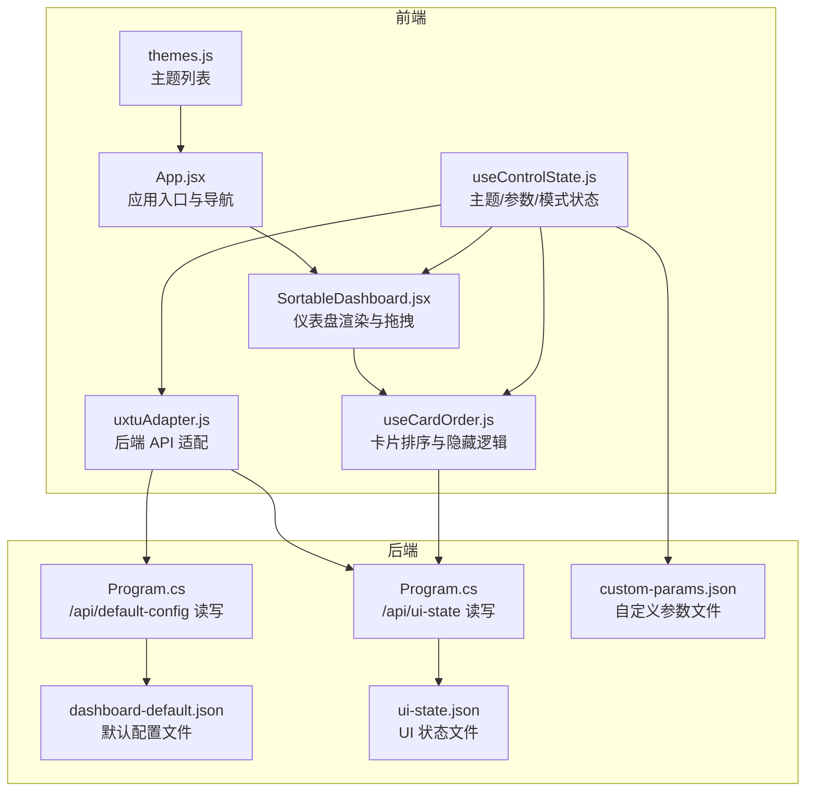
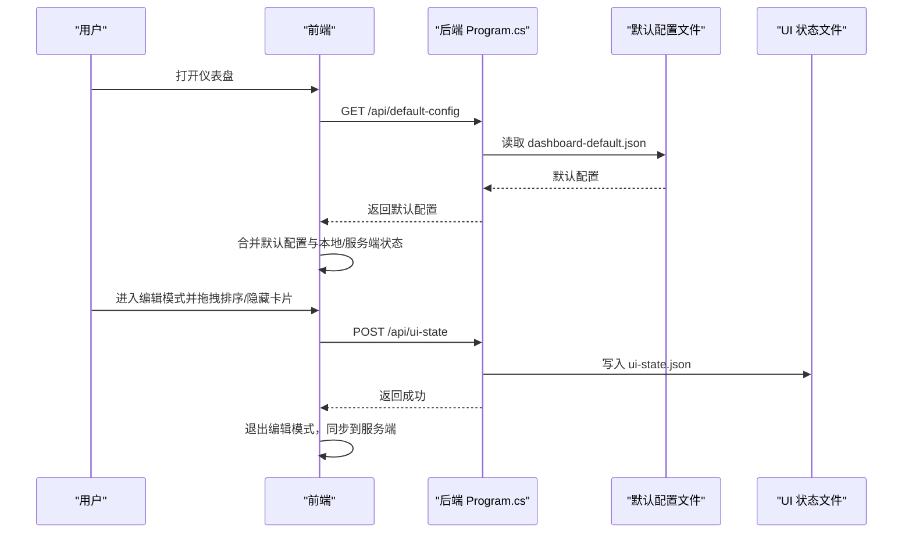
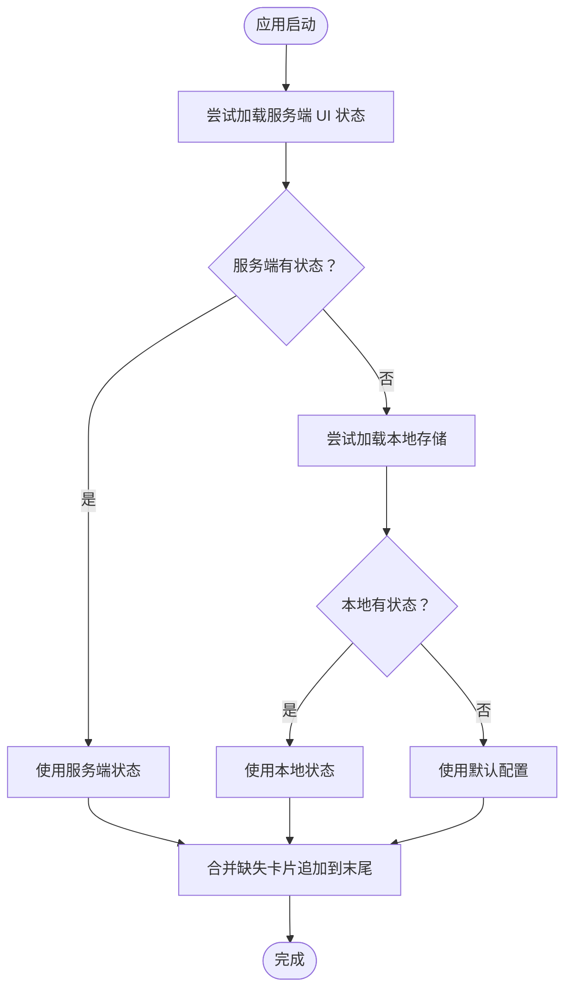
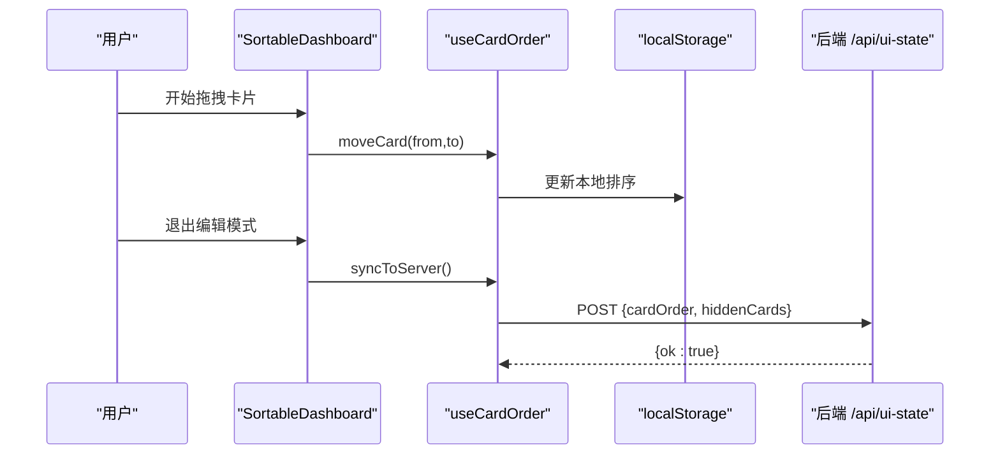
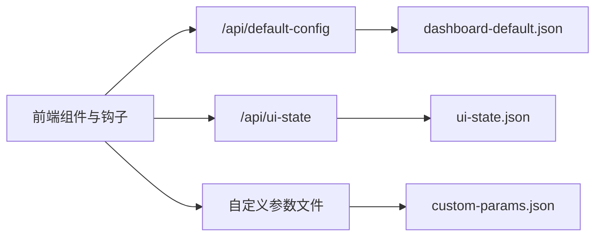

# 默认配置模板

<cite>
**本文档引用的文件**
- [dashboard-default.json](file://server/config/dashboard-default.json)
- [Program.cs](file://server/api/Program.cs)
- [SortableDashboard.jsx](file://src/components/SortableDashboard.jsx)
- [useCardOrder.js](file://src/hooks/useCardOrder.js)
- [useControlState.js](file://src/hooks/useControlState.js)
- [uxtuAdapter.js](file://src/services/uxtuAdapter.js)
- [custom-params.json](file://server/api/config/custom-params.json)
- [ui-state.json](file://server/api/config/ui-state.json)
- [themes.js](file://src/data/themes.js)
- [App.jsx](file://src/App.jsx)
- [PerformancePanel.jsx](file://src/components/panels/PerformancePanel.jsx)
- [SettingsPanel.jsx](file://src/components/panels/SettingsPanel.jsx)
</cite>

## 目录
1. [简介](#简介)
2. [项目结构](#项目结构)
3. [核心组件](#核心组件)
4. [架构总览](#架构总览)
5. [详细组件分析](#详细组件分析)
6. [依赖关系分析](#依赖关系分析)
7. [性能考量](#性能考量)
8. [故障排查指南](#故障排查指南)
9. [结论](#结论)
10. [附录](#附录)

## 简介
本文件聚焦“默认配置模板系统”，围绕仪表盘默认配置文件 dashboard-default.json 的作用、结构与行为展开，结合前端排序与隐藏逻辑、后端默认配置接口与持久化策略，系统阐述默认配置与用户配置的优先级关系与合并策略，并给出模板设计原则、可定制性、修改与扩展方法、版本管理与兼容性建议，以及配置重置与恢复出厂设置的操作说明。

## 项目结构
默认配置模板系统横跨前端与后端：
- 前端负责仪表盘卡片的排序与可见性管理、主题与模式参数的持久化与下发。
- 后端提供默认配置的读取与写入接口，以及 UI 状态的持久化接口。

图表来源
- [Program.cs](file://server/api/Program.cs)
- [SortableDashboard.jsx](file://src/components/SortableDashboard.jsx)
- [useCardOrder.js](file://src/hooks/useCardOrder.js)
- [useControlState.js](file://src/hooks/useControlState.js)
- [uxtuAdapter.js](file://src/services/uxtuAdapter.js)
- [dashboard-default.json](file://server/config/dashboard-default.json)
- [ui-state.json](file://server/api/config/ui-state.json)
- [custom-params.json](file://server/api/config/custom-params.json)
- [themes.js](file://src/data/themes.js)
- [App.jsx](file://src/App.jsx)

章节来源
- [Program.cs](file://server/api/Program.cs)
- [dashboard-default.json](file://server/config/dashboard-default.json)
- [ui-state.json](file://server/api/config/ui-state.json)
- [custom-params.json](file://server/api/config/custom-params.json)
- [SortableDashboard.jsx](file://src/components/SortableDashboard.jsx)
- [useCardOrder.js](file://src/hooks/useCardOrder.js)
- [useControlState.js](file://src/hooks/useControlState.js)
- [uxtuAdapter.js](file://src/services/uxtuAdapter.js)
- [themes.js](file://src/data/themes.js)
- [App.jsx](file://src/App.jsx)

## 核心组件
- 默认配置文件：dashboard-default.json，定义仪表盘默认卡片顺序与默认隐藏项。
- 前端排序与隐藏钩子：useCardOrder.js，负责从本地存储与服务端加载 UI 状态，提供拖拽排序、隐藏/显示、重置等功能。
- 仪表盘渲染组件：SortableDashboard.jsx，根据当前卡片集合渲染具体面板。
- 后端接口：Program.cs 提供 /api/default-config 与 /api/ui-state 的 GET/POST，分别读写默认配置与 UI 状态。
- 状态与参数：useControlState.js 负责主题、模式、风扇目标转速、自定义参数等状态的持久化与下发。

章节来源
- [dashboard-default.json](file://server/config/dashboard-default.json)
- [useCardOrder.js](file://src/hooks/useCardOrder.js)
- [SortableDashboard.jsx](file://src/components/SortableDashboard.jsx)
- [Program.cs](file://server/api/Program.cs)
- [useControlState.js](file://src/hooks/useControlState.js)

## 架构总览
默认配置模板系统遵循“默认文件 + 用户覆盖”的分层策略：
- 默认层：dashboard-default.json 提供初始卡片顺序与默认隐藏项。
- 用户层：ui-state.json 记录用户通过前端编辑模式保存的排序与隐藏状态。
- 本地层：localStorage 存储卡片排序与隐藏的临时状态，作为启动时的中间层。
- 下发层：useControlState.js 在模式切换与参数变更时，将当前参数下发至后端。

图表来源
- [Program.cs](file://server/api/Program.cs)
- [dashboard-default.json](file://server/config/dashboard-default.json)
- [ui-state.json](file://server/api/config/ui-state.json)
- [useCardOrder.js](file://src/hooks/useCardOrder.js)

## 详细组件分析

### dashboard-default.json 结构与作用
- 文件位置：server/config/dashboard-default.json
- 结构要点：
  - order：默认卡片顺序数组，决定首次渲染时的展示顺序。
  - hidden：默认隐藏的卡片 ID 数组，启动时即生效。
- 设计意义：作为“出厂默认”模板，确保新用户或重置后的用户获得一致的初始体验。

章节来源
- [dashboard-default.json](file://server/config/dashboard-default.json)

### 默认配置与用户配置的优先级与合并策略
- 优先级（从高到低）：服务端 UI 状态 > 本地存储 > 默认配置
- 合并策略：
  - 启动时，前端先从服务端加载 UI 状态（/api/ui-state），若存在则以服务端为准。
  - 若服务端无状态，则回退到本地存储（localStorage）中的卡片排序与隐藏集合。
  - 若本地也无状态，则采用默认配置（dashboard-default.json）。
  - 对于“缺失项”的处理：若本地/服务端状态缺少某些默认卡片，前端会将这些缺失卡片追加到末尾，保证所有默认卡片均被呈现。

图表来源
- [useCardOrder.js](file://src/hooks/useCardOrder.js)
- [Program.cs](file://server/api/Program.cs)
- [dashboard-default.json](file://server/config/dashboard-default.json)
- [ui-state.json](file://server/api/config/ui-state.json)

章节来源
- [useCardOrder.js](file://src/hooks/useCardOrder.js)
- [Program.cs](file://server/api/Program.cs)

### 前端排序与隐藏逻辑（SortableDashboard 与 useCardOrder）
- 排序：
  - 编辑模式下启用拖拽，拖拽结束触发 moveCard，更新 order 并持久化到本地存储。
  - 退出编辑模式时，将当前 order 与 hiddenCards 通过 POST /api/ui-state 同步到服务端。
- 隐藏/显示：
  - toggleHidden 切换隐藏集合，hiddenList 用于在编辑模式底部展示“已隐藏模块”。
  - showAll 清空隐藏集合，恢复全部卡片。
- 重置：
  - resetOrder 将 order 与 hidden 设置为默认值，实现“恢复出厂设置”。

图表来源
- [SortableDashboard.jsx](file://src/components/SortableDashboard.jsx)
- [useCardOrder.js](file://src/hooks/useCardOrder.js)
- [Program.cs](file://server/api/Program.cs)

章节来源
- [SortableDashboard.jsx](file://src/components/SortableDashboard.jsx)
- [useCardOrder.js](file://src/hooks/useCardOrder.js)

### 后端默认配置接口与持久化
- /api/default-config
  - GET：读取 dashboard-default.json 返回给前端。
  - POST：接收前端提交的默认配置对象，写入 dashboard-default.json。
- /api/ui-state
  - GET：读取 ui-state.json 返回给前端。
  - POST：接收前端提交的 UI 状态对象，写入 ui-state.json。
- 类型定义：
  - DefaultConfig：包含 Order 与 Hidden 两个字符串数组字段。
  - UiState：包含 CardOrder 与 HiddenCards 两个字符串数组字段。

章节来源
- [Program.cs](file://server/api/Program.cs)
- [dashboard-default.json](file://server/config/dashboard-default.json)
- [ui-state.json](file://server/api/config/ui-state.json)

### 配置模板的设计原则与可定制性
- 设计原则
  - 最小可用：默认只包含核心监控与调节面板，避免信息过载。
  - 可扩展：卡片 ID 与渲染映射分离，便于新增面板而不破坏现有结构。
  - 可恢复：提供重置排序功能，一键回到默认顺序与默认隐藏项。
- 可定制性
  - 默认配置文件：通过修改 dashboard-default.json 可调整默认顺序与默认隐藏项。
  - UI 状态文件：通过 ui-state.json 可记录用户偏好，实现个性化布局。
  - 本地存储：localStorage 作为临时状态，便于快速试验与回滚。

章节来源
- [dashboard-default.json](file://server/config/dashboard-default.json)
- [ui-state.json](file://server/api/config/ui-state.json)
- [useCardOrder.js](file://src/hooks/useCardOrder.js)

### 默认配置的修改与扩展方法
- 新增面板
  - 在前端：在 SortableDashboard 的卡片映射中添加新的 ID 与渲染逻辑。
  - 在默认配置：在 dashboard-default.json 的 order 中加入新 ID。
  - 在 UI 状态：如需默认隐藏新面板，可在 hidden 中加入对应 ID。
- 调整布局
  - 通过拖拽排序改变 order，退出编辑模式后同步到服务端。
  - 使用“全部显示”恢复隐藏卡片，或使用“重置排序”回到默认顺序。
- 自定义主题
  - 通过主题切换器切换主题，主题样式由 CSS 变量统一控制。

章节来源
- [SortableDashboard.jsx](file://src/components/SortableDashboard.jsx)
- [dashboard-default.json](file://server/config/dashboard-default.json)
- [ui-state.json](file://server/api/config/ui-state.json)
- [themes.js](file://src/data/themes.js)

### 版本管理与向后兼容性
- 版本管理建议
  - 为 dashboard-default.json 引入版本号字段，便于后续升级时进行迁移。
  - 对新增卡片 ID，保持向后兼容：旧版本忽略未知 ID，新版本自动追加到末尾。
- 兼容性策略
  - 服务端接口对字段大小写不敏感，降低客户端与服务端耦合度。
  - 对于可能的字段冲突，采用“服务端覆盖本地/默认”的策略，确保一致性。

章节来源
- [Program.cs](file://server/api/Program.cs)
- [useCardOrder.js](file://src/hooks/useCardOrder.js)

### 配置重置与恢复出厂设置
- 恢复出厂设置
  - 在前端：点击“重置排序”，将排序与隐藏恢复为默认值。
  - 在后端：通过 /api/default-config POST 写入默认配置，实现全局恢复。
- 恢复 UI 状态
  - 删除 ui-state.json 或调用 /api/ui-state GET，前端将回退到默认配置。

章节来源
- [useCardOrder.js](file://src/hooks/useCardOrder.js)
- [Program.cs](file://server/api/Program.cs)
- [dashboard-default.json](file://server/config/dashboard-default.json)
- [ui-state.json](file://server/api/config/ui-state.json)

## 依赖关系分析
- 前端依赖后端接口：
  - /api/default-config：读取与写入默认配置。
  - /api/ui-state：读取与写入 UI 状态。
- 前端内部依赖：
  - useCardOrder：管理排序与隐藏集合。
  - SortableDashboard：渲染卡片并提供编辑模式交互。
  - useControlState：管理主题、模式与参数状态。
- 后端依赖文件：
  - dashboard-default.json：默认配置模板。
  - ui-state.json：用户 UI 状态持久化。

图表来源
- [Program.cs](file://server/api/Program.cs)
- [dashboard-default.json](file://server/config/dashboard-default.json)
- [ui-state.json](file://server/api/config/ui-state.json)
- [custom-params.json](file://server/api/config/custom-params.json)
- [useCardOrder.js](file://src/hooks/useCardOrder.js)
- [SortableDashboard.jsx](file://src/components/SortableDashboard.jsx)
- [useControlState.js](file://src/hooks/useControlState.js)

章节来源
- [Program.cs](file://server/api/Program.cs)
- [dashboard-default.json](file://server/config/dashboard-default.json)
- [ui-state.json](file://server/api/config/ui-state.json)
- [custom-params.json](file://server/api/config/custom-params.json)
- [useCardOrder.js](file://src/hooks/useCardOrder.js)
- [SortableDashboard.jsx](file://src/components/SortableDashboard.jsx)
- [useControlState.js](file://src/hooks/useControlState.js)

## 性能考量
- 前端性能
  - 拖拽排序与隐藏操作仅影响本地状态，避免频繁网络请求。
  - UI 状态同步在退出编辑模式时一次性提交，减少服务端压力。
- 后端性能
  - 默认配置与 UI 状态均为轻量 JSON 文件，读写成本低。
  - 采用流式读取与写入，异常时返回错误信息，不影响主流程。

## 故障排查指南
- 默认配置未生效
  - 检查 /api/default-config 是否返回正确内容。
  - 确认 dashboard-default.json 语法正确且字段齐全。
- UI 状态不同步
  - 确认 /api/ui-state POST 是否返回成功。
  - 检查 ui-state.json 是否被正确写入。
- 卡片顺序异常
  - 查看本地存储与服务端状态是否冲突。
  - 使用“重置排序”恢复默认顺序。

章节来源
- [Program.cs](file://server/api/Program.cs)
- [dashboard-default.json](file://server/config/dashboard-default.json)
- [ui-state.json](file://server/api/config/ui-state.json)
- [useCardOrder.js](file://src/hooks/useCardOrder.js)

## 结论
默认配置模板系统通过“默认文件 + 用户覆盖”的分层设计，实现了稳定、可扩展且易于维护的仪表盘布局与初始设置。前端与后端协同工作，确保用户偏好与默认模板之间的优先级清晰、合并策略合理。通过明确的接口与持久化策略，系统具备良好的可定制性与可恢复性，满足从个人定制到团队标准化的多种场景需求。

## 附录
- 相关文件与职责
  - dashboard-default.json：默认仪表盘布局与初始设置。
  - ui-state.json：用户 UI 状态持久化。
  - custom-params.json：自定义参数持久化。
  - Program.cs：默认配置与 UI 状态的读写接口。
  - SortableDashboard.jsx 与 useCardOrder.js：排序与隐藏的前端实现。
  - useControlState.js：主题、模式与参数的状态管理与下发。

章节来源
- [dashboard-default.json](file://server/config/dashboard-default.json)
- [ui-state.json](file://server/api/config/ui-state.json)
- [custom-params.json](file://server/api/config/custom-params.json)
- [Program.cs](file://server/api/Program.cs)
- [SortableDashboard.jsx](file://src/components/SortableDashboard.jsx)
- [useCardOrder.js](file://src/hooks/useCardOrder.js)
- [useControlState.js](file://src/hooks/useControlState.js)
- [App.jsx](file://src/App.jsx)
- [PerformancePanel.jsx](file://src/components/panels/PerformancePanel.jsx)
- [SettingsPanel.jsx](file://src/components/panels/SettingsPanel.jsx)
- [themes.js](file://src/data/themes.js)